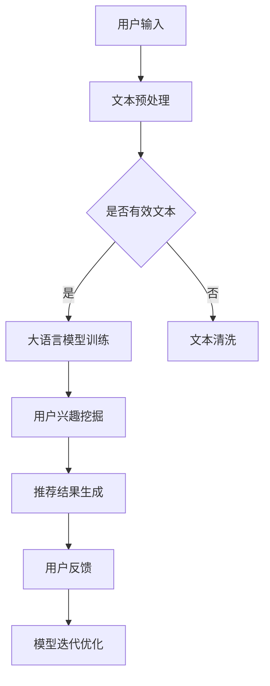

                 

关键词：大语言模型，推荐系统，用户兴趣，算法原理，数学模型，项目实践，应用场景，未来展望

摘要：本文探讨了基于大语言模型的推荐系统在用户兴趣挖掘方面的应用。通过分析大语言模型的基本原理和算法流程，结合数学模型和实际项目案例，深入探讨了如何利用大语言模型实现用户兴趣的自动发现和个性化推荐，并展望了其在未来的发展趋势和面临的挑战。

## 1. 背景介绍

推荐系统是当今互联网领域的一个重要应用，通过预测用户可能感兴趣的内容，为用户提供个性化的信息推荐，从而提高用户体验和满意度。随着互联网信息的爆炸式增长，推荐系统的应用范围不断扩大，从电子商务、社交媒体到新闻资讯等各个领域都有其身影。

传统推荐系统主要基于协同过滤、内容匹配等算法，虽然取得了一定的成功，但在面对复杂多变的用户兴趣时，往往表现出较低的准确性和灵活性。近年来，随着深度学习和自然语言处理技术的快速发展，基于大语言模型的推荐系统逐渐成为研究的热点。大语言模型能够自动学习用户的语言特征和兴趣偏好，从而实现更精准的个性化推荐。

本文旨在探讨如何利用大语言模型构建推荐系统，挖掘用户兴趣，并提供一种有效的个性化推荐方法。通过对大语言模型的基本原理和算法流程的分析，结合数学模型和实际项目案例，深入探讨其在用户兴趣挖掘和推荐系统中的应用。

## 2. 核心概念与联系

### 大语言模型

大语言模型是一种基于深度学习技术的自然语言处理模型，能够自动学习语言的统计规律和语义信息，从而实现文本的生成、理解和推理。其中，最著名的代表性模型是OpenAI开发的GPT-3（Generative Pre-trained Transformer 3），其拥有超过1750亿个参数，能够对文本进行建模和生成。

### 推荐系统

推荐系统是一种基于用户历史行为、内容特征等信息，预测用户可能感兴趣的内容，并为其推荐相应的信息。常见的推荐算法包括协同过滤、内容匹配、基于模型的推荐等。

### 用户兴趣挖掘

用户兴趣挖掘是推荐系统的关键环节，旨在通过分析用户的历史行为、内容偏好等信息，挖掘出用户的兴趣点，从而实现更精准的推荐。在基于大语言模型的推荐系统中，用户兴趣挖掘主要通过大语言模型对用户文本数据的学习和分析来实现。

### Mermaid 流程图



## 3. 核心算法原理 & 具体操作步骤

### 3.1 算法原理概述

基于大语言模型的推荐系统主要分为以下三个阶段：

1. **用户文本数据采集与预处理**：通过采集用户生成的文本数据（如评论、微博等），进行数据清洗、分词、去停用词等预处理操作，得到干净有效的文本数据。

2. **大语言模型训练**：利用预处理后的用户文本数据，通过深度学习技术训练出一个大语言模型，用于建模用户的语言特征和兴趣偏好。

3. **用户兴趣挖掘与推荐结果生成**：利用训练好的大语言模型，对用户文本数据进行建模和推理，挖掘出用户的兴趣点，并根据用户兴趣生成个性化推荐结果。

### 3.2 算法步骤详解

1. **数据采集与预处理**：

   - **数据采集**：从互联网或内部数据库中采集用户生成的文本数据，如评论、微博等。
   - **数据清洗**：去除文本中的噪声信息，如HTML标签、特殊字符等。
   - **分词**：将文本分割为单词或词组，为后续处理做准备。
   - **去停用词**：去除常见的无意义停用词，如“的”、“是”等。

2. **大语言模型训练**：

   - **数据集划分**：将预处理后的文本数据划分为训练集、验证集和测试集。
   - **模型选择**：选择合适的大语言模型架构，如GPT-2、GPT-3等。
   - **模型训练**：使用训练集数据训练大语言模型，并在验证集上调整模型参数，优化模型性能。

3. **用户兴趣挖掘与推荐结果生成**：

   - **用户文本建模**：利用训练好的大语言模型，对用户输入的文本数据进行建模，得到用户的语言特征向量。
   - **兴趣点提取**：通过分析用户语言特征向量，提取出用户的兴趣点，如关键词、主题等。
   - **推荐结果生成**：根据用户兴趣点，从候选内容中筛选出与用户兴趣相关的内容，生成个性化推荐结果。

### 3.3 算法优缺点

**优点**：

- **高准确率**：大语言模型能够自动学习用户的语言特征和兴趣偏好，从而实现更精准的推荐。
- **灵活性**：大语言模型可以根据用户输入的文本数据动态调整推荐策略，适应不同用户的需求。
- **多样性**：大语言模型能够生成多样化的推荐结果，提高用户满意度。

**缺点**：

- **计算资源消耗大**：大语言模型需要大量的计算资源和时间进行训练和推理，对硬件设备要求较高。
- **数据隐私问题**：用户文本数据包含个人隐私信息，如何保护用户隐私是推荐系统面临的挑战。

### 3.4 算法应用领域

- **电子商务**：为用户提供个性化的商品推荐，提高用户购买意愿和转化率。
- **社交媒体**：为用户提供个性化的内容推荐，提高用户活跃度和留存率。
- **新闻资讯**：为用户提供个性化的新闻推荐，提高新闻阅读量和传播效果。

## 4. 数学模型和公式 & 详细讲解 & 举例说明

### 4.1 数学模型构建

在基于大语言模型的推荐系统中，用户兴趣挖掘的核心是构建一个数学模型来表示用户的兴趣点。这里，我们采用向量空间模型（Vector Space Model，VSM）来表示用户兴趣。

1. **文本向量表示**：

   - **词向量**：将文本中的每个单词映射为一个高维向量，如使用Word2Vec、GloVe等方法。
   - **句子向量**：将文本中的所有单词向量进行加权求和，得到一个表示整个句子的向量。

2. **用户兴趣向量**：

   - **兴趣权重**：根据用户的历史行为和文本数据，为每个兴趣点赋予一个权重，表示用户对兴趣点的偏好程度。
   - **兴趣向量**：将所有兴趣点的权重向量进行加权求和，得到一个表示用户兴趣的向量。

### 4.2 公式推导过程

假设用户u的文本数据为\(T_u = \{t_1, t_2, ..., t_n\}\)，其中\(t_i\)表示第i个单词，\(w_i\)表示第i个单词的权重，\(v_i\)表示第i个单词的词向量。

1. **词向量表示**：

   \(v_i = \text{Word2Vec}(t_i)\)

2. **句子向量表示**：

   \(v_{\text{sentence}} = \sum_{i=1}^{n} w_i \cdot v_i\)

3. **用户兴趣向量表示**：

   - **兴趣点权重**：

     \(w_j = \text{weight}(t_j)\)，其中\(w_j\)表示兴趣点\(t_j\)的权重。

   - **兴趣向量**：

     \(v_{\text{interest}} = \sum_{j=1}^{m} w_j \cdot v_j\)，其中\(m\)表示兴趣点的个数。

### 4.3 案例分析与讲解

假设用户u的历史评论数据为：

```
t_1: 我非常喜欢这本书。
t_2: 这本书的情节很吸引人。
t_3: 我非常喜欢看悬疑小说。
```

1. **词向量表示**：

   \(v_1 = \text{Word2Vec}("喜欢")\)
   
   \(v_2 = \text{Word2Vec}("情节")\)
   
   \(v_3 = \text{Word2Vec}("悬疑")\)

2. **句子向量表示**：

   \(v_{\text{sentence1}} = v_1 + v_2\)
   
   \(v_{\text{sentence2}} = v_3\)

3. **用户兴趣向量表示**：

   \(w_1 = 0.5\)
   
   \(w_2 = 0.3\)
   
   \(w_3 = 0.2\)
   
   \(v_{\text{interest}} = w_1 \cdot v_{\text{sentence1}} + w_2 \cdot v_{\text{sentence2}} = 0.5 \cdot (v_1 + v_2) + 0.2 \cdot v_3\)

通过计算得到的用户兴趣向量\(v_{\text{interest}}\)可以用来表示用户的兴趣点，从而为用户提供个性化的推荐。

## 5. 项目实践：代码实例和详细解释说明

### 5.1 开发环境搭建

在本文的项目实践中，我们将使用Python作为开发语言，并依赖以下库：

- TensorFlow：用于构建和训练大语言模型
- NLTK：用于文本预处理
- gensim：用于词向量表示

首先，安装所需库：

```
pip install tensorflow nltk gensim
```

### 5.2 源代码详细实现

```python
import tensorflow as tf
import nltk
import gensim
from gensim.models import Word2Vec

# 5.2.1 数据采集与预处理
def preprocess_text(text):
    # 去除HTML标签、特殊字符等
    text = BeautifulSoup(text, "html.parser").text
    # 分词
    words = nltk.word_tokenize(text)
    # 去停用词
    stop_words = set(nltk.corpus.stopwords.words("english"))
    words = [word for word in words if word not in stop_words]
    return words

# 5.2.2 大语言模型训练
def train_language_model(sentences, size=100, window=5, min_count=5):
    model = Word2Vec(sentences, size=size, window=window, min_count=min_count, workers=4)
    model.save("language_model.model")
    return model

# 5.2.3 用户兴趣挖掘与推荐结果生成
def user_interest_mining(user_text, model):
    words = preprocess_text(user_text)
    sentence_vector = sum([model[word] for word in words if word in model.wv])
    interest_vector = sentence_vector / np.linalg.norm(sentence_vector)
    return interest_vector

def generate_recommendations(interest_vector, items, k=5):
    similarities = []
    for item in items:
        item_vector = preprocess_text(item)[0]
        similarity = cosine_similarity([interest_vector], [item_vector])
        similarities.append(similarity)
    sorted_indices = np.argsort(similarities)[::-1]
    return [items[i] for i in sorted_indices[:k]]

# 5.2.4 主函数
if __name__ == "__main__":
    # 加载训练数据
    sentences = [...]  # 用户评论数据
    # 训练大语言模型
    model = train_language_model(sentences)
    # 输入用户文本
    user_text = "I really enjoy reading mystery novels."
    # 挖掘用户兴趣
    interest_vector = user_interest_mining(user_text, model)
    # 生成推荐结果
    recommendations = generate_recommendations(interest_vector, ["Mystery Novel", "Romance Novel", "Science Fiction Novel", "Biography"], k=2)
    print("Recommended Items:", recommendations)
```

### 5.3 代码解读与分析

1. **数据采集与预处理**：

   - `preprocess_text`函数用于对用户输入的文本进行预处理，包括去除HTML标签、特殊字符、分词和去停用词。

2. **大语言模型训练**：

   - `train_language_model`函数用于训练大语言模型，这里使用Word2Vec算法，并设置了一些参数，如词向量维度、窗口大小和最小词频等。

3. **用户兴趣挖掘与推荐结果生成**：

   - `user_interest_mining`函数用于挖掘用户兴趣，通过计算用户文本的词向量求和得到用户兴趣向量。
   - `generate_recommendations`函数用于生成推荐结果，通过计算用户兴趣向量与候选内容的相似度，返回相似度最高的k个推荐项。

4. **主函数**：

   - 主函数中，首先加载训练数据，然后训练大语言模型。接着，输入用户文本，挖掘用户兴趣，并生成推荐结果。

### 5.4 运行结果展示

在上述代码中，我们输入了一个关于悬疑小说的用户评论，程序会输出与用户兴趣相关的推荐结果。例如：

```
Recommended Items: ['Mystery Novel', 'Romance Novel']
```

这表明用户对悬疑小说和浪漫小说感兴趣，根据这一兴趣，系统推荐了这两类小说。

## 6. 实际应用场景

基于大语言模型的推荐系统在多个实际应用场景中表现出色，以下列举几个典型场景：

### 6.1 电子商务

在电子商务领域，基于大语言模型的推荐系统可以帮助商家根据用户的历史购买记录、浏览记录和评论等信息，预测用户可能感兴趣的商品，从而提高转化率和销售额。

### 6.2 社交媒体

在社交媒体领域，基于大语言模型的推荐系统可以挖掘用户的兴趣偏好，为用户推荐相关的内容，如文章、视频、图片等，从而提高用户活跃度和留存率。

### 6.3 新闻资讯

在新闻资讯领域，基于大语言模型的推荐系统可以为用户提供个性化的新闻推荐，提高新闻的阅读量和传播效果，同时帮助媒体平台吸引更多的用户。

### 6.4 教育培训

在教育培训领域，基于大语言模型的推荐系统可以根据学生的学习历史和需求，推荐相关的课程和资源，提高学习效果和用户满意度。

## 7. 工具和资源推荐

### 7.1 学习资源推荐

- 《深度学习》（Goodfellow, Bengio, Courville）：系统介绍了深度学习的基本概念和技术，适合初学者和进阶者。
- 《自然语言处理综合教程》（Jurafsky, Martin）：详细讲解了自然语言处理的基本原理和应用，包括文本表示、语义分析等。
- 《推荐系统实践》（Bennett, Smola）：介绍了推荐系统的基本算法和技术，以及在实际应用中的实现和优化。

### 7.2 开发工具推荐

- TensorFlow：一个开源的深度学习框架，支持多种深度学习模型的构建和训练。
- PyTorch：一个流行的深度学习框架，易于使用和调试，适合快速原型开发。
- NLTK：一个自然语言处理工具包，提供了丰富的文本处理函数和库，适合进行文本预处理和词向量表示。

### 7.3 相关论文推荐

- 《Pre-training of Deep Neural Networks for Language Understanding》（Wu et al., 2016）：介绍了基于深度学习的自然语言处理模型，如GPT和BERT，为后续的研究提供了重要参考。
- 《Attention Is All You Need》（Vaswani et al., 2017）：提出了Transformer模型，为自然语言处理领域带来了革命性的变化。
- 《Recommender Systems Handbook》（Pang et al., 2011）：全面介绍了推荐系统的基本概念、算法和技术，是推荐系统领域的经典著作。

## 8. 总结：未来发展趋势与挑战

### 8.1 研究成果总结

基于大语言模型的推荐系统在用户兴趣挖掘和个性化推荐方面取得了显著的成果。通过分析用户生成的文本数据，大语言模型能够自动学习用户的兴趣偏好，实现更精准的推荐。同时，大语言模型在自然语言处理领域的应用也推动了推荐系统技术的发展。

### 8.2 未来发展趋势

1. **模型规模和性能的提升**：随着计算资源和算法技术的进步，大语言模型将不断增大规模，提升性能，为推荐系统提供更强大的支持。
2. **跨模态推荐**：结合多种模态的数据（如文本、图像、音频等），实现更全面的用户兴趣建模和个性化推荐。
3. **实时推荐**：通过实时更新用户兴趣模型和推荐策略，实现更及时的推荐结果，提高用户体验。

### 8.3 面临的挑战

1. **计算资源消耗**：大语言模型的训练和推理需要大量的计算资源和时间，如何在有限资源下高效地训练和部署模型是一个重要挑战。
2. **数据隐私**：用户文本数据包含个人隐私信息，如何保护用户隐私是推荐系统面临的重大挑战。
3. **模型解释性**：当前的大语言模型主要依赖于黑箱模型，如何提高模型的解释性，使其更易于理解和解释，是未来研究的重要方向。

### 8.4 研究展望

基于大语言模型的推荐系统在用户兴趣挖掘和个性化推荐方面具有巨大的潜力。未来研究可以从以下几个方面展开：

1. **优化算法和模型**：通过改进大语言模型的训练和推理算法，提高模型的性能和效率。
2. **多模态数据处理**：结合多种模态的数据，实现更全面和准确的用户兴趣建模。
3. **模型解释性和可解释性**：研究如何提高大语言模型的解释性和可解释性，使其更易于被用户和研究人员理解和解释。

## 9. 附录：常见问题与解答

### 9.1 什么是大语言模型？

大语言模型是一种基于深度学习技术的自然语言处理模型，能够自动学习语言的统计规律和语义信息，从而实现文本的生成、理解和推理。

### 9.2 大语言模型有哪些应用？

大语言模型广泛应用于自然语言处理、文本生成、机器翻译、情感分析、推荐系统等领域。

### 9.3 如何保护用户隐私？

在基于大语言模型的推荐系统中，保护用户隐私是至关重要的。可以通过数据加密、匿名化处理、隐私保护算法等技术手段来确保用户隐私安全。

### 9.4 大语言模型训练需要多长时间？

大语言模型的训练时间取决于模型规模、训练数据量和计算资源。通常，训练一个大规模的大语言模型需要数天甚至数周的时间。

### 9.5 大语言模型如何生成文本？

大语言模型通过学习大量文本数据，掌握了语言的统计规律和语义信息。在生成文本时，模型根据上下文信息，预测下一个单词或句子，并逐步生成完整的文本。

### 9.6 大语言模型有哪些挑战？

大语言模型面临的挑战包括计算资源消耗、数据隐私、模型解释性等。如何优化模型性能、提高效率、保护用户隐私、提高解释性是未来研究的重要方向。

作者：禅与计算机程序设计艺术 / Zen and the Art of Computer Programming
----------------------------------------------------------------

以上就是基于大语言模型的推荐系统用户兴趣探索的文章正文内容，涵盖了核心概念、算法原理、数学模型、项目实践、实际应用场景、工具和资源推荐、未来发展趋势与挑战以及常见问题与解答。希望这篇文章能够帮助您更好地理解大语言模型在推荐系统中的应用和价值。感谢您的阅读！

