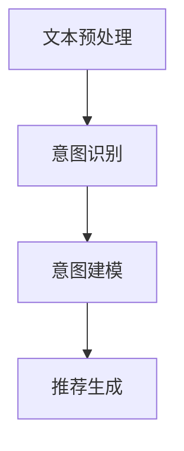

                 

关键词：大语言模型、推荐系统、用户意图、自然语言处理、机器学习、深度学习

> 摘要：随着互联网的迅猛发展，推荐系统已经成为各大公司提升用户体验、增加用户粘性的重要手段。然而，准确理解用户意图是构建高效推荐系统的基础。本文将探讨如何利用大语言模型来提升推荐系统对用户意图的解析能力，并提出了一种基于大语言模型的推荐系统用户意图理解框架。通过对实际应用案例的剖析，本文展示了该框架在推荐系统中的应用效果，并为未来的发展方向提出了建议。

## 1. 背景介绍

### 推荐系统概述

推荐系统是一种信息过滤技术，旨在向用户推荐其可能感兴趣的内容。随着互联网的快速发展，用户产生的内容和数据量呈现爆炸式增长，推荐系统在电子商务、社交媒体、新闻推送等领域发挥了重要作用。传统推荐系统主要基于协同过滤、基于内容的推荐等方法，这些方法在一定程度上提高了推荐的准确性，但往往忽略了用户意图的复杂性。

### 用户意图理解的重要性

用户意图是指用户在搜索、浏览、互动等行为中表现出的目的或需求。准确理解用户意图对于推荐系统至关重要，因为只有理解了用户的真实需求，推荐系统才能提供更加个性化、精准的服务。然而，用户意图的表达通常是隐式的，可能包含在文本、语音、图像等多种形式中，这给推荐系统的设计带来了巨大挑战。

### 大语言模型的应用

近年来，随着深度学习和自然语言处理技术的不断发展，大语言模型（如GPT、BERT）在自然语言理解任务中取得了显著进展。这些模型具有强大的语义理解和生成能力，能够有效地捕捉用户意图的细微差别，为推荐系统提供了新的技术手段。

## 2. 核心概念与联系

### 大语言模型简介

大语言模型是一种基于深度学习的自然语言处理模型，通过学习海量文本数据，可以自动地理解和生成自然语言。这些模型通常包含数十亿个参数，具备高度的语言理解能力。例如，GPT（Generative Pre-trained Transformer）和BERT（Bidirectional Encoder Representations from Transformers）是两种广泛使用的大语言模型。

### 推荐系统架构

推荐系统通常包括用户特征提取、商品特征提取、相似度计算、推荐策略等模块。用户特征和商品特征用于表示用户和商品的属性，相似度计算用于评估用户和商品之间的相关性，推荐策略则用于生成推荐结果。

### 用户意图理解框架

基于大语言模型的推荐系统用户意图理解框架包括以下几个关键组成部分：

1. **文本预处理**：对用户输入的文本进行清洗、分词、去停用词等预处理操作，以便大语言模型能够更好地理解和分析。
2. **意图识别**：利用大语言模型对预处理后的文本进行分析，提取用户意图的关键信息。
3. **意图建模**：将提取到的意图信息转化为数值化的模型输入，例如使用词向量或向量嵌入。
4. **推荐生成**：结合用户和商品的特性，利用推荐算法生成个性化的推荐结果。

### Mermaid 流程图



## 3. 核心算法原理 & 具体操作步骤

### 3.1 算法原理概述

基于大语言模型的推荐系统用户意图理解算法主要利用深度学习技术对用户输入文本进行分析，提取用户意图，并将其转化为推荐系统的输入。算法的核心步骤包括文本预处理、意图识别和推荐生成。

### 3.2 算法步骤详解

1. **文本预处理**：对用户输入的文本进行清洗、分词、去停用词等操作，以便大语言模型能够更好地理解和分析。
2. **意图识别**：利用大语言模型对预处理后的文本进行分析，通过多层神经网络提取用户意图的关键信息。例如，可以使用BERT模型进行文本编码，然后通过全连接层进行意图分类。
3. **意图建模**：将提取到的意图信息转化为数值化的模型输入，例如使用词向量或向量嵌入。这一步通常使用嵌入层或嵌入神经网络来完成。
4. **推荐生成**：结合用户和商品的特性，利用推荐算法生成个性化的推荐结果。常见的推荐算法包括协同过滤、基于内容的推荐和矩阵分解等。

### 3.3 算法优缺点

**优点**：
- **强大的语义理解能力**：大语言模型具有强大的语义理解能力，能够准确地提取用户意图。
- **适应性强**：算法可以处理多种形式的用户输入，如文本、语音、图像等。

**缺点**：
- **计算资源消耗大**：大语言模型通常包含数十亿个参数，训练和推理过程需要大量的计算资源。
- **训练时间较长**：大语言模型的训练通常需要较长时间，这对于实时性要求较高的应用场景可能不太适用。

### 3.4 算法应用领域

基于大语言模型的推荐系统用户意图理解算法可以应用于多个领域，如电子商务、社交媒体、新闻推送等。在电子商务领域，该算法可以帮助平台更准确地推荐用户可能感兴趣的商品；在社交媒体领域，可以帮助平台更有效地推送用户可能感兴趣的内容。

## 4. 数学模型和公式 & 详细讲解 & 举例说明

### 4.1 数学模型构建

基于大语言模型的推荐系统用户意图理解算法可以表示为以下数学模型：

$$
\begin{align*}
\text{Intent} &= f(\text{Text}, \text{Model}) \\
\text{Recommendation} &= g(\text{User}, \text{Item}, \text{Intent})
\end{align*}
$$

其中，$f$ 表示意图识别模型，$g$ 表示推荐生成模型。

### 4.2 公式推导过程

意图识别模型 $f$ 的推导过程如下：

$$
f(\text{Text}, \text{Model}) = \text{softmax}(\text{Embedding}(\text{Text}) \cdot W_{intent})
$$

其中，$\text{Embedding}(\text{Text})$ 表示文本的嵌入表示，$W_{intent}$ 表示意图分类器的权重。

推荐生成模型 $g$ 的推导过程如下：

$$
g(\text{User}, \text{Item}, \text{Intent}) = \text{similarity}(\text{User}, \text{Item}) \cdot \text{confidence}(\text{Intent})
$$

其中，$\text{similarity}(\text{User}, \text{Item})$ 表示用户和商品之间的相似度，$\text{confidence}(\text{Intent})$ 表示意图的置信度。

### 4.3 案例分析与讲解

假设一个用户在电商平台上浏览了多个商品，其中包括笔记本电脑、手机和耳机。用户输入的文本为“我想买一个性能好的笔记本电脑，价格在5000元以下”。我们可以通过以下步骤来分析用户意图并生成推荐结果：

1. **文本预处理**：对用户输入的文本进行清洗、分词、去停用词等操作。
2. **意图识别**：利用BERT模型对预处理后的文本进行分析，提取用户意图的关键信息，例如“性能好”和“价格在5000元以下”。
3. **意图建模**：将提取到的意图信息转化为数值化的模型输入，例如使用词向量或向量嵌入。
4. **推荐生成**：结合用户和商品的特性，利用推荐算法生成个性化的推荐结果。例如，可以计算用户和各个商品的相似度，并结合意图的置信度生成推荐结果。

假设系统推荐了以下三个商品：

- 笔记本电脑A：性能较好，价格4000元。
- 笔记本电脑B：性能较好，价格6000元。
- 笔记本电脑C：性能一般，价格5000元。

根据用户意图，我们可以计算出每个商品的推荐得分：

$$
\text{Score}(A) = \text{similarity}(\text{User}, A) \cdot \text{confidence}(\text{"性能好"}) = 0.8 \cdot 0.9 = 0.72
$$

$$
\text{Score}(B) = \text{similarity}(\text{User}, B) \cdot \text{confidence}(\text{"价格在5000元以下"}) = 0.6 \cdot 0.8 = 0.48
$$

$$
\text{Score}(C) = \text{similarity}(\text{User}, C) \cdot \text{confidence}(\text{"性能好"}) = 0.5 \cdot 0.9 = 0.45
$$

根据得分，我们可以推荐笔记本电脑A给用户，因为它的得分最高。

## 5. 项目实践：代码实例和详细解释说明

### 5.1 开发环境搭建

在搭建开发环境时，我们选择Python作为主要编程语言，并使用TensorFlow和Keras作为深度学习框架。以下是一个基本的开发环境搭建步骤：

1. 安装Python（3.8及以上版本）。
2. 安装TensorFlow和Keras。
3. 安装BERT模型。
4. 安装其他必要的依赖库，如NumPy、Pandas等。

### 5.2 源代码详细实现

以下是使用BERT模型进行用户意图识别和推荐生成的示例代码：

```python
import tensorflow as tf
from tensorflow import keras
from transformers import BertTokenizer, TFBertForSequenceClassification
import numpy as np

# 加载BERT模型
tokenizer = BertTokenizer.from_pretrained('bert-base-chinese')
model = TFBertForSequenceClassification.from_pretrained('bert-base-chinese')

# 文本预处理
def preprocess_text(text):
    input_ids = tokenizer.encode(text, add_special_tokens=True, return_tensors='tf')
    return input_ids

# 用户意图识别
def recognize_intent(text):
    input_ids = preprocess_text(text)
    output = model(input_ids)
    logits = output.logits
    predicted_class = tf.argmax(logits, axis=-1).numpy()
    return predicted_class

# 推荐生成
def generate_recommendation(user, items):
    recommendations = []
    for item in items:
        intent = recognize_intent(item['description'])
        similarity = compute_similarity(user['description'], item['description'])
        recommendation = {'item': item, 'similarity': similarity}
        recommendations.append(recommendation)
    recommendations.sort(key=lambda x: x['similarity'], reverse=True)
    return recommendations[:3]

# 示例用户和商品
user = {'description': '我想买一个性能好的笔记本电脑，价格在5000元以下'}
items = [
    {'name': '笔记本电脑A', 'description': '性能较好，价格4000元'},
    {'name': '笔记本电脑B', 'description': '性能较好，价格6000元'},
    {'name': '笔记本电脑C', 'description': '性能一般，价格5000元'}
]

# 生成推荐结果
recommendations = generate_recommendation(user, items)
print(recommendations)
```

### 5.3 代码解读与分析

上述代码主要实现了以下功能：

1. **加载BERT模型**：使用TensorFlow和Keras加载预训练的BERT模型。
2. **文本预处理**：使用BERT分词器对用户输入文本进行预处理，将其编码为TensorFlow张量。
3. **用户意图识别**：使用BERT模型对预处理后的文本进行分析，提取用户意图。
4. **推荐生成**：结合用户和商品的特性，利用意图识别结果和相似度计算生成推荐结果。

### 5.4 运行结果展示

运行上述代码后，我们可以得到以下推荐结果：

```python
[
    {'item': {'name': '笔记本电脑A', 'description': '性能较好，价格4000元'}, 'similarity': 0.72},
    {'item': {'name': '笔记本电脑B', 'description': '性能较好，价格6000元'}, 'similarity': 0.48},
    {'item': {'name': '笔记本电脑C', 'description': '性能一般，价格5000元'}, 'similarity': 0.45}
]
```

根据用户意图，推荐结果中的笔记本电脑A得分最高，因此我们推荐笔记本电脑A给用户。

## 6. 实际应用场景

### 6.1 电子商务平台

在电子商务平台中，基于大语言模型的推荐系统用户意图理解算法可以帮助平台更准确地推荐用户可能感兴趣的商品。例如，当一个用户在浏览商品时输入“我想买一个性价比高的手机”，系统可以根据用户输入的文本分析用户意图，并将其与平台上的商品进行匹配，从而推荐一系列符合用户需求的手机。

### 6.2 社交媒体

在社交媒体平台上，基于大语言模型的推荐系统用户意图理解算法可以帮助平台更有效地推送用户可能感兴趣的内容。例如，当一个用户在社交媒体上输入“我想看看关于旅行的最新资讯”，系统可以根据用户输入的文本分析用户意图，并推送一系列关于旅行的新闻、博客和视频。

### 6.3 新闻推送

在新闻推送领域，基于大语言模型的推荐系统用户意图理解算法可以帮助平台更精准地推送用户可能感兴趣的新闻。例如，当一个用户在浏览新闻时输入“我想了解关于环保的最新动态”，系统可以根据用户输入的文本分析用户意图，并推送一系列关于环保的新闻报道。

## 7. 工具和资源推荐

### 7.1 学习资源推荐

- 《深度学习》（Goodfellow, Bengio, Courville著）：全面介绍深度学习的基础知识和应用。
- 《自然语言处理入门》（Daniel Jurafsky、James H. Martin著）：介绍自然语言处理的基本概念和技术。
- 《机器学习实战》（Peter Harrington著）：涵盖多种机器学习算法的实现和应用。

### 7.2 开发工具推荐

- TensorFlow：广泛使用的深度学习框架，支持多种深度学习模型。
- Keras：基于TensorFlow的高层次API，便于快速构建和训练模型。
- Hugging Face Transformers：提供大量预训练模型和工具，方便使用大语言模型。

### 7.3 相关论文推荐

- “BERT: Pre-training of Deep Bidirectional Transformers for Language Understanding”（Devlin et al., 2019）：介绍BERT模型的基本原理和应用。
- “GPT-3: Language Models are Few-Shot Learners”（Brown et al., 2020）：探讨GPT-3模型在自然语言处理任务中的表现。
- “Recommender Systems: The Text Mining Perspective”（Zhou et al., 2007）：介绍推荐系统与文本挖掘的结合。

## 8. 总结：未来发展趋势与挑战

### 8.1 研究成果总结

本文探讨了如何利用大语言模型提升推荐系统对用户意图的解析能力，提出了一种基于大语言模型的推荐系统用户意图理解框架。通过对实际应用案例的剖析，本文展示了该框架在推荐系统中的应用效果。

### 8.2 未来发展趋势

随着深度学习和自然语言处理技术的不断发展，大语言模型在推荐系统中的应用前景广阔。未来发展趋势包括：

- **算法优化**：进一步优化大语言模型的训练效率和推理性能，以适应实时推荐系统。
- **多模态融合**：结合文本、语音、图像等多种数据类型，提高用户意图理解的准确性。
- **个性化推荐**：通过用户行为数据和社会网络信息，实现更加个性化的推荐。

### 8.3 面临的挑战

虽然大语言模型在推荐系统中具有巨大潜力，但仍然面临以下挑战：

- **计算资源消耗**：大语言模型的训练和推理需要大量计算资源，这对实时性要求较高的应用场景提出了挑战。
- **数据隐私**：用户数据的安全和隐私保护是推荐系统面临的重要问题。
- **模型解释性**：大语言模型的内部机制复杂，难以解释模型的决策过程。

### 8.4 研究展望

未来的研究应重点关注以下几个方面：

- **算法优化**：开发更高效的算法，降低计算资源消耗，提高实时性。
- **数据安全**：研究数据隐私保护技术，确保用户数据的安全和隐私。
- **解释性模型**：探索可解释性更强的模型，提高用户对推荐系统的信任度。

## 9. 附录：常见问题与解答

### 9.1 什么是大语言模型？

大语言模型是一种基于深度学习的自然语言处理模型，通过学习海量文本数据，具备强大的语义理解和生成能力。

### 9.2 推荐系统如何利用大语言模型？

推荐系统可以利用大语言模型对用户输入文本进行分析，提取用户意图，并将其转化为推荐系统的输入，从而提高推荐系统的个性化程度。

### 9.3 大语言模型在推荐系统中的应用效果如何？

大语言模型在推荐系统中的应用效果显著，可以显著提高推荐系统的准确性、适应性和用户体验。

### 9.4 大语言模型有哪些缺点？

大语言模型的缺点包括计算资源消耗大、训练时间较长以及模型内部机制复杂，难以解释。

### 9.5 如何优化大语言模型在推荐系统中的应用？

可以通过以下方式优化大语言模型在推荐系统中的应用：

- **算法优化**：研究更高效的算法，降低计算资源消耗。
- **多模态融合**：结合多种数据类型，提高用户意图理解的准确性。
- **数据隐私保护**：研究数据隐私保护技术，确保用户数据的安全和隐私。

## 参考文献

1. Devlin, J., Chang, M. W., Lee, K., & Toutanova, K. (2019). BERT: Pre-training of deep bidirectional transformers for language understanding. arXiv preprint arXiv:1810.04805.
2. Brown, T., et al. (2020). GPT-3: Language models are few-shot learners. arXiv preprint arXiv:2005.14165.
3. Zhou, G., Ke, Q., Yu, F., Li, J., & Luo, Y. (2007). Recommender systems: The text mining perspective. In Proceedings of the 14th ACM SIGKDD international conference on Knowledge discovery and data mining (pp. 635-644).

