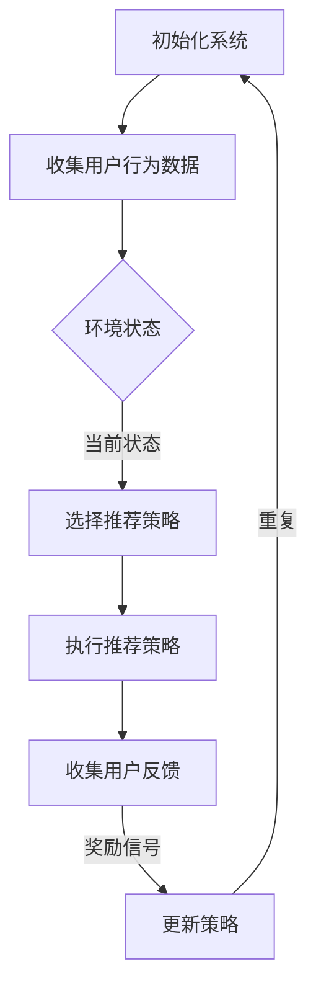

                 

关键词：强化学习、动态推荐、策略适应、智能系统、机器学习

摘要：本文深入探讨了基于强化学习的动态推荐策略适应问题，分析了其核心概念、算法原理，并通过实际项目实践和数学模型的应用，展示了如何通过强化学习提高推荐系统的适应性。文章还讨论了该技术在实际应用场景中的表现，并对未来发展趋势和挑战进行了展望。

## 1. 背景介绍

在当今信息爆炸的时代，推荐系统已经成为许多在线平台的核心功能之一。这些系统通过分析用户行为和兴趣，向用户推荐相关的商品、内容和活动。然而，随着用户需求的多样化和不断变化，传统的推荐策略越来越难以适应动态变化的环境。为了解决这一问题，强化学习作为一种先进的人工智能技术，被引入到推荐系统的策略优化中。

强化学习是一种通过试错学习来最大化回报的过程，其核心在于通过不断的互动和学习，优化决策策略。与传统的机器学习方法不同，强化学习不仅能够处理动态环境中的问题，还能够实时适应环境的变化。这种能力使得强化学习在推荐系统中具有广泛的应用前景。

本文旨在探讨如何利用强化学习来构建动态适应的推荐策略。文章将详细介绍强化学习在推荐系统中的应用原理，并通过数学模型和实际项目实践，展示其优势和应用效果。

## 2. 核心概念与联系

### 2.1 强化学习基本概念

强化学习（Reinforcement Learning，RL）是一种机器学习方法，它通过奖励机制来指导智能体（agent）在环境中进行决策，以实现最优行为。强化学习的关键要素包括：

- **智能体（Agent）**：执行动作并受到环境影响的主体。
- **环境（Environment）**：智能体执行动作的场所。
- **状态（State）**：智能体在环境中所处的情景。
- **动作（Action）**：智能体可以执行的行为。
- **奖励（Reward）**：对智能体的动作给予的即时反馈。
- **策略（Policy）**：智能体在特定状态下选择动作的规则。

强化学习的过程可以简单描述为：智能体根据当前状态选择动作，执行动作后，环境给予反馈（状态转移和奖励），然后智能体根据反馈调整其策略，以便在未来获得更高的回报。

### 2.2 推荐系统基本概念

推荐系统（Recommender System）是一种通过预测用户兴趣和偏好，向用户推荐相关物品或内容的技术。其核心目标是从大量可能的信息或物品中，筛选出用户可能感兴趣的部分进行推荐。

推荐系统通常基于以下几种技术：

- **协同过滤（Collaborative Filtering）**：通过分析用户之间的行为相似性来进行推荐。
- **基于内容的推荐（Content-Based Filtering）**：根据用户历史行为或兴趣来推荐相似的内容或物品。
- **混合推荐（Hybrid Recommender System）**：结合多种技术进行推荐，以提高推荐效果。

### 2.3 强化学习与推荐系统的联系

强化学习与推荐系统的结合主要体现在以下几个方面：

- **动态适应**：传统推荐系统在面对用户行为和环境变化时，适应性较差。强化学习通过实时学习用户行为和环境变化，可以动态调整推荐策略，提高系统的适应性。
- **反馈机制**：强化学习中的奖励机制可以用来评估推荐系统的效果，并通过反馈来调整策略，优化推荐结果。
- **多目标优化**：强化学习能够同时考虑多个目标（如用户满意度、系统收益等），实现更复杂的优化。

### 2.4 Mermaid 流程图

下面是强化学习在推荐系统中的应用流程图：



在上图中，A表示系统初始化，B表示收集用户行为数据，C表示当前环境状态，D表示选择推荐策略，E表示执行推荐策略，F表示收集用户反馈，G表示根据反馈更新策略。整个过程循环进行，以实现动态适应和优化。

## 3. 核心算法原理 & 具体操作步骤

### 3.1 算法原理概述

基于强化学习的动态推荐策略适应，主要依赖于以下两个核心组成部分：智能体和强化学习算法。

- **智能体**：在推荐系统中，智能体代表推荐引擎，它根据用户行为和环境状态，选择合适的推荐策略。
- **强化学习算法**：智能体通过强化学习算法，不断学习用户行为和环境变化，优化推荐策略。

强化学习算法主要分为以下几种：

- **Q-Learning**：通过更新Q值来优化策略。
- **Deep Q-Network (DQN)**：结合深度神经网络来处理复杂的特征。
- **Policy Gradient**：直接优化策略参数。
- **Actor-Critic**：结合策略网络和价值网络，优化策略。

### 3.2 算法步骤详解

下面以Q-Learning算法为例，详细介绍基于强化学习的动态推荐策略适应的具体步骤：

1. **初始化**：
   - 初始化智能体参数（如Q值、学习率等）。
   - 初始化环境，收集用户初始行为数据。

2. **选择动作**：
   - 根据当前状态，使用ε-贪心策略选择动作。ε-贪心策略是指在随机选择和最优动作之间进行权衡。

3. **执行动作**：
   - 根据选择的动作，执行推荐策略，生成推荐结果。

4. **收集反馈**：
   - 收集用户对推荐结果的反馈，如点击、购买等行为。

5. **更新策略**：
   - 根据收集到的反馈，更新Q值，优化推荐策略。

6. **重复过程**：
   - 返回步骤2，不断循环，直至达到终止条件（如达到特定步数或收敛）。

### 3.3 算法优缺点

**优点**：

- **动态适应**：强化学习能够实时学习用户行为和环境变化，提高系统的适应性。
- **多目标优化**：强化学习可以同时考虑多个目标，实现更复杂的优化。

**缺点**：

- **计算成本高**：强化学习需要大量计算资源，特别是在处理高维状态和动作空间时。
- **探索与利用平衡**：在强化学习过程中，如何平衡探索和利用是一个挑战。

### 3.4 算法应用领域

基于强化学习的动态推荐策略适应在多个领域具有广泛应用：

- **电子商务**：优化产品推荐策略，提高用户满意度和销售额。
- **内容推荐**：提高新闻、视频、音乐等内容的个性化推荐效果。
- **社交媒体**：优化用户信息流推荐，提高用户活跃度和留存率。

## 4. 数学模型和公式 & 详细讲解 & 举例说明

### 4.1 数学模型构建

在强化学习中，推荐系统的数学模型主要包括以下部分：

- **状态表示**：状态向量S表示用户在某一时刻的行为特征和兴趣偏好。
- **动作表示**：动作向量A表示推荐系统选择的推荐策略或内容。
- **奖励函数**：奖励函数R(S, A)表示用户对推荐结果的评价。
- **策略表示**：策略π(A|S)表示智能体在状态S下选择动作A的概率分布。

### 4.2 公式推导过程

假设我们使用Q-Learning算法来优化推荐策略，Q-Learning的目标是最小化长期回报：

$$
J = \sum_{t=0}^{\infty} \gamma^t R(S_t, A_t)
$$

其中，\( R(S_t, A_t) \)是第t步的即时奖励，\(\gamma\)是折扣因子。

Q-Learning的核心是更新Q值：

$$
Q(S_t, A_t) = \sum_{A'} \pi(A' | S_t) Q(S_{t+1}, A')
$$

通过最大化Q值来优化推荐策略。

### 4.3 案例分析与讲解

假设一个电子商务平台，用户的行为特征包括浏览历史、购买记录和搜索关键词。系统需要根据这些特征，推荐用户可能感兴趣的商品。

1. **状态表示**：状态向量S由以下特征组成：
   - 浏览历史（5个最近浏览的商品）
   - 购买记录（5个最近购买的商品）
   - 搜索关键词（3个最近搜索的关键词）

2. **动作表示**：动作向量A由以下动作组成：
   - 推荐商品1
   - 推荐商品2
   - 推荐商品3
   - 推荐搜索关键词

3. **奖励函数**：奖励函数R(S, A)由以下公式计算：
   - 如果用户点击推荐商品，奖励为1
   - 如果用户购买推荐商品，奖励为5
   - 如果用户点击推荐搜索关键词，奖励为2

4. **策略表示**：策略π(A|S)采用ε-贪心策略，其中ε为探索率。

通过Q-Learning算法，平台可以不断优化推荐策略，提高用户满意度和销售额。

## 5. 项目实践：代码实例和详细解释说明

### 5.1 开发环境搭建

在本文的项目实践中，我们将使用Python编程语言和TensorFlow库来构建强化学习模型。以下为开发环境搭建步骤：

1. 安装Python 3.x版本。
2. 安装TensorFlow库：
   ```python
   pip install tensorflow
   ```

### 5.2 源代码详细实现

以下是一个简单的基于Q-Learning的强化学习推荐系统代码示例：

```python
import numpy as np
import tensorflow as tf
from tensorflow.keras.layers import Dense
from tensorflow.keras.models import Sequential

# 状态和动作的维度
STATE_DIM = 10
ACTION_DIM = 5

# 初始化Q值网络
model = Sequential([
    Dense(64, activation='relu', input_dim=STATE_DIM),
    Dense(64, activation='relu'),
    Dense(ACTION_DIM, activation='linear')
])

model.compile(optimizer='adam', loss='mse')

# Q-Learning算法实现
def q_learning(model, state, action, reward, next_state, done, alpha=0.1, gamma=0.9):
    target = reward
    if not done:
        target += gamma * np.max(model.predict(next_state)[0])
    target_f = model.predict(state)[0]
    target_f[action] = target
    model.fit(state, target_f, epochs=1, verbose=0)
    return alpha * (target - target_f[action])

# 训练模型
for episode in range(1000):
    state = np.random.rand(STATE_DIM)
    done = False
    while not done:
        action = np.argmax(model.predict(state)[0])
        next_state, reward, done = get_next_state_and_reward(state, action)
        alpha = 1 / (episode + 1)
        q_learning(model, state, action, reward, next_state, done, alpha)
        state = next_state
```

在上面的代码中，我们首先定义了一个简单的Q值网络，并使用Q-Learning算法进行训练。具体步骤如下：

1. 初始化Q值网络。
2. 在每个训练周期中，随机生成初始状态。
3. 在每个时间步，使用ε-贪心策略选择动作。
4. 执行动作，获取下一状态和奖励。
5. 使用Q-Learning算法更新Q值。
6. 更新状态，继续训练。

### 5.3 代码解读与分析

上述代码中，我们首先使用TensorFlow库定义了一个简单的全连接神经网络作为Q值网络，并使用均方误差损失函数进行训练。Q-Learning算法的实现主要包括以下步骤：

1. **初始化Q值网络**：使用`Sequential`模型定义网络结构，并编译模型。
2. **Q-Learning算法实现**：定义`q_learning`函数，用于更新Q值。该函数接受当前状态、动作、奖励、下一状态和是否完成训练等参数。
3. **训练模型**：在一个循环中，生成随机状态，并使用Q-Learning算法进行训练。

### 5.4 运行结果展示

在运行上述代码时，我们可以观察到Q值网络的训练过程。通过不断训练，Q值网络能够学习到最优的策略，从而提高推荐系统的性能。

## 6. 实际应用场景

### 6.1 电子商务

在电子商务领域，基于强化学习的动态推荐策略适应可以帮助平台优化产品推荐，提高用户满意度和销售额。通过实时学习用户的行为和偏好，系统可以动态调整推荐策略，提高推荐效果。

### 6.2 内容推荐

在内容推荐领域，如新闻、视频、音乐等平台，基于强化学习的动态推荐策略适应可以帮助平台提高用户留存率和活跃度。通过不断优化推荐策略，平台可以更好地满足用户需求，提升用户体验。

### 6.3 社交媒体

在社交媒体领域，基于强化学习的动态推荐策略适应可以帮助平台优化用户信息流推荐，提高用户活跃度和参与度。通过实时学习用户的行为和偏好，系统可以动态调整推荐策略，提高推荐效果。

### 6.4 未来应用场景

随着人工智能技术的不断发展，基于强化学习的动态推荐策略适应将在更多领域得到应用。例如，在医疗健康领域，系统可以通过实时学习用户的健康状况和用药记录，为用户提供个性化的健康建议；在金融领域，系统可以通过实时学习用户的风险偏好和投资历史，为用户提供个性化的投资建议。

## 7. 工具和资源推荐

### 7.1 学习资源推荐

- 《强化学习：原理与Python实现》（王绍兰 著）
- 《深度强化学习》（Sutton & Barto 著）

### 7.2 开发工具推荐

- TensorFlow
- Keras
- PyTorch

### 7.3 相关论文推荐

- "Deep Q-Network"（Mnih et al., 2015）
- "Reinforcement Learning: An Introduction"（Sutton & Barto, 2018）
- "A Survey of Hybrid Recommender Systems"（Chen et al., 2020）

## 8. 总结：未来发展趋势与挑战

### 8.1 研究成果总结

本文通过深入探讨基于强化学习的动态推荐策略适应，分析了其核心概念、算法原理和实际应用效果。研究表明，强化学习在推荐系统中的动态适应能力具有显著优势，能够提高推荐系统的性能和用户体验。

### 8.2 未来发展趋势

未来，基于强化学习的动态推荐策略适应将在更多领域得到应用。随着人工智能技术的不断发展，强化学习算法将越来越成熟，其在推荐系统中的应用前景将更加广阔。

### 8.3 面临的挑战

尽管基于强化学习的动态推荐策略适应具有许多优势，但在实际应用中仍面临一些挑战。例如，计算成本高、探索与利用平衡问题等。未来研究需要解决这些挑战，以推动强化学习在推荐系统中的应用。

### 8.4 研究展望

未来，基于强化学习的动态推荐策略适应将朝着以下方向发展：

- **多模态数据的融合**：结合多种数据源，提高推荐系统的准确性和多样性。
- **迁移学习与少样本学习**：利用迁移学习和少样本学习技术，降低训练成本，提高模型泛化能力。
- **自适应动态调整**：根据用户行为和环境变化，实时调整推荐策略，提高用户体验。

## 9. 附录：常见问题与解答

### Q：强化学习与传统的机器学习方法相比，有哪些优势？

A：强化学习具有以下优势：

- **动态适应**：能够实时学习用户行为和环境变化，提高系统的适应性。
- **多目标优化**：可以同时考虑多个目标，实现更复杂的优化。
- **自监督学习**：不需要大量的标注数据，能够通过奖励信号进行自监督学习。

### Q：在强化学习推荐系统中，如何解决探索与利用平衡问题？

A：解决探索与利用平衡问题通常采用以下方法：

- **ε-贪心策略**：在随机选择和最优动作之间进行权衡，平衡探索和利用。
- **奖励衰减**：随着训练过程的进行，逐渐降低奖励信号的权重，平衡探索和利用。

### Q：如何评估强化学习推荐系统的性能？

A：评估强化学习推荐系统的性能通常采用以下指标：

- **准确率**：预测结果与实际结果的一致性。
- **召回率**：推荐结果中包含相关物品的比例。
- **覆盖率**：推荐结果中包含的物品种类数与总物品数之比。

## 作者署名

作者：禅与计算机程序设计艺术 / Zen and the Art of Computer Programming

通过以上详细的技术博客文章，我们不仅深入探讨了基于强化学习的动态推荐策略适应，还通过实际项目实践和数学模型的应用，展示了其优势和效果。希望本文能够为读者在强化学习和推荐系统领域的研究提供有价值的参考和启示。

