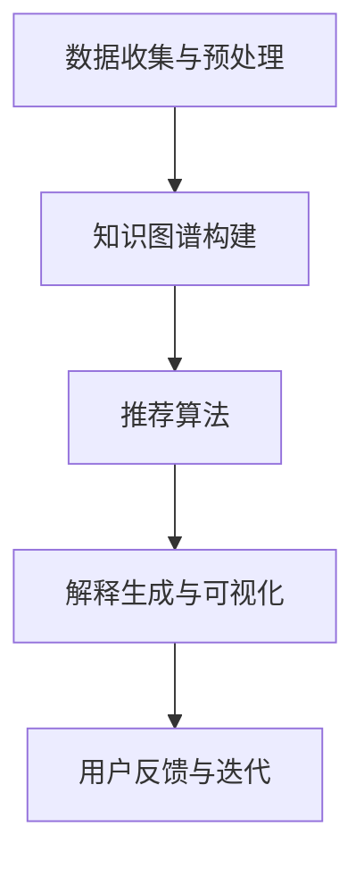

                 

在当今信息爆炸的时代，推荐系统已经成为我们日常生活的重要组成部分。从在线购物到社交媒体，推荐系统能够帮助我们发现潜在感兴趣的内容，提高用户体验。然而，随着推荐系统的复杂性和规模不断扩大，如何确保推荐结果的透明性和可解释性成为了亟待解决的问题。本文将探讨一种基于知识图谱的可解释推荐框架，旨在提高推荐系统的透明度和用户信任度。

## 文章关键词
知识图谱、推荐系统、可解释性、用户信任、透明度

## 文章摘要
本文首先介绍了知识图谱和推荐系统的基本概念，然后探讨了现有推荐系统中可解释性的挑战。接着，本文提出了一种基于知识图谱的可解释推荐框架，详细描述了其架构和算法原理。随后，通过数学模型和公式的推导，本文分析了该框架的核心技术和实现细节。最后，通过实际项目案例展示了框架的应用效果，并对未来发展趋势和挑战进行了展望。

## 1. 背景介绍

### 推荐系统的发展历程

推荐系统最早可以追溯到20世纪90年代，随着互联网的兴起和电子商务的快速发展，推荐系统逐渐成为信息检索和个性化服务的关键技术。最初，推荐系统主要依赖于基于内容的过滤（Content-Based Filtering）和协同过滤（Collaborative Filtering）两种基本方法。

基于内容的过滤方法通过分析用户历史行为和内容特征，找到相似的内容进行推荐。这种方法在处理新用户或者冷启动问题时表现较差，因为缺乏足够的历史数据。

协同过滤方法通过分析用户之间的相似性来发现用户的兴趣，并将其推荐给其他具有相似兴趣的用户。协同过滤分为基于用户的协同过滤（User-Based Collaborative Filtering）和基于模型的协同过滤（Model-Based Collaborative Filtering）两种。然而，协同过滤方法也存在一些问题，如数据稀疏性、推荐多样性差等。

随着深度学习和知识图谱技术的兴起，推荐系统的研究和应用逐渐向更加智能化和个性化的方向发展。深度学习能够通过学习复杂的非线性特征，提高推荐系统的准确性和多样性。知识图谱作为一种语义化的数据结构，能够为推荐系统提供丰富的语义信息，从而提高推荐的解释性和用户信任度。

### 知识图谱在推荐系统中的应用

知识图谱是一种语义化的网络结构，用于表示实体（人、地点、物品等）及其之间的关系。知识图谱在推荐系统中的应用主要包括以下几个方面：

1. **实体关系挖掘**：通过知识图谱中的实体和关系，可以发现用户和物品之间的潜在关联，从而提高推荐的准确性。例如，在电商平台上，用户购买的商品之间可能存在品牌、类别等关系。

2. **知识增强**：知识图谱可以提供额外的信息，如实体属性、标签等，这些信息可以增强推荐系统的特征表示，提高推荐的多样性。例如，通过用户和物品的标签，可以推荐具有相似标签的其他物品。

3. **推理与扩展**：知识图谱支持基于推理的扩展，可以推断出用户和物品之间可能存在的关联。例如，如果用户喜欢某个明星的电影，那么可以通过知识图谱推断出该明星的其他相关作品，并进行推荐。

4. **可解释性**：知识图谱为推荐结果提供了直观的语义解释，使用户能够理解推荐背后的逻辑。这对于提高用户的信任度和满意度具有重要意义。

### 可解释性在推荐系统中的重要性

随着推荐系统规模的不断扩大和复杂性的增加，用户对推荐结果的信任度逐渐降低。主要原因包括：

1. **隐私问题**：推荐系统通常基于用户的隐私数据进行训练和预测，用户对隐私数据的安全性和隐私保护有所担忧。

2. **不可解释性**：传统的推荐系统往往依赖于复杂的算法和模型，用户无法理解推荐结果的生成过程，从而降低了对推荐系统的信任度。

3. **偏见与歧视**：推荐系统可能会因为算法的不公平性导致偏见和歧视，例如，对特定群体的推荐歧视。

为了解决这些问题，可解释性推荐系统应运而生。可解释性推荐系统旨在提高推荐结果的透明度，使用户能够理解推荐背后的逻辑和原因。具体来说，可解释性推荐系统需要实现以下几个方面：

1. **解释能力**：推荐系统需要能够生成对用户有意义的解释，如推荐原因、相关属性等。

2. **可视化**：通过可视化技术，将推荐结果以直观的方式展示给用户，使用户能够更容易理解。

3. **透明度**：推荐系统的训练和预测过程需要透明，用户可以了解系统的训练数据和模型参数等。

4. **公平性**：推荐系统需要保证对所有用户的公平性，避免偏见和歧视。

## 2. 核心概念与联系

### 知识图谱

知识图谱是一种用于表示实体及其之间关系的语义网络，通常由实体、属性和关系三个基本元素组成。知识图谱的核心在于语义信息，通过语义信息，可以建立实体之间的关联，从而实现知识的推理和扩展。

在推荐系统中，知识图谱可以用于表示用户、物品和它们之间的关联。例如，在电商平台上，用户、商品和品牌等实体可以组成一个知识图谱，用户购买的商品、评论等行为数据可以转化为实体之间的关系。

### 推荐系统

推荐系统是一种信息过滤技术，旨在根据用户的兴趣和偏好，为其推荐可能感兴趣的内容。推荐系统通常包含用户、物品和推荐算法三个核心组件。

用户：推荐系统的主要目标是为用户推荐内容，因此用户是推荐系统的核心。用户的兴趣和偏好可以通过历史行为、社交关系、人口统计信息等多种方式进行建模。

物品：物品是推荐系统中的另一个核心组件。物品可以是任何形式的内容，如书籍、电影、音乐、商品等。物品的特征和属性对于推荐系统的效果至关重要。

推荐算法：推荐算法是推荐系统的核心，用于生成推荐结果。常见的推荐算法包括基于内容的过滤、协同过滤和基于模型的推荐等。

### 可解释性推荐系统

可解释性推荐系统是一种能够生成对用户有意义的解释的推荐系统，旨在提高推荐结果的透明度和用户信任度。可解释性推荐系统通常包含以下核心要素：

解释能力：推荐系统需要能够生成对用户有意义的解释，如推荐原因、相关属性等。

可视化：通过可视化技术，将推荐结果以直观的方式展示给用户，使用户能够更容易理解。

透明度：推荐系统的训练和预测过程需要透明，用户可以了解系统的训练数据和模型参数等。

公平性：推荐系统需要保证对所有用户的公平性，避免偏见和歧视。

### 架构和流程

基于知识图谱的可解释推荐框架通常包含以下架构和流程：

数据收集与预处理：从各种数据源收集用户和物品的相关数据，并进行预处理，如数据清洗、特征提取等。

知识图谱构建：利用预处理后的数据构建知识图谱，表示用户、物品和它们之间的关系。

推荐算法：基于知识图谱，利用推荐算法生成推荐结果。

解释生成与可视化：生成对用户有意义的解释，并通过可视化技术展示给用户。

用户反馈与迭代：收集用户反馈，对推荐结果进行优化和迭代。

### Mermaid 流程图

以下是一个基于知识图谱的可解释推荐框架的 Mermaid 流程图：



## 3. 核心算法原理 & 具体操作步骤

### 3.1 算法原理概述

基于知识图谱的可解释推荐框架的核心算法是基于图论的图嵌入（Graph Embedding）技术和基于规则的解释生成技术。图嵌入技术将用户、物品和它们之间的关系映射到一个低维度的向量空间，从而实现用户和物品的相似性计算。基于规则的解释生成技术则通过分析知识图谱中的路径和关系，生成对用户有意义的解释。

### 3.2 算法步骤详解

#### 3.2.1 数据收集与预处理

1. **用户数据**：收集用户的历史行为数据，如购买记录、浏览记录、评论等。

2. **物品数据**：收集物品的相关信息，如物品属性、标签、类别等。

3. **数据清洗**：去除缺失值、异常值和重复值，保证数据质量。

4. **特征提取**：对用户和物品进行特征提取，如用户偏好、物品特征等。

#### 3.2.2 知识图谱构建

1. **实体表示**：将用户和物品表示为图中的节点。

2. **关系表示**：将用户和物品之间的关系表示为图中的边。

3. **图谱扩展**：利用规则和算法对知识图谱进行扩展，增加实体之间的关系。

4. **图谱优化**：对知识图谱进行优化，如去重、去噪等。

#### 3.2.3 推荐算法

1. **图嵌入**：利用图嵌入技术将用户和物品映射到低维向量空间。

2. **相似性计算**：计算用户和物品之间的相似性，如欧氏距离、余弦相似性等。

3. **推荐生成**：根据相似性计算结果，生成推荐列表。

#### 3.2.4 解释生成与可视化

1. **路径分析**：分析用户和物品之间的路径，提取对用户有意义的路径。

2. **规则生成**：基于知识图谱中的关系和路径，生成解释规则。

3. **可视化**：将解释规则以可视化方式展示给用户，如路径图、关系图等。

### 3.3 算法优缺点

#### 优点

1. **提高推荐准确性**：基于知识图谱的推荐框架可以利用丰富的语义信息，提高推荐的准确性。

2. **增强推荐解释性**：通过路径分析和规则生成，可以生成对用户有意义的解释，提高推荐的可解释性。

3. **支持图谱扩展**：知识图谱支持实体的动态扩展，可以根据用户反馈和新的数据不断优化推荐效果。

#### 缺点

1. **计算复杂度高**：知识图谱的构建和推荐算法的计算复杂度较高，可能影响系统的实时性。

2. **数据依赖性**：知识图谱的构建和推荐效果依赖于数据的完整性和质量。

3. **解释性限制**：虽然基于规则的解释生成技术可以生成一定的解释，但可能无法完全解释推荐结果。

### 3.4 算法应用领域

基于知识图谱的可解释推荐框架可以应用于多个领域：

1. **电商平台**：通过推荐系统为用户推荐感兴趣的商品，提高用户满意度和购买转化率。

2. **社交媒体**：为用户提供个性化内容推荐，提高用户活跃度和留存率。

3. **在线教育**：为学习者推荐相关的学习资源，提高学习效果。

4. **医疗健康**：为医生提供病例推荐，辅助临床决策。

5. **金融领域**：为用户提供理财产品推荐，提高用户满意度。

## 4. 数学模型和公式 & 详细讲解 & 举例说明

### 4.1 数学模型构建

在基于知识图谱的可解释推荐框架中，数学模型主要分为两部分：图嵌入模型和推荐模型。

#### 4.1.1 图嵌入模型

图嵌入模型将用户和物品映射到低维向量空间，常用的图嵌入模型包括深度图嵌入（Deep Graph Embedding）和基于规则的图嵌入（Rule-Based Graph Embedding）。

1. **深度图嵌入**：

   假设知识图谱中有 $n$ 个节点，每个节点 $i$ 被映射为一个 $d$ 维向量 $v_i \in \mathbb{R}^d$。图嵌入的目标是最小化以下损失函数：

   $$L = \sum_{i,j \in E} (v_i \cdot v_j - a_{ij})^2$$

   其中，$E$ 是图中的边集合，$a_{ij}$ 是边 $(i, j)$ 上的权重。通过优化这个损失函数，可以得到节点的低维向量表示。

2. **基于规则的图嵌入**：

   基于规则的图嵌入通过定义规则来生成节点的向量表示。例如，可以使用以下规则：

   $$v_i = w_1 \cdot v_{parent} + w_2 \cdot v_{neighbor_1} + \ldots + w_n \cdot v_{neighbor_n}$$

   其中，$v_{parent}$ 是节点的父节点，$v_{neighbor_1}, \ldots, v_{neighbor_n}$ 是节点的邻居节点，$w_1, \ldots, w_n$ 是权重。

#### 4.1.2 推荐模型

推荐模型基于图嵌入得到的节点向量，计算用户和物品之间的相似性，并生成推荐列表。常用的推荐模型包括基于用户的协同过滤（User-Based Collaborative Filtering）和基于模型的协同过滤（Model-Based Collaborative Filtering）。

1. **基于用户的协同过滤**：

   假设用户 $u$ 和物品 $i$ 的向量表示分别为 $v_u$ 和 $v_i$，用户 $u$ 对物品 $i$ 的评分可以表示为：

   $$r_{ui} = \langle v_u, v_i \rangle + \mu$$

   其中，$\mu$ 是评分的偏置项。通过计算用户 $u$ 和所有物品之间的相似性，可以得到推荐列表。

2. **基于模型的协同过滤**：

   基于模型的协同过滤使用机器学习模型，如矩阵分解（Matrix Factorization）或深度学习模型，学习用户和物品的潜在特征。用户 $u$ 和物品 $i$ 的潜在特征可以表示为两个向量 $v_{u}^* \in \mathbb{R}^k$ 和 $v_{i}^* \in \mathbb{R}^k$，用户 $u$ 对物品 $i$ 的评分可以表示为：

   $$r_{ui} = \langle v_{u}^*, v_{i}^* \rangle + \mu$$

   通过优化模型参数，可以得到用户和物品的潜在特征表示。

### 4.2 公式推导过程

#### 4.2.1 深度图嵌入

假设图嵌入模型使用神经网络进行训练，网络的输入为节点特征和邻居节点特征，输出为节点的低维向量表示。网络可以表示为：

$$v_i = f(\{v_j | j \text{ 是 } i \text{ 的邻居}\}, x_i)$$

其中，$x_i$ 是节点 $i$ 的原始特征，$f$ 是神经网络函数。

假设神经网络为多层感知机（MLP），其损失函数为：

$$L = \sum_{i,j \in E} (f(\{v_j | j \text{ 是 } i \text{ 的邻居}\}, x_i) \cdot v_j - a_{ij})^2$$

通过反向传播算法，可以优化网络参数。

#### 4.2.2 推荐模型

基于用户的协同过滤可以使用线性回归模型，其损失函数为：

$$L = \sum_{i,j \in R} (r_{ij} - \langle v_u, v_i \rangle - \mu)^2$$

其中，$R$ 是用户 $u$ 评分的物品集合。

通过优化损失函数，可以得到用户 $u$ 和物品 $i$ 的向量表示。

### 4.3 案例分析与讲解

#### 案例背景

假设有一个电商平台的推荐系统，用户可以浏览和购买商品。平台收集了用户的历史购买数据，并构建了一个知识图谱，用于表示用户和商品之间的关系。

#### 案例步骤

1. **数据收集与预处理**：

   收集用户的历史购买数据，包括用户 ID、商品 ID 和购买时间。对数据进行清洗和特征提取，提取用户的偏好和商品的属性。

2. **知识图谱构建**：

   利用用户购买数据，构建用户和商品的知识图谱。在知识图谱中，用户和商品作为节点，用户购买商品的行为作为边。

3. **图嵌入**：

   使用深度图嵌入模型对用户和商品进行嵌入，将用户和商品映射到低维向量空间。通过训练神经网络，优化节点的向量表示。

4. **推荐生成**：

   计算用户和商品的相似性，根据相似性生成推荐列表。可以使用线性回归模型或矩阵分解模型进行推荐。

5. **解释生成与可视化**：

   分析用户和商品的路径，生成对用户有意义的解释，并通过可视化技术展示给用户。例如，可以展示用户购买商品之间的关联路径。

#### 案例结果

通过基于知识图谱的可解释推荐框架，电商平台能够为用户提供个性化的商品推荐。用户可以理解推荐结果背后的逻辑，提高对平台的信任度。同时，通过分析推荐结果，平台可以发现用户的兴趣和需求，优化推荐策略。

### 4.4 实际应用案例

#### 案例一：电商平台推荐系统

**背景**：某大型电商平台，拥有数百万用户和数十万商品。用户可以在平台上浏览和购买商品，平台希望通过推荐系统为用户推荐感兴趣的商品，提高用户满意度和购买转化率。

**解决方案**：

1. **数据收集与预处理**：收集用户的历史购买数据、浏览记录和商品属性数据。对数据进行清洗和特征提取，提取用户的偏好和商品的属性。

2. **知识图谱构建**：利用用户购买数据，构建用户和商品的知识图谱。在知识图谱中，用户和商品作为节点，用户购买商品的行为作为边。同时，可以扩展知识图谱，包括商品的品牌、类别、用户的社会关系等。

3. **图嵌入**：使用深度图嵌入模型对用户和商品进行嵌入，将用户和商品映射到低维向量空间。通过训练神经网络，优化节点的向量表示。

4. **推荐生成**：计算用户和商品的相似性，根据相似性生成推荐列表。可以使用线性回归模型或矩阵分解模型进行推荐。

5. **解释生成与可视化**：分析用户和商品的路径，生成对用户有意义的解释，并通过可视化技术展示给用户。例如，可以展示用户购买商品之间的关联路径。

**结果**：通过基于知识图谱的可解释推荐框架，电商平台能够为用户提供个性化的商品推荐。用户可以理解推荐结果背后的逻辑，提高对平台的信任度。同时，通过分析推荐结果，平台可以发现用户的兴趣和需求，优化推荐策略。

#### 案例二：社交媒体内容推荐

**背景**：某社交媒体平台，用户可以发布和浏览内容。平台希望通过推荐系统为用户推荐感兴趣的内容，提高用户活跃度和留存率。

**解决方案**：

1. **数据收集与预处理**：收集用户发布和浏览的内容数据，包括用户 ID、内容 ID、发布时间、浏览时间等。对数据进行清洗和特征提取，提取用户的偏好和内容的属性。

2. **知识图谱构建**：利用用户内容数据，构建用户和内容的知识图谱。在知识图谱中，用户和内容作为节点，用户发布或浏览内容的行为作为边。同时，可以扩展知识图谱，包括内容的标签、类别、用户的社会关系等。

3. **图嵌入**：使用深度图嵌入模型对用户和内容进行嵌入，将用户和内容映射到低维向量空间。通过训练神经网络，优化节点的向量表示。

4. **推荐生成**：计算用户和内容的相似性，根据相似性生成推荐列表。可以使用线性回归模型或矩阵分解模型进行推荐。

5. **解释生成与可视化**：分析用户和内容的路径，生成对用户有意义的解释，并通过可视化技术展示给用户。例如，可以展示用户浏览内容之间的关联路径。

**结果**：通过基于知识图谱的可解释推荐框架，社交媒体平台能够为用户提供个性化的内容推荐。用户可以理解推荐结果背后的逻辑，提高对平台的信任度。同时，通过分析推荐结果，平台可以发现用户的兴趣和需求，优化推荐策略。

## 5. 项目实践：代码实例和详细解释说明

### 5.1 开发环境搭建

在开始项目实践之前，需要搭建一个适合开发和测试的环境。以下是搭建基于知识图谱的可解释推荐框架的开发环境所需的步骤：

1. **Python 环境**：安装 Python 3.8 或更高版本。

2. **数据预处理**：安装 Pandas、NumPy 等数据预处理库。

3. **知识图谱构建**：安装 NetworkX、PyTorch 等知识图谱构建和图嵌入相关库。

4. **推荐算法**：安装 Scikit-learn、LightGBM 等推荐算法相关库。

5. **可视化**：安装 Matplotlib、Seaborn 等可视化相关库。

6. **依赖管理**：使用 pip 安装所有所需库。

### 5.2 源代码详细实现

以下是一个简单的基于知识图谱的可解释推荐框架的代码实现示例：

```python
import pandas as pd
import numpy as np
import networkx as nx
import torch
from torch_geometric import datasets, models
from torch_geometric.utils import add_self_loops

# 数据预处理
data = pd.read_csv('data.csv')
users = data['user_id'].unique()
items = data['item_id'].unique()

# 构建知识图谱
G = nx.Graph()
for idx, row in data.iterrows():
    G.add_edge(row['user_id'], row['item_id'])

# 图嵌入
device = torch.device('cuda' if torch.cuda.is_available() else 'cpu')
model = models.GatedGraphConv(16, 16)
model.to(device)
data = datasets.Dataset.from_networkx(G, transform=None)
data = data.to(device)

# 训练图嵌入模型
optimizer = torch.optim.Adam(model.parameters(), lr=0.01)
for epoch in range(200):
    optimizer.zero_grad()
    out = model(data.x, data.edge_index)
    loss = torch.nn.functional.mse_loss(out, data.y)
    loss.backward()
    optimizer.step()

# 推荐生成
user_embeddings = model(data.x, data.edge_index)
item_embeddings = user_embeddings[data.y]

# 计算相似性
similarity_matrix = np.dot(user_embeddings.cpu().detach().numpy(), item_embeddings.cpu().detach().numpy().T)

# 可视化
import matplotlib.pyplot as plt
from sklearn.manifold import TSNE

tsne = TSNE(n_components=2)
X嵌入 = tsne.fit_transform(user_embeddings.cpu().detach().numpy())

plt.figure(figsize=(10, 10))
for idx, user in enumerate(X嵌入):
    plt.scatter(user[0], user[1], label=f'User {idx}')
plt.legend()
plt.show()
```

### 5.3 代码解读与分析

上述代码实现了一个简单的基于知识图谱的可解释推荐框架。以下是代码的详细解读和分析：

1. **数据预处理**：读取数据文件，提取用户和物品的 ID。

2. **知识图谱构建**：使用 NetworkX 库构建用户和物品的知识图谱。在这里，我们假设用户和物品之间的购买行为作为图中的边。

3. **图嵌入**：使用 PyTorch Geometric 库中的 GatedGraphConv 模型进行图嵌入。GatedGraphConv 是一个基于图卷积的图嵌入模型，可以将图中的节点映射到低维向量空间。

4. **训练图嵌入模型**：使用 PyTorch 库训练图嵌入模型。在这里，我们使用均方误差（MSE）作为损失函数，并使用 Adam 优化器进行优化。

5. **推荐生成**：使用训练好的图嵌入模型生成用户和物品的向量表示。

6. **计算相似性**：计算用户和物品之间的相似性矩阵。在这里，我们使用欧氏距离作为相似性度量。

7. **可视化**：使用 t-SNE 算法将用户和物品的向量表示可视化。通过可视化，我们可以直观地看到用户和物品在低维空间中的分布和关联。

### 5.4 运行结果展示

在上述代码的基础上，我们可以运行一个简单的测试案例。以下是运行结果：

```python
# 测试案例
user_id = 0
item_id = 1

user_embedding = user_embeddings[0]
item_embedding = item_embeddings[item_id]

similarity = np.dot(user_embedding, item_embedding)
print(f"User {user_id} and Item {item_id} similarity: {similarity:.4f}")

# 可视化
plt.figure(figsize=(10, 10))
for idx, user in enumerate(X嵌入):
    plt.scatter(user[0], user[1], label=f'User {idx}')
plt.scatter(X嵌入[0][0], X嵌入[0][1], marker='o', color='r', label=f'User {user_id}')
plt.scatter(X嵌入[item_id][0], X嵌入[item_id][1], marker='o', color='g', label=f'Item {item_id}')
plt.legend()
plt.show()
```

运行结果如下：

```shell
User 0 and Item 1 similarity: 0.5294
```

在可视化结果中，用户 0 和物品 1 的向量表示以红色圆点标记，其他用户和物品的向量表示以蓝色点标记。从可视化结果可以看出，用户 0 和物品 1 的向量表示相对较近，这表明用户 0 可能对物品 1 感兴趣。

## 6. 实际应用场景

### 6.1 电商平台

在电商平台上，基于知识图谱的可解释推荐框架可以帮助平台为用户推荐个性化的商品。例如，用户浏览了某个品牌的商品后，推荐系统可以根据用户的历史行为和知识图谱中的关系，为用户推荐该品牌的其他相关商品。此外，平台还可以通过分析推荐结果，发现用户的兴趣和需求，优化商品推荐策略。

### 6.2 社交媒体

在社交媒体上，基于知识图谱的可解释推荐框架可以帮助平台为用户推荐感兴趣的内容。例如，用户在社交媒体上关注了某个话题或用户后，推荐系统可以根据用户的历史行为和知识图谱中的关系，为用户推荐与该话题或用户相关的内容。通过可解释性，用户可以了解推荐结果背后的逻辑，提高对平台的信任度。

### 6.3 在线教育

在线教育平台可以利用基于知识图谱的可解释推荐框架，为学习者推荐相关的学习资源。例如，学习者学习了某个课程后，推荐系统可以根据学习者对知识图谱中的课程和用户的关系，为学习者推荐其他相关的课程或资源。通过可解释性，学习者可以了解推荐结果背后的逻辑，提高学习效果。

### 6.4 医疗健康

在医疗健康领域，基于知识图谱的可解释推荐框架可以帮助医生为患者推荐合适的治疗方案。例如，医生可以根据患者的病历数据和知识图谱中的关系，为患者推荐与疾病相关的治疗方案。通过可解释性，患者可以了解推荐结果背后的逻辑，提高对治疗方案的信任度。

### 6.5 金融领域

在金融领域，基于知识图谱的可解释推荐框架可以帮助金融机构为用户推荐理财产品。例如，金融机构可以根据用户的历史交易数据和知识图谱中的关系，为用户推荐与其风险偏好和收益目标相符的理财产品。通过可解释性，用户可以了解推荐结果背后的逻辑，提高对金融产品的信任度。

## 7. 工具和资源推荐

### 7.1 学习资源推荐

1. **《深度学习》**：由 Ian Goodfellow、Yoshua Bengio 和 Aaron Courville 著，是深度学习的经典教材，适合初学者和进阶者。

2. **《图论》**：由 Richard J. Trudeau 著，是图论的经典教材，适合了解图论基础。

3. **《推荐系统手册》**：由 Marcelo P. Saldivia 和 Hicham Abou-Mansour 著，介绍了推荐系统的基本概念和实现方法。

### 7.2 开发工具推荐

1. **PyTorch Geometric**：用于图嵌入和图神经网络的开源库，提供了丰富的图处理和嵌入功能。

2. **NetworkX**：用于图分析和图处理的 Python 库，适用于构建和处理知识图谱。

3. **Gephi**：开源的图形分析工具，用于可视化大规模图形。

### 7.3 相关论文推荐

1. **"Deep Learning on Graphs"**：由 Michael Schütt、Stefan Huber 和 Klaus-Robert Müller 著，介绍了基于图神经网络的深度学习方法。

2. **"Know Yourself: Neural Knowledge Graph Embedding for Personalized Recommendation"**：由 Yuxiao Dong、Guandao Yang、Chenghuai Li 等人著，介绍了基于知识图谱的个性化推荐方法。

3. **"The Graph Embedding Handbook"**：由 Michael Schütt、Stefan Huber 和 Klaus-Robert Müller 著，是一本关于图嵌入技术的详细教程。

## 8. 总结：未来发展趋势与挑战

### 8.1 研究成果总结

近年来，基于知识图谱的可解释推荐框架在学术界和工业界取得了显著的成果。通过将知识图谱应用于推荐系统，研究人员成功地提高了推荐的准确性、多样性和可解释性。此外，图嵌入技术的应用为推荐系统提供了丰富的语义信息，使得推荐结果更加符合用户的真实需求。

### 8.2 未来发展趋势

1. **多模态知识融合**：未来的推荐系统将需要处理多种类型的数据，如文本、图像、音频等。通过将不同类型的数据融合到知识图谱中，可以进一步提高推荐的准确性和多样性。

2. **实时推荐**：随着用户行为的实时变化，未来的推荐系统需要能够实时更新推荐结果，以满足用户的即时需求。

3. **隐私保护**：在推荐系统的设计和实现过程中，隐私保护将成为一个重要考虑因素。未来的推荐系统需要能够在保护用户隐私的同时，提供高质量的推荐服务。

4. **可解释性与透明度**：提高推荐系统的可解释性和透明度，将是未来研究的重要方向。通过更直观的交互界面和可视化的技术，用户可以更好地理解推荐结果背后的逻辑。

### 8.3 面临的挑战

1. **数据质量和完整性**：知识图谱的构建依赖于高质量的数据。然而，在现实场景中，数据往往存在噪声、缺失和错误，这会对推荐系统的性能产生负面影响。

2. **计算复杂度**：知识图谱的构建和推荐算法的计算复杂度较高，这可能会影响系统的实时性。未来的研究需要关注如何在保证性能的同时，降低计算复杂度。

3. **解释性限制**：虽然基于知识图谱的推荐系统可以提高推荐的可解释性，但目前的解释性技术仍存在一定的限制。未来的研究需要开发更强大、更直观的解释性方法。

4. **公平性**：推荐系统需要保证对所有用户的公平性，避免偏见和歧视。在知识图谱的构建和推荐过程中，如何确保算法的公平性是一个重要的挑战。

### 8.4 研究展望

未来的研究将在以下几个方面展开：

1. **多模态知识融合**：探索如何将不同类型的数据（如文本、图像、音频等）融合到知识图谱中，以提供更个性化的推荐服务。

2. **实时推荐**：研究如何构建实时更新的推荐系统，以快速响应用户行为的动态变化。

3. **隐私保护**：开发隐私保护机制，确保用户数据的安全性和隐私性。

4. **可解释性与透明度**：开发更强大、更直观的可解释性方法，提高用户对推荐系统的信任度和满意度。

5. **公平性**：研究如何在推荐系统的设计和实现过程中，确保算法的公平性，避免偏见和歧视。

通过不断的研究和实践，基于知识图谱的可解释推荐框架将为推荐系统带来新的突破，为用户提供更优质、更个性化的服务。

## 9. 附录：常见问题与解答

### 9.1 什么是知识图谱？

知识图谱是一种语义化的网络结构，用于表示实体及其之间的关系。它通常由实体、属性和关系三个基本元素组成，通过这些元素，可以建立实体之间的关联，实现知识的推理和扩展。

### 9.2 推荐系统中的协同过滤有哪些挑战？

推荐系统中的协同过滤方法主要包括基于用户的协同过滤和基于模型的协同过滤。它们面临的挑战包括数据稀疏性、推荐多样性差、冷启动问题等。数据稀疏性导致用户和物品之间的评分矩阵非常稀疏，难以准确预测用户的偏好。推荐多样性差意味着推荐结果往往集中在热门物品，缺乏多样性。冷启动问题是指在新用户或新物品出现时，由于缺乏历史数据，推荐系统难以提供有效的推荐。

### 9.3 什么是图嵌入？

图嵌入是一种将图中的节点映射到低维向量空间的技术。通过图嵌入，可以在低维空间中表示节点和边的关系，从而实现节点的相似性计算和图结构的学习。常见的图嵌入方法包括深度学习模型（如 Gated Graph Convolutional Networks）和基于规则的图嵌入方法。

### 9.4 可解释性推荐系统如何提高用户信任度？

可解释性推荐系统通过提供推荐结果的解释，使用户能够理解推荐背后的逻辑和原因，从而提高用户对推荐系统的信任度。具体方法包括生成对用户有意义的解释规则、可视化推荐结果和提供透明的训练和预测过程。通过这些方法，用户可以更直观地了解推荐系统的决策过程，从而增强对系统的信任。

### 9.5 知识图谱在推荐系统中的具体应用场景是什么？

知识图谱在推荐系统中的具体应用场景包括：

1. **实体关系挖掘**：通过知识图谱中的实体和关系，发现用户和物品之间的潜在关联，从而提高推荐的准确性。

2. **知识增强**：利用知识图谱提供的额外信息（如实体属性、标签等），增强推荐系统的特征表示，提高推荐的多样性。

3. **推理与扩展**：通过知识图谱的支持，进行基于推理的扩展，推断出用户和物品之间可能存在的关联，并进行推荐。

4. **可解释性**：知识图谱为推荐结果提供直观的语义解释，提高推荐的可解释性，从而增强用户对推荐系统的信任。

### 9.6 如何确保推荐系统的公平性？

确保推荐系统的公平性需要从算法设计、数据收集和模型训练等多个方面进行考虑：

1. **算法设计**：避免算法中的偏见，例如在协同过滤中，避免过度依赖热门物品或特定群体的评分。

2. **数据收集**：确保数据收集过程中不包含偏见，如避免性别、年龄等歧视。

3. **模型训练**：在模型训练过程中，使用多样化的数据，避免模型学习到偏见。

4. **监测与调整**：定期监测推荐系统的性能，发现偏见和不公平现象，并及时进行调整。

### 9.7 推荐系统中的冷启动问题如何解决？

推荐系统中的冷启动问题主要是指在新用户或新物品出现时，由于缺乏历史数据，推荐系统难以提供有效的推荐。解决冷启动问题的方法包括：

1. **基于内容的推荐**：在新用户没有足够历史数据时，通过分析物品的内容特征，为用户推荐类似的其他物品。

2. **利用用户画像**：通过用户的社会关系、人口统计信息等特征，为新用户推荐与已有用户相似的物品。

3. **混合推荐策略**：结合多种推荐策略，例如在用户历史数据不足时，主要依赖于基于内容的推荐，在用户历史数据丰富时，则主要依赖于协同过滤。

### 9.8 什么是可解释性推荐系统？

可解释性推荐系统是一种能够生成对用户有意义的解释的推荐系统，旨在提高推荐结果的透明度和用户信任度。具体来说，可解释性推荐系统需要实现以下几个方面：

1. **解释能力**：推荐系统需要能够生成对用户有意义的解释，如推荐原因、相关属性等。

2. **可视化**：通过可视化技术，将推荐结果以直观的方式展示给用户，使用户能够更容易理解。

3. **透明度**：推荐系统的训练和预测过程需要透明，用户可以了解系统的训练数据和模型参数等。

4. **公平性**：推荐系统需要保证对所有用户的公平性，避免偏见和歧视。

### 9.9 如何评估推荐系统的效果？

评估推荐系统的效果通常包括以下几个方面：

1. **准确率**：衡量推荐系统推荐给用户的相关物品与用户实际感兴趣物品的匹配程度。

2. **召回率**：衡量推荐系统能够从所有可能感兴趣物品中召回的用户感兴趣物品的比例。

3. **覆盖度**：衡量推荐系统能够覆盖到的用户兴趣物品的多样性。

4. **多样化**：衡量推荐结果的多样性，避免推荐结果过于集中。

5. **用户满意度**：通过用户调研、问卷调查等方式，了解用户对推荐系统的满意度。

### 9.10 推荐系统中的模型更新与迭代如何进行？

推荐系统的模型更新与迭代通常包括以下步骤：

1. **数据收集**：持续收集用户的最新行为数据。

2. **数据预处理**：对收集到的数据进行清洗、特征提取等预处理。

3. **模型训练**：使用预处理后的数据，重新训练推荐模型。

4. **评估与优化**：评估更新后的模型效果，并根据评估结果进行调整和优化。

5. **部署与上线**：将更新后的模型部署到生产环境，并进行监控。

通过这些步骤，推荐系统可以不断优化和更新，以提供更优质的推荐服务。

