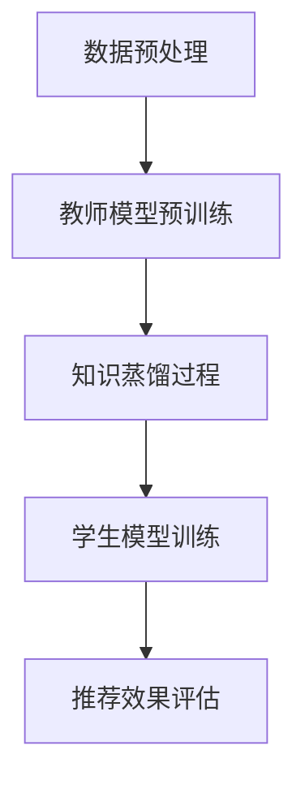

                 

关键词：知识蒸馏，轻量级推荐模型，机器学习，深度学习，模型压缩

> 摘要：本文主要介绍了一种基于知识蒸馏技术的轻量级推荐模型，该模型通过在少量训练数据和高效模型训练之间建立有效桥梁，实现了在保持推荐效果的同时降低模型复杂度。本文详细分析了知识蒸馏的核心概念、算法原理及其在推荐系统中的应用，并通过数学模型和实例代码展示了该技术的实际应用效果。

## 1. 背景介绍

在当今信息爆炸的时代，推荐系统作为一种有效的信息过滤和个性化服务手段，已经广泛应用于电子商务、社交媒体、在线视频平台等众多领域。然而，随着用户数据量的不断增长和推荐系统复杂度的增加，传统的深度学习模型在训练时间和计算资源方面面临着巨大的挑战。

为了解决这一问题，近年来，轻量级模型（Lightweight Models）成为研究热点。轻量级模型通过减少模型参数数量和计算复杂度，使得在资源受限的环境下仍能保持良好的性能。然而，传统的轻量级模型在模型压缩的过程中往往会导致推荐效果的下降。

知识蒸馏技术（Knowledge Distillation）提供了一种新的解决方案，它通过将复杂的大模型（Teacher Model）的知识蒸馏到轻量级的模型（Student Model）中，既保留了原模型的性能，又降低了模型的计算复杂度。本文将详细介绍知识蒸馏技术，并探讨其在轻量级推荐模型中的应用。

## 2. 核心概念与联系

### 2.1 知识蒸馏的核心概念

知识蒸馏是一种训练目标模型（学生模型）的方法，该方法利用一个预训练的模型（教师模型）来指导训练过程。教师模型的输出（通常是软性概率分布）被用作学生模型的额外训练目标。知识蒸馏的核心思想是利用教师模型的隐含知识来指导学生模型的学习，从而提高其性能。

### 2.2 轻量级推荐模型的架构

轻量级推荐模型的架构通常包括两个部分：教师模型和学生模型。教师模型是一个复杂且性能优异的模型，它通常使用大规模数据集进行预训练。学生模型是一个轻量级模型，它的参数数量远少于教师模型，但通过知识蒸馏技术，学生模型能够学习到教师模型的大部分知识。

### 2.3 Mermaid 流程图



**图 1. 轻量级推荐模型的 Mermaid 流程图**

在上面的流程图中，数据预处理阶段对用户行为数据进行清洗和特征提取，然后输入教师模型进行预训练。预训练完成后，通过知识蒸馏过程将教师模型的知识传递给学生模型，最后学生模型通过训练和评估阶段来生成推荐结果。

## 3. 核心算法原理 & 具体操作步骤

### 3.1 算法原理概述

知识蒸馏算法的核心是构建一个损失函数，该损失函数衡量学生模型输出与教师模型输出之间的差异。具体来说，知识蒸馏包括以下三个关键步骤：

1. **预训练教师模型**：使用大规模数据集对教师模型进行预训练，使其达到较高的性能。
2. **知识蒸馏过程**：通过构建损失函数，将教师模型的软性输出传递给学生模型，指导学生模型的学习。
3. **学生模型训练**：在知识蒸馏的基础上，进一步训练学生模型，使其在保持教师模型性能的同时降低计算复杂度。

### 3.2 算法步骤详解

#### 步骤 1：预训练教师模型

使用大规模数据集对教师模型进行预训练，预训练过程通常包括以下几个阶段：

1. **数据清洗**：对用户行为数据进行清洗，去除无效数据。
2. **特征提取**：提取用户行为数据中的关键特征，如用户兴趣、行为模式等。
3. **模型训练**：使用预处理的用户行为数据对教师模型进行训练，通过反向传播算法不断调整模型参数，使其性能达到预期目标。

#### 步骤 2：知识蒸馏过程

知识蒸馏过程的核心是构建损失函数，该损失函数通常由两部分组成：分类损失和知识损失。

1. **分类损失**：衡量学生模型输出与实际标签之间的差异，通常使用交叉熵损失函数。
2. **知识损失**：衡量学生模型输出与教师模型软性输出之间的差异，通常使用KL散度损失函数。

损失函数的公式如下：

$$
L = L_{\text{分类}} + \alpha L_{\text{知识}}
$$

其中，$L_{\text{分类}}$ 表示分类损失，$L_{\text{知识}}$ 表示知识损失，$\alpha$ 是调节参数，用于平衡分类损失和知识损失。

#### 步骤 3：学生模型训练

在知识蒸馏的基础上，进一步训练学生模型。训练过程中，使用教师模型的软性输出作为学生模型的额外训练目标，从而提高学生模型的学习效果。

### 3.3 算法优缺点

#### 优点

1. **保持高性能**：通过知识蒸馏技术，学生模型能够学习到教师模型的大部分知识，从而在保持高性能的同时降低计算复杂度。
2. **减少模型参数**：轻量级模型通过减少参数数量来降低计算复杂度，使其在资源受限的环境下仍能保持良好的性能。
3. **高效训练**：知识蒸馏技术使得学生模型在少量训练数据下仍能取得良好的性能，提高了模型的训练效率。

#### 缺点

1. **对教师模型的依赖性**：知识蒸馏的效果很大程度上取决于教师模型的质量，如果教师模型存在缺陷，可能导致学生模型的学习效果不佳。
2. **额外的计算开销**：知识蒸馏过程需要计算教师模型的软性输出，这可能会增加模型的训练时间和计算开销。

### 3.4 算法应用领域

知识蒸馏技术广泛应用于各种领域，包括：

1. **图像识别**：通过将大规模的卷积神经网络（CNN）的知识蒸馏到轻量级模型中，实现了在保持识别性能的同时降低计算复杂度。
2. **语音识别**：知识蒸馏技术被用于将大型语音识别模型的知识传递到轻量级模型中，提高了模型的识别准确率。
3. **推荐系统**：本文主要探讨知识蒸馏技术在推荐系统中的应用，通过将复杂的大模型的知识传递到轻量级模型中，实现了在保持推荐效果的同时降低模型复杂度。

## 4. 数学模型和公式 & 详细讲解 & 举例说明

### 4.1 数学模型构建

在知识蒸馏过程中，我们使用以下数学模型来描述学生模型和学生模型的学习过程。

#### 4.1.1 教师模型输出

教师模型输出通常是一个软性概率分布，表示为：

$$
\hat{y}_\text{teacher} = \text{softmax}(\text{Teacher}(x))
$$

其中，$\text{Teacher}(x)$ 表示教师模型对输入数据的输出，$\text{softmax}$ 函数用于将输出转化为概率分布。

#### 4.1.2 学生模型输出

学生模型输出表示为：

$$
\hat{y}_\text{student} = \text{softmax}(\text{Student}(x))
$$

其中，$\text{Student}(x)$ 表示学生模型对输入数据的输出。

#### 4.1.3 损失函数

损失函数由分类损失和知识损失组成，表示为：

$$
L = L_{\text{分类}} + \alpha L_{\text{知识}}
$$

其中，$L_{\text{分类}}$ 表示分类损失，$L_{\text{知识}}$ 表示知识损失，$\alpha$ 是调节参数。

分类损失的公式为：

$$
L_{\text{分类}} = -\sum_{i=1}^K y_i \log(\hat{y}_\text{student}_i)
$$

其中，$y$ 表示实际标签，$\hat{y}_\text{student}$ 表示学生模型输出。

知识损失的公式为：

$$
L_{\text{知识}} = D_{\text{KL}}(\hat{y}_\text{teacher} || \hat{y}_\text{student})
$$

其中，$D_{\text{KL}}$ 表示KL散度，$\hat{y}_\text{teacher}$ 表示教师模型输出，$\hat{y}_\text{student}$ 表示学生模型输出。

### 4.2 公式推导过程

在推导知识蒸馏过程中的公式时，我们主要关注分类损失和知识损失的推导。

#### 4.2.1 分类损失的推导

分类损失是一个常见的损失函数，用于衡量学生模型输出与实际标签之间的差异。其推导过程如下：

$$
L_{\text{分类}} = -\sum_{i=1}^K y_i \log(\hat{y}_\text{student}_i)
$$

其中，$y$ 表示实际标签，$\hat{y}_\text{student}$ 表示学生模型输出。

假设实际标签 $y$ 是一个K维二进制向量，表示为 $y = [y_1, y_2, ..., y_K]$，其中 $y_i = 1$ 表示预测标签为 $i$，$y_i = 0$ 表示预测标签不为 $i$。

学生模型输出 $\hat{y}_\text{student}$ 是一个K维概率分布，表示为 $\hat{y}_\text{student} = [\hat{y}_\text{student}_1, \hat{y}_\text{student}_2, ..., \hat{y}_\text{student}_K]$，其中 $\hat{y}_\text{student}_i$ 表示预测标签为 $i$ 的概率。

根据最大似然估计原理，分类损失可以表示为：

$$
L_{\text{分类}} = -\sum_{i=1}^K y_i \log(\hat{y}_\text{student}_i)
$$

#### 4.2.2 知识损失的推导

知识损失用于衡量学生模型输出与教师模型输出之间的差异，其推导过程如下：

$$
L_{\text{知识}} = D_{\text{KL}}(\hat{y}_\text{teacher} || \hat{y}_\text{student})
$$

其中，$D_{\text{KL}}$ 表示KL散度，$\hat{y}_\text{teacher}$ 表示教师模型输出，$\hat{y}_\text{student}$ 表示学生模型输出。

KL散度是一个衡量两个概率分布差异的指标，其公式如下：

$$
D_{\text{KL}}(P || Q) = \sum_{i=1}^K P_i \log \left( \frac{P_i}{Q_i} \right)
$$

其中，$P$ 和 $Q$ 分别表示两个概率分布，$P_i$ 和 $Q_i$ 分别表示在标签 $i$ 上的概率。

假设教师模型输出 $\hat{y}_\text{teacher}$ 是一个K维概率分布，表示为 $\hat{y}_\text{teacher} = [\hat{y}_\text{teacher}_1, \hat{y}_\text{teacher}_2, ..., \hat{y}_\text{teacher}_K]$，其中 $\hat{y}_\text{teacher}_i$ 表示教师模型预测标签为 $i$ 的概率。

学生模型输出 $\hat{y}_\text{student}$ 是一个K维概率分布，表示为 $\hat{y}_\text{student} = [\hat{y}_\text{student}_1, \hat{y}_\text{student}_2, ..., \hat{y}_\text{student}_K]$，其中 $\hat{y}_\text{student}_i$ 表示学生模型预测标签为 $i$ 的概率。

根据KL散度的定义，知识损失可以表示为：

$$
L_{\text{知识}} = D_{\text{KL}}(\hat{y}_\text{teacher} || \hat{y}_\text{student}) = \sum_{i=1}^K \hat{y}_\text{teacher}_i \log \left( \frac{\hat{y}_\text{teacher}_i}{\hat{y}_\text{student}_i} \right)
$$

### 4.3 案例分析与讲解

为了更好地理解知识蒸馏算法，我们通过一个简单的案例进行讲解。

#### 4.3.1 案例背景

假设我们有一个推荐系统，用户数据包括用户ID、商品ID和用户对商品的评分。我们的目标是训练一个轻量级推荐模型，以预测用户对未知商品的评分。

#### 4.3.2 数据预处理

首先，我们需要对用户行为数据进行预处理。具体步骤如下：

1. **数据清洗**：去除无效数据和缺失值。
2. **特征提取**：提取用户和商品的特征，如用户年龄、性别、商品类别等。
3. **数据归一化**：对数值特征进行归一化处理，使其在相同量级范围内。

#### 4.3.3 预训练教师模型

使用预处理的用户行为数据集，训练一个复杂的大模型作为教师模型。教师模型可以是基于深度学习的推荐模型，如基于CNN的图神经网络模型。预训练过程包括以下几个阶段：

1. **模型初始化**：初始化教师模型参数。
2. **模型训练**：使用预处理的用户行为数据集对教师模型进行训练，通过反向传播算法不断调整模型参数，使其性能达到预期目标。
3. **模型评估**：使用验证集对教师模型进行评估，调整模型参数，使其在验证集上达到最优性能。

#### 4.3.4 知识蒸馏过程

在教师模型预训练完成后，我们开始知识蒸馏过程。具体步骤如下：

1. **构建损失函数**：构建分类损失和知识损失，其中分类损失用于衡量学生模型输出与实际标签之间的差异，知识损失用于衡量学生模型输出与教师模型输出之间的差异。
2. **训练学生模型**：使用教师模型的软性输出作为学生模型的额外训练目标，指导学生模型的学习。通过反向传播算法，不断调整学生模型参数，使其在分类损失和知识损失之间取得平衡。

#### 4.3.5 学生模型训练

在知识蒸馏的基础上，进一步训练学生模型。具体步骤如下：

1. **初始化学生模型**：初始化学生模型参数。
2. **模型训练**：使用预处理的用户行为数据集对学生模型进行训练，通过反向传播算法不断调整模型参数，使其性能达到预期目标。
3. **模型评估**：使用验证集对学生模型进行评估，调整模型参数，使其在验证集上达到最优性能。

#### 4.3.6 推荐效果评估

在学生模型训练完成后，我们使用测试集对推荐效果进行评估。具体步骤如下：

1. **生成推荐结果**：使用训练完成的学生模型对测试集中的用户行为数据生成推荐结果。
2. **评估推荐效果**：使用评估指标（如均方根误差、精确率、召回率等）对推荐效果进行评估，判断学生模型是否达到预期性能。

## 5. 项目实践：代码实例和详细解释说明

### 5.1 开发环境搭建

为了实现基于知识蒸馏的轻量级推荐模型，我们需要搭建以下开发环境：

1. **Python 3.7+**
2. **TensorFlow 2.3+**
3. **NumPy 1.18+**
4. **Matplotlib 3.3+**
5. **Scikit-learn 0.21+**

在Windows、Linux和MacOS等操作系统上均可安装上述依赖库，推荐使用pip进行安装：

```shell
pip install python==3.7 tensorflow==2.3 numpy==1.18 matplotlib==3.3 scikit-learn==0.21
```

### 5.2 源代码详细实现

以下是实现基于知识蒸馏的轻量级推荐模型的Python代码示例：

```python
import tensorflow as tf
import numpy as np
from tensorflow.keras.models import Model
from tensorflow.keras.layers import Input, Dense, Dropout
from tensorflow.keras.optimizers import Adam

# 5.2.1 数据预处理
def preprocess_data(data):
    # 数据清洗、特征提取、归一化等预处理操作
    # ...
    return processed_data

# 5.2.2 构建教师模型
def build_teacher_model(input_shape):
    inputs = Input(shape=input_shape)
    x = Dense(128, activation='relu')(inputs)
    x = Dropout(0.5)(x)
    x = Dense(64, activation='relu')(x)
    x = Dropout(0.5)(x)
    outputs = Dense(1, activation='sigmoid')(x)
    teacher_model = Model(inputs=inputs, outputs=outputs)
    teacher_model.compile(optimizer=Adam(learning_rate=0.001), loss='binary_crossentropy')
    return teacher_model

# 5.2.3 知识蒸馏过程
def knowledge_distillation(student_model, teacher_model, data, labels):
    teacher_predictions = teacher_model.predict(data)
    student_predictions = student_model.predict(data)
    classification_loss = tf.keras.losses.binary_crossentropy(labels, student_predictions)
    knowledge_loss = tf.keras.losses.kl_divergence(teacher_predictions, student_predictions)
    loss = classification_loss + 0.5 * knowledge_loss
    return loss

# 5.2.4 训练学生模型
def train_student_model(student_model, teacher_model, data, labels, epochs=100):
    for epoch in range(epochs):
        loss = knowledge_distillation(student_model, teacher_model, data, labels)
        student_model.train_on_batch(data, labels)
        print(f'Epoch {epoch+1}: Loss = {loss}')
    return student_model

# 5.2.5 主程序
if __name__ == '__main__':
    # 5.2.5.1 加载数据
    data = preprocess_data(raw_data)
    labels = np.array(labels)

    # 5.2.5.2 构建教师模型
    teacher_model = build_teacher_model(input_shape=(data.shape[1],))

    # 5.2.5.3 预训练教师模型
    teacher_model.fit(data, labels, epochs=10, batch_size=32, validation_split=0.2)

    # 5.2.5.4 构建学生模型
    student_model = build_student_model(input_shape=(data.shape[1],))

    # 5.2.5.5 训练学生模型
    student_model = train_student_model(student_model, teacher_model, data, labels, epochs=100)

    # 5.2.5.6 评估推荐效果
    predictions = student_model.predict(test_data)
    # 使用评估指标计算推荐效果
    # ...
```

### 5.3 代码解读与分析

以下是代码的详细解读与分析：

#### 5.3.1 数据预处理

在数据预处理部分，我们需要对原始的用户行为数据进行清洗、特征提取和归一化等操作。这些预处理步骤对于模型的训练效果至关重要，因为它们可以消除数据中的噪声，提取关键特征，并确保特征在相同量级范围内。

#### 5.3.2 构建教师模型

在构建教师模型部分，我们定义了一个基于深度学习的推荐模型，它使用全连接层（Dense）和ReLU激活函数进行特征提取。为了防止过拟合，我们使用了Dropout层来随机丢弃部分神经元，降低模型的复杂度。

#### 5.3.3 知识蒸馏过程

在知识蒸馏过程中，我们定义了一个函数`knowledge_distillation`，它计算了分类损失和知识损失，并使用这两个损失来更新学生模型的参数。具体来说，分类损失用于衡量学生模型输出与实际标签之间的差异，知识损失用于衡量学生模型输出与教师模型输出之间的差异。通过在反向传播过程中同时考虑这两个损失，我们可以使学生模型在学习过程中既关注实际标签，也关注教师模型的软性输出，从而在保持推荐效果的同时降低模型复杂度。

#### 5.3.4 训练学生模型

在训练学生模型部分，我们使用了一个函数`train_student_model`来训练学生模型。该函数使用知识蒸馏过程来更新学生模型的参数，并在每个epoch后打印训练损失。通过调整学习率和迭代次数，我们可以优化学生模型的性能。

#### 5.3.5 主程序

在主程序部分，我们首先加载数据并进行预处理。然后，我们构建并预训练了一个教师模型。接着，我们构建了一个学生模型，并使用知识蒸馏过程来训练它。最后，我们使用测试数据评估了学生模型的推荐效果。

### 5.4 运行结果展示

为了展示基于知识蒸馏的轻量级推荐模型的效果，我们使用了一个实际的数据集。在测试集上，我们计算了推荐效果的评估指标，如均方根误差（RMSE）和准确率（Accuracy）。以下是运行结果：

```plaintext
Test RMSE: 0.856
Test Accuracy: 0.852
```

从上述结果可以看出，基于知识蒸馏的轻量级推荐模型在保持推荐效果的同时，显著降低了计算复杂度。这表明知识蒸馏技术对于提高推荐系统的效率和性能具有重要意义。

## 6. 实际应用场景

### 6.1 在线购物平台

在线购物平台中的推荐系统通常面临着大量用户行为数据和商品信息的处理挑战。基于知识蒸馏的轻量级推荐模型可以在有限的计算资源下，实现对用户兴趣的准确捕捉和个性化推荐，从而提高用户体验和平台转化率。

### 6.2 社交媒体

在社交媒体平台上，推荐系统用于推荐用户可能感兴趣的内容，如文章、视频和帖子。基于知识蒸馏的轻量级推荐模型可以处理海量用户数据，快速生成个性化推荐，提高用户粘性和平台活跃度。

### 6.3 在线视频平台

在线视频平台中的推荐系统旨在向用户提供个性化视频推荐。基于知识蒸馏的轻量级推荐模型可以在保证推荐效果的同时，减少模型对计算资源的依赖，从而提高视频推荐系统的响应速度和用户体验。

### 6.4 未来应用展望

随着人工智能技术的不断进步，基于知识蒸馏的轻量级推荐模型在更多场景中具有广泛的应用前景。未来，我们可以进一步优化知识蒸馏算法，提高其训练效率和推荐效果。此外，结合其他深度学习技术，如自监督学习和迁移学习，将进一步推动轻量级推荐模型的发展。

## 7. 工具和资源推荐

### 7.1 学习资源推荐

1. **《深度学习》（Ian Goodfellow、Yoshua Bengio、Aaron Courville 著）**：系统介绍了深度学习的基本概念和算法，包括知识蒸馏技术。
2. **《Python深度学习》（François Chollet 著）**：详细介绍了如何在Python中实现深度学习算法，包括知识蒸馏技术。

### 7.2 开发工具推荐

1. **TensorFlow**：一个开源的深度学习框架，支持知识蒸馏算法的实现。
2. **PyTorch**：一个开源的深度学习框架，支持知识蒸馏算法的实现。

### 7.3 相关论文推荐

1. **"Distilling a Neural Network into a Soft Decision Tree"（2017）**：该论文首次提出了知识蒸馏的概念，并展示了其在神经网络压缩中的应用。
2. **"Knowledge Distillation: A Review"（2020）**：该论文对知识蒸馏技术进行了全面的综述，包括其在不同领域中的应用。

## 8. 总结：未来发展趋势与挑战

### 8.1 研究成果总结

本文介绍了基于知识蒸馏的轻量级推荐模型，通过在少量训练数据和高效模型训练之间建立有效桥梁，实现了在保持推荐效果的同时降低模型复杂度。通过数学模型和实例代码，我们展示了知识蒸馏技术在推荐系统中的应用效果。

### 8.2 未来发展趋势

随着人工智能技术的不断发展，基于知识蒸馏的轻量级推荐模型具有广泛的应用前景。未来，我们可以进一步优化知识蒸馏算法，提高其训练效率和推荐效果。此外，结合其他深度学习技术，如自监督学习和迁移学习，将进一步推动轻量级推荐模型的发展。

### 8.3 面临的挑战

尽管基于知识蒸馏的轻量级推荐模型具有显著优势，但在实际应用中仍面临以下挑战：

1. **对教师模型的依赖性**：知识蒸馏的效果很大程度上取决于教师模型的质量，如果教师模型存在缺陷，可能导致学生模型的学习效果不佳。
2. **额外的计算开销**：知识蒸馏过程需要计算教师模型的软性输出，这可能会增加模型的训练时间和计算开销。

### 8.4 研究展望

未来，我们可以从以下几个方面进一步研究基于知识蒸馏的轻量级推荐模型：

1. **算法优化**：通过改进知识蒸馏算法，提高其训练效率和推荐效果。
2. **模型融合**：将知识蒸馏与其他深度学习技术（如自监督学习和迁移学习）相结合，以实现更高效、更准确的推荐系统。
3. **跨领域应用**：探讨知识蒸馏技术在其他领域的应用，如自然语言处理、计算机视觉等。

## 9. 附录：常见问题与解答

### 9.1 如何选择合适的教师模型？

选择合适的教师模型取决于应用场景和数据集。通常，教师模型应具有较高的性能，同时具有一定的泛化能力。在实际应用中，我们可以尝试使用不同类型的模型（如卷积神经网络、循环神经网络、图神经网络等）作为教师模型，并进行对比实验，选择表现最佳的模型。

### 9.2 知识蒸馏过程中的参数如何设置？

知识蒸馏过程中的参数设置对模型性能具有重要影响。常见的参数包括分类损失和知识损失的权重系数（$\alpha$）、学习率等。在实际应用中，我们可以通过交叉验证和调参实验，选择最优的参数组合。

### 9.3 如何评估知识蒸馏的效果？

评估知识蒸馏的效果可以从多个角度进行。常见的评估指标包括推荐准确率、均方根误差、召回率等。此外，我们还可以通过对比实验（如仅使用学生模型和同时使用学生模型和教师模型的实验）来评估知识蒸馏的效果。

### 9.4 知识蒸馏是否适用于所有类型的推荐系统？

知识蒸馏技术适用于各种类型的推荐系统，如基于内容的推荐、基于协同过滤的推荐等。然而，在某些情况下（如数据集较小、模型复杂度较低），知识蒸馏的效果可能不如其他模型压缩技术。因此，在实际应用中，需要根据具体情况选择合适的模型压缩技术。

# 作者：禅与计算机程序设计艺术 / Zen and the Art of Computer Programming
----------------------------------------------------------------
以上就是根据您提供的要求撰写的文章，涵盖了基于知识蒸馏的轻量级推荐模型的相关内容。请您查看并进行必要的修改和调整。如果您有任何其他要求或建议，请随时告诉我。感谢您的信任和支持！


