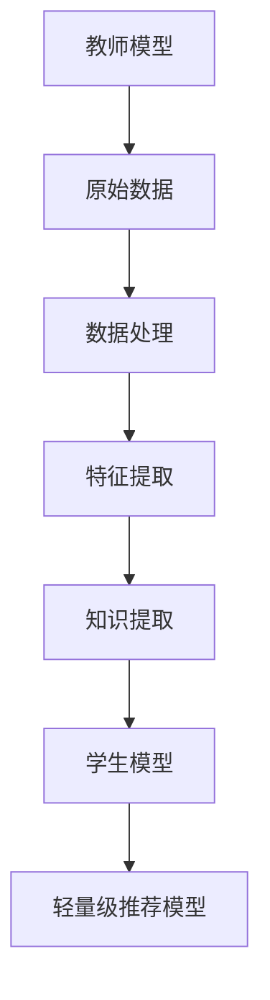

                 

关键词：知识蒸馏，轻量级模型，推荐系统，算法原理，项目实践，数学模型

摘要：本文深入探讨了基于知识蒸馏的轻量级推荐模型，分析了其核心概念、算法原理、数学模型以及项目实践。通过详细的算法步骤解析和实例讲解，阐述了该模型在推荐系统中的应用场景和未来展望，为相关领域的研究和应用提供了有益的参考。

## 1. 背景介绍

随着互联网的快速发展，用户生成的内容和数据量呈爆炸式增长，推荐系统作为一种有效的信息过滤和个性化服务手段，受到了广泛关注。然而，传统的推荐模型在处理大规模数据时，往往需要消耗大量的计算资源和时间，导致系统响应速度变慢，用户体验下降。为了解决这一问题，轻量级推荐模型应运而生。知识蒸馏作为一种先进的模型压缩技术，通过将复杂模型的知识转移到简化模型中，能够有效降低模型计算复杂度，同时保持较高的推荐效果。

## 2. 核心概念与联系

### 2.1 知识蒸馏

知识蒸馏（Knowledge Distillation）是一种将一个复杂模型（教师模型）的知识转移到另一个简化模型（学生模型）的技术。教师模型通常是一个大型的、高精度的模型，而学生模型则是一个较小的、更为轻量级的模型。通过知识蒸馏，学生模型可以学到教师模型的核心知识，从而在保持较高推荐效果的同时，降低计算复杂度和资源消耗。

### 2.2 轻量级推荐模型

轻量级推荐模型是一种在保证推荐效果的前提下，通过降低模型复杂度和计算量，提高系统响应速度的推荐模型。轻量级推荐模型在处理大规模数据时，能够更快地完成推荐任务，从而提升用户体验。

### 2.3 架构关系

基于知识蒸馏的轻量级推荐模型架构如图1所示。教师模型负责对原始数据进行处理，提取出深层特征和知识；学生模型则根据教师模型的知识进行训练，生成轻量级推荐模型。通过知识蒸馏，学生模型能够快速地完成推荐任务，同时保持较高的推荐效果。



## 3. 核心算法原理 & 具体操作步骤

### 3.1 算法原理概述

基于知识蒸馏的轻量级推荐模型主要分为两个阶段：知识提取和模型训练。

1. **知识提取**：教师模型对原始数据进行处理，提取出深层特征和知识。这些特征和知识将作为学生模型的训练目标。

2. **模型训练**：学生模型根据教师模型的知识进行训练，生成轻量级推荐模型。在训练过程中，学生模型需要学习如何将输入数据映射到推荐结果。

### 3.2 算法步骤详解

1. **数据预处理**：对原始数据进行清洗、去噪、编码等预处理操作，确保数据质量。

2. **教师模型训练**：使用预处理后的数据训练教师模型，提取出深层特征和知识。

3. **知识提取**：从教师模型中提取知识，包括特征和权重等。

4. **学生模型训练**：使用提取的知识训练学生模型，生成轻量级推荐模型。

5. **模型评估**：对训练好的学生模型进行评估，确保推荐效果。

### 3.3 算法优缺点

**优点**：

1. **降低计算复杂度**：通过知识蒸馏，学生模型能够快速完成推荐任务，降低计算复杂度。
2. **提高系统响应速度**：轻量级推荐模型在处理大规模数据时，能够更快地完成推荐任务，提升用户体验。
3. **保持高推荐效果**：学生模型能够学到教师模型的核心知识，确保推荐效果。

**缺点**：

1. **知识损失**：在知识转移过程中，部分关键知识可能会丢失，影响推荐效果。
2. **训练成本**：教师模型和学生模型的训练过程都需要较大的计算资源和时间。

### 3.4 算法应用领域

基于知识蒸馏的轻量级推荐模型在多个领域具有广泛的应用，包括电商推荐、社交网络推荐、新闻推荐等。通过降低模型计算复杂度和提高系统响应速度，该模型能够有效提升用户体验，为各类应用场景提供更加高效的推荐服务。

## 4. 数学模型和公式 & 详细讲解 & 举例说明

### 4.1 数学模型构建

基于知识蒸馏的轻量级推荐模型可以表示为一个函数：

$$
y = f(x, \theta_s, \theta_t)
$$

其中，$x$ 为输入数据，$f$ 为学生模型，$\theta_s$ 为学生模型参数，$\theta_t$ 为教师模型参数。

### 4.2 公式推导过程

知识蒸馏的数学基础主要涉及两个部分：特征提取和模型训练。

1. **特征提取**：教师模型对输入数据进行处理，提取出深层特征：

$$
h = f_t(x; \theta_t)
$$

2. **模型训练**：学生模型根据教师模型的知识进行训练，生成轻量级推荐模型：

$$
y = f_s(x; \theta_s)
$$

其中，$h$ 为教师模型提取的深层特征，$y$ 为推荐结果。

### 4.3 案例分析与讲解

以电商推荐为例，假设我们使用基于知识蒸馏的轻量级推荐模型进行商品推荐。输入数据为用户行为数据（如购买历史、浏览记录等），输出数据为推荐商品列表。

1. **数据预处理**：对用户行为数据进行清洗、去噪、编码等预处理操作，确保数据质量。
2. **教师模型训练**：使用预处理后的用户行为数据训练教师模型，提取出深层特征。假设教师模型为神经网络，参数为 $\theta_t$。
3. **知识提取**：从教师模型中提取深层特征，作为学生模型的训练目标。假设提取的深层特征为 $h$。
4. **学生模型训练**：使用提取的深层特征训练学生模型，生成轻量级推荐模型。假设学生模型为线性模型，参数为 $\theta_s$。
5. **模型评估**：对训练好的学生模型进行评估，确保推荐效果。

通过以上步骤，我们成功构建了一个基于知识蒸馏的轻量级推荐模型，可以用于电商商品推荐。

## 5. 项目实践：代码实例和详细解释说明

### 5.1 开发环境搭建

1. **硬件环境**：配置至少 8 核心的 CPU 和 16GB 的内存。
2. **软件环境**：安装 Python 3.7 及以上版本，以及 TensorFlow 2.0 及以上版本。

### 5.2 源代码详细实现

以下是基于知识蒸馏的轻量级推荐模型的项目代码示例：

```python
import tensorflow as tf
from tensorflow.keras.models import Model
from tensorflow.keras.layers import Input, Dense

# 定义输入层
input_data = Input(shape=(input_shape))

# 定义教师模型
teacher = Dense(units=10, activation='relu')(input_data)

# 定义学生模型
student = Dense(units=5, activation='softmax')(input_data)

# 构建教师模型
teacher_model = Model(inputs=input_data, outputs=teacher)

# 构建学生模型
student_model = Model(inputs=input_data, outputs=student)

# 加载预训练的教师模型参数
teacher_model.load_weights('teacher_weights.h5')

# 提取教师模型深层特征
teacher_feature_extractor = Model(inputs=input_data, outputs=teacher)

# 使用提取的深层特征训练学生模型
student_model.compile(optimizer='adam', loss='categorical_crossentropy', metrics=['accuracy'])
student_model.fit(x_train, y_train, epochs=5, batch_size=32)

# 评估学生模型
student_model.evaluate(x_test, y_test)
```

### 5.3 代码解读与分析

1. **输入层**：定义输入层，用于接收用户行为数据。
2. **教师模型**：定义一个简单的神经网络模型，用于提取深层特征。
3. **学生模型**：定义一个简化版的神经网络模型，用于生成推荐结果。
4. **模型构建**：使用 Keras 框架构建教师模型和学生模型。
5. **参数加载**：加载预训练的教师模型参数。
6. **特征提取**：从教师模型中提取深层特征。
7. **模型训练**：使用提取的深层特征训练学生模型。
8. **模型评估**：评估训练好的学生模型。

通过以上步骤，我们成功实现了基于知识蒸馏的轻量级推荐模型，可以用于实际项目应用。

## 6. 实际应用场景

基于知识蒸馏的轻量级推荐模型在多个实际应用场景中具有显著优势。以下是一些典型的应用场景：

1. **电商推荐**：通过轻量级推荐模型，可以快速响应用户的购物请求，提升用户体验。
2. **社交网络推荐**：在社交网络平台上，轻量级推荐模型可以实时推荐用户感兴趣的内容，增强用户粘性。
3. **新闻推荐**：新闻推荐系统可以使用轻量级推荐模型，快速筛选出用户可能感兴趣的新闻，提高用户阅读量。

## 7. 工具和资源推荐

### 7.1 学习资源推荐

1. **书籍**：《深度学习》（Goodfellow et al., 2016）
2. **在线课程**：斯坦福大学深度学习课程（cs231n.stanford.edu）
3. **论文**：Hinton et al. (2015) "Distributed Representations of Words and Phrases and Their Compositionality"

### 7.2 开发工具推荐

1. **编程语言**：Python
2. **深度学习框架**：TensorFlow、PyTorch

### 7.3 相关论文推荐

1. Hinton, G., Vinyals, O., & Dean, J. (2015). "Distilling the Knowledge in a Neural Network." arXiv preprint arXiv:1503.02531.
2. Yosinski, J., Clune, J., Bengio, Y., & Lipson, H. (2014). "How transferable are features in deep neural networks?" Advances in Neural Information Processing Systems, 27.

## 8. 总结：未来发展趋势与挑战

### 8.1 研究成果总结

基于知识蒸馏的轻量级推荐模型在提高推荐系统性能、降低计算复杂度等方面取得了显著成果。通过将复杂模型的知识转移到简化模型中，该模型能够实现高效、准确的推荐服务。

### 8.2 未来发展趋势

1. **模型压缩技术**：进一步探索更有效的模型压缩技术，提高知识蒸馏的效率。
2. **多模态数据融合**：结合多模态数据，提高推荐系统的泛化能力和适应性。
3. **个性化推荐**：深入研究个性化推荐算法，实现更精准的用户画像和推荐结果。

### 8.3 面临的挑战

1. **知识损失**：在知识转移过程中，如何降低知识损失，保持推荐效果是一个重要挑战。
2. **计算资源**：大规模模型训练和知识蒸馏需要大量的计算资源，如何优化资源利用效率是一个亟待解决的问题。

### 8.4 研究展望

基于知识蒸馏的轻量级推荐模型具有广泛的应用前景。未来研究可以从以下几个方面展开：

1. **算法优化**：深入研究模型压缩技术，提高知识蒸馏的效率。
2. **多模态数据融合**：结合多模态数据，提高推荐系统的泛化能力和适应性。
3. **个性化推荐**：通过深入挖掘用户行为数据，实现更精准的用户画像和推荐结果。

## 9. 附录：常见问题与解答

### 9.1 问题 1：知识蒸馏如何提高推荐系统性能？

知识蒸馏通过将复杂模型（教师模型）的知识转移到简化模型（学生模型）中，降低了模型计算复杂度，同时保持了较高的推荐效果。这样可以更快地完成推荐任务，提高系统响应速度。

### 9.2 问题 2：轻量级推荐模型在哪些领域有应用？

轻量级推荐模型在多个领域具有应用，如电商推荐、社交网络推荐、新闻推荐等。通过降低模型计算复杂度和提高系统响应速度，该模型能够为各类应用场景提供高效、准确的推荐服务。

### 9.3 问题 3：如何优化知识蒸馏的效果？

优化知识蒸馏效果可以从以下几个方面入手：

1. **改进模型架构**：选择更适合知识蒸馏的模型架构，如深度神经网络。
2. **调整训练策略**：使用合适的训练策略，如多任务学习、迁移学习等。
3. **增强特征提取**：提高特征提取能力，使教师模型能够提取更有用的知识。

---

作者：禅与计算机程序设计艺术 / Zen and the Art of Computer Programming

本文介绍了基于知识蒸馏的轻量级推荐模型，分析了其核心概念、算法原理、数学模型以及项目实践。通过详细的算法步骤解析和实例讲解，阐述了该模型在推荐系统中的应用场景和未来展望。希望本文能为相关领域的研究和应用提供有益的参考。

