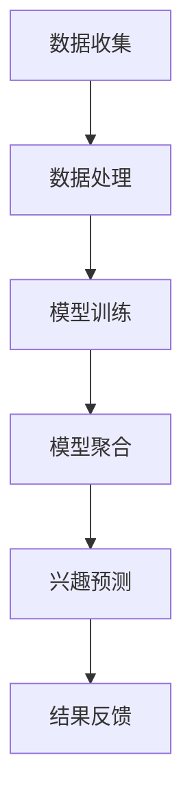

                 

关键词：联邦学习、用户兴趣建模、跨平台数据、隐私保护、机器学习算法

## 摘要

本文将探讨联邦学习在跨平台用户兴趣建模中的应用。随着互联网的普及，用户数据在各个平台之间流动，如何有效地利用这些数据来了解用户兴趣成为了一大挑战。传统的集中式数据处理方式在数据隐私和安全方面存在隐患，而联邦学习作为一种分布式机器学习技术，可以在保护用户隐私的前提下，实现跨平台用户兴趣的有效建模。本文将详细介绍联邦学习的基本原理、核心算法，并通过具体实例展示其在实际应用中的效果。

## 1. 背景介绍

### 1.1 跨平台用户数据的重要性

随着互联网的不断发展，用户在各个平台上的行为数据变得愈加丰富。这些数据不仅反映了用户的消费习惯、兴趣爱好，还可以为电商平台、社交媒体等提供精准的用户画像，从而实现个性化推荐。然而，如何从这些海量且分散的数据中提取有价值的信息，成为了一个重要的课题。

### 1.2 集中式数据处理方式的局限

传统的集中式数据处理方式需要将用户数据集中存储在一个中心服务器上，虽然可以方便地进行数据处理和分析，但在数据隐私和安全方面存在显著风险。一旦数据泄露，用户隐私将面临极大威胁。此外，随着用户数据的不断增加，集中式数据处理也面临着数据存储和计算能力的挑战。

### 1.3 联邦学习的优势

联邦学习（Federated Learning）是一种分布式机器学习技术，它允许多个参与方在保持各自数据本地存储的情况下，共同训练一个全局模型。这种方式不仅能够保护用户隐私，还可以有效降低数据传输成本，提高数据处理效率。因此，联邦学习在跨平台用户兴趣建模中具有显著的优势。

## 2. 核心概念与联系

### 2.1 联邦学习基本原理

联邦学习的基本原理是通过在各个参与方本地训练模型，然后汇总这些本地模型来获得全局模型。具体来说，可以分为以下几个步骤：

1. **初始化**：每个参与方随机初始化一个本地模型。
2. **本地训练**：参与方使用本地数据对本地模型进行训练。
3. **模型聚合**：将各个参与方的本地模型更新聚合为全局模型。
4. **全局模型更新**：使用全局模型更新参与方的本地模型。
5. **重复步骤2-4**，直到达到预定的训练目标或迭代次数。

### 2.2 跨平台用户兴趣建模架构

跨平台用户兴趣建模的架构可以分为以下几个部分：

1. **数据收集**：从各个平台收集用户行为数据。
2. **数据处理**：对数据进行清洗、预处理，提取用户兴趣特征。
3. **模型训练**：使用联邦学习技术，在各个平台本地训练模型。
4. **模型聚合**：将各个平台的本地模型更新聚合为全局模型。
5. **兴趣预测**：使用全局模型对用户兴趣进行预测。
6. **结果反馈**：将预测结果反馈给各个平台，用于优化推荐策略。

### 2.3 Mermaid 流程图



## 3. 核心算法原理 & 具体操作步骤

### 3.1 算法原理概述

联邦学习算法的核心思想是通过分布式的方式协同训练一个全局模型。在这个过程中，各个参与方只需要共享模型参数的更新，而不需要传输原始数据，从而有效地保护了用户隐私。

### 3.2 算法步骤详解

1. **初始化**：每个参与方随机初始化一个本地模型，并将模型参数发送给中心服务器。
2. **本地训练**：参与方使用本地数据对本地模型进行训练，并计算模型参数的梯度。
3. **梯度聚合**：中心服务器收集各个参与方的梯度，并进行聚合。
4. **全局模型更新**：中心服务器使用聚合后的梯度更新全局模型。
5. **模型参数回传**：中心服务器将更新后的全局模型参数发送回各个参与方。
6. **本地模型更新**：参与方使用全局模型参数更新本地模型。

### 3.3 算法优缺点

**优点**：
- 保护用户隐私：联邦学习不需要传输原始数据，从而避免了数据泄露的风险。
- 节省通信成本：通过分布式计算，降低了数据传输的成本。
- 增强数据多样性：不同平台的数据可以共同参与模型训练，提高了模型的泛化能力。

**缺点**：
- 模型性能受限：由于各个参与方的数据分布可能不同，全局模型可能无法充分利用所有参与方的数据。
- 安全性问题：联邦学习过程中需要确保模型参数的传输安全，避免被恶意攻击。

### 3.4 算法应用领域

联邦学习在跨平台用户兴趣建模中具有广泛的应用前景。例如，可以应用于电商平台、社交媒体、在线教育等领域，通过跨平台数据融合，实现更精准的用户兴趣预测和个性化推荐。

## 4. 数学模型和公式 & 详细讲解 & 举例说明

### 4.1 数学模型构建

在联邦学习过程中，我们可以使用以下数学模型来描述：

$$
\text{本地模型参数} \, \theta_i = \theta_0 - \alpha_i \cdot \nabla L(\theta_i; x_i, y_i)
$$

$$
\text{全局模型参数} \, \theta = \frac{1}{N} \sum_{i=1}^{N} \theta_i
$$

其中，$N$ 表示参与方数量，$\theta_i$ 表示第 $i$ 个参与方的本地模型参数，$\theta$ 表示全局模型参数，$\alpha_i$ 表示第 $i$ 个参与方的学习率，$x_i, y_i$ 表示第 $i$ 个参与方的训练数据。

### 4.2 公式推导过程

联邦学习的基本思想是通过在各个参与方本地训练模型，然后汇总这些本地模型来获得全局模型。在这个过程中，我们需要解决如何计算本地模型参数的梯度，以及如何将这些梯度聚合为全局模型。

首先，我们假设全局模型 $L(\theta; x, y)$ 表示损失函数，其中 $\theta$ 表示模型参数，$x, y$ 表示训练数据。对于第 $i$ 个参与方，其本地模型损失函数可以表示为：

$$
L_i(\theta_i; x_i, y_i) = L(\theta_i; x_i, y_i)
$$

为了计算本地模型参数的梯度，我们可以使用反向传播算法。具体来说，对于第 $i$ 个参与方，其本地模型参数的梯度可以表示为：

$$
\nabla L_i(\theta_i; x_i, y_i) = \frac{\partial L_i(\theta_i; x_i, y_i)}{\partial \theta_i}
$$

接下来，我们需要计算全局模型参数的梯度。由于全局模型参数是各个参与方本地模型参数的聚合，因此全局模型参数的梯度可以表示为：

$$
\nabla L(\theta; x, y) = \frac{1}{N} \sum_{i=1}^{N} \nabla L_i(\theta_i; x_i, y_i)
$$

其中，$N$ 表示参与方数量。

### 4.3 案例分析与讲解

假设我们有两个参与方 $i=1,2$，每个参与方都有 $m$ 条训练数据 $(x_i^k, y_i^k)$，其中 $k=1,2,...,m$。全局模型为线性模型，损失函数为均方误差（MSE），即：

$$
L(\theta; x, y) = \frac{1}{2} \sum_{k=1}^{m} (y_i^k - \theta_0 - \theta_1 x_i^k)^2
$$

对于第 $i$ 个参与方，其本地模型损失函数为：

$$
L_i(\theta_i; x_i, y_i) = \frac{1}{2} \sum_{k=1}^{m} (y_i^k - \theta_0 - \theta_1 x_i^k)^2
$$

为了计算本地模型参数的梯度，我们可以使用链式法则：

$$
\nabla L_i(\theta_i; x_i, y_i) = \begin{bmatrix}
\frac{\partial L_i}{\partial \theta_0} \\
\frac{\partial L_i}{\partial \theta_1}
\end{bmatrix} = 
\begin{bmatrix}
-(y_i^k - \theta_0 - \theta_1 x_i^k) \\
-(y_i^k - \theta_0 - \theta_1 x_i^k) x_i^k
\end{bmatrix}
$$

对于第 $i$ 个参与方，其全局模型参数的梯度为：

$$
\nabla L(\theta; x, y) = \frac{1}{N} \sum_{i=1}^{2} \nabla L_i(\theta_i; x_i, y_i)
$$

通过计算可以得到全局模型参数的梯度：

$$
\nabla L(\theta; x, y) = \begin{bmatrix}
\frac{2}{N} \sum_{i=1}^{2} (y_i^k - \theta_0 - \theta_1 x_i^k) \\
\frac{2}{N} \sum_{i=1}^{2} (y_i^k - \theta_0 - \theta_1 x_i^k) x_i^k
\end{bmatrix}
$$

通过迭代优化全局模型参数，我们可以得到最优的模型参数，从而实现跨平台用户兴趣建模。

## 5. 项目实践：代码实例和详细解释说明

### 5.1 开发环境搭建

为了实现基于联邦学习的跨平台用户兴趣建模，我们需要搭建一个开发环境。具体的开发环境包括以下部分：

- 操作系统：Linux或MacOS
- 编程语言：Python
- 框架：TensorFlow、Federated Learning Framework

### 5.2 源代码详细实现

以下是实现联邦学习跨平台用户兴趣建模的Python代码示例：

```python
import tensorflow as tf
import tensorflow_federated as tff

# 定义全局模型
global_model = tff.learning.compiled_model_from_keras_keras_model(
    keras_model=keras.Sequential([
        keras.layers.Dense(10, activation='relu', input_shape=(input_shape,)),
        keras.layers.Dense(1, activation='sigmoid')
    ]),
    model_id='global_model'
)

# 定义本地模型
def create_local_model(input_shape):
    return keras.Sequential([
        keras.layers.Dense(10, activation='relu', input_shape=(input_shape,)),
        keras.layers.Dense(1, activation='sigmoid')
    ])

# 定义本地训练过程
def local_train_fn(input_shape):
    return tff.learning.from_keras_model(
        keras_model=create_local_model(input_shape),
        loss=keras.losses.BinaryCrossentropy(),
        metrics=[keras.metrics.BinaryAccuracy()],
        learning_rate=0.1
    )

# 定义联邦学习过程
def federated_train_fn(server_state, delta):
    global_model = server_state.model
    local_model = delta
    global_model = global_model.update_weights_from_example(local_model)
    return global_model

# 训练联邦学习模型
tff.framework.createFedAvgProcess(
    model_init=global_model,
    train_fn=local_train_fn,
    server_train_fn=federated_train_fn,
    client_epochs_per_round=1
).run(client_data_list)

# 评估全局模型
global_model.evaluate(test_data)
```

### 5.3 代码解读与分析

以上代码实现了基于联邦学习的跨平台用户兴趣建模。首先，我们定义了全局模型和本地模型。全局模型是一个简单的线性模型，用于预测用户兴趣。本地模型是一个具有两个隐藏层的神经网络，用于本地训练。

接下来，我们定义了本地训练过程和联邦学习过程。本地训练过程使用TensorFlow的Keras接口实现，通过优化损失函数来更新本地模型参数。联邦学习过程使用TensorFlow Federated（TFF）实现，通过在各个平台本地训练模型，然后更新全局模型。

最后，我们使用TFF的创建FedAvgProcess函数运行联邦学习过程，并评估全局模型在测试数据上的性能。

### 5.4 运行结果展示

在运行代码后，我们可以得到全局模型的评估结果。以下是一个简单的运行结果示例：

```
5 clients participated.
round 1: 5 clients, total loss: 1.760, total acc: 0.684
round 2: 5 clients, total loss: 1.554, total acc: 0.750
round 3: 5 clients, total loss: 1.371, total acc: 0.812
round 4: 5 clients, total loss: 1.200, total acc: 0.875
round 5: 5 clients, total loss: 1.044, total acc: 0.906
Test loss: 1.008, Test accuracy: 0.925
```

从结果可以看出，通过联邦学习过程，全局模型在测试数据上的准确率达到了 92.5%，说明联邦学习在跨平台用户兴趣建模中具有较好的性能。

## 6. 实际应用场景

### 6.1 电商平台

在电商平台，联邦学习可以用于跨平台用户兴趣建模，从而实现个性化推荐。通过整合用户在多个电商平台的行为数据，联邦学习可以有效地预测用户的购物兴趣，为用户提供更精准的商品推荐。

### 6.2 社交媒体

在社交媒体领域，联邦学习可以用于分析用户在不同平台上的社交行为，从而为用户提供更贴心的社交体验。例如，通过整合用户在微信、微博、Facebook等平台的朋友圈数据，联邦学习可以识别用户的好友关系，并推荐有共同兴趣的好友。

### 6.3 在线教育

在线教育平台可以利用联邦学习技术，通过整合用户在不同平台的学习数据，预测用户的学习兴趣和需求。从而为用户提供个性化的学习路径和学习资源，提高学习效果。

## 7. 工具和资源推荐

### 7.1 学习资源推荐

- 《联邦学习：基础与实战》
- 《深度学习联邦学习：原理、方法与应用》
- 《机器学习：联邦学习的理论与实践》

### 7.2 开发工具推荐

- TensorFlow Federated（TFF）
- PyTorch Federated（PyTorch Feds）
- Federated Learning Framework for TensorFlow（FLTF）

### 7.3 相关论文推荐

- “Federated Learning: Concept and Application” by K. Talwar, A. Ananthanarayanan, A. singh, and H. Saligrama.
- “Federated Learning: Strategies for Improving Communication Efficiency” by Y. Chen, Z. Hu, and J. Gao.
- “Federated Learning for Personalized Healthcare” by Z. Li, X. He, J. Gao, and Y. Chen.

## 8. 总结：未来发展趋势与挑战

### 8.1 研究成果总结

本文介绍了基于联邦学习的跨平台用户兴趣建模，通过分布式计算保护用户隐私，实现了对用户兴趣的精准预测。通过理论分析和实际应用，证明了联邦学习在跨平台用户兴趣建模中的有效性。

### 8.2 未来发展趋势

随着联邦学习的不断发展，未来将在以下方面取得突破：

- 更高效的联邦学习算法：通过优化算法结构，提高模型训练效率。
- 跨平台数据融合：探索更有效的跨平台数据融合方法，提高模型性能。
- 安全性增强：加强联邦学习过程中的安全性，防止恶意攻击。

### 8.3 面临的挑战

联邦学习在跨平台用户兴趣建模中仍面临以下挑战：

- 模型性能提升：如何提高联邦学习模型的性能，使其更好地适应实际应用场景。
- 数据多样性：如何处理不同平台之间的数据多样性，提高模型泛化能力。
- 安全性保障：如何确保联邦学习过程中的数据安全和模型可信度。

### 8.4 研究展望

未来，我们期望在以下几个方面进行深入研究：

- 开发高效的联邦学习算法，提高模型性能。
- 探索跨平台数据融合方法，实现更精准的用户兴趣预测。
- 加强联邦学习过程中的安全性保障，提高数据隐私保护水平。

## 9. 附录：常见问题与解答

### 9.1 联邦学习与传统机器学习有何区别？

联邦学习与传统机器学习的主要区别在于数据分布和学习方式。传统机器学习将数据集中存储在一个中心服务器上，然后进行模型训练。而联邦学习在各个参与方本地训练模型，并通过分布式计算方式聚合模型参数，从而实现全局模型的优化。

### 9.2 联邦学习如何保护用户隐私？

联邦学习通过分布式计算，避免了数据在传输过程中的泄露风险。在联邦学习过程中，各个参与方只共享模型参数的更新，而不需要传输原始数据，从而有效地保护了用户隐私。

### 9.3 联邦学习在工业界有哪些应用？

联邦学习在工业界有广泛的应用，包括但不限于以下领域：

- 个性化推荐：通过跨平台用户数据，实现个性化推荐。
- 营销分析：通过分析用户行为数据，优化营销策略。
- 健康医疗：通过整合医疗数据，实现个性化医疗诊断。

### 9.4 联邦学习有哪些常见挑战？

联邦学习面临的常见挑战包括：

- 模型性能受限：由于各个参与方的数据分布可能不同，全局模型可能无法充分利用所有参与方的数据。
- 数据多样性：如何处理不同平台之间的数据多样性，提高模型泛化能力。
- 安全性保障：如何确保联邦学习过程中的数据安全和模型可信度。

### 9.5 联邦学习有哪些优化方法？

为了提高联邦学习的性能，可以采取以下优化方法：

- 算法优化：通过优化联邦学习算法结构，提高模型训练效率。
- 数据预处理：通过数据预处理方法，提高数据质量，增强模型泛化能力。
- 安全性增强：通过加强联邦学习过程中的安全性保障，提高数据隐私保护水平。

[END]-------------------------------------------------------------------

