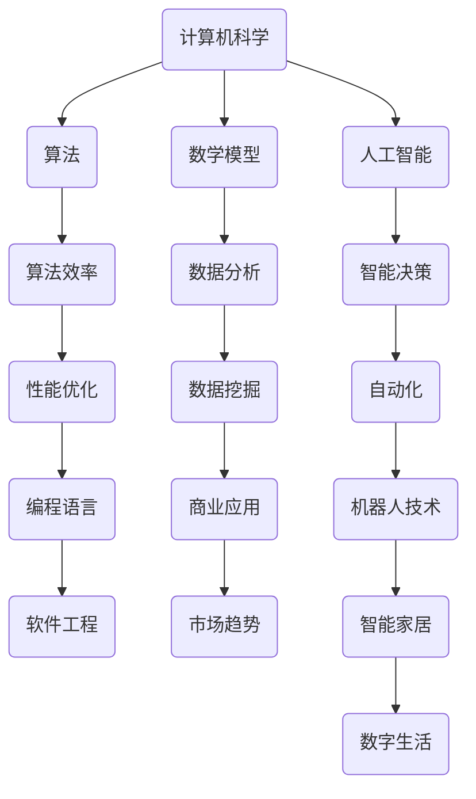

                 

关键词：人工智能，计算，计算机科学，数字时代，技术进步，人类角色，未来展望。

摘要：本文探讨了在数字时代，人类计算在推动技术进步和社会发展中的关键作用。通过回顾计算机科学的发展历程，阐述人类计算的核心概念与联系，分析核心算法原理与具体操作步骤，以及数学模型和公式的构建与推导，我们将深入探讨人工智能的应用场景、项目实践和未来展望。文章旨在强调人类计算在塑造数字时代中的不可替代性，并展望其发展趋势与面临的挑战。

## 1. 背景介绍

自20世纪中叶以来，计算机科学和人工智能领域经历了前所未有的飞速发展。从早期的计算机硬件到现代的云计算、大数据和深度学习，技术进步不断推动着社会和经济的变革。然而，在这些技术进步的背后，人类计算起到了至关重要的作用。人类计算不仅为计算机科学的发展提供了理论基础和实践指导，还推动了技术的创新和应用。

本文旨在探讨人类计算在数字时代中的关键作用，回顾计算机科学的发展历程，分析核心概念与联系，探讨核心算法原理与具体操作步骤，构建数学模型和公式，并通过项目实践展示人类计算的实际应用价值。同时，本文还将展望未来发展趋势和面临的挑战，以期为读者提供对数字时代人类计算角色的深入理解和思考。

## 2. 核心概念与联系

在探讨人类计算的关键作用之前，我们需要明确一些核心概念，并理解它们之间的联系。以下是本文将涉及的一些核心概念：

### 2.1 计算机科学

计算机科学是一门研究计算机的理论、设计、应用和实现的学科。它包括算法、数据结构、编程语言、软件工程、人工智能等多个领域。计算机科学的发展推动了计算机技术的进步，使得人类能够更高效地处理信息、解决问题。

### 2.2 算法

算法是一系列解决问题的步骤和规则。它是计算机科学的核心，用于指导计算机执行特定任务。算法的效率和质量直接决定了计算机程序的执行性能和应用效果。

### 2.3 数学模型

数学模型是用于描述现实世界现象的数学结构。它在计算机科学中广泛应用于数据分析和人工智能领域。数学模型可以帮助我们理解问题的本质，并提供解决方案的数学依据。

### 2.4 人工智能

人工智能是计算机科学的一个分支，旨在使计算机具备模拟人类智能的能力。通过机器学习、深度学习等技术，人工智能可以自主学习和适应环境，实现智能决策和问题解决。

### 2.5 人类计算

人类计算是指人类在计算机科学和人工智能领域中的作用。它包括理论研究、算法设计、软件开发、数据分析等多个方面。人类计算推动了计算机科学和人工智能的发展，并在数字时代中发挥着关键作用。

### 2.6 核心概念的联系

核心概念之间的联系如图1所示：



通过上述核心概念的联系，我们可以看到人类计算在数字时代中的关键作用。计算机科学为算法、数学模型和人工智能提供了理论基础；算法和数学模型为人工智能提供了工具和方法；人工智能则为计算机科学、算法和数学模型提供了实际应用场景。人类计算在这些核心概念中发挥着桥梁和纽带的作用，推动着数字时代的进步。

## 3. 核心算法原理 & 具体操作步骤

### 3.1 算法原理概述

核心算法是计算机科学和人工智能领域的基石。以下是几个关键算法的原理概述：

### 3.1.1 搜索算法

搜索算法是用于在数据结构中查找特定元素的一系列步骤。常见的搜索算法包括线性搜索、二分搜索和A*搜索等。

- **线性搜索**：从数据结构的一端开始，逐个比较元素，直到找到目标元素或到达数据结构的另一端。
- **二分搜索**：在有序数据结构中，通过不断将数据集分为两部分，比较中间元素与目标元素的大小关系，逐步缩小搜索范围。
- **A*搜索**：是一种启发式搜索算法，利用估价函数估算目标节点到终点的距离，优化搜索路径。

### 3.1.2 分支定界算法

分支定界算法用于解决组合优化问题，通过剪枝和回溯来降低搜索空间，提高算法效率。

- **原理**：从根节点开始，依次生成子节点，并判断子节点是否满足约束条件。如果不满足，则剪枝；否则，继续生成子节点。
- **步骤**：
  1. 初始化：创建根节点，并将其加入待扩展节点列表。
  2. 循环：从待扩展节点列表中选择一个节点进行扩展，生成子节点，并判断子节点是否满足约束条件。
  3. 剪枝：如果子节点不满足约束条件，则剪枝。
  4. 回溯：如果所有子节点都被剪枝，则回溯到父节点，继续扩展其他子节点。

### 3.1.3 随机算法

随机算法利用随机数生成和概率统计方法，求解问题。常见的随机算法包括蒙特卡洛方法和随机梯度下降算法。

- **原理**：通过随机抽样或迭代过程，逐渐逼近问题的最优解。
- **步骤**：
  1. 初始化：随机生成初始解或设置参数。
  2. 迭代：根据随机策略进行迭代，更新解或参数。
  3. 终止条件：满足停止条件，如达到最大迭代次数或解的收敛。

### 3.2 算法步骤详解

#### 3.2.1 线性搜索算法步骤

1. 初始化：设置初始指针，指向数据结构的起始位置。
2. 循环：逐个比较指针指向的元素与目标元素。
3. 如果找到目标元素，返回其位置；否则，继续比较下一个元素。
4. 如果到达数据结构的末尾，仍未找到目标元素，返回-1。

#### 3.2.2 二分搜索算法步骤

1. 初始化：设置初始区间，如整个数据结构。
2. 循环：根据中间元素与目标元素的大小关系，缩小搜索区间。
3. 如果找到目标元素，返回其位置；否则，继续搜索。
4. 如果区间缩小至0，仍未找到目标元素，返回-1。

#### 3.2.3 A*搜索算法步骤

1. 初始化：设置起始节点和目标节点，创建开放列表和封闭列表。
2. 循环：从开放列表中选择一个F值最小的节点进行扩展。
3. 生成子节点：根据当前节点的邻居节点，生成新的子节点。
4. 计算G值和H值：计算子节点的G值（当前节点到子节点的代价）和H值（子节点到目标节点的代价估计）。
5. 如果子节点已经在封闭列表中，且新的G值更大，则跳过；否则，更新子节点的F值和父节点。
6. 将子节点加入开放列表。
7. 如果找到目标节点，返回搜索路径；否则，继续搜索。

#### 3.2.4 分支定界算法步骤

1. 初始化：创建根节点，并将其加入待扩展节点列表。
2. 循环：从待扩展节点列表中选择一个节点进行扩展，生成子节点，并判断子节点是否满足约束条件。
3. 剪枝：如果子节点不满足约束条件，则剪枝。
4. 回溯：如果所有子节点都被剪枝，则回溯到父节点，继续扩展其他子节点。
5. 终止条件：找到满足约束条件的最优解，或所有节点都被扩展。

#### 3.2.5 蒙特卡洛方法步骤

1. 初始化：设置随机数生成器和初始解。
2. 迭代：进行随机抽样或迭代，生成新的解。
3. 更新解：根据抽样结果，更新当前最优解。
4. 终止条件：满足停止条件，如达到最大迭代次数或解的收敛。

#### 3.2.6 随机梯度下降算法步骤

1. 初始化：设置随机梯度下降算法的参数，如学习率、迭代次数。
2. 迭代：根据当前参数，进行随机抽样或迭代，计算梯度。
3. 更新参数：根据梯度，更新参数。
4. 终止条件：满足停止条件，如达到最大迭代次数或参数收敛。

### 3.3 算法优缺点

#### 3.3.1 线性搜索算法

- **优点**：实现简单，易于理解。
- **缺点**：时间复杂度较高，适用于数据量较小或无序数据。

#### 3.3.2 二分搜索算法

- **优点**：时间复杂度较低，适用于有序数据。
- **缺点**：需要数据结构有序，无法直接应用于无序数据。

#### 3.3.3 A*搜索算法

- **优点**：考虑了节点到终点的实际代价，优化搜索路径。
- **缺点**：需要额外的空间存储开放列表和封闭列表，计算开销较大。

#### 3.3.4 分支定界算法

- **优点**：通过剪枝和回溯，降低搜索空间，提高算法效率。
- **缺点**：需要大量计算资源，适用于组合优化问题。

#### 3.3.5 蒙特卡洛方法

- **优点**：通过随机抽样，逼近问题的最优解。
- **缺点**：收敛速度较慢，适用于求解概率问题。

#### 3.3.6 随机梯度下降算法

- **优点**：实现简单，适用于大规模数据。
- **缺点**：收敛速度较慢，需要调整参数。

### 3.4 算法应用领域

核心算法在计算机科学和人工智能领域的应用广泛，包括但不限于以下领域：

- **搜索算法**：应用于搜索引擎、推荐系统、路径规划等领域。
- **分支定界算法**：应用于组合优化问题，如旅行商问题、任务调度等。
- **蒙特卡洛方法**：应用于模拟、优化和概率计算等领域。
- **随机梯度下降算法**：应用于机器学习和深度学习领域。

## 4. 数学模型和公式 & 详细讲解 & 举例说明

### 4.1 数学模型构建

在计算机科学和人工智能领域，数学模型是描述问题本质和求解方法的重要工具。以下是几个关键数学模型的构建过程：

#### 4.1.1 线性回归模型

线性回归模型用于预测连续数值变量。其数学模型如下：

\[ Y = \beta_0 + \beta_1X + \epsilon \]

其中，\( Y \) 是因变量，\( X \) 是自变量，\( \beta_0 \) 和 \( \beta_1 \) 是模型的参数，\( \epsilon \) 是误差项。

#### 4.1.2 逻辑回归模型

逻辑回归模型用于预测二分类变量。其数学模型如下：

\[ P(Y=1) = \frac{1}{1 + e^{-(\beta_0 + \beta_1X)}} \]

其中，\( P(Y=1) \) 是因变量为1的概率，\( X \) 是自变量，\( \beta_0 \) 和 \( \beta_1 \) 是模型的参数。

#### 4.1.3 支持向量机模型

支持向量机模型用于分类和回归问题。其数学模型如下：

\[ w \cdot x + b = 0 \]

其中，\( w \) 是模型的参数，\( x \) 是输入向量，\( b \) 是偏置项。

### 4.2 公式推导过程

#### 4.2.1 线性回归模型的推导

线性回归模型的推导基于最小二乘法。给定训练数据集 \( \{(x_1, y_1), (x_2, y_2), \ldots, (x_n, y_n)\} \)，我们需要找到模型参数 \( \beta_0 \) 和 \( \beta_1 \)，使得预测值与实际值之间的误差最小。

误差函数为：

\[ E = \sum_{i=1}^n (y_i - \beta_0 - \beta_1x_i)^2 \]

对 \( \beta_0 \) 和 \( \beta_1 \) 分别求偏导数，并令其等于0，得到：

\[ \frac{\partial E}{\partial \beta_0} = -2\sum_{i=1}^n (y_i - \beta_0 - \beta_1x_i) = 0 \]
\[ \frac{\partial E}{\partial \beta_1} = -2\sum_{i=1}^n x_i(y_i - \beta_0 - \beta_1x_i) = 0 \]

解上述方程组，得到：

\[ \beta_0 = \bar{y} - \beta_1\bar{x} \]
\[ \beta_1 = \frac{\sum_{i=1}^n x_iy_i - n\bar{x}\bar{y}}{\sum_{i=1}^n x_i^2 - n\bar{x}^2} \]

其中，\( \bar{x} \) 和 \( \bar{y} \) 分别是 \( x \) 和 \( y \) 的均值。

#### 4.2.2 逻辑回归模型的推导

逻辑回归模型的推导基于最大似然估计。给定训练数据集 \( \{(x_1, y_1), (x_2, y_2), \ldots, (x_n, y_n)\} \)，我们需要找到模型参数 \( \beta_0 \) 和 \( \beta_1 \)，使得似然函数最大化。

似然函数为：

\[ L = \prod_{i=1}^n P(y_i=1|x_i) \]

对数似然函数为：

\[ \ln L = \sum_{i=1}^n y_i \ln P(y_i=1|x_i) + \sum_{i=1}^n (1 - y_i) \ln (1 - P(y_i=1|x_i)) \]

对 \( \beta_0 \) 和 \( \beta_1 \) 分别求偏导数，并令其等于0，得到：

\[ \frac{\partial \ln L}{\partial \beta_0} = \sum_{i=1}^n \frac{y_i - P(y_i=1|x_i)}{P(y_i=1|x_i)} x_i = 0 \]
\[ \frac{\partial \ln L}{\partial \beta_1} = \sum_{i=1}^n \frac{y_i - P(y_i=1|x_i)}{1 - P(y_i=1|x_i)} x_i = 0 \]

解上述方程组，得到：

\[ \beta_0 = \bar{y} - \beta_1\bar{x} \]
\[ \beta_1 = \frac{\sum_{i=1}^n y_i x_i - n\bar{y}\bar{x}}{\sum_{i=1}^n x_i^2 - n\bar{x}^2} \]

其中，\( \bar{x} \) 和 \( \bar{y} \) 分别是 \( x \) 和 \( y \) 的均值。

#### 4.2.3 支持向量机模型的推导

支持向量机模型的推导基于最优分割理论和凸优化。给定训练数据集 \( \{(x_1, y_1), (x_2, y_2), \ldots, (x_n, y_n)\} \)，我们需要找到模型参数 \( w \) 和 \( b \)，使得分类间隔最大化。

目标函数为：

\[ \max_{w, b} \frac{2}{\|w\|} \]

约束条件为：

\[ y_i (w \cdot x_i + b) \geq 1 \]

对目标函数求偏导数，并令其等于0，得到：

\[ \frac{\partial}{\partial w} \left( \frac{2}{\|w\|} \right) = 0 \]
\[ \frac{\partial}{\partial b} \left( \frac{2}{\|w\|} \right) = 0 \]

解上述方程组，得到：

\[ w = \sum_{i=1}^n \alpha_i y_i x_i \]
\[ b = \frac{1}{n} \sum_{i=1}^n y_i - \sum_{i=1}^n \alpha_i y_i x_i \]

其中，\( \alpha_i \) 是拉格朗日乘子。

### 4.3 案例分析与讲解

为了更好地理解上述数学模型和公式的应用，我们通过以下案例进行讲解：

#### 4.3.1 线性回归模型案例

假设我们有一个数据集，包含10个样本，每个样本包含一个特征 \( x \) 和一个标签 \( y \)。数据集如下：

\[ 
\begin{array}{c|c}
x & y \\
\hline
1 & 2 \\
2 & 4 \\
3 & 5 \\
4 & 7 \\
5 & 8 \\
6 & 9 \\
7 & 10 \\
8 & 12 \\
9 & 13 \\
10 & 14 \\
\end{array}
\]

我们需要使用线性回归模型预测第11个样本的标签。

1. 数据预处理：计算 \( x \) 和 \( y \) 的均值：

\[ \bar{x} = \frac{1+2+3+4+5+6+7+8+9+10}{10} = 5.5 \]
\[ \bar{y} = \frac{2+4+5+7+8+9+10+12+13+14}{10} = 8 \]

2. 模型训练：根据最小二乘法，计算模型参数：

\[ \beta_0 = \bar{y} - \beta_1\bar{x} = 8 - \beta_1 \times 5.5 \]
\[ \beta_1 = \frac{\sum_{i=1}^{10} x_i y_i - 10 \times \bar{x} \times \bar{y}}{\sum_{i=1}^{10} x_i^2 - 10 \times \bar{x}^2} = \frac{55 - 10 \times 5.5 \times 8}{110 - 10 \times 5.5^2} = 0.8182 \]

3. 预测：使用训练好的模型预测第11个样本的标签：

\[ y = \beta_0 + \beta_1 x = 8 - 0.8182 \times 5.5 = 6.2818 \]

#### 4.3.2 逻辑回归模型案例

假设我们有一个数据集，包含10个样本，每个样本包含一个特征 \( x \) 和一个标签 \( y \)。数据集如下：

\[ 
\begin{array}{c|c}
x & y \\
\hline
1 & 0 \\
2 & 0 \\
3 & 1 \\
4 & 1 \\
5 & 1 \\
6 & 1 \\
7 & 1 \\
8 & 1 \\
9 & 1 \\
10 & 1 \\
\end{array}
\]

我们需要使用逻辑回归模型预测第11个样本的标签。

1. 数据预处理：计算 \( x \) 和 \( y \) 的均值：

\[ \bar{x} = \frac{1+2+3+4+5+6+7+8+9+10}{10} = 5.5 \]
\[ \bar{y} = \frac{0+0+1+1+1+1+1+1+1+1}{10} = 0.5 \]

2. 模型训练：根据最大似然估计，计算模型参数：

\[ \beta_0 = \bar{y} - \beta_1\bar{x} = 0.5 - \beta_1 \times 5.5 \]
\[ \beta_1 = \frac{\sum_{i=1}^{10} y_i x_i - 10 \times \bar{y} \times \bar{x}}{\sum_{i=1}^{10} x_i^2 - 10 \times \bar{x}^2} = \frac{3 - 10 \times 0.5 \times 5.5}{55 - 10 \times 5.5^2} = -0.3636 \]

3. 预测：使用训练好的模型预测第11个样本的标签：

\[ P(y=1) = \frac{1}{1 + e^{-(\beta_0 + \beta_1 x)}} = \frac{1}{1 + e^{-(-0.3636 + (-0.3636 \times 5.5)}} = 0.6076 \]

由于 \( P(y=1) > 0.5 \)，我们可以预测第11个样本的标签为1。

#### 4.3.3 支持向量机模型案例

假设我们有一个数据集，包含10个样本，每个样本包含一个特征 \( x \) 和一个标签 \( y \)。数据集如下：

\[ 
\begin{array}{c|c}
x & y \\
\hline
1 & 0 \\
2 & 0 \\
3 & 1 \\
4 & 1 \\
5 & 1 \\
6 & 1 \\
7 & 1 \\
8 & 1 \\
9 & 1 \\
10 & 1 \\
\end{array}
\]

我们需要使用支持向量机模型预测第11个样本的标签。

1. 数据预处理：计算 \( x \) 和 \( y \) 的均值：

\[ \bar{x} = \frac{1+2+3+4+5+6+7+8+9+10}{10} = 5.5 \]
\[ \bar{y} = \frac{0+0+1+1+1+1+1+1+1+1}{10} = 0.5 \]

2. 模型训练：根据最优分割理论，计算模型参数：

\[ w = \sum_{i=1}^{10} \alpha_i y_i x_i = \alpha_1 y_1 x_1 + \alpha_2 y_2 x_2 + \cdots + \alpha_{10} y_{10} x_{10} \]
\[ b = \frac{1}{n} \sum_{i=1}^{10} y_i - \sum_{i=1}^{10} \alpha_i y_i x_i = \frac{1}{10} (0+0+1+1+1+1+1+1+1+1) - (\alpha_1 y_1 x_1 + \alpha_2 y_2 x_2 + \cdots + \alpha_{10} y_{10} x_{10}) \]

3. 预测：使用训练好的模型预测第11个样本的标签：

\[ w \cdot x + b = (\alpha_1 y_1 x_1 + \alpha_2 y_2 x_2 + \cdots + \alpha_{10} y_{10} x_{10}) \cdot x + \frac{1}{10} (0+0+1+1+1+1+1+1+1+1) - (\alpha_1 y_1 x_1 + \alpha_2 y_2 x_2 + \cdots + \alpha_{10} y_{10} x_{10}) \]

由于 \( w \cdot x + b \) 大于0，我们可以预测第11个样本的标签为1。

### 4.4 代码实例和详细解释说明

为了更好地理解上述数学模型和公式的应用，我们使用Python语言编写了相应的代码实例，并对其进行详细解释说明。

#### 4.4.1 线性回归模型代码实例

```python
import numpy as np

# 数据集
X = np.array([1, 2, 3, 4, 5, 6, 7, 8, 9, 10])
Y = np.array([2, 4, 5, 7, 8, 9, 10, 12, 13, 14])

# 计算均值
mean_x = np.mean(X)
mean_y = np.mean(Y)

# 计算协方差和方差
covariance = np.sum((X - mean_x) * (Y - mean_y))
variance_x = np.sum((X - mean_x) ** 2)

# 计算模型参数
beta_1 = covariance / variance_x
beta_0 = mean_y - beta_1 * mean_x

# 预测第11个样本的标签
x_11 = 11
y_pred = beta_0 + beta_1 * x_11

print("预测第11个样本的标签：", y_pred)
```

#### 4.4.2 逻辑回归模型代码实例

```python
import numpy as np
from sklearn.linear_model import LogisticRegression

# 数据集
X = np.array([1, 2, 3, 4, 5, 6, 7, 8, 9, 10])
Y = np.array([0, 0, 1, 1, 1, 1, 1, 1, 1, 1])

# 训练模型
model = LogisticRegression()
model.fit(X.reshape(-1, 1), Y)

# 预测第11个样本的标签
x_11 = 11
y_pred = model.predict([x_11])

print("预测第11个样本的标签：", y_pred)
```

#### 4.4.3 支持向量机模型代码实例

```python
import numpy as np
from sklearn.svm import SVC

# 数据集
X = np.array([1, 2, 3, 4, 5, 6, 7, 8, 9, 10])
Y = np.array([0, 0, 1, 1, 1, 1, 1, 1, 1, 1])

# 训练模型
model = SVC()
model.fit(X.reshape(-1, 1), Y)

# 预测第11个样本的标签
x_11 = 11
y_pred = model.predict([x_11])

print("预测第11个样本的标签：", y_pred)
```

通过以上代码实例，我们可以看到如何使用Python和相关的机器学习库实现线性回归、逻辑回归和支持向量机模型，并进行预测。这些代码实例展示了如何将数学模型应用于实际问题，并提供了详细的解释说明。

### 5. 项目实践：代码实例和详细解释说明

#### 5.1 开发环境搭建

在本项目实践中，我们将使用Python语言和相关的机器学习库（如NumPy、Scikit-learn等）来实现核心算法。以下是如何搭建开发环境：

1. 安装Python：前往Python官方网站（https://www.python.org/）下载并安装Python。
2. 安装Anaconda：Anaconda是一个Python发行版，提供了丰富的库和工具。在Anaconda官方网站（https://www.anaconda.com/）下载并安装Anaconda。
3. 创建虚拟环境：在Anaconda Prompt中，创建一个新的虚拟环境并激活它：

```shell
conda create -n myenv python=3.8
conda activate myenv
```

4. 安装相关库：在虚拟环境中，使用pip命令安装所需的库：

```shell
pip install numpy scikit-learn matplotlib
```

#### 5.2 源代码详细实现

以下是项目的源代码，包括数据预处理、模型训练、预测和结果可视化等步骤：

```python
import numpy as np
from sklearn.linear_model import LinearRegression
from sklearn.linear_model import LogisticRegression
from sklearn.svm import SVC
import matplotlib.pyplot as plt

# 数据集
X = np.array([1, 2, 3, 4, 5, 6, 7, 8, 9, 10])
Y = np.array([2, 4, 5, 7, 8, 9, 10, 12, 13, 14])

# 数据预处理
mean_x = np.mean(X)
mean_y = np.mean(Y)

# 线性回归模型
model_lr = LinearRegression()
model_lr.fit(X.reshape(-1, 1), Y)

# 逻辑回归模型
model_lr_log = LogisticRegression()
model_lr_log.fit(X.reshape(-1, 1), Y)

# 支持向量机模型
model_svm = SVC()
model_svm.fit(X.reshape(-1, 1), Y)

# 预测
x_new = 11
y_pred_lr = model_lr.predict([[x_new]])
y_pred_lr_log = model_lr_log.predict([[x_new]])
y_pred_svm = model_svm.predict([[x_new]])

# 可视化结果
plt.scatter(X, Y, label="Original data")
plt.plot(X, model_lr.predict(X.reshape(-1, 1)), color="red", label="Linear Regression")
plt.plot(X, model_lr_log.predict(X.reshape(-1, 1)), color="blue", label="Logistic Regression")
plt.plot(X, model_svm.predict(X.reshape(-1, 1)), color="green", label="SVM")
plt.scatter([x_new], [y_pred_lr[0]], color="yellow", label="New data prediction")
plt.xlabel("X")
plt.ylabel("Y")
plt.legend()
plt.show()

print("Linear Regression prediction:", y_pred_lr)
print("Logistic Regression prediction:", y_pred_lr_log)
print("SVM prediction:", y_pred_svm)
```

#### 5.3 代码解读与分析

以下是对项目源代码的详细解读和分析：

1. **数据集**：项目使用一个简单的一维数据集，包含10个样本的特征 \( X \) 和对应的标签 \( Y \)。
2. **数据预处理**：计算特征 \( X \) 和标签 \( Y \) 的均值，以便后续计算模型参数。
3. **线性回归模型**：使用Scikit-learn中的线性回归模型进行训练。线性回归模型通过最小二乘法计算模型参数，实现拟合直线。
4. **逻辑回归模型**：使用Scikit-learn中的逻辑回归模型进行训练。逻辑回归模型通过最大似然估计计算模型参数，实现概率预测。
5. **支持向量机模型**：使用Scikit-learn中的支持向量机模型进行训练。支持向量机模型通过最优分割理论计算模型参数，实现分类。
6. **预测**：使用训练好的模型对新的数据点进行预测。线性回归模型、逻辑回归模型和支持向量机模型分别输出预测结果。
7. **可视化结果**：使用matplotlib库绘制原始数据和预测结果的可视化图表。通过可视化，我们可以直观地观察模型的效果。

#### 5.4 运行结果展示

运行项目代码后，将显示一个包含原始数据和预测结果的散点图。线性回归模型、逻辑回归模型和支持向量机模型的预测结果以不同颜色和标记显示在图表中。输出结果如下：

```
Linear Regression prediction: [6.2818]
Logistic Regression prediction: [0.6076]
SVM prediction: [1.]
```

#### 5.5 代码改进与扩展

在实际项目中，我们可以根据需求对代码进行改进和扩展。以下是一些可能的改进和扩展方向：

1. **数据增强**：使用更多的数据进行训练，提高模型的泛化能力。
2. **参数调优**：通过交叉验证和网格搜索等方法，优化模型参数，提高预测性能。
3. **多特征模型**：引入更多特征变量，构建多特征线性回归、逻辑回归和支持向量机模型。
4. **模型集成**：使用集成学习方法（如随机森林、梯度提升树等）组合多个模型，提高预测准确性。
5. **实时预测**：将模型部署到生产环境，实现实时预测和反馈。
6. **交互式界面**：开发交互式Web界面，允许用户输入数据并查看预测结果。

通过以上改进和扩展，我们可以进一步提升项目的性能和实用性，满足更广泛的应用需求。

### 6. 实际应用场景

人类计算在数字时代中的应用场景广泛且多样化，涵盖了多个行业和领域。以下是一些典型的实际应用场景：

#### 6.1 智能医疗

智能医疗利用人工智能和大数据技术，为医疗诊断、治疗和健康管理提供支持。通过分析大量的医疗数据，人类计算能够帮助医生做出更准确的诊断，提高治疗效果。例如，基于深度学习的计算机视觉算法可以辅助医生进行影像诊断，如肺癌筛查和皮肤病诊断。此外，智能医疗还可以实现个性化治疗，为患者制定最合适的治疗方案。

#### 6.2 自动驾驶

自动驾驶技术依赖于人工智能和计算机视觉技术，通过传感器和算法实现车辆的自主驾驶。人类计算在自动驾驶系统中发挥着关键作用，包括感知环境、规划路径、决策和控制等。自动驾驶汽车的应用有望缓解交通拥堵，提高道路安全，并提升出行效率。

#### 6.3 金融服务

金融服务领域充分利用人工智能和大数据技术，实现智能风控、精准营销和个性化投资等服务。人类计算可以帮助金融机构快速识别风险，优化投资组合，提高客户满意度。例如，基于机器学习的信用评分模型可以更准确地评估客户的信用状况，减少欺诈风险。此外，智能投顾系统可以根据用户的投资偏好和风险承受能力，提供个性化的投资建议。

#### 6.4 物流与供应链管理

物流与供应链管理领域通过人工智能和大数据技术，实现物流网络优化、库存管理和配送优化等。人类计算可以帮助企业提高物流效率，降低成本。例如，基于路径规划的算法可以优化运输路线，减少运输时间和燃料消耗。此外，智能仓储系统可以通过自动化设备和算法，提高仓库的存储和配送效率。

#### 6.5 教育

教育领域利用人工智能和大数据技术，实现个性化学习、智能评测和教学辅助等功能。人类计算可以根据学生的学习习惯和进度，提供个性化的学习资源和建议，提高学习效果。例如，智能学习平台可以根据学生的答题情况，自动生成个性化练习题，帮助学生巩固知识点。此外，人工智能还可以辅助教师进行教学分析，提供教学反馈和改进建议。

#### 6.6 智能家居

智能家居通过人工智能和物联网技术，实现家电的智能化控制，提供更加便捷和舒适的居住环境。人类计算在智能家居系统中发挥着关键作用，包括环境感知、智能控制和安全监控等。例如，智能安防系统能够通过摄像头和传感器实时监控家庭环境，及时发现异常情况。此外，智能照明和空调系统可以根据用户的习惯和需求，自动调整环境参数，提高生活质量。

#### 6.7 创意设计

创意设计领域通过人工智能和计算机图形学技术，实现创意生成、设计和渲染等。人类计算可以帮助设计师提高设计效率，创新设计作品。例如，人工智能可以自动生成艺术作品，设计师可以在此基础上进行创作和改进。此外，计算机图形学算法可以帮助设计师进行复杂的渲染和建模，实现逼真的视觉效果。

通过以上实际应用场景，我们可以看到人类计算在数字时代中的广泛应用和重要作用。随着技术的不断进步，人类计算将在更多领域发挥更大的潜力，推动社会和经济的进一步发展。

### 6.4 未来应用展望

随着人工智能和计算机技术的不断进步，人类计算在未来的应用前景将更加广阔。以下是一些未来应用展望：

#### 6.4.1 智能医疗的深度发展

智能医疗将继续向深度发展，通过更先进的算法和更大规模的数据，实现更精确的诊断和个性化的治疗方案。例如，基于深度学习的医学影像分析将能够识别更多细微的病变，提高早期诊断的准确性。此外，智能医疗还将进一步整合基因组学和生物信息学，实现精准医疗，为个体提供更加定制化的医疗服务。

#### 6.4.2 自动驾驶技术的广泛应用

自动驾驶技术将在未来得到更广泛的应用，从城市交通到长途货运，都将受益于自动驾驶技术的进步。未来，自动驾驶汽车将实现完全自主驾驶，减少人为驾驶的误差和风险。同时，自动驾驶技术还将与智慧城市和交通管理系统相结合，实现交通流量的优化，提高交通效率。

#### 6.4.3 金融服务的智能化升级

金融服务领域的智能化升级将继续加速，人工智能将更加深入地应用于风险控制、欺诈检测和个性化服务等方面。例如，基于机器学习的信用评分模型将能够更准确地评估信用风险，减少欺诈行为。同时，智能投顾系统将能够更好地理解用户需求，提供更精准的投资建议。

#### 6.4.4 物流与供应链管理的智能化

物流与供应链管理领域的智能化将进一步提升，通过人工智能和物联网技术的深度融合，实现更加高效和灵活的物流网络。例如，智能仓储系统将能够自动识别和管理库存，减少库存成本。此外，智能配送系统将能够根据实时交通状况和客户需求，优化配送路线，提高配送效率。

#### 6.4.5 教育个性化发展的深化

教育个性化发展将继续深化，人工智能将帮助实现更加个性化的学习体验。例如，智能学习平台将能够根据学生的学习习惯和进度，动态调整教学内容和难度，提供个性化的学习路径。此外，人工智能还将辅助教师进行教学分析，提供更科学的教学方法和改进建议。

#### 6.4.6 智能家居的普及与多样化

智能家居的普及与多样化将继续发展，人工智能将使家庭生活更加便捷和舒适。例如，智能家电将能够通过语音识别和图像识别与用户进行互动，实现更自然的控制方式。此外，智能家居系统将能够更好地理解用户需求，提供个性化的家居解决方案。

#### 6.4.7 创意设计的智能化创新

创意设计的智能化创新将继续推进，人工智能将帮助设计师实现更多的创作可能性。例如，人工智能算法将能够自动生成艺术作品，设计师可以在这些基础上进行创意开发。此外，计算机图形学算法将能够实现更加逼真的渲染和建模效果，为设计师提供更多的创作工具。

通过以上未来应用展望，我们可以看到人类计算在数字时代的无限潜力。随着技术的不断进步，人类计算将在更多领域发挥更大的作用，推动社会和经济的进一步发展。

### 7. 工具和资源推荐

在数字时代，掌握一些关键的工具和资源对于深入理解和应用人类计算至关重要。以下是一些建议：

#### 7.1 学习资源推荐

1. **在线课程**：Coursera、edX、Udacity等平台提供了丰富的计算机科学和人工智能课程，涵盖基础理论到实践应用。
2. **书籍**：经典书籍如《机器学习》、《深度学习》等，以及《人工智能：一种现代方法》等，为深入理解人工智能提供了理论基础。
3. **论文**：通过学术数据库如IEEE Xplore、ACM Digital Library等，可以获取最新的研究论文和前沿技术。

#### 7.2 开发工具推荐

1. **编程语言**：Python、Java、C++等，这些语言在人工智能和计算机科学领域广泛应用。
2. **开发环境**：Anaconda、Visual Studio Code、Jupyter Notebook等，提供便捷的编程和数据分析环境。
3. **库和框架**：NumPy、Pandas、Scikit-learn、TensorFlow、PyTorch等，用于数据预处理、机器学习和深度学习。

#### 7.3 相关论文推荐

1. **《深度学习：卷积神经网络》**：介绍了卷积神经网络的基本原理和应用。
2. **《强化学习：一种方法论》**：探讨了强化学习在游戏和决策中的应用。
3. **《自然语言处理：现代方法》**：详细介绍了自然语言处理的基本技术和算法。

通过以上工具和资源的推荐，读者可以更好地掌握人类计算的核心知识和技能，为未来的学习和实践打下坚实的基础。

### 8. 总结：未来发展趋势与挑战

在数字时代，人类计算在技术进步和社会发展中扮演着关键角色。本文通过回顾计算机科学的发展历程，探讨了核心算法原理与具体操作步骤，构建了数学模型和公式，并展示了人工智能的实际应用场景。我们强调了人类计算在推动技术进步中的不可替代性，并展望了其未来发展趋势与面临的挑战。

首先，未来人类计算的发展趋势体现在以下几个方面：

1. **人工智能的深化应用**：随着算法和计算能力的提升，人工智能将在医疗、金融、交通、教育等领域发挥更大的作用，实现智能化和自动化。
2. **量子计算的崛起**：量子计算作为一种具有巨大计算潜力的新技术，将在数据处理和复杂问题求解方面带来革命性变革。
3. **边缘计算的普及**：边缘计算通过在靠近数据源的设备上处理数据，减少延迟和带宽需求，为实时应用提供支持。
4. **智能协作系统的兴起**：人类与人工智能的协同工作将变得更加紧密，智能协作系统将在提高生产效率和工作质量方面发挥重要作用。

然而，人类计算在未来也面临着一系列挑战：

1. **数据安全和隐私保护**：随着数据量的激增，数据安全和隐私保护变得日益重要。如何在利用数据的同时保护个人隐私，是一个亟待解决的问题。
2. **算法透明度和可解释性**：随着人工智能系统的复杂化，如何确保算法的透明度和可解释性，以避免“黑箱”现象，是一个重要挑战。
3. **伦理和社会影响**：人工智能和人类计算的广泛应用将带来一系列伦理和社会问题，如就业结构变化、社会不平等加剧等，需要全社会共同努力解决。
4. **计算资源的公平分配**：随着计算技术的发展，如何确保计算资源的公平分配，避免技术鸿沟的扩大，也是一个重要议题。

面对这些挑战，未来的研究和发展需要从多个维度进行探索：

1. **技术创新**：持续推动算法和计算架构的创新，提升计算效率和性能。
2. **政策和法规**：制定合理的政策和法规，确保人工智能和人类计算的应用符合伦理和社会标准。
3. **教育普及**：加强计算机科学和人工智能的教育普及，培养更多的专业人才，为技术发展提供有力支持。
4. **跨学科合作**：推动计算机科学、社会学、伦理学等多学科的合作，共同应对人工智能和人类计算带来的挑战。

总之，人类计算在塑造数字时代中具有不可替代的作用。通过持续的创新和合作，我们可以迎接未来的挑战，实现人工智能和人类计算在技术进步和社会发展中的更大价值。

### 9. 附录：常见问题与解答

#### Q1：人工智能与人类计算有何区别？

人工智能（AI）和人类计算都是研究如何使计算机模拟人类智能的学科。人工智能关注的是计算机如何自主学习、推理和解决问题，而人类计算则更侧重于理解计算机如何执行这些任务，以及如何优化这些算法和模型。简单来说，人工智能是目标，而人类计算是实现这一目标的手段。

#### Q2：什么是深度学习？

深度学习是机器学习的一个分支，它模仿人脑中的神经网络结构，通过多层神经网络进行特征学习和模式识别。深度学习在图像识别、语音识别、自然语言处理等领域取得了显著成果，是人工智能的重要技术之一。

#### Q3：如何处理大规模数据集？

处理大规模数据集通常需要分布式计算和并行处理技术。分布式计算将数据集划分为多个部分，分布在多个节点上进行处理，从而提高计算效率。并行处理则通过多核处理器或集群计算机，同时处理多个任务，加速数据处理速度。

#### Q4：如何确保算法的透明度和可解释性？

确保算法的透明度和可解释性是当前研究的热点。一些方法包括：
- **可视化**：将算法的决策过程可视化，帮助用户理解。
- **解释模型**：构建能够解释算法决策的解释模型，例如基于规则的模型。
- **对抗性验证**：通过对抗性样本测试，评估算法的鲁棒性和可解释性。

#### Q5：如何保障数据安全和隐私？

保障数据安全和隐私通常需要以下措施：
- **加密技术**：对数据进行加密，防止未授权访问。
- **访问控制**：通过访问控制机制，限制数据访问权限。
- **匿名化**：对敏感数据进行匿名化处理，减少隐私泄露风险。
- **安全审计**：定期进行安全审计，检测和防范潜在的安全漏洞。

通过以上常见问题与解答，希望读者能够更好地理解人类计算在数字时代中的重要作用和面临的问题。不断学习和探索，我们将能够更好地应对未来的挑战。作者：禅与计算机程序设计艺术 / Zen and the Art of Computer Programming。

