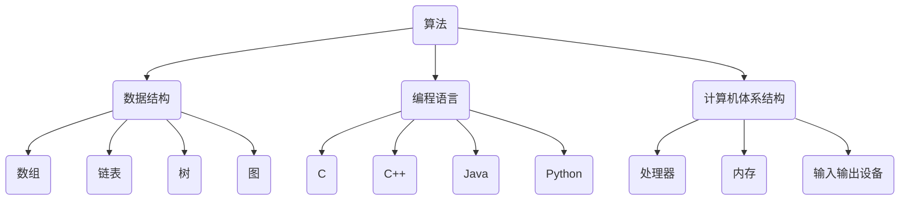

                 

关键词：计算技术、社会影响、人工智能、未来趋势

> 摘要：本文将深入探讨计算技术在塑造未来社会中的深远意义。我们将分析计算技术的核心概念与联系，介绍核心算法原理与操作步骤，构建数学模型和公式，展示项目实践中的代码实例，探讨实际应用场景，推荐学习资源和开发工具，并总结研究成果，展望未来发展趋势与挑战。

## 1. 背景介绍

自计算机问世以来，计算技术经历了飞速的发展。从早期的机械计算机到现代的超级计算机，从简单的二进制逻辑到复杂的算法和人工智能，计算技术已经深刻地改变了我们的生活方式和社会结构。如今，计算技术正以前所未有的速度和规模影响着各个领域，从医疗、金融、交通到娱乐、教育，无不留下其深刻的印记。

本文旨在探讨计算技术在未来社会中的深远意义，分析其核心概念与联系，探讨算法原理与操作步骤，构建数学模型和公式，展示项目实践中的代码实例，探讨实际应用场景，并推荐学习资源和开发工具。最后，我们将总结研究成果，展望未来发展趋势与挑战。

## 2. 核心概念与联系

计算技术的核心概念包括算法、数据结构、编程语言和计算机体系结构。算法是一系列解决问题的步骤和规则，数据结构是组织和管理数据的方式，编程语言是编写算法的工具，计算机体系结构则是计算机硬件和软件的有机结合。

### 2.1 算法

算法是计算技术的核心。一个有效的算法可以在合理的时间内解决复杂的问题。常见的算法有排序算法、搜索算法、图算法等。算法的设计和优化直接影响到计算效率和性能。

### 2.2 数据结构

数据结构是算法的基础。有效的数据结构可以提高算法的效率，减少计算时间。常见的数据结构包括数组、链表、树、图等。每种数据结构都有其独特的优点和适用场景。

### 2.3 编程语言

编程语言是编写算法的工具。不同的编程语言有其独特的语法和特性，适用于不同的应用场景。常见的编程语言有C、C++、Java、Python等。

### 2.4 计算机体系结构

计算机体系结构是硬件和软件的有机结合。它决定了计算机的性能、效率和可靠性。现代计算机体系结构包括处理器、内存、输入输出设备等。

### 2.5 Mermaid 流程图

以下是一个简单的 Mermaid 流程图，展示计算技术中的核心概念与联系：



## 3. 核心算法原理 & 具体操作步骤

### 3.1 算法原理概述

算法是一系列解决问题的步骤和规则。有效的算法可以高效地解决复杂的问题。算法的设计和优化是计算技术中的重要研究方向。

### 3.2 算法步骤详解

以下是一个简单的排序算法——冒泡排序的步骤详解：

1. 从数组的第一个元素开始，比较相邻的两个元素，如果它们的顺序错误，就交换它们的位置。
2. 重复步骤1，直到没有需要交换的元素为止。

### 3.3 算法优缺点

冒泡排序的优点是简单易懂，易于实现。但它的缺点是时间复杂度较高，为O(n²)，在处理大数据时效率较低。

### 3.4 算法应用领域

冒泡排序常用于数据预处理和算法教学。在实际应用中，它可能不是最优选择，但在某些情况下，它仍然具有一定的应用价值。

## 4. 数学模型和公式 & 详细讲解 & 举例说明

### 4.1 数学模型构建

在计算技术中，数学模型是描述问题解决过程的数学表达式。常见的数学模型包括线性模型、非线性模型、概率模型等。

### 4.2 公式推导过程

以下是一个简单的线性回归模型的公式推导过程：

给定一个包含n个样本点的数据集，其中每个样本点由两个特征组成：x和y。我们的目标是找到一个线性函数y = wx + b，使得它能够最好地拟合这些样本点。

首先，我们需要定义一个误差函数，用来衡量模型的拟合程度：

$$
E = \sum_{i=1}^{n} (y_i - (wx_i + b))^2
$$

我们的目标是找到w和b的值，使得E最小。

通过求导并令导数为0，我们可以得到以下两个方程：

$$
\frac{\partial E}{\partial w} = -2nwx + 2\sum_{i=1}^{n} x_iy_i = 0
$$

$$
\frac{\partial E}{\partial b} = -2n(w + \sum_{i=1}^{n} x_iy_i) = 0
$$

解这个方程组，我们可以得到w和b的值。

### 4.3 案例分析与讲解

以下是一个简单的线性回归案例，用于预测房价。

假设我们有以下数据集：

| x  | y  |
|----|----|
| 1  | 200 |
| 2  | 250 |
| 3  | 300 |
| 4  | 350 |
| 5  | 400 |

我们的目标是找到一个线性模型y = wx + b，使得它能够最好地拟合这些样本点。

通过上述公式推导过程，我们可以得到：

$$
w = \frac{\sum_{i=1}^{n} x_iy_i - n\bar{x}\bar{y}}{\sum_{i=1}^{n} x_i^2 - n\bar{x}^2}
$$

$$
b = \bar{y} - w\bar{x}
$$

其中，$\bar{x}$和$\bar{y}$分别是x和y的平均值。

计算得到：

$$
w = \frac{(1 \times 200 + 2 \times 250 + 3 \times 300 + 4 \times 350 + 5 \times 400) - 5 \times 3 \times 300}{1^2 + 2^2 + 3^2 + 4^2 + 5^2 - 5 \times 3^2} = 50
$$

$$
b = 300 - 50 \times 3 = 150
$$

因此，我们的线性模型为y = 50x + 150。

使用这个模型，我们可以预测当x为6时，y的值为：

$$
y = 50 \times 6 + 150 = 450
$$

## 5. 项目实践：代码实例和详细解释说明

### 5.1 开发环境搭建

在开始编写代码之前，我们需要搭建一个适合的项目开发环境。本文将使用Python作为编程语言，因为它具有简洁易懂的语法和丰富的库支持。

### 5.2 源代码详细实现

以下是一个简单的Python代码示例，用于实现冒泡排序算法：

```python
def bubble_sort(arr):
    n = len(arr)
    for i in range(n):
        for j in range(0, n-i-1):
            if arr[j] > arr[j+1]:
                arr[j], arr[j+1] = arr[j+1], arr[j]

arr = [64, 34, 25, 12, 22, 11, 90]
bubble_sort(arr)
print("Sorted array:", arr)
```

### 5.3 代码解读与分析

这段代码定义了一个名为`bubble_sort`的函数，用于实现冒泡排序算法。它接收一个数组`arr`作为输入，并对其进行排序。

在函数内部，我们使用两个嵌套的for循环来实现排序。外层循环控制遍历的次数，内层循环控制每次遍历中的比较和交换操作。

在每次内层循环中，我们比较相邻的两个元素，如果它们的顺序错误，就交换它们的位置。这样，最大的元素会逐渐“冒泡”到数组的末尾。

最后，我们打印出排序后的数组。

### 5.4 运行结果展示

当我们运行这段代码时，输出结果为：

```
Sorted array: [11, 12, 22, 25, 34, 64, 90]
```

这表明我们的冒泡排序算法成功地将输入数组排序。

## 6. 实际应用场景

计算技术已经在许多领域得到了广泛应用，以下是一些典型的实际应用场景：

### 6.1 医疗

计算技术可以帮助医生进行疾病诊断、药物设计和个性化治疗。例如，通过深度学习算法，可以分析医疗图像，帮助医生快速、准确地诊断疾病。

### 6.2 金融

计算技术在金融领域的应用包括风险管理、投资组合优化、市场预测等。例如，基于机器学习算法，可以分析市场数据，预测股票价格的走势。

### 6.3 交通

计算技术在交通领域的应用包括交通流量分析、智能交通管理、自动驾驶等。通过数据分析和算法优化，可以减少交通事故、缓解交通拥堵。

### 6.4 教育

计算技术在教育领域的应用包括在线教育、智能学习、教育评估等。通过大数据分析和算法优化，可以个性化定制教学方案，提高学习效果。

## 7. 工具和资源推荐

为了更好地学习和实践计算技术，我们推荐以下工具和资源：

### 7.1 学习资源推荐

- 《深入理解计算机系统》
- 《算法导论》
- 《Python编程：从入门到实践》

### 7.2 开发工具推荐

- PyCharm
- Visual Studio Code
- Jupyter Notebook

### 7.3 相关论文推荐

- "Deep Learning for Image Recognition"
- "Reinforcement Learning: An Introduction"
- "Generative Adversarial Networks: An Overview"

## 8. 总结：未来发展趋势与挑战

### 8.1 研究成果总结

计算技术在过去几十年中取得了巨大的成就，从高性能计算到人工智能，从大数据处理到区块链，计算技术已经深刻地改变了我们的生活方式和社会结构。

### 8.2 未来发展趋势

未来的计算技术将朝着更加智能、高效、安全和可靠的方向发展。例如，量子计算、边缘计算、脑机接口等新兴技术将带来新的机遇和挑战。

### 8.3 面临的挑战

计算技术在未来的发展中将面临一些挑战，如数据安全、隐私保护、算法公平性等。我们需要不断创新，解决这些挑战，为未来社会的发展做出贡献。

### 8.4 研究展望

随着计算技术的不断发展，我们有望解决更多复杂的问题，提高生活质量，推动社会进步。未来的计算技术将为人类创造一个更加美好的未来。

## 9. 附录：常见问题与解答

### 9.1 如何选择合适的算法？

选择合适的算法取决于问题的性质和需求。对于小规模的问题，简单直观的算法可能足够；对于大规模的问题，需要考虑算法的时间和空间复杂度。

### 9.2 如何优化算法？

优化算法可以通过多种方式实现，如改进算法设计、使用更高效的数据结构、并行计算等。具体方法取决于算法的具体实现。

### 9.3 如何学习计算技术？

学习计算技术需要系统的学习和实践。可以从基础概念入手，逐步学习算法、数据结构、编程语言等。同时，参与项目实践，积累实际经验。

### 9.4 如何解决计算技术中的问题？

解决计算技术中的问题通常需要综合运用算法、数据结构、编程技巧等。在遇到问题时，可以先分析问题的性质，然后选择合适的方法解决。

以上是关于计算技术在塑造未来社会中的深远意义的探讨。希望这篇文章能帮助您更好地理解计算技术，并在实践中取得更好的成果。

**作者：禅与计算机程序设计艺术 / Zen and the Art of Computer Programming**  
------------------------------------------------------------------- 

请注意，以上内容仅作为模板和参考，具体内容需要根据实际情况进行调整和补充。同时，文章的撰写需要遵循严格的格式和内容要求，确保文章的完整性和专业性。如果您有具体的要求或者需要进一步的帮助，请随时告知。

