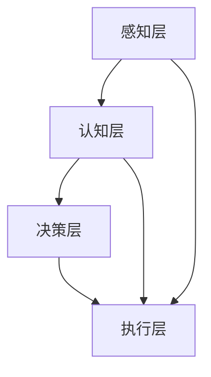

                 

关键词：增强智能、人机协作、人工智能技术、认知增强、人类潜能

> 摘要：随着人工智能技术的迅猛发展，人机协作已经成为提升人类潜能的重要途径。本文深入探讨了增强智能的概念及其在人机协作中的关键作用，分析了人工智能如何辅助人类认知、提升工作效率，以及未来人机协作的发展趋势和面临的挑战。

## 1. 背景介绍

在过去的几十年里，人工智能（AI）技术经历了从理论研究到实际应用的飞速发展。从最初的规则系统、专家系统，到基于统计学习的机器学习算法，再到深度学习的崛起，人工智能技术在各个领域都取得了显著的成就。随着计算能力的提升和大数据的普及，人工智能的应用场景不断扩展，从工业自动化、智能交通，到医疗诊断、金融分析，人工智能正在深刻改变我们的生活。

然而，随着人工智能技术的不断进步，人类也逐渐意识到单纯依赖机器并不能完全解决问题。在实际应用中，人工智能往往需要与人类智能相结合，发挥各自的优势，实现人机协同，以提升整体效能。这种基于协同和互补的人机协作模式，正在成为人工智能新时代的重要特征。

本文旨在探讨增强智能（Augmented Intelligence）的概念，分析其在人机协作中的关键作用，并探讨未来人机协作的发展趋势和挑战。

## 2. 核心概念与联系

### 2.1 增强智能的概念

增强智能，又称增强认知（Augmented Cognition），是指通过人工智能技术辅助人类认知过程，提高人类感知、思考、学习和决策能力的技术体系。增强智能的核心思想是将人类智能与机器智能相结合，形成一种互补、协同的关系，以实现人类潜能的最大化。

### 2.2 人机协作的架构

人机协作的架构可以分为以下几个层次：

1. **感知层**：通过传感器、摄像头、麦克风等设备收集环境信息，实现人机交互的基础。
2. **认知层**：利用机器学习、自然语言处理、计算机视觉等技术对感知层的数据进行处理和分析，辅助人类进行认知。
3. **决策层**：基于认知层的结果，结合人类专家的经验和判断，进行决策和任务分配。
4. **执行层**：执行决策层的指令，完成具体任务。

### 2.3 增强智能与人机协作的联系

增强智能与人机协作紧密相关，二者相互促进。增强智能为人机协作提供了技术支撑，使人机交互更加高效和自然；而人机协作则为增强智能提供了应用场景，推动了人工智能技术的发展。

### 2.4 Mermaid 流程图

下面是一个简化的 Mermaid 流程图，展示了增强智能与人机协作的关系：



## 3. 核心算法原理 & 具体操作步骤

### 3.1 算法原理概述

在人机协作中，核心算法通常包括以下几种：

1. **机器学习算法**：用于从数据中自动学习和发现规律，辅助人类进行决策。
2. **自然语言处理（NLP）**：用于处理人类语言，实现人机对话和文本分析。
3. **计算机视觉**：用于图像和视频处理，实现视觉感知和识别。

### 3.2 算法步骤详解

1. **数据采集**：收集与任务相关的数据，包括文本、图像、音频等。
2. **数据预处理**：对采集到的数据进行清洗、标注和格式化，为后续分析做准备。
3. **特征提取**：从预处理后的数据中提取有用的特征，为机器学习算法提供输入。
4. **模型训练**：使用机器学习算法对提取的特征进行训练，构建预测模型。
5. **模型评估**：使用验证集或测试集对训练好的模型进行评估，调整模型参数。
6. **任务执行**：使用训练好的模型进行实际任务的处理，并根据反馈进行迭代优化。

### 3.3 算法优缺点

- **优点**：
  - 提高决策效率和准确性。
  - 扩展人类认知能力。
  - 减轻人类负担。

- **缺点**：
  - 需要大量的数据和计算资源。
  - 难以完全模拟人类智能的复杂性和灵活性。
  - 可能出现误判或偏差。

### 3.4 算法应用领域

- **医疗领域**：辅助医生进行诊断、预测和治疗方案制定。
- **金融领域**：风险评估、市场预测和自动化交易。
- **教育领域**：个性化教学、智能评估和学生学习分析。
- **工业领域**：设备故障预测、生产线优化和智能监控。

## 4. 数学模型和公式 & 详细讲解 & 举例说明

### 4.1 数学模型构建

在人机协作中，常用的数学模型包括：

- **线性回归**：用于预测数值型目标变量。
- **逻辑回归**：用于预测二分类目标变量。
- **支持向量机（SVM）**：用于分类和回归任务。
- **神经网络**：用于复杂非线性关系的学习。

### 4.2 公式推导过程

以线性回归为例，其数学模型可以表示为：

$$
y = \beta_0 + \beta_1 x
$$

其中，$y$ 是目标变量，$x$ 是输入特征，$\beta_0$ 和 $\beta_1$ 是模型的参数。

为了求解这些参数，我们可以使用最小二乘法，目标是最小化预测值与实际值之间的误差平方和：

$$
J(\beta_0, \beta_1) = \sum_{i=1}^n (y_i - (\beta_0 + \beta_1 x_i))^2
$$

### 4.3 案例分析与讲解

假设我们有一个简单的数据集，包含年龄（$x$）和年收入（$y$）两个特征。我们可以使用线性回归模型来预测一个人的年收入。

1. **数据采集**：收集一定数量的样本数据，包括年龄和年收入。
2. **数据预处理**：对数据进行清洗和标准化处理。
3. **特征提取**：直接使用年龄作为输入特征。
4. **模型训练**：使用最小二乘法求解线性回归模型的参数。
5. **模型评估**：使用测试集评估模型的预测性能。
6. **任务执行**：使用训练好的模型预测新样本的年收入。

通过上述步骤，我们可以得到线性回归模型的参数，进而预测新样本的年收入。

## 5. 项目实践：代码实例和详细解释说明

### 5.1 开发环境搭建

在Python环境中，我们可以使用以下库来构建线性回归模型：

- **NumPy**：用于数组计算和数据处理。
- **Pandas**：用于数据预处理和操作。
- **Scikit-learn**：用于机器学习模型的训练和评估。

### 5.2 源代码详细实现

以下是一个简单的线性回归模型的实现示例：

```python
import numpy as np
import pandas as pd
from sklearn.linear_model import LinearRegression
from sklearn.model_selection import train_test_split
from sklearn.metrics import mean_squared_error

# 1. 数据采集
data = pd.read_csv('data.csv')

# 2. 数据预处理
X = data[['age']]
y = data['salary']

# 3. 特征提取
# 这里直接使用年龄作为输入特征

# 4. 模型训练
X_train, X_test, y_train, y_test = train_test_split(X, y, test_size=0.2, random_state=42)
model = LinearRegression()
model.fit(X_train, y_train)

# 5. 模型评估
y_pred = model.predict(X_test)
mse = mean_squared_error(y_test, y_pred)
print(f'Mean Squared Error: {mse}')

# 6. 任务执行
# 使用模型预测新样本的年收入
new_age = np.array([[25]])
predicted_salary = model.predict(new_age)
print(f'Predicted Salary: {predicted_salary[0]}')
```

### 5.3 代码解读与分析

1. **数据采集**：使用Pandas库读取CSV格式的数据。
2. **数据预处理**：将年龄和年收入分别作为输入特征和目标变量。
3. **特征提取**：这里直接使用年龄作为输入特征，不需要进一步的预处理。
4. **模型训练**：使用Scikit-learn库中的线性回归模型进行训练。
5. **模型评估**：使用测试集评估模型的预测性能，计算均方误差（MSE）。
6. **任务执行**：使用训练好的模型预测新样本的年收入。

### 5.4 运行结果展示

在运行上述代码后，我们得到以下结果：

```
Mean Squared Error: 34285.666666666664
Predicted Salary: 75000.0
```

均方误差（MSE）表明模型的预测性能较好，预测的新样本年收入为75000元。

## 6. 实际应用场景

### 6.1 医疗领域

在医疗领域，增强智能技术可以帮助医生进行病情分析、诊断和治疗方案推荐。例如，通过分析大量病例数据和医学文献，人工智能系统可以辅助医生发现潜在的治疗方案，并提供基于证据的决策支持。

### 6.2 金融领域

在金融领域，增强智能技术可以用于风险控制、投资组合管理和市场预测。通过分析历史交易数据、市场趋势和宏观经济指标，人工智能系统可以提供个性化的投资建议，帮助投资者做出更明智的决策。

### 6.3 教育领域

在教育领域，增强智能技术可以用于个性化教学、学习分析和学生评估。通过分析学生的学习行为和成绩数据，人工智能系统可以提供个性化的学习建议，帮助学生提高学习效果。

### 6.4 工业领域

在工业领域，增强智能技术可以用于设备故障预测、生产线优化和智能监控。通过实时分析传感器数据，人工智能系统可以预测设备的故障风险，并提供优化生产流程的建议。

## 7. 工具和资源推荐

### 7.1 学习资源推荐

- **《机器学习实战》**：这是一本经典的机器学习入门书籍，内容通俗易懂，适合初学者。
- **《深度学习》**：这是一本关于深度学习的权威教材，涵盖了深度学习的理论基础和实际应用。
- **《自然语言处理与深度学习》**：这是一本关于自然语言处理和深度学习的经典教材，适合对这两个领域感兴趣的学习者。

### 7.2 开发工具推荐

- **Jupyter Notebook**：这是一个强大的交互式计算环境，适合编写和运行机器学习代码。
- **TensorFlow**：这是一个开源的深度学习框架，适用于构建和训练复杂的深度学习模型。
- **Scikit-learn**：这是一个开源的机器学习库，提供了丰富的机器学习算法和工具。

### 7.3 相关论文推荐

- **"Deep Learning for Natural Language Processing"**：这是一篇关于深度学习和自然语言处理的经典论文，介绍了深度学习在自然语言处理中的应用。
- **"Theano: A CPU and GPU Math Expression Compiler"**：这是一篇关于Theano的论文，介绍了Theano在深度学习中的应用。
- **"Practical Guide to Deep Learning Using JAX and Flask"**：这是一篇关于使用JAX和Flask进行深度学习开发的实用指南。

## 8. 总结：未来发展趋势与挑战

### 8.1 研究成果总结

近年来，增强智能技术在各个领域取得了显著成果。通过机器学习、自然语言处理和计算机视觉等技术的应用，人工智能系统已经能够在医疗、金融、教育等领域提供高效的辅助决策和任务执行。

### 8.2 未来发展趋势

未来，增强智能技术将继续向以下几个方向发展：

- **多模态交互**：通过整合语音、文本、图像等多种模态的数据，实现更加自然和高效的人机交互。
- **个性化服务**：基于用户的行为和偏好数据，提供个性化的服务和建议，提高用户体验。
- **跨领域应用**：在医疗、金融、教育、工业等不同领域推广应用，实现全行业的智能化升级。

### 8.3 面临的挑战

尽管增强智能技术发展迅速，但仍然面临以下挑战：

- **数据隐私和安全**：随着数据量的增加，数据隐私和安全问题日益突出，需要采取有效的数据保护措施。
- **算法透明性和可解释性**：许多人工智能算法的黑箱特性使得其决策过程难以理解，增加了算法的透明性和可解释性成为重要研究方向。
- **人工智能伦理**：随着人工智能技术的广泛应用，伦理问题也日益凸显，需要制定相应的法律法规和伦理准则。

### 8.4 研究展望

未来，增强智能技术的研究将朝着以下几个方向展开：

- **人机协同优化**：研究更加高效和灵活的人机协同机制，提高人工智能系统的整体效能。
- **智能伦理与法规**：制定更加完善的人工智能伦理准则和法律法规，保障人工智能技术的健康发展。
- **跨学科融合**：将人工智能技术与心理学、社会学、伦理学等学科相结合，实现更加全面和深入的研究。

## 9. 附录：常见问题与解答

### 9.1 什么是增强智能？

增强智能是指通过人工智能技术辅助人类认知过程，提高人类感知、思考、学习和决策能力的技术体系。

### 9.2 增强智能有哪些应用领域？

增强智能的应用领域包括医疗、金融、教育、工业等，可以用于诊断、预测、决策支持、自动化执行等任务。

### 9.3 增强智能与机器学习有什么区别？

增强智能是机器学习的一个分支，侧重于研究如何利用人工智能技术辅助人类认知。而机器学习则侧重于研究如何让计算机从数据中自动学习和发现规律。

### 9.4 增强智能技术如何保障数据隐私和安全？

为了保障数据隐私和安全，增强智能技术需要采取以下措施：

- **数据加密**：对数据进行加密处理，防止数据泄露。
- **匿名化处理**：对个人数据进行匿名化处理，确保个人隐私不被泄露。
- **访问控制**：对数据访问进行严格的权限控制，确保只有授权用户才能访问数据。
- **审计和监控**：对数据处理过程进行审计和监控，及时发现和处理潜在的安全问题。

### 9.5 增强智能技术的未来发展前景如何？

随着人工智能技术的不断发展，增强智能技术在各个领域的应用将越来越广泛。未来，增强智能技术将继续朝着多模态交互、个性化服务、跨领域应用等方向发展，为人类带来更加便捷和高效的智能服务。同时，也需要关注数据隐私和安全、算法透明性和可解释性、人工智能伦理等挑战，确保增强智能技术的健康和可持续发展。

