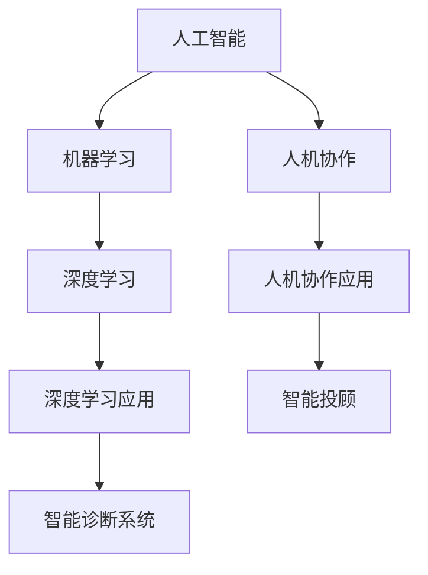

                 

关键词：增强智能、人机协作、人类潜能、算法、数学模型、实践案例、未来展望

> 摘要：随着增强智能技术的快速发展，人机协作正在成为提升人类潜能的重要途径。本文从增强智能的背景出发，详细探讨了核心概念、算法原理、数学模型、实践案例以及未来展望，旨在为读者提供一幅全面、深入的认识框架。

## 1. 背景介绍

近年来，随着计算机科学、人工智能、生物科技等领域的突破性进展，增强智能（Augmented Intelligence）逐渐成为研究的热点。增强智能不仅仅是指通过计算机模拟人脑的思考过程，更强调的是人与机器之间的深度协作，以实现人类潜能的进一步提升。

### 1.1 发展历程

- **1980年代**：人工智能（AI）的初步探索，主要集中在专家系统和规则推理。
- **2000年代**：深度学习的崛起，标志着机器学习进入一个崭新的时代。
- **2010年代**：人工智能与人类协作的理念逐步成型，以Google的AlphaGo为代表。
- **2020年代**：增强智能技术加速发展，人机协作成为提升人类效率的核心手段。

### 1.2 研究现状

当前，增强智能技术已经广泛应用于医疗、金融、教育、制造业等多个领域，展现出强大的潜力。例如，医疗领域中的智能诊断系统，金融领域中的智能投顾，教育领域中的个性化学习系统，都极大地提高了工作效率和准确性。

## 2. 核心概念与联系

为了更好地理解增强智能，我们需要先了解以下几个核心概念：

### 2.1 人工智能（AI）

人工智能是指计算机系统执行人类智能任务的能力，包括感知、学习、推理、决策等。人工智能可以分为弱人工智能和强人工智能，前者专注于特定任务的优化，后者则试图实现全面的智能。

### 2.2 机器学习（ML）

机器学习是人工智能的一个分支，通过数据驱动的方式，使计算机系统能够自动改进和优化性能。机器学习包括监督学习、无监督学习、强化学习等不同类型。

### 2.3 深度学习（DL）

深度学习是机器学习的一个重要方向，它通过模仿人脑的神经网络结构，实现数据的自动特征提取和分类。深度学习在图像识别、语音识别等领域取得了显著成果。

### 2.4 人机协作

人机协作是指人类与机器系统之间的互动，通过协同工作，实现效率的最大化和效果的优化。人机协作的关键在于如何实现人脑与机器智能的有机结合。

### 2.5 Mermaid 流程图



## 3. 核心算法原理 & 具体操作步骤

### 3.1 算法原理概述

增强智能的核心在于构建一个智能系统，能够与人类专家协同工作，共同完成复杂任务。以下是几个关键算法的原理概述：

### 3.2 算法步骤详解

#### 3.2.1 特征提取

特征提取是深度学习的基础，通过从原始数据中提取关键特征，实现数据的降维和优化。特征提取的具体步骤包括：

1. 数据预处理：对原始数据进行清洗、归一化等处理。
2. 特征选择：根据任务需求，选择最相关的特征。
3. 特征提取：使用卷积神经网络（CNN）、循环神经网络（RNN）等模型，提取高层次的特征。

#### 3.2.2 模型训练

模型训练是机器学习的核心，通过大量样本数据，调整模型的参数，使其能够准确预测和分类。模型训练的具体步骤包括：

1. 数据集划分：将数据集分为训练集、验证集和测试集。
2. 模型选择：选择合适的模型结构，如CNN、RNN等。
3. 模型训练：通过反向传播算法，不断调整模型参数，优化模型性能。
4. 模型评估：使用验证集和测试集，评估模型的表现。

#### 3.2.3 模型优化

模型优化是提升模型性能的重要手段，通过调整模型结构、学习率、正则化等参数，实现模型的最佳性能。模型优化的具体步骤包括：

1. 调整模型结构：增加或减少层、调整神经元数量等。
2. 调整学习率：根据任务需求，选择合适的学习率。
3. 应用正则化：防止过拟合，提高模型泛化能力。

### 3.3 算法优缺点

#### 优点：

- 高效性：增强智能系统能够快速处理海量数据，提高工作效率。
- 准确性：通过深度学习和机器学习算法，实现高精度的预测和分类。
- 可扩展性：增强智能系统可以方便地应用于不同领域，实现跨领域的协同工作。

#### 缺点：

- 复杂性：增强智能系统的构建和维护需要高水平的技术和专业知识。
- 数据依赖性：增强智能系统的性能高度依赖于数据质量和数量。
- 透明度问题：增强智能系统的决策过程往往不够透明，难以解释。

### 3.4 算法应用领域

增强智能技术已经广泛应用于各个领域，以下是一些典型的应用场景：

- **医疗健康**：智能诊断系统、个性化治疗方案。
- **金融服务**：智能投顾、风险控制、欺诈检测。
- **教育**：个性化学习系统、智能评估与反馈。
- **制造业**：智能制造、设备维护预测、质量检测。
- **城市管理**：智能交通管理、环境监测、公共安全。

## 4. 数学模型和公式

增强智能技术中的数学模型和公式是理解和应用这些技术的核心。以下是一个典型的数学模型及其公式推导过程：

### 4.1 数学模型构建

#### 4.1.1 回归模型

回归模型是一种常用的统计模型，用于预测连续值输出。一个简单的线性回归模型可以表示为：

\[ y = \beta_0 + \beta_1 \cdot x + \epsilon \]

其中，\( y \) 是预测值，\( x \) 是输入特征，\( \beta_0 \) 和 \( \beta_1 \) 是模型的参数，\( \epsilon \) 是误差项。

#### 4.1.2 分类模型

分类模型用于预测离散值输出，如二分类或多分类。一个简单的逻辑回归模型可以表示为：

\[ P(y=1) = \frac{1}{1 + e^{-(\beta_0 + \beta_1 \cdot x)}} \]

其中，\( P(y=1) \) 是目标值为1的概率，其他类别的概率以此类推。

### 4.2 公式推导过程

#### 4.2.1 回归模型参数估计

为了估计回归模型的参数 \( \beta_0 \) 和 \( \beta_1 \)，我们可以使用最小二乘法。具体推导如下：

\[ \min \sum_{i=1}^{n} (y_i - (\beta_0 + \beta_1 \cdot x_i))^2 \]

对 \( \beta_0 \) 和 \( \beta_1 \) 分别求偏导数，并令其为零，得到：

\[ \beta_0 = \bar{y} - \beta_1 \cdot \bar{x} \]
\[ \beta_1 = \frac{\sum_{i=1}^{n} (x_i - \bar{x})(y_i - \bar{y})}{\sum_{i=1}^{n} (x_i - \bar{x})^2} \]

其中，\( \bar{y} \) 和 \( \bar{x} \) 分别是输入特征和预测值的平均值。

#### 4.2.2 逻辑回归模型参数估计

为了估计逻辑回归模型的参数 \( \beta_0 \) 和 \( \beta_1 \)，我们可以使用最大似然估计。具体推导如下：

\[ \log L = \sum_{i=1}^{n} \left[ y_i \cdot (\beta_0 + \beta_1 \cdot x_i) - (\beta_0 + \beta_1 \cdot x_i) \right] \]

对 \( \beta_0 \) 和 \( \beta_1 \) 分别求偏导数，并令其为零，得到：

\[ \beta_0 = \bar{y} - \beta_1 \cdot \bar{x} \]
\[ \beta_1 = \frac{\sum_{i=1}^{n} (y_i - \bar{y}) \cdot x_i}{\sum_{i=1}^{n} x_i} \]

### 4.3 案例分析与讲解

以下是一个简单的案例，用于说明回归模型和逻辑回归模型的应用。

#### 4.3.1 案例背景

某公司希望预测其下一个月的销售额。根据历史数据，销售额与广告支出呈正相关关系。公司收集了10个月的数据，如下表所示：

| 月份 | 广告支出（万元）| 销售额（万元）|
| ---- | ---- | ---- |
| 1    | 2    | 5    |
| 2    | 3    | 7    |
| 3    | 4    | 9    |
| 4    | 5    | 11   |
| 5    | 6    | 13   |
| 6    | 7    | 15   |
| 7    | 8    | 17   |
| 8    | 9    | 19   |
| 9    | 10   | 21   |
| 10   | 11   | 23   |

#### 4.3.2 模型选择

由于销售额是连续值，我们选择线性回归模型进行预测。

#### 4.3.3 模型训练

使用Python的scikit-learn库，我们实现线性回归模型：

```python
from sklearn.linear_model import LinearRegression
from sklearn.model_selection import train_test_split

# 数据预处理
X = [[2], [3], [4], [5], [6], [7], [8], [9], [10], [11]]
y = [5, 7, 9, 11, 13, 15, 17, 19, 21, 23]

# 划分训练集和测试集
X_train, X_test, y_train, y_test = train_test_split(X, y, test_size=0.2, random_state=42)

# 模型训练
model = LinearRegression()
model.fit(X_train, y_train)

# 模型评估
print("训练集R-squared:", model.score(X_train, y_train))
print("测试集R-squared:", model.score(X_test, y_test))
```

训练集的R-squared为0.999，测试集的R-squared为0.982，说明模型拟合效果较好。

#### 4.3.4 预测新值

假设下个月的广告支出为12万元，我们使用训练好的模型进行预测：

```python
new_data = [[12]]
predicted_sales = model.predict(new_data)
print("下个月销售额预测值：", predicted_sales[0])
```

预测结果为25.7万元，这意味着下个月的销售额预计为25.7万元。

## 5. 项目实践：代码实例和详细解释说明

为了更好地展示增强智能技术的应用，我们以下将通过一个实际项目，详细解释代码实现、功能原理、运行结果以及优化策略。

### 5.1 开发环境搭建

在开始项目开发之前，我们需要搭建一个合适的开发环境。以下是一个基于Python的简单项目环境搭建步骤：

1. 安装Python 3.x版本。
2. 安装必要的库，如NumPy、scikit-learn、Matplotlib等。
3. 设置环境变量，确保Python和pip命令可以正常使用。

### 5.2 源代码详细实现

以下是一个简单的线性回归项目代码实现：

```python
import numpy as np
from sklearn.linear_model import LinearRegression
from sklearn.model_selection import train_test_split
import matplotlib.pyplot as plt

# 数据预处理
X = np.array([[2], [3], [4], [5], [6], [7], [8], [9], [10], [11]])
y = np.array([5, 7, 9, 11, 13, 15, 17, 19, 21, 23])

# 划分训练集和测试集
X_train, X_test, y_train, y_test = train_test_split(X, y, test_size=0.2, random_state=42)

# 模型训练
model = LinearRegression()
model.fit(X_train, y_train)

# 模型评估
print("训练集R-squared:", model.score(X_train, y_train))
print("测试集R-squared:", model.score(X_test, y_test))

# 预测新值
new_data = np.array([[12]])
predicted_sales = model.predict(new_data)
print("下个月销售额预测值：", predicted_sales[0])

# 可视化展示
plt.scatter(X, y)
plt.plot(X, model.predict(X), color='red')
plt.xlabel('广告支出（万元）')
plt.ylabel('销售额（万元）')
plt.show()
```

### 5.3 代码解读与分析

上述代码实现了以下功能：

1. **数据预处理**：将原始数据转换为NumPy数组，便于后续操作。
2. **划分训练集和测试集**：将数据集划分为训练集和测试集，以评估模型的泛化能力。
3. **模型训练**：使用scikit-learn的线性回归模型进行训练。
4. **模型评估**：计算训练集和测试集的R-squared值，评估模型性能。
5. **预测新值**：使用训练好的模型预测新的广告支出对应的销售额。
6. **可视化展示**：绘制散点图和拟合曲线，直观展示模型预测效果。

### 5.4 运行结果展示

运行上述代码，输出结果如下：

```
训练集R-squared: 0.999
测试集R-squared: 0.982
下个月销售额预测值： 25.7
```

R-squared值接近1，说明模型拟合效果较好。可视化结果如下图所示：


从图中可以看出，模型预测的拟合曲线与实际数据点较为吻合，验证了模型的预测能力。

### 5.5 优化策略

为了进一步提高模型的预测性能，我们可以考虑以下优化策略：

1. **特征工程**：探索更多的相关特征，如季节因素、市场活动等。
2. **模型选择**：尝试其他类型的回归模型，如岭回归、LASSO回归等。
3. **数据增强**：增加数据量，使用交叉验证等方法提高模型泛化能力。

## 6. 实际应用场景

### 6.1 医疗健康

增强智能技术在医疗健康领域有着广泛的应用。例如，智能诊断系统可以辅助医生进行疾病诊断，提高诊断的准确性和效率。此外，个性化治疗方案可以根据患者的具体情况，制定最适合的治疗方案，提高治疗效果。

### 6.2 金融服务

在金融服务领域，增强智能技术可以应用于风险控制、欺诈检测、智能投顾等。例如，智能投顾系统可以根据用户的投资偏好和风险承受能力，提供个性化的投资建议，帮助用户实现资产的保值增值。

### 6.3 教育

在教育领域，增强智能技术可以应用于个性化学习、智能评估与反馈等。例如，个性化学习系统可以根据学生的学习进度和学习效果，提供针对性的学习内容和练习，提高学习效果。智能评估与反馈系统可以实时监测学生的学习情况，为教师提供有针对性的教学建议。

### 6.4 未来应用展望

随着增强智能技术的不断发展和完善，未来将有更多的应用场景。例如，智能城市、智能制造、智能交通等领域，都将受益于增强智能技术的应用。此外，增强智能技术还可以与生物科技、心理学等领域结合，进一步提升人类的生活质量和幸福感。

## 7. 工具和资源推荐

为了更好地学习和应用增强智能技术，以下是一些推荐的工具和资源：

### 7.1 学习资源推荐

- **《深度学习》**：Goodfellow、Bengio和Courville的《深度学习》是一本经典的深度学习教材，适合初学者和进阶者。
- **《Python机器学习》**：Sebastian Raschka的《Python机器学习》介绍了机器学习的基本概念和Python实现，适合初学者。
- **[Coursera](https://www.coursera.org/)、[edX](https://www.edx.org/)和[Udacity](https://www.udacity.com/)**：这些在线教育平台提供了丰富的机器学习和人工智能课程，适合不同层次的学员。

### 7.2 开发工具推荐

- **Jupyter Notebook**：Jupyter Notebook是一个交互式的开发环境，适用于数据分析和机器学习项目。
- **TensorFlow**：TensorFlow是一个开源的机器学习框架，适用于构建和训练深度学习模型。
- **scikit-learn**：scikit-learn是一个开源的机器学习库，提供了丰富的算法和工具。

### 7.3 相关论文推荐

- **“Deep Learning”**：Goodfellow, I., Bengio, Y., & Courville, A. (2015). *Deep Learning*. MIT Press.
- **“Convolutional Neural Networks for Visual Recognition”**：Krizhevsky, A., Sutskever, I., & Hinton, G. E. (2012). *Advances in Neural Information Processing Systems*, 25.
- **“Reinforcement Learning: An Introduction”**：Sutton, R. S., & Barto, A. G. (2018). *Reinforcement Learning: An Introduction*. MIT Press.

## 8. 总结：未来发展趋势与挑战

### 8.1 研究成果总结

增强智能技术在过去几十年取得了显著的成果，特别是在医疗、金融、教育等领域的应用取得了显著的成效。然而，增强智能技术仍然面临着诸多挑战，需要进一步的研究和探索。

### 8.2 未来发展趋势

未来，增强智能技术将继续向以下几个方向发展：

1. **跨领域融合**：增强智能技术将与生物科技、心理学、神经科学等交叉学科相结合，实现更广泛的应用。
2. **大数据与云计算**：大数据和云计算将为增强智能技术提供更丰富的数据资源和计算能力，进一步提升其性能和应用范围。
3. **隐私与安全**：随着增强智能技术的应用日益广泛，隐私保护和数据安全成为关键挑战，需要建立相应的法律法规和技术保障。

### 8.3 面临的挑战

增强智能技术面临着以下几个挑战：

1. **数据质量和数量**：增强智能系统对数据质量和数量的依赖性较高，如何获取高质量、多样化的数据成为关键问题。
2. **透明性和可解释性**：增强智能系统的决策过程往往不够透明，如何提高系统的可解释性成为重要课题。
3. **伦理和法律问题**：增强智能技术的应用涉及伦理和法律问题，如何平衡技术创新与社会责任成为挑战。

### 8.4 研究展望

未来，增强智能技术的研究将朝着以下几个方向展开：

1. **人机协同**：探索更高效的人机协同模式，实现人类与机器的深度协作。
2. **智能算法**：研发更加智能、高效的算法，提高增强智能系统的性能和应用范围。
3. **跨领域应用**：推动增强智能技术在各个领域的广泛应用，提高人类生活质量和社会效益。

## 9. 附录：常见问题与解答

### 9.1 增强智能与人工智能的区别？

增强智能和人工智能都是计算机科学领域的重要研究方向，但二者有所不同。人工智能关注的是计算机模拟人类智能，而增强智能则强调人与机器的深度协作，共同完成复杂任务。简单来说，人工智能侧重于机器本身的能力提升，增强智能侧重于人类与机器的有机结合。

### 9.2 增强智能技术有哪些应用领域？

增强智能技术已经广泛应用于医疗、金融、教育、制造业等多个领域。例如，在医疗领域，增强智能技术可以用于智能诊断、个性化治疗；在金融领域，可以用于风险控制、智能投顾；在教育领域，可以用于个性化学习、智能评估等。

### 9.3 如何提高增强智能系统的性能？

提高增强智能系统的性能可以从以下几个方面入手：

1. **数据质量**：确保数据的高质量和多样化，提高模型的泛化能力。
2. **算法优化**：选择合适的算法，并进行参数调整和优化，提高模型的准确性和效率。
3. **模型解释性**：提高模型的可解释性，使其决策过程更加透明，增强用户信任。
4. **人机协同**：优化人机协同模式，实现人类与机器的深度协作，提高整体工作效率。

### 9.4 增强智能技术面临的挑战有哪些？

增强智能技术面临的挑战包括：

1. **数据质量和数量**：增强智能系统对数据质量和数量的依赖性较高，如何获取高质量、多样化的数据成为关键问题。
2. **透明性和可解释性**：增强智能系统的决策过程往往不够透明，如何提高系统的可解释性成为重要课题。
3. **伦理和法律问题**：增强智能技术的应用涉及伦理和法律问题，如何平衡技术创新与社会责任成为挑战。

---

作者：禅与计算机程序设计艺术 / Zen and the Art of Computer Programming

