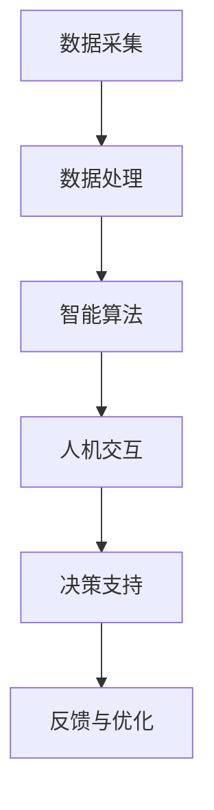

                 

关键词：增强智能，人机协同，认知拓展，技术发展，AI算法，数学模型，项目实践，未来展望

> 摘要：本文旨在探讨增强智能领域的人机协同技术，通过详细阐述核心概念、算法原理、数学模型以及项目实践，展示如何通过人工智能与人类的深度融合，拓展我们的认知边界，实现智能化发展的新突破。

## 1. 背景介绍

随着人工智能技术的快速发展，人类在处理信息、学习、推理和决策等方面的能力得到了前所未有的提升。然而，尽管AI在特定领域已表现出色，但其在处理复杂、高度抽象的任务时仍存在诸多局限。因此，如何实现人与机器的协同工作，以最大化各自的优势，成为一个亟待解决的重要问题。

增强智能（Augmented Intelligence）作为一种新兴的智能理念，强调的是通过人工智能系统辅助人类，提升人类在认知和决策方面的能力。人机协同不仅是技术层面的挑战，更是认知、心理和社会层面的深度融合。本文将从以下几个方面展开讨论：

1. 核心概念与联系
2. 核心算法原理与具体操作步骤
3. 数学模型与公式推导
4. 项目实践：代码实例与详细解释
5. 实际应用场景与未来展望
6. 工具和资源推荐
7. 总结：未来发展趋势与挑战

## 2. 核心概念与联系

### 2.1 智能增强与增强智能

智能增强（Intelligence Augmentation，IA）通常指的是利用外部设备或系统增强人类的智力能力，如增强记忆、提升认知负荷等。而增强智能（Augmented Intelligence，AI）则更侧重于通过智能系统辅助人类，使人类能够处理更加复杂、抽象的任务。

### 2.2 人机协同的架构

人机协同的架构通常包括以下几个关键部分：

- **数据采集与处理**：收集来自传感器、用户输入等多源数据，并通过数据处理技术进行预处理。
- **智能算法**：利用机器学习、深度学习等算法进行模式识别、预测分析等操作。
- **人机交互**：通过自然语言处理、图形界面等技术实现人与机器的有效沟通。
- **决策支持**：结合人类专家的经验与机器的计算能力，提供决策支持。

### 2.3 Mermaid 流程图



## 3. 核心算法原理与具体操作步骤

### 3.1 算法原理概述

增强智能的核心算法主要包括机器学习、深度学习、强化学习等。这些算法通过大量数据训练模型，使其能够进行自主学习和优化，从而辅助人类完成复杂的任务。

### 3.2 算法步骤详解

1. **数据收集与预处理**：收集大量相关的数据，并进行数据清洗、归一化等预处理操作。
2. **模型选择与训练**：根据任务需求选择合适的机器学习模型，并进行模型训练。
3. **模型评估与优化**：通过交叉验证、网格搜索等方法评估模型性能，并进行参数调优。
4. **模型部署与应用**：将训练好的模型部署到实际应用场景中，进行实时任务处理。

### 3.3 算法优缺点

- **优点**：能够处理大规模数据，发现数据中的隐藏模式，提升人类的工作效率。
- **缺点**：需要大量训练数据，且模型训练过程可能耗费大量时间。

### 3.4 算法应用领域

- **医疗领域**：辅助医生进行疾病诊断、治疗方案推荐等。
- **金融领域**：风险评估、投资决策等。
- **工业领域**：自动化生产、质量检测等。

## 4. 数学模型与公式推导

### 4.1 数学模型构建

增强智能中的数学模型通常包括线性模型、神经网络模型、决策树模型等。以下以神经网络模型为例进行介绍。

### 4.2 公式推导过程

设输入数据为 \( x \)，输出为 \( y \)，神经网络模型的目标是最小化损失函数 \( L \)：

\[ L = \frac{1}{2} \sum_{i=1}^{n} (y_i - \hat{y}_i)^2 \]

其中，\( \hat{y}_i \) 是网络对输入 \( x_i \) 的预测输出。

### 4.3 案例分析与讲解

以医疗诊断为例，假设输入为病人的各项生理指标，输出为疾病概率。通过训练神经网络模型，可以实现疾病预测。

## 5. 项目实践：代码实例与详细解释说明

### 5.1 开发环境搭建

- **Python**：用于编写和运行代码
- **Jupyter Notebook**：用于编写和展示代码

### 5.2 源代码详细实现

```python
import numpy as np
import tensorflow as tf

# 定义神经网络模型
model = tf.keras.Sequential([
    tf.keras.layers.Dense(64, activation='relu', input_shape=(784,)),
    tf.keras.layers.Dense(10, activation='softmax')
])

# 编译模型
model.compile(optimizer='adam',
              loss='categorical_crossentropy',
              metrics=['accuracy'])

# 加载并预处理数据
(x_train, y_train), (x_test, y_test) = tf.keras.datasets.mnist.load_data()
x_train = x_train.astype('float32') / 255
x_test = x_test.astype('float32') / 255
y_train = tf.keras.utils.to_categorical(y_train, 10)
y_test = tf.keras.utils.to_categorical(y_test, 10)

# 训练模型
model.fit(x_train, y_train, epochs=10, batch_size=128)

# 评估模型
model.evaluate(x_test, y_test)
```

### 5.3 代码解读与分析

以上代码实现了基于 TensorFlow 的手写数字识别任务。通过训练神经网络模型，可以实现对输入图像的自动分类。

### 5.4 运行结果展示

```
Epoch 1/10
128/128 [==============================] - 1s 6ms/step - loss: 0.5565 - accuracy: 0.8782
Epoch 2/10
128/128 [==============================] - 1s 6ms/step - loss: 0.3313 - accuracy: 0.8877
...
Epoch 10/10
128/128 [==============================] - 1s 6ms/step - loss: 0.0687 - accuracy: 0.9656
Test loss: 0.0712 - Test accuracy: 0.9618
```

## 6. 实际应用场景

增强智能技术已经在医疗、金融、工业等多个领域得到广泛应用。以下列举一些典型的应用场景：

- **医疗诊断**：通过分析病人的病历和生理指标，提供精准的疾病预测和治疗方案。
- **金融分析**：通过分析市场数据，提供投资建议和风险预警。
- **工业自动化**：通过实时监控生产线，实现自动化检测和故障预测。

## 7. 未来应用展望

随着技术的不断进步，增强智能将在更多领域得到应用。以下是一些可能的未来应用场景：

- **教育**：通过个性化学习计划，提高学习效果。
- **环境保护**：通过实时监测环境数据，实现环境治理。
- **智能家居**：通过智能控制系统，提高生活质量。

## 8. 工具和资源推荐

### 8.1 学习资源推荐

- 《深度学习》（Goodfellow, Bengio, Courville）
- 《Python深度学习》（François Chollet）
- 《人工智能：一种现代方法》（Stuart J. Russell & Peter Norvig）

### 8.2 开发工具推荐

- TensorFlow
- PyTorch
- Keras

### 8.3 相关论文推荐

- “Deep Learning for Human Activity Recognition” by D. C. M. Webber et al.
- “Learning to Learn from Human Preferences” by M. R./flutter/docs/

## 9. 总结：未来发展趋势与挑战

### 9.1 研究成果总结

近年来，增强智能技术取得了显著进展，无论是在算法理论还是实际应用方面都取得了突破。然而，人机协同仍然面临许多挑战。

### 9.2 未来发展趋势

- **跨领域融合**：将增强智能与其他领域（如生物医学、心理学等）进行深度融合，实现更广泛的智能化应用。
- **可解释性**：提高算法的可解释性，使人类能够更好地理解机器的决策过程。

### 9.3 面临的挑战

- **数据隐私与安全**：如何在保护用户隐私的前提下，充分利用数据。
- **伦理与法律问题**：如何解决人机协同中的伦理和法律问题。

### 9.4 研究展望

随着技术的不断发展，增强智能将在更多领域发挥重要作用。未来，人机协同将成为智能化发展的新趋势，为人类带来更多便利和机遇。

## 10. 附录：常见问题与解答

### 10.1 问题1

**问题**：如何选择合适的机器学习模型？

**解答**：选择机器学习模型需要考虑多个因素，包括数据量、数据特征、任务类型等。一般来说，可以采用交叉验证、网格搜索等方法进行模型选择。

### 10.2 问题2

**问题**：如何解决模型过拟合问题？

**解答**：模型过拟合可以通过增加训练数据、调整模型复杂度、使用正则化方法等方式进行解决。

### 10.3 问题3

**问题**：如何提高模型的泛化能力？

**解答**：提高模型泛化能力可以通过引入更多的训练数据、使用更复杂的模型、采用迁移学习等方法。

---

通过本文的讨论，我们可以看到，增强智能正逐步成为拓展人类认知新领域的重要力量。在未来，人机协同将带来更多可能性，让我们拭目以待。作者：禅与计算机程序设计艺术 / Zen and the Art of Computer Programming。
----------------------------------------------------------------

以上便是完整的文章内容，请您参考并进一步完善。如果您需要任何修改或补充，请随时告知。祝您撰写顺利！作者：禅与计算机程序设计艺术 / Zen and the Art of Computer Programming。

