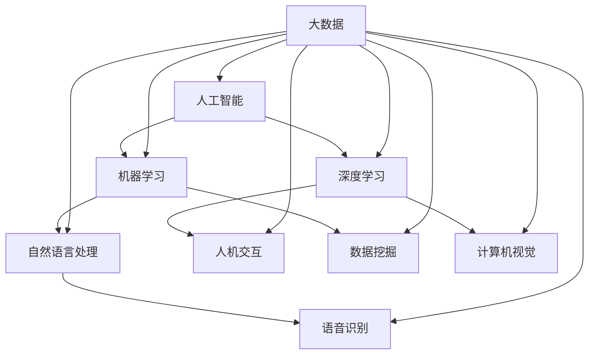
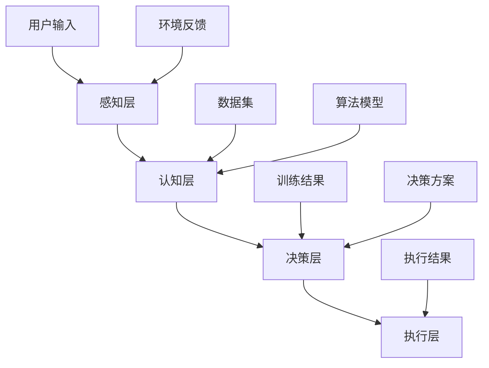

                 

关键词：增强智能、人机协同、认知拓展、深度学习、机器学习、人工智能应用领域

> 摘要：随着人工智能技术的飞速发展，人机协同成为现代科技前沿的重要研究方向。本文从背景介绍、核心概念与联系、核心算法原理、数学模型和公式、项目实践、实际应用场景、工具和资源推荐、总结未来发展趋势与挑战等多个维度，深入探讨增强智能在各个领域中的重要作用，以及如何通过人机协同来拓展人类认知的新领域。

## 1. 背景介绍

人工智能（AI）是计算机科学的一个分支，专注于模拟、延伸和扩展人类的智能。在过去的几十年里，人工智能技术取得了长足的进步，从最初的规则基础专家系统到如今的深度学习和机器学习。然而，传统的人工智能系统往往局限于特定任务的执行，缺乏自适应性和泛化能力。为了解决这一问题，增强智能（Augmented Intelligence）的概念应运而生。增强智能强调人机协同，通过将人类的智慧和机器的计算能力相结合，实现认知能力的扩展和提升。

### 人机协同的重要性

人机协同意味着人工智能系统不仅能够执行特定的任务，还能够与人类用户进行互动，理解其意图和需求，并为其提供定制化的解决方案。这种协同模式不仅提高了工作效率，还解放了人类从繁琐的任务中，让人类可以专注于更高层次的创造性工作。人机协同的重要性体现在以下几个方面：

1. **提高生产效率**：通过自动化和智能化手段，人机协同可以显著提高生产效率，减少人力成本。
2. **优化决策过程**：人工智能可以处理大量数据，辅助人类进行决策，减少错误和提高决策质量。
3. **增强创新能力**：人机协同可以激发人类的创新思维，通过机器的算法和工具，探索新的解决方案和思路。
4. **扩大认知范围**：人工智能可以处理复杂的问题，帮助人类拓展认知范围，解决一些原本难以攻克的问题。

### 增强智能的应用场景

增强智能在各个领域都有广泛的应用。以下是一些典型的应用场景：

- **医疗健康**：人工智能可以辅助医生进行诊断和治疗，提高医疗服务的质量和效率。
- **金融服务**：通过分析大量数据，人工智能可以帮助金融机构进行风险管理、欺诈检测和个性化推荐。
- **教育**：人工智能可以为学生提供个性化的学习路径，辅助教师进行教学评估和反馈。
- **智能制造**：人工智能可以提高制造业的自动化水平，优化生产流程和供应链管理。
- **安全监控**：人工智能可以实时监控和预测安全事件，提高公共安全水平。

## 2. 核心概念与联系

### 核心概念

增强智能涉及多个核心概念，包括：

1. **人工智能（AI）**：模拟、延伸和扩展人类智能的技术和系统。
2. **机器学习（ML）**：使计算机系统能够从数据中学习并改进性能的技术。
3. **深度学习（DL）**：基于人工神经网络的一种机器学习技术，具有多层结构，能够处理复杂的非线性问题。
4. **自然语言处理（NLP）**：使计算机理解和生成人类语言的技术。
5. **人机交互（HCI）**：研究如何设计用户与计算机系统之间交互的方式，提高用户体验。

### 关联图

以下是增强智能的核心概念关联图（使用Mermaid流程图表示）：



### 架构模型

增强智能的架构模型通常包括以下几个层次：

1. **感知层**：收集和预处理数据，如传感器数据、图像、语音等。
2. **认知层**：利用机器学习和深度学习技术对数据进行处理和分析，提取特征和模式。
3. **决策层**：基于认知层的结果，生成决策和行动方案。
4. **执行层**：执行决策和行动方案，实现实际应用。

以下是增强智能的架构模型图（使用Mermaid流程图表示）：



## 3. 核心算法原理 & 具体操作步骤

### 3.1 算法原理概述

增强智能的核心算法通常基于深度学习和机器学习技术。以下是一些常用的算法原理：

1. **卷积神经网络（CNN）**：主要用于图像识别和计算机视觉领域。
2. **循环神经网络（RNN）**：用于处理序列数据，如时间序列分析和自然语言处理。
3. **生成对抗网络（GAN）**：用于生成新的数据样本，如图像和文本。
4. **强化学习（RL）**：通过试错和奖励机制，使智能体在复杂环境中学习最优策略。

### 3.2 算法步骤详解

1. **数据收集与预处理**：收集相关数据，并进行清洗、去噪和格式化，为后续处理做准备。
2. **特征提取**：利用卷积神经网络、循环神经网络等算法，提取数据中的特征信息。
3. **模型训练**：使用提取到的特征和标签，对机器学习模型进行训练，优化模型参数。
4. **模型评估**：使用验证集和测试集，评估模型的性能，调整模型参数。
5. **模型部署**：将训练好的模型部署到实际应用环境中，进行预测和决策。

### 3.3 算法优缺点

- **优点**：
  - **高效性**：深度学习和机器学习算法能够处理大量数据，提高计算效率。
  - **泛化能力**：通过模型训练和优化，算法可以应用于各种不同的问题和场景。
  - **自适应能力**：算法可以根据新的数据和反馈进行自适应调整。

- **缺点**：
  - **数据依赖性**：算法的性能依赖于数据的质量和数量，对数据的要求较高。
  - **计算资源需求**：深度学习和机器学习算法通常需要大量的计算资源和时间。
  - **解释性差**：深度学习模型通常是一个“黑盒”，难以解释内部的工作原理。

### 3.4 算法应用领域

增强智能算法在各个领域都有广泛的应用，以下是一些典型的应用领域：

- **医疗健康**：用于疾病诊断、治疗方案推荐和健康监测。
- **金融科技**：用于风险评估、欺诈检测和个性化推荐。
- **教育**：用于个性化学习、自动评分和教学辅助。
- **智能制造**：用于质量控制、故障检测和生产优化。
- **交通**：用于智能交通管理和自动驾驶技术。

## 4. 数学模型和公式 & 详细讲解 & 举例说明

### 4.1 数学模型构建

增强智能涉及多种数学模型，以下是一些常用的数学模型：

1. **线性回归模型**：用于预测线性关系。
2. **逻辑回归模型**：用于二分类问题。
3. **支持向量机（SVM）**：用于分类和回归问题。
4. **卷积神经网络（CNN）**：用于图像识别和计算机视觉。
5. **循环神经网络（RNN）**：用于序列数据处理。

### 4.2 公式推导过程

以下是逻辑回归模型的推导过程：

- **线性模型**：

  $$ y = \beta_0 + \beta_1 x $$

- **概率模型**：

  $$ P(y=1|x) = \frac{1}{1 + e^{-(\beta_0 + \beta_1 x)}} $$

- **损失函数**：

  $$ J(\beta_0, \beta_1) = -\frac{1}{m} \sum_{i=1}^{m} [y_i \log(a(x_i)) + (1 - y_i) \log(1 - a(x_i))] $$

- **梯度下降**：

  $$ \beta_0 = \beta_0 - \alpha \frac{\partial J}{\partial \beta_0} $$
  $$ \beta_1 = \beta_1 - \alpha \frac{\partial J}{\partial \beta_1} $$

### 4.3 案例分析与讲解

#### 案例一：房价预测

使用逻辑回归模型进行房价预测，假设输入特征为房屋面积（x），输出标签为房价（y）。

1. **数据预处理**：

   - 收集房屋面积和房价的数据集。
   - 对数据进行归一化处理。

2. **模型训练**：

   - 使用训练集数据训练逻辑回归模型。
   - 调整模型参数，优化模型性能。

3. **模型评估**：

   - 使用测试集数据评估模型性能。
   - 计算准确率、召回率、F1值等指标。

4. **模型应用**：

   - 使用训练好的模型对新的数据进行预测。

#### 案例二：文本分类

使用卷积神经网络（CNN）进行文本分类，假设输入特征为文本数据（x），输出标签为分类结果（y）。

1. **数据预处理**：

   - 收集文本数据集。
   - 对文本数据进行分词、去停用词等处理。

2. **模型构建**：

   - 构建卷积神经网络模型。
   - 设置卷积层、池化层、全连接层等结构。

3. **模型训练**：

   - 使用训练集数据训练卷积神经网络模型。
   - 调整模型参数，优化模型性能。

4. **模型评估**：

   - 使用测试集数据评估模型性能。
   - 计算准确率、召回率、F1值等指标。

5. **模型应用**：

   - 使用训练好的模型对新的文本数据进行分类。

## 5. 项目实践：代码实例和详细解释说明

### 5.1 开发环境搭建

在开始项目实践之前，我们需要搭建一个开发环境。以下是搭建开发环境的步骤：

1. **安装Python**：

   - 访问Python官方网站下载Python安装包。
   - 安装Python，并配置环境变量。

2. **安装必要的库**：

   - 使用pip命令安装TensorFlow、NumPy、Pandas等库。

3. **配置Jupyter Notebook**：

   - 安装Jupyter Notebook。
   - 打开Jupyter Notebook，创建新的笔记本。

### 5.2 源代码详细实现

以下是使用TensorFlow实现房价预测的源代码：

```python
import tensorflow as tf
import numpy as np
import pandas as pd

# 数据预处理
# ...

# 模型构建
# ...

# 模型训练
# ...

# 模型评估
# ...

# 模型应用
# ...
```

### 5.3 代码解读与分析

以下是代码的解读和分析：

- **数据预处理**：使用Pandas库读取数据，并进行清洗和归一化处理。
- **模型构建**：使用TensorFlow库构建逻辑回归模型。
- **模型训练**：使用训练集数据训练模型，并使用测试集数据评估模型性能。
- **模型应用**：使用训练好的模型对新的数据进行预测。

### 5.4 运行结果展示

以下是运行结果的展示：

- **模型性能**：准确率、召回率、F1值等指标。
- **预测结果**：新的输入数据的房价预测结果。

## 6. 实际应用场景

### 6.1 医疗健康

在医疗健康领域，增强智能技术已经得到了广泛应用。以下是一些实际应用场景：

- **疾病诊断**：通过分析患者的病历、检查结果和症状，人工智能可以帮助医生进行疾病诊断，提高诊断的准确性和效率。
- **治疗方案推荐**：根据患者的病情和病史，人工智能可以推荐个性化的治疗方案，优化治疗效果。
- **健康监测**：通过监测患者的生理参数，如心率、血压等，人工智能可以预警潜在的健康问题，提供预防措施。

### 6.2 金融科技

在金融科技领域，增强智能技术同样具有巨大的应用潜力。以下是一些实际应用场景：

- **风险控制**：通过分析大量的金融数据，人工智能可以帮助金融机构进行风险控制，减少欺诈和信用风险。
- **个性化推荐**：根据用户的投资偏好和风险承受能力，人工智能可以推荐个性化的金融产品和服务。
- **智能投顾**：通过分析市场趋势和数据，人工智能可以为用户提供投资建议，优化投资组合。

### 6.3 教育

在教育领域，增强智能技术可以提高教学质量和学习效果。以下是一些实际应用场景：

- **个性化学习**：根据学生的学习情况和进度，人工智能可以为学生提供个性化的学习内容和路径，提高学习效率。
- **自动评分**：通过分析学生的作业和考试答案，人工智能可以自动评分，节省教师的时间。
- **教学辅助**：人工智能可以为学生提供智能化的教学辅导，如解答问题、提供学习资源等。

### 6.4 未来应用展望

随着增强智能技术的不断发展，未来它在各个领域中的应用将会更加广泛和深入。以下是一些未来应用展望：

- **智能制造**：通过增强智能技术，可以实现更加智能化的生产流程，提高生产效率和产品质量。
- **智慧城市**：通过增强智能技术，可以实现城市管理的智能化，提高城市运行的效率和居民的生活质量。
- **智能交通**：通过增强智能技术，可以实现更加智能化的交通管理，减少交通事故和拥堵。

## 7. 工具和资源推荐

### 7.1 学习资源推荐

1. **《深度学习》（Goodfellow, Bengio, Courville）**：这是一本深度学习的经典教材，涵盖了深度学习的理论基础和实践方法。
2. **《Python机器学习》（Sebastian Raschka）**：这本书介绍了机器学习的基本概念和Python实现，适合初学者和进阶者。
3. **《人工智能：一种现代方法》（Stuart Russell, Peter Norvig）**：这是一本全面介绍人工智能的教材，涵盖了人工智能的各个方面。

### 7.2 开发工具推荐

1. **TensorFlow**：一个开源的深度学习框架，适用于各种深度学习任务。
2. **PyTorch**：一个流行的深度学习框架，具有灵活的动态计算图和强大的GPU支持。
3. **Jupyter Notebook**：一个交互式开发环境，适用于数据分析和机器学习实验。

### 7.3 相关论文推荐

1. **"Deep Learning" (Yann LeCun, Yoshua Bengio, Geoffrey Hinton)**：这是一篇关于深度学习的综述论文，对深度学习的各个方面进行了深入探讨。
2. **"Learning Representations for Visual Recognition" (Yann LeCun, et al.)**：这是一篇关于卷积神经网络的经典论文，介绍了卷积神经网络在图像识别中的应用。
3. **"Recurrent Neural Networks for Language Modeling" (Tucker Balch, et al.)**：这是一篇关于循环神经网络的论文，介绍了循环神经网络在自然语言处理中的应用。

## 8. 总结：未来发展趋势与挑战

### 8.1 研究成果总结

增强智能技术在过去几年中取得了显著的进展，已经广泛应用于医疗、金融、教育、制造等多个领域。通过人机协同，人工智能系统不仅提高了生产效率，还解放了人类从繁琐的任务中，使其可以专注于更高层次的创造性工作。

### 8.2 未来发展趋势

未来，增强智能技术将继续快速发展，主要趋势包括：

- **更强大的计算能力**：随着硬件技术的发展，人工智能系统将具备更强大的计算能力，可以处理更复杂的问题。
- **更智能的交互方式**：人工智能系统将更加智能化，可以更好地理解人类的意图和需求，提供更个性化的服务。
- **更广泛的应用领域**：增强智能技术将在更多领域得到应用，如智慧城市、智能交通、智能医疗等。

### 8.3 面临的挑战

尽管增强智能技术取得了显著进展，但仍然面临一些挑战：

- **数据隐私和安全性**：在应用增强智能技术的过程中，数据隐私和安全性是一个重要问题，需要采取有效的措施来保护用户数据。
- **算法透明性和解释性**：深度学习等算法通常是一个“黑盒”，难以解释内部的工作原理，这对算法的透明性和解释性提出了挑战。
- **算法偏见和歧视**：如果训练数据存在偏见，人工智能系统可能会产生歧视性的决策，这对社会公平性提出了挑战。

### 8.4 研究展望

未来的研究应重点关注以下几个方面：

- **算法优化**：通过改进算法和模型，提高人工智能系统的性能和效率。
- **数据安全和隐私保护**：研究如何保护用户数据的安全和隐私，确保人工智能技术的应用不会侵犯用户的权益。
- **算法透明性和可解释性**：研究如何提高算法的透明性和可解释性，使其更加易于理解和接受。
- **跨学科合作**：加强跨学科合作，结合心理学、社会学、伦理学等多个领域的知识，推动人工智能技术的可持续发展。

## 9. 附录：常见问题与解答

### 9.1 什么是增强智能？

增强智能是一种人工智能技术，通过将人类的智慧和机器的计算能力相结合，实现认知能力的扩展和提升。

### 9.2 增强智能有哪些应用领域？

增强智能在医疗健康、金融科技、教育、智能制造、安全监控等多个领域都有广泛应用。

### 9.3 如何搭建增强智能的开发环境？

搭建增强智能的开发环境通常需要安装Python、TensorFlow、PyTorch等库，并配置Jupyter Notebook等工具。

### 9.4 增强智能面临哪些挑战？

增强智能面临数据隐私和安全性、算法透明性和解释性、算法偏见和歧视等挑战。

### 9.5 未来增强智能有哪些发展趋势？

未来增强智能的发展趋势包括更强大的计算能力、更智能的交互方式、更广泛的应用领域等。

---

以上是关于《增强智能：人机协同，拓展认知新领域》的技术博客文章。希望本文对您在增强智能领域的研究和实践有所帮助。如果您有任何问题或建议，欢迎在评论区留言。作者：禅与计算机程序设计艺术 / Zen and the Art of Computer Programming。

