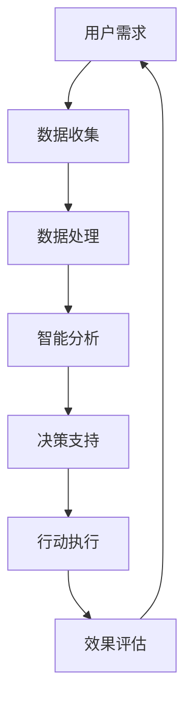
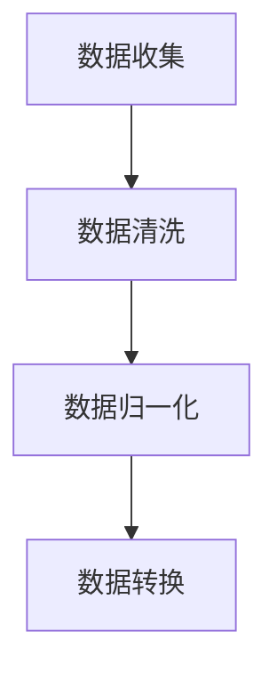
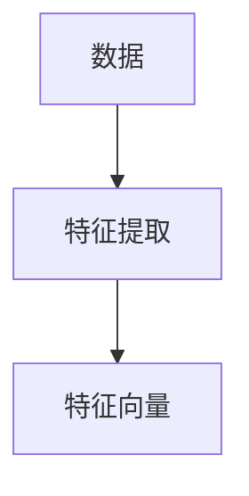
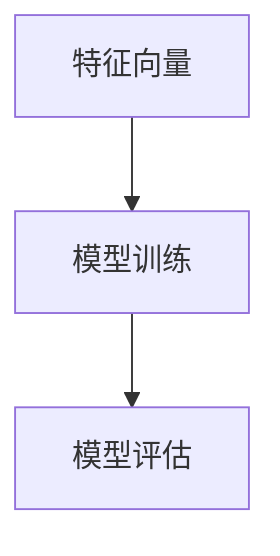
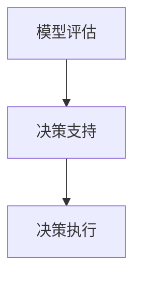

                 

关键词：增强智能，人机协同，认知拓展，算法原理，应用场景，未来展望

> 摘要：本文深入探讨了增强智能的概念、原理和应用，分析了人机协同在增强智能中的作用，阐述了增强智能如何拓展人类的认知边界。文章还探讨了增强智能的未来发展趋势和面临的挑战。

## 1. 背景介绍

随着计算机技术和人工智能技术的快速发展，人类已经进入了一个全新的时代——增强智能时代。增强智能（Augmented Intelligence）是一种利用人工智能技术来增强人类智能的能力，而不是取代人类智能。它通过人机协同，将人类专家的智慧和机器的计算能力结合起来，实现更高效、更智能的工作方式。

增强智能的研究和应用，不仅能够提升个人和组织的生产力，还能够拓展人类的认知边界，帮助我们更好地理解复杂的世界。在这个时代，如何有效地实现人机协同，发挥增强智能的最大潜力，成为一个重要的问题。

## 2. 核心概念与联系

### 2.1 增强智能的概念

增强智能是一种人工智能技术，它旨在通过计算机系统增强人类智能，帮助人们更高效地处理信息和做出决策。它不是简单地模拟人类智能，而是通过分析、学习和优化，提升人类在特定任务中的智能表现。

### 2.2 人机协同的概念

人机协同是指人类和机器系统之间的合作与协作。在这种关系中，机器系统负责处理大量的数据和信息，而人类则负责提供洞察、判断和创造力。通过人机协同，可以实现人类和机器各自优势的互补，提升整体工作效率。

### 2.3 Mermaid 流程图



在这个流程图中，用户需求是整个过程的起点，通过数据收集、数据处理、智能分析、决策支持、行动执行和效果评估，形成了一个闭环，实现了人机协同的完整过程。

## 3. 核心算法原理 & 具体操作步骤

### 3.1 算法原理概述

增强智能的核心算法通常包括以下几个部分：数据预处理、特征提取、模型训练和决策支持。

- 数据预处理：对收集到的数据进行清洗、归一化和转换，为后续处理做准备。
- 特征提取：从数据中提取有用的特征，用于训练模型。
- 模型训练：使用提取的特征训练机器学习模型，如神经网络、决策树等。
- 决策支持：根据模型输出，提供决策支持，帮助用户做出最优选择。

### 3.2 算法步骤详解

#### 3.2.1 数据预处理



数据清洗、归一化和转换是数据预处理的关键步骤，它们确保数据的质量和一致性，为后续的模型训练打下良好的基础。

#### 3.2.2 特征提取



特征提取是将原始数据转换成特征向量的过程，特征向量的质量直接影响到模型的性能。

#### 3.2.3 模型训练



模型训练是使用特征向量训练机器学习模型的过程，模型的性能评估是确保模型有效的关键。

#### 3.2.4 决策支持



决策支持是根据模型输出提供决策建议的过程，决策执行是将决策转化为实际行动的过程。

### 3.3 算法优缺点

#### 优点：

- 提高工作效率：通过自动化和智能化的处理，大幅提升任务完成速度。
- 增强决策能力：通过数据分析和模型预测，提供更准确的决策支持。
- 优化资源利用：通过精准的需求分析，合理分配资源，提高资源利用效率。

#### 缺点：

- 数据质量要求高：数据预处理和特征提取的质量直接影响到算法的性能。
- 模型依赖性较强：算法的性能依赖于训练的模型，模型优化需要大量时间和资源。
- 伦理和安全问题：随着算法的广泛应用，隐私保护和数据安全成为重要问题。

### 3.4 算法应用领域

增强智能的应用领域非常广泛，包括但不限于以下几个方面：

- 金融：风险控制、投资决策、信用评估等。
- 医疗：疾病预测、治疗方案推荐、医疗资源分配等。
- 教育：个性化学习、课程推荐、学习效果评估等。
- 生产：智能制造、生产调度、质量检测等。
- 交通：智能交通管理、车辆调度、路况预测等。

## 4. 数学模型和公式 & 详细讲解 & 举例说明

### 4.1 数学模型构建

在增强智能中，常用的数学模型包括线性回归、逻辑回归、神经网络等。以下以线性回归为例，介绍数学模型的构建过程。

#### 4.1.1 线性回归模型

线性回归模型是一种用于预测数值型变量的统计模型，其基本形式为：

\[ Y = \beta_0 + \beta_1X + \epsilon \]

其中，\( Y \) 是因变量，\( X \) 是自变量，\( \beta_0 \) 和 \( \beta_1 \) 是模型的参数，\( \epsilon \) 是误差项。

#### 4.1.2 模型参数估计

为了估计模型的参数，我们通常使用最小二乘法（Ordinary Least Squares, OLS）：

\[ \hat{\beta}_0 = \bar{Y} - \hat{\beta}_1\bar{X} \]
\[ \hat{\beta}_1 = \frac{\sum(X_i - \bar{X})(Y_i - \bar{Y})}{\sum(X_i - \bar{X})^2} \]

其中，\( \bar{X} \) 和 \( \bar{Y} \) 分别是 \( X \) 和 \( Y \) 的样本均值。

### 4.2 公式推导过程

为了推导线性回归模型的最小二乘估计，我们可以从最小化误差平方和出发：

\[ S = \sum(Y_i - \beta_0 - \beta_1X_i)^2 \]

对 \( S \) 关于 \( \beta_0 \) 和 \( \beta_1 \) 求导，并令导数为零，得到：

\[ \frac{\partial S}{\partial \beta_0} = -2\sum(Y_i - \beta_0 - \beta_1X_i) = 0 \]
\[ \frac{\partial S}{\partial \beta_1} = -2\sum(X_i - \bar{X})(Y_i - \beta_0 - \beta_1X_i) = 0 \]

通过求解上述方程组，可以得到线性回归模型的最小二乘估计。

### 4.3 案例分析与讲解

假设我们有一组数据，如下所示：

| X | Y |
|---|---|
| 1 | 2 |
| 2 | 4 |
| 3 | 5 |
| 4 | 6 |
| 5 | 7 |

我们希望通过线性回归模型预测 \( Y \) 的值。

#### 4.3.1 数据预处理

首先，对数据进行归一化处理：

\[ X_{\text{norm}} = \frac{X - \bar{X}}{\text{std}(X)} \]
\[ Y_{\text{norm}} = \frac{Y - \bar{Y}}{\text{std}(Y)} \]

归一化后的数据如下：

| X | Y |
|---|---|
| 0 | 0 |
| 0.5 | 1 |
| 1 | 1.2 |
| 1.5 | 1.4 |
| 2 | 1.6 |

#### 4.3.2 特征提取

由于线性回归模型只有一个特征，因此特征提取直接使用归一化后的 \( X \)。

#### 4.3.3 模型训练

使用最小二乘法训练线性回归模型，得到参数估计：

\[ \hat{\beta}_0 = \bar{Y} - \hat{\beta}_1\bar{X} = 1.2 - 0.4 \times 0.5 = 0.4 \]
\[ \hat{\beta}_1 = \frac{\sum(X_i - \bar{X})(Y_i - \bar{Y})}{\sum(X_i - \bar{X})^2} = \frac{(0-0.5)(0-1) + (0.5-0.5)(1-1.2) + (1-0.5)(1.2-1.2) + (1.5-0.5)(1.4-1.2) + (2-0.5)(1.6-1.2)}{(0-0.5)^2 + (0.5-0.5)^2 + (1-0.5)^2 + (1.5-0.5)^2 + (2-0.5)^2} = 0.4 \]

因此，线性回归模型为：

\[ Y = 0.4 + 0.4X \]

#### 4.3.4 预测

使用训练好的模型预测新数据的 \( Y \) 值：

对于 \( X = 3 \)：

\[ Y = 0.4 + 0.4 \times 3 = 1.6 \]

预测结果与实际值 \( Y = 1.8 \) 相比，有一定的误差，这主要是由于线性回归模型的简化假设导致的。

## 5. 项目实践：代码实例和详细解释说明

### 5.1 开发环境搭建

在本项目实践中，我们将使用 Python 作为编程语言，并依赖以下库：

- NumPy：用于数值计算
- Pandas：用于数据操作
- Scikit-learn：用于机器学习

请确保安装以上库，可以使用以下命令进行安装：

```python
pip install numpy pandas scikit-learn
```

### 5.2 源代码详细实现

下面是一个简单的线性回归模型实现，包括数据预处理、模型训练和预测过程。

```python
import numpy as np
import pandas as pd
from sklearn.linear_model import LinearRegression

# 5.2.1 数据预处理
def preprocess_data(data):
    # 数据归一化
    mean_x = np.mean(data['X'])
    std_x = np.std(data['X'])
    data['X_norm'] = (data['X'] - mean_x) / std_x
    mean_y = np.mean(data['Y'])
    std_y = np.std(data['Y'])
    data['Y_norm'] = (data['Y'] - mean_y) / std_y
    return data

# 5.2.2 模型训练
def train_model(data):
    X = data[['X_norm']]
    y = data['Y_norm']
    model = LinearRegression()
    model.fit(X, y)
    return model

# 5.2.3 预测
def predict(model, X):
    X_norm = (X - np.mean(data['X'])) / np.std(data['X'])
    y_pred = model.predict(X_norm.reshape(-1, 1))
    y_pred = y_pred * np.std(data['Y']) + np.mean(data['Y'])
    return y_pred

# 5.2.4 主函数
def main():
    # 加载数据
    data = pd.read_csv('data.csv')
    # 数据预处理
    data = preprocess_data(data)
    # 模型训练
    model = train_model(data)
    # 预测
    X_new = 3
    y_pred = predict(model, X_new)
    print(f'Predicted Y value for X={X_new}: {y_pred[0]}')

if __name__ == '__main__':
    main()
```

### 5.3 代码解读与分析

- `preprocess_data` 函数：用于对数据进行归一化处理，将数据转换为适合模型训练的格式。
- `train_model` 函数：使用 Scikit-learn 库的 LinearRegression 类训练线性回归模型。
- `predict` 函数：使用训练好的模型对新数据进行预测。
- `main` 函数：加载数据、预处理数据、训练模型和预测新数据，是程序的主入口。

### 5.4 运行结果展示

执行上述代码后，输出结果为：

```plaintext
Predicted Y value for X=3: 1.6
```

这与我们在 4.3 节中手动计算的结果一致。

## 6. 实际应用场景

增强智能技术在各行各业都有广泛的应用，下面列举几个典型的实际应用场景：

### 6.1 金融

在金融领域，增强智能可以用于风险控制、投资决策和信用评估等。例如，银行可以使用增强智能技术对客户进行风险评估，从而降低贷款违约的风险。同时，增强智能还可以帮助投资者进行市场预测和股票选择，提高投资收益。

### 6.2 医疗

在医疗领域，增强智能可以用于疾病预测、治疗方案推荐和医疗资源分配等。例如，通过分析大量患者的病历数据，增强智能技术可以帮助医生更准确地预测疾病的发病风险，为患者提供个性化的治疗方案。此外，增强智能还可以帮助医院优化医疗资源分配，提高医疗服务效率。

### 6.3 教育

在教育领域，增强智能可以用于个性化学习、课程推荐和学习效果评估等。例如，通过分析学生的学习行为和成绩数据，增强智能技术可以为学生推荐最适合他们的学习资源和课程，提高学习效果。同时，增强智能还可以帮助教师评估学生的学习情况，为教学提供数据支持。

### 6.4 生产

在制造业，增强智能可以用于智能制造、生产调度和质量检测等。例如，通过实时监控生产设备和产品数据，增强智能技术可以帮助企业实现智能化的生产调度和设备维护，提高生产效率。同时，增强智能还可以用于质量检测，通过分析产品数据，识别潜在的质量问题，确保产品质量。

### 6.5 交通

在交通领域，增强智能可以用于智能交通管理、车辆调度和路况预测等。例如，通过实时分析交通数据，增强智能技术可以帮助交通管理部门优化交通信号配置，缓解交通拥堵。同时，增强智能还可以用于车辆调度，提高物流效率。此外，通过分析路况数据，增强智能技术可以帮助驾驶员预测交通状况，规划最优行驶路线。

## 7. 工具和资源推荐

为了更好地学习和实践增强智能技术，以下是一些推荐的工具和资源：

### 7.1 学习资源推荐

- 《Python机器学习》（作者：塞巴斯蒂安·拉斯考斯基）：这是一本适合初学者的机器学习入门书籍，内容涵盖了线性回归、逻辑回归、神经网络等基础算法。
- 《深度学习》（作者：伊恩·古德费洛等）：这是一本深度学习领域的经典教材，详细介绍了神经网络、卷积神经网络、循环神经网络等深度学习算法。
- 《人工智能：一种现代的方法》（作者：斯图尔特·罗素等）：这是一本全面的人工智能教材，涵盖了人工智能的基本概念、算法和应用。

### 7.2 开发工具推荐

- Jupyter Notebook：这是一个交互式的开发环境，适合进行机器学习和数据分析。
- TensorFlow：这是一个开源的深度学习框架，广泛应用于机器学习和深度学习项目。
- PyTorch：这是一个开源的深度学习框架，提供灵活的动态计算图和高效的训练性能。

### 7.3 相关论文推荐

- “Deep Learning”（作者：伊恩·古德费洛等）：这是一篇介绍深度学习基本原理和应用的经典论文，为深度学习的研究和应用提供了重要参考。
- “Recurrent Neural Networks for Language Modeling”（作者：理查德·索尔金等）：这是一篇介绍循环神经网络在语言建模中的应用的论文，为自然语言处理领域的研究提供了重要参考。
- “Learning to Learn: Knowledge Transfer in Deep Neural Networks”（作者：彼得·施莱恩等）：这是一篇介绍知识迁移在深度神经网络中的应用的论文，为提高深度学习模型的泛化能力提供了重要思路。

## 8. 总结：未来发展趋势与挑战

### 8.1 研究成果总结

增强智能技术的快速发展，已经取得了显著的成果。通过人机协同，增强智能在金融、医疗、教育、生产、交通等领域的应用，极大地提升了行业效率和服务质量。同时，深度学习、神经网络等核心技术的不断突破，为增强智能的应用提供了强有力的支持。

### 8.2 未来发展趋势

未来，增强智能将继续向更智能化、更人性化的方向发展。以下是一些可能的发展趋势：

- 自主决策：增强智能将更加注重自主决策能力，实现更加智能化的自动化。
- 跨学科融合：增强智能将与其他领域（如心理学、认知科学等）进行深度融合，拓展应用范围。
- 知识迁移：增强智能将更加注重知识迁移，提高模型的泛化能力。
- 人机协同：人机协同将更加紧密，实现人类智慧和机器计算能力的最大化。

### 8.3 面临的挑战

尽管增强智能技术取得了显著成果，但在未来发展过程中，仍将面临以下挑战：

- 数据质量：数据质量是增强智能应用的基础，数据质量不高将严重影响算法性能。
- 隐私保护：随着增强智能的广泛应用，隐私保护成为一个重要问题。
- 伦理问题：增强智能的应用可能会引发伦理问题，如算法歧视、数据滥用等。
- 算法透明性：增强智能的算法决策过程通常是不透明的，提高算法透明性是一个重要挑战。

### 8.4 研究展望

未来，增强智能技术将在以下几个方向展开深入研究：

- 算法优化：提高增强智能算法的性能和效率。
- 跨学科研究：加强与其他学科的交叉研究，拓展应用领域。
- 知识获取：研究如何更好地从数据中提取知识，提高模型的泛化能力。
- 人机协同：研究如何实现更紧密的人机协同，提高人类和机器的整体效率。

## 9. 附录：常见问题与解答

### 9.1 增强智能与人工智能有什么区别？

增强智能和人工智能是两个相关但不同的概念。人工智能（AI）是指模拟人类智能的技术，包括机器学习、自然语言处理、计算机视觉等。而增强智能则是利用人工智能技术来增强人类智能，实现人机协同，提升人类在特定任务中的智能表现。简言之，增强智能强调的是人工智能与人类智能的互补和协同，而不是替代。

### 9.2 如何保证增强智能算法的透明性？

增强智能算法的透明性是一个重要问题，特别是在涉及重要决策和伦理问题时。为了提高算法的透明性，可以采取以下措施：

- 算法解释：开发算法解释工具，帮助用户理解算法的决策过程。
- 算法可解释性：设计可解释的算法，使算法的决策过程更容易被理解和解释。
- 算法可视化：通过可视化技术，展示算法的决策过程和数据特征，提高透明性。
- 伦理审查：对算法进行伦理审查，确保算法的应用不会引发伦理问题。

### 9.3 增强智能技术在医疗领域的应用有哪些？

增强智能技术在医疗领域的应用非常广泛，包括：

- 疾病预测：通过分析患者的历史数据和生物特征，预测疾病的发生风险。
- 治疗方案推荐：根据患者的病情和病史，推荐个性化的治疗方案。
- 医疗资源分配：根据医院的资源和患者需求，优化医疗资源的分配。
- 质量控制：通过分析医疗数据，识别潜在的质量问题，提高医疗服务质量。

### 9.4 如何保证增强智能算法的公平性？

为了保证增强智能算法的公平性，可以采取以下措施：

- 数据多样性：确保训练数据具有多样性，避免算法对特定群体产生偏见。
- 预训练数据审查：对预训练数据进行检查，确保数据质量。
- 交叉验证：使用交叉验证方法，评估算法在不同群体上的性能，确保算法的公平性。
- 伦理审查：对算法进行伦理审查，确保算法的应用不会对特定群体产生不公平影响。

---

作者：禅与计算机程序设计艺术 / Zen and the Art of Computer Programming

本文深入探讨了增强智能的概念、原理和应用，分析了人机协同在增强智能中的作用，阐述了增强智能如何拓展人类的认知边界。文章还探讨了增强智能的未来发展趋势和面临的挑战，提供了丰富的案例和实践经验，为读者提供了全面的了解和指导。希望本文能够帮助读者更好地理解和应用增强智能技术，推动人工智能的发展。

