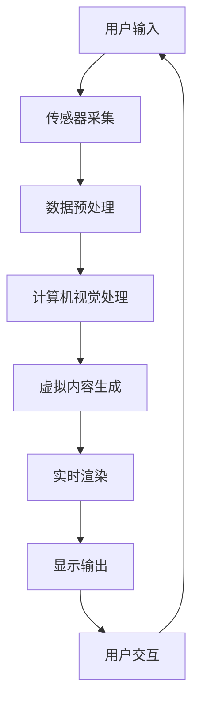

                 

关键词：增强现实、AR应用、开发、实现、核心技术、流程、场景应用、未来展望

## 摘要

本文旨在深入探讨增强现实（Augmented Reality，AR）应用的开发，从基础概念到实际实现提供一整套完整的指南。我们将首先介绍AR的基本概念和原理，通过一个Mermaid流程图展示AR的核心架构，然后详细阐述AR应用开发的算法原理、数学模型、项目实践，以及其在实际应用场景中的表现。最后，我们将展望AR技术的未来发展趋势和面临的挑战，并提供相关的学习资源与开发工具推荐。通过这篇文章，读者将能够全面了解AR技术，并掌握开发AR应用的核心技能。

## 1. 背景介绍

增强现实（AR）是一种将虚拟信息叠加到真实世界中的技术。随着智能手机和移动设备的普及，AR技术逐渐走进了大众视野。AR不仅仅是一种视觉增强，它还包括听觉、触觉等多感官的融合，使得用户能够与虚拟内容进行自然交互。AR技术的重要性不言而喻，它正在改变人们的生活方式，从游戏娱乐到教育、医疗、制造业等多个领域都有着广泛的应用。

AR技术的历史可以追溯到1968年，由美国计算机科学家伊凡·苏瑟兰（Ivan Sutherland）首次提出。早期的AR系统主要是基于头戴显示器（Head-Mounted Display，HMD），如苏瑟兰的“达摩克利斯之剑”（Sword of Damocles）。随着技术的进步，尤其是计算机视觉和图形处理技术的发展，AR技术逐渐从实验室走向了市场。

目前，AR技术已经进入了一个快速发展的阶段。苹果、谷歌、三星等科技巨头都在积极投入AR技术的研发和推广。例如，苹果的ARKit和谷歌的ARCore为开发者提供了强大的工具和平台，使得开发高质量的AR应用变得更加简单和高效。

## 2. 核心概念与联系

### 2.1. 增强现实（AR）的定义

增强现实（AR）是一种通过在用户视野中叠加虚拟信息来增强现实世界感知的技术。与虚拟现实（VR）不同，VR是一种完全沉浸式的体验，用户进入一个完全由计算机生成的虚拟世界；而AR则是将虚拟信息与现实世界结合，用户仍然可以看到现实环境，同时叠加的虚拟信息与现实环境相互交互。

### 2.2. AR的关键技术

- **计算机视觉**：通过计算机算法识别和理解现实世界的图像和场景。
- **图像处理**：对输入的图像进行增强、过滤和变换，以便更好地处理和分析。
- **实时渲染**：实时生成和显示虚拟信息，与真实世界进行无缝融合。
- **传感器融合**：集成多种传感器数据，如摄像头、GPS、加速度计等，以提高定位和跟踪的准确性。
- **用户交互**：通过触摸、手势、声音等多种方式与虚拟信息进行交互。

### 2.3. AR的架构

下面是一个简单的Mermaid流程图，展示了AR系统的主要组成部分及其相互关系：



在AR系统中，用户输入通过传感器采集后，经过数据预处理和计算机视觉处理，生成虚拟内容，再通过实时渲染显示输出，用户通过交互反馈再次输入，形成一个闭环。

## 3. 核心算法原理 & 具体操作步骤

### 3.1. 算法原理概述

AR算法的核心在于将虚拟内容与现实世界中的物体或场景进行精确对齐和融合。主要算法包括：

- **图像识别与跟踪**：通过图像处理和计算机视觉算法识别现实世界中的物体或场景，并跟踪其运动。
- **空间映射**：将虚拟内容映射到现实世界中的对应位置，确保虚拟内容与现实场景的准确对齐。
- **实时渲染**：对虚拟内容进行实时渲染，使其与现实场景无缝融合。

### 3.2. 算法步骤详解

1. **图像识别与跟踪**：

   - **图像预处理**：对采集的图像进行降噪、增强等处理，提高图像质量。
   - **特征提取**：提取图像的关键特征，如边缘、角点等。
   - **模板匹配**：使用已知的模板与图像进行匹配，确定物体的位置和大小。

2. **空间映射**：

   - **姿态估计**：通过图像识别的结果，估计物体的姿态（旋转和位置）。
   - **空间变换**：根据姿态估计结果，将虚拟内容映射到现实世界的对应位置。

3. **实时渲染**：

   - **内容生成**：生成虚拟内容，包括纹理、光照等。
   - **渲染引擎**：使用渲染引擎将虚拟内容实时显示在屏幕上。
   - **优化**：对渲染过程进行优化，确保实时性和流畅性。

### 3.3. 算法优缺点

- **优点**：

  - **沉浸感强**：AR技术将虚拟内容与现实世界相结合，提供了丰富的沉浸体验。
  - **交互自然**：用户可以通过触摸、手势等方式与虚拟内容进行自然交互。
  - **应用广泛**：AR技术在游戏、教育、医疗等多个领域都有广泛应用。

- **缺点**：

  - **计算资源消耗大**：AR算法涉及图像处理、计算机视觉和实时渲染，对计算资源要求较高。
  - **设备依赖**：目前AR应用主要依赖于智能手机和头戴显示器等设备，对硬件性能有较高要求。
  - **用户体验**：在某些情况下，AR应用可能因为环境光线、设备性能等因素影响用户体验。

### 3.4. 算法应用领域

- **游戏娱乐**：AR游戏如《精灵宝可梦GO》等，提供了独特的沉浸体验和社交互动。
- **教育培训**：通过AR技术，可以实现虚拟课堂、互动教学等，提高学习效果。
- **医疗健康**：AR技术在医疗诊断、手术指导等方面有广泛应用，提高了医疗效率和准确性。
- **制造业**：AR技术在工业设计、装配和维护等方面提供了强大的辅助工具。

## 4. 数学模型和公式 & 详细讲解 & 举例说明

### 4.1. 数学模型构建

AR系统中的数学模型主要包括图像处理、计算机视觉和图形渲染等领域的公式。以下是一个简化的数学模型：

$$
I_{output} = R \cdot I_{input} + V_{virtual}
$$

其中，$I_{output}$ 是输出图像，$R$ 是空间变换矩阵，$I_{input}$ 是输入图像，$V_{virtual}$ 是虚拟内容。

### 4.2. 公式推导过程

- **空间变换矩阵 $R$**：

  空间变换矩阵 $R$ 用于将虚拟内容映射到现实世界的对应位置。其推导过程涉及姿态估计和空间映射算法。

- **虚拟内容 $V_{virtual}$**：

  虚拟内容 $V_{virtual}$ 包括纹理、光照等参数。其生成过程涉及实时渲染算法。

### 4.3. 案例分析与讲解

#### 案例一：AR游戏《精灵宝可梦GO》

《精灵宝可梦GO》是一个基于AR技术的游戏，其核心算法包括图像识别、跟踪和实时渲染。以下是一个简单的分析：

- **图像识别**：游戏通过摄像头捕捉现实世界的图像，使用图像处理算法提取关键特征。
- **跟踪**：根据关键特征，游戏算法跟踪现实世界中的物体，如宝可梦的定位。
- **实时渲染**：游戏生成虚拟的宝可梦，并通过渲染引擎将其实时显示在屏幕上。

#### 案例二：医疗诊断

在医疗诊断中，AR技术可以帮助医生更准确地识别和定位病变区域。以下是一个简单的分析：

- **图像识别**：使用计算机视觉算法识别病变区域的图像。
- **跟踪**：根据病变区域的位置和大小，进行实时跟踪。
- **实时渲染**：在医疗设备的屏幕上显示病变区域的三维模型，帮助医生进行诊断。

## 5. 项目实践：代码实例和详细解释说明

### 5.1. 开发环境搭建

要开发AR应用，首先需要搭建一个合适的开发环境。以下是一个简单的步骤：

1. **安装开发工具**：如Android Studio、Xcode等。
2. **安装AR开发框架**：如ARCore、ARKit等。
3. **创建项目**：使用开发工具创建一个新的AR项目。

### 5.2. 源代码详细实现

以下是一个简单的AR应用示例，实现一个在屏幕上显示虚拟物体的功能：

```java
// 引入ARCore库
import com.google.ar.core.*;

// ARActivity类继承自ARCore的ARActivity
public class ARActivity extends ARActivity {

    // 当ARSession创建时调用
    @Override
    protected void onCreate(Bundle savedInstanceState) {
        super.onCreate(savedInstanceState);
        
        // 设置AR模式为沉浸式
        setImmersiveMode();
        
        // 创建ARSession
        ARSession session = new ARSession(this);
        session.setMode(ARSession.MODE_IMAGE);
        setContentView(session.getView());
        
        // 添加平面检测和跟踪功能
        session.addAnchoredNodeListener(this);
    }

    // 当ARSession更新时调用
    @Override
    protected void onSessionUpdated(ARSession session) {
        if (session.isSessionActive()) {
            // 获取ARSession的图像捕获器
            ARImageCapture imageCapture = session.getImageCapture();
            
            // 捕获图像
            imageCapture.captureImage(new ARImageCapture.ImageListener() {
                @Override
                public void onNewImage(ARImage image) {
                    // 处理捕获的图像
                    processImage(image);
                }
            });
        }
    }

    // 处理捕获的图像
    private void processImage(ARImage image) {
        // 使用计算机视觉算法识别图像
        List<ARImageTarget> targets = detectTargets(image);

        // 对于每个识别的目标，创建一个锚点
        for (ARImageTarget target : targets) {
            ARAnchor anchor = session.createAnchor(target.getPosition(), target.getRotation());
            session.addAnchor(anchor);
            
            // 在锚点上添加虚拟物体
            addVirtualObject(anchor);
        }
    }

    // 识别图像中的目标
    private List<ARImageTarget> detectTargets(ARImage image) {
        // 实现图像识别算法
        // ...
        return new ArrayList<>();
    }

    // 在锚点上添加虚拟物体
    private void addVirtualObject(ARAnchor anchor) {
        // 创建虚拟物体的模型和材质
        // ...
        
        // 添加虚拟物体到ARSession
        session.addNode(anchor.getNode(), virtualObject);
    }
}
```

### 5.3. 代码解读与分析

这段代码实现了一个基本的AR应用，其主要功能包括：

- 创建ARSession并设置AR模式。
- 捕获图像并使用计算机视觉算法识别图像中的目标。
- 对于每个识别的目标，创建一个锚点并添加虚拟物体。

### 5.4. 运行结果展示

当用户运行这个AR应用时，屏幕上会显示一个虚拟物体，用户可以通过摄像头捕捉现实世界中的物体，当识别到目标物体时，虚拟物体会出现在屏幕上。

## 6. 实际应用场景

### 6.1. 游戏娱乐

AR技术在游戏娱乐领域的应用已经非常成熟。例如，《精灵宝可梦GO》通过AR技术让玩家在现实世界中捕捉虚拟宝可梦，提供了独特的互动体验。此外，AR技术还可以用于角色扮演游戏、射击游戏等，增强玩家的沉浸感和互动性。

### 6.2. 教育培训

AR技术在教育培训中的应用也越来越广泛。通过AR技术，可以实现虚拟课堂、互动教学等，为学生提供更加生动、直观的学习体验。例如，学生可以通过AR眼镜看到虚拟的实验过程，或者与虚拟的动物进行互动，从而更好地理解和记忆知识。

### 6.3. 医疗健康

AR技术在医疗健康领域有广泛的应用前景。例如，在手术中，医生可以通过AR眼镜看到患者的内部结构，提高手术的准确性和安全性。此外，AR技术还可以用于医学教育、诊断辅助等，为医生和患者提供更加全面的信息和服务。

### 6.4. 未来应用展望

随着技术的不断进步，AR技术在未来将会有更多的应用场景。例如，在智能制造领域，AR技术可以用于设备维护、工艺优化等，提高生产效率和产品质量。在社交互动领域，AR技术可以用于虚拟社交、互动游戏等，为用户带来全新的社交体验。

## 7. 工具和资源推荐

### 7.1. 学习资源推荐

- **《增强现实技术基础》**：一本介绍AR技术基本原理和应用的入门书籍。
- **《ARKit开发实战》**：一本针对苹果ARKit框架的实战指南。
- **《ARCore开发实战》**：一本针对谷歌ARCore框架的实战指南。

### 7.2. 开发工具推荐

- **Android Studio**：谷歌推出的集成开发环境，支持AR应用开发。
- **Xcode**：苹果推出的集成开发环境，支持ARKit开发。
- **Unity**：一个跨平台的游戏和AR应用开发引擎。

### 7.3. 相关论文推荐

- **《ARKit：增强现实应用开发指南》**：一篇介绍苹果ARKit框架的论文。
- **《ARCore：增强现实开发平台》**：一篇介绍谷歌ARCore框架的论文。
- **《增强现实技术在教育培训中的应用研究》**：一篇探讨AR技术在教育培训领域应用的论文。

## 8. 总结：未来发展趋势与挑战

### 8.1. 研究成果总结

近年来，AR技术在各个领域取得了显著的研究成果。例如，在图像识别和跟踪方面，深度学习算法的应用极大地提高了识别准确率和实时性。在实时渲染方面，图形处理技术的发展使得虚拟内容的生成和显示变得更加高效和逼真。

### 8.2. 未来发展趋势

未来，AR技术将朝着更加智能化、沉浸化、个性化的方向发展。例如，通过人工智能技术，AR系统将能够更好地理解和预测用户需求，提供个性化的服务。通过更高性能的硬件，AR体验将更加逼真，用户沉浸感将得到进一步提升。

### 8.3. 面临的挑战

尽管AR技术有着广泛的应用前景，但也面临一些挑战。例如，计算资源消耗仍然较大，对设备性能有较高要求。此外，AR技术的普及和应用还需要解决用户体验、隐私保护等问题。

### 8.4. 研究展望

未来的研究将集中在如何提高AR系统的计算效率和用户体验，同时解决技术普及和应用中的问题。例如，通过优化算法和硬件设计，提高AR系统的性能和稳定性；通过用户行为分析，提供更加个性化的服务；通过隐私保护技术，确保用户数据的安全和隐私。

## 9. 附录：常见问题与解答

### 9.1. 如何搭建AR开发环境？

答：搭建AR开发环境主要步骤包括：安装开发工具（如Android Studio、Xcode等）、安装AR开发框架（如ARCore、ARKit等）、创建项目等。

### 9.2. AR应用开发有哪些常见的算法？

答：AR应用开发常见的算法包括图像识别与跟踪、空间映射、实时渲染等。

### 9.3. AR技术在医疗健康领域有哪些应用？

答：AR技术在医疗健康领域的应用包括手术指导、医学教育、诊断辅助等。

### 9.4. AR技术如何保护用户隐私？

答：AR技术可以通过数据加密、匿名化处理、隐私保护协议等措施来保护用户隐私。

---

作者：禅与计算机程序设计艺术 / Zen and the Art of Computer Programming

