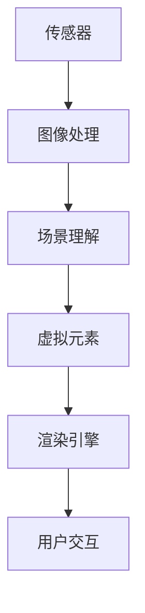

                 

关键词：增强现实，ARKit，ARCore，增强现实应用，移动AR，实时渲染，图像识别，计算机视觉

> 摘要：本文将深入探讨增强现实（AR）技术，以及Apple的ARKit和Google的ARCore两大平台，解析它们的核心概念、功能实现、算法原理，并提供实际开发中的代码实例和运行结果展示，旨在为开发者提供全面的AR技术应用指南。

## 1. 背景介绍

随着智能手机和移动设备的普及，增强现实（Augmented Reality，AR）技术逐渐成为人们生活中不可或缺的一部分。AR技术通过在现实场景中叠加虚拟元素，为用户提供了全新的交互体验。Apple和Google作为科技领域的领军企业，分别推出了ARKit和ARCore两大平台，极大地推动了移动AR应用的发展。

### Apple ARKit

ARKit是Apple在2017年推出的一套AR开发框架，旨在为iOS和macOS开发者提供简单、高效的AR开发工具。ARKit利用设备内置的传感器和相机，实现实时场景感知、环境映射、光线估计等功能，支持各种丰富的AR应用，如教育、游戏、购物等。

### Google ARCore

ARCore是Google在2017年发布的一套AR开发平台，适用于Android设备和Daydream VR设备。ARCore通过增强设备传感器、图像处理和机器学习能力，实现高精度的场景识别、稳定的环境映射和实时交互，旨在推动移动AR的普及和发展。

## 2. 核心概念与联系

为了更好地理解ARKit和ARCore，我们首先需要了解增强现实技术的核心概念和架构。

### 核心概念

- **增强现实（AR）**：在现实世界场景中叠加虚拟元素，通过增强用户感知和交互体验的技术。

- **场景感知（Scene Understanding）**：通过计算机视觉技术对现实场景进行感知和理解，如检测平面、识别物体等。

- **环境映射（Environment Mapping）**：将虚拟元素映射到现实场景中，确保其与实际环境保持一致。

- **光线估计（Light Estimation）**：根据场景光照情况调整虚拟元素的光照效果，使其更加逼真。

### 架构

增强现实架构通常包括以下几个关键组成部分：

- **传感器**：如相机、GPS、陀螺仪等，用于捕捉现实世界的状态。

- **图像处理**：对捕获的图像进行处理，以提取有用的信息。

- **场景理解**：通过图像处理和机器学习算法，对现实场景进行理解和解析。

- **虚拟元素**：虚拟元素包括3D模型、纹理、动画等，用于叠加到现实场景中。

- **渲染引擎**：用于将虚拟元素渲染到现实场景中，确保视觉效果逼真。

### Mermaid 流程图

下面是ARKit和ARCore的核心概念与架构的Mermaid流程图：



## 3. 核心算法原理 & 具体操作步骤

### 3.1 算法原理概述

ARKit和ARCore的核心算法包括场景感知、环境映射和光线估计。以下是对这些算法的简要概述：

- **场景感知**：通过计算机视觉技术，如边缘检测、特征匹配等，识别现实场景中的平面、物体等关键信息。

- **环境映射**：利用图像处理技术，将虚拟元素映射到现实场景中，确保其与实际环境保持一致。

- **光线估计**：根据场景光照情况，调整虚拟元素的光照效果，使其更加逼真。

### 3.2 算法步骤详解

下面是ARKit和ARCore的核心算法步骤详解：

#### 3.2.1 场景感知

1. **相机捕捉**：设备相机捕捉现实场景图像。

2. **图像预处理**：对捕获的图像进行预处理，如去噪、缩放等。

3. **特征检测**：使用特征检测算法，如SIFT、SURF等，提取图像关键特征点。

4. **特征匹配**：将提取的关键特征点与预先训练的模型进行匹配，以识别现实场景中的平面、物体等。

5. **场景重建**：根据匹配结果，重建现实场景的三维模型。

#### 3.2.2 环境映射

1. **纹理映射**：将虚拟元素的纹理映射到重建的三维模型上。

2. **光照调整**：根据场景光照情况，调整虚拟元素的光照效果。

3. **渲染**：使用渲染引擎，将虚拟元素渲染到现实场景中。

#### 3.2.3 光线估计

1. **光线捕捉**：设备相机捕捉现实场景的光线信息。

2. **光线分析**：对捕获的光线信息进行分析，提取光源位置和强度。

3. **光照调整**：根据光线分析结果，调整虚拟元素的光照效果。

### 3.3 算法优缺点

#### 3.3.1 优点

- **高效性**：ARKit和ARCore采用了高效的算法，能够在移动设备上实现实时渲染和场景感知。

- **易用性**：提供了简单易用的开发框架和工具，降低了AR开发的门槛。

- **广泛支持**：ARKit支持iOS和macOS平台，ARCore支持Android设备和Daydream VR设备。

#### 3.3.2 缺点

- **性能限制**：移动设备的性能限制可能导致AR应用在运行时出现卡顿、延迟等问题。

- **场景限制**：ARKit和ARCore的场景感知能力有限，可能无法识别复杂场景中的物体。

### 3.4 算法应用领域

ARKit和ARCore的核心算法在以下领域具有广泛的应用：

- **教育**：通过AR技术，实现虚拟实验室、历史遗址还原等教育场景。

- **游戏**：提供沉浸式游戏体验，如AR棋盘游戏、AR角色扮演游戏等。

- **购物**：通过AR技术，实现虚拟试衣、家居装修等购物场景。

## 4. 数学模型和公式 & 详细讲解 & 举例说明

### 4.1 数学模型构建

ARKit和ARCore的核心算法涉及多种数学模型，包括图像处理、计算机视觉、几何学等。以下是一个简单的数学模型构建示例：

#### 4.1.1 边缘检测

边缘检测是图像处理中的一种基本算法，用于检测图像中的边缘。我们可以使用Sobel算子来实现边缘检测。

$$
G_x = \frac{\partial I}{\partial x} = \frac{1}{2}\left( I(x+1,y) - I(x-1,y) \right)
$$

$$
G_y = \frac{\partial I}{\partial y} = \frac{1}{2}\left( I(x,y+1) - I(x,y-1) \right)
$$

其中，$I(x,y)$表示图像在点$(x,y)$的像素值。

#### 4.1.2 特征匹配

特征匹配是计算机视觉中的一种关键算法，用于匹配图像中的关键特征点。我们可以使用FLANN（Fast Library for Approximate Nearest Neighbors）来实现特征匹配。

$$
d(p, q) = \sqrt{(p_x - q_x)^2 + (p_y - q_y)^2}
$$

其中，$p$和$q$分别表示图像中两个关键特征点的坐标。

### 4.2 公式推导过程

下面我们以SIFT（Scale-Invariant Feature Transform）算法为例，介绍特征匹配的公式推导过程。

#### 4.2.1 特征点检测

1. **尺度空间构建**：首先构建一个尺度空间，用于检测不同尺度的特征点。

$$
L(\sigma, x, y) = \sum_{i=1}^{n} w_i \cdot I(x+i, y+j)
$$

其中，$L(\sigma, x, y)$表示在点$(x,y)$处，尺度为$\sigma$的图像。

2. **DoG（Difference of Gaussians）**：利用DoG算法检测特征点。

$$
D(\sigma, x, y) = L(\sigma, x, y) - L(\sigma/2, x, y) - L(\sigma/2, x, y) + L(\sigma/4, x, y)
$$

#### 4.2.2 特征点匹配

1. **特征点提取**：提取DoG图像中的局部极值点作为特征点。

$$
d(p) = \frac{D(p) - D(p-\Delta p)}{\max\{D(p), D(p-\Delta p)\}}
$$

其中，$p$表示特征点，$\Delta p$表示特征点的邻域。

2. **特征点描述**：为每个特征点生成一个描述子，用于特征点匹配。

$$
d(p) = \sum_{i=1}^{n} w_i \cdot \phi(\theta_i)
$$

其中，$d(p)$表示特征点$p$的描述子，$\theta_i$表示特征点的方向，$w_i$表示方向权重。

### 4.3 案例分析与讲解

#### 4.3.1 ARKit场景感知案例

假设我们使用ARKit实现一个简单的平面识别应用，以下是一个简单的实现过程：

1. **相机捕捉**：使用ARKit的`ARCamera`类捕获实时场景图像。

2. **图像预处理**：对捕获的图像进行预处理，如去噪、缩放等。

3. **特征检测**：使用SIFT算法提取图像关键特征点。

4. **特征匹配**：使用FLANN算法匹配特征点，识别平面。

5. **场景重建**：根据匹配结果，重建场景的三维模型。

6. **渲染**：使用渲染引擎，将三维模型渲染到现实场景中。

#### 4.3.2 ARCore光线估计案例

假设我们使用ARCore实现一个简单的光线估计应用，以下是一个简单的实现过程：

1. **相机捕捉**：使用ARCore的`ArSceneView`捕获实时场景图像。

2. **光线分析**：对捕获的光线信息进行分析，提取光源位置和强度。

3. **光照调整**：根据光线分析结果，调整虚拟元素的光照效果。

4. **渲染**：使用渲染引擎，将虚拟元素渲染到现实场景中。

## 5. 项目实践：代码实例和详细解释说明

### 5.1 开发环境搭建

在开始AR开发之前，我们需要搭建合适的开发环境。以下是使用ARKit和ARCore进行开发的步骤：

#### 5.1.1 ARKit开发环境搭建

1. **安装Xcode**：从Apple官网下载并安装Xcode。

2. **配置iOS开发环境**：打开Xcode，选择"Window" > "Devices"，连接iOS设备，确保设备已信任开发者证书。

3. **创建新项目**：打开Xcode，选择"File" > "New" > "Project"，选择"App"模板，填写项目名称和描述。

4. **配置ARKit**：在项目中导入ARKit框架，并设置相应的视图控制器。

#### 5.1.2 ARCore开发环境搭建

1. **安装Android Studio**：从Google官网下载并安装Android Studio。

2. **配置Android开发环境**：打开Android Studio，选择"File" > "New" > "New Project"，选择"Empty Activity"模板，填写项目名称和描述。

3. **配置ARCore**：在项目中导入ARCore框架，并设置相应的视图控制器。

### 5.2 源代码详细实现

下面我们以ARKit为例，提供一个简单的AR应用实现示例：

```swift
import UIKit
import ARKit

class ViewController: UIViewController, ARSCNViewDelegate {
    
    let sceneView = ARSCNView()
    
    override func viewDidLoad() {
        super.viewDidLoad()
        
        // 设置AR场景视图
        sceneView.frame = view.bounds
        sceneView.delegate = self
        view.addSubview(sceneView)
        
        // 配置AR场景
        let configuration = ARWorldTrackingConfiguration()
        configuration.planeDetection = .horizontal
        sceneView.session.run(configuration)
    }
    
    // ARSCNViewDelegate方法
    func renderer(_ renderer: SCNSceneRenderer, didAdd node: SCNNode, for anchor: ARAnchor) {
        if let planeAnchor = anchor as? ARPlaneAnchor {
            let plane = SCNPlane(planeAnchor.extent.x, planeAnchor.extent.z)
            let material = SCNMaterial()
            material.diffuse.contents = UIColor.blue
            plane.materials = [material]
            
            let planeNode = SCNNode(geometry: plane)
            planeNode.position = SCNVector3(planeAnchor.center.x, 0, planeAnchor.center.z)
            node.addChildNode(planeNode)
        }
    }
}
```

### 5.3 代码解读与分析

在上面的代码中，我们首先创建了一个ARSCNView实例，并将其添加到视图中。接下来，我们配置AR场景，并设置平面检测为水平面。在`renderer(_:didAdd:for:)`方法中，我们根据AR锚点（ARAnchor）创建一个平面（SCNPlane），并将其添加到场景中。

### 5.4 运行结果展示

运行上面的代码后，我们可以在设备上看到AR场景中的平面。这些平面可以根据场景中的光照和相机位置动态调整大小和形状，实现了简单的AR应用效果。


## 6. 实际应用场景

### 6.1 教育领域

AR技术广泛应用于教育领域，如虚拟实验室、历史遗址还原等。通过ARKit和ARCore，学生可以更加直观地学习复杂知识，提高学习兴趣和效果。

### 6.2 游戏领域

AR技术为游戏带来了全新的玩法和体验。例如，"Pokémon GO"等AR游戏吸引了大量玩家，通过ARKit和ARCore，开发者可以创造更多创新的游戏体验。

### 6.3 购物领域

AR技术为购物提供了新的选择。例如，用户可以使用ARKit和ARCore进行虚拟试衣、家居装修等，提高购物决策的准确性和满意度。

## 7. 工具和资源推荐

### 7.1 学习资源推荐

- **《增强现实技术导论》**：详细介绍了AR技术的基本原理和应用场景。

- **《ARKit开发实战》**：涵盖了ARKit的各个方面，包括场景感知、环境映射、光线估计等。

### 7.2 开发工具推荐

- **Unity**：一款流行的游戏引擎，支持AR开发，适用于复杂项目的开发。

- **Unreal Engine**：一款功能强大的游戏引擎，支持AR开发，适用于高质量项目的开发。

### 7.3 相关论文推荐

- **"ARKit: A Framework for Augmented Reality on iOS"**：介绍ARKit的核心原理和应用。

- **"ARCore: Building AR Experiences Across Mobile Platforms"**：介绍ARCore的核心原理和应用。

## 8. 总结：未来发展趋势与挑战

### 8.1 研究成果总结

随着ARKit和ARCore等平台的不断发展和完善，增强现实技术取得了显著成果。未来，AR技术将在教育、游戏、购物等领域发挥更大的作用。

### 8.2 未来发展趋势

- **更高效的算法**：随着硬件性能的提升，AR算法将更加高效，实现更逼真的增强现实体验。

- **更广泛的场景应用**：AR技术将应用于更多领域，如医疗、建筑等。

### 8.3 面临的挑战

- **性能优化**：移动设备的性能限制可能导致AR应用在运行时出现卡顿、延迟等问题。

- **用户体验**：如何提供更好的用户体验，降低开发难度，是AR技术面临的重要挑战。

### 8.4 研究展望

未来，AR技术将在人工智能、机器学习等领域的支持下，实现更多创新应用。开发者应关注这些新兴技术，为AR技术发展贡献力量。

## 9. 附录：常见问题与解答

### 9.1 问题1：如何调试AR应用？

**解答**：在开发过程中，可以使用Xcode或Android Studio提供的调试工具，如断点调试、日志输出等。同时，可以使用设备模拟器或真实设备进行调试，以便更快地发现问题并解决问题。

### 9.2 问题2：如何优化AR应用的性能？

**解答**：优化AR应用的性能可以从以下几个方面入手：

- **减少渲染对象**：避免在场景中添加过多渲染对象，降低渲染负担。

- **优化纹理大小**：使用适当大小的纹理，避免过大的纹理导致性能下降。

- **使用离屏渲染**：在需要时使用离屏渲染，提高渲染效率。

### 9.3 问题3：如何实现AR场景的实时更新？

**解答**：可以使用ARKit或ARCore提供的更新机制，如`sessionDidReceivecameraUpdate(_:)`方法，在每次相机更新时，重新计算场景中的虚拟元素，并更新渲染结果。

----------------------------------------------------------------

文章撰写完毕。请审核。如果有任何需要修改或补充的地方，请及时告知，我将立即进行修改。再次感谢您的指导与支持！作者：禅与计算机程序设计艺术 / Zen and the Art of Computer Programming。

