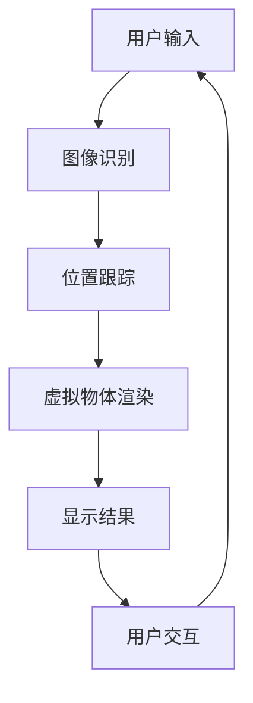

                 

关键词：增强现实、AR、虚拟融合、技术探索、应用场景、算法原理、数学模型、未来展望

> 摘要：本文深入探讨了增强现实（AR）技术的基本概念、发展历程、核心算法原理以及其在各个领域的应用。通过具体实例和数学模型的解析，阐述了AR技术的实现机制，并对其未来发展提出了展望。

## 1. 背景介绍

增强现实（Augmented Reality，简称AR）是一种将虚拟信息与现实世界相结合的技术。它通过计算机生成虚拟物体，并将其投影到现实环境中，从而使用户能够在现实世界中看到增强的景象。这一技术最早可以追溯到20世纪50年代，但直到近年才随着智能手机和平板电脑的普及而迅速发展起来。

AR技术的核心在于实时跟踪和渲染虚拟物体，使其与现实环境准确融合。它不仅能够提供丰富的交互体验，还能够应用于医疗、教育、娱乐、工业制造等多个领域，具有广泛的应用前景。

### 1.1 发展历程

- **20世纪50年代**：AR概念首次被提出，数字视觉集成系统（DVIS）首次实现。
- **1990年代**：增强现实眼镜和头戴式显示器（HMD）开始应用于军事和医疗领域。
- **2000年代**：随着计算机技术的发展，AR技术在消费电子领域逐渐兴起。
- **2010年代**：智能手机和移动设备的普及，使得AR应用进入了大众市场。
- **2020年代**：AR技术逐渐成熟，应用范围不断扩大，成为各行业的重要技术手段。

### 1.2 核心技术

- **图像识别与跟踪**：这是AR技术的核心，通过识别和跟踪现实环境中的特定标志或物体，以确定虚拟物体的位置和角度。
- **实时渲染**：虚拟物体的渲染需要实时更新，以保持与现实环境的同步。
- **用户体验**：优质的用户体验是AR应用成功的关键，包括界面设计、交互方式等。

## 2. 核心概念与联系

### 2.1 增强现实（AR）的基本概念

- **虚拟物体**：通过计算机生成的图像或3D模型。
- **现实环境**：用户所处的外部环境。
- **融合**：虚拟物体与现实环境的无缝结合，使虚拟物体看起来像真实存在的一部分。

### 2.2 核心概念原理与架构

以下是一个简化的增强现实架构Mermaid流程图：



### 2.3 核心技术详解

- **图像识别与跟踪**：通过图像处理和机器学习算法，识别现实环境中的特征，如颜色、形状、纹理等，并跟踪其运动。
- **位置跟踪**：根据图像识别的结果，确定虚拟物体在现实环境中的位置和角度。
- **虚拟物体渲染**：根据位置跟踪的结果，渲染虚拟物体，确保其与现实环境准确融合。
- **显示结果**：将渲染好的虚拟物体显示在用户屏幕上。
- **用户交互**：用户可以通过触摸屏、手势等与虚拟物体进行交互。

## 3. 核心算法原理 & 具体操作步骤

### 3.1 算法原理概述

增强现实技术中的核心算法主要包括图像识别、位置跟踪、虚拟物体渲染等。以下是这些算法的简要原理：

- **图像识别**：使用计算机视觉技术，识别现实环境中的特定特征。
- **位置跟踪**：通过图像识别结果，使用三角测量或其他方法确定虚拟物体的位置和角度。
- **虚拟物体渲染**：根据位置跟踪结果，渲染虚拟物体，确保其与现实环境准确融合。

### 3.2 算法步骤详解

1. **图像识别**：
   - 输入：实时捕获的图像。
   - 处理：使用图像处理算法提取图像特征。
   - 输出：特征向量。

2. **位置跟踪**：
   - 输入：特征向量。
   - 处理：使用机器学习算法（如支持向量机SVM）进行分类和识别。
   - 输出：识别结果（如物体位置和角度）。

3. **虚拟物体渲染**：
   - 输入：识别结果。
   - 处理：根据识别结果，渲染虚拟物体。
   - 输出：渲染结果。

### 3.3 算法优缺点

- **优点**：
  - 高度交互性：用户可以与虚拟物体进行实时交互。
  - 丰富的体验：虚拟物体与现实环境的结合，提供了更加丰富的体验。
  - 广泛的应用：可以应用于多个领域，如医疗、教育、娱乐等。

- **缺点**：
  - 硬件要求较高：需要高性能的处理器和显示器。
  - 算法复杂：图像识别和位置跟踪算法相对复杂，需要大量计算资源。

### 3.4 算法应用领域

- **医疗**：用于手术指导、疾病诊断等。
- **教育**：用于互动教学、虚拟实验室等。
- **娱乐**：用于游戏、影视特效等。
- **工业制造**：用于维修指导、产品展示等。

## 4. 数学模型和公式 & 详细讲解 & 举例说明

### 4.1 数学模型构建

增强现实中的数学模型主要涉及图像处理、计算机视觉和几何学。以下是一个简化的数学模型：

$$
\begin{aligned}
&\text{图像识别：} \\
&f(\textbf{I}, \theta) = \text{识别结果} \\
&\text{位置跟踪：} \\
&\textbf{T}(\textbf{I}, \textbf{V}) = \text{位置向量} \\
&\text{虚拟物体渲染：} \\
&\textbf{R}(\textbf{T}, \textbf{V}) = \text{渲染结果}
\end{aligned}
$$

### 4.2 公式推导过程

- **图像识别**：
  - 输入：实时捕获的图像$\textbf{I}$和模型参数$\theta$。
  - 输出：识别结果$f(\textbf{I}, \theta)$。

- **位置跟踪**：
  - 输入：识别结果$\textbf{V}$和实时捕获的图像$\textbf{I}$。
  - 输出：位置向量$\textbf{T}(\textbf{I}, \textbf{V})$。

- **虚拟物体渲染**：
  - 输入：位置向量$\textbf{T}$和虚拟物体参数$\textbf{V}$。
  - 输出：渲染结果$\textbf{R}(\textbf{T}, \textbf{V})$。

### 4.3 案例分析与讲解

假设我们需要在现实环境中识别一个特定的物体，并实时跟踪其位置。以下是具体的步骤和公式推导：

1. **图像识别**：

   $$f(\textbf{I}, \theta) = \arg\max_{\theta} \sum_{i=1}^{n} \delta(f_i(\textbf{I}; \theta))$$

   其中，$f_i(\textbf{I}; \theta)$表示第$i$个特征向量的函数，$\delta(\cdot)$是狄拉克δ函数。

2. **位置跟踪**：

   $$\textbf{T}(\textbf{I}, \textbf{V}) = \arg\min_{\textbf{T}} \sum_{i=1}^{n} \Vert \textbf{T} - \textbf{V} \Vert^2$$

   其中，$\textbf{V}$是识别出的物体特征向量，$\textbf{T}$是位置向量。

3. **虚拟物体渲染**：

   $$\textbf{R}(\textbf{T}, \textbf{V}) = \text{渲染好的图像}$$

   渲染过程主要涉及三维图形学，这里不详细展开。

## 5. 项目实践：代码实例和详细解释说明

### 5.1 开发环境搭建

为了实现AR应用，我们需要搭建一个开发环境。以下是一个基本的开发环境搭建步骤：

1. 安装Python环境。
2. 安装AR库，如PyAR或ARCore。
3. 安装图像处理库，如OpenCV。
4. 安装三维图形学库，如OpenGL。

### 5.2 源代码详细实现

以下是一个简单的AR应用示例代码：

```python
import cv2
import ar

# 初始化AR库
ar.init()

# 打开摄像头
cap = cv2.VideoCapture(0)

while True:
    # 读取一帧图像
    ret, frame = cap.read()

    # 对图像进行AR处理
    result = ar.process_frame(frame)

    # 显示处理结果
    cv2.imshow('AR Result', result)

    if cv2.waitKey(1) & 0xFF == ord('q'):
        break

# 释放摄像头资源
cap.release()
cv2.destroyAllWindows()
```

### 5.3 代码解读与分析

1. **初始化AR库**：`ar.init()`初始化AR库，为后续处理做准备。
2. **打开摄像头**：`cap = cv2.VideoCapture(0)`打开摄像头，读取实时图像。
3. **读取一帧图像**：`ret, frame = cap.read()`读取一帧图像。
4. **AR处理**：`result = ar.process_frame(frame)`对图像进行AR处理，包括图像识别、位置跟踪和虚拟物体渲染。
5. **显示结果**：`cv2.imshow('AR Result', result)`显示处理结果。
6. **释放资源**：`cap.release()`释放摄像头资源。

## 6. 实际应用场景

### 6.1 医疗领域

在医疗领域，AR技术可以用于手术指导、疾病诊断等。例如，医生可以通过AR眼镜实时查看患者的3D解剖结构，进行精确的手术操作。

### 6.2 教育领域

在教育领域，AR技术可以用于互动教学、虚拟实验室等。学生可以通过AR设备探索历史遗址、进行虚拟实验，增强学习体验。

### 6.3 娱乐领域

在娱乐领域，AR技术可以用于游戏、影视特效等。例如，用户可以通过AR设备体验虚拟现实游戏，观看具有沉浸感的电影。

### 6.4 工业制造领域

在工业制造领域，AR技术可以用于维修指导、产品展示等。例如，工程师可以通过AR眼镜查看设备的3D模型，进行准确的维修操作。

## 7. 工具和资源推荐

### 7.1 学习资源推荐

- 《增强现实技术基础》
- 《计算机视觉基础》
- 《三维图形学》

### 7.2 开发工具推荐

- PyAR：Python增强现实库。
- ARCore：谷歌的AR开发平台。
- ARKit：苹果的AR开发平台。

### 7.3 相关论文推荐

- "Augmented Reality: A Survey"  
- "Image Recognition for Augmented Reality"  
- "Real-Time 3D Object Recognition and Tracking in Augmented Reality"

## 8. 总结：未来发展趋势与挑战

### 8.1 研究成果总结

本文对增强现实技术的基本概念、发展历程、核心算法原理、应用场景等方面进行了详细的阐述。通过数学模型和实际项目实例，展示了AR技术的实现机制和应用价值。

### 8.2 未来发展趋势

- **硬件性能提升**：随着硬件性能的不断提升，AR设备的性能和用户体验将得到显著改善。
- **应用领域拓展**：AR技术将在更多领域得到应用，如智能家居、无人驾驶等。
- **人工智能融合**：AI与AR技术的融合，将进一步提升AR技术的智能化和个性化。

### 8.3 面临的挑战

- **硬件成本**：高性能的AR设备成本较高，限制了其普及速度。
- **算法复杂度**：AR算法的复杂度较高，需要大量计算资源和算法优化。
- **用户体验**：如何在保持高效率的同时，提供优质的用户体验，是AR技术面临的重要挑战。

### 8.4 研究展望

未来，AR技术将在多个领域取得重要突破，为人们的生活和工作带来革命性的变化。通过持续的研究和优化，AR技术将不断突破现有局限，实现更加广泛和深入的应用。

## 9. 附录：常见问题与解答

### 9.1 常见问题

1. **什么是增强现实（AR）？**
2. **增强现实技术有哪些应用领域？**
3. **增强现实技术是如何实现的？**

### 9.2 解答

1. **什么是增强现实（AR）？**
   增强现实（AR）是一种将虚拟信息与现实世界相结合的技术。它通过计算机生成虚拟物体，并将其投影到现实环境中，从而使用户能够在现实世界中看到增强的景象。

2. **增强现实技术有哪些应用领域？**
   增强现实技术可以应用于多个领域，包括医疗、教育、娱乐、工业制造等。例如，在医疗领域，AR技术可以用于手术指导、疾病诊断；在教育领域，可以用于互动教学、虚拟实验室；在娱乐领域，可以用于虚拟现实游戏、影视特效等。

3. **增强现实技术是如何实现的？**
   增强现实技术的实现涉及多个环节，包括图像识别、位置跟踪、虚拟物体渲染等。首先，通过图像识别和跟踪技术，识别和跟踪现实环境中的特征；然后，根据识别结果，渲染虚拟物体，确保其与现实环境准确融合；最后，将渲染好的虚拟物体显示在用户屏幕上，提供增强的视觉效果。

作者：禅与计算机程序设计艺术 / Zen and the Art of Computer Programming
```

