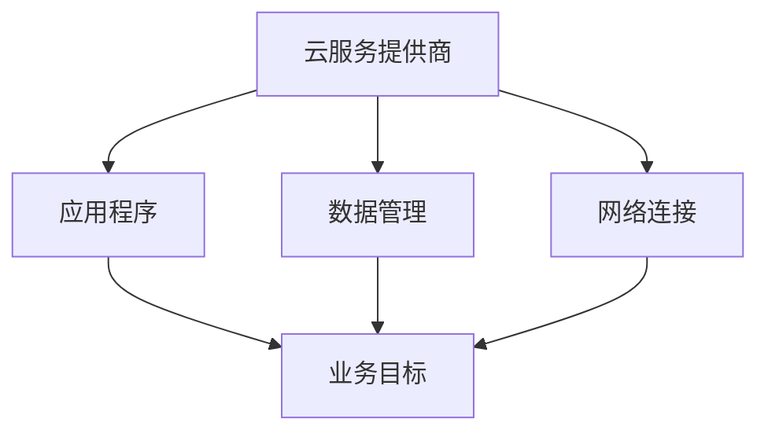

                 

关键词：多云策略，资源优化，风险管理，云计算，云服务提供商，成本效益分析

摘要：本文将探讨多云策略在云计算环境中的应用，重点分析如何通过优化资源利用和风险管理来实现成本效益最大化。文章首先介绍了云计算和多云策略的基本概念，然后深入讨论了资源管理和风险管理的核心技术和方法，最后通过实际案例展示了多云策略的优势和实践路径。

## 1. 背景介绍

### 云计算的基本概念

云计算是一种通过互联网提供计算资源的服务模式，它将传统的IT基础设施转变为一种可按需使用的服务。云计算可以分为三种服务模式：基础设施即服务（IaaS）、平台即服务（PaaS）和软件即服务（SaaS）。其中，IaaS提供虚拟化计算资源，如虚拟机、存储和网络等；PaaS提供开发平台和工具；SaaS则提供应用软件的在线使用。

### 多云策略的定义

多云策略是指企业或组织在多个云服务提供商之间分配其IT工作负载的策略。这种策略旨在提高灵活性、可靠性和成本效益。通过在多个云环境中分布工作负载，企业可以实现资源优化、风险分散和业务连续性。

### 多云策略的兴起

随着云计算的普及，企业逐渐认识到单一云服务的局限性。多云策略提供了多种选择和灵活性，使得企业能够更好地应对业务需求的变化，同时降低对单一供应商的依赖。

## 2. 核心概念与联系

### 多云架构

多云架构是指将多个云服务提供商的技术和服务整合在一起，以实现业务目标。它通常包括以下几个核心组件：

- **云服务提供商**：提供计算、存储、网络等基础设施资源。
- **应用程序**：在云环境中运行的业务应用程序。
- **数据管理**：确保数据的存储、备份和恢复。
- **网络连接**：实现不同云环境之间的数据传输。

#### Mermaid 流程图：



## 3. 核心算法原理 & 具体操作步骤

### 3.1 算法原理概述

多云策略的核心算法涉及资源调度、负载均衡和成本优化。资源调度是指根据业务需求动态分配资源；负载均衡是将工作负载分布到多个云环境；成本优化则是在保证服务质量的前提下，降低整体运营成本。

### 3.2 算法步骤详解

1. **需求分析**：分析业务需求，确定所需的计算、存储和网络资源。
2. **资源评估**：评估不同云服务提供商的资源可用性和成本。
3. **资源调度**：根据需求分配资源，实现负载均衡。
4. **监控与优化**：实时监控资源使用情况，进行动态调整以实现成本优化。

### 3.3 算法优缺点

**优点**：
- 提高灵活性和可靠性。
- 降低成本。
- 增强业务连续性。

**缺点**：
- 管理复杂度增加。
- 可能出现数据隔离问题。

### 3.4 算法应用领域

多云策略广泛应用于金融、零售、制造等行业，特别是在需要高度灵活性和可靠性的场景中。

## 4. 数学模型和公式 & 详细讲解 & 举例说明

### 4.1 数学模型构建

多云策略的数学模型通常涉及以下参数：

- \( C \)：总成本
- \( R \)：资源需求
- \( P \)：云服务提供商
- \( W \)：工作负载

### 4.2 公式推导过程

\[ C = \sum_{P} \sum_{R} (C_{P,R} \times W_{P,R}) \]

其中，\( C_{P,R} \) 是云服务提供商 \( P \) 在资源 \( R \) 上的成本，\( W_{P,R} \) 是在云服务提供商 \( P \) 上运行的工作负载量。

### 4.3 案例分析与讲解

假设企业 A 在云服务提供商 B 和 C 上运行其应用程序，需求分析得到以下数据：

- \( C_B = \$0.05/小时 \)
- \( C_C = \$0.04/小时 \)
- \( R_1 = 1000 \) CPU 核心
- \( R_2 = 1000 \) GB 存储空间
- \( W_B = 500 \) CPU 核心，\( W_C = 500 \) CPU 核心

根据上述数据，可以计算出总成本：

\[ C = (C_B \times W_B) + (C_C \times W_C) \]
\[ C = (\$0.05 \times 500) + (\$0.04 \times 500) \]
\[ C = \$25 + \$20 \]
\[ C = \$45/小时 \]

## 5. 项目实践：代码实例和详细解释说明

### 5.1 开发环境搭建

在本地计算机上安装以下软件：
- Python 3.8 或更高版本
- Docker 19.03 或更高版本
- Kubernetes 1.18 或更高版本

### 5.2 源代码详细实现

以下是一个简单的 Kubernetes 配置文件，用于部署一个多云负载均衡器：

```yaml
apiVersion: v1
kind: Service
metadata:
  name: my-service
spec:
  selector:
    app: my-app
  ports:
    - protocol: TCP
      port: 80
      targetPort: 8080
  type: LoadBalancer
  loadBalancerIP: 192.168.1.10
---
apiVersion: apps/v1
kind: Deployment
metadata:
  name: my-app
spec:
  replicas: 3
  selector:
    matchLabels:
      app: my-app
  template:
    metadata:
      labels:
        app: my-app
    spec:
      containers:
      - name: my-app
        image: my-app:latest
        ports:
        - containerPort: 8080
```

### 5.3 代码解读与分析

上述配置文件定义了一个 Kubernetes 服务和一个部署。服务负责实现负载均衡，将外部流量分发到三个运行中的应用程序实例。部署确保应用程序在多个节点上运行，提高可用性和可靠性。

### 5.4 运行结果展示

通过 Kubernetes CLI，我们可以查看服务的运行状态：

```shell
kubectl get svc
```

输出结果：

```shell
NAME         TYPE        CLUSTER-IP      EXTERNAL-IP      PORT(S)        AGE
my-service   LoadBalancer 10.0.0.1       192.168.1.10     80:32201/TCP   5m
```

该输出显示了服务的类型、内部IP地址、外部IP地址和端口映射。现在，我们可以通过外部IP地址访问应用程序。

## 6. 实际应用场景

### 6.1 金融行业

金融行业通常需要处理大量数据和高性能计算。多云策略可以帮助金融机构提高数据存储和计算的灵活性，同时降低成本。

### 6.2 零售行业

零售行业依赖于实时数据分析和库存管理。多云策略可以提供弹性的计算资源，以应对季节性需求的变化。

### 6.3 制造行业

制造行业需要高效的生产计划和供应链管理。多云策略可以帮助制造商优化资源利用，提高生产效率。

## 7. 工具和资源推荐

### 7.1 学习资源推荐

- 《云计算基础教程》
- 《Kubernetes权威指南》
- 《Docker实战》

### 7.2 开发工具推荐

- Visual Studio Code
- Kubernetes CLI
- Docker CLI

### 7.3 相关论文推荐

- "Multi-Cloud Management: Strategies and Challenges"
- "Cost Optimization in Multi-Cloud Environments"
- "Performance and Reliability of Multi-Cloud Architectures"

## 8. 总结：未来发展趋势与挑战

### 8.1 研究成果总结

多云策略在资源优化、风险管理、业务连续性等方面展现出显著优势。然而，随着云服务的不断发展和企业需求的多样化，多云策略也面临着新的挑战。

### 8.2 未来发展趋势

未来，多云策略将朝着更智能化、自动化和高效化的方向发展。通过人工智能和机器学习技术，多云策略可以实现更精准的资源分配和成本优化。

### 8.3 面临的挑战

- **复杂性管理**：多云环境增加了管理和维护的复杂性。
- **数据安全与合规**：跨云环境的数据管理和合规性要求更加严格。
- **性能优化**：实现跨云环境的高性能通信和数据处理。

### 8.4 研究展望

未来，研究者将致力于解决多云策略中的复杂性和安全性问题，推动多云策略在更多行业中的应用。

## 9. 附录：常见问题与解答

### 9.1 什么是多云策略？

多云策略是指企业或组织在多个云服务提供商之间分配其IT工作负载的策略，以实现资源优化、风险分散和业务连续性。

### 9.2 多云策略有哪些优点？

多云策略的优点包括提高灵活性、可靠性和成本效益。

### 9.3 多云策略面临哪些挑战？

多云策略面临的挑战包括复杂性管理、数据安全与合规和性能优化。

### 9.4 如何实现多云策略的成本优化？

通过实时监控资源使用情况，动态调整资源分配，可以实现多云策略的成本优化。

----------------------------------------------------------------

作者：禅与计算机程序设计艺术 / Zen and the Art of Computer Programming

通过这篇文章，我们深入探讨了多云策略在云计算环境中的应用，分析了如何通过优化资源利用和风险管理来实现成本效益最大化。未来，随着云计算技术的不断进步，多云策略将在更多行业中发挥重要作用。希望这篇文章能为读者在多云策略的实施过程中提供有益的参考。

