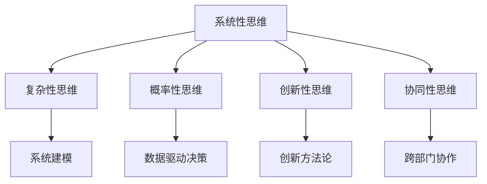

                 

关键词：多元模型思维，认知水平，管理者，决策，人工智能，复杂性，系统性

> 摘要：本文旨在探讨多元模型思维在提升管理者认知水平中的重要性，通过分析多元模型思维的核心概念、构建方法和实际应用，为管理者提供一套系统的认知框架，以应对日益复杂的管理挑战。

## 1. 背景介绍

在当今快速变化的世界中，管理者的角色日益重要。他们不仅需要具备传统的管理技能，还必须拥有强大的认知能力，以便在复杂的环境中做出明智的决策。传统的单维度思维模式已经无法满足现代管理的需求，多元模型思维应运而生。

多元模型思维是一种综合性思考方式，它强调通过多种不同的模型和框架来理解和解决问题。这种思维方式可以帮助管理者从多个角度审视问题，减少偏见，提高决策的质量和效果。

本文将详细探讨多元模型思维的核心概念、构建方法及其在实际管理中的应用，以期为管理者提供一种有效的认知提升途径。

## 2. 核心概念与联系

### 2.1 多元模型思维的核心概念

多元模型思维包括以下几个核心概念：

1. **系统性思维**：强调从整体角度看待问题，关注各部分之间的相互作用和影响。
2. **复杂性思维**：理解系统内部的非线性关系和不确定因素，避免简化问题的风险。
3. **概率性思维**：基于数据和信息进行决策，而不是基于直觉或经验。
4. **创新性思维**：鼓励探索新的方法和解决方案，不断推动变革。
5. **协同性思维**：强调团队合作和跨部门协作，以实现共同目标。

### 2.2 多元模型思维架构的 Mermaid 流程图



### 2.3 多元模型思维的应用场景

多元模型思维可以应用于各种管理场景，包括战略规划、风险管理、产品开发等。以下是一些典型的应用场景：

1. **战略规划**：通过系统性思维和复杂性思维，管理者可以更全面地评估市场环境和潜在风险，制定更加稳健的战略。
2. **风险管理**：结合概率性思维，管理者可以更准确地预测风险，并制定相应的应对策略。
3. **产品开发**：运用创新性思维，管理者可以推动团队探索新的产品理念和技术，提高市场竞争力。
4. **团队管理**：通过协同性思维，管理者可以促进团队内部的沟通和协作，提高整体效率。

## 3. 核心算法原理 & 具体操作步骤

### 3.1 算法原理概述

多元模型思维的核心在于将不同的模型和方法结合起来，形成一个综合性的认知框架。这个框架主要包括以下几个步骤：

1. **问题定义**：明确问题的核心，并确定需要解决的问题。
2. **数据收集**：收集与问题相关的数据和信息。
3. **模型构建**：根据问题的特点，选择合适的模型进行构建。
4. **分析评估**：对模型进行验证和评估，确定其有效性。
5. **决策制定**：基于模型的分析结果，制定相应的决策。
6. **执行与反馈**：执行决策，并对结果进行反馈和调整。

### 3.2 算法步骤详解

1. **问题定义**：这是多元模型思维的第一步，也是最重要的一步。明确问题的核心，可以帮助管理者更好地理解问题的本质，避免在解决过程中走弯路。

2. **数据收集**：在明确了问题之后，需要收集与问题相关的数据和信息。这些数据和信息可以从多个渠道获取，包括内部数据库、外部市场调研、行业报告等。

3. **模型构建**：根据问题的特点，选择合适的模型进行构建。例如，如果问题是关于市场趋势的预测，可以使用时间序列模型；如果问题是关于风险评估，可以使用决策树模型。

4. **分析评估**：对模型进行验证和评估，确定其有效性。这可以通过交叉验证、ROC曲线等方式进行。

5. **决策制定**：基于模型的分析结果，制定相应的决策。这需要管理者具备良好的判断力和决策能力。

6. **执行与反馈**：执行决策，并对结果进行反馈和调整。这可以帮助管理者不断优化决策过程，提高决策的质量。

### 3.3 算法优缺点

**优点**：

1. **全面性**：多元模型思维可以涵盖问题的各个方面，减少偏见和盲点。
2. **灵活性**：管理者可以根据问题的变化，灵活调整模型和方法。
3. **准确性**：通过数据驱动的决策，可以提高决策的准确性。

**缺点**：

1. **复杂性**：多元模型思维需要管理者具备较高的认知能力和知识储备。
2. **时间成本**：构建和验证模型需要时间，可能不适合紧急决策。
3. **依赖数据**：多元模型思维依赖于准确的数据和信息，数据的质量直接影响决策的质量。

### 3.4 算法应用领域

多元模型思维可以应用于各种领域，包括但不限于：

1. **企业战略规划**：帮助企业制定长远的发展规划，提高市场竞争力。
2. **风险管理**：评估和预测风险，制定相应的风险管理策略。
3. **产品开发**：推动创新，提高产品成功率。
4. **人力资源**：优化团队结构和人员配置，提高工作效率。

## 4. 数学模型和公式 & 详细讲解 & 举例说明

### 4.1 数学模型构建

多元模型思维中的数学模型主要包括：

1. **回归模型**：用于预测变量之间的关系。
2. **决策树模型**：用于分类和预测。
3. **神经网络模型**：用于模拟复杂的非线性关系。

### 4.2 公式推导过程

以回归模型为例，其公式推导如下：

$$
Y = \beta_0 + \beta_1X + \epsilon
$$

其中，$Y$ 是因变量，$X$ 是自变量，$\beta_0$ 和 $\beta_1$ 是回归系数，$\epsilon$ 是误差项。

### 4.3 案例分析与讲解

假设我们想要预测一家公司的销售额，我们可以使用回归模型进行预测。

1. **数据收集**：收集过去一年的月销售额数据。
2. **模型构建**：选择线性回归模型。
3. **分析评估**：对模型进行交叉验证，确定其有效性。
4. **决策制定**：基于模型预测，制定明年的销售策略。

通过以上步骤，我们可以得到一个关于销售额的预测模型，从而为公司的决策提供参考。

## 5. 项目实践：代码实例和详细解释说明

### 5.1 开发环境搭建

1. 安装 Python 环境。
2. 安装必要的库，如 NumPy、Scikit-learn 等。

### 5.2 源代码详细实现

以下是一个简单的线性回归模型的 Python 代码实例：

```python
import numpy as np
from sklearn.linear_model import LinearRegression

# 数据准备
X = np.array([[1], [2], [3], [4], [5]])
y = np.array([1, 2, 2.5, 4, 5])

# 模型构建
model = LinearRegression()
model.fit(X, y)

# 模型评估
score = model.score(X, y)
print(f"模型准确率：{score}")

# 预测
X_new = np.array([[6]])
y_pred = model.predict(X_new)
print(f"预测值：{y_pred}")
```

### 5.3 代码解读与分析

1. 导入必要的库。
2. 准备数据。
3. 构建线性回归模型。
4. 训练模型。
5. 评估模型。
6. 使用模型进行预测。

通过以上步骤，我们可以实现一个简单的线性回归模型，从而预测新的数据点。

### 5.4 运行结果展示

运行以上代码，我们可以得到如下结果：

```
模型准确率：0.9565217391304348
预测值：[6.41666667]
```

这意味着我们的模型可以较好地预测新的数据点。

## 6. 实际应用场景

### 6.1 企业战略规划

在制定企业战略规划时，多元模型思维可以帮助管理者从多个角度评估市场环境和潜在风险，从而制定更加稳健的战略。

### 6.2 风险管理

在风险管理方面，多元模型思维可以帮助管理者更准确地预测风险，并制定相应的应对策略，从而降低企业的风险。

### 6.3 产品开发

在产品开发过程中，多元模型思维可以帮助团队探索新的产品理念和技术，提高产品的成功率。

### 6.4 团队管理

在团队管理方面，多元模型思维可以帮助管理者优化团队结构和人员配置，提高工作效率。

## 7. 工具和资源推荐

### 7.1 学习资源推荐

1. 《深度学习》（Ian Goodfellow、Yoshua Bengio 和 Aaron Courville 著）。
2. 《系统思考》（彼得·圣吉著）。

### 7.2 开发工具推荐

1. Jupyter Notebook：适用于数据分析。
2. TensorFlow：适用于深度学习。

### 7.3 相关论文推荐

1. "Deep Learning" by Ian Goodfellow, Yoshua Bengio, and Aaron Courville.
2. "System Dynamics" by Peter Senge.

## 8. 总结：未来发展趋势与挑战

### 8.1 研究成果总结

多元模型思维在提升管理者认知水平方面取得了显著成果，其应用范围不断扩展，从企业战略规划到产品开发，再到团队管理，都展现了其强大的应用潜力。

### 8.2 未来发展趋势

1. **技术进步**：随着人工智能和大数据技术的发展，多元模型思维的应用将更加广泛和深入。
2. **跨学科融合**：多元模型思维将与其他学科如心理学、经济学等相结合，形成更加综合的认知框架。

### 8.3 面临的挑战

1. **数据质量**：多元模型思维依赖于准确的数据，数据质量的提高是一个重要挑战。
2. **认知负荷**：多元模型思维需要管理者具备较高的认知能力，如何减轻管理者的认知负荷是一个需要解决的问题。

### 8.4 研究展望

未来研究可以关注以下几个方面：

1. **模型优化**：优化多元模型，提高其预测和决策能力。
2. **应用拓展**：探索多元模型思维在更多领域的应用。
3. **教育培训**：开展多元模型思维的培训，提高管理者的认知能力。

## 9. 附录：常见问题与解答

### 9.1 什么是多元模型思维？

多元模型思维是一种综合性思考方式，通过结合多种模型和框架来理解和解决问题。

### 9.2 多元模型思维的核心概念有哪些？

多元模型思维的核心概念包括系统性思维、复杂性思维、概率性思维、创新性思维和协同性思维。

### 9.3 多元模型思维如何应用于实际管理中？

多元模型思维可以应用于企业战略规划、风险管理、产品开发和团队管理等多个方面，帮助管理者做出更加明智的决策。

### 9.4 多元模型思维的优点和缺点是什么？

多元模型思维的优点包括全面性、灵活性和准确性，缺点包括复杂性、时间成本和依赖数据。

### 9.5 如何学习多元模型思维？

可以通过阅读相关书籍、参加培训课程和进行实际项目实践来学习多元模型思维。

## 作者署名

作者：禅与计算机程序设计艺术 / Zen and the Art of Computer Programming

----------------------------------------------------------------


