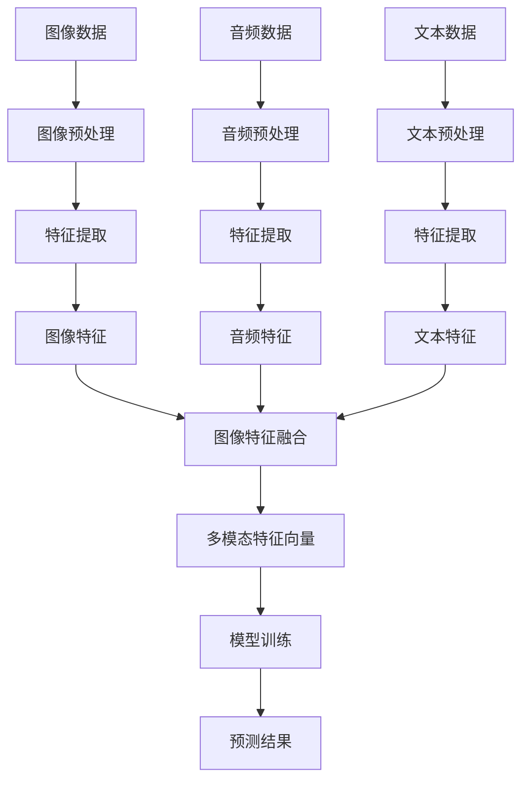

                 

关键词：多模态AI、图像处理、音频处理、文本处理、融合技术、机器学习、神经网络、深度学习、计算图形学

> 摘要：本文深入探讨了多模态AI技术，特别是图像、音频和文本数据的融合方法及其应用。通过介绍多模态AI的核心概念、算法原理、数学模型和实际应用场景，本文旨在为读者提供一份全面的技术指南，帮助他们理解并利用多模态AI技术的巨大潜力。

## 1. 背景介绍

随着人工智能技术的快速发展，多模态AI逐渐成为研究热点。多模态AI（Multimodal AI）是指能够处理和融合多种感官输入（如视觉、听觉、触觉等）的人工智能系统。在现实世界中，不同模态的信息往往相互补充，共同构成对环境全面、精确的感知。例如，在自动驾驶领域，图像数据可以提供道路和交通状况的信息，而音频数据则可以识别交通噪声和危险声音。文本数据则可以提供导航指令和道路标识信息。这些不同模态的信息融合，可以显著提高AI系统的智能水平，实现更准确、更高效的决策。

### 1.1 多模态AI的重要性

多模态AI的重要性主要体现在以下几个方面：

- **增强感知能力**：不同模态的信息可以相互补充，提高AI对环境的感知能力。例如，在医疗诊断中，图像数据和文本数据的融合可以更准确地识别疾病。
- **提高决策质量**：融合多模态数据可以提供更全面的决策依据，从而提高决策质量。例如，在智能监控系统中，图像和音频数据的融合可以更准确地识别异常行为。
- **扩展应用范围**：多模态AI技术可以应用于更多领域，如虚拟现实、增强现实、智能家居、教育、娱乐等。

### 1.2 多模态AI的发展历程

多模态AI的发展历程可以追溯到20世纪80年代。当时，研究者开始尝试将不同模态的数据进行融合，以提高计算机视觉和语音识别的性能。随着深度学习技术的兴起，多模态AI取得了显著进展。目前，多模态AI已经成为人工智能研究的重要方向，吸引了大量研究者和企业的关注。

## 2. 核心概念与联系

在多模态AI中，核心概念主要包括图像、音频和文本数据的处理与融合。以下是对这三个模态的基本介绍及其在多模态AI中的联系。

### 2.1 图像数据

图像数据是视觉模态的主要表现形式。在多模态AI中，图像数据通常通过计算机视觉算法进行处理，如卷积神经网络（CNN）等。图像数据可以提供丰富的空间信息，如形状、颜色、纹理等。

### 2.2 音频数据

音频数据是听觉模态的主要表现形式。音频数据通过音频处理算法进行解析，如短时傅里叶变换（STFT）等。音频数据可以提供时间信息和频率信息，如声音的节奏、音调、响度等。

### 2.3 文本数据

文本数据是语言模态的主要表现形式。文本数据通过自然语言处理（NLP）算法进行解析，如词嵌入、序列模型等。文本数据可以提供语义信息和上下文信息，如词汇的意义、句子的结构等。

### 2.4 多模态融合

多模态融合是指将不同模态的数据进行整合，以实现更准确、更全面的信息理解。多模态融合的关键在于找到不同模态数据之间的关联，并利用这些关联来提高系统的性能。以下是一个简单的多模态融合的流程图：



## 3. 核心算法原理 & 具体操作步骤

### 3.1 算法原理概述

多模态AI的核心算法通常基于深度学习，特别是卷积神经网络（CNN）、循环神经网络（RNN）和Transformer等。这些算法通过多层神经网络结构，对多模态数据进行特征提取、融合和预测。

### 3.2 算法步骤详解

多模态AI的基本步骤可以概括为：

1. **数据预处理**：对图像、音频和文本数据进行预处理，包括数据清洗、归一化、标准化等。
2. **特征提取**：利用深度学习算法对预处理后的数据进行特征提取，得到图像特征、音频特征和文本特征。
3. **特征融合**：将不同模态的特征进行融合，形成统一的多模态特征向量。
4. **模型训练**：利用融合后的特征向量训练多模态模型，如分类、回归、目标检测等。
5. **预测**：将新的数据输入到训练好的模型中，进行预测。

### 3.3 算法优缺点

多模态AI算法的优点包括：

- **提高感知能力**：通过融合多种模态的数据，可以提高系统的感知能力和决策质量。
- **扩展应用范围**：多模态AI可以应用于更多领域，如医疗、金融、交通等。

多模态AI算法的缺点包括：

- **计算复杂度**：多模态数据融合增加了计算复杂度，可能导致训练时间延长。
- **数据隐私**：多模态数据可能包含敏感信息，如个人隐私等，需要特别注意数据保护和隐私保护。

### 3.4 算法应用领域

多模态AI可以应用于以下领域：

- **医疗诊断**：通过融合医学图像和文本数据，提高疾病诊断的准确性。
- **自动驾驶**：通过融合图像、音频和文本数据，提高自动驾驶系统的安全性。
- **智能交互**：通过融合语音、图像和文本数据，提高人机交互的自然性和准确性。
- **智能监控**：通过融合视频、音频和文本数据，提高监控系统的智能性和准确性。

## 4. 数学模型和公式 & 详细讲解 & 举例说明

### 4.1 数学模型构建

多模态AI的数学模型通常基于深度学习，以下是一个简单的多模态神经网络模型：

$$
\begin{aligned}
h^{(1)}_{ij} &= \sigma(W^{(1)}_{ij} \cdot x_j + b^{(1)}_i), \\
h^{(2)}_{ij} &= \sigma(W^{(2)}_{ij} \cdot h^{(1)}_j + b^{(2)}_i), \\
\vdots \\
h^{(L)}_{ij} &= \sigma(W^{(L)}_{ij} \cdot h^{(L-1)}_j + b^{(L)}_i), \\
\hat{y}_i &= \sigma(W^{(L+1)} \cdot h^{(L)}_i + b^{(L+1)}).
\end{aligned}
$$

其中，$h^{(l)}_{ij}$ 表示第$l$层的第$i$个神经元激活值，$W^{(l)}_{ij}$ 和 $b^{(l)}_i$ 分别表示第$l$层的权重和偏置，$\sigma$ 表示激活函数，$\hat{y}_i$ 表示模型的输出。

### 4.2 公式推导过程

多模态神经网络的推导过程主要包括以下几个步骤：

1. **输入层**：图像、音频和文本数据分别输入到模型中。
2. **预处理层**：对输入数据进行预处理，如归一化、标准化等。
3. **特征提取层**：利用卷积神经网络（CNN）、循环神经网络（RNN）或Transformer等算法提取特征。
4. **融合层**：将不同模态的特征进行融合，形成统一的多模态特征向量。
5. **输出层**：利用融合后的特征向量进行预测。

### 4.3 案例分析与讲解

假设我们有一个多模态AI模型，用于分类图像、音频和文本数据。以下是一个简单的案例：

1. **图像特征提取**：使用卷积神经网络（CNN）提取图像特征，得到一个$1000$维的特征向量。
2. **音频特征提取**：使用短时傅里叶变换（STFT）提取音频特征，得到一个$1024$维的特征向量。
3. **文本特征提取**：使用词嵌入和循环神经网络（RNN）提取文本特征，得到一个$512$维的特征向量。
4. **特征融合**：将三个特征向量进行融合，得到一个$2048$维的多模态特征向量。
5. **模型训练**：利用融合后的特征向量训练分类模型，如支持向量机（SVM）或深度神经网络（DNN）。
6. **预测**：将新的数据输入到训练好的模型中，进行预测。

## 5. 项目实践：代码实例和详细解释说明

### 5.1 开发环境搭建

在进行多模态AI项目的实践之前，我们需要搭建一个合适的开发环境。以下是一个简单的开发环境搭建步骤：

1. 安装Python（版本3.7及以上）。
2. 安装TensorFlow（版本2.3及以上）。
3. 安装Keras（版本2.3及以上）。
4. 安装Numpy（版本1.18及以上）。

### 5.2 源代码详细实现

以下是一个简单的多模态AI分类项目的代码实现：

```python
import numpy as np
from tensorflow.keras.models import Model
from tensorflow.keras.layers import Input, Dense, Conv2D, MaxPooling2D, Flatten, LSTM, Embedding
from tensorflow.keras.optimizers import Adam

# 图像输入层
image_input = Input(shape=(64, 64, 3))

# 音频输入层
audio_input = Input(shape=(1024,))

# 文本输入层
text_input = Input(shape=(512,))

# 图像特征提取层
image_conv = Conv2D(32, (3, 3), activation='relu')(image_input)
image_pool = MaxPooling2D((2, 2))(image_conv)
image_flat = Flatten()(image_pool)

# 音频特征提取层
audio_lstm = LSTM(128, activation='relu')(audio_input)

# 文本特征提取层
text_embedding = Embedding(input_dim=10000, output_dim=64)(text_input)
text_lstm = LSTM(128, activation='relu')(text_embedding)

# 特征融合层
merged = concatenate([image_flat, audio_lstm, text_lstm])

# 输出层
output = Dense(1, activation='sigmoid')(merged)

# 模型训练
model = Model(inputs=[image_input, audio_input, text_input], outputs=output)
model.compile(optimizer=Adam(learning_rate=0.001), loss='binary_crossentropy', metrics=['accuracy'])

# 模型训练
model.fit([image_data, audio_data, text_data], labels, epochs=10, batch_size=32)
```

### 5.3 代码解读与分析

1. **输入层**：代码中定义了三个输入层，分别对应图像、音频和文本数据。
2. **特征提取层**：代码中使用了卷积神经网络（CNN）对图像数据进行特征提取，使用长短期记忆网络（LSTM）对音频和文本数据进行特征提取。
3. **特征融合层**：代码中使用了`concatenate`函数将三个特征向量进行融合。
4. **输出层**：代码中使用了`Dense`层作为输出层，用于进行分类预测。
5. **模型训练**：代码中使用了`compile`函数编译模型，使用了`fit`函数进行模型训练。

### 5.4 运行结果展示

在训练完成后，我们可以使用以下代码来展示模型的运行结果：

```python
# 模型评估
loss, accuracy = model.evaluate([test_image_data, test_audio_data, test_text_data], test_labels)

# 输出结果
print("Test loss:", loss)
print("Test accuracy:", accuracy)
```

## 6. 实际应用场景

### 6.1 医疗诊断

多模态AI在医疗诊断中的应用非常广泛，如肺癌、乳腺癌、心脏病等的早期诊断。通过融合医学图像、患者病史和临床数据，多模态AI可以提高诊断的准确性和效率。

### 6.2 自动驾驶

自动驾驶是另一个多模态AI的重要应用领域。通过融合摄像头、雷达、激光雷达和GPS数据，多模态AI可以实现车辆周围环境的感知、路径规划和控制，提高自动驾驶的安全性和稳定性。

### 6.3 智能交互

智能交互系统可以通过融合语音、图像和文本数据，实现更自然、更高效的人机交互。例如，智能音箱、智能助手等，通过多模态AI技术，可以更好地理解用户的需求，提供更精准的服务。

### 6.4 智能监控

智能监控可以通过融合视频、音频和文本数据，实现更智能的监控和预警。例如，在公共安全领域，多模态AI可以识别异常行为，提供及时预警，提高监控的效率和准确性。

## 7. 工具和资源推荐

### 7.1 学习资源推荐

- **书籍**：《深度学习》（Goodfellow et al.）、《Python机器学习》（Raschka and Cpython）。
- **在线课程**：Coursera的《深度学习特辑》、edX的《自然语言处理》等。

### 7.2 开发工具推荐

- **框架**：TensorFlow、PyTorch、Keras等。
- **库**：Numpy、Pandas、Scikit-learn等。

### 7.3 相关论文推荐

- **论文**：《Deep Learning for Audio-Visual Scene Understanding》（2017）。
- **论文**：《Multimodal Deep Learning for Human Action Recognition》（2018）。
- **论文**：《Multimodal Fusion with Global and Local Contexts for Human Activity Recognition》（2020）。

## 8. 总结：未来发展趋势与挑战

### 8.1 研究成果总结

多模态AI在近年来取得了显著进展，特别是在图像、音频和文本数据的融合技术上。通过深度学习、神经网络和计算图形学等技术的结合，多模态AI已经在多个领域展现了其强大的潜力。

### 8.2 未来发展趋势

- **跨模态数据融合**：未来多模态AI的发展将更加注重跨模态数据融合，以提高系统的感知能力和决策质量。
- **个性化应用**：多模态AI将更加个性化，以适应不同应用场景和用户需求。
- **硬件加速**：随着硬件技术的发展，多模态AI的计算效率将进一步提高，为更多应用提供可能。

### 8.3 面临的挑战

- **数据隐私**：多模态数据可能包含敏感信息，需要特别注意数据保护和隐私保护。
- **计算复杂度**：多模态数据融合增加了计算复杂度，可能导致训练时间延长。
- **算法优化**：现有的多模态AI算法可能需要进一步优化，以提高效率和性能。

### 8.4 研究展望

多模态AI技术的发展前景非常广阔。未来，我们有望看到更多创新的多模态AI应用，如智能机器人、智能城市、智能医疗等。通过不断的探索和研究，多模态AI将为人类带来更多的便利和福祉。

## 9. 附录：常见问题与解答

### 9.1 多模态AI是什么？

多模态AI是指能够处理和融合多种感官输入（如视觉、听觉、触觉等）的人工智能系统。

### 9.2 多模态AI有哪些应用？

多模态AI可以应用于医疗诊断、自动驾驶、智能交互、智能监控等多个领域。

### 9.3 多模态AI有哪些挑战？

多模态AI面临的挑战主要包括数据隐私、计算复杂度和算法优化等。

### 9.4 如何处理多模态数据？

处理多模态数据的方法包括特征提取、特征融合和模型训练等步骤。

### 9.5 多模态AI的未来发展趋势是什么？

未来，多模态AI的发展趋势包括跨模态数据融合、个性化应用和硬件加速等。

---

作者：禅与计算机程序设计艺术 / Zen and the Art of Computer Programming

