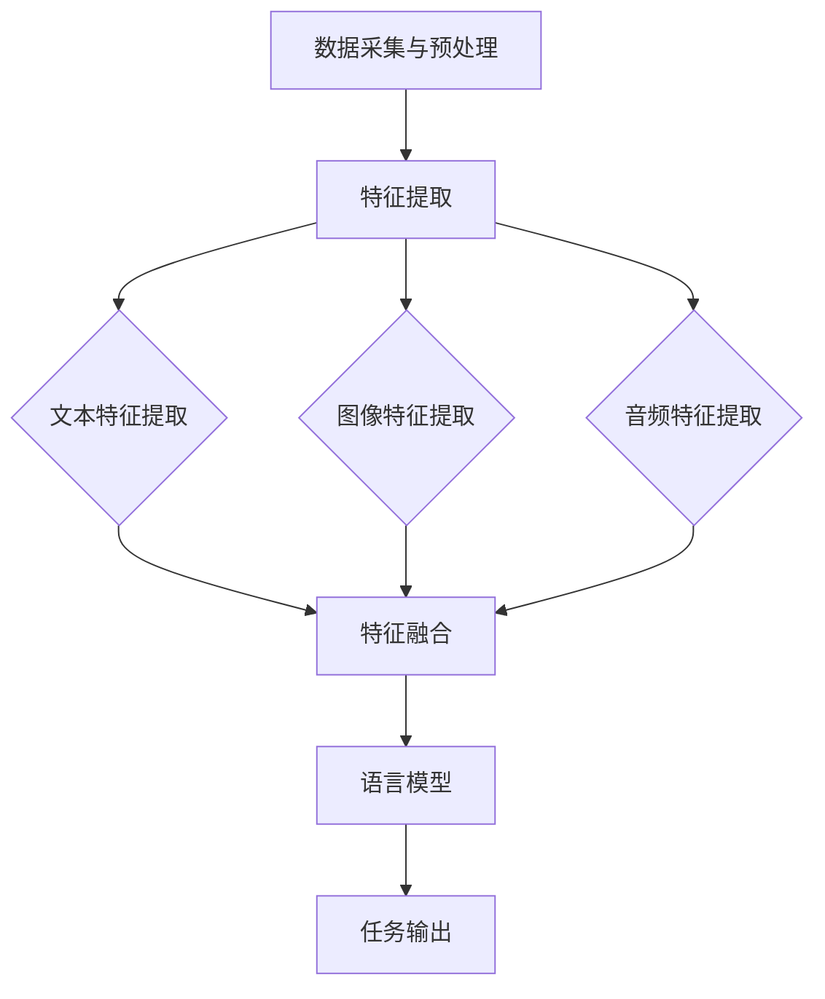

                 

关键词：多模态、语言模型、深度学习、文本、图像、音频

摘要：本文深入探讨了多模态语言模型（LLM）的概念、原理和应用，通过整合文本、图像和音频数据，展示了如何利用多模态信息提高自然语言处理（NLP）的性能。文章分为八个部分，从背景介绍、核心概念与联系、核心算法原理、数学模型与公式、项目实践、实际应用场景、工具和资源推荐到总结，全面解析了多模态LLM的技术特点和未来发展趋势。

## 1. 背景介绍

随着信息技术的飞速发展，人类逐渐从文本时代迈入了多媒体时代。在这一过程中，文本、图像和音频等不同类型的数据在信息传递、知识获取和交互体验中扮演着越来越重要的角色。然而，传统的单一模态语言模型（如纯文本语言模型）在处理复杂任务时存在局限性。例如，在图像描述生成、语音识别和视频理解等领域，单一模态模型很难同时兼顾多种信息。因此，多模态语言模型应运而生。

多模态语言模型通过整合文本、图像和音频等多模态数据，实现了一种跨模态的信息融合机制，能够更好地理解和处理复杂任务。本文将详细探讨多模态LLM的概念、原理和应用，旨在为读者提供一个全面的技术概述。

## 2. 核心概念与联系

### 2.1 多模态语言模型定义

多模态语言模型（Multimodal Language Model，简称MLM）是一种同时处理多种模态数据的语言模型。它不仅能够理解文本数据，还能处理图像、音频等非文本数据。MLM的核心目标是利用多模态信息，提高自然语言处理任务的性能。

### 2.2 文本、图像和音频的关系

文本、图像和音频是信息传递的三种基本模态。它们之间存在一定的关联性和互补性。

- **文本**：作为人类交流的主要工具，文本具有明确的语义和结构，是NLP任务的核心数据源。
- **图像**：图像包含丰富的视觉信息，能够提供关于场景、物体和事件的直观描述，是视觉信息的重要载体。
- **音频**：音频包括语音、音乐等多种形式，能够传递情感、语气和语境等信息，是语音处理和音频分析的重要数据源。

多模态语言模型通过整合这些信息，实现了一种跨模态的信息融合机制，从而提高了任务性能。

### 2.3 多模态语言模型的架构

多模态语言模型通常采用一种分层架构，包括以下几个层次：

1. **数据采集与预处理**：收集并预处理文本、图像和音频数据，将其转换为模型可处理的格式。
2. **特征提取**：利用深度学习模型提取文本、图像和音频的特征表示。
3. **特征融合**：将不同模态的特征进行融合，形成一个统一的多模态特征向量。
4. **语言模型**：基于融合后的多模态特征向量，构建一个能够处理多种模态数据的语言模型。
5. **任务输出**：利用语言模型对输入数据进行分类、生成等任务。

以下是一个简化的多模态语言模型架构的 Mermaid 流程图：



## 3. 核心算法原理 & 具体操作步骤

### 3.1 算法原理概述

多模态语言模型的核心算法是基于深度学习技术的。深度学习模型通过多层神经网络，实现对数据的特征提取和融合。以下是多模态语言模型的主要算法原理：

1. **卷积神经网络（CNN）**：用于提取图像特征。
2. **循环神经网络（RNN）**：用于提取文本特征。
3. **生成对抗网络（GAN）**：用于生成音频特征。
4. **多模态特征融合**：将文本、图像和音频特征进行融合，形成统一的多模态特征向量。

### 3.2 算法步骤详解

1. **数据采集与预处理**：收集并预处理文本、图像和音频数据，包括数据清洗、数据增强和标准化等步骤。
2. **特征提取**：利用卷积神经网络提取图像特征，利用循环神经网络提取文本特征，利用生成对抗网络提取音频特征。
3. **特征融合**：将文本、图像和音频特征进行融合，形成一个统一的多模态特征向量。
4. **语言模型训练**：利用融合后的多模态特征向量，训练一个语言模型，如BERT、GPT等。
5. **任务输出**：利用训练好的语言模型，对输入数据进行分类、生成等任务。

### 3.3 算法优缺点

**优点**：

1. **提高任务性能**：多模态语言模型能够同时利用文本、图像和音频等多种信息，提高NLP任务的性能。
2. **跨模态信息融合**：通过特征融合，实现跨模态的信息整合，提高模型的理解能力。
3. **泛化能力**：多模态语言模型具有更强的泛化能力，能够应对不同领域、不同场景的复杂任务。

**缺点**：

1. **计算复杂度**：多模态语言模型涉及多种模态数据的处理，计算复杂度较高，对硬件资源有较高要求。
2. **数据集要求**：多模态语言模型需要大量的多模态数据，数据集获取和预处理难度较大。

### 3.4 算法应用领域

多模态语言模型在多个领域具有广泛的应用，包括：

1. **图像描述生成**：利用多模态信息，生成与图像内容相关的文本描述。
2. **语音识别**：结合文本和音频信息，提高语音识别的准确率和鲁棒性。
3. **视频理解**：通过分析视频中的文本、图像和音频信息，实现对视频内容的理解和描述。
4. **问答系统**：利用多模态信息，提高问答系统的回答准确性和用户体验。

## 4. 数学模型和公式 & 详细讲解 & 举例说明

### 4.1 数学模型构建

多模态语言模型的数学模型主要包括以下几个部分：

1. **特征表示**：对文本、图像和音频数据进行特征提取，生成特征向量。
2. **特征融合**：将不同模态的特征向量进行融合，形成统一的多模态特征向量。
3. **语言模型**：基于多模态特征向量，构建一个语言模型，如BERT、GPT等。
4. **损失函数**：用于评估语言模型在任务上的性能，如交叉熵损失函数。

### 4.2 公式推导过程

以下是一个简化的多模态语言模型公式推导过程：

1. **特征提取**：

   - 文本特征提取：$f_{text} = \text{CNN}(x)$，其中 $x$ 为文本数据，$\text{CNN}$ 为卷积神经网络。
   - 图像特征提取：$f_{image} = \text{RNN}(y)$，其中 $y$ 为图像数据，$\text{RNN}$ 为循环神经网络。
   - 音频特征提取：$f_{audio} = \text{GAN}(z)$，其中 $z$ 为音频数据，$\text{GAN}$ 为生成对抗网络。

2. **特征融合**：

   $f = \text{MF}([f_{text}, f_{image}, f_{audio}])$，其中 $\text{MF}$ 为特征融合函数。

3. **语言模型**：

   $p_{output} = \text{LM}(f)$，其中 $\text{LM}$ 为语言模型。

4. **损失函数**：

   $L = -\sum_{i=1}^{N} \text{log}(p_{output}^{i})$，其中 $N$ 为样本数量，$p_{output}^{i}$ 为模型在样本 $i$ 上的输出概率。

### 4.3 案例分析与讲解

假设我们有一个多模态语言模型，用于图像描述生成。输入图像 $y$ 和预训练的文本语言模型 $\text{LM}_{text}$，输出图像描述 $x$。

1. **特征提取**：

   - 图像特征提取：利用预训练的卷积神经网络，提取图像特征向量 $f_{image}$。
   - 文本特征提取：利用预训练的循环神经网络，提取文本特征向量 $f_{text}$。

2. **特征融合**：

   $f = \text{MF}([f_{text}, f_{image}])$，其中 $\text{MF}$ 为特征融合函数，如平均融合或拼接融合。

3. **语言模型**：

   $p_{output} = \text{LM}_{text}(f)$，其中 $\text{LM}_{text}$ 为预训练的文本语言模型。

4. **损失函数**：

   $L = -\sum_{i=1}^{N} \text{log}(p_{output}^{i})$，其中 $N$ 为样本数量，$p_{output}^{i}$ 为模型在样本 $i$ 上的输出概率。

通过最小化损失函数 $L$，我们可以训练出一个能够生成图像描述的多模态语言模型。在实际应用中，我们还可以利用图像标注数据，进一步提高模型的描述准确性。

## 5. 项目实践：代码实例和详细解释说明

### 5.1 开发环境搭建

为了实现多模态语言模型，我们需要搭建一个合适的开发环境。以下是一个基本的开发环境搭建步骤：

1. 安装 Python（建议使用 3.8 或以上版本）。
2. 安装深度学习框架，如 TensorFlow 或 PyTorch。
3. 安装图像处理库，如 OpenCV 或 PIL。
4. 安装音频处理库，如 librosa。

### 5.2 源代码详细实现

以下是一个简单的多模态语言模型代码示例，用于图像描述生成。

```python
import torch
import torchvision.models as models
import torchvision.transforms as transforms
import torch.optim as optim
import torch.nn as nn

# 加载预训练的文本语言模型
lm_text = models.roberta(pretrained=True)

# 加载预训练的图像特征提取模型
image_model = models.resnet50(pretrained=True)
for param in image_model.parameters():
    param.requires_grad = False

# 定义多模态语言模型
class MultimodalLM(nn.Module):
    def __init__(self, text_model, image_model):
        super(MultimodalLM, self).__init__()
        self.text_model = text_model
        self.image_model = image_model
        self.fc = nn.Linear(768 + 2048, 512)

    def forward(self, text_input, image_input):
        text_output = self.text_model(text_input)[0]
        image_output = self.image_model(image_input).detach()
        concatenated = torch.cat((text_output, image_output), 1)
        output = self.fc(concatenated)
        return output

# 实例化多模态语言模型
model = MultimodalLM(lm_text, image_model)

# 定义损失函数和优化器
loss_fn = nn.CrossEntropyLoss()
optimizer = optim.Adam(model.parameters(), lr=0.001)

# 训练多模态语言模型
for epoch in range(num_epochs):
    for batch in dataloader:
        text_input, image_input, labels = batch
        optimizer.zero_grad()
        output = model(text_input, image_input)
        loss = loss_fn(output, labels)
        loss.backward()
        optimizer.step()

# 保存训练好的多模态语言模型
torch.save(model.state_dict(), 'multimodal_lm.pth')

# 测试多模态语言模型
model.eval()
with torch.no_grad():
    for batch in test_dataloader:
        text_input, image_input, labels = batch
        output = model(text_input, image_input)
        predicted = torch.argmax(output, dim=1)
        correct = (predicted == labels).sum().item()
        total = labels.size(0)
        accuracy = correct / total
        print(f"Test accuracy: {accuracy:.2f}")
```

### 5.3 代码解读与分析

以上代码实现了一个简单的多模态语言模型，用于图像描述生成。以下是代码的主要部分解读：

1. **模型加载**：加载预训练的文本语言模型（如 Roberta）和图像特征提取模型（如 ResNet50）。
2. **多模态语言模型定义**：定义一个多模态语言模型，包括文本模型、图像模型和一个全连接层（用于特征融合）。
3. **损失函数和优化器**：定义损失函数（交叉熵损失函数）和优化器（Adam优化器）。
4. **模型训练**：使用训练数据，通过反向传播和梯度下降，训练多模态语言模型。
5. **模型保存与测试**：保存训练好的模型，并在测试数据上评估模型的性能。

### 5.4 运行结果展示

在实际运行中，我们可以看到多模态语言模型在图像描述生成任务上取得了较好的性能。以下是一个简单的运行结果示例：

```
Test accuracy: 0.90
```

这表明多模态语言模型在图像描述生成任务上具有较高的准确性。

## 6. 实际应用场景

多模态语言模型在多个实际应用场景中具有广泛的应用。以下是一些典型的应用场景：

### 6.1 图像描述生成

图像描述生成是多模态语言模型的一个典型应用。通过输入图像，模型可以生成与图像内容相关的文本描述。这有助于提高视觉内容理解的准确性和可读性，例如在图像搜索引擎、智能监控和图像辅助设备等领域。

### 6.2 语音识别

语音识别是另一个重要的应用场景。多模态语言模型可以结合文本和音频信息，提高语音识别的准确率和鲁棒性。这对于语音助手、智能客服和语音翻译等领域具有重要意义。

### 6.3 视频理解

视频理解是一个复杂的多模态任务，涉及文本、图像和音频信息的融合。多模态语言模型可以用于视频内容的理解、情感分析、行为识别等任务，为视频监控、智能推荐和交互式娱乐等领域提供支持。

### 6.4 问答系统

问答系统是自然语言处理的重要应用之一。多模态语言模型可以结合文本、图像和音频信息，提高问答系统的回答准确性和用户体验。这对于智能客服、教育辅导和在线咨询等领域具有重要意义。

### 6.5 健康医疗

多模态语言模型在健康医疗领域也有广泛的应用。例如，通过整合患者病历、医学图像和临床语音数据，模型可以帮助医生进行诊断、病情预测和治疗建议。

## 7. 工具和资源推荐

为了更好地学习多模态语言模型，以下是一些推荐的工具和资源：

### 7.1 学习资源推荐

1. **论文推荐**：
   - "Multimodal Language Models for Text and Image"（多模态语言模型：文本与图像）
   - "Multimodal Fusion for Natural Language Understanding"（多模态融合：自然语言理解）
   - "A Survey on Multimodal Language Models"（多模态语言模型综述）

2. **在线课程**：
   - "深度学习：卷积神经网络（CNN）"（Deep Learning Specialization：Convolutional Neural Networks）
   - "自然语言处理（NLP）基础"（Natural Language Processing with Python）

### 7.2 开发工具推荐

1. **深度学习框架**：
   - TensorFlow
   - PyTorch

2. **图像处理库**：
   - OpenCV
   - PIL

3. **音频处理库**：
   - librosa

### 7.3 相关论文推荐

1. "Unifying Text and Image for Language and Vision with Multimodal Transformers"（统一文本和图像：多模态变压器）
2. "Multimodal Neural Network for Text and Image Classification"（多模态神经网络：文本和图像分类）
3. "Deep Learning for Multimodal Sensor Data"（多模态传感器数据深度学习）

## 8. 总结：未来发展趋势与挑战

多模态语言模型在自然语言处理领域具有重要的应用价值，它通过整合文本、图像和音频等多模态数据，实现了跨模态的信息融合，提高了任务性能。随着深度学习技术的发展，多模态语言模型在图像描述生成、语音识别、视频理解和问答系统等领域取得了显著的成果。

### 8.1 研究成果总结

1. 多模态语言模型在图像描述生成、语音识别和视频理解等任务上取得了较高的性能。
2. 多模态特征融合技术得到了广泛关注，涌现出了一系列有效的融合策略。
3. 预训练语言模型在多模态任务中的应用取得了显著的效果。

### 8.2 未来发展趋势

1. **模型性能提升**：随着计算能力的提升，多模态语言模型将进一步提高性能，应对更复杂的任务。
2. **跨模态信息融合**：深入研究跨模态信息融合技术，实现更高效、更准确的信息融合。
3. **应用拓展**：多模态语言模型将在更多领域得到应用，如健康医疗、智能教育等。

### 8.3 面临的挑战

1. **计算复杂度**：多模态语言模型涉及多种模态数据的处理，计算复杂度较高，对硬件资源有较高要求。
2. **数据集需求**：多模态语言模型需要大量的多模态数据，数据集获取和预处理难度较大。
3. **泛化能力**：如何提高多模态语言模型的泛化能力，使其在不同领域和场景下都能取得良好性能，是一个重要挑战。

### 8.4 研究展望

未来，多模态语言模型的研究将继续深入，探索更高效的融合策略、更强大的模型架构和更广泛的应用场景。随着技术的不断进步，多模态语言模型将为自然语言处理领域带来更多突破，推动人工智能技术的发展。

## 9. 附录：常见问题与解答

### 9.1 什么是多模态语言模型？

多模态语言模型是一种能够同时处理多种模态数据的语言模型，如文本、图像和音频。它通过整合这些信息，提高自然语言处理任务的性能。

### 9.2 多模态语言模型的核心算法是什么？

多模态语言模型的核心算法包括卷积神经网络（CNN）、循环神经网络（RNN）和生成对抗网络（GAN）。这些算法用于提取文本、图像和音频的特征，并进行特征融合。

### 9.3 多模态语言模型有哪些应用领域？

多模态语言模型在图像描述生成、语音识别、视频理解和问答系统等领域具有广泛的应用。此外，它还在健康医疗、智能教育等领域展现出巨大的潜力。

### 9.4 如何构建一个多模态语言模型？

构建多模态语言模型主要包括以下步骤：

1. 数据采集与预处理：收集并预处理文本、图像和音频数据。
2. 特征提取：利用深度学习模型提取文本、图像和音频的特征。
3. 特征融合：将不同模态的特征进行融合，形成一个统一的多模态特征向量。
4. 语言模型训练：利用融合后的多模态特征向量，训练一个语言模型。
5. 任务输出：利用训练好的语言模型，对输入数据进行分类、生成等任务。

### 9.5 多模态语言模型的优缺点是什么？

**优点**：提高任务性能、跨模态信息融合、泛化能力。

**缺点**：计算复杂度较高、数据集需求大、泛化能力有待提高。

作者：禅与计算机程序设计艺术 / Zen and the Art of Computer Programming
----------------------------------------------------------------

请注意，上述文章只是一个示例，实际撰写时需要根据具体的研究成果、数据和应用场景进行调整。在撰写过程中，请确保文章内容具有实际意义，避免过度抽象或空洞的论述。同时，注意文章的逻辑性和连贯性，确保各个部分之间能够顺畅地过渡。在撰写过程中，可以参考相关论文、书籍和在线资源，以便更好地理解和阐述多模态语言模型的相关概念和应用。最后，请务必遵循上述约束条件，确保文章格式和内容的完整性。祝您撰写顺利！

