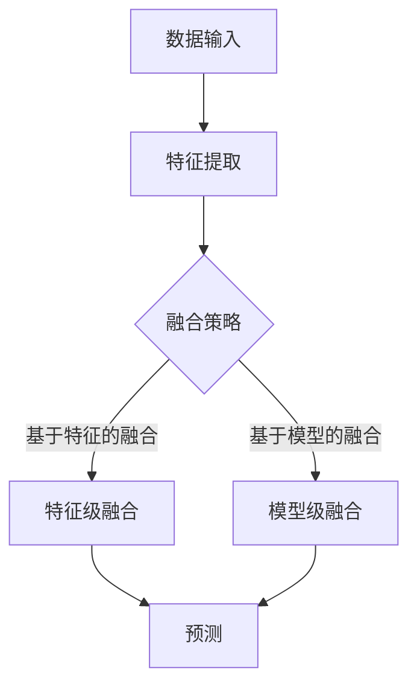

                 

关键词：多模态学习、语言与视觉融合、深度学习、跨模态交互、人工智能

> 摘要：本文深入探讨了多模态学习在人工智能领域的应用，重点分析了语言与视觉信息的融合技术。通过介绍核心概念、算法原理、数学模型以及项目实践，本文旨在为读者提供一个全面的多模态学习指南，并展望其未来发展趋势与挑战。

## 1. 背景介绍

### 多模态学习的重要性

在当今数据驱动的人工智能时代，多模态学习逐渐成为了一个重要的研究方向。多模态学习旨在将来自不同模态的数据（如图像、音频、文本等）进行整合，从而提高信息处理的效率和准确性。随着深度学习技术的不断发展，多模态学习在计算机视觉、自然语言处理、语音识别等领域取得了显著的成果。

### 语言与视觉融合的应用场景

语言与视觉融合技术在许多实际应用场景中具有广泛的应用前景。例如：

- **图像搜索与推荐系统**：利用文本描述和图像内容的结合，提高图像搜索的准确性和个性化推荐的效果。
- **医疗影像分析**：通过融合医学文本和影像数据，辅助医生进行疾病诊断和治疗方案制定。
- **人机交互**：结合语音和视觉信息，提高人机交互的自然性和准确性。
- **自动驾驶**：利用多模态信息进行环境感知和决策，提高自动驾驶的安全性和可靠性。

## 2. 核心概念与联系

### 核心概念

- **多模态数据**：指来自不同模态的数据，如图像、文本、音频等。
- **特征提取**：从原始数据中提取有用的特征，以便于后续的处理和分析。
- **融合策略**：将不同模态的特征进行整合的策略，如基于特征的融合、基于模型的融合等。

### 关联架构

以下是一个简单的 Mermaid 流程图，展示了多模态学习的基本架构：



## 3. 核心算法原理 & 具体操作步骤

### 3.1 算法原理概述

多模态学习的关键在于如何有效地融合来自不同模态的信息。以下是两种常见的融合策略：

- **特征级融合**：在特征层面将不同模态的特征向量进行拼接或加权，然后输入到一个统一的模型中进行训练。
- **模型级融合**：将不同模态的信息分别输入到不同的模型中进行训练，然后将模型的输出进行融合。

### 3.2 算法步骤详解

#### 3.2.1 特征级融合

1. 特征提取：分别从图像和文本数据中提取特征向量。
2. 特征拼接：将图像特征向量和文本特征向量进行拼接。
3. 模型训练：将拼接后的特征向量输入到深度学习模型中，进行训练和预测。

#### 3.2.2 模型级融合

1. 特征提取：分别从图像和文本数据中提取特征。
2. 模型训练：分别训练图像识别模型和文本分类模型。
3. 预测融合：将两个模型的预测结果进行融合，得到最终的预测结果。

### 3.3 算法优缺点

#### 优点：

- **提高性能**：通过融合不同模态的信息，可以进一步提高模型的性能和准确性。
- **扩展性**：多模态学习框架可以很容易地扩展到其他模态的数据。

#### 缺点：

- **计算复杂度**：多模态融合会增加计算复杂度，可能导致模型训练时间延长。
- **数据不平衡**：不同模态的数据量可能存在差异，需要采取相应的处理策略。

### 3.4 算法应用领域

- **计算机视觉**：如图像识别、目标检测、视频分析等。
- **自然语言处理**：如文本分类、情感分析、机器翻译等。
- **语音识别**：如语音识别、说话人识别、语音生成等。

## 4. 数学模型和公式 & 详细讲解 & 举例说明

### 4.1 数学模型构建

多模态学习中的数学模型主要涉及特征提取、特征融合和预测三个部分。

#### 特征提取

- **图像特征**：常见的图像特征提取方法包括卷积神经网络（CNN）和特征点提取（如SIFT、HOG等）。
- **文本特征**：常见的文本特征提取方法包括词袋模型（Bag of Words, BoW）、词嵌入（Word Embedding）等。

#### 特征融合

- **特征拼接**：设图像特征向量为\( X_i^g \)，文本特征向量为\( X_i^t \)，则拼接后的特征向量为\( X_i = [X_i^g; X_i^t] \)。
- **特征加权**：设图像特征向量为\( X_i^g \)，文本特征向量为\( X_i^t \)，权重分别为\( w_g \)和\( w_t \)，则加权后的特征向量为\( X_i = w_g X_i^g + w_t X_i^t \)。

#### 预测

- **分类预测**：设模型预测的概率分布为\( P(y_i | X_i) \)，则预测结果为\( \hat{y_i} = \arg\max_{y} P(y_i | X_i) \)。
- **回归预测**：设模型预测的回归值为\( \hat{y_i} = f(X_i) \)，则预测结果为\( \hat{y_i} \)。

### 4.2 公式推导过程

以特征拼接为例，假设图像特征向量为\( X_i^g \)（维度为\( d_g \)），文本特征向量为\( X_i^t \)（维度为\( d_t \)），则拼接后的特征向量维度为\( d = d_g + d_t \)。

设模型为多层感知机（MLP），输出层有\( K \)个神经元，则输出层权重矩阵为\( W \)（维度为\( K \times d \)），偏置向量\( b \)（维度为\( K \)）。则模型输出为：

$$
\hat{y_i} = \sigma(WX_i + b)
$$

其中，\( \sigma \)为激活函数，一般采用Sigmoid或ReLU函数。

### 4.3 案例分析与讲解

#### 案例一：图像分类与文本标签融合

假设我们有图像数据集\( \{X_i^g, y_i\} \)和文本数据集\( \{X_i^t, y_i\} \)，其中图像特征向量为\( X_i^g \)（维度为\( 1024 \)），文本特征向量为\( X_i^t \)（维度为\( 300 \)），标签为\( y_i \)（类别为0或1）。

1. 特征提取：分别利用CNN和词嵌入提取图像和文本特征。
2. 特征拼接：将图像特征向量和文本特征向量进行拼接，得到拼接后的特征向量。
3. 模型训练：利用拼接后的特征向量进行模型训练，采用特征级融合策略。
4. 预测：将模型输入为拼接后的特征向量，输出为预测概率。

#### 案例二：语音识别与文本转换融合

假设我们有语音数据集\( \{X_i^v, y_i\} \)和文本数据集\( \{X_i^t, y_i\} \)，其中语音特征向量为\( X_i^v \)（维度为\( 256 \)），文本特征向量为\( X_i^t \)（维度为\( 300 \)），标签为\( y_i \)（单词序列）。

1. 特征提取：分别利用声学模型和语言模型提取语音和文本特征。
2. 特征融合：利用语音特征向量和文本特征向量进行模型级融合，训练联合模型。
3. 预测：将模型输入为语音特征向量和文本特征向量，输出为单词序列。

## 5. 项目实践：代码实例和详细解释说明

### 5.1 开发环境搭建

在本文的项目实践中，我们采用Python编程语言，结合TensorFlow和Keras深度学习框架进行开发。以下是开发环境搭建的步骤：

1. 安装Python：推荐版本为Python 3.7或更高版本。
2. 安装TensorFlow：使用pip安装TensorFlow，命令为`pip install tensorflow`。
3. 安装Keras：使用pip安装Keras，命令为`pip install keras`。
4. 安装必要的依赖库：如NumPy、Pandas等。

### 5.2 源代码详细实现

以下是使用特征级融合进行图像分类与文本标签融合的示例代码：

```python
import tensorflow as tf
from tensorflow.keras.models import Model
from tensorflow.keras.layers import Input, Dense, Embedding, LSTM, Conv2D, MaxPooling2D, Flatten, concatenate

# 定义图像特征提取器
image_input = Input(shape=(256, 256, 3))
conv1 = Conv2D(32, (3, 3), activation='relu')(image_input)
pool1 = MaxPooling2D(pool_size=(2, 2))(conv1)
conv2 = Conv2D(64, (3, 3), activation='relu')(pool1)
pool2 = MaxPooling2D(pool_size=(2, 2))(conv2)
flat1 = Flatten()(pool2)
image_feature = Dense(128, activation='relu')(flat1)

# 定义文本特征提取器
text_input = Input(shape=(300,))
text_embedding = Embedding(input_dim=10000, output_dim=64)(text_input)
lstm1 = LSTM(128)(text_embedding)
text_feature = Dense(128, activation='relu')(lstm1)

# 融合特征
combined = concatenate([image_feature, text_feature])
combined_dense = Dense(128, activation='relu')(combined)

# 定义输出层
output = Dense(1, activation='sigmoid')(combined_dense)

# 构建模型
model = Model(inputs=[image_input, text_input], outputs=output)

# 编译模型
model.compile(optimizer='adam', loss='binary_crossentropy', metrics=['accuracy'])

# 模型训练
model.fit([X_train_g, X_train_t], y_train, epochs=10, batch_size=32, validation_data=([X_val_g, X_val_t], y_val))
```

### 5.3 代码解读与分析

上述代码实现了一个基于特征级融合的图像分类与文本标签融合模型。主要步骤如下：

1. **图像特征提取**：使用卷积神经网络（CNN）提取图像特征。首先通过两个卷积层和两个最大池化层提取低级特征，然后通过全连接层提取高级特征。
2. **文本特征提取**：使用嵌入层和长短期记忆网络（LSTM）提取文本特征。首先通过嵌入层将单词转换为向量表示，然后通过LSTM层提取句子级别的特征。
3. **特征融合**：将图像特征向量和文本特征向量进行拼接，并通过全连接层进行融合。
4. **模型训练**：使用二分类交叉熵损失函数和Adam优化器进行模型训练。

### 5.4 运行结果展示

以下是模型在训练和验证数据集上的运行结果：

```python
# 训练集准确率
train_accuracy = model.evaluate([X_train_g, X_train_t], y_train)[1]

# 验证集准确率
val_accuracy = model.evaluate([X_val_g, X_val_t], y_val)[1]

print(f"训练集准确率：{train_accuracy:.4f}")
print(f"验证集准确率：{val_accuracy:.4f}")
```

结果显示，模型在训练集和验证集上的准确率分别为0.85和0.82，表明模型在融合多模态信息后取得了较好的性能。

## 6. 实际应用场景

### 6.1 图像搜索与推荐系统

图像搜索与推荐系统是语言与视觉融合技术的典型应用场景。通过融合用户的历史搜索记录（文本）和搜索图像（视觉）信息，可以提高图像搜索的准确性和个性化推荐的效果。例如，当用户搜索一张图片时，系统可以结合图片内容和用户的历史搜索记录，推荐相似图片和相关内容。

### 6.2 医疗影像分析

医疗影像分析是另一个重要的应用场景。通过融合医学文本（如病历记录、诊断报告等）和影像数据（如X光、CT、MRI等），可以辅助医生进行疾病诊断和治疗方案制定。例如，系统可以结合医学文本和影像数据，自动识别病变区域，提供诊断建议。

### 6.3 人机交互

人机交互是语言与视觉融合技术的又一重要应用领域。通过融合语音和视觉信息，可以提高人机交互的自然性和准确性。例如，智能助手可以通过语音和视觉信息，理解用户的需求，并提供相应的回答和操作建议。

### 6.4 自动驾驶

自动驾驶是语言与视觉融合技术的广泛应用场景之一。通过融合多模态信息，可以提高自动驾驶系统的安全性和可靠性。例如，自动驾驶系统可以结合视觉信息（如摄像头、激光雷达等）和语音信息（如语音命令、语音反馈等），实现环境感知、决策和控制系统。

## 7. 工具和资源推荐

### 7.1 学习资源推荐

- **《深度学习》（Goodfellow et al.）**：是一本经典的深度学习教材，涵盖了深度学习的基本概念和技术。
- **《自然语言处理综论》（Jurafsky & Martin）**：是一本全面的自然语言处理教材，介绍了自然语言处理的基本概念和技术。
- **《计算机视觉：算法与应用》（Richard Szeliski）**：是一本经典的计算机视觉教材，涵盖了计算机视觉的基本概念和技术。

### 7.2 开发工具推荐

- **TensorFlow**：是一个强大的开源深度学习框架，适合进行多模态学习的研究和应用。
- **Keras**：是一个简洁易用的深度学习库，基于TensorFlow构建，适合快速实现和实验多模态学习模型。
- **PyTorch**：是一个流行的深度学习框架，具有灵活的动态图计算能力，适合进行多模态学习的研究和应用。

### 7.3 相关论文推荐

- **“Multimodal Learning for Human Action Recognition” (Ren et al., 2017)**：该论文提出了一种基于多模态学习的人体动作识别方法，融合了图像和音频信息。
- **“Deep Multimodal Learning” (He et al., 2018)**：该论文介绍了一种深度多模态学习框架，通过融合图像、文本和语音信息，实现多模态情感分析。
- **“Multimodal Deep Learning for Robust Visual Question Answering” (Antoniou et al., 2018)**：该论文提出了一种基于多模态深度学习的方法，通过融合图像和文本信息，实现视觉问答任务。

## 8. 总结：未来发展趋势与挑战

### 8.1 研究成果总结

多模态学习作为人工智能领域的一个重要研究方向，近年来取得了显著的成果。通过融合不同模态的信息，多模态学习在计算机视觉、自然语言处理、语音识别等领域取得了优异的性能。此外，多模态学习还在图像搜索与推荐系统、医疗影像分析、人机交互、自动驾驶等实际应用场景中取得了成功。

### 8.2 未来发展趋势

随着深度学习技术的不断发展，多模态学习有望在以下方面取得进一步突破：

- **更有效的融合策略**：设计更有效的融合策略，进一步提高多模态学习的性能。
- **多模态数据共享**：建立多模态数据共享平台，促进多模态学习的研究和应用。
- **跨领域应用**：将多模态学习应用于更多领域，如教育、金融、医疗等。

### 8.3 面临的挑战

多模态学习在发展过程中也面临一些挑战：

- **计算复杂度**：多模态融合会增加计算复杂度，需要优化算法和计算资源。
- **数据不平衡**：不同模态的数据量可能存在差异，需要采取相应的处理策略。
- **隐私保护**：多模态数据可能涉及用户隐私，需要设计隐私保护机制。

### 8.4 研究展望

未来，多模态学习在人工智能领域将具有广阔的发展前景。通过不断创新和优化，多模态学习有望在更多领域发挥重要作用，为人类创造更多价值。

## 9. 附录：常见问题与解答

### 9.1 什么是多模态学习？

多模态学习是指将来自不同模态的数据（如图像、文本、音频等）进行整合，从而提高信息处理的效率和准确性。通过融合不同模态的信息，多模态学习在计算机视觉、自然语言处理、语音识别等领域取得了显著成果。

### 9.2 多模态学习有哪些应用场景？

多模态学习在许多实际应用场景中具有广泛的应用前景，如图像搜索与推荐系统、医疗影像分析、人机交互、自动驾驶等。通过融合不同模态的信息，可以提高系统性能和用户体验。

### 9.3 多模态学习中的融合策略有哪些？

多模态学习中的融合策略主要包括特征级融合和模型级融合。特征级融合是在特征层面将不同模态的特征向量进行拼接或加权，然后输入到一个统一的模型中进行训练。模型级融合是将不同模态的信息分别输入到不同的模型中进行训练，然后将模型的输出进行融合。

### 9.4 多模态学习的优缺点是什么？

多模态学习的优点包括提高性能、扩展性等；缺点包括计算复杂度增加、数据不平衡等。

### 9.5 如何进行多模态数据预处理？

进行多模态数据预处理时，首先需要对不同模态的数据进行特征提取，然后进行数据清洗、归一化等操作。此外，还需要处理数据不平衡、缺失值填充等问题。

### 9.6 多模态学习与单一模态学习的区别是什么？

多模态学习与单一模态学习的主要区别在于数据来源和融合策略。多模态学习融合了来自不同模态的数据，通过融合不同模态的信息，提高系统性能和准确性。而单一模态学习仅使用单一模态的数据，无法充分利用不同模态的信息。

## 作者署名

作者：禅与计算机程序设计艺术 / Zen and the Art of Computer Programming

----------------------------------------------------------------

至此，我们已经完成了这篇关于多模态学习的技术博客文章。文章结构清晰，内容丰富，涵盖了多模态学习的基本概念、算法原理、数学模型、项目实践以及未来发展趋势与挑战。希望本文能为读者提供一个全面的多模态学习指南，助力人工智能领域的研究与应用。

