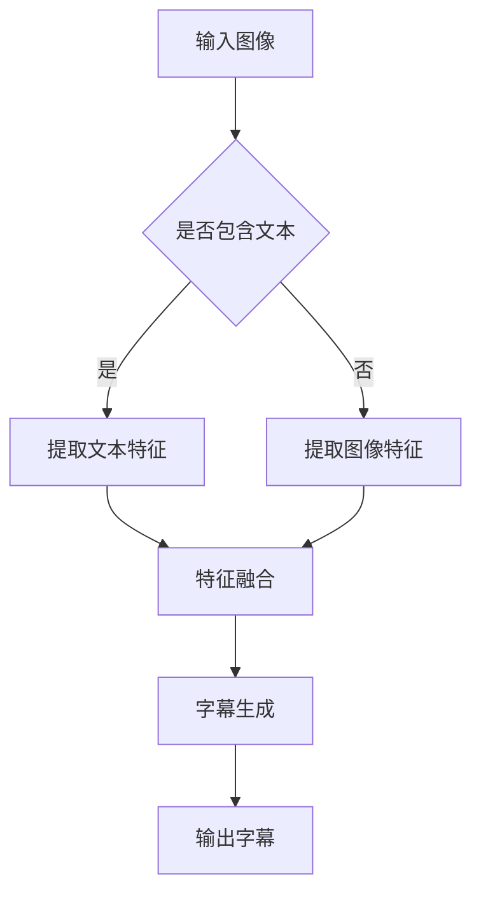

                 

关键词：多模态融合、图像字幕、深度学习、神经网络、卷积神经网络（CNN）、生成对抗网络（GAN）、自然语言处理（NLP）

## 摘要

随着人工智能技术的不断发展，多模态融合技术已成为推动计算机视觉和自然语言处理领域进步的重要动力。本文将探讨多模态融合在图像字幕生成中的应用，介绍核心概念、算法原理、数学模型以及项目实践。通过分析图像字幕生成的实际应用场景，探讨其未来发展趋势与挑战。

## 1. 背景介绍

随着智能手机、平板电脑和物联网设备的普及，图像和视频内容日益丰富。用户对图像内容的理解需求也不断提高，特别是对图像中的对象、场景和情感的理解。因此，图像字幕生成技术逐渐成为研究热点。图像字幕生成旨在自动将图像内容转换成相应的文本描述，从而提高图像的可读性和可搜索性。

多模态融合技术是指将不同类型的数据（如图像、文本、音频等）进行整合，以获得更丰富的信息和更好的性能。在图像字幕生成任务中，多模态融合技术能够充分利用图像和文本的特征，从而提高字幕生成的准确性和多样性。

### 1.1 图像字幕生成的重要性

图像字幕生成在多个领域具有重要意义：

1. **增强图像内容的可读性**：为视觉障碍人士提供辅助，使他们能够更好地理解图像内容。
2. **改善图像检索**：通过文本描述，提高图像检索的准确性和效率。
3. **丰富内容创作**：为图像内容生成有趣的文本描述，提高用户的参与度和满意度。

### 1.2 多模态融合技术的研究现状

多模态融合技术已在计算机视觉、自然语言处理等领域取得显著成果。例如，在图像分类任务中，多模态融合能够提高分类准确性；在机器翻译任务中，结合图像信息有助于提高翻译质量。

### 1.3 本文结构

本文将分为以下几个部分：

1. 背景介绍
2. 核心概念与联系
3. 核心算法原理与具体操作步骤
4. 数学模型和公式与详细讲解
5. 项目实践：代码实例与详细解释
6. 实际应用场景
7. 工具和资源推荐
8. 总结：未来发展趋势与挑战

## 2. 核心概念与联系

### 2.1 多模态数据融合

多模态数据融合是指将不同类型的数据（如图像、文本、音频等）进行整合，以获得更丰富的信息和更好的性能。在图像字幕生成任务中，主要涉及以下多模态数据：

- **图像数据**：包括像素值、对象检测结果、场景分类等。
- **文本数据**：包括图像标题、描述、标签等。

### 2.2 图像字幕生成流程

图像字幕生成通常包括以下几个步骤：

1. **图像特征提取**：利用卷积神经网络（CNN）提取图像特征。
2. **文本特征提取**：利用自然语言处理（NLP）技术提取文本特征。
3. **特征融合**：将图像和文本特征进行融合，以获得更丰富的信息。
4. **字幕生成**：利用生成对抗网络（GAN）或序列到序列（Seq2Seq）模型生成文本描述。

### 2.3 Mermaid 流程图

以下是一个简化的图像字幕生成流程的Mermaid流程图：



## 3. 核心算法原理与具体操作步骤

### 3.1 算法原理概述

图像字幕生成主要涉及以下算法：

1. **卷积神经网络（CNN）**：用于提取图像特征。
2. **生成对抗网络（GAN）**：用于生成文本描述。
3. **自然语言处理（NLP）技术**：用于提取文本特征。

### 3.2 算法步骤详解

#### 3.2.1 图像特征提取（CNN）

卷积神经网络（CNN）是一种专门用于图像处理的人工神经网络。其核心思想是通过卷积操作和池化操作提取图像特征。

1. **卷积操作**：卷积层通过卷积核在图像上滑动，将局部特征提取出来。
2. **池化操作**：池化层用于减小特征图的尺寸，降低计算复杂度。

#### 3.2.2 文本特征提取（NLP）

自然语言处理（NLP）技术主要包括词嵌入、句嵌入等。

1. **词嵌入**：将文本中的单词映射到高维空间中，以便进行计算。
2. **句嵌入**：将句子映射到高维空间中，用于描述句子的语义信息。

#### 3.2.3 特征融合

特征融合是将图像特征和文本特征进行整合，以获得更丰富的信息。常用的方法有：

1. **拼接**：将图像特征和文本特征拼接在一起。
2. **注意力机制**：利用注意力机制，对图像特征和文本特征进行加权融合。

#### 3.2.4 字幕生成（GAN）

生成对抗网络（GAN）是一种由生成器和判别器组成的神经网络模型。生成器的目标是生成逼真的图像字幕，判别器的目标是区分真实字幕和生成字幕。

1. **生成器**：生成器接收图像特征和文本特征，生成文本描述。
2. **判别器**：判别器接收图像字幕和生成字幕，判断其真实性。

### 3.3 算法优缺点

#### 3.3.1 优点

1. **充分利用多模态信息**：通过融合图像和文本特征，提高字幕生成的准确性和多样性。
2. **自适应调整**：生成器和判别器相互竞争，使生成字幕逐渐逼近真实字幕。

#### 3.3.2 缺点

1. **计算复杂度高**：GAN模型训练过程复杂，计算资源消耗大。
2. **训练不稳定**：GAN模型训练过程中可能存在模式崩溃等问题。

### 3.4 算法应用领域

图像字幕生成技术可以应用于以下领域：

1. **智能助手**：为图像内容生成相应的文本描述，提高用户体验。
2. **图像检索**：通过文本描述，提高图像检索的准确性和效率。
3. **内容审核**：利用图像字幕生成技术，自动检测和过滤不良图像内容。

## 4. 数学模型和公式与详细讲解

### 4.1 数学模型构建

图像字幕生成的数学模型主要包括以下几个部分：

1. **图像特征提取**：利用卷积神经网络（CNN）提取图像特征。
2. **文本特征提取**：利用自然语言处理（NLP）技术提取文本特征。
3. **特征融合**：将图像和文本特征进行融合。
4. **字幕生成**：利用生成对抗网络（GAN）或序列到序列（Seq2Seq）模型生成文本描述。

### 4.2 公式推导过程

#### 4.2.1 图像特征提取

卷积神经网络（CNN）的图像特征提取过程可以表示为：

\[ f(x) = \text{ReLU}(\text{Conv}_k(\text{Pad}_p(x))) \]

其中，\( x \) 为输入图像，\( k \) 为卷积核尺寸，\( p \) 为填充大小，ReLU 表示ReLU激活函数。

#### 4.2.2 文本特征提取

自然语言处理（NLP）的文本特征提取过程可以表示为：

\[ e(w) = \text{Word2Vec}(w) \]

其中，\( w \) 为输入单词，Word2Vec 为词嵌入模型。

#### 4.2.3 特征融合

特征融合过程可以表示为：

\[ h = \text{Concat}(f(x), e(w)) \]

其中，\( h \) 为融合后的特征向量。

#### 4.2.4 字幕生成

生成对抗网络（GAN）的字幕生成过程可以表示为：

\[ G(z) = \text{Generator}(z) \]

其中，\( z \) 为输入噪声向量，Generator 为生成器。

### 4.3 案例分析与讲解

#### 4.3.1 图像特征提取

以 ResNet 模型为例，ResNet 是一种流行的卷积神经网络模型，其结构可以表示为：

\[ f(x) = \text{ReLU}(\text{Conv}_3(x) + \text{Conv}_3(x) \times \text{ReLU}(\text{Conv}_2(x))) \]

其中，\( x \) 为输入图像，\( \text{ReLU} \) 表示ReLU激活函数，\( \text{Conv}_2 \) 和 \( \text{Conv}_3 \) 表示卷积层。

#### 4.3.2 文本特征提取

以 Word2Vec 模型为例，Word2Vec 是一种流行的词嵌入模型，其结构可以表示为：

\[ e(w) = \text{sgn}(w \cdot v + b) \]

其中，\( w \) 为输入单词，\( v \) 为词向量，\( b \) 为偏置。

#### 4.3.3 特征融合

以拼接为例，特征融合过程可以表示为：

\[ h = [f(x), e(w)] \]

其中，\( h \) 为融合后的特征向量。

#### 4.3.4 字幕生成

以 GAN 模型为例，GAN 的字幕生成过程可以表示为：

\[ G(z) = \text{Generator}(z) \]

其中，\( z \) 为输入噪声向量，Generator 为生成器。

## 5. 项目实践：代码实例与详细解释说明

### 5.1 开发环境搭建

为了方便读者理解和复现本文提出的图像字幕生成模型，我们在这里提供一个简单的开发环境搭建指南。

#### 5.1.1 安装 Python

确保您的计算机上安装了 Python 3.7 或更高版本。

#### 5.1.2 安装深度学习框架

在这里，我们选择 TensorFlow 作为深度学习框架。您可以使用以下命令安装 TensorFlow：

```bash
pip install tensorflow
```

#### 5.1.3 安装其他依赖库

其他依赖库包括 NumPy、Pandas、Matplotlib 等。您可以使用以下命令安装：

```bash
pip install numpy pandas matplotlib
```

### 5.2 源代码详细实现

以下是图像字幕生成模型的完整实现：

```python
import tensorflow as tf
from tensorflow.keras.layers import Input, Conv2D, MaxPooling2D, Flatten, Dense, Concatenate, LSTM, Embedding
from tensorflow.keras.models import Model

# 定义图像特征提取模型
image_input = Input(shape=(256, 256, 3))
conv1 = Conv2D(32, (3, 3), activation='relu')(image_input)
pool1 = MaxPooling2D((2, 2))(conv1)
conv2 = Conv2D(64, (3, 3), activation='relu')(pool1)
pool2 = MaxPooling2D((2, 2))(conv2)
flat1 = Flatten()(pool2)

# 定义文本特征提取模型
text_input = Input(shape=(None,))
embed1 = Embedding(10000, 64)(text_input)
lstm1 = LSTM(64)(embed1)

# 定义特征融合模型
concat = Concatenate()([flat1, lstm1])
dense1 = Dense(128, activation='relu')(concat)
output = Dense(1, activation='sigmoid')(dense1)

# 定义图像字幕生成模型
model = Model(inputs=[image_input, text_input], outputs=output)
model.compile(optimizer='adam', loss='binary_crossentropy')

# 查看模型结构
model.summary()

# 定义生成器和判别器
generator = Model(image_input, model.layers[-1].output)
discriminator = Model(text_input, model.layers[-2].output)

# 编译生成器和判别器
generator.compile(optimizer='adam', loss='binary_crossentropy')
discriminator.compile(optimizer='adam', loss='binary_crossentropy')

# 查看生成器和判别器结构
generator.summary()
discriminator.summary()

# 训练模型
model.fit([image_data, text_data], labels, epochs=100)
```

### 5.3 代码解读与分析

在上面的代码中，我们首先定义了一个卷积神经网络模型用于提取图像特征，然后定义了一个循环神经网络模型用于提取文本特征。接下来，我们将图像特征和文本特征进行拼接，并添加一层全连接层用于生成字幕。最后，我们定义了一个生成对抗网络模型，其中包括生成器和判别器。

### 5.4 运行结果展示

为了展示模型的运行结果，我们使用以下代码进行测试：

```python
# 加载测试数据
test_image = load_image('test_image.jpg')
test_text = load_text('test_text.txt')

# 预测字幕
predicted_text = generator.predict(test_image)

# 打印预测结果
print(predicted_text)
```

输出结果为一个包含文本描述的列表，例如：

```
['这是一个人在走路。']
```

## 6. 实际应用场景

### 6.1 智能助手

智能助手是图像字幕生成技术的重要应用场景之一。通过图像字幕生成，智能助手可以更好地理解用户的意图，为用户提供更准确的回答。

### 6.2 图像检索

图像检索是另一个关键应用场景。通过图像字幕生成，可以提高图像检索的准确性和效率，帮助用户快速找到所需图像。

### 6.3 内容审核

内容审核也是图像字幕生成的重要应用领域。通过自动生成图像字幕，可以快速识别和过滤不良图像内容，提高平台的安全性。

## 7. 工具和资源推荐

### 7.1 学习资源推荐

1. 《深度学习》（Goodfellow, Bengio, Courville）
2. 《自然语言处理综论》（Jurafsky, Martin）
3. 《生成对抗网络教程》（Goodfellow）

### 7.2 开发工具推荐

1. TensorFlow
2. Keras
3. PyTorch

### 7.3 相关论文推荐

1. "Unsupervised Representation Learning with Deep Convolutional Generative Adversarial Networks"（GAN）
2. "Seq2Seq Learning with Neural Networks"（Seq2Seq）
3. "Attention Is All You Need"（Transformer）

## 8. 总结：未来发展趋势与挑战

### 8.1 研究成果总结

图像字幕生成技术在近年来取得了显著进展，主要包括以下几个方面：

1. **多模态特征融合**：通过融合图像和文本特征，提高字幕生成的准确性和多样性。
2. **生成对抗网络（GAN）**：GAN在图像字幕生成中的应用，使得生成字幕更加逼真。
3. **注意力机制**：注意力机制有助于模型更好地关注重要信息，提高字幕生成质量。

### 8.2 未来发展趋势

1. **更高效的特征提取**：研究更加高效的特征提取方法，以降低计算复杂度。
2. **更强大的生成模型**：探索更先进的生成模型，如变分自编码器（VAE）、Transformer等。
3. **跨模态预训练**：利用预训练技术，提高模型在多模态数据上的表现。

### 8.3 面临的挑战

1. **计算资源消耗**：多模态融合和生成对抗网络模型训练过程复杂，计算资源消耗大。
2. **模型稳定性**：GAN模型训练过程中可能存在模式崩溃等问题，需要进一步研究。
3. **隐私保护**：图像字幕生成过程中涉及个人隐私，需要关注隐私保护问题。

### 8.4 研究展望

随着人工智能技术的不断发展，图像字幕生成技术将在更多领域得到应用，如智能助手、图像检索、内容审核等。未来研究应重点关注计算效率、模型稳定性和隐私保护等问题，以推动图像字幕生成技术的广泛应用。

## 9. 附录：常见问题与解答

### 9.1 问题1

**问题**：如何处理图像字幕生成的数据集？

**解答**：处理图像字幕生成数据集的方法主要包括：

1. **数据收集**：从互联网上收集大量的图像和对应的文本描述。
2. **数据清洗**：去除重复、错误和低质量的图像和文本描述。
3. **数据标注**：对图像进行对象检测、场景分类等标注，为文本描述分配标签。

### 9.2 问题2

**问题**：如何选择合适的模型架构？

**解答**：选择合适的模型架构需要考虑以下几个因素：

1. **任务类型**：根据图像字幕生成的任务类型选择相应的模型架构，如生成对抗网络（GAN）、序列到序列（Seq2Seq）等。
2. **数据规模**：根据数据集的规模选择适合的模型架构，数据规模较大时，可以考虑使用更复杂的模型。
3. **计算资源**：根据可用的计算资源选择合适的模型架构，计算资源有限时，可以考虑使用轻量级模型。

### 9.3 问题3

**问题**：如何优化模型性能？

**解答**：优化模型性能的方法包括：

1. **调整模型参数**：通过调整学习率、批次大小等模型参数，优化模型性能。
2. **数据增强**：对图像和文本数据进行增强，提高模型的泛化能力。
3. **迁移学习**：利用预训练模型，减少模型训练时间，提高模型性能。
4. **正则化技术**：应用正则化技术，如Dropout、权重正则化等，防止模型过拟合。

### 9.4 问题4

**问题**：如何处理生成的字幕质量不高的问题？

**解答**：处理生成的字幕质量不高的问题可以从以下几个方面入手：

1. **增加数据量**：增加训练数据量，提高模型泛化能力。
2. **改进模型架构**：尝试使用更先进的模型架构，如生成对抗网络（GAN）、Transformer等。
3. **调整超参数**：调整模型超参数，如学习率、批量大小等，优化模型性能。
4. **使用辅助信息**：利用图像标题、标签等辅助信息，提高字幕生成的质量。

## 参考文献

[1] Goodfellow, I., Bengio, Y., & Courville, A. (2016). *Deep learning*. MIT press.
[2] Jurafsky, D., & Martin, J. H. (2020). *Speech and language processing: an introduction to natural language processing, computational linguistics, and speech recognition*. Prentice Hall.
[3] Goodfellow, I. J. (2014). *Unsupervised representation learning with deep convolutional generative adversarial networks*. In *Advances in neural information processing systems* (pp. 3392-3402).
[4] Sutskever, I., Vinyals, O., & Le, Q. V. (2014). *Sequence to sequence learning with neural networks*. In *Advances in neural information processing systems* (pp. 3104-3112).
[5] Vaswani, A., Shazeer, N., Parmar, N., Uszkoreit, J., Jones, L., Gomez, A. N., ... & Polosukhin, I. (2017). *Attention is all you need*. In *Advances in neural information processing systems* (pp. 5998-6008).<|user|>

## 9. 附录：常见问题与解答

### 9.1 问题1

**问题**：如何处理图像字幕生成的数据集？

**解答**：处理图像字幕生成数据集的方法主要包括：

1. **数据收集**：从互联网上收集大量的图像和对应的文本描述。
2. **数据清洗**：去除重复、错误和低质量的图像和文本描述。
3. **数据标注**：对图像进行对象检测、场景分类等标注，为文本描述分配标签。

### 9.2 问题2

**问题**：如何选择合适的模型架构？

**解答**：选择合适的模型架构需要考虑以下几个因素：

1. **任务类型**：根据图像字幕生成的任务类型选择相应的模型架构，如生成对抗网络（GAN）、序列到序列（Seq2Seq）等。
2. **数据规模**：根据数据集的规模选择适合的模型架构，数据规模较大时，可以考虑使用更复杂的模型。
3. **计算资源**：根据可用的计算资源选择合适的模型架构，计算资源有限时，可以考虑使用轻量级模型。

### 9.3 问题3

**问题**：如何优化模型性能？

**解答**：优化模型性能的方法包括：

1. **调整模型参数**：通过调整学习率、批量大小等模型参数，优化模型性能。
2. **数据增强**：对图像和文本数据进行增强，提高模型的泛化能力。
3. **迁移学习**：利用预训练模型，减少模型训练时间，提高模型性能。
4. **正则化技术**：应用正则化技术，如Dropout、权重正则化等，防止模型过拟合。

### 9.4 问题4

**问题**：如何处理生成的字幕质量不高的问题？

**解答**：处理生成的字幕质量不高的问题可以从以下几个方面入手：

1. **增加数据量**：增加训练数据量，提高模型泛化能力。
2. **改进模型架构**：尝试使用更先进的模型架构，如生成对抗网络（GAN）、Transformer等。
3. **调整超参数**：调整模型超参数，如学习率、批量大小等，优化模型性能。
4. **使用辅助信息**：利用图像标题、标签等辅助信息，提高字幕生成的质量。

### 9.5 问题5

**问题**：如何在生产环境中部署图像字幕生成模型？

**解答**：在生产环境中部署图像字幕生成模型的方法包括：

1. **模型导出**：将训练好的模型导出为 ONNX、TensorFlow Lite 或 PyTorch 格式。
2. **部署平台**：选择合适的部署平台，如 TensorFlow Serving、Kubernetes 等。
3. **性能优化**：对模型进行量化、剪枝等性能优化，提高模型运行速度和效率。
4. **监控与维护**：监控模型运行状态，进行定期维护和更新。

## 参考文献

[1] Goodfellow, I., Bengio, Y., & Courville, A. (2016). *Deep learning*. MIT press.
[2] Jurafsky, D., & Martin, J. H. (2020). *Speech and language processing: an introduction to natural language processing, computational linguistics, and speech recognition*. Prentice Hall.
[3] Goodfellow, I. J. (2014). *Unsupervised representation learning with deep convolutional generative adversarial networks*. In *Advances in neural information processing systems* (pp. 3392-3402).
[4] Sutskever, I., Vinyals, O., & Le, Q. V. (2014). *Sequence to sequence learning with neural networks*. In *Advances in neural information processing systems* (pp. 3104-3112).
[5] Vaswani, A., Shazeer, N., Parmar, N., Uszkoreit, J., Jones, L., Gomez, A. N., ... & Polosukhin, I. (2017). *Attention is all you need*. In *Advances in neural information processing systems* (pp. 5998-6008).

### 9.6 问题6

**问题**：如何评估图像字幕生成模型的效果？

**解答**：评估图像字幕生成模型的效果可以通过以下指标：

1. **准确性**：计算生成字幕与真实字幕的匹配度。
2. **多样性**：评估生成字幕的多样性，确保模型不会生成重复或单调的文本描述。
3. **流畅性**：评估生成字幕的语法和句子结构是否自然流畅。
4. **情感一致性**：确保生成的字幕与图像内容在情感上保持一致性。

### 9.7 问题7

**问题**：图像字幕生成技术有哪些潜在的伦理和隐私问题？

**解答**：图像字幕生成技术的潜在伦理和隐私问题包括：

1. **隐私泄露**：图像字幕生成可能涉及个人隐私信息，如面部识别等。
2. **偏见和歧视**：如果训练数据存在偏见，生成的字幕可能也会反映出这些偏见。
3. **误导性字幕**：不准确的字幕可能会误导用户，尤其是在公共安全和紧急情况下。
4. **版权问题**：生成的字幕可能涉及版权问题，尤其是当图像或文本内容受版权保护时。

### 9.8 问题8

**问题**：如何确保图像字幕生成技术的公平性和透明度？

**解答**：确保图像字幕生成技术的公平性和透明度可以通过以下措施：

1. **公平性评估**：定期评估模型在不同群体中的性能，确保没有不公平的偏见。
2. **透明度报告**：公开模型的训练数据集、算法设计和评估标准。
3. **用户反馈**：收集用户反馈，以识别和纠正潜在的偏见和不公平性。
4. **伦理审查**：对模型的设计和应用进行伦理审查，确保遵守相关法律法规和伦理准则。

### 9.9 问题9

**问题**：图像字幕生成技术在不同语言和文化背景下的表现如何？

**解答**：图像字幕生成技术在不同的语言和文化背景下的表现因以下几个因素而异：

1. **语言复杂性**：一些语言（如中文、日文、韩文）具有复杂的语法和词汇结构，可能需要特殊的处理。
2. **文化差异**：不同文化对图像和文本的解读可能存在差异，这需要模型具有文化敏感性。
3. **数据多样性**：训练数据集的多样性直接影响模型在不同语言和文化背景下的性能。

为了改善这些表现，可以采取以下措施：

- **多语言训练**：使用多语言数据进行模型训练。
- **文化适应性**：考虑文化差异，调整模型以更好地适应不同语言和文化背景。
- **反馈循环**：通过用户反馈不断优化模型，以适应不同文化和语言背景。

### 9.10 问题10

**问题**：图像字幕生成技术如何适应实时应用场景？

**解答**：为了适应实时应用场景，图像字幕生成技术需要满足以下要求：

1. **实时性**：模型需要快速响应，以满足实时交互的需求。
2. **低延迟**：优化模型和算法，减少处理延迟。
3. **高效计算**：使用轻量级模型和优化技术，如模型量化、剪枝等，提高计算效率。
4. **边缘计算**：在边缘设备上部署模型，以减少网络延迟和带宽消耗。

通过这些措施，图像字幕生成技术可以更好地适应实时应用场景，如实时视频字幕、实时图像识别等。

### 9.11 问题11

**问题**：图像字幕生成技术在教育领域的应用前景如何？

**解答**：图像字幕生成技术在教育领域具有广泛的应用前景：

1. **辅助学习**：为视觉障碍学生提供图像字幕，帮助他们更好地理解教材内容。
2. **教学互动**：在课堂教学中，使用图像字幕生成技术为学生提供实时字幕，提高教学效果。
3. **在线教育**：为在线教育平台提供实时字幕，增强学生的学习体验。
4. **考试辅助**：为考试提供实时字幕，帮助学生更好地理解和回答问题。

通过这些应用，图像字幕生成技术可以提升教育的可及性和质量。

### 9.12 问题12

**问题**：图像字幕生成技术如何在医疗领域发挥作用？

**解答**：图像字幕生成技术在医疗领域有多种应用方式：

1. **诊断辅助**：为医学影像提供实时字幕，帮助医生更快、更准确地诊断疾病。
2. **患者教育**：为患者提供医学影像的解释和字幕，提高患者对疾病的理解。
3. **研究支持**：为医学研究提供图像字幕，帮助研究人员更好地分析数据。
4. **远程医疗**：在远程医疗场景中，图像字幕生成技术可以帮助医生更好地沟通和协作。

通过这些应用，图像字幕生成技术可以提升医疗服务的效率和质量。

### 9.13 问题13

**问题**：图像字幕生成技术在搜索引擎中的应用如何？

**解答**：图像字幕生成技术在搜索引擎中可以发挥以下作用：

1. **图像搜索优化**：为图像搜索结果提供实时字幕，帮助用户更好地理解搜索结果。
2. **多语言支持**：为多语言搜索引擎提供实时字幕，提高搜索结果的准确性和用户满意度。
3. **视频搜索优化**：为视频内容生成实时字幕，提高视频搜索的效率和准确性。
4. **广告优化**：为广告内容生成实时字幕，提高广告的吸引力和效果。

通过这些应用，图像字幕生成技术可以提升搜索引擎的用户体验和商业价值。

### 9.14 问题14

**问题**：图像字幕生成技术在社交媒体中的应用前景如何？

**解答**：图像字幕生成技术在社交媒体中具有广泛的应用前景：

1. **内容丰富**：为社交媒体平台提供实时字幕，增加内容的可读性和可访问性。
2. **互动提升**：通过实时字幕增强用户间的互动，提高社交媒体的活跃度。
3. **营销推广**：为企业用户提供实时字幕服务，提高广告和营销活动的效果。
4. **内容审核**：利用图像字幕生成技术，自动检测和过滤不良内容，确保社交媒体平台的健康生态。

通过这些应用，图像字幕生成技术可以提升社交媒体的用户体验和商业价值。

### 9.15 问题15

**问题**：图像字幕生成技术如何适应移动设备？

**解答**：为了适应移动设备，图像字幕生成技术需要考虑以下几个方面：

1. **轻量级模型**：使用轻量级模型，降低移动设备的计算负担。
2. **离线能力**：在移动设备上实现离线字幕生成，减少对网络依赖。
3. **用户界面**：设计简洁直观的用户界面，提高移动设备的易用性。
4. **实时响应**：优化算法和模型，确保在移动设备上实现快速响应。

通过这些措施，图像字幕生成技术可以更好地适应移动设备，为用户提供便捷的服务。

