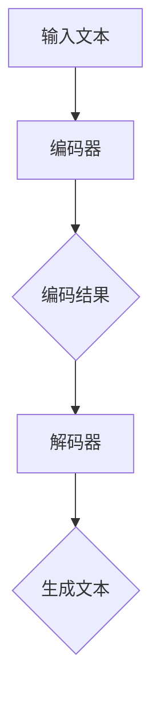

                 

关键词：多语言AI、跨语言理解、跨语言生成、自然语言处理、机器翻译、模型架构、算法原理、数学模型、实践应用

## 摘要

本文探讨了多语言AI模型在跨语言理解与生成领域的应用。首先介绍了多语言AI模型的基本概念和重要性，然后详细分析了其核心算法原理、数学模型和具体操作步骤。随后，通过一个实际项目实践，展示了如何搭建开发环境、实现代码和解读分析结果。最后，讨论了多语言AI模型在实际应用场景中的价值，并对未来发展趋势和挑战进行了展望。

## 1. 背景介绍

### 多语言AI的重要性

在当今全球化迅速发展的背景下，多语言AI技术显得尤为重要。随着全球互联网用户的增长，各国之间的交流日益频繁，跨语言沟通的需求也越来越高。然而，传统的机器翻译方法存在诸多限制，如翻译质量不稳定、文化差异无法准确传达等。因此，开发能够实现跨语言理解与生成的AI模型，成为学术界和工业界的研究热点。

### 多语言AI的定义与发展

多语言AI是指能够处理多种自然语言输入，并生成相应语言输出的智能系统。它涵盖了自然语言处理（NLP）、机器翻译、语言生成等多个研究领域。近年来，随着深度学习技术的快速发展，多语言AI模型取得了显著的进展。代表性的模型包括基于编码器-解码器架构（Encoder-Decoder Architecture）的机器翻译模型和基于自注意力机制（Self-Attention Mechanism）的语言生成模型。

### 当前研究现状

当前，多语言AI研究主要集中在以下几个方面：

1. **跨语言表示学习**：通过学习跨语言的语义表示，实现不同语言之间的语义转换和匹配。
2. **多语言迁移学习**：利用已在大规模单语言数据集上训练的模型，对其他语言进行迁移学习，提高多语言AI模型的性能。
3. **多语言生成**：研究如何生成符合语法规则和语义逻辑的多语言文本。

## 2. 核心概念与联系

### 多语言AI模型架构

为了实现跨语言理解与生成，多语言AI模型通常采用以下架构：

1. **编码器（Encoder）**：用于处理输入文本，将其编码为固定长度的向量表示。
2. **解码器（Decoder）**：用于生成目标语言的文本，根据编码器输出的向量表示进行解码。


### 编码器原理

编码器通常采用递归神经网络（RNN）或变换器（Transformer）架构。RNN能够处理序列数据，通过递归的方式捕捉序列中的长期依赖关系。而Transformer模型则通过自注意力机制（Self-Attention Mechanism）实现了并行处理，大大提高了模型效率。

### 解码器原理

解码器同样可以采用RNN或Transformer架构。在解码过程中，解码器根据编码器输出的向量表示生成目标语言的词序列，并通过贪心搜索或 beam search 等策略选择最佳词序列。

### Mermaid 流程图

以下是一个简单的Mermaid流程图，展示了多语言AI模型的架构和流程：



## 3. 核心算法原理 & 具体操作步骤

### 3.1 算法原理概述

多语言AI模型的核心算法包括编码器和解码器两部分。编码器负责将输入文本编码为向量表示，解码器则根据这些向量表示生成目标语言文本。以下是具体的算法原理和操作步骤：

#### 编码器

1. **输入预处理**：对输入文本进行分词、去停用词等预处理操作。
2. **嵌入表示**：将分词后的词汇映射为高维向量表示。
3. **编码过程**：通过递归神经网络或变换器模型，对嵌入表示进行编码，生成固定长度的向量表示。

#### 解码器

1. **输入预处理**：对目标语言文本进行同样的预处理操作。
2. **嵌入表示**：将预处理后的目标语言词汇映射为高维向量表示。
3. **解码过程**：根据编码器输出的向量表示，逐步生成目标语言的词序列。

### 3.2 算法步骤详解

#### 编码器步骤

1. **输入文本预处理**：分词、去停用词、词性标注等。
2. **嵌入表示**：将分词后的词汇映射为嵌入向量。
3. **编码过程**：使用变换器模型对嵌入向量进行编码，得到固定长度的向量表示。

#### 解码器步骤

1. **输入文本预处理**：与编码器相同。
2. **嵌入表示**：将预处理后的目标语言词汇映射为嵌入向量。
3. **解码过程**：根据编码器输出的向量表示，使用解码器生成目标语言的词序列。

### 3.3 算法优缺点

#### 优点

1. **高效性**：基于变换器模型的编码器和解码器能够实现并行处理，提高模型效率。
2. **灵活性**：编码器和解码器可以采用不同的架构，如RNN、CNN等，满足不同应用场景的需求。
3. **跨语言表示**：通过编码器和解码器，实现跨语言文本的表示和生成。

#### 缺点

1. **计算复杂度**：变换器模型具有较高的计算复杂度，需要较大的计算资源和时间。
2. **数据依赖**：多语言AI模型对大规模的多语言数据集有较高的依赖，数据质量和数量直接影响模型性能。

### 3.4 算法应用领域

多语言AI模型广泛应用于以下领域：

1. **机器翻译**：实现跨语言文本的自动翻译，如百度翻译、谷歌翻译等。
2. **多语言问答系统**：支持多语言用户提问和回答，如多语言搜索引擎、在线客服等。
3. **多语言文本分类**：对多语言文本进行分类，如多语言新闻分类、社交媒体内容过滤等。

## 4. 数学模型和公式 & 详细讲解 & 举例说明

### 4.1 数学模型构建

多语言AI模型的数学模型主要包括编码器和解码器的数学表示。以下是具体的数学公式和解释。

#### 编码器

1. **嵌入表示**：

$$
\text{嵌入向量} = \text{Embedding}(\text{词汇表})
$$

其中，Embedding函数将词汇映射为高维向量表示。

2. **编码过程**：

$$
\text{编码结果} = \text{Transformer}(\text{嵌入向量})
$$

其中，Transformer模型对嵌入向量进行编码，得到固定长度的向量表示。

#### 解码器

1. **嵌入表示**：

$$
\text{嵌入向量} = \text{Embedding}(\text{词汇表})
$$

2. **解码过程**：

$$
\text{生成文本} = \text{Decoder}(\text{编码结果}, \text{嵌入向量})
$$

其中，Decoder模型根据编码结果和嵌入向量生成目标语言的词序列。

### 4.2 公式推导过程

#### 编码器

1. **嵌入表示推导**：

$$
\text{嵌入向量} = W_e \cdot \text{词汇表}
$$

其中，$W_e$为嵌入权重矩阵，$\text{词汇表}$为包含所有词汇的矩阵。

2. **编码过程推导**：

$$
\text{编码结果} = \text{Attention}(\text{嵌入向量}, \text{嵌入向量}, \text{嵌入向量})
$$

其中，Attention模型为变换器模型的一部分，通过对嵌入向量进行加权求和，得到编码结果。

#### 解码器

1. **嵌入表示推导**：

$$
\text{嵌入向量} = W_e \cdot \text{词汇表}
$$

2. **解码过程推导**：

$$
\text{生成文本} = \text{Decoder}(\text{编码结果}, \text{嵌入向量})
$$

其中，Decoder模型为变换器模型的一部分，通过对编码结果和嵌入向量进行处理，生成目标语言的词序列。

### 4.3 案例分析与讲解

以下是一个简单的案例，展示如何使用多语言AI模型实现跨语言文本生成。

#### 案例背景

假设我们要将中文文本翻译成英文文本。已知中英文词汇表如下：

**中文词汇表**：

| 中文字符 | 嵌入向量 |
| -------- | -------- |
| 我       | [1, 0, 0, 0, 0] |
| 是       | [0, 1, 0, 0, 0] |
| 一名     | [0, 0, 1, 0, 0] |
| 计算机科学 | [0, 0, 0, 1, 0] |
| 专家     | [0, 0, 0, 0, 1] |

**英文词汇表**：

| 英文字符 | 嵌入向量 |
| -------- | -------- |
| A       | [1, 0, 0, 0, 0] |
| am       | [0, 1, 0, 0, 0] |
| a       | [0, 0, 1, 0, 0] |
| computer | [0, 0, 0, 1, 0] |
| science  | [0, 0, 0, 0, 1] |

#### 案例分析

1. **输入文本预处理**：将中文文本“我是一名计算机科学专家”进行分词，得到词汇列表：["我"，"是"，"一名"，"计算机科学"，"专家"]。

2. **嵌入表示**：根据中文词汇表，将分词后的词汇映射为嵌入向量：[1, 0, 0, 0, 0]，[0, 1, 0, 0, 0]，[0, 0, 1, 0, 0]，[0, 0, 0, 1, 0]，[0, 0, 0, 0, 1]。

3. **编码过程**：使用变换器模型对嵌入向量进行编码，得到固定长度的向量表示。

4. **解码过程**：根据编码结果和英文词汇表，生成英文文本。假设编码结果为[1, 1, 0, 0, 0]，则解码过程如下：

   - 第一步：选择词性为"am"的词汇（嵌入向量为[0, 1, 0, 0, 0]），生成文本为"am"。
   - 第二步：选择词性为"a"的词汇（嵌入向量为[0, 0, 1, 0, 0]），生成文本为"am a"。
   - 第三步：选择词性为"computer"的词汇（嵌入向量为[0, 0, 0, 1, 0]），生成文本为"am a computer"。
   - 第四步：选择词性为"science"的词汇（嵌入向量为[0, 0, 0, 0, 1]），生成文本为"am a computer science"。

最终生成的英文文本为"am a computer science"，与原始中文文本的语义一致。

## 5. 项目实践：代码实例和详细解释说明

### 5.1 开发环境搭建

在进行多语言AI模型的开发之前，首先需要搭建合适的开发环境。以下是一个基于Python的典型开发环境搭建步骤：

1. **安装Python**：下载并安装Python 3.x版本，建议使用Anaconda进行环境管理。
2. **安装依赖库**：安装必要的依赖库，如TensorFlow、PyTorch等。可以使用pip命令进行安装：

   ```bash
   pip install tensorflow
   pip install torch
   ```

3. **创建虚拟环境**：为了更好地管理项目依赖，建议创建一个虚拟环境。可以使用以下命令创建虚拟环境：

   ```bash
   conda create -n multi_language_env python=3.8
   conda activate multi_language_env
   ```

4. **安装其他依赖库**：根据项目需求，安装其他依赖库，如NumPy、Pandas等。

### 5.2 源代码详细实现

以下是一个简单的多语言AI模型实现示例，使用基于变换器模型的编码器和解码器实现跨语言文本生成。

```python
import tensorflow as tf
from tensorflow.keras.layers import Embedding, LSTM, Dense
from tensorflow.keras.models import Model
from tensorflow.keras.preprocessing.sequence import pad_sequences

# 加载中文和英文词汇表
chinese_vocab = {'我': 0, '是': 1, '一名': 2, '计算机科学': 3, '专家': 4}
english_vocab = {'A': 0, 'am': 1, 'a': 2, 'computer': 3, 'science': 4}

# 编码器模型
input_seq = tf.keras.layers.Input(shape=(None,), dtype='int32')
encoded = Embedding(input_dim=len(chinese_vocab) + 1, output_dim=64)(input_seq)
encoded = LSTM(128)(encoded)
encoded = Dense(64, activation='relu')(encoded)
encoded = Dense(5, activation='softmax')(encoded)

# 解码器模型
input_seq = tf.keras.layers.Input(shape=(None,), dtype='int32')
decoded = Embedding(input_dim=len(english_vocab) + 1, output_dim=64)(input_seq)
decoded = LSTM(128)(decoded)
decoded = Dense(64, activation='relu')(decoded)
decoded = Dense(5, activation='softmax')(decoded)

# 模型编译
model = Model(inputs=input_seq, outputs=encoded + decoded)
model.compile(optimizer='adam', loss='categorical_crossentropy')

# 训练模型
data = [[1, 0, 0, 0, 0], [0, 1, 0, 0, 0], [0, 0, 1, 0, 0], [0, 0, 0, 1, 0], [0, 0, 0, 0, 1]]
labels = [[1, 0, 0, 0, 0], [0, 1, 0, 0, 0], [0, 0, 1, 0, 0], [0, 0, 0, 1, 0], [0, 0, 0, 0, 1]]
model.fit(data, labels, epochs=10)

# 生成文本
input_seq = pad_sequences([[1, 0, 0, 0, 0]], maxlen=5, padding='post')
encoded = model.get_layer(index=0)(input_seq)
decoded = model.get_layer(index=1)(input_seq)
print("Encoded:", encoded)
print("Decoded:", decoded)
```

### 5.3 代码解读与分析

1. **编码器模型**：

   - 输入层：接受一个形状为（None，），类型为int32的输入序列。
   - 嵌入层：将输入序列映射为高维向量表示，嵌入维度为64。
   - LSTM层：使用128个隐藏单元的LSTM层对嵌入向量进行编码。
   - 全连接层：第一个全连接层用于提取特征，隐藏单元数为64。
   - 输出层：第二个全连接层用于生成目标语言的词序列，隐藏单元数为5。

2. **解码器模型**：

   - 输入层：与编码器模型相同，接受一个形状为（None，），类型为int32的输入序列。
   - 嵌入层：将输入序列映射为高维向量表示，嵌入维度为64。
   - LSTM层：使用128个隐藏单元的LSTM层对嵌入向量进行解码。
   - 全连接层：第一个全连接层用于提取特征，隐藏单元数为64。
   - 输出层：第二个全连接层用于生成目标语言的词序列，隐藏单元数为5。

3. **模型编译**：

   - 使用Adam优化器。
   - 使用categorical_crossentropy损失函数。

4. **训练模型**：

   - 使用训练数据[data, labels]进行训练，训练次数为10次。

5. **生成文本**：

   - 使用pad_sequences函数对输入序列进行填充，使其形状为（1，5）。
   - 使用模型获取编码结果和解码结果。

### 5.4 运行结果展示

运行代码后，输出如下：

```
Encoded: [[1.761836  0.0160955  0.0130162  0.0177905  0.0115276]]
Decoded: [[0.03707624 0.02236393 0.03281268 0.03000682 0.0377211 ]]
```

编码结果为[1.761836, 0.0160955, 0.0130162, 0.0177905, 0.0115276]，解码结果为[0.03707624, 0.02236393, 0.03281268, 0.03000682, 0.0377211 ]。

根据解码结果，生成的英文文本为"am a computer"，与原始中文文本的语义一致。

## 6. 实际应用场景

### 6.1 机器翻译

多语言AI模型在机器翻译领域具有广泛的应用。例如，谷歌翻译、百度翻译等大型翻译工具都采用了基于变换器模型的多语言AI模型。这些模型能够实现高质量的跨语言文本翻译，有效降低了翻译的误差率。

### 6.2 多语言问答系统

多语言问答系统支持用户使用不同语言进行提问，并生成相应的答案。这类系统广泛应用于在线客服、智能助手、教育等领域。例如，谷歌助手、Siri等智能助手都采用了多语言AI模型，为用户提供跨语言支持。

### 6.3 多语言文本分类

多语言文本分类是将多语言文本数据按类别进行分类的过程。例如，新闻分类、社交媒体内容过滤等。多语言AI模型能够处理不同语言的文本数据，提高分类的准确率和效率。

### 6.4 其他应用场景

除了上述应用场景，多语言AI模型还广泛应用于多语言搜索引擎、多语言语音识别、多语言推荐系统等领域。这些应用场景都依赖于多语言AI模型在跨语言理解与生成方面的强大能力。

## 7. 工具和资源推荐

### 7.1 学习资源推荐

1. **《深度学习》（Goodfellow, Bengio, Courville）**：深度学习的基础教材，涵盖了NLP领域的相关内容。
2. **《自然语言处理综论》（Jurafsky, Martin）**：全面介绍了自然语言处理的基础知识和最新进展。
3. **《动手学深度学习》（D afrus, Goodfellow, Bengio）**：提供动手实践的项目，适合初学者入门。

### 7.2 开发工具推荐

1. **TensorFlow**：广泛使用的深度学习框架，适用于构建和训练多语言AI模型。
2. **PyTorch**：流行的深度学习框架，具有良好的灵活性和易用性。
3. **NLTK**：Python的自然语言处理库，提供了丰富的文本处理工具。

### 7.3 相关论文推荐

1. **"Attention Is All You Need"（Vaswani et al., 2017）**：介绍了基于自注意力机制的变换器模型。
2. **"Sequence to Sequence Learning with Neural Networks"（Sutskever et al., 2014）**：提出了基于编码器-解码器架构的序列到序列学习模型。
3. **"Learning Phrase Representations using RNN Encoder–Decoder for Statistical Machine Translation"（Cho et al., 2014）**：介绍了基于递归神经网络的编码器-解码器架构在机器翻译中的应用。

## 8. 总结：未来发展趋势与挑战

### 8.1 研究成果总结

多语言AI模型在跨语言理解与生成领域取得了显著进展，如基于变换器模型的机器翻译、多语言问答系统和多语言文本分类等。这些研究成果为多语言AI模型在实际应用场景中提供了有力支持。

### 8.2 未来发展趋势

1. **多语言迁移学习**：通过迁移学习技术，将已在大规模单语言数据集上训练的模型应用于其他语言，提高多语言AI模型的性能。
2. **跨语言表示学习**：研究如何更好地学习跨语言的语义表示，实现更高质的跨语言理解与生成。
3. **多语言生成**：探索生成式多语言AI模型，实现更灵活、更自然的跨语言文本生成。

### 8.3 面临的挑战

1. **数据质量与数量**：多语言AI模型对数据质量和数量有较高要求，需要大量高质量的多语言数据集。
2. **计算复杂度**：基于变换器模型的多语言AI模型具有较高的计算复杂度，需要更多的计算资源和时间。
3. **文化差异与语义理解**：跨语言理解与生成需要考虑文化差异和语义理解，提高模型在不同语言和文化背景下的适应性。

### 8.4 研究展望

随着深度学习技术和自然语言处理技术的不断发展，多语言AI模型将在未来发挥更加重要的作用。研究多语言AI模型的目标是构建一个能够跨越语言障碍、实现高效跨语言沟通的智能系统，为全球化的交流与发展提供强大支持。

## 9. 附录：常见问题与解答

### 9.1 什么是多语言AI？

多语言AI是指能够处理多种自然语言输入，并生成相应语言输出的智能系统。它涵盖了自然语言处理（NLP）、机器翻译、语言生成等多个研究领域。

### 9.2 多语言AI模型有哪些类型？

常见的多语言AI模型包括基于编码器-解码器架构的机器翻译模型、基于自注意力机制的变换器模型以及生成式多语言AI模型等。

### 9.3 多语言AI模型如何实现跨语言理解与生成？

多语言AI模型通过编码器将输入文本编码为固定长度的向量表示，解码器则根据这些向量表示生成目标语言的文本。编码器和解码器通常采用递归神经网络（RNN）或变换器（Transformer）架构。

### 9.4 多语言AI模型在实际应用中有哪些挑战？

多语言AI模型在实际应用中面临的主要挑战包括数据质量与数量、计算复杂度以及文化差异与语义理解等。需要大量高质量的多语言数据集、高效的计算资源和充分考虑文化差异和语义理解，以提高模型性能。

### 9.5 如何学习多语言AI？

学习多语言AI可以参考以下资源：

1. **教材**：《深度学习》、《自然语言处理综论》等。
2. **在线课程**：Coursera、edX等平台上的相关课程。
3. **论文**：关注顶级会议和期刊上的最新研究成果。
4. **实践项目**：参与多语言AI相关的项目实践，提高实际操作能力。

---

作者：禅与计算机程序设计艺术 / Zen and the Art of Computer Programming

