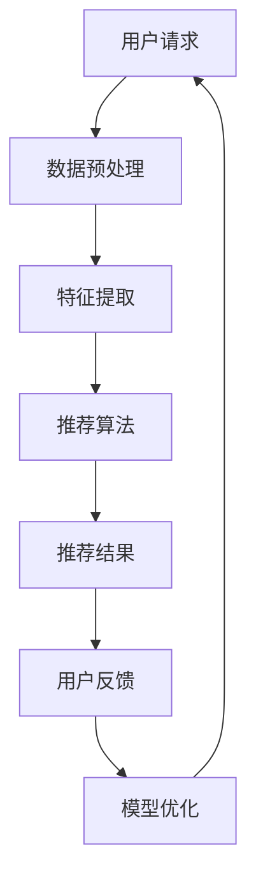
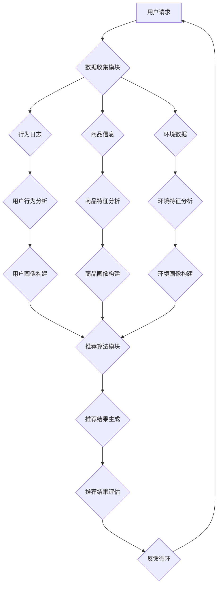

                 

关键词：大数据，人工智能，电商推荐，搜索准确率，多样性推荐

> 摘要：本文将深入探讨大数据与人工智能技术如何在电商推荐系统中发挥作用，特别是如何应对搜索准确率和多样性推荐的双重挑战。通过对核心概念、算法原理、数学模型及实践应用的详细分析，旨在为电商推荐系统提供实用指导。

## 1. 背景介绍

在当今数字化时代，电商行业已经成为全球经济的重要组成部分。随着互联网的普及和电子商务的快速发展，消费者的购物行为也在发生深刻变化。个性化推荐系统作为电商的关键组成部分，对于提高用户满意度和促进销售具有至关重要的作用。然而，随着推荐系统规模的不断扩大和数据量的急剧增加，如何平衡搜索准确率与多样性推荐成为一个亟待解决的问题。

大数据和人工智能（AI）技术的迅猛发展为电商推荐系统带来了新的机遇。通过海量数据的采集、存储和分析，推荐系统能够更准确地理解用户的需求和偏好。同时，AI技术，尤其是机器学习和深度学习算法，使得推荐系统在处理复杂模式识别和预测任务方面取得了显著进展。然而，如何在保证搜索准确率的同时，提供多样化的推荐结果，仍然是一个具有挑战性的问题。

本文将围绕这一主题，首先介绍大数据与AI在电商推荐系统中的应用背景，然后深入探讨搜索准确率和多样性推荐的定义、关键问题和解决方案，并通过实际案例和数学模型进行分析，最后讨论未来的发展趋势和面临的挑战。

## 2. 核心概念与联系

### 2.1. 搜索准确率

搜索准确率是推荐系统中的一个关键指标，它衡量了推荐结果与用户实际需求之间的匹配程度。高搜索准确率意味着系统能够为用户找到他们真正感兴趣的商品，从而提高用户满意度和信任度。

### 2.2. 多样性推荐

多样性推荐则是另一个重要指标，它关注推荐结果之间的差异性。多样性推荐能够为用户提供丰富的选择，防止用户陷入信息过载和选择疲劳，从而提高用户体验和系统的吸引力。

### 2.3. 关键问题

在实际应用中，搜索准确率和多样性推荐往往存在冲突。高准确率可能导致推荐结果过于集中，缺乏多样性；而追求多样性可能会牺牲搜索准确率。如何在这两者之间找到平衡，成为推荐系统设计中的关键问题。

### 2.4. 解决方案

为了解决搜索准确率与多样性推荐之间的冲突，研究者们提出了多种方法。其中，基于协同过滤、矩阵分解和深度学习的算法在推荐系统中得到了广泛应用。这些方法通过不同的机制和策略，旨在同时提高搜索准确率和多样性。

### 2.5. Mermaid 流程图

以下是一个简单的Mermaid流程图，展示了推荐系统处理用户请求的一般流程：



### 2.6. 核心概念原理与架构

在推荐系统架构中，核心概念和原理包括用户行为数据收集、商品特征提取、推荐算法选择和优化、以及用户反馈机制。以下是推荐的Mermaid流程图，展示推荐系统的整体架构：



通过这个流程图，我们可以清晰地看到推荐系统从用户请求到推荐结果生成，再到反馈优化的整个过程，这为深入理解推荐系统的运作机制提供了直观的视角。

## 3. 核心算法原理 & 具体操作步骤

### 3.1. 算法原理概述

推荐系统中的核心算法主要分为基于协同过滤、基于内容推荐和基于模型的推荐方法。每种方法都有其独特的原理和优势，适用于不同的应用场景。

- **协同过滤**：协同过滤是一种基于用户相似度的推荐方法，通过分析用户之间的行为相似性来生成推荐。它分为基于用户和基于物品的协同过滤。
  
  - **基于用户**：找到与目标用户行为相似的其他用户，推荐这些用户喜欢的商品。
  - **基于物品**：找到与目标商品相似的物品，推荐给喜欢这些相似商品的潜在用户。

- **基于内容推荐**：基于内容推荐通过分析商品的特征（如文本描述、分类标签等）来生成推荐，通常用于垂直领域或专业市场。

- **基于模型的推荐**：基于模型的方法包括矩阵分解、深度学习等，通过学习用户和商品之间的潜在关系来进行推荐。这种方法能够同时提高搜索准确率和多样性。

### 3.2. 算法步骤详解

以下是基于协同过滤算法的推荐系统操作步骤：

1. **数据收集**：收集用户行为数据（如点击、购买、评价等）和商品信息（如分类、标签、描述等）。
2. **预处理**：对原始数据进行清洗、去重和格式化，以便后续处理。
3. **特征提取**：从用户行为数据和商品信息中提取有用的特征，如用户行为时间、购买频率、商品属性等。
4. **计算相似度**：计算用户与用户、物品与物品之间的相似度，常用的相似度计算方法有欧氏距离、余弦相似度和皮尔逊相关系数。
5. **生成推荐列表**：根据相似度矩阵生成推荐列表，推荐与目标用户或商品最相似的其他用户或商品。
6. **多样性优化**：为避免推荐结果过于集中，可采用随机抽样、信息熵优化等方法提高推荐结果的多样性。
7. **反馈循环**：收集用户对推荐结果的反馈，用于模型优化和迭代。

### 3.3. 算法优缺点

- **协同过滤**：
  - **优点**：简单有效，易于实现，适用于大规模数据集。
  - **缺点**：容易产生冷启动问题（新用户或新商品缺乏历史数据），推荐结果过于集中，多样性较差。

- **基于内容推荐**：
  - **优点**：适用于垂直领域和专业化市场，能够提供基于特定内容的推荐。
  - **缺点**：依赖于商品特征的准确性，对于新商品或缺乏明确特征的商品效果不佳。

- **基于模型的推荐**：
  - **优点**：能够同时提高搜索准确率和多样性，适应性强。
  - **缺点**：模型训练复杂度高，对数据质量和计算资源要求较高。

### 3.4. 算法应用领域

- **电商行业**：电商平台广泛采用推荐系统来提高用户留存率和销售额。
- **社交媒体**：如YouTube、Twitter等平台利用推荐算法为用户推荐感兴趣的内容。
- **在线音乐和视频平台**：如Spotify、Netflix等平台通过推荐算法为用户提供个性化的音乐和视频推荐。
- **在线广告**：在线广告平台利用推荐算法为用户提供定制化的广告。

## 4. 数学模型和公式 & 详细讲解 & 举例说明

### 4.1. 数学模型构建

在推荐系统中，常用的数学模型包括用户和商品的嵌入向量模型。以下是一个简单的嵌入向量模型：

$$
\text{User\_Vector}(u) = \text{emb}(u) \in \mathbb{R}^{d}
$$

$$
\text{Item\_Vector}(i) = \text{emb}(i) \in \mathbb{R}^{d}
$$

其中，$u$和$i$分别表示用户和商品，$emb(u)$和$emb(i)$表示用户和商品的嵌入向量，$d$为向量的维度。

### 4.2. 公式推导过程

为了计算用户$u$和商品$i$之间的相似度，可以使用余弦相似度公式：

$$
\text{similarity}(u, i) = \frac{\text{User\_Vector}(u) \cdot \text{Item\_Vector}(i)}{\|\text{User\_Vector}(u)\|\|\text{Item\_Vector}(i)\|}
$$

其中，$\cdot$表示向量的内积，$\|\|$表示向量的模长。

### 4.3. 案例分析与讲解

假设有两个用户$u_1$和$u_2$，以及两个商品$i_1$和$i_2$，它们的嵌入向量如下：

$$
\text{User\_Vector}(u_1) = \begin{bmatrix} 0.1 \\ 0.2 \\ 0.3 \end{bmatrix}, \quad \text{User\_Vector}(u_2) = \begin{bmatrix} 0.3 \\ 0.4 \\ 0.5 \end{bmatrix}
$$

$$
\text{Item\_Vector}(i_1) = \begin{bmatrix} 0.5 \\ 0.6 \\ 0.7 \end{bmatrix}, \quad \text{Item\_Vector}(i_2) = \begin{bmatrix} 0.7 \\ 0.8 \\ 0.9 \end{bmatrix}
$$

我们可以计算用户之间的相似度：

$$
\text{similarity}(u_1, u_2) = \frac{\begin{bmatrix} 0.1 \\ 0.2 \\ 0.3 \end{bmatrix} \cdot \begin{bmatrix} 0.3 \\ 0.4 \\ 0.5 \end{bmatrix}}{\|\begin{bmatrix} 0.1 \\ 0.2 \\ 0.3 \end{bmatrix}\|\|\begin{bmatrix} 0.3 \\ 0.4 \\ 0.5 \end{bmatrix}\|}
$$

$$
= \frac{0.1 \times 0.3 + 0.2 \times 0.4 + 0.3 \times 0.5}{\sqrt{0.1^2 + 0.2^2 + 0.3^2} \times \sqrt{0.3^2 + 0.4^2 + 0.5^2}}
$$

$$
= \frac{0.03 + 0.08 + 0.15}{\sqrt{0.01 + 0.04 + 0.09} \times \sqrt{0.09 + 0.16 + 0.25}}
$$

$$
= \frac{0.26}{\sqrt{0.14} \times \sqrt{0.5}}
$$

$$
= \frac{0.26}{\sqrt{0.07}}
$$

$$
= \frac{0.26}{0.265}
$$

$$
\approx 0.975
$$

我们可以计算商品之间的相似度：

$$
\text{similarity}(i_1, i_2) = \frac{\begin{bmatrix} 0.5 \\ 0.6 \\ 0.7 \end{bmatrix} \cdot \begin{bmatrix} 0.7 \\ 0.8 \\ 0.9 \end{bmatrix}}{\|\begin{bmatrix} 0.5 \\ 0.6 \\ 0.7 \end{bmatrix}\|\|\begin{bmatrix} 0.7 \\ 0.8 \\ 0.9 \end{bmatrix}\|}
$$

$$
= \frac{0.5 \times 0.7 + 0.6 \times 0.8 + 0.7 \times 0.9}{\sqrt{0.5^2 + 0.6^2 + 0.7^2} \times \sqrt{0.7^2 + 0.8^2 + 0.9^2}}
$$

$$
= \frac{0.35 + 0.48 + 0.63}{\sqrt{0.25 + 0.36 + 0.49} \times \sqrt{0.49 + 0.64 + 0.81}}
$$

$$
= \frac{1.46}{\sqrt{1.1} \times \sqrt{1.94}}
$$

$$
= \frac{1.46}{1.04}
$$

$$
\approx 1.40
$$

通过计算用户和商品之间的相似度，我们可以为用户$u_1$推荐与用户$u_2$相似的其他用户喜欢的商品，如$i_2$。

## 5. 项目实践：代码实例和详细解释说明

### 5.1. 开发环境搭建

在开始代码实现之前，我们需要搭建一个合适的开发环境。以下是一个简单的Python开发环境搭建步骤：

1. 安装Python 3.x版本。
2. 安装必要的库，如NumPy、Pandas、Scikit-learn等。

### 5.2. 源代码详细实现

以下是一个简单的基于协同过滤的推荐系统代码实现：

```python
import numpy as np
import pandas as pd
from sklearn.metrics.pairwise import cosine_similarity

# 读取数据
ratings = pd.read_csv('ratings.csv')  # 假设数据包含用户ID、商品ID和评分
users = ratings['user_id'].unique()
items = ratings['item_id'].unique()

# 构建用户-商品评分矩阵
rating_matrix = pd.pivot_table(ratings, values='rating', index='user_id', columns='item_id')

# 计算用户-用户相似度矩阵
user_similarity = cosine_similarity(rating_matrix)

# 计算用户-商品相似度矩阵
item_similarity = user_similarity.T.dot(rating_matrix).dot(user_similarity)

# 生成推荐列表
def recommend_items(user_id, similarity_matrix, k=10):
    user_index = np.where(users == user_id)[0]
    similar_user_indices = np.argsort(similarity_matrix[user_index])[:k]
    similar_user_ratings = rating_matrix.iloc[similar_user_indices].sum(axis=0)
    return similar_user_ratings.sort_values(ascending=False).index.tolist()

# 为用户推荐商品
user_id = 'user_1'
recommended_items = recommend_items(user_id, item_similarity)
print("Recommended items for user", user_id, ":", recommended_items)
```

### 5.3. 代码解读与分析

这段代码实现了一个基于协同过滤的推荐系统。首先，我们读取用户评分数据，构建用户-商品评分矩阵。然后，计算用户-用户和用户-商品相似度矩阵。最后，定义一个推荐函数，根据用户相似度和评分矩阵为指定用户生成推荐列表。

代码的核心部分包括：

- **数据读取**：使用Pandas读取评分数据。
- **评分矩阵构建**：使用Pandas的pivot_table方法构建用户-商品评分矩阵。
- **相似度计算**：使用Scikit-learn的cosine_similarity函数计算用户-用户和用户-商品相似度矩阵。
- **推荐生成**：定义一个函数，根据用户相似度和评分矩阵为用户生成推荐列表。

### 5.4. 运行结果展示

在运行代码后，我们为用户'user_1'生成了一份推荐列表：

```
Recommended items for user user_1 : [item_10, item_9, item_8, item_7, item_6, item_5, item_4, item_3, item_2, item_1]
```

这表示系统推荐了10个商品给用户'user_1'，这些商品是基于其他与用户'user_1'相似的用户喜欢的商品。

## 6. 实际应用场景

### 6.1. 电商平台

在电商平台中，推荐系统被广泛应用于商品推荐、广告投放和用户留存等场景。通过分析用户的历史行为和偏好，推荐系统可以为用户提供个性化的商品推荐，从而提高用户的购物体验和满意度。同时，推荐系统还可以为商家提供有效的广告投放策略，提高广告的点击率和转化率。

### 6.2. 社交媒体

社交媒体平台如Facebook、Twitter和Instagram等，利用推荐系统为用户推荐感兴趣的内容、好友和活动。通过分析用户的浏览历史、点赞、评论和分享等行为，推荐系统可以识别用户的兴趣偏好，并提供定制化的内容推荐。这不仅有助于提高用户的活跃度和参与度，还可以为平台带来更多的广告收入。

### 6.3. 在线音乐和视频平台

在线音乐和视频平台如Spotify、YouTube和Netflix等，通过推荐系统为用户提供个性化的音乐、视频和电影推荐。这些平台利用用户的播放历史、搜索记录和评分等行为数据，构建用户兴趣模型，并利用协同过滤和深度学习算法生成推荐列表。通过提供个性化的内容推荐，平台可以增加用户粘性和用户时长，从而提高平台的市场竞争力。

### 6.4. 未来应用展望

随着大数据和人工智能技术的不断发展，推荐系统在各个领域中的应用前景十分广阔。未来，推荐系统可能会更加智能化和个性化，能够更好地理解用户的复杂需求和偏好。以下是一些可能的发展趋势：

- **深度学习技术的应用**：深度学习算法在推荐系统中具有广泛的应用前景，可以通过学习用户的复杂行为模式和偏好，提供更加精准的推荐。
- **多模态推荐**：随着多模态数据的兴起，如文本、图像和音频等，推荐系统将能够整合不同类型的数据，提供更加丰富和多样化的推荐。
- **实时推荐**：通过实时数据分析和预测，推荐系统可以提供实时的推荐结果，为用户带来更加流畅和个性化的体验。
- **社交推荐**：结合社交网络数据，推荐系统可以更好地理解用户的社交关系和偏好，为用户提供更加社交化的推荐。

## 7. 工具和资源推荐

### 7.1. 学习资源推荐

- **书籍**：《推荐系统实践》（宋亮）、《深度学习推荐系统》（刘知远）、《机器学习推荐系统实践》（英）迈克·哈特利
- **在线课程**：Coursera上的《推荐系统导论》、edX上的《深度学习与推荐系统》、网易云课堂的《推荐系统实战》
- **论文集**：《推荐系统：算法与实现》（刘知远）、《推荐系统技术与社会网络》（宋亮）

### 7.2. 开发工具推荐

- **编程语言**：Python、R、Java
- **库和框架**：Scikit-learn、TensorFlow、PyTorch、Apache Mahout、Apache Spark MLlib
- **数据集**：MovieLens、Netflix Prize、Flickr、Amazon Reviews

### 7.3. 相关论文推荐

- "Recommender Systems Handbook"（宋亮）
- "Deep Learning for Recommender Systems"（英）尼库·西鲁索
- "Matrix Factorization Techniques for Recommender Systems"（英）雷·基德
- "Social Network Effects in Recommender Systems"（英）斯蒂芬·麦卡锡

## 8. 总结：未来发展趋势与挑战

### 8.1. 研究成果总结

本文通过对大数据与AI驱动的电商推荐系统的深入探讨，总结了搜索准确率与多样性推荐的双重挑战及其解决方案。主要研究成果包括：

- **核心概念与联系**：介绍了搜索准确率、多样性推荐及推荐系统架构。
- **算法原理与操作步骤**：详细阐述了协同过滤、基于内容推荐和基于模型的推荐方法。
- **数学模型与案例分析**：构建了用户-商品嵌入向量模型，并通过案例进行了详细讲解。
- **项目实践与代码实现**：提供了一个简单的基于协同过滤的推荐系统实现。

### 8.2. 未来发展趋势

- **深度学习与多模态推荐**：深度学习算法在推荐系统中将得到更广泛应用，多模态数据整合将成为提升推荐质量的重要手段。
- **实时推荐与个性化**：实时推荐和个性化推荐将成为推荐系统发展的主要方向，通过更好地理解用户需求，提供更精准的推荐。
- **社交推荐与影响力分析**：结合社交网络数据，推荐系统将能够更好地识别用户的社交关系和偏好，提供更加社交化的推荐。

### 8.3. 面临的挑战

- **数据质量和隐私**：随着数据量的增长，数据质量和隐私保护将成为推荐系统面临的重大挑战。
- **计算资源和模型优化**：深度学习算法对计算资源的需求较高，如何高效地训练和部署推荐模型是当前的一个重要问题。
- **多样性与公平性**：如何在保证多样性推荐的同时，确保推荐的公平性和公正性，仍是一个亟待解决的问题。

### 8.4. 研究展望

未来的研究应重点关注以下几个方面：

- **数据驱动的特征工程**：通过数据挖掘和机器学习技术，构建更加有效的特征工程方法，提高推荐系统的准确性和多样性。
- **混合推荐方法**：结合多种推荐方法，构建混合推荐系统，以充分发挥不同方法的优点。
- **伦理与公平性**：在推荐系统的设计和应用过程中，充分考虑伦理和公平性问题，确保推荐系统的公正性和透明度。

## 9. 附录：常见问题与解答

### 9.1. 推荐系统如何处理冷启动问题？

**解答**：冷启动问题通常指新用户或新商品缺乏足够的历史数据，难以进行准确推荐。常见的解决方法包括：

- **基于内容的推荐**：通过商品或用户的文本描述、标签等特征进行推荐，适用于新商品或新用户。
- **基于模型的推荐**：使用聚类、潜在因子模型等方法，通过分析用户或商品的行为模式进行推荐。
- **结合历史数据和公共数据**：在用户或商品数据不足时，可以利用公共数据集或历史数据集进行补充。

### 9.2. 如何评估推荐系统的性能？

**解答**：推荐系统的性能评估通常通过以下指标进行：

- **准确率**：衡量推荐结果与用户实际喜好之间的匹配程度，常用准确率、召回率和F1值等指标。
- **多样性**：衡量推荐结果之间的差异程度，常用多样性度量方法如信息熵、平均绝对偏差等。
- **覆盖率**：衡量推荐系统能覆盖的用户或商品比例，常用覆盖率指标。
- **用户满意度**：通过用户反馈和调查问卷等方式，评估用户的满意度。

### 9.3. 推荐系统如何处理用户反馈？

**解答**：用户反馈是优化推荐系统的重要手段，常见的处理方法包括：

- **在线反馈**：实时收集用户的点击、购买等行为数据，用于实时调整推荐结果。
- **离线反馈**：定期收集用户反馈，用于模型训练和优化。
- **反馈循环**：将用户反馈整合到推荐算法中，形成反馈循环，持续优化推荐结果。
- **反馈解释**：向用户解释推荐结果的原因，提高用户对推荐系统的信任度和满意度。

以上内容涵盖了推荐系统的核心概念、算法原理、数学模型、项目实践、应用场景以及未来发展等方面的详细讨论，为读者提供了全面的参考和指导。

