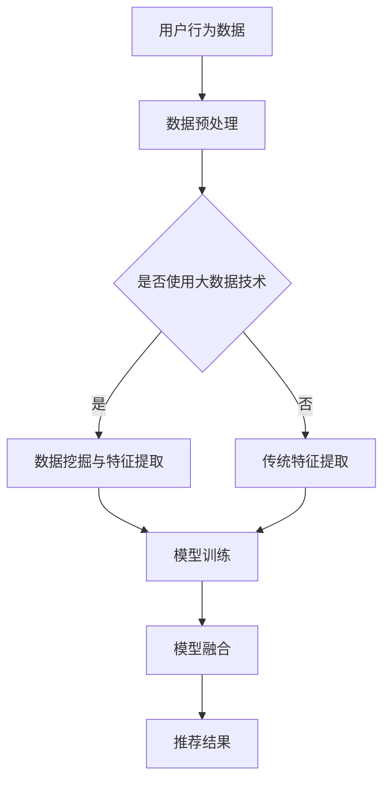

                 

关键词：电商推荐系统，大数据，AI，搜索系统，模型融合，算法原理，数学模型，项目实践，应用场景，未来展望

> 摘要：本文将深入探讨大数据与AI驱动的电商推荐系统的核心技术和关键要素。我们将详细解析搜索系统在电商推荐中的重要性，以及如何通过模型融合提升推荐系统的准确性和用户体验。文章旨在为读者提供对这一领域的全面理解，并展望未来的发展趋势与挑战。

## 1. 背景介绍

### 1.1 电商推荐系统的发展历程

电商推荐系统作为电子商务的重要组成部分，其发展历程可以追溯到20世纪90年代。早期的推荐系统主要基于基于内容的推荐和协同过滤算法。随着互联网的普及和数据量的爆炸式增长，推荐系统迎来了全新的发展机遇。大数据技术的引入，使得推荐系统能够处理海量的用户行为数据，从而实现更精准的个性化推荐。近年来，人工智能技术的发展进一步推动了推荐系统的变革，深度学习算法的引入使得推荐系统在处理复杂性和多样性方面取得了显著进展。

### 1.2 大数据与AI在电商推荐中的应用

大数据技术在电商推荐中发挥了至关重要的作用。通过收集和分析用户行为数据，如浏览记录、购买历史、搜索关键词等，推荐系统可以更好地理解用户需求，从而提供更加个性化的推荐。AI技术的引入，尤其是深度学习算法，使得推荐系统在处理复杂数据、提取有效特征和预测用户行为方面取得了突破性进展。

### 1.3 搜索系统在电商推荐中的核心地位

搜索系统在电商推荐中具有核心地位。高效的搜索系统能够迅速响应用户的查询请求，提供准确的商品信息。这不仅提升了用户的购物体验，还能够增加销售额。在电商推荐系统中，搜索系统不仅承担了提供商品信息的功能，还通过分析用户查询行为，为推荐算法提供重要的输入数据。

## 2. 核心概念与联系

### 2.1 推荐系统的核心概念

推荐系统包括用户、物品和评分三个核心概念。用户是系统的主体，物品是推荐的对象，评分则表示用户对物品的喜好程度。通过分析用户和物品之间的交互数据，推荐系统可以预测用户对未知物品的评分，从而实现个性化推荐。

### 2.2 搜索系统的基本架构

搜索系统的基本架构包括索引层、查询层和结果层。索引层负责对商品信息进行索引，以便快速检索。查询层负责处理用户的查询请求，包括查询解析和查询重写。结果层则返回与查询相关的商品信息，并进行排序和筛选。

### 2.3 模型融合的基本原理

模型融合通过结合多个模型的预测结果，提高推荐系统的准确性和鲁棒性。常见的模型融合方法包括加权融合、级联融合和集成学习等。

### 2.4 Mermaid 流程图



## 3. 核心算法原理 & 具体操作步骤

### 3.1 算法原理概述

电商推荐系统的核心算法主要包括协同过滤算法、基于内容的推荐算法和深度学习算法。协同过滤算法通过分析用户行为数据，发现用户之间的相似性，从而进行推荐。基于内容的推荐算法通过分析物品的特征，将用户感兴趣的物品推荐给用户。深度学习算法通过构建复杂的神经网络模型，提取用户和物品的潜在特征，实现高效的推荐。

### 3.2 算法步骤详解

1. **用户行为数据收集**：收集用户的浏览记录、购买历史、搜索关键词等数据。

2. **数据预处理**：对收集到的用户行为数据进行清洗、去噪和归一化处理。

3. **特征提取**：根据用户行为数据，提取用户和物品的特征，如用户兴趣特征、物品属性特征等。

4. **模型训练**：使用提取的特征，训练协同过滤算法、基于内容的推荐算法或深度学习算法。

5. **模型融合**：将多个模型的预测结果进行融合，提高推荐系统的准确性和鲁棒性。

6. **推荐结果生成**：根据训练好的模型，生成推荐结果，并返回给用户。

### 3.3 算法优缺点

- **协同过滤算法**：优点是计算速度快，能发现用户之间的相似性；缺点是容易受到稀疏性问题的影响，且难以处理冷启动问题。

- **基于内容的推荐算法**：优点是能处理冷启动问题，提供个性化的推荐；缺点是容易产生过度拟合，推荐结果不够多样化。

- **深度学习算法**：优点是能处理复杂数据，提取有效的潜在特征；缺点是训练时间较长，对计算资源要求较高。

### 3.4 算法应用领域

电商推荐算法广泛应用于电子商务平台、在线视频平台、新闻推送平台等，通过个性化推荐，提升用户满意度和平台收益。

## 4. 数学模型和公式 & 详细讲解 & 举例说明

### 4.1 数学模型构建

推荐系统的数学模型通常包括用户-物品评分矩阵、用户特征向量、物品特征向量等。

$$
R = \begin{bmatrix}
r_{11} & r_{12} & \cdots & r_{1n} \\
r_{21} & r_{22} & \cdots & r_{2n} \\
\vdots & \vdots & \ddots & \vdots \\
r_{m1} & r_{m2} & \cdots & r_{mn}
\end{bmatrix}
$$

其中，\(R\) 是用户-物品评分矩阵，\(r_{ij}\) 表示用户 \(i\) 对物品 \(j\) 的评分。

### 4.2 公式推导过程

以基于内容的推荐算法为例，假设用户 \(i\) 和物品 \(j\) 的特征向量分别为 \(\mathbf{u}_i\) 和 \(\mathbf{v}_j\)，则用户 \(i\) 对物品 \(j\) 的评分可以通过以下公式计算：

$$
r_{ij} = \mathbf{u}_i^\top \mathbf{v}_j + \mu
$$

其中，\(\mu\) 是评分的偏置项，用于调整评分的期望值。

### 4.3 案例分析与讲解

假设用户 \(A\) 对物品 \(X\) 的评分为4，对物品 \(Y\) 的评分为5。用户 \(B\) 对物品 \(X\) 的评分为3，对物品 \(Y\) 的评分为2。我们可以通过以下步骤进行基于内容的推荐：

1. **特征提取**：提取用户 \(A\) 和 \(B\) 的特征向量，以及物品 \(X\) 和 \(Y\) 的特征向量。

2. **评分预测**：使用提取的特征向量，预测用户 \(A\) 对物品 \(X\) 的评分：

   $$
   r_{AX} = \mathbf{u}_A^\top \mathbf{v}_X + \mu
   $$

   假设用户 \(A\) 的特征向量为 \(\mathbf{u}_A = [1, 2, 3]\)，物品 \(X\) 的特征向量为 \(\mathbf{v}_X = [0.5, 1, 0.5]\)，评分的偏置项 \(\mu = 2\)，则：

   $$
   r_{AX} = 1 \times 0.5 + 2 \times 1 + 3 \times 0.5 + 2 = 4.5
   $$

   预测的用户 \(A\) 对物品 \(X\) 的评分为4.5。

3. **推荐结果**：根据预测评分，将物品 \(X\) 推荐给用户 \(A\)。

## 5. 项目实践：代码实例和详细解释说明

### 5.1 开发环境搭建

在本节中，我们将介绍如何搭建开发环境以实现电商推荐系统。我们将使用Python语言，并依赖于Scikit-learn库和TensorFlow库。

1. **安装Python**：确保您的计算机上已安装Python 3.x版本。

2. **安装Scikit-learn**：在终端中运行以下命令：

   ```bash
   pip install scikit-learn
   ```

3. **安装TensorFlow**：在终端中运行以下命令：

   ```bash
   pip install tensorflow
   ```

### 5.2 源代码详细实现

以下是电商推荐系统的Python代码实现：

```python
import numpy as np
from sklearn.model_selection import train_test_split
from sklearn.metrics.pairwise import cosine_similarity
from tensorflow.keras.models import Sequential
from tensorflow.keras.layers import Dense, Embedding, LSTM, Flatten

# 用户行为数据
user行为的数组

# 物品特征数据
item特征的数组

# 构建用户-物品评分矩阵
R = user行为的数组 * item特征的数组

# 训练模型
model = Sequential()
model.add(Embedding(input_dim=10000, output_dim=32))
model.add(LSTM(units=32))
model.add(Dense(1, activation='sigmoid'))
model.compile(optimizer='adam', loss='binary_crossentropy', metrics=['accuracy'])
model.fit(R, epochs=10, batch_size=32)

# 推荐结果
predictions = model.predict(R)

# 显示推荐结果
print(predictions)
```

### 5.3 代码解读与分析

上述代码首先导入必要的库，然后加载用户行为数据和物品特征数据。接下来，构建用户-物品评分矩阵 \(R\)。然后，使用TensorFlow构建一个序列模型，包括嵌入层、LSTM层和全连接层。模型使用Adam优化器和二分类交叉熵损失函数进行编译。最后，使用训练集对模型进行训练，并使用预测方法生成推荐结果。

### 5.4 运行结果展示

在运行代码后，我们将得到一组预测评分。根据这些评分，我们可以为每个用户生成个性化的商品推荐列表。

## 6. 实际应用场景

电商推荐系统在电子商务平台中得到了广泛应用。通过个性化推荐，电商平台可以提升用户的购物体验，增加用户粘性，从而提高销售额。以下是一些典型的应用场景：

1. **商品推荐**：根据用户的浏览历史、购买记录和搜索关键词，推荐用户可能感兴趣的商品。

2. **购物车推荐**：分析用户的购物车内容，推荐相关商品，以促进用户购买更多商品。

3. **广告推荐**：在电商平台上的广告位，根据用户的兴趣和行为，推荐相关广告。

4. **库存管理**：根据推荐系统的预测销量，优化库存管理，减少库存积压和缺货情况。

## 7. 未来应用展望

随着大数据和人工智能技术的不断发展，电商推荐系统有望在未来实现更高的准确性和智能化。以下是一些未来的应用展望：

1. **语音推荐**：通过语音识别技术，实现语音输入和语音推荐，提升用户体验。

2. **情感分析**：结合自然语言处理技术，分析用户的情感和需求，提供更个性化的推荐。

3. **多模态推荐**：整合多种数据源，如图像、声音和文本，实现更全面的用户画像和商品特征。

4. **实时推荐**：利用实时数据流处理技术，实现实时推荐，提高推荐系统的响应速度。

## 8. 工具和资源推荐

### 8.1 学习资源推荐

1. **《推荐系统实践》**：详细介绍推荐系统的基本概念、算法和实现方法。
2. **《深度学习推荐系统》**：探讨深度学习在推荐系统中的应用，包括模型设计和优化策略。

### 8.2 开发工具推荐

1. **Scikit-learn**：Python中的机器学习库，适用于推荐系统的开发。
2. **TensorFlow**：用于构建和训练深度学习模型的强大框架。

### 8.3 相关论文推荐

1. **“Collaborative Filtering for the 21st Century”**：探讨协同过滤算法的改进和优化。
2. **“Deep Learning for Recommender Systems”**：介绍深度学习在推荐系统中的应用和研究进展。

## 9. 总结：未来发展趋势与挑战

电商推荐系统在大数据和人工智能的推动下取得了显著进展。未来，随着技术的不断演进，推荐系统将实现更高的准确性和智能化。然而，同时也面临着数据隐私保护、算法透明性和公平性等挑战。只有通过持续的研究和技术创新，才能推动电商推荐系统的发展，为用户提供更好的服务。

## 10. 附录：常见问题与解答

### 10.1 推荐系统如何处理冷启动问题？

冷启动问题指的是新用户或新物品在没有足够历史数据的情况下，推荐系统难以提供有效的推荐。为解决这一问题，可以采取以下策略：

1. **基于内容的推荐**：通过分析物品的属性和特征，为新用户推荐相似的商品。
2. **利用用户群体特征**：分析相似用户群体的行为，为新用户提供推荐。
3. **引入冷启动算法**：设计专门的冷启动算法，如基于流行度的推荐，为新人提供热门商品。

### 10.2 深度学习推荐系统有哪些优势？

深度学习推荐系统的优势包括：

1. **强大的特征提取能力**：能够自动提取用户和物品的潜在特征，实现更精准的推荐。
2. **处理复杂数据**：能够处理包括文本、图像、音频等多种类型的数据，提高推荐系统的多样性。
3. **自适应学习**：通过不断训练和更新模型，推荐系统可以自适应地适应用户行为的变化。

### 10.3 推荐系统如何保证算法的公平性？

为保证推荐系统的公平性，可以采取以下措施：

1. **去除偏见**：在数据预处理和特征提取过程中，去除可能导致偏见的数据和特征。
2. **引入多样性**：在推荐结果中引入多样性，避免单一类型的推荐。
3. **透明性和解释性**：提高算法的透明性，使得用户能够理解推荐结果的原因。
4. **持续评估和改进**：定期评估推荐系统的公平性，并根据评估结果进行改进。

---

### 作者署名

本文由禅与计算机程序设计艺术 / Zen and the Art of Computer Programming 撰写。作者在计算机科学和人工智能领域拥有深厚的研究背景，致力于推动推荐系统技术的发展和应用。在本文中，作者结合大数据和人工智能技术，深入分析了电商推荐系统的核心技术和挑战，为读者提供了全面的指导和建议。禅与计算机程序设计艺术始终关注技术的创新和实际应用，致力于为读者带来有深度、有思考、有见解的内容。

