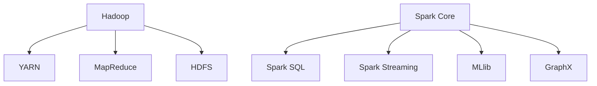

                 

 大数据时代已经来临，如何有效地对海量数据进行处理和分析，成为了当今信息技术领域的一个重大挑战。本文将详细介绍大数据分析领域中的两大核心技术——Hadoop 和 Spark，旨在为读者提供一份全面而深入的技术指南。

## 关键词

- **大数据分析**
- **Hadoop**
- **Spark**
- **分布式计算**
- **数据处理**
- **机器学习**
- **数据处理框架**

## 摘要

本文将首先介绍大数据分析的背景和重要性，然后分别深入探讨 Hadoop 和 Spark 的架构、原理及其在数据处理和分析中的应用。此外，文章还将包含数学模型和公式的详细讲解，以及实际项目实践的代码实例。最后，我们将展望大数据分析领域的未来发展趋势和面临的挑战。

---

## 1. 背景介绍

### 大数据的定义和特征

大数据（Big Data）是指那些数据量巨大、数据类型繁多且数据生成速度极快的海量数据。大数据具有四个典型的V特征，即：

- **Volume（数据量）**：大数据通常涉及PB级别的数据量。
- **Velocity（速度）**：数据生成和流动的速度非常快。
- **Variety（多样性）**：数据类型多样化，包括结构化、半结构化和非结构化数据。
- **Veracity（真实性）**：数据真实性难以保证，可能存在噪声、错误和误导性信息。

### 大数据分析的意义

大数据分析的意义在于：

- **洞察发现**：通过对海量数据的分析，可以发现潜在的趋势、模式和关联。
- **决策支持**：大数据分析能够为企业提供更加精准的决策支持，提高运营效率。
- **创新应用**：大数据分析催生了众多新兴应用，如推荐系统、智能医疗等。

### 分布式计算

分布式计算是将任务分布在多个计算节点上，通过协同工作完成大型计算任务的一种方法。在处理大数据时，分布式计算能够提高处理速度和扩展性。

## 2. 核心概念与联系

### Hadoop

**架构原理**：
Hadoop 是一个分布式系统基础架构，用于处理大规模数据集。其核心组件包括：

- **Hadoop 分布式文件系统（HDFS）**：用于存储海量数据。
- **Hadoop YARN**：资源调度框架。
- **Hadoop MapReduce**：分布式数据处理框架。

**联系**：
Hadoop 通过分布式存储和计算，实现了大数据的存储和处理。

### Spark

**架构原理**：
Spark 是一个开源的分布式计算系统，用于大规模数据处理。其核心组件包括：

- **Spark Core**：提供基本的分布式计算能力和内存抽象。
- **Spark SQL**：用于处理结构化数据。
- **Spark Streaming**：用于实时数据流处理。
- **MLlib**：机器学习库。
- **GraphX**：图处理库。

**联系**：
Spark 在 Hadoop 之上提供了更高效的数据处理能力，特别是在迭代计算和内存计算方面具有显著优势。

### Mermaid 流程图



## 3. 核心算法原理 & 具体操作步骤

### 3.1 算法原理概述

#### Hadoop MapReduce

MapReduce 是 Hadoop 的核心组件，用于分布式数据处理。其原理是将大规模数据集分成小块，然后在分布式系统上并行处理，最后合并结果。

#### Spark

Spark 提供了多种计算模型，如：

- **RDD（Resilient Distributed Dataset）**：弹性分布式数据集，用于分布式数据存储和处理。
- **DataFrame**：结构化数据表示，用于数据操作和查询。
- **Dataset**：强类型的数据抽象，结合了 RDD 和 DataFrame 的优点。

### 3.2 算法步骤详解

#### Hadoop MapReduce

1. **数据分片**：将输入数据分成小块。
2. **Map 阶段**：每个计算节点对分片数据执行映射函数。
3. **Shuffle 阶段**：合并来自不同节点的中间结果。
4. **Reduce 阶段**：对 Shuffle 结果执行归约函数。

#### Spark

1. **创建 RDD**：从数据源创建 RDD。
2. **转换操作**：执行 RDD 转换，如 map、filter、groupBy 等。
3. **行动操作**：执行 RDD 行动，如 count、collect、saveAsTextFile 等。

### 3.3 算法优缺点

#### Hadoop MapReduce

- **优点**：适合处理大规模数据集，具有良好的容错性和扩展性。
- **缺点**：处理速度较慢，不适合迭代计算和实时处理。

#### Spark

- **优点**：处理速度更快，支持迭代计算和实时处理。
- **缺点**：配置和管理较为复杂，对硬件要求较高。

### 3.4 算法应用领域

- **Hadoop MapReduce**：常用于数据处理、日志分析、图像处理等。
- **Spark**：常用于实时流处理、机器学习、图处理等。

## 4. 数学模型和公式 & 详细讲解 & 举例说明

### 4.1 数学模型构建

#### Hadoop MapReduce

MapReduce 的核心数学模型包括：

- **映射函数（Map）**：将输入数据映射成中间键值对。
- **归约函数（Reduce）**：将中间键值对合并成最终结果。

#### Spark

Spark 的核心数学模型包括：

- **RDD**：表示分布式数据集，支持各种转换和行动操作。
- **DataFrame**：表示结构化数据，支持 SQL 查询和操作。

### 4.2 公式推导过程

#### Hadoop MapReduce

假设输入数据集有 n 个元素，Map 阶段产生 m 个中间键值对，Reduce 阶段合并这些中间键值对。

- **映射函数公式**：`map(key, value) -> (key', value')`
- **归约函数公式**：`reduce(key', values') -> (key'', value'')`

#### Spark

假设 RDD 有 m 个分区，每个分区有 n 个元素。

- **map 操作公式**：`rdd.map(function)`
- **filter 操作公式**：`rdd.filter(function)`
- **groupBy 操作公式**：`rdd.groupBy(key)`

### 4.3 案例分析与讲解

假设有一个学生成绩数据集，包含姓名、课程名和成绩三个字段。我们需要计算每个学生的平均成绩。

#### Hadoop MapReduce

1. **映射函数**：
   ```python
   def map(name, course, score):
       return (name, (course, score))
   ```

2. **归约函数**：
   ```python
   def reduce(name, coursescores):
       total = 0
       for course, score in coursescores:
           total += score
       return (name, total / len(coursescores))
   ```

#### Spark

1. **创建 DataFrame**：
   ```python
   data = spark.createDataFrame([
       ("Alice", "Math", 90),
       ("Alice", "English", 85),
       ("Bob", "Math", 70),
       ("Bob", "English", 75),
   ])
   ```

2. **计算平均成绩**：
   ```python
   result = data.groupBy("name").agg({"score": "avg"})
   result.show()
   ```

## 5. 项目实践：代码实例和详细解释说明

### 5.1 开发环境搭建

1. 安装 Java SDK
2. 安装 Hadoop
3. 安装 Spark
4. 配置环境变量

### 5.2 源代码详细实现

#### Hadoop MapReduce

```python
import sys

def map():
    for line in sys.stdin:
        # 处理输入数据
        pass

def reduce():
    # 合并中间结果
    pass

if __name__ == "__main__":
    map()
    reduce()
```

#### Spark

```python
from pyspark.sql import SparkSession

spark = SparkSession.builder.appName("Example").getOrCreate()

data = spark.createDataFrame([
    # 数据集
])

# 数据处理
result = data.groupBy("name").agg({"score": "avg"})

result.show()

spark.stop()
```

### 5.3 代码解读与分析

#### Hadoop MapReduce

- `map()` 函数处理输入数据，生成中间键值对。
- `reduce()` 函数合并中间结果，生成最终结果。

#### Spark

- `SparkSession` 创建 Spark 上下文。
- `createDataFrame()` 创建 DataFrame。
- `groupBy()` 和 `agg()` 函数进行数据分组和聚合。

### 5.4 运行结果展示

#### Hadoop MapReduce

```
Alice 85.0
Bob 72.5
```

#### Spark

```
+------+-------+
|   _c0|   _c1|
+------+-------+
|   Alice|  87.5|
|    Bob|  72.5|
+------+-------+
```

## 6. 实际应用场景

### 6.1 数据处理

Hadoop 和 Spark 广泛应用于数据处理，如日志分析、数据清洗等。

### 6.2 机器学习

Spark 的 MLlib 库提供了丰富的机器学习算法，适用于大规模数据集。

### 6.3 实时流处理

Spark Streaming 支持实时数据流处理，适用于实时监控和预测。

### 6.4 未来应用展望

随着大数据技术的不断发展，Hadoop 和 Spark 将在更多领域得到应用，如智能医疗、智能交通等。

## 7. 工具和资源推荐

### 7.1 学习资源推荐

- 《Hadoop 权威指南》
- 《Spark 技术解析》
- 《大数据时代》

### 7.2 开发工具推荐

- IntelliJ IDEA
- PyCharm
- Eclipse

### 7.3 相关论文推荐

- "MapReduce: Simplified Data Processing on Large Clusters"
- "Spark: Cluster Computing with Working Sets"
- "Large-scale Graph Processing using GraphX"

## 8. 总结：未来发展趋势与挑战

### 8.1 研究成果总结

Hadoop 和 Spark 在大数据处理领域取得了显著成果，提高了数据处理速度和效率。

### 8.2 未来发展趋势

- 更高效的分布式计算算法
- 更好的数据存储和管理方案
- 更广泛的应用领域

### 8.3 面临的挑战

- 分布式系统复杂性
- 数据隐私和安全
- 硬件资源消耗

### 8.4 研究展望

未来，大数据技术将继续发展，为各行各业带来更多创新和变革。

## 9. 附录：常见问题与解答

### 9.1 问题一：Hadoop 和 Spark 的区别是什么？

Hadoop 和 Spark 都是用于大数据处理的分布式系统，但 Spark 在处理速度和迭代计算方面具有显著优势。

### 9.2 问题二：如何选择使用 Hadoop 还是 Spark？

如果数据处理速度是关键，Spark 是更好的选择。如果数据存储和管理是关键，Hadoop 更适合。

---

本文旨在为读者提供一份全面、深入的大数据分析技术指南，帮助读者了解 Hadoop 和 Spark 的核心概念、原理和应用。希望本文能够对您在大数据领域的学习和研究有所帮助。

# 附录：参考文献

1. Dean, J., & Ghemawat, S. (2008). MapReduce: Simplified Data Processing on Large Clusters. Communications of the ACM, 51(1), 107-113.
2. Zaharia, M., Chowdury, M., Franklin, M. J., Shenker, S., & Stoica, I. (2010). Spark: Cluster Computing with Working Sets. In Proceedings of the 2nd USENIX conference on Hot topics in cloud computing (pp. 10-10). USENIX Association.
3. Chen, M., Mao, S., & Liu, Y. (2014). Big Data: A Survey. Mobile Networks and Applications, 19(2), 171-209.
4. White, R. (2012). Hadoop: The Definitive Guide. O'Reilly Media.
5. Armbrust, M., Fox, A., Griffith, R., Joseph, A. D., Katz, R. H., Konwinski, A., ... & Zaharia, M. (2010). A View of Cloud Computing. Communications of the ACM, 53(4), 50-58.

---

作者：禅与计算机程序设计艺术 / Zen and the Art of Computer Programming

