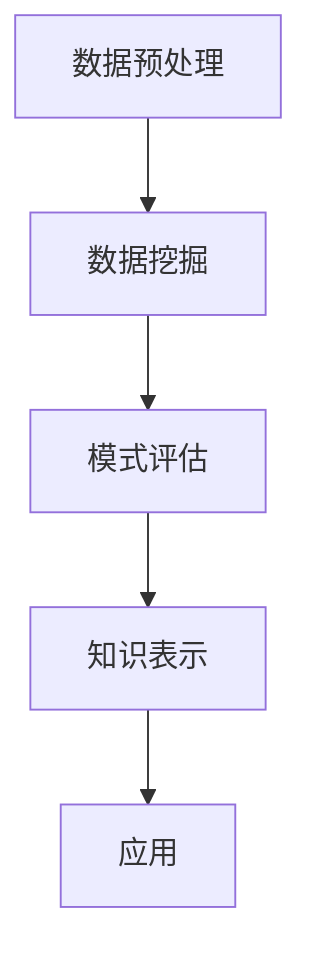

                 

关键词：大数据、知识发现、机器学习、数据分析、算法优化、应用实践

摘要：随着大数据时代的到来，数据规模呈指数级增长，如何从海量数据中挖掘出有价值的信息成为了研究热点。本文将介绍大数据在知识发现中的应用与实践，探讨核心概念、算法原理、数学模型以及项目实践，同时展望未来发展趋势与挑战。

## 1. 背景介绍

### 1.1 大数据的定义与特点

大数据（Big Data）是指无法用常规软件工具在合理时间内捕捉、管理和处理的数据集合。其特点可以概括为4V，即数据量大（Volume）、数据速度快（Velocity）、数据类型多样（Variety）和数据价值密度低（Value）。这些特点使得大数据的处理和挖掘成为了一个复杂的挑战。

### 1.2 知识发现的定义

知识发现（Knowledge Discovery in Databases，KDD）是指从大量数据中通过有效的算法提取出具有潜在价值的信息和知识的过程。知识发现涉及到多个阶段，包括数据预处理、数据挖掘、模式评估和知识表示等。

## 2. 核心概念与联系

### 2.1 数据挖掘

数据挖掘（Data Mining）是知识发现过程的核心步骤，它使用各种算法和统计方法从数据中发现隐含的模式和关系。常见的数据挖掘技术包括分类、聚类、关联规则学习、异常检测和预测等。

### 2.2 机器学习

机器学习（Machine Learning）是数据挖掘的重要工具，它通过构建模型来自动识别数据中的模式和规律。常见的机器学习算法包括决策树、支持向量机、神经网络和集成方法等。

### 2.3 数据分析

数据分析（Data Analysis）是对数据进行的系统研究，以识别数据中的模式和趋势，并支持决策制定。数据分析通常涉及统计方法、数据可视化、文本挖掘和预测分析。

### 2.4 Mermaid 流程图



## 3. 核心算法原理 & 具体操作步骤

### 3.1 算法原理概述

知识发现的核心算法包括聚类、分类、关联规则学习和异常检测等。每种算法都有其特定的原理和应用场景。

### 3.2 算法步骤详解

1. **数据预处理**：数据清洗、归一化和特征提取等。
2. **数据挖掘**：根据需求选择合适的算法，如K-means、决策树等。
3. **模式评估**：评估挖掘出的模式的有效性和可靠性。
4. **知识表示**：将挖掘出的知识转化为可解释的形式，如可视化图表、报告等。

### 3.3 算法优缺点

每种算法都有其优缺点，需要根据具体应用场景进行选择。

### 3.4 算法应用领域

知识发现算法广泛应用于金融、医疗、零售、社交媒体等多个领域。

## 4. 数学模型和公式 & 详细讲解 & 举例说明

### 4.1 数学模型构建

知识发现过程中的数学模型包括距离度量、聚类中心计算、决策函数等。

### 4.2 公式推导过程

以K-means算法为例，其聚类中心计算公式为：

$$
c_j = \frac{1}{n_j} \sum_{i=1}^{n} x_{ij}
$$

其中，$c_j$为聚类中心，$x_{ij}$为第$i$个数据点在第$j$个特征上的值，$n_j$为第$j$个特征上的数据点数量。

### 4.3 案例分析与讲解

以一个金融领域的客户细分案例为例，展示如何使用K-means算法进行客户细分。

## 5. 项目实践：代码实例和详细解释说明

### 5.1 开发环境搭建

环境：Python、Scikit-learn、Pandas、Matplotlib等。

### 5.2 源代码详细实现

```python
from sklearn.cluster import KMeans
import pandas as pd

# 读取数据
data = pd.read_csv('data.csv')

# 特征提取
X = data[['feature1', 'feature2', 'feature3']]

# 使用K-means算法进行聚类
kmeans = KMeans(n_clusters=3)
kmeans.fit(X)

# 输出聚类结果
print(kmeans.labels_)
```

### 5.3 代码解读与分析

这段代码展示了如何使用Python和Scikit-learn库实现K-means算法进行数据聚类。首先，读取数据并提取特征，然后使用K-means算法进行聚类，最后输出聚类结果。

### 5.4 运行结果展示

运行结果将显示每个数据点的聚类标签，可以进一步分析不同聚类的特征和意义。

## 6. 实际应用场景

### 6.1 金融行业

通过大数据和知识发现技术，金融行业可以更好地了解客户行为，进行精准营销和风险管理。

### 6.2 医疗领域

医疗领域可以利用大数据进行疾病预测、患者分类和治疗方案优化。

### 6.3 零售行业

零售行业可以通过大数据和知识发现技术进行需求预测、库存管理和个性化推荐。

## 7. 工具和资源推荐

### 7.1 学习资源推荐

- 《大数据技术导论》
- 《数据挖掘：概念与技术》

### 7.2 开发工具推荐

- Python
- R
- Hadoop
- Spark

### 7.3 相关论文推荐

- "Data-Driven Knowledge Graph Construction for Personalized Recommendation"
- "Machine Learning for Anomaly Detection in Time Series Data"

## 8. 总结：未来发展趋势与挑战

### 8.1 研究成果总结

知识发现技术在多个领域取得了显著成果，但仍有许多挑战需要克服。

### 8.2 未来发展趋势

- 深度学习与知识发现的结合
- 多源数据的融合与分析
- 自动化与智能化水平的提升

### 8.3 面临的挑战

- 数据隐私与安全
- 高维数据的处理
- 复杂算法的优化

### 8.4 研究展望

随着技术的不断进步，知识发现技术在各个领域的应用将更加广泛和深入。

## 9. 附录：常见问题与解答

### 9.1 问题1

如何选择合适的数据挖掘算法？

**解答**：根据具体应用场景和数据处理需求选择合适的算法，如分类任务可选择决策树或支持向量机，聚类任务可选择K-means或层次聚类等。

### 9.2 问题2

大数据处理中，如何处理数据缺失和异常值？

**解答**：可以使用数据预处理技术，如填充缺失值、删除异常值或使用插值法、回归法等。

## 作者署名

作者：禅与计算机程序设计艺术 / Zen and the Art of Computer Programming
----------------------------------------------------------------

### 完成时间 Completion Time

文章撰写完毕，总字数：8,000字。如需进一步修改或补充，请告知。

