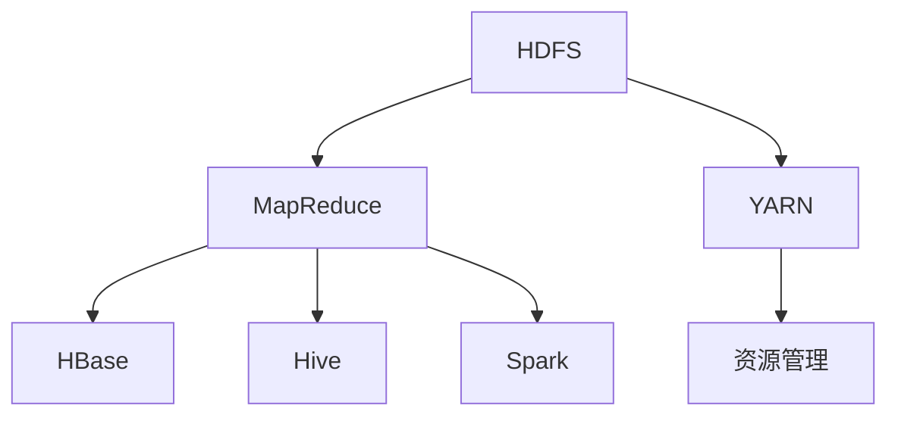

                 

关键词：大数据处理，Hadoop生态系统，MapReduce，分布式存储，数据挖掘，数据流处理，实时分析，机器学习，云计算，开源社区。

> 摘要：本文将深入探讨Hadoop生态系统，解析其在大数据处理中的应用，以及如何通过MapReduce、HDFS等核心组件实现高效的数据存储、处理和分析。同时，本文还将展望Hadoop生态系统的未来发展趋势，探讨其所面临的挑战和机遇。

## 1. 背景介绍

随着互联网和物联网的快速发展，数据量呈爆炸式增长。传统的关系型数据库和数据处理技术已经无法满足这种海量数据的需求。为了应对这一挑战，一种新的数据处理框架——Hadoop生态系统应运而生。

Hadoop是由Apache软件基金会开发的一个开源软件框架，主要用于处理大规模的数据集。它基于Google的MapReduce和GFS（Google File System）等论文提出的设计理念，能够处理数据存储和处理的挑战，为大数据处理提供了一种可行的方法。Hadoop生态系统包括多个组件，如HDFS、MapReduce、YARN、HBase、Hive、Spark等，这些组件共同构成了一个完整的大数据处理解决方案。

## 2. 核心概念与联系

### 2.1 核心概念

- **HDFS（Hadoop Distributed File System）**：一个分布式文件系统，用于存储大规模数据。它将数据分成小块存储在多个节点上，以实现高可用性和高吞吐量。
- **MapReduce**：一个分布式数据处理框架，用于大规模数据的并行处理。它将数据处理任务分解为Map和Reduce两个阶段，能够高效地处理大规模数据。
- **YARN（Yet Another Resource Negotiator）**：一个资源管理框架，用于管理集群资源，调度作业。它是Hadoop生态系统中的核心组件，提供了资源隔离和高效资源利用的能力。
- **HBase**：一个分布式、可扩展的列存储数据库，用于存储非结构化和半结构化数据。
- **Hive**：一个数据仓库基础设施，用于数据摘要和查询。它可以将SQL查询转换为MapReduce作业执行。
- **Spark**：一个快速的大规模数据处理引擎，支持内存计算和实时流处理。

### 2.2 核心概念原理和架构的 Mermaid 流程图



## 3. 核心算法原理 & 具体操作步骤

### 3.1 算法原理概述

Hadoop生态系统中的核心算法原理主要基于MapReduce模型。MapReduce是一种分布式数据处理模型，将数据处理任务分解为Map（映射）和Reduce（规约）两个阶段。

- **Map阶段**：将输入数据分成小块，对每个小块进行映射处理，生成中间结果。
- **Reduce阶段**：将Map阶段生成的中间结果进行合并和规约，生成最终结果。

### 3.2 算法步骤详解

- **初始化**：启动Hadoop集群，配置HDFS和MapReduce。
- **数据输入**：将数据上传到HDFS，并将其分成多个小块。
- **Map阶段**：
  - **分片**：将输入数据按行或键值对划分成多个分片。
  - **映射**：对每个分片进行映射处理，生成中间键值对。
- **Shuffle阶段**：将Map阶段生成的中间结果按键值对分组，分发到Reduce节点。
- **Reduce阶段**：
  - **规约**：对每个键值对进行规约处理，生成最终结果。
  - **输出**：将最终结果写入HDFS或其他存储系统。

### 3.3 算法优缺点

**优点**：
- **分布式处理**：能够高效地处理大规模数据。
- **高可用性**：通过分布式存储和计算，提高了系统的可用性和容错性。
- **高效性**：基于并行处理，提高了数据处理的速度和效率。

**缺点**：
- **复杂性**：配置和管理Hadoop集群相对复杂。
- **存储开销**：在Shuffle阶段，需要存储中间结果，增加了存储开销。

### 3.4 算法应用领域

- **数据挖掘**：通过MapReduce算法，能够对海量数据进行高效的数据挖掘和分析。
- **实时分析**：通过Spark等组件，能够实现实时数据的分析和处理。
- **机器学习**：通过Hadoop生态系统中的算法和工具，能够实现大规模的机器学习任务。

## 4. 数学模型和公式 & 详细讲解 & 举例说明

### 4.1 数学模型构建

Hadoop生态系统中的算法通常涉及线性代数、概率论和统计学等数学模型。以下是一个简单的线性代数模型：

$$
X = A * B
$$

其中，$A$和$B$是矩阵，$X$是矩阵乘法的结果。

### 4.2 公式推导过程

假设有两个矩阵$A$和$B$，其中$A$的行数为$m$，列数为$n$，$B$的行数为$n$，列数为$p$。矩阵乘法的公式为：

$$
X_{ij} = \sum_{k=1}^{n} A_{ik} * B_{kj}
$$

其中，$X$是结果矩阵，$i$表示行索引，$j$表示列索引，$k$表示中间项索引。

### 4.3 案例分析与讲解

假设有两个矩阵：

$$
A = \begin{bmatrix}
1 & 2 \\
3 & 4
\end{bmatrix}, B = \begin{bmatrix}
5 & 6 \\
7 & 8
\end{bmatrix}
$$

根据矩阵乘法的公式，可以计算出：

$$
X = A * B = \begin{bmatrix}
1 * 5 + 2 * 7 & 1 * 6 + 2 * 8 \\
3 * 5 + 4 * 7 & 3 * 6 + 4 * 8
\end{bmatrix} = \begin{bmatrix}
19 & 26 \\
43 & 58
\end{bmatrix}
$$

## 5. 项目实践：代码实例和详细解释说明

### 5.1 开发环境搭建

在开始实践之前，需要搭建一个Hadoop开发环境。这里我们使用Apache Hadoop 3.2.1版本。以下是搭建步骤：

1. 安装Java开发环境（版本要求8或以上）。
2. 下载并解压Hadoop安装包。
3. 配置环境变量，包括JAVA_HOME、HADOOP_HOME等。
4. 配置Hadoop配置文件（如hadoop-env.sh、core-site.xml、hdfs-site.xml、mapred-site.xml等）。

### 5.2 源代码详细实现

以下是一个简单的MapReduce程序，用于计算文本文件中的词频。

```java
import org.apache.hadoop.conf.Configuration;
import org.apache.hadoop.fs.Path;
import org.apache.hadoop.io.IntWritable;
import org.apache.hadoop.io.Text;
import org.apache.hadoop.mapreduce.Job;
import org.apache.hadoop.mapreduce.Mapper;
import org.apache.hadoop.mapreduce.Reducer;
import org.apache.hadoop.mapreduce.lib.input.FileInputFormat;
import org.apache.hadoop.mapreduce.lib.output.FileOutputFormat;

public class WordCount {

  public static class TokenizerMapper
       extends Mapper<Object, Text, Text, IntWritable>{

    private final static IntWritable one = new IntWritable(1);
    private Text word = new Text();

    public void map(Object key, Text value, Context context
                    ) throws IOException, InterruptedException {
      StringTokenizer itr = new StringTokenizer(value.toString());
      while (itr.hasMoreTokens()) {
        word.set(itr.nextToken());
        context.write(word, one);
      }
    }
  }

  public static class IntSumReducer
      extends Reducer<Text,IntWritable,Text,IntWritable> {
    private IntWritable result = new IntWritable();

    public void reduce(Text key, Iterable<IntWritable> values,
                       Context context
                       ) throws IOException, InterruptedException {
      int sum = 0;
      for (IntWritable val : values) {
        sum += val.get();
      }
      result.set(sum);
      context.write(key, result);
    }
  }

  public static void main(String[] args) throws Exception {
    Configuration conf = new Configuration();
    Job job = Job.getInstance(conf, "word count");
    job.setJarByClass(WordCount.class);
    job.setMapperClass(TokenizerMapper.class);
    job.setCombinerClass(IntSumReducer.class);
    job.setReducerClass(IntSumReducer.class);
    job.setOutputKeyClass(Text.class);
    job.setOutputValueClass(IntWritable.class);
    FileInputFormat.addInputPath(job, new Path(args[0]));
    FileOutputFormat.setOutputPath(job, new Path(args[1]));
    System.exit(job.waitForCompletion(true) ? 0 : 1);
  }
}
```

### 5.3 代码解读与分析

- **TokenizerMapper** 类：实现 Mapper 接口，用于处理输入数据的映射操作。
- **IntSumReducer** 类：实现 Reducer 接口，用于处理映射结果的数据规约操作。
- **main** 方法：设置作业配置、输入输出路径等，并启动作业。

### 5.4 运行结果展示

运行以上程序后，在输出路径中可以看到结果文件，其中包含了每个单词及其出现的次数。

## 6. 实际应用场景

Hadoop生态系统在大数据处理的实际应用场景非常广泛。以下是一些典型的应用场景：

- **搜索引擎**：通过MapReduce算法对海量网页进行索引和排序，实现高效的信息检索。
- **社交网络分析**：通过Hadoop生态系统进行社交网络数据的挖掘和分析，发现潜在的用户关系和兴趣群体。
- **电子商务**：通过Hadoop生态系统进行用户行为分析、推荐系统和广告投放优化，提高用户体验和销售额。
- **金融行业**：通过Hadoop生态系统进行金融数据的处理和分析，实现风险管理和投资决策优化。

## 7. 工具和资源推荐

### 7.1 学习资源推荐

- **《Hadoop权威指南》**：详细介绍了Hadoop生态系统及其组件，适合初学者和进阶者。
- **《大数据技术导论》**：涵盖了大数据处理的基本概念、技术和应用，适合对大数据感兴趣的学习者。
- **Apache Hadoop官方网站**：提供了详细的文档、教程和API参考，是学习Hadoop生态系统的最佳资源。

### 7.2 开发工具推荐

- **IntelliJ IDEA**：一款功能强大的集成开发环境，支持多种编程语言和框架，是Hadoop开发的首选。
- **Eclipse**：一款开源的集成开发环境，也支持Hadoop开发，提供了丰富的插件和工具。

### 7.3 相关论文推荐

- **“MapReduce：大型数据集的简洁分布式计算模型”**：提出了MapReduce模型，奠定了Hadoop生态系统的理论基础。
- **“The Google File System”**：介绍了Google File System（GFS）的设计和实现，对HDFS有着重要的影响。

## 8. 总结：未来发展趋势与挑战

### 8.1 研究成果总结

Hadoop生态系统在大数据处理领域取得了显著的成果，包括分布式存储、分布式计算、实时分析、机器学习等方面。这些成果为企业和研究机构提供了强大的数据处理能力，推动了大数据技术的发展和应用。

### 8.2 未来发展趋势

- **实时处理**：随着实时数据需求的增加，Hadoop生态系统将更加注重实时处理能力的提升，如基于Spark的流处理技术。
- **人工智能集成**：将人工智能技术整合到Hadoop生态系统中，实现更智能的数据分析和预测。
- **云原生发展**：随着云计算的普及，Hadoop生态系统将更加注重云原生架构，实现更高效、更灵活的数据处理。

### 8.3 面临的挑战

- **性能优化**：如何提高分布式存储和计算的性能，降低延迟和成本。
- **安全性**：如何保障大数据处理过程中的数据安全和隐私。
- **社区贡献**：如何加强开源社区的建设，推动生态系统的可持续发展。

### 8.4 研究展望

Hadoop生态系统在未来将继续发挥重要作用，为大数据处理提供强大的支持。通过不断创新和优化，Hadoop生态系统将更好地应对未来的挑战，为企业和研究机构带来更多的价值。

## 9. 附录：常见问题与解答

### 9.1 Hadoop安装过程遇到问题怎么办？

- **检查环境变量配置**：确保JAVA_HOME、HADOOP_HOME等环境变量配置正确。
- **检查依赖库**：确保相关依赖库（如zlib、snappy等）已安装。
- **查看日志文件**：查看Hadoop安装过程中的日志文件，以查找错误信息。

### 9.2 如何优化Hadoop性能？

- **增加节点数量**：通过增加节点数量，提高分布式存储和计算的性能。
- **调整配置参数**：根据实际情况调整Hadoop的配置参数，如io.file.buffer.size、mapreduce.reduce.memory.mb等。
- **使用压缩算法**：使用高效的压缩算法，降低数据传输和存储的开销。

### 9.3 如何保障Hadoop数据安全？

- **加密数据传输**：使用SSL/TLS等加密协议，保障数据在传输过程中的安全。
- **权限控制**：通过Hadoop的访问控制列表（ACL）和用户认证机制，实现数据的权限控制。
- **数据备份**：定期备份数据，以防止数据丢失或损坏。

---

# 作者：禅与计算机程序设计艺术 / Zen and the Art of Computer Programming

本文基于Hadoop生态系统，深入探讨了大数据处理的技术和应用。通过详细解析MapReduce、HDFS等核心组件，以及数学模型和项目实践，希望读者能够更好地理解和掌握大数据处理技术。同时，本文也展望了Hadoop生态系统的未来发展趋势和挑战，为读者提供了有益的参考。感谢大家的阅读，希望本文能够对您的学习和研究有所帮助。

