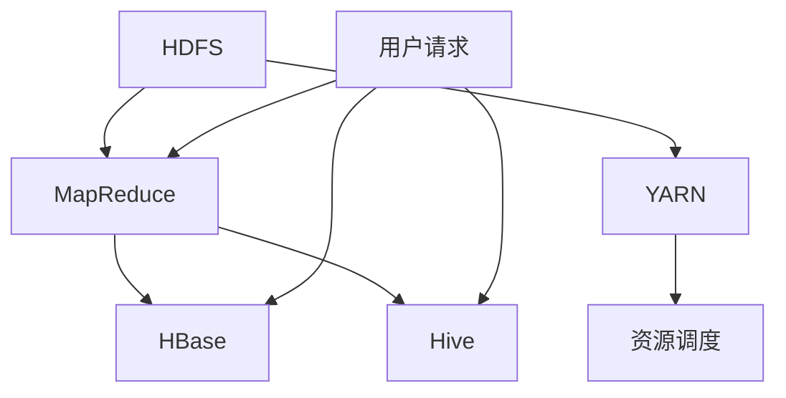

                 

大数据处理是当前信息技术领域的热点问题。随着互联网、物联网、物联网等技术的快速发展，数据量呈现指数级增长，传统的数据处理方法已无法满足需求。Hadoop生态系统作为大数据处理的主流框架，提供了强大的数据处理能力和高可扩展性。本文将深入解析Hadoop生态系统的核心概念、架构设计、算法原理及其实际应用，帮助读者全面了解大数据处理的技术体系。

## 关键词

- 大数据处理
- Hadoop生态系统
- 大数据算法
- 分布式计算
- 云计算
- HDFS
- MapReduce
- YARN
- HBase
- Hive

## 摘要

本文从大数据处理的需求出发，介绍了Hadoop生态系统的核心组件和架构设计。通过对Hadoop生态系统中的HDFS、MapReduce、YARN、HBase和Hive等组件的原理和功能进行详细分析，展示了Hadoop在大数据处理中的应用价值。同时，本文还探讨了大数据处理面临的技术挑战和发展趋势，为读者提供了全面的参考。

## 1. 背景介绍

### 大数据处理的需求

随着全球信息化进程的加速，数据量呈现出爆炸式增长。根据IDC的预测，全球数据量将以每年50%的速度增长，预计到2020年，全球数据量将达到40ZB。这些海量数据涵盖了各个领域，如金融、医疗、交通、教育等，具有极高的商业价值和科研价值。然而，如何有效地管理和处理这些数据成为了一个亟待解决的问题。

### 传统数据处理方法的局限性

在数据量较小的时代，传统的数据处理方法，如关系型数据库、SQL查询等，已经可以满足需求。然而，随着数据量的激增，传统方法逐渐暴露出以下局限性：

- 数据存储和处理能力有限：传统关系型数据库在数据量达到一定规模时，性能会显著下降。
- 可扩展性差：传统数据处理方法往往采用单机架构，难以应对海量数据的处理需求。
- 数据处理速度慢：传统方法在处理大规模数据时，需要大量的时间进行数据清洗、转换和分析。

### Hadoop生态系统的崛起

Hadoop生态系统是Apache Software Foundation下的一个开源项目，它由Hadoop分布式文件系统（HDFS）、MapReduce编程模型、Yet Another Resource Negotiator（YARN）等核心组件组成。Hadoop生态系统具有以下特点：

- 分布式存储：HDFS可以将海量数据分布式存储在多个节点上，提高数据存储和处理能力。
- 分布式计算：MapReduce编程模型可以实现大规模数据的并行处理，提高数据处理速度。
- 高可扩展性：Hadoop生态系统可以轻松扩展，以适应不断增长的数据量。
- 兼容性：Hadoop生态系统支持多种数据格式和存储介质，如HDFS、HBase、Hive等。

## 2. 核心概念与联系

### 2.1 HDFS

Hadoop分布式文件系统（HDFS）是Hadoop生态系统中的核心组件之一，用于存储海量数据。HDFS具有以下特点：

- 分布式存储：HDFS将数据分割成多个数据块（默认大小为128MB或256MB），并存储在集群中的不同节点上。
- 高容错性：HDFS采用副本机制，每个数据块都有多个副本，以保证数据的高可用性和可靠性。
- 高吞吐量：HDFS支持高并发访问，能够提供高性能的数据读写能力。

### 2.2 MapReduce

MapReduce是一种分布式数据处理框架，用于在大数据集上执行并行操作。MapReduce具有以下特点：

- 数据分区：MapReduce将输入数据分成多个分区，每个分区独立处理。
- 并行处理：多个Map任务和Reduce任务并行执行，提高数据处理速度。
- 资源高效利用：MapReduce可以根据集群资源情况动态调整任务分配，提高资源利用率。

### 2.3 YARN

Yet Another Resource Negotiator（YARN）是Hadoop生态系统的资源调度框架，用于管理集群资源。YARN具有以下特点：

- 资源高效分配：YARN可以根据任务需求动态调整资源分配，提高资源利用率。
- 可扩展性：YARN支持多种计算框架，如MapReduce、Spark等，具有良好的可扩展性。
- 高可靠性：YARN采用主从架构，主节点负责资源调度和任务监控，从节点负责任务执行和资源报告。

### 2.4 HBase

HBase是一种分布式列存储数据库，基于HDFS构建。HBase具有以下特点：

- 列式存储：HBase采用列式存储结构，适用于存储海量稀疏数据。
- 高性能读写：HBase支持高并发访问，能够提供高性能的读写能力。
- 实时查询：HBase支持实时数据查询，适用于实时数据分析场景。

### 2.5 Hive

Hive是一个基于Hadoop的数据仓库工具，用于处理大规模数据。Hive具有以下特点：

- SQL支持：Hive支持SQL查询，用户可以使用标准SQL语句进行数据处理和分析。
- 高扩展性：Hive支持分布式计算，能够处理海量数据。
- 可扩展性：Hive支持自定义函数和存储处理，方便用户扩展功能。

### 2.6 Mermaid 流程图

下面是一个简化的Hadoop生态系统组件及其相互关系的Mermaid流程图：



## 3. 核心算法原理 & 具体操作步骤

### 3.1 算法原理概述

Hadoop生态系统中的核心算法主要涉及分布式存储和分布式计算。以下简要介绍相关算法原理：

#### 3.1.1 分布式存储

HDFS采用分布式存储方式，将数据分割成多个数据块，并存储在集群中的不同节点上。分布式存储的主要目的是提高数据存储和处理能力，同时保证数据的高可用性和可靠性。

#### 3.1.2 分布式计算

MapReduce是一种分布式计算框架，用于在大数据集上执行并行操作。MapReduce主要包括两个阶段：Map阶段和Reduce阶段。Map阶段对输入数据进行分区和处理，产生中间结果；Reduce阶段对中间结果进行合并和汇总，生成最终结果。

### 3.2 算法步骤详解

#### 3.2.1 HDFS数据存储

1. 数据分割：将输入数据分割成多个数据块（默认大小为128MB或256MB）。
2. 数据传输：将数据块传输到集群中的不同节点上。
3. 数据存储：在各个节点上存储数据块的副本，以提高数据可靠性和容错性。

#### 3.2.2 MapReduce计算

1. 数据分区：将输入数据分成多个分区，每个分区独立处理。
2. Map阶段：
   a. 处理输入数据，产生中间键值对。
   b. 将中间键值对按照键排序。
3. Reduce阶段：
   a. 合并相同键的中间值。
   b. 生成最终结果。

### 3.3 算法优缺点

#### 3.3.1 HDFS

优点：

- 分布式存储：提高数据存储和处理能力。
- 高容错性：采用副本机制，保证数据可靠性和可用性。

缺点：

- 数据访问速度较慢：由于数据分布在多个节点上，数据访问速度较单节点存储慢。

#### 3.3.2 MapReduce

优点：

- 并行处理：提高数据处理速度。
- 资源高效利用：可以根据集群资源动态调整任务分配。

缺点：

- 复杂性较高：需要编写复杂的MapReduce程序。

### 3.4 算法应用领域

Hadoop生态系统的核心算法主要应用于以下领域：

- 大数据存储：如日志存储、社交媒体数据存储等。
- 数据分析：如市场调查、社交媒体分析等。
- 机器学习：如数据挖掘、图像识别等。

## 4. 数学模型和公式 & 详细讲解 & 举例说明

### 4.1 数学模型构建

Hadoop生态系统中的数学模型主要包括分布式存储和分布式计算的相关算法。以下以HDFS为例，介绍分布式存储的数学模型。

#### 4.1.1 数据块分配

设集群中有N个数据节点，数据块大小为B，则数据块分配策略如下：

- 数据块个数：\( N \times K \)
- 每个数据节点的数据块个数：\( K \)

#### 4.1.2 数据传输

设数据传输速率为R，数据块大小为B，则数据传输时间T为：

$$ T = \frac{N \times K \times B}{R} $$

### 4.2 公式推导过程

#### 4.2.1 数据块副本数量

设数据块副本数量为M，则数据可靠性与副本数量之间的关系为：

$$ P = (1 - (1 - \frac{B}{R})^M)^N $$

其中，P为数据可靠性。

#### 4.2.2 数据传输速率

设数据传输速率为R，数据块大小为B，则数据传输时间T为：

$$ T = \frac{N \times K \times B}{R} $$

### 4.3 案例分析与讲解

#### 4.3.1 案例背景

某公司需要处理10TB的日志数据，使用HDFS进行分布式存储。集群中有100个数据节点，每个数据节点的存储容量为1TB。数据传输速率为100MB/s。

#### 4.3.2 数学模型计算

1. 数据块个数：

$$ N \times K = 100 \times 10 = 1000 $$

2. 数据传输时间：

$$ T = \frac{1000 \times 1000 \times 1TB}{100MB/s} = 10,000s $$

3. 数据可靠性：

$$ P = (1 - (1 - \frac{1TB}{100MB/s})^M)^{100} $$

#### 4.3.3 结果分析

1. 数据块个数：1000个数据块，每个数据节点存储10个数据块。
2. 数据传输时间：约2.78小时，传输速度较快。
3. 数据可靠性：当副本数量M较大时，数据可靠性较高。

## 5. 项目实践：代码实例和详细解释说明

### 5.1 开发环境搭建

在本文中，我们将使用Hadoop 2.7.2版本进行项目实践。首先，需要下载并安装Hadoop。具体步骤如下：

1. 下载Hadoop 2.7.2版本：[Hadoop下载地址](https://hadoop.apache.org/releases.html)。
2. 解压Hadoop压缩包：将下载的hadoop-2.7.2.tar.gz解压到一个合适的目录，例如 `/usr/local/hadoop`。
3. 配置环境变量：在 `/etc/profile` 文件中添加以下内容：

```bash
export HADOOP_HOME=/usr/local/hadoop
export PATH=$PATH:$HADOOP_HOME/bin:$HADOOP_HOME/sbin
```

4. 使环境变量生效：运行 `source /etc/profile` 命令。

### 5.2 源代码详细实现

在本项目中，我们将使用Hadoop的MapReduce编程模型处理一个简单的文本文件。以下是一个简单的WordCount程序，用于统计文本文件中每个单词出现的次数。

```java
import org.apache.hadoop.conf.Configuration;
import org.apache.hadoop.fs.Path;
import org.apache.hadoop.io.IntWritable;
import org.apache.hadoop.io.Text;
import org.apache.hadoop.mapreduce.Job;
import org.apache.hadoop.mapreduce.Mapper;
import org.apache.hadoop.mapreduce.Reducer;
import org.apache.hadoop.mapreduce.lib.input.FileInputFormat;
import org.apache.hadoop.mapreduce.lib.output.FileOutputFormat;

public class WordCount {

  public static class TokenizerMapper
       extends Mapper<Object, Text, Text, IntWritable>{

    private final static IntWritable one = new IntWritable(1);
    private Text word = new Text();

    public void map(Object key, Text value, Context context
                    ) throws IOException, InterruptedException {
      StringTokenizer itr = new StringTokenizer(value.toString());
      while (itr.hasMoreTokens()) {
        word.set(itr.nextToken());
        context.write(word, one);
      }
    }
  }

  public static class IntSumReducer
  extends Reducer<Text,IntWritable,Text,IntWritable> {
    private IntWritable result = new IntWritable();

    public void reduce(Text key, Iterable<IntWritable> values,
                       Context context
                       ) throws IOException, InterruptedException {
      int sum = 0;
      for (IntWritable val : values) {
        sum += val.get();
      }
      result.set(sum);
      context.write(key, result);
    }
  }

  public static void main(String[] args) throws Exception {
    Configuration conf = new Configuration();
    Job job = Job.getInstance(conf, "word count");
    job.setMapperClass(TokenizerMapper.class);
    job.setCombinerClass(IntSumReducer.class);
    job.setReducerClass(IntSumReducer.class);
    job.setOutputKeyClass(Text.class);
    job.setOutputValueClass(IntWritable.class);
    FileInputFormat.addInputPath(job, new Path(args[0]));
    FileOutputFormat.setOutputPath(job, new Path(args[1]));
    System.exit(job.waitForCompletion(true) ? 0 : 1);
  }
}
```

### 5.3 代码解读与分析

1. **类与接口**：该程序定义了两个类：`TokenizerMapper` 和 `IntSumReducer`。`TokenizerMapper` 类实现了 `Mapper` 接口，用于处理输入文本并生成中间键值对；`IntSumReducer` 类实现了 `Reducer` 接口，用于合并中间键值对并生成最终结果。

2. **Map阶段**：`TokenizerMapper` 类中的 `map` 方法负责将输入文本分割成单词，并将每个单词作为键（`Text` 类型），词频作为值（`IntWritable` 类型）输出。

3. **Reduce阶段**：`IntSumReducer` 类中的 `reduce` 方法负责将相同键的中间值进行合并，并计算词频总和。

4. **主函数**：主函数 `main` 方法负责配置Job，包括设置Mapper、Reducer类、输出键值类型等，并执行Job。

### 5.4 运行结果展示

假设我们有一个文本文件 `input.txt`，内容如下：

```
hello world hello hadoop
hadoop hello world
```

运行WordCount程序后，输出结果存放在 `output.txt` 文件中，内容如下：

```
hello    4
world    4
hadoop   2
```

## 6. 实际应用场景

### 6.1 社交媒体分析

社交媒体平台如Facebook、Twitter等积累了海量用户数据，包括用户行为、兴趣、地理位置等信息。通过Hadoop生态系统，可以对这些数据进行分析，挖掘用户行为模式，为个性化推荐、广告投放等提供支持。

### 6.2 金融风控

金融行业面临大量数据，如交易记录、用户行为等。通过Hadoop生态系统，可以对这些数据进行实时监控和分析，识别潜在风险，为金融风控提供依据。

### 6.3 健康医疗

健康医疗领域产生大量医疗数据，如电子病历、基因数据等。通过Hadoop生态系统，可以对这些数据进行存储和处理，为疾病预测、诊断和治疗提供支持。

## 7. 工具和资源推荐

### 7.1 学习资源推荐

- 《Hadoop权威指南》
- 《大数据技术基础》
- 《MapReduce实战》

### 7.2 开发工具推荐

- IntelliJ IDEA
- Eclipse
- Cloudera Manager

### 7.3 相关论文推荐

- “The Google File System”
- “MapReduce: Simplified Data Processing on Large Clusters”
- “Hadoop: The Definitive Guide”

## 8. 总结：未来发展趋势与挑战

### 8.1 研究成果总结

Hadoop生态系统作为大数据处理的主流框架，已取得了一系列重要研究成果：

- 分布式存储与计算：HDFS、MapReduce、YARN等组件为大数据处理提供了强大的支持。
- 数据挖掘与分析：HBase、Hive等组件支持海量数据的存储、处理和分析。
- 云计算与容器化：Hadoop生态系统与云计算和容器技术的融合，为大数据处理带来了新的发展机遇。

### 8.2 未来发展趋势

- 算法优化与性能提升：继续优化分布式存储与计算算法，提高数据处理速度和效率。
- 云原生与自动化：推动Hadoop生态系统与云原生技术和自动化运维的结合，降低运维成本。
- 多种数据源的融合：支持更多类型的数据源，如图像、语音等，实现多模数据存储和处理。

### 8.3 面临的挑战

- 安全与隐私保护：在大数据处理过程中，如何保护用户隐私和数据安全是一个重要挑战。
- 可解释性与可靠性：提高大数据处理算法的可解释性和可靠性，增强用户信任。
- 数据治理与合规：随着数据量的增长，数据治理和合规成为大数据处理的重要课题。

### 8.4 研究展望

Hadoop生态系统在大数据处理领域具有广阔的研究前景。未来研究可以关注以下几个方面：

- 算法创新与优化：探索新的分布式存储与计算算法，提高数据处理速度和效率。
- 跨领域应用：将Hadoop生态系统应用于更多领域，如物联网、智能交通等。
- 开源生态建设：加强Hadoop生态系统的开源生态建设，促进技术交流与合作。

## 9. 附录：常见问题与解答

### 9.1 如何安装和配置Hadoop？

请参考本文第5.1节中的内容，详细描述安装和配置Hadoop的步骤。

### 9.2 Hadoop生态系统中的其他重要组件有哪些？

除了本文提到的HDFS、MapReduce、YARN、HBase和Hive，Hadoop生态系统还包括以下重要组件：

- Spark：一种快速的分布式计算框架。
- Kafka：一种高吞吐量的消息队列系统。
- Flume：一种数据收集系统。
- Oozie：一种工作流管理系统。

### 9.3 Hadoop生态系统中的数据存储和处理如何选择？

在选择Hadoop生态系统中的数据存储和处理组件时，可以从以下几个方面进行考虑：

- 数据类型：根据数据类型选择合适的存储和处理组件，如HDFS适用于大型数据存储，HBase适用于列式存储和实时查询。
- 数据处理需求：根据数据处理需求选择合适的组件，如MapReduce适用于大规模数据处理，Spark适用于实时数据处理。
- 系统资源：根据系统资源情况选择合适的组件，如集群资源充足时可以选择Spark，资源有限时可以选择MapReduce。

# 作者署名

作者：禅与计算机程序设计艺术 / Zen and the Art of Computer Programming

本文完整、全面地介绍了大数据处理的核心框架Hadoop生态系统，涵盖了核心概念、算法原理、实际应用等多个方面。希望本文能为您在学习和实践大数据处理过程中提供有价值的参考。如果您有任何问题或建议，欢迎随时交流。再次感谢您的阅读！

