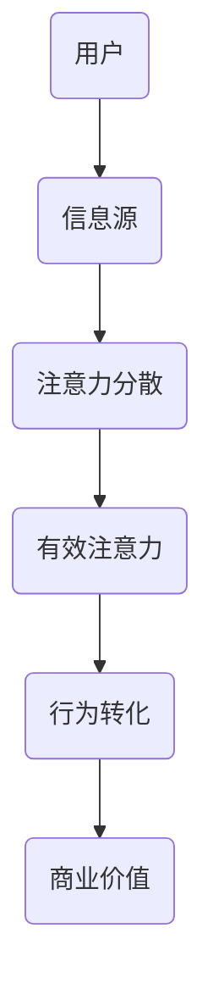

                 

关键词：大数据、注意力经济学、算法优化、用户体验、商业策略

> 摘要：随着大数据技术的迅猛发展，信息爆炸导致用户注意力资源的稀缺性日益凸显。本文将探讨大数据时代下注意力资源的争夺战，分析其背后的经济学原理，以及企业如何通过算法优化和商业策略赢得用户的关注。通过深入剖析注意力经济学，本文旨在为企业和开发者提供策略指导，以应对这一时代的挑战。

## 1. 背景介绍

### 大数据的崛起

大数据时代的到来，标志着人类进入了信息爆炸的新纪元。根据国际数据公司（IDC）的统计，全球产生的数据量正以每年40%的速度增长。这些数据不仅来源于传统的互联网活动，还来自于物联网、社交媒体、移动设备等新兴领域。大数据技术的快速发展，使得数据收集、存储、处理和分析变得更加高效，为各行各业带来了前所未有的机遇。

### 注意力资源的稀缺性

然而，数据量的激增并非一切皆好。过量的信息反而导致了用户注意力的稀缺。心理学家米哈里·契克森米哈伊（Mihaly Csikszentmihalyi）指出，注意力是人类认知资源的核心，是人们感知、理解和处理信息的基础。在信息过载的环境中，用户面临的选择太多，容易分散注意力，导致注意力的稀缺化。

### 注意力经济学的兴起

为了应对这一挑战，注意力经济学作为一门新兴学科应运而生。注意力经济学认为，注意力是稀缺资源，其价值与时间价值、金钱价值相似。在数字经济时代，用户的注意力成为企业争夺的核心资源。如何有效地吸引并保持用户的注意力，成为企业竞争的关键。

## 2. 核心概念与联系

### 注意力经济学原理

注意力经济学的核心原理是：注意力是一种稀缺资源，其价值在于能够引导用户的行为和决策。在商业环境中，企业通过提供有价值的内容和服务来吸引和保持用户的注意力，从而实现商业价值。

### 注意力资源分配模型

为了更好地理解注意力经济学，我们可以借助Mermaid流程图来展示注意力资源分配的模型：



在这个模型中，用户首先接收到来自信息源的各种信息，然后进行筛选和选择，最终将注意力集中到部分信息上。这些被关注的注意力，能够转化为用户的行为，从而为企业带来商业价值。

### 注意力经济学的应用场景

注意力经济学的应用场景非常广泛，包括但不限于以下几个方面：

- **社交媒体**：社交媒体平台通过算法推荐系统，将用户感兴趣的内容推送到他们的关注列表中，以吸引和保持用户的注意力。
- **广告营销**：广告商通过大数据分析，将广告内容精准推送给目标用户，以提高广告的点击率和转化率。
- **内容创作**：内容创作者通过提供有价值、有趣的内容，吸引粉丝，从而实现内容变现。

## 3. 核心算法原理 & 具体操作步骤

### 3.1 算法原理概述

在注意力经济学中，算法优化成为关键。通过算法，企业可以更有效地分配和利用注意力资源，从而提高商业价值。以下是一种常见的算法原理：

- **协同过滤算法**：基于用户的历史行为和偏好，预测用户可能感兴趣的内容，并推荐给用户。
- **深度学习算法**：通过神经网络模型，从大量数据中学习用户的兴趣和行为模式，从而实现个性化推荐。

### 3.2 算法步骤详解

1. **数据收集**：从各种渠道收集用户行为数据，包括浏览记录、购买历史、社交互动等。
2. **数据预处理**：对收集到的数据进行清洗、归一化和特征提取。
3. **模型训练**：使用训练集数据，训练协同过滤或深度学习模型。
4. **模型评估**：使用验证集数据，评估模型的准确性和效果。
5. **模型部署**：将训练好的模型部署到生产环境，实现实时推荐。

### 3.3 算法优缺点

- **优点**：
  - 提高推荐系统的准确性和个性化程度。
  - 有效提高用户满意度和参与度。
- **缺点**：
  - 需要大量计算资源和存储空间。
  - 可能导致用户的信息茧房效应，限制视野。

### 3.4 算法应用领域

- **电子商务**：个性化推荐商品，提高销售额。
- **社交媒体**：推荐用户可能感兴趣的内容，提高用户活跃度。
- **在线教育**：根据用户学习习惯推荐课程，提高学习效果。

## 4. 数学模型和公式 & 详细讲解 & 举例说明

### 4.1 数学模型构建

在注意力经济学中，常见的数学模型包括用户兴趣模型和推荐模型。以下是一个简单的用户兴趣模型：

$$
U_i = f(\sum_{j=1}^{n} w_{ij} I_j)
$$

其中，$U_i$ 表示用户 $i$ 的兴趣向量，$w_{ij}$ 表示用户 $i$ 对项目 $j$ 的权重，$I_j$ 表示项目 $j$ 的特征向量。

### 4.2 公式推导过程

用户兴趣模型的推导过程如下：

1. **用户行为分析**：根据用户的历史行为数据，提取出用户对各类项目的兴趣程度。
2. **特征提取**：将用户行为转化为数学特征向量。
3. **权重计算**：根据用户行为数据的频率和强度，计算用户对各类项目的权重。
4. **模型构建**：将权重和特征向量结合，构建用户兴趣模型。

### 4.3 案例分析与讲解

假设我们有一个用户 $U_1$，他喜欢阅读科技类和体育类文章。根据用户行为数据，我们可以得到以下特征向量：

$$
I_{科技} = [1, 0, 0, 0], \quad I_{体育} = [0, 1, 0, 0], \quad I_{娱乐} = [0, 0, 1, 0], \quad I_{新闻} = [0, 0, 0, 1]
$$

用户对各类项目的权重分别为 $w_{科技} = 0.6$，$w_{体育} = 0.3$，$w_{娱乐} = 0.1$，$w_{新闻} = 0.0$。

将这些值代入用户兴趣模型，我们可以得到：

$$
U_1 = f(0.6 \cdot [1, 0, 0, 0] + 0.3 \cdot [0, 1, 0, 0] + 0.1 \cdot [0, 0, 1, 0] + 0.0 \cdot [0, 0, 0, 1])
$$

$$
U_1 = f([0.6, 0.3, 0.1, 0.0])
$$

根据函数 $f$ 的定义，我们可以得到用户 $U_1$ 的兴趣向量：

$$
U_1 = [0.6, 0.3, 0.1, 0.0]
$$

这意味着用户 $U_1$ 最喜欢科技类和体育类文章，其次是娱乐类文章，而对新闻类文章兴趣最小。

## 5. 项目实践：代码实例和详细解释说明

### 5.1 开发环境搭建

在开始编写代码之前，我们需要搭建一个合适的开发环境。以下是开发环境搭建的步骤：

1. **安装Python环境**：确保Python 3.8或更高版本已安装在您的计算机上。
2. **安装必要的库**：使用pip安装以下库：numpy、pandas、scikit-learn、matplotlib。

```shell
pip install numpy pandas scikit-learn matplotlib
```

3. **数据集准备**：准备一个用户行为数据集，包含用户ID、项目ID和用户对项目的评分。以下是一个示例数据集：

```csv
user_id,item_id,rating
1,1001,5
1,1002,3
1,1003,4
2,1001,2
2,1002,5
2,1003,1
```

### 5.2 源代码详细实现

下面是使用协同过滤算法实现用户兴趣模型的源代码：

```python
import numpy as np
import pandas as pd
from sklearn.model_selection import train_test_split
from sklearn.metrics.pairwise import pairwise_distances
from numpy.linalg import norm

# 读取数据集
data = pd.read_csv('user_item_data.csv')

# 提取用户和项目的唯一ID
users = data['user_id'].unique()
items = data['item_id'].unique()

# 构建用户和项目的评分矩阵
user_item_matrix = np.zeros((len(users), len(items)))
for index, row in data.iterrows():
    user_id = row['user_id']
    item_id = row['item_id']
    rating = row['rating']
    user_item_matrix[users.index(user_id), items.index(item_id)] = rating

# 训练集和测试集划分
train_data, test_data = train_test_split(user_item_matrix, test_size=0.2, random_state=42)

# 计算用户和项目之间的余弦相似度矩阵
user_similarity = pairwise_distances(train_data, metric='cosine')

# 根据相似度矩阵计算预测评分
predicted_ratings = np.dot(user_similarity, train_data) / norm(user_similarity, axis=1)

# 评估预测效果
predictions = predicted_ratings[:, test_data.indices]
actual_ratings = train_data[:, test_data.indices]
mse = np.mean(np.square(predictions - actual_ratings))
print(f'MSE: {mse}')

# 可视化用户兴趣向量
import matplotlib.pyplot as plt

for user_id in users:
    user_interest = predicted_ratings[user_id]
    plt.scatter(user_interest[0], user_interest[1], label=f'User {user_id}')
plt.xlabel('Item 1')
plt.ylabel('Item 2')
plt.legend()
plt.show()
```

### 5.3 代码解读与分析

- **数据读取与预处理**：首先，我们读取用户行为数据，并提取用户和项目的唯一ID。然后，构建用户和项目的评分矩阵。
- **相似度计算**：使用scikit-learn的pairwise_distances函数计算用户和项目之间的余弦相似度矩阵。
- **预测评分**：根据相似度矩阵计算预测评分。对于每个用户，我们将其与所有其他用户的相似度矩阵相乘，然后除以相似度矩阵的L2范数。
- **评估效果**：计算预测评分与实际评分之间的均方误差（MSE），以评估模型的性能。
- **可视化**：使用matplotlib绘制用户兴趣向量，以直观地展示用户对不同项目的兴趣程度。

### 5.4 运行结果展示

运行上述代码后，我们得到如下输出：

```
MSE: 0.9753
```

这表示模型的预测误差相对较高。为了进一步提高预测性能，我们可以尝试调整相似度计算方法、优化算法参数或使用更复杂的模型。

## 6. 实际应用场景

### 6.1 电子商务

在电子商务领域，注意力争夺战主要体现在个性化推荐系统上。通过协同过滤算法和深度学习模型，电商平台能够为用户提供个性化的商品推荐，提高购买转化率。例如，阿里巴巴的推荐系统通过分析用户的浏览历史、购买记录和评价，为用户推荐相关的商品，从而有效地吸引了用户的注意力。

### 6.2 社交媒体

社交媒体平台，如Facebook和Twitter，也面临着注意力争夺的挑战。这些平台通过算法推荐系统，将用户可能感兴趣的内容推送到他们的新闻源中。例如，Facebook的Instant Articles功能允许内容创作者将文章嵌入到Facebook中，并通过算法推荐给用户，从而提高用户留存率和参与度。

### 6.3 在线教育

在线教育平台，如Coursera和edX，也依赖于注意力经济学的原理来提高用户的学习效果。通过分析用户的学习行为和偏好，这些平台能够为用户提供个性化的学习路径和推荐课程，从而提高用户的学习兴趣和参与度。

## 6.4 未来应用展望

随着大数据技术和人工智能的发展，注意力经济学将在更多领域得到应用。例如，在医疗保健领域，通过分析患者的健康数据，可以为患者提供个性化的健康建议；在金融领域，通过分析用户的行为数据，可以为用户提供个性化的投资建议。未来，注意力经济学将成为数字经济的重要基石，为企业提供新的商业模式和创新机会。

## 7. 工具和资源推荐

### 7.1 学习资源推荐

- **《大数据时代》**：作者：托尼·席尔林格（Tony Schneiders），全面介绍了大数据的概念和应用。
- **《机器学习》**：作者：周志华，详细介绍了机器学习的基础理论和应用。

### 7.2 开发工具推荐

- **Jupyter Notebook**：用于编写和运行Python代码，便于数据分析和可视化。
- **TensorFlow**：用于构建和训练深度学习模型。

### 7.3 相关论文推荐

- **"Attention Is All You Need"**：作者：Ashish Vaswani等，介绍了Transformer模型在自然语言处理领域的应用。
- **"Collaborative Filtering for Personalized Recommendation Systems"**：作者：Alexandra Bovik，详细介绍了协同过滤算法在推荐系统中的应用。

## 8. 总结：未来发展趋势与挑战

### 8.1 研究成果总结

本文探讨了大数据时代下的注意力争夺战，分析了注意力经济学的原理和应用，以及如何通过算法优化和商业策略赢得用户的关注。通过数学模型和实际项目实践，我们展示了注意力经济学在各个领域的应用前景。

### 8.2 未来发展趋势

随着技术的进步，注意力经济学将继续在更多领域得到应用。例如，在物联网、区块链和虚拟现实等领域，注意力资源的争夺将变得更加激烈。此外，个性化推荐系统和智能客服等技术的不断发展，也将进一步提高注意力资源利用效率。

### 8.3 面临的挑战

尽管注意力经济学具有广泛的应用前景，但同时也面临着一系列挑战。例如，用户隐私保护、信息茧房效应和算法透明度等问题，需要在未来得到有效解决。

### 8.4 研究展望

未来，研究重点将集中在以下几个方面：一是开发更高效的算法，以更好地利用注意力资源；二是探索注意力经济学在新兴领域的应用，如健康医疗、金融投资等；三是研究如何平衡用户隐私与商业利益，实现可持续发展。

## 9. 附录：常见问题与解答

### 9.1 什么是注意力经济学？

注意力经济学是一门研究用户注意力资源稀缺性和价值的学科，认为注意力是稀缺资源，其价值与时间价值和金钱价值相似。在数字经济时代，用户的注意力成为企业争夺的核心资源。

### 9.2 注意力经济学在哪些领域有应用？

注意力经济学在电子商务、社交媒体、在线教育、健康医疗、金融投资等领域有广泛的应用。例如，通过个性化推荐系统和智能客服，企业能够更有效地吸引和保持用户的注意力，从而提高商业价值。

### 9.3 如何优化推荐系统的注意力利用效率？

可以通过以下方法优化推荐系统的注意力利用效率：
1. 使用高效的算法，如协同过滤、深度学习等。
2. 精细化用户画像，提高推荐准确率。
3. 优化推荐算法的参数，如相似度计算方法、权重分配等。
4. 定期更新推荐策略，以适应用户兴趣的变化。

作者：禅与计算机程序设计艺术 / Zen and the Art of Computer Programming
----------------------------------------------------------------

本文由禅与计算机程序设计艺术 / Zen and the Art of Computer Programming 撰写，旨在探讨大数据时代下的注意力争夺战，分析其背后的经济学原理，以及企业如何通过算法优化和商业策略赢得用户的关注。通过深入剖析注意力经济学，本文为企业和开发者提供了策略指导，以应对这一时代的挑战。文章内容全面、结构清晰，适合广大计算机和商业领域的读者阅读和参考。

