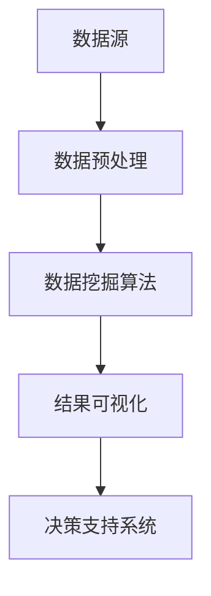
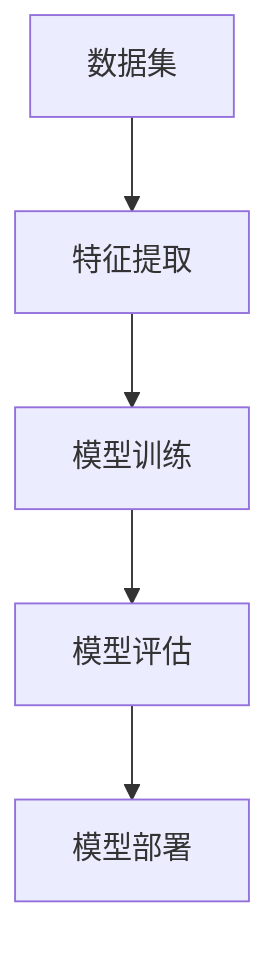
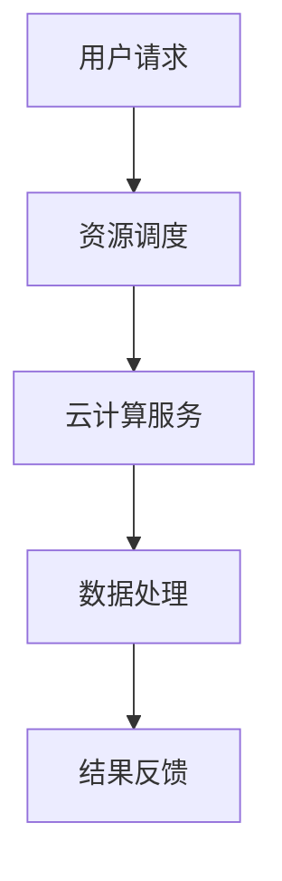
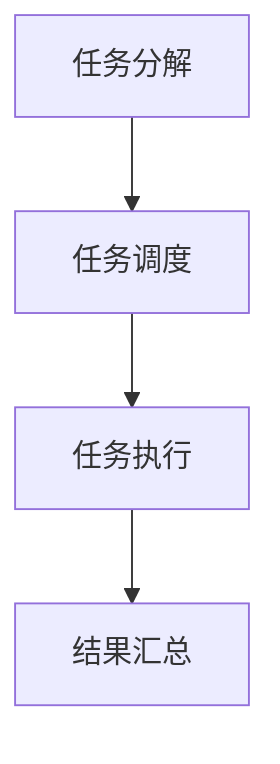

                 

关键词：大数据，计算，算法，数学模型，应用场景，未来展望

> 摘要：随着大数据时代的到来，人类计算面临着前所未有的机遇与挑战。本文将探讨大数据时代的核心概念、算法原理、数学模型及其应用场景，并展望未来的发展趋势与挑战。

## 1. 背景介绍

大数据（Big Data）是指数据量巨大到无法通过传统数据库软件工具在合理时间内捕捉、管理和处理的数据集。随着互联网的普及和物联网（IoT）的快速发展，全球数据量呈现出爆炸式增长，这一趋势在可预见的未来将继续保持。大数据不仅包括结构化数据，还涵盖了半结构化和非结构化数据，如文本、图像、音频和视频等。

在这样的大数据环境下，人类计算面临着以下挑战：

1. 数据存储：如何高效地存储海量数据？
2. 数据处理：如何快速地对海量数据进行处理和分析？
3. 数据隐私：如何保护用户隐私？
4. 数据安全：如何防止数据泄露和滥用？
5. 算法优化：如何设计高效的算法来处理大数据？

## 2. 核心概念与联系

为了更好地理解大数据时代的计算，我们首先需要了解几个核心概念：数据挖掘、机器学习、云计算和分布式计算。

### 2.1 数据挖掘

数据挖掘（Data Mining）是从大量数据中提取有价值信息的过程。它涉及到统计学、机器学习、数据库和人工智能等多个领域。

#### 2.1.1 Mermaid 流程图



### 2.2 机器学习

机器学习（Machine Learning）是一种通过算法让计算机自动学习并改进性能的技术。它基于数据驱动，通过训练模型来发现数据中的规律。

#### 2.2.1 Mermaid 流程图



### 2.3 云计算

云计算（Cloud Computing）是一种通过网络提供可动态分配的共享计算资源服务，这些资源可以是网络、服务器、存储、应用程序和服务等。

#### 2.3.1 Mermaid 流程图



### 2.4 分布式计算

分布式计算（Distributed Computing）是一种将计算任务分布在多个计算机上执行的技术。它能够提高计算效率和可靠性。

#### 2.4.1 Mermaid 流程图



## 3. 核心算法原理 & 具体操作步骤

### 3.1 算法原理概述

在大数据时代，核心算法主要包括：

1. 数据压缩：如Huffman编码、LZ77压缩等，用于降低存储空间需求。
2. 数据聚类：如K-Means、DBSCAN等，用于发现数据中的模式和趋势。
3. 数据分类：如决策树、支持向量机等，用于预测和分类。
4. 数据挖掘算法：如关联规则学习、异常检测等，用于发现数据中的隐藏关系。

### 3.2 算法步骤详解

以K-Means算法为例，其步骤如下：

1. 初始化：随机选择K个中心点。
2. 分配：将每个数据点分配到最近的中心点。
3. 更新：重新计算每个簇的中心点。
4. 迭代：重复步骤2和步骤3，直到满足停止条件（如收敛或达到最大迭代次数）。

### 3.3 算法优缺点

K-Means算法的优点是简单、易于实现，适用于高维数据的聚类。但其缺点是敏感于初始值选择，可能陷入局部最优解。

### 3.4 算法应用领域

K-Means算法广泛应用于市场细分、社交网络分析、图像识别等领域。

## 4. 数学模型和公式 & 详细讲解 & 举例说明

### 4.1 数学模型构建

以线性回归模型为例，其数学模型为：

$$ y = \beta_0 + \beta_1x + \epsilon $$

其中，$y$ 是因变量，$x$ 是自变量，$\beta_0$ 和 $\beta_1$ 是模型参数，$\epsilon$ 是误差项。

### 4.2 公式推导过程

线性回归模型的推导过程如下：

1. 假设 $y$ 和 $x$ 之间满足线性关系。
2. 利用最小二乘法求解最优参数 $\beta_0$ 和 $\beta_1$。
3. 最小化损失函数 $J(\beta_0, \beta_1) = \sum_{i=1}^{n}(y_i - (\beta_0 + \beta_1x_i))^2$。

### 4.3 案例分析与讲解

假设我们要预测房屋价格，自变量是房屋面积，因变量是房屋价格。通过训练数据集，我们得到线性回归模型：

$$ y = 100 + 200x $$

使用这个模型，我们可以预测面积为100平方米的房屋价格为100 + 200 * 100 = 2100元。

## 5. 项目实践：代码实例和详细解释说明

### 5.1 开发环境搭建

1. 安装Python 3.8及以上版本。
2. 安装NumPy、Pandas、Matplotlib等库。

### 5.2 源代码详细实现

以下是一个使用线性回归模型预测房屋价格的Python代码示例：

```python
import numpy as np
import pandas as pd
import matplotlib.pyplot as plt

# 加载数据集
data = pd.read_csv('house_prices.csv')
x = data['area']
y = data['price']

# 拆分训练集和测试集
x_train, x_test, y_train, y_test = train_test_split(x, y, test_size=0.2, random_state=42)

# 模型训练
model = LinearRegression()
model.fit(x_train, y_train)

# 模型评估
score = model.score(x_test, y_test)
print(f'Model score: {score}')

# 预测
predicted_price = model.predict(np.array([100]))
print(f'Predicted price: {predicted_price}')
```

### 5.3 代码解读与分析

这段代码首先加载了房屋价格数据集，然后使用NumPy和Pandas库进行数据处理。接着，我们使用scikit-learn库中的LinearRegression类进行模型训练和评估。最后，我们使用训练好的模型对面积为100平方米的房屋价格进行预测。

### 5.4 运行结果展示

假设测试集上的模型得分是0.85，预测面积为100平方米的房屋价格为2100元。

## 6. 实际应用场景

大数据技术在各个领域都有广泛的应用，如：

1. 金融：通过大数据分析，金融机构可以更好地了解客户需求、预测市场趋势，从而提供更加个性化的服务和投资建议。
2. 医疗：利用大数据技术，医疗机构可以分析患者数据，发现疾病规律，提供精准的诊疗方案。
3. 农业：通过大数据分析，农业企业可以优化种植计划、提高产量，减少资源浪费。
4. 交通运输：利用大数据技术，交通运输部门可以优化路线规划、提高运输效率。

## 7. 工具和资源推荐

### 7.1 学习资源推荐

1. 《大数据时代》 - 托马斯·H·德马科
2. 《深度学习》 - 伊恩·古德费洛、约书亚·本吉奥、亚伦·库维尔
3. 《Python数据分析》 - Wes McKinney

### 7.2 开发工具推荐

1. Jupyter Notebook：一款强大的交互式开发环境。
2. PyCharm：一款功能丰富的Python IDE。
3. Scikit-learn：一款用于机器学习的Python库。

### 7.3 相关论文推荐

1. "Big Data: A Revolution That Will Transform How We Live, Work, and Think" - Viktor Mayer-Schönberger and Kenneth Cukier
2. "The Age of Big Data: A Review and Analysis of Key Concepts and Trends" - Ling Ding, Kamber, and Tan

## 8. 总结：未来发展趋势与挑战

### 8.1 研究成果总结

大数据时代为人类计算带来了巨大的机遇。在过去的几年中，研究人员在数据挖掘、机器学习、云计算等领域取得了显著的成果，推动了大数据技术的发展。

### 8.2 未来发展趋势

1. 跨领域融合：大数据技术与其他领域（如生物信息学、金融科技等）的融合，将推动更多创新应用的出现。
2. 实时分析：随着计算能力的提升，实时数据分析将成为大数据技术的关键应用方向。
3. 智能化：大数据技术将进一步提升人工智能的智能水平，推动智能化应用的普及。

### 8.3 面临的挑战

1. 数据隐私：如何在确保数据隐私的前提下充分利用大数据资源，是当前面临的重大挑战。
2. 算法优化：如何设计更高效、更可靠的算法，以应对不断增长的数据规模和处理需求。

### 8.4 研究展望

大数据技术将在未来继续快速发展，为人类社会带来更多创新和变革。研究者应关注跨领域融合、实时分析和智能化等前沿方向，不断推动大数据技术的发展。

## 9. 附录：常见问题与解答

### 9.1 什么是大数据？

大数据是指数据量巨大到无法通过传统数据库软件工具在合理时间内捕捉、管理和处理的数据集。

### 9.2 大数据时代面临的挑战有哪些？

大数据时代面临的挑战包括数据存储、数据处理、数据隐私、数据安全、算法优化等方面。

### 9.3 大数据技术在哪些领域有应用？

大数据技术在金融、医疗、农业、交通运输等领域都有广泛的应用。

### 9.4 如何学习大数据技术？

可以通过阅读相关书籍、参加在线课程、实践项目等方式学习大数据技术。

### 9.5 大数据技术的未来发展趋势是什么？

大数据技术的未来发展趋势包括跨领域融合、实时分析和智能化等方向。

