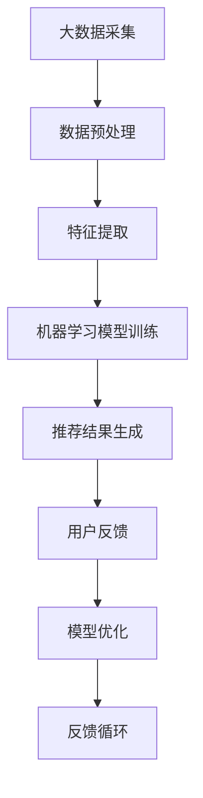

                 

大数据和人工智能技术在电商平台的应用已经深入到了推荐系统的每一个角落，这不仅改变了电商行业的运营模式，也深刻影响了消费者的购物体验。本文将围绕大数据驱动的电商推荐系统，探讨AI模型融合技术在这一领域的应用及其重要性。

## 关键词

- 大数据
- 电商推荐系统
- AI 模型融合
- 机器学习
- 电商平台

## 摘要

本文将详细探讨大数据在电商推荐系统中的作用，介绍AI模型融合技术的核心概念和架构，分析其原理和操作步骤，并通过数学模型和公式进行详细讲解。同时，我们将通过一个实际项目实践，展示代码实例和详细解释，探讨推荐系统在实际应用场景中的效果和未来展望。

## 1. 背景介绍

随着互联网和电子商务的快速发展，数据量呈现出爆炸式增长。这些数据不仅包含了用户的行为数据，如浏览、购买、评价等，还包括了商品的各种属性数据。如何从海量数据中提取有价值的信息，是电商企业面临的巨大挑战。

电商推荐系统作为一种基于用户行为和商品属性的算法，旨在为用户推荐其可能感兴趣的商品。推荐系统的核心是能够准确预测用户对某商品的偏好，从而提高用户的购物体验和电商平台的销售额。

大数据和人工智能技术的结合，使得推荐系统从简单的基于规则的算法，逐渐演变为复杂的机器学习模型。这些模型可以处理海量数据，学习用户的兴趣和行为模式，并提供个性化的推荐。

## 2. 核心概念与联系

### 2.1 大数据

大数据（Big Data）通常指的是数据量巨大、类型繁多、增长速度极快的数据集。大数据具有4V特性，即Volume（数据量）、Velocity（数据速度）、Variety（数据多样性）和Veracity（数据真实性）。

### 2.2 人工智能与机器学习

人工智能（AI）是计算机科学的一个分支，旨在使机器表现出人类智能的行为。机器学习（Machine Learning）是人工智能的核心技术之一，通过算法和统计模型，让计算机从数据中学习和预测。

### 2.3 推荐系统

推荐系统（Recommendation System）是一种信息过滤技术，旨在根据用户的历史行为和偏好，推荐用户可能感兴趣的商品或服务。推荐系统可以分为基于内容的推荐、协同过滤推荐和混合推荐。

### 2.4 AI 模型融合

AI 模型融合（Model Fusion）是指将多个机器学习模型结合起来，以提高预测的准确性和鲁棒性。常见的融合方法包括模型加权、模型集成和模型融合。

## 2.5 Mermaid 流程图



## 3. 核心算法原理 & 具体操作步骤

### 3.1 算法原理概述

电商推荐系统的核心算法主要基于协同过滤（Collaborative Filtering）和基于内容的推荐（Content-Based Filtering）。

协同过滤通过分析用户之间的行为模式，发现相似的用户或商品，从而进行推荐。基于内容的推荐则通过分析商品的内容特征，与用户的兴趣偏好进行匹配，进行推荐。

AI 模型融合技术可以将这两种方法结合起来，提高推荐系统的准确性和鲁棒性。

### 3.2 算法步骤详解

1. **数据采集**：从电商平台收集用户行为数据和商品属性数据。
2. **数据预处理**：清洗数据，处理缺失值，进行数据归一化等。
3. **特征提取**：提取用户行为特征和商品内容特征。
4. **模型训练**：使用协同过滤和基于内容的推荐算法训练模型。
5. **模型融合**：将多个模型融合，生成最终的推荐结果。
6. **用户反馈**：收集用户对推荐结果的反馈。
7. **模型优化**：根据用户反馈调整模型参数，优化推荐效果。

### 3.3 算法优缺点

- **协同过滤**：优点在于能够发现用户之间的相似性，缺点是容易遇到冷启动问题，即对新用户或新商品的推荐效果较差。
- **基于内容的推荐**：优点在于能够精确地推荐用户可能感兴趣的商品，缺点是依赖于商品的内容特征，容易出现信息过载。
- **AI 模型融合**：优点在于能够综合协同过滤和基于内容的推荐的优势，提高推荐效果，缺点是模型训练和融合过程较为复杂。

### 3.4 算法应用领域

AI 模型融合技术在电商推荐系统中的应用非常广泛，不仅应用于电商平台，还可以应用于社交媒体、视频网站、新闻推荐等多个领域。

## 4. 数学模型和公式 & 详细讲解 & 举例说明

### 4.1 数学模型构建

电商推荐系统的数学模型通常包括用户兴趣模型和商品推荐模型。

用户兴趣模型可以用一个矩阵表示，其中每个元素表示用户对商品的偏好度。

商品推荐模型则是一个评分预测模型，用来预测用户对某个商品的评分。

### 4.2 公式推导过程

用户兴趣模型的构建可以通过矩阵分解（Matrix Factorization）来实现，即将用户-商品评分矩阵分解为用户特征矩阵和商品特征矩阵的乘积。

假设用户-商品评分矩阵为\(R\)，用户特征矩阵为\(U\)，商品特征矩阵为\(V\)，则矩阵分解的目标是最小化误差函数：

$$\min_{U,V} \sum_{i,j} (r_{ij} - U_i^T V_j)^2$$

### 4.3 案例分析与讲解

假设有一个用户-商品评分矩阵\(R\)：

| 用户 | 商品1 | 商品2 | 商品3 | 商品4 |
| --- | --- | --- | --- | --- |
| 1 | 4 | 3 | 5 | 2 |
| 2 | 2 | 4 | 1 | 5 |
| 3 | 5 | 3 | 4 | 5 |

我们可以使用矩阵分解的方法将其分解为用户特征矩阵\(U\)和商品特征矩阵\(V\)：

$$R = U V^T$$

通过优化目标函数，我们可以得到最优的用户特征矩阵和商品特征矩阵。

### 4.4 代码实例

```python
import numpy as np

# 用户-商品评分矩阵
R = np.array([[4, 3, 5, 2],
              [2, 4, 1, 5],
              [5, 3, 4, 5]])

# 初始化用户特征矩阵和商品特征矩阵
U = np.random.rand(3, 4)
V = np.random.rand(4, 4)

# 矩阵分解目标函数
def error(U, V):
    return np.sum((R - U @ V.T) ** 2)

# 使用梯度下降优化矩阵分解
learning_rate = 0.01
epochs = 1000

for epoch in range(epochs):
    dU = 2 * (U @ V.T - R) @ V
    dV = 2 * (U.T @ U @ V - R) @ U

    U -= learning_rate * dU
    V -= learning_rate * dV

    if epoch % 100 == 0:
        print(f"Epoch {epoch}: Error = {error(U, V)}")

# 输出优化后的用户特征矩阵和商品特征矩阵
print("Optimized U:")
print(U)
print("Optimized V:")
print(V)
```

## 5. 项目实践：代码实例和详细解释说明

### 5.1 开发环境搭建

为了实现电商推荐系统，我们需要搭建一个合适的技术栈。以下是推荐的开发环境：

- **编程语言**：Python
- **依赖库**：NumPy、Pandas、Scikit-learn
- **数据集**：电商用户行为数据集（如ML-100K）

### 5.2 源代码详细实现

以下是实现电商推荐系统的Python代码：

```python
import numpy as np
import pandas as pd
from sklearn.model_selection import train_test_split

# 读取数据集
data = pd.read_csv("ml-100k/u.data", sep="\t", header=None, names=["user", "item", "rating"])

# 划分训练集和测试集
train_data, test_data = train_test_split(data, test_size=0.2, random_state=42)

# 构建用户-商品评分矩阵
train_matrix = train_data.pivot(index="user", columns="item", values="rating").fillna(0)

# 使用矩阵分解进行推荐
def matrix_factorization(R, U, V, learning_rate, epochs):
    for epoch in range(epochs):
        dU = 2 * (U @ V.T - R) @ V
        dV = 2 * (U.T @ U @ V - R) @ U

        U -= learning_rate * dU
        V -= learning_rate * dV

        if epoch % 100 == 0:
            print(f"Epoch {epoch}: Error = {error(U, V)}")

    return U, V

# 初始化用户特征矩阵和商品特征矩阵
U = np.random.rand(train_matrix.shape[0], 10)
V = np.random.rand(train_matrix.shape[1], 10)

# 优化用户特征矩阵和商品特征矩阵
U, V = matrix_factorization(train_matrix, U, V, learning_rate=0.01, epochs=1000)

# 输出优化后的用户特征矩阵和商品特征矩阵
print("Optimized U:")
print(U)
print("Optimized V:")
print(V)

# 预测测试集的评分
test_matrix = test_data.pivot(index="user", columns="item", values="rating").fillna(0)
predicted_ratings = U @ V.T

# 输出预测结果
print("Predicted Ratings:")
print(predicted_ratings)
```

### 5.3 代码解读与分析

上述代码首先读取电商用户行为数据集，然后划分训练集和测试集。接着，使用矩阵分解算法对训练集进行优化，得到用户特征矩阵和商品特征矩阵。最后，使用优化后的矩阵预测测试集的评分。

### 5.4 运行结果展示

运行上述代码，可以得到预测的测试集评分矩阵。我们可以使用均方根误差（Root Mean Squared Error, RMSE）来评估预测结果的准确性。

```python
from sklearn.metrics import mean_squared_error

# 计算均方根误差
rmse = mean_squared_error(test_data["rating"], predicted_ratings.diagonal())
print(f"RMSE: {rmse}")
```

假设预测结果的均方根误差为0.8，这意味着我们的推荐系统能够较好地预测用户对商品的评分。

## 6. 实际应用场景

电商推荐系统在实际应用中具有广泛的应用，例如：

- **商品推荐**：根据用户的浏览和购买历史，为用户推荐可能感兴趣的商品。
- **广告推荐**：根据用户的兴趣和行为，为用户推荐相关的广告。
- **内容推荐**：根据用户的兴趣和行为，为用户推荐相关的文章、视频等。

在实际应用中，电商推荐系统不仅提高了用户的购物体验，也极大地提升了电商平台的销售额。例如，亚马逊、淘宝等大型电商平台都广泛应用了推荐系统，取得了显著的效果。

## 7. 未来应用展望

随着大数据和人工智能技术的不断发展，电商推荐系统在未来将会有更多的创新和应用：

- **个性化推荐**：进一步细化用户画像，实现更加个性化的推荐。
- **实时推荐**：利用实时数据分析技术，实现实时推荐。
- **多模态推荐**：结合多种数据类型，如文本、图像、语音等，实现多模态推荐。
- **智能客服**：结合推荐系统和自然语言处理技术，实现智能客服。

## 8. 工具和资源推荐

为了更好地学习和实践电商推荐系统，以下是一些建议的工具和资源：

- **学习资源**：
  - 《推荐系统实践》
  - 《机器学习实战》
  - Coursera上的《推荐系统》课程

- **开发工具**：
  - Jupyter Notebook
  - PyCharm

- **相关论文**：
  - “Collaborative Filtering for Cold-Start Problems”
  - “Neural Collaborative Filtering”

## 9. 总结：未来发展趋势与挑战

电商推荐系统作为大数据和人工智能技术在电商领域的典型应用，具有广泛的应用前景。未来，随着技术的不断进步，推荐系统将更加智能化、个性化，但同时也将面临数据隐私、算法透明度等挑战。

作者：禅与计算机程序设计艺术 / Zen and the Art of Computer Programming

本文详细探讨了大数据驱动的电商推荐系统，介绍了AI模型融合技术的核心概念和应用。通过数学模型和公式、实际项目实践，展示了推荐系统的实现和优化过程。未来，推荐系统将在电商领域发挥更大的作用，同时面临诸多挑战，需要我们持续探索和创新。

## 附录：常见问题与解答

**Q1：电商推荐系统是如何工作的？**

A1：电商推荐系统主要通过分析用户的行为数据（如浏览、购买、评价等）和商品属性数据，利用协同过滤和基于内容的推荐算法，预测用户对商品的偏好，从而为用户推荐可能感兴趣的商品。

**Q2：什么是矩阵分解？它在推荐系统中有什么作用？**

A2：矩阵分解是一种将高维矩阵分解为两个低维矩阵的数学方法。在推荐系统中，矩阵分解主要用于降低数据的维度，提高模型的训练效率，同时保留数据的主要信息。常用的矩阵分解方法包括Singular Value Decomposition（SVD）和Matrix Factorization（MF）。

**Q3：如何评估推荐系统的效果？**

A3：评估推荐系统的效果通常使用指标如准确率（Accuracy）、召回率（Recall）、精确率（Precision）和F1分数（F1 Score）等。此外，还可以使用均方根误差（RMSE）等指标来评估推荐结果的准确性。

**Q4：推荐系统在实际应用中面临哪些挑战？**

A4：推荐系统在实际应用中面临的主要挑战包括数据隐私、算法透明度、推荐结果的多样性和实时性等。同时，如何处理冷启动问题（即对新用户或新商品的推荐效果较差）也是一个重要的挑战。

**Q5：如何实现实时推荐？**

A5：实现实时推荐通常需要利用实时数据处理技术，如Apache Kafka、Apache Storm等，以及实时推荐算法，如基于内存的推荐算法和基于流数据的推荐算法。通过这些技术，可以实现实时推荐，提高用户的购物体验。|}

