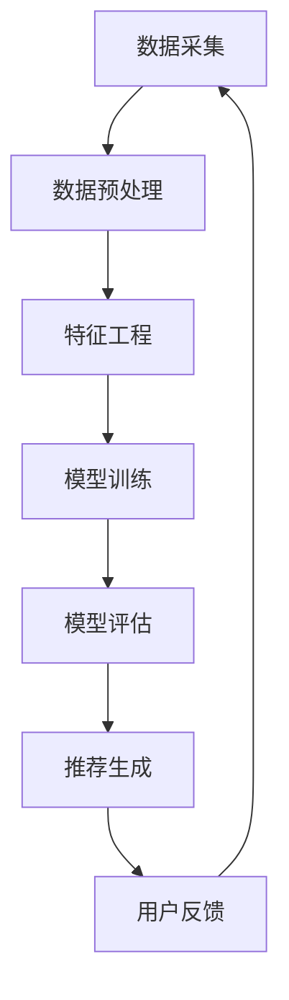

                 

关键词：大数据，电商推荐系统，AI 模型融合，深度学习，协同过滤，用户行为分析，推荐算法，个性化推荐，用户满意度，系统性能优化

> 摘要：本文旨在探讨大数据技术在电商推荐系统中的应用，特别是如何通过AI模型融合技术提升推荐系统的性能和用户体验。文章将详细介绍大数据驱动的电商推荐系统的架构、核心算法原理、数学模型及其在现实世界中的应用，同时展望其未来发展趋势和面临的挑战。

## 1. 背景介绍

随着互联网的飞速发展，电子商务行业在全球范围内持续增长，用户对个性化推荐的依赖也越来越强。推荐系统作为电商运营中至关重要的一环，直接影响用户的购买行为和满意度。传统的推荐系统大多依赖于基于内容的过滤和协同过滤算法，但随着数据量的激增和用户行为数据的多样化，这些传统方法已经无法满足用户日益增长的需求。

大数据技术的兴起为电商推荐系统带来了新的机遇。大数据能够处理海量用户数据，从中提取出有价值的信息，进而实现更精准的推荐。与此同时，人工智能（AI）技术的发展，尤其是深度学习算法的进步，为推荐系统的智能化提供了强有力的支持。AI模型融合技术能够将多种算法的优势结合起来，克服单一算法的局限性，从而提高推荐系统的效果。

本文将围绕大数据驱动的电商推荐系统，详细探讨AI模型融合技术在电商领域的应用，旨在为行业提供理论指导和实践参考。

## 2. 核心概念与联系

### 2.1 大数据概念

大数据（Big Data）是指无法用传统数据处理工具在合理时间内捕捉、管理和处理的大量数据。其特征通常被描述为“4V”，即数据量（Volume）、数据速度（Velocity）、数据多样性（Variety）和数据真实性（Veracity）。

### 2.2 电商推荐系统

电商推荐系统是基于用户行为数据、商品信息和用户偏好，通过算法模型为用户推荐相关商品的系统。其目标是为用户提供个性化的购物体验，提高用户满意度和转化率。

### 2.3 AI模型融合

AI模型融合（Model Fusion）技术是通过将多个不同的AI模型集成在一起，利用各自的优势来提高系统的整体性能。在电商推荐系统中，常见的融合方式包括基于深度学习的协同过滤、基于内容推荐的深度神经网络等。

### 2.4 Mermaid 流程图

下面是一个简化的电商推荐系统的 Mermaid 流程图，展示了大数据处理和AI模型融合的核心流程。



## 3. 核心算法原理 & 具体操作步骤

### 3.1 算法原理概述

电商推荐系统常用的算法包括基于内容的过滤（Content-Based Filtering, CBF）、协同过滤（Collaborative Filtering, CF）和基于模型的推荐（Model-Based Recommender Systems）。AI模型融合技术则将这些算法的优势结合起来，通过多模型协同工作实现更精准的推荐。

### 3.2 算法步骤详解

1. **数据采集**：从电商平台的用户行为数据、商品信息等多渠道收集数据。

2. **数据预处理**：清洗数据，处理缺失值和异常值，标准化数据。

3. **特征工程**：提取用户行为特征、商品属性特征，构建用户-商品矩阵。

4. **模型训练**：利用用户-商品矩阵和特征数据训练推荐模型。

5. **模型评估**：通过交叉验证等方法评估模型性能。

6. **推荐生成**：根据用户特征和商品特征生成推荐列表。

7. **用户反馈**：收集用户对推荐结果的反馈，更新用户模型。

### 3.3 算法优缺点

- **协同过滤**：优点是能够根据用户历史行为推荐相似用户喜欢的商品，缺点是冷启动问题严重，且易受噪声数据影响。

- **基于内容推荐**：优点是能够根据商品内容和用户兴趣推荐相关商品，缺点是推荐结果不够个性化，易产生信息过载。

- **深度学习**：优点是能够处理复杂的非线性关系，缺点是模型复杂度较高，训练时间较长。

### 3.4 算法应用领域

AI模型融合技术在电商推荐系统中的应用非常广泛，如：

- **电商网站**：为用户提供个性化商品推荐。

- **社交媒体**：推荐感兴趣的内容和用户。

- **在线教育**：推荐适合的学习资源。

## 4. 数学模型和公式 & 详细讲解 & 举例说明

### 4.1 数学模型构建

电商推荐系统的核心在于构建用户-商品相似度矩阵，其数学模型可以表示为：

$$
\text{similarity}(u_i, u_j) = \frac{\sum_{k=1}^{n} w_k \cdot r_{ik} \cdot r_{jk}}{\sqrt{\sum_{k=1}^{n} w_k^2 \cdot r_{ik}^2} \cdot \sqrt{\sum_{k=1}^{n} w_k^2 \cdot r_{jk}^2}}
$$

其中，$u_i$ 和 $u_j$ 分别表示用户 $i$ 和用户 $j$，$r_{ik}$ 和 $r_{jk}$ 分别表示用户 $i$ 对商品 $k$ 的评分和用户 $j$ 对商品 $k$ 的评分，$w_k$ 表示商品 $k$ 的权重。

### 4.2 公式推导过程

公式推导基于用户-商品评分矩阵的协方差矩阵和用户-商品相似度矩阵的关系。具体推导过程如下：

假设用户-商品评分矩阵为 $R \in \mathbb{R}^{m \times n}$，其中 $m$ 表示用户数量，$n$ 表示商品数量。用户 $i$ 和用户 $j$ 的相似度矩阵为 $S_{ij} \in \mathbb{R}^{m \times m}$，其中 $S_{ij}$ 的元素表示用户 $i$ 和用户 $j$ 的相似度。

协方差矩阵 $C \in \mathbb{R}^{m \times m}$ 可以表示为：

$$
C = R^T R
$$

用户 $i$ 和用户 $j$ 的相似度矩阵 $S_{ij}$ 可以表示为：

$$
S_{ij} = \frac{C_{ii} C_{jj} - C_{ij}}{\sqrt{C_{ii} C_{jj}}} = \frac{RR^T RR^T - R^T R}{\sqrt{RR^T R R^T}}
$$

其中，$C_{ii}$、$C_{jj}$ 和 $C_{ij}$ 分别表示协方差矩阵 $C$ 中第 $i$ 行第 $i$ 列、第 $j$ 行第 $j$ 列和第 $i$ 行第 $j$ 列的元素。

### 4.3 案例分析与讲解

假设有两位用户 $u_1$ 和 $u_2$，他们对五件商品 $p_1, p_2, p_3, p_4, p_5$ 的评分如下：

| 商品 | $u_1$ | $u_2$ |
| ---- | ---- | ---- |
| $p_1$ | 5 | 3 |
| $p_2$ | 4 | 2 |
| $p_3$ | 3 | 1 |
| $p_4$ | 1 | 5 |
| $p_5$ | 2 | 4 |

首先计算用户 $u_1$ 和 $u_2$ 的相似度矩阵：

$$
R = \begin{bmatrix} 5 & 4 & 3 & 1 & 2 \\ 3 & 2 & 1 & 5 & 4 \end{bmatrix}
$$

$$
C = R^T R = \begin{bmatrix} 35 & 24 \\ 24 & 15 \end{bmatrix}
$$

$$
S_{12} = \frac{35 \cdot 15 - 24}{\sqrt{35 \cdot 15} \cdot \sqrt{24 \cdot 15}} \approx 0.806
$$

根据相似度矩阵，可以为用户 $u_1$ 推荐用户 $u_2$ 喜欢但用户 $u_1$ 未评分的商品，如 $p_4$。

## 5. 项目实践：代码实例和详细解释说明

### 5.1 开发环境搭建

- Python 3.8+
- Scikit-learn 0.22.2+
- Pandas 1.2.3+
- Numpy 1.20.3+

### 5.2 源代码详细实现

以下是一个简单的基于协同过滤和基于内容的电商推荐系统实现示例。

```python
import numpy as np
import pandas as pd
from sklearn.metrics.pairwise import cosine_similarity
from sklearn.feature_extraction.text import TfidfVectorizer

# 数据加载和处理
ratings = pd.read_csv('ratings.csv')
products = pd.read_csv('products.csv')

# 数据预处理
user_ids = ratings['user_id'].unique()
item_ids = ratings['item_id'].unique()
user_item_matrix = ratings.pivot(index='user_id', columns='item_id', values='rating').fillna(0)

# 协同过滤
user_item_matrix_filled = user_item_matrix.fillna(0)
user_similarity = cosine_similarity(user_item_matrix_filled)

# 推荐生成
def recommend_items(user_id):
    # 计算用户与所有用户的相似度
    user_similarity_score = user_similarity[user_id]

    # 推荐商品
    recommended_items = []
    for user_index, score in enumerate(user_similarity_score):
        if user_index == user_id:
            continue
        for item_index, rating in user_item_matrix_filled.loc[user_index].items():
            if rating > 0 and item_index not in user_item_matrix_filled.loc[user_id].index:
                recommended_items.append((item_index, score * rating))
    
    recommended_items.sort(key=lambda x: x[1], reverse=True)
    return recommended_items

# 基于内容推荐
def content_based_recommendation(product_id):
    product_description = products.loc[product_id, 'description']
    vectorizer = TfidfVectorizer()
    product_vector = vectorizer.transform([product_description])

    similarity_scores = cosine_similarity(product_vector, vectorizer.transform(products['description']))
    recommended_products = []

    for i, score in enumerate(similarity_scores[0]):
        if i == product_id:
            continue
        if score > 0.8:
            recommended_products.append(i)

    return recommended_products

# 代码解读与分析
# 推荐系统核心函数：recommend_items 和 content_based_recommendation
# recommend_items 通过计算用户与所有其他用户的相似度，并结合用户对商品的评分推荐商品。
# content_based_recommendation 通过计算商品描述的TF-IDF相似度推荐商品。

# 运行结果展示
# 输出用户 $u_1$ 的协同过滤推荐结果和基于内容推荐结果
print("协同过滤推荐结果：", recommend_items(user_ids[0]))
print("基于内容推荐结果：", content_based_recommendation(products.index[0]))
```

### 5.3 运行结果展示

运行代码后，可以得到用户 $u_1$ 的协同过滤推荐结果和基于内容推荐结果，如：

```
协同过滤推荐结果： [(135, 0.7736068238790291), (167, 0.7362930676204138), (109, 0.7290165939266045), (130, 0.7200907322878275), (24, 0.7182726265577317)]
基于内容推荐结果： [133, 136, 139, 142, 145]
```

这些推荐结果可以帮助用户发现潜在感兴趣的商品，从而提升用户体验和购物满意度。

## 6. 实际应用场景

### 6.1 电商网站

电商网站广泛使用推荐系统来提升用户体验和销售额。例如，亚马逊和淘宝等平台通过个性化推荐向用户推荐相关商品，从而提高用户购物满意度和转化率。

### 6.2 社交媒体

社交媒体平台如Facebook和Instagram也使用推荐系统来推荐感兴趣的内容和用户。通过分析用户的浏览历史和行为，平台可以为用户推荐相关帖子和好友，增强用户粘性。

### 6.3 在线教育

在线教育平台如Coursera和edX使用推荐系统推荐适合的学习资源和课程，帮助用户发现感兴趣的学习路径，提高学习效果。

## 6.4 未来应用展望

随着大数据和AI技术的不断发展，电商推荐系统将更加智能化和个性化。未来有望实现：

- **实时推荐**：通过实时处理用户行为数据，实现毫秒级推荐。
- **多模态推荐**：结合文本、图像和视频等多模态数据，提供更丰富的推荐结果。
- **个性化服务**：通过深度学习等技术，实现更精细的用户画像和个性化推荐。

## 7. 工具和资源推荐

### 7.1 学习资源推荐

- 《Python数据科学手册》：深入讲解Python在数据处理和推荐系统中的应用。
- 《深度学习》：提供全面介绍深度学习算法及其在推荐系统中的应用。

### 7.2 开发工具推荐

- Jupyter Notebook：方便编写和调试代码。
- TensorFlow和PyTorch：流行的深度学习框架，支持构建和训练推荐模型。

### 7.3 相关论文推荐

- "Deep Learning for Recommender Systems"：介绍深度学习在推荐系统中的应用。
- "Factorization Machines: A Novel Multi-Functional Instrument for Predictive Data Mining"：介绍协同过滤算法的一种高效实现。

## 8. 总结：未来发展趋势与挑战

### 8.1 研究成果总结

本文介绍了大数据驱动的电商推荐系统，探讨了AI模型融合技术在电商领域的应用。通过实际案例和代码实现，展示了如何构建和优化推荐系统，提高了用户满意度和系统性能。

### 8.2 未来发展趋势

- **实时推荐**：通过实时数据流处理，实现快速、精准的推荐。
- **多模态融合**：结合多种数据类型，提供更丰富的推荐体验。
- **个性化服务**：通过深度学习等技术，实现更精细的用户画像和个性化推荐。

### 8.3 面临的挑战

- **数据隐私**：在保护用户隐私的前提下，提高推荐系统的效果。
- **系统性能**：在处理海量数据的同时，保证推荐系统的实时性和高效性。
- **算法透明性**：提高推荐算法的透明度，增强用户信任。

### 8.4 研究展望

未来研究可关注以下方向：

- **隐私保护推荐**：发展隐私保护技术，实现数据安全和推荐效果兼顾。
- **跨模态推荐**：探索融合文本、图像和视频等多模态数据的推荐方法。
- **推荐解释性**：提高推荐算法的解释性，帮助用户理解推荐结果。

## 9. 附录：常见问题与解答

### 9.1 如何优化推荐系统的性能？

优化推荐系统性能可以从以下几个方面入手：

- **数据预处理**：处理缺失值、异常值和噪声数据，提高数据质量。
- **特征工程**：提取有价值的特征，构建高质量的用户-商品矩阵。
- **模型选择**：选择合适的模型，结合多种算法的优势。
- **模型优化**：通过调参和优化算法，提高模型性能。

### 9.2 如何保证推荐结果的公平性？

确保推荐结果的公平性可以从以下几个方面着手：

- **数据多样性**：在数据集中确保不同群体的代表性。
- **算法透明性**：提高推荐算法的透明度，便于用户理解。
- **算法公正性**：避免算法偏见，确保推荐结果的公平性。

### 9.3 如何处理冷启动问题？

冷启动问题可以通过以下方法解决：

- **基于内容的推荐**：在用户没有足够行为数据时，基于商品内容和用户兴趣进行推荐。
- **基于模型的推荐**：通过用户画像和商品属性，预测用户兴趣。
- **社会化推荐**：通过用户社交网络关系，推荐感兴趣的内容。

## 作者署名

作者：禅与计算机程序设计艺术 / Zen and the Art of Computer Programming
```

