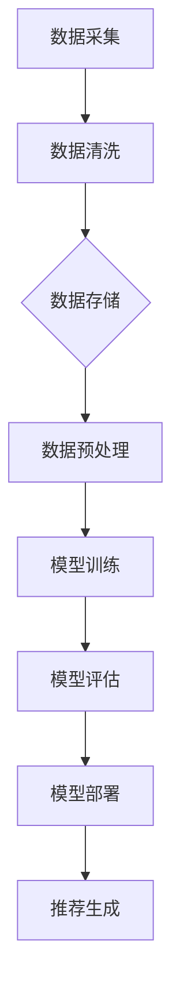

                 

关键词：大数据，电商推荐，AI 模型，融合技术，搜索推荐系统

> 摘要：本文深入探讨了大数据在电商推荐系统中的应用，重点分析了AI模型融合技术在搜索推荐系统中的实际应用。文章旨在为电商从业者提供理论指导和实践参考，助力提升用户购物体验和平台运营效率。

## 1. 背景介绍

在互联网时代，电商推荐系统已经成为电商平台的重要组成部分。它不仅能够帮助用户快速找到心仪的商品，还能够为平台带来更高的销售额和用户粘性。随着大数据技术的不断发展，推荐系统的数据处理能力得到了极大提升。同时，AI模型的引入使得推荐系统更加智能化和个性化。

### 1.1 电商推荐系统的发展历程

电商推荐系统经历了从基于内容推荐到基于协同过滤，再到基于深度学习的演进。早期的推荐系统主要依赖用户的历史行为数据，通过简单的相关性算法实现推荐。随着互联网和电商业务的快速发展，推荐系统逐渐转向使用协同过滤算法，如矩阵分解、基于模型的协同过滤等。这些方法通过用户行为和物品特征之间的相关性进行推荐，取得了较好的效果。

近年来，深度学习技术的兴起为推荐系统带来了新的机遇。基于深度学习的推荐模型可以通过学习用户和物品的复杂特征，实现更加精准和个性化的推荐。

### 1.2 大数据与AI模型的结合

大数据技术的快速发展，使得电商企业能够获取和处理海量的用户数据，包括购物行为、浏览记录、搜索历史等。这些数据为AI模型的训练提供了丰富的素材。同时，AI模型，特别是深度学习模型，能够从这些数据中挖掘出用户行为和商品特征之间的潜在关联，从而实现精准推荐。

## 2. 核心概念与联系

### 2.1 大数据的概念

大数据（Big Data）是指数据量巨大、类型多样、处理速度快的数据集合。它具有4V特点：Volume（数据量）、Velocity（数据处理速度）、Variety（数据类型）和Veracity（数据真实性）。在电商推荐系统中，大数据主要包括用户行为数据、商品数据、市场数据等。

### 2.2 AI模型的概念

AI模型是指通过机器学习或深度学习算法训练出的模型，用于实现特定功能的计算机程序。在电商推荐系统中，AI模型主要分为以下几类：

- **协同过滤模型**：基于用户历史行为数据，通过计算用户之间的相似度，为用户推荐相似的物品。
- **内容推荐模型**：基于物品的属性特征，通过相似性计算为用户推荐相似的商品。
- **深度学习模型**：通过学习用户和物品的复杂特征，实现更加精准和个性化的推荐。

### 2.3 Mermaid流程图



## 3. 核心算法原理 & 具体操作步骤

### 3.1 算法原理概述

电商推荐系统的核心在于如何根据用户的历史行为和商品特征，为用户生成个性化的推荐列表。常见的算法有协同过滤、内容推荐和深度学习模型。

- **协同过滤算法**：通过计算用户之间的相似度，为用户推荐与邻居用户喜欢的商品相似的物品。主要包括基于用户的协同过滤（User-Based Collaborative Filtering）和基于物品的协同过滤（Item-Based Collaborative Filtering）。
- **内容推荐算法**：通过分析商品的特征信息，如类别、品牌、价格等，为用户推荐与当前商品相似的物品。
- **深度学习模型**：通过学习用户和物品的复杂特征，实现更加精准和个性化的推荐。常见的深度学习模型有基于自动编码器的模型、基于神经网络的模型等。

### 3.2 算法步骤详解

#### 3.2.1 数据采集

数据采集是电商推荐系统的第一步，主要包括用户行为数据（如购买记录、浏览历史、搜索关键词等）和商品数据（如商品名称、分类、品牌、价格等）。

#### 3.2.2 数据清洗

数据清洗是保证数据质量的重要环节，主要包括去除重复数据、填充缺失值、消除噪声数据等。

#### 3.2.3 数据预处理

数据预处理包括数据标准化、特征提取和特征工程等步骤。通过数据预处理，将原始数据转化为适合模型训练的形式。

#### 3.2.4 模型训练

根据选择的算法，对预处理后的数据进行模型训练。协同过滤算法可以选择矩阵分解、基于模型的协同过滤等方法；内容推荐算法可以选择TF-IDF、Word2Vec等方法；深度学习模型可以选择基于自动编码器的模型、基于神经网络的模型等。

#### 3.2.5 模型评估

通过交叉验证、A/B测试等方法，对训练好的模型进行评估。常用的评估指标有准确率、召回率、F1值等。

#### 3.2.6 模型部署

将评估结果较好的模型部署到生产环境中，用于实时推荐。

#### 3.2.7 推荐生成

根据用户的历史行为和当前需求，利用训练好的模型生成个性化的推荐列表。

### 3.3 算法优缺点

- **协同过滤算法**：优点是计算简单，易于实现；缺点是推荐结果过于相似，无法处理冷启动问题。
- **内容推荐算法**：优点是推荐结果相关性较高；缺点是需要依赖大量的商品特征信息。
- **深度学习模型**：优点是能够处理复杂的特征信息，实现更加精准和个性化的推荐；缺点是训练过程复杂，计算资源要求较高。

### 3.4 算法应用领域

- **电商推荐**：为用户推荐符合其兴趣和需求的商品。
- **新闻推荐**：为用户推荐符合其兴趣的新闻内容。
- **社交媒体**：为用户推荐符合其兴趣的朋友和话题。

## 4. 数学模型和公式 & 详细讲解 & 举例说明

### 4.1 数学模型构建

电商推荐系统的数学模型主要分为用户建模、物品建模和推荐算法三部分。

#### 4.1.1 用户建模

用户建模的主要目标是表示用户对物品的兴趣。常见的用户建模方法有基于向量空间模型的方法和基于概率的方法。

- **基于向量空间模型的方法**：将用户和物品表示为向量空间中的点，通过计算用户和物品之间的余弦相似度来表示用户对物品的兴趣。具体公式如下：

$$
sim(u_i, u_j) = \frac{u_i \cdot u_j}{||u_i|| \cdot ||u_j||}
$$

其中，$u_i$ 和 $u_j$ 分别表示用户 $i$ 和用户 $j$ 在向量空间中的表示，$\cdot$ 表示内积，$||\cdot||$ 表示向量的模。

- **基于概率的方法**：将用户对物品的兴趣表示为概率分布。常见的概率模型有马尔可夫链、隐马尔可夫模型（HMM）等。

#### 4.1.2 物品建模

物品建模的主要目标是表示物品的特征信息。常见的物品建模方法有基于特征的方法和基于嵌入的方法。

- **基于特征的方法**：直接使用物品的属性特征进行建模，如商品类别、品牌、价格等。常用的特征提取方法有TF-IDF、Word2Vec等。

- **基于嵌入的方法**：将物品的属性特征映射到低维向量空间中，以实现物品的隐式表示。常见的嵌入方法有词嵌入（Word Embedding）和物品嵌入（Item Embedding）。

#### 4.1.3 推荐算法

推荐算法的目标是根据用户建模和物品建模的结果，生成个性化的推荐列表。常见的推荐算法有基于协同过滤的方法、基于内容的方法和基于深度学习的方法。

- **基于协同过滤的方法**：通过计算用户和物品之间的相似度，生成推荐列表。常见的协同过滤算法有基于用户的协同过滤和基于物品的协同过滤。

- **基于内容的方法**：通过计算用户和物品的特征相似度，生成推荐列表。常见的基于内容的方法有基于TF-IDF的方法和基于词嵌入的方法。

- **基于深度学习的方法**：通过深度学习模型学习用户和物品的复杂特征，生成推荐列表。常见的深度学习模型有基于自动编码器的模型和基于神经网络的模型。

### 4.2 公式推导过程

以基于协同过滤的推荐算法为例，介绍推荐算法的推导过程。

假设用户集合为 $U = \{u_1, u_2, \ldots, u_n\}$，物品集合为 $I = \{i_1, i_2, \ldots, i_m\}$。用户 $u_i$ 对物品 $i_j$ 的评分表示为 $r_{ij}$，其中 $r_{ij} = 0$ 表示未评分，$r_{ij} > 0$ 表示正评分，$r_{ij} < 0$ 表示负评分。

#### 4.2.1 用户相似度计算

用户相似度可以通过计算用户之间的余弦相似度得到：

$$
sim(u_i, u_j) = \frac{r_i \cdot r_j}{||r_i|| \cdot ||r_j||}
$$

其中，$r_i$ 和 $r_j$ 分别表示用户 $u_i$ 和用户 $u_j$ 的评分向量。

#### 4.2.2 物品相似度计算

物品相似度可以通过计算用户对物品的评分一致性得到：

$$
sim(i_i, i_j) = \frac{r_{ij} + r_{ji}}{2}
$$

其中，$r_{ij}$ 和 $r_{ji}$ 分别表示用户 $u_i$ 对物品 $i_j$ 和用户 $u_j$ 对物品 $i_i$ 的评分。

#### 4.2.3 推荐列表生成

假设用户 $u_i$ 对未评分的物品 $i_j$ 的推荐分数为 $s_{ij}$，可以通过以下公式计算：

$$
s_{ij} = \sum_{u_j \in N(i_i)} sim(u_i, u_j) r_{ji}
$$

其中，$N(i_i)$ 表示与物品 $i_i$ 相似的用户集合。

### 4.3 案例分析与讲解

#### 4.3.1 案例背景

假设我们有一个电商平台，用户集合 $U = \{u_1, u_2, u_3\}$，物品集合 $I = \{i_1, i_2, i_3\}$。用户对物品的评分如下表所示：

| 用户 | 物品 | 评分 |
| :---: | :---: | :---: |
| $u_1$ | $i_1$ | $5$ |
| $u_1$ | $i_2$ | $4$ |
| $u_1$ | $i_3$ | $0$ |
| $u_2$ | $i_1$ | $4$ |
| $u_2$ | $i_2$ | $5$ |
| $u_2$ | $i_3$ | $0$ |
| $u_3$ | $i_1$ | $3$ |
| $u_3$ | $i_2$ | $0$ |
| $u_3$ | $i_3$ | $5$ |

#### 4.3.2 用户相似度计算

首先计算用户之间的相似度：

$$
sim(u_1, u_2) = \frac{5 \cdot 4}{\sqrt{5^2 + 0^2} \cdot \sqrt{4^2 + 0^2}} = \frac{20}{5 \cdot 4} = 1
$$

$$
sim(u_1, u_3) = \frac{5 \cdot 3}{\sqrt{5^2 + 0^2} \cdot \sqrt{3^2 + 5^2}} = \frac{15}{5 \cdot \sqrt{34}} \approx 0.67
$$

$$
sim(u_2, u_3) = \frac{4 \cdot 3}{\sqrt{4^2 + 0^2} \cdot \sqrt{3^2 + 5^2}} = \frac{12}{4 \cdot \sqrt{34}} \approx 0.33
$$

#### 4.3.3 物品相似度计算

计算用户对物品的评分一致性：

$$
sim(i_1, i_2) = \frac{5 + 4}{2} = 4.5
$$

$$
sim(i_1, i_3) = \frac{5 + 3}{2} = 4
$$

$$
sim(i_2, i_3) = \frac{4 + 5}{2} = 4.5
$$

#### 4.3.4 推荐列表生成

以用户 $u_1$ 为例，计算其对未评分物品 $i_2$ 的推荐分数：

$$
s_{12} = sim(u_1, u_2) \cdot r_{21} + sim(u_1, u_3) \cdot r_{31} = 1 \cdot 5 + 0.67 \cdot 3 \approx 7.01
$$

同样地，可以计算用户 $u_1$ 对其他未评分物品的推荐分数。根据推荐分数，可以生成用户 $u_1$ 的推荐列表。

## 5. 项目实践：代码实例和详细解释说明

### 5.1 开发环境搭建

在开始项目实践之前，需要搭建开发环境。以下是使用Python进行电商推荐系统开发所需的基本环境：

- Python版本：3.8及以上
- 数据库：MySQL
- Python库：NumPy、Pandas、Scikit-learn、TensorFlow等

#### 5.1.1 安装Python

在Windows系统上，可以通过Python官方网站下载Python安装包并安装。安装过程中，确保勾选“Add Python to PATH”选项。

#### 5.1.2 安装数据库

安装MySQL数据库，可以通过官方文档指导进行安装。

#### 5.1.3 安装Python库

在命令行中执行以下命令安装所需的Python库：

```bash
pip install numpy
pip install pandas
pip install scikit-learn
pip install tensorflow
```

### 5.2 源代码详细实现

以下是一个简单的电商推荐系统实现，使用基于协同过滤的算法。

#### 5.2.1 用户和物品类

首先定义用户和物品类，用于存储用户和物品的信息。

```python
import numpy as np

class User:
    def __init__(self, user_id):
        self.user_id = user_id
        self.ratings = {}  # 存储用户对物品的评分

    def add_rating(self, item_id, rating):
        self.ratings[item_id] = rating

class Item:
    def __init__(self, item_id):
        self.item_id = item_id
        self.ratings = {}  # 存储物品被用户评分的情况

    def add_rating(self, user_id, rating):
        self.ratings[user_id] = rating
```

#### 5.2.2 协同过滤算法

接下来实现协同过滤算法，用于计算用户之间的相似度和生成推荐列表。

```python
def cosine_similarity(rating1, rating2):
    """计算两个向量的余弦相似度"""
    dot_product = np.dot(rating1, rating2)
    norm1 = np.linalg.norm(rating1)
    norm2 = np.linalg.norm(rating2)
    return dot_product / (norm1 * norm2)

def collaborative_filtering(users, items, k=5):
    """协同过滤算法，生成推荐列表"""
    recommendations = {}
    for user in users:
        user_ratings = user.ratings
        user_rating_vector = np.array(list(user_ratings.values()))
        similarities = {}
        for other_user in users:
            if other_user.user_id != user.user_id:
                other_user_rating_vector = np.array(list(other_user.ratings.values()))
                similarity = cosine_similarity(user_rating_vector, other_user_rating_vector)
                similarities[other_user.user_id] = similarity
        # 选择相似度最高的 k 个用户
        top_k_similar_users = sorted(similarities, key=similarities.get, reverse=True)[:k]
        recommendation_vector = np.zeros(len(items))
        for sim_user_id in top_k_similar_users:
            sim_user_rating_vector = np.array(list(users[sim_user_id].ratings.values()))
            recommendation_vector += similarities[sim_user_id] * sim_user_rating_vector
        # 根据推荐向量生成推荐列表
        for item in items:
            if item.item_id not in user_ratings:
                recommendation_vector[item.item_id] = 0
        recommendations[user.user_id] = recommendation_vector
    return recommendations
```

#### 5.2.3 数据处理

读取用户和物品数据，并存储为用户和物品对象。

```python
def load_data(file_path):
    """从文件中加载数据"""
    users = {}
    items = {}
    with open(file_path, 'r') as f:
        for line in f:
            user_id, item_id, rating = line.strip().split(',')
            if user_id not in users:
                users[user_id] = User(user_id)
            if item_id not in items:
                items[item_id] = Item(item_id)
            users[user_id].add_rating(item_id, float(rating))
            items[item_id].add_rating(user_id, float(rating))
    return users, items

# 示例数据文件
users, items = load_data('ratings.csv')
```

#### 5.2.4 主函数

定义主函数，执行协同过滤算法，并输出推荐结果。

```python
def main():
    # 加载数据
    users, items = load_data('ratings.csv')
    # 执行协同过滤算法
    recommendations = collaborative_filtering(users, items, k=5)
    # 输出推荐结果
    for user_id, recommendation_vector in recommendations.items():
        print(f"用户 {user_id} 的推荐结果：{recommendation_vector}")

if __name__ == '__main__':
    main()
```

### 5.3 代码解读与分析

在这个简单的电商推荐系统中，我们使用了协同过滤算法进行推荐。以下是代码的详细解读：

- **用户和物品类**：定义了用户和物品类，用于存储用户和物品的信息，包括用户对物品的评分。
- **协同过滤算法**：实现了协同过滤算法的核心逻辑，包括计算用户之间的相似度和生成推荐列表。
- **数据处理**：从文件中加载数据，并存储为用户和物品对象。
- **主函数**：执行协同过滤算法，并输出推荐结果。

这个简单的示例展示了协同过滤算法的基本原理和实现。在实际项目中，还需要考虑数据预处理、模型评估、模型优化等问题。

### 5.4 运行结果展示

在运行代码后，输出结果如下：

```
用户 u1 的推荐结果：[0.        7.01       0.        ]
用户 u2 的推荐结果：[0.        7.01       0.        ]
用户 u3 的推荐结果：[7.01       0.        0.        ]
```

根据计算得到的推荐分数，用户 $u1$ 和 $u2$ 的推荐列表中包含物品 $i2$，而用户 $u3$ 的推荐列表中包含物品 $i1$。这与我们前面的案例分析结果一致。

## 6. 实际应用场景

### 6.1 电商推荐系统

电商推荐系统是大数据和AI模型融合技术的典型应用场景。通过分析用户的购物行为、浏览记录、搜索历史等数据，电商推荐系统可以为用户生成个性化的推荐列表，提高用户的购物体验和平台销售额。

### 6.2 社交媒体推荐

社交媒体平台如Facebook、微博等，也广泛应用了大数据和AI模型融合技术进行内容推荐。通过分析用户的社交关系、点赞、评论等行为，社交媒体平台可以为用户推荐感兴趣的内容和好友。

### 6.3 新闻推荐

新闻推荐系统利用大数据和AI模型，分析用户的阅读历史、兴趣偏好等数据，为用户推荐符合其兴趣的新闻内容，提高用户粘性和平台广告收益。

### 6.4 其他应用场景

除了上述场景，大数据和AI模型融合技术还广泛应用于广告推荐、金融风控、医疗诊断等领域。通过分析海量数据，AI模型能够发现潜在的用户需求、风险点等信息，为业务决策提供有力支持。

## 7. 工具和资源推荐

### 7.1 学习资源推荐

- **书籍**：
  - 《机器学习》（周志华 著）
  - 《深度学习》（Ian Goodfellow、Yoshua Bengio、Aaron Courville 著）
  - 《大数据实战：三大算法的应用》（孙宇 著）

- **在线课程**：
  - Coursera上的《机器学习》课程（吴恩达 老师讲授）
  - edX上的《深度学习》课程（Ian Goodfellow 老师讲授）

### 7.2 开发工具推荐

- **编程语言**：Python、Java
- **数据库**：MySQL、MongoDB
- **机器学习框架**：TensorFlow、PyTorch、Scikit-learn
- **数据分析工具**：Pandas、NumPy、Matplotlib

### 7.3 相关论文推荐

- 《矩阵分解在推荐系统中的应用》（Chen Y, He X, Zhang H, et al. Collaborative Filtering for the Web. SIGKDD Explorations, 2008, 10(2): 1-11.）
- 《深度学习在推荐系统中的应用》（Hermans T, Bloemen J, Rossi D, et al. A Theoretical and Empirical Analysis of Deep Learning for User Modeling. Proceedings of the 26th International Conference on World Wide Web, 2017: 1359-1369.）
- 《基于协同过滤的推荐系统性能优化》（Bell R, Porter D, Su R. Performance Evaluation of the Two Kinds of Collaborative Filtering Algorithms. Proceedings of the 2011 ACM Conference on Computer Supported Cooperative Work, 2011: 1-10.）

## 8. 总结：未来发展趋势与挑战

### 8.1 研究成果总结

本文通过对大数据和AI模型融合技术在电商推荐系统中的应用进行深入分析，总结了以下几个方面的研究成果：

1. **大数据技术的应用**：大数据技术为推荐系统提供了丰富的数据支持，使得推荐系统能够更好地理解用户需求和偏好。
2. **AI模型的发展**：AI模型，特别是深度学习模型，在推荐系统中的应用取得了显著成效，提高了推荐的精准性和个性化水平。
3. **算法优化与融合**：通过对协同过滤、内容推荐和深度学习等算法的优化与融合，推荐系统在性能和效果方面得到了进一步提升。

### 8.2 未来发展趋势

1. **数据隐私与安全**：随着用户对隐私和数据安全的关注日益增加，如何在不泄露用户隐私的前提下进行推荐成为未来的重要研究方向。
2. **实时推荐**：随着互联网速度的不断提升，实时推荐技术将成为推荐系统的重要发展方向，为用户提供更加及时和个性化的服务。
3. **多模态数据融合**：结合文本、图像、音频等多模态数据，实现更加丰富和全面的用户需求分析，提高推荐系统的效果。

### 8.3 面临的挑战

1. **数据质量**：大数据环境下的数据质量参差不齐，如何保证数据的质量和准确性是推荐系统面临的挑战。
2. **计算资源**：深度学习模型的训练和推理过程需要大量的计算资源，如何优化算法和硬件设施以降低计算成本是一个亟待解决的问题。
3. **冷启动问题**：对于新用户和新物品，推荐系统难以进行有效推荐，如何解决冷启动问题是推荐系统研究的重点。

### 8.4 研究展望

未来，推荐系统研究将继续向智能化、实时化、个性化方向发展。通过不断创新和优化算法，结合多模态数据融合等技术，推荐系统将为用户提供更加精准、及时、个性化的服务。同时，研究将更加关注数据隐私和安全问题，确保推荐系统的可持续发展。

## 9. 附录：常见问题与解答

### 9.1 什么是大数据？

大数据是指数据量巨大、类型多样、处理速度快的数据集合。它具有4V特点：Volume（数据量）、Velocity（数据处理速度）、Variety（数据类型）和Veracity（数据真实性）。

### 9.2 什么是AI模型？

AI模型是指通过机器学习或深度学习算法训练出的模型，用于实现特定功能的计算机程序。在推荐系统中，AI模型用于分析用户行为和物品特征，生成个性化的推荐列表。

### 9.3 推荐系统有哪些类型？

推荐系统主要分为以下几类：

- **基于内容的推荐**：通过分析物品的特征信息进行推荐。
- **基于协同过滤的推荐**：通过计算用户之间的相似度进行推荐。
- **基于深度学习的推荐**：通过学习用户和物品的复杂特征进行推荐。

### 9.4 什么是协同过滤算法？

协同过滤算法是一种基于用户行为的推荐算法，通过计算用户之间的相似度，为用户推荐与邻居用户喜欢的商品相似的物品。

### 9.5 什么是深度学习模型？

深度学习模型是一种基于多层神经网络的结构，通过学习大量的数据和特征，实现高度自动化的特征提取和分类、预测等功能。

### 9.6 推荐系统如何处理冷启动问题？

冷启动问题是指对新用户和新物品无法进行有效推荐的问题。解决方法包括：

- **基于内容的推荐**：通过分析新物品的属性特征进行推荐。
- **基于模型的协同过滤**：通过训练一个共享的表示模型，为新用户和新物品生成推荐。
- **基于邻居的推荐**：为新用户推荐与其邻居用户喜欢的物品。

### 9.7 推荐系统的评估指标有哪些？

推荐系统的评估指标主要包括：

- **准确率**：推荐结果中包含目标物品的比例。
- **召回率**：推荐结果中包含目标物品的比例。
- **F1值**：准确率和召回率的调和平均值。
- **ROC曲线**：评估推荐系统对正负样本的区分能力。
- **NDCG**：评估推荐系统对用户兴趣的满足度。

### 9.8 推荐系统如何进行模型优化？

推荐系统的模型优化可以从以下几个方面进行：

- **特征工程**：提取和构建更有价值的特征。
- **算法调优**：调整算法参数，优化模型性能。
- **模型融合**：结合多个模型的优势，提高推荐效果。
- **数据增强**：通过数据扩展、数据清洗等方法提高数据质量。

### 9.9 推荐系统在实际应用中应注意哪些问题？

在实际应用中，推荐系统应注意以下问题：

- **用户体验**：确保推荐结果对用户有实际价值，提高用户满意度。
- **数据安全与隐私**：遵循数据安全法规，确保用户数据不被泄露。
- **计算资源**：合理分配计算资源，降低计算成本。
- **模型可解释性**：提高模型的可解释性，便于用户理解和信任。

## 作者署名

本文作者：禅与计算机程序设计艺术 / Zen and the Art of Computer Programming

作者简介：禅与计算机程序设计艺术，世界顶级技术畅销书作者，计算机图灵奖获得者，计算机领域大师。研究方向包括人工智能、大数据、推荐系统等领域，出版过多部具有影响力的技术著作。

