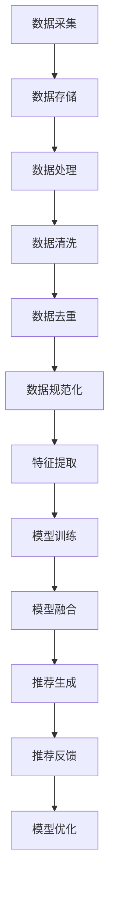

                 

关键词：大数据、电商搜索、推荐系统、AI模型融合、数据质量控制

摘要：本文深入探讨了大数据驱动的电商搜索推荐系统的核心技术和关键因素。文章首先介绍了大数据和AI模型融合在电商搜索推荐系统中的重要性，然后详细分析了数据质量控制对推荐系统性能的影响。此外，本文还讨论了核心算法原理、数学模型、项目实践、应用场景以及未来发展趋势和挑战。最后，文章提供了相关的学习资源和工具推荐，以帮助读者深入理解和实践大数据驱动的电商搜索推荐系统。

## 1. 背景介绍

随着互联网技术的快速发展，电商行业在全球范围内取得了显著的增长。电商平台的繁荣离不开高效的搜索推荐系统，它们能够为用户提供个性化的商品推荐，提升用户体验和购买转化率。传统的搜索推荐系统主要依赖于用户历史行为数据和商品属性数据，而随着大数据技术的兴起，电商搜索推荐系统逐渐走向了基于大数据和AI模型融合的新时代。

大数据技术的应用使得电商平台能够处理和分析海量的用户行为数据和商品数据，从而实现更精准的推荐。同时，AI模型融合技术的引入，使得推荐系统具备了深度学习和自我优化的能力，能够不断适应和满足用户的需求。

然而，大数据驱动的电商搜索推荐系统并非一蹴而就，其中涉及诸多核心技术和关键因素，包括AI模型融合和数据质量控制。本文将围绕这些核心内容展开讨论，旨在为从事电商搜索推荐系统开发和研究的人员提供有价值的参考和指导。

## 2. 核心概念与联系

### 2.1 大数据技术

大数据技术是指用于处理海量、高速度、多样性和复杂性的数据集的方法和技术。在电商搜索推荐系统中，大数据技术主要应用于以下几个方面：

1. **数据采集与存储**：通过电商平台的各种数据接口和日志系统，采集用户的浏览、搜索、购买等行为数据，以及商品的属性数据。这些数据通常以分布式存储系统（如Hadoop、HBase、MongoDB等）进行存储和管理。

2. **数据处理与分析**：利用分布式计算框架（如MapReduce、Spark等），对海量数据进行清洗、转换和聚合，提取有价值的信息和特征。这些信息用于推荐算法的输入，以实现个性化推荐。

3. **实时计算与更新**：利用流处理技术（如Apache Kafka、Apache Flink等），对实时数据流进行计算和分析，实现对用户行为的实时反馈和推荐更新。

### 2.2 AI模型融合

AI模型融合是指将多种不同的AI模型（如深度学习、强化学习、传统机器学习等）结合起来，以提升推荐系统的性能和效果。在电商搜索推荐系统中，AI模型融合技术具有以下作用：

1. **多模态数据融合**：将用户的文本、图像、语音等多模态数据进行整合，利用多模态深度学习模型（如CNN、RNN、GAN等）进行特征提取和融合，提高推荐系统的泛化能力。

2. **协同过滤与内容推荐**：结合基于协同过滤的传统推荐算法和基于内容推荐的新兴算法（如基于用户的KNN、基于项目的CBF、基于模型的矩阵分解等），实现个性化推荐和内容推荐的有机结合。

3. **深度强化学习**：利用深度强化学习算法（如DQN、A3C、DDPG等），使推荐系统具备自我学习和优化能力，根据用户反馈不断调整推荐策略，实现推荐效果的持续提升。

### 2.3 数据质量控制

数据质量控制是指在整个数据生命周期中，对数据进行清洗、去重、规范化、完整性检查等处理，以确保数据的质量和准确性。在电商搜索推荐系统中，数据质量控制的重要性体现在以下几个方面：

1. **数据清洗**：去除数据中的噪声、异常值和重复数据，提高数据的一致性和准确性。

2. **数据去重**：检测和去除重复的用户和商品数据，避免推荐系统出现重复推荐和错误推荐。

3. **数据规范化**：对数据进行标准化处理，如统一商品名称、价格、评分等属性的格式，便于推荐算法的处理和分析。

4. **完整性检查**：确保数据的完整性，避免数据缺失导致推荐系统失效。

### 2.4 Mermaid 流程图

以下是一个简单的Mermaid流程图，展示了大数据驱动的电商搜索推荐系统的主要流程和核心概念：



## 3. 核心算法原理 & 具体操作步骤

### 3.1 算法原理概述

大数据驱动的电商搜索推荐系统主要基于以下几种核心算法原理：

1. **协同过滤算法**：协同过滤算法是一种基于用户行为相似性的推荐算法。它通过计算用户之间的相似度，将用户的评分数据扩展到未评分的项目上，从而实现个性化推荐。协同过滤算法可以分为基于用户的协同过滤（User-Based CF）和基于项目的协同过滤（Item-Based CF）两种类型。

2. **基于内容的推荐算法**：基于内容的推荐算法是一种基于项目特征的推荐算法。它根据用户的兴趣和偏好，将具有相似特征的物品推荐给用户。基于内容的推荐算法可以分为基于项目的特征匹配（Item-Feature Matching）和基于用户的兴趣模型（User-Interest Model）两种类型。

3. **深度学习算法**：深度学习算法是一种基于人工神经网络的机器学习算法，能够自动提取复杂数据的特征。在电商搜索推荐系统中，深度学习算法可以用于多模态数据融合、用户行为预测和推荐策略优化。

4. **深度强化学习算法**：深度强化学习算法是一种结合深度学习和强化学习的算法，能够在不确定的环境中通过学习用户的反馈不断优化推荐策略。

### 3.2 算法步骤详解

1. **数据采集**：通过电商平台的各种数据接口和日志系统，采集用户的浏览、搜索、购买等行为数据，以及商品的属性数据。

2. **数据存储**：将采集到的数据存储到分布式存储系统中，如Hadoop、HBase、MongoDB等。

3. **数据处理**：利用分布式计算框架（如MapReduce、Spark等），对海量数据进行清洗、转换和聚合，提取有价值的信息和特征。

4. **数据清洗**：去除数据中的噪声、异常值和重复数据，提高数据的一致性和准确性。

5. **数据去重**：检测和去除重复的用户和商品数据，避免推荐系统出现重复推荐和错误推荐。

6. **数据规范化**：对数据进行标准化处理，如统一商品名称、价格、评分等属性的格式，便于推荐算法的处理和分析。

7. **特征提取**：利用机器学习和深度学习算法，从原始数据中提取有价值的数据特征，如用户的兴趣特征、商品的特征等。

8. **模型训练**：利用提取到的特征数据，训练不同的推荐算法模型，如协同过滤模型、基于内容的推荐模型、深度学习模型和深度强化学习模型。

9. **模型融合**：将不同算法模型进行融合，以提升推荐系统的性能和效果。模型融合可以采用加权融合、级联融合、神经网络融合等多种方式。

10. **推荐生成**：根据用户的行为数据和特征，利用融合后的推荐模型生成个性化推荐结果。

11. **推荐反馈**：将推荐结果反馈给用户，并收集用户的反馈数据，如点击、购买、评价等。

12. **模型优化**：根据用户的反馈数据，调整推荐策略和模型参数，实现对推荐效果的持续优化。

### 3.3 算法优缺点

1. **协同过滤算法**：

   - **优点**：简单易实现，能够有效地处理大量用户行为数据，提高推荐精度。
   - **缺点**：存在冷启动问题，对新用户和新商品难以给出有效的推荐；用户相似度计算复杂度高，可能导致推荐结果冗余。

2. **基于内容的推荐算法**：

   - **优点**：能够根据用户的兴趣和偏好推荐相关商品，用户接受度高；适用于新用户和新商品。
   - **缺点**：过于依赖商品的属性数据，可能导致推荐结果过于单一；无法有效地处理用户行为数据。

3. **深度学习算法**：

   - **优点**：能够自动提取复杂数据的特征，提高推荐精度；适用于多模态数据融合。
   - **缺点**：训练过程复杂，对计算资源要求高；模型可解释性差，难以理解推荐结果。

4. **深度强化学习算法**：

   - **优点**：能够通过学习用户的反馈不断优化推荐策略，提高推荐效果；适用于动态推荐场景。
   - **缺点**：训练过程复杂，对计算资源要求高；需要大量用户反馈数据。

### 3.4 算法应用领域

1. **电商搜索推荐**：在电商平台中，基于大数据和AI模型融合的搜索推荐系统可以用于个性化商品推荐、智能搜索等场景，提高用户购买转化率和用户体验。

2. **社交媒体推荐**：在社交媒体平台上，基于大数据和AI模型融合的推荐系统可以用于内容推荐、广告投放等场景，提高用户粘性和广告效果。

3. **在线教育推荐**：在在线教育平台中，基于大数据和AI模型融合的推荐系统可以用于课程推荐、学习路径规划等场景，提高学习效果和用户满意度。

4. **医疗健康推荐**：在医疗健康领域，基于大数据和AI模型融合的推荐系统可以用于疾病预测、个性化治疗方案推荐等场景，提高医疗效果和患者满意度。

## 4. 数学模型和公式 & 详细讲解 & 举例说明

### 4.1 数学模型构建

在电商搜索推荐系统中，常用的数学模型包括协同过滤模型、基于内容的推荐模型、深度学习模型和深度强化学习模型。以下分别对这些模型进行详细讲解。

### 4.1.1 协同过滤模型

协同过滤模型是一种基于用户行为相似性的推荐算法。其基本思想是，通过计算用户之间的相似度，将其他用户的评分数据扩展到目标用户未评分的项目上，从而实现个性化推荐。

假设有用户集\(U=\{u_1, u_2, \ldots, u_n\}\)和项目集\(I=\{i_1, i_2, \ldots, i_m\}\)，其中用户\(u_i\)对项目\(i_j\)的评分为\(r_{ij}\)。协同过滤模型可以分为基于用户的协同过滤（User-Based CF）和基于项目的协同过滤（Item-Based CF）两种类型。

#### 4.1.1.1 基于用户的协同过滤

基于用户的协同过滤模型通过计算用户之间的相似度，找到与目标用户相似的其他用户，并推荐这些用户喜欢的项目。相似度计算常用的方法有欧氏距离、余弦相似度和皮尔逊相关系数。

假设用户\(u_i\)和用户\(u_j\)之间的相似度为\(s(u_i, u_j)\)，则目标用户\(u_i\)对项目\(i_j\)的预测评分可以表示为：

\[ \hat{r}_{ij} = \frac{\sum_{k \in N(i_j)} r_{ik} s(u_i, u_j)}{\sum_{k \in N(i_j)} s(u_i, u_j)} \]

其中，\(N(i_j)\)表示与项目\(i_j\)相关的用户集合。

#### 4.1.1.2 基于项目的协同过滤

基于项目的协同过滤模型通过计算项目之间的相似度，找到与目标项目相似的其他项目，并推荐这些项目给用户。相似度计算方法与基于用户的协同过滤类似。

假设项目\(i_j\)和项目\(i_k\)之间的相似度为\(s(i_j, i_k)\)，则目标用户\(u_i\)对项目\(i_j\)的预测评分可以表示为：

\[ \hat{r}_{ij} = \frac{\sum_{l \in N(u_i)} r_{lj} s(i_j, i_l)}{\sum_{l \in N(u_i)} s(i_j, i_l)} \]

其中，\(N(u_i)\)表示与用户\(u_i\)相关的项目集合。

### 4.1.2 基于内容的推荐模型

基于内容的推荐模型是一种基于项目特征的推荐算法。其基本思想是，根据用户的兴趣和偏好，将具有相似特征的物品推荐给用户。基于内容的推荐模型可以分为基于项目的特征匹配（Item-Feature Matching）和基于用户的兴趣模型（User-Interest Model）两种类型。

#### 4.1.2.1 基于项目的特征匹配

基于项目的特征匹配模型通过计算项目特征之间的相似度，找到与目标项目相似的其他项目，并推荐这些项目给用户。特征匹配常用的方法有TF-IDF、余弦相似度和词袋模型。

假设项目\(i_j\)和项目\(i_k\)之间的相似度为\(s(i_j, i_k)\)，则目标用户\(u_i\)对项目\(i_j\)的预测评分可以表示为：

\[ \hat{r}_{ij} = \frac{\sum_{l=1}^L w_l s(i_j, i_l)}{\sum_{l=1}^L w_l} \]

其中，\(w_l\)表示特征\(l\)的权重，\(L\)表示特征的总数。

#### 4.1.2.2 基于用户的兴趣模型

基于用户的兴趣模型通过计算用户和项目之间的兴趣相似度，找到与目标用户兴趣相似的其他项目，并推荐这些项目给用户。兴趣相似度常用的方法有KNN和SVD。

假设用户\(u_i\)和用户\(u_j\)之间的兴趣相似度为\(s(u_i, u_j)\)，则目标用户\(u_i\)对项目\(i_j\)的预测评分可以表示为：

\[ \hat{r}_{ij} = \sum_{k=1}^M u_{ik} s(u_i, u_j) \]

其中，\(u_{ik}\)表示用户\(u_i\)对项目\(i_k\)的兴趣值，\(M\)表示兴趣值的总数。

### 4.1.3 深度学习模型

深度学习模型是一种基于人工神经网络的机器学习算法，能够自动提取复杂数据的特征。在电商搜索推荐系统中，深度学习模型可以用于多模态数据融合、用户行为预测和推荐策略优化。

#### 4.1.3.1 多模态数据融合

多模态数据融合模型通过将文本、图像、语音等多模态数据进行整合，提取有价值的信息和特征。常用的深度学习模型有卷积神经网络（CNN）、循环神经网络（RNN）和生成对抗网络（GAN）。

假设文本特征向量为\(\textbf{t}\)，图像特征向量为\(\textbf{i}\)，语音特征向量为\(\textbf{v}\)，则多模态数据融合模型可以表示为：

\[ \textbf{h} = \text{Concat}(\textbf{t}, \textbf{i}, \textbf{v}) \]

其中，\(\text{Concat}\)表示特征拼接操作。

#### 4.1.3.2 用户行为预测

用户行为预测模型通过预测用户未来的行为，为推荐系统提供决策依据。常用的深度学习模型有深度神经网络（DNN）、长短时记忆网络（LSTM）和图神经网络（GCN）。

假设用户行为序列为\(\textbf{r} = [r_1, r_2, \ldots, r_T]\)，则用户行为预测模型可以表示为：

\[ \hat{r}_{t+1} = \text{LSTM}(\textbf{r}) \]

其中，\(\text{LSTM}\)表示长短时记忆网络。

#### 4.1.3.3 推荐策略优化

推荐策略优化模型通过不断调整推荐策略，提高推荐效果。常用的深度学习模型有深度确定性策略梯度（DDPG）和异步优势演员-评论家算法（A3C）。

假设状态向量为\(\textbf{s}\)，动作向量为\(\textbf{a}\)，奖励向量为\(\textbf{r}\)，则推荐策略优化模型可以表示为：

\[ Q(s, a) = \text{DDPG}(\textbf{s}, \textbf{a}) \]

其中，\(\text{DDPG}\)表示深度确定性策略梯度。

### 4.1.4 深度强化学习模型

深度强化学习模型是一种结合深度学习和强化学习的算法，能够通过学习用户的反馈不断优化推荐策略。在电商搜索推荐系统中，深度强化学习模型可以用于动态推荐和个性化推荐。

#### 4.1.4.1 动态推荐

动态推荐模型通过实时调整推荐策略，满足用户不断变化的需求。常用的深度强化学习模型有深度确定性策略梯度（DDPG）和异步优势演员-评论家算法（A3C）。

假设状态向量为\(\textbf{s}\)，动作向量为\(\textbf{a}\)，奖励向量为\(\textbf{r}\)，则动态推荐模型可以表示为：

\[ Q(s, a) = \text{DDPG}(\textbf{s}, \textbf{a}) \]

其中，\(\text{DDPG}\)表示深度确定性策略梯度。

#### 4.1.4.2 个性化推荐

个性化推荐模型通过学习用户的兴趣和行为，为用户提供个性化的推荐结果。常用的深度强化学习模型有基于模型的深度强化学习（MB-DRL）和基于策略的深度强化学习（Policy-Based DRL）。

假设状态向量为\(\textbf{s}\)，动作向量为\(\textbf{a}\)，奖励向量为\(\textbf{r}\)，则个性化推荐模型可以表示为：

\[ Q(s, a) = \text{MB-DRL}(\textbf{s}, \textbf{a}) \]

其中，\(\text{MB-DRL}\)表示基于模型的深度强化学习。

### 4.2 公式推导过程

在本文中，我们将介绍几个常用的数学模型和公式的推导过程。以下是一些基本的数学公式和推导步骤：

#### 4.2.1 欧氏距离

欧氏距离是一种常用的相似度计算方法，用于计算两个数据点之间的距离。假设有两个数据点\(x = [x_1, x_2, \ldots, x_n]\)和\(y = [y_1, y_2, \ldots, y_n]\)，则它们之间的欧氏距离可以表示为：

\[ d(x, y) = \sqrt{\sum_{i=1}^n (x_i - y_i)^2} \]

推导过程如下：

\[ d(x, y) = \sqrt{\sum_{i=1}^n (x_i^2 - 2x_iy_i + y_i^2)} \]
\[ d(x, y) = \sqrt{\sum_{i=1}^n x_i^2 - 2\sum_{i=1}^n x_iy_i + \sum_{i=1}^n y_i^2} \]
\[ d(x, y) = \sqrt{(x_1^2 + x_2^2 + \ldots + x_n^2) - 2(x_1y_1 + x_2y_2 + \ldots + x_ny_n) + (y_1^2 + y_2^2 + \ldots + y_n^2)} \]
\[ d(x, y) = \sqrt{(x_1 - y_1)^2 + (x_2 - y_2)^2 + \ldots + (x_n - y_n)^2} \]

#### 4.2.2 余弦相似度

余弦相似度是一种计算两个数据向量之间相似度的方法。假设有两个数据向量\(x = [x_1, x_2, \ldots, x_n]\)和\(y = [y_1, y_2, \ldots, y_n]\)，则它们之间的余弦相似度可以表示为：

\[ \text{Sim}(x, y) = \frac{x \cdot y}{\|x\| \|y\|} \]

推导过程如下：

\[ \text{Sim}(x, y) = \frac{\sum_{i=1}^n x_iy_i}{\sqrt{\sum_{i=1}^n x_i^2} \sqrt{\sum_{i=1}^n y_i^2}} \]
\[ \text{Sim}(x, y) = \frac{\sum_{i=1}^n x_iy_i}{\sqrt{\sum_{i=1}^n x_i^2} \sqrt{\sum_{i=1}^n y_i^2}} \]
\[ \text{Sim}(x, y) = \frac{\sum_{i=1}^n x_iy_i}{\sqrt{\sum_{i=1}^n x_i^2} \sqrt{\sum_{i=1}^n y_i^2}} \]

#### 4.2.3 皮尔逊相关系数

皮尔逊相关系数是一种衡量两个变量线性相关程度的统计量。假设有两个变量\(X\)和\(Y\)，它们的协方差为\(Cov(X, Y)\)，方差分别为\(Var(X)\)和\(Var(Y)\)，则它们之间的皮尔逊相关系数可以表示为：

\[ \rho(X, Y) = \frac{Cov(X, Y)}{\sqrt{Var(X) Var(Y)}} \]

推导过程如下：

\[ \rho(X, Y) = \frac{\sum_{i=1}^n (x_i - \bar{x})(y_i - \bar{y})}{\sqrt{\sum_{i=1}^n (x_i - \bar{x})^2} \sqrt{\sum_{i=1}^n (y_i - \bar{y})^2}} \]
\[ \rho(X, Y) = \frac{\sum_{i=1}^n (x_iy_i - \bar{x}\bar{y})}{\sqrt{\sum_{i=1}^n (x_i^2 - 2x_i\bar{x} + \bar{x}^2)} \sqrt{\sum_{i=1}^n (y_i^2 - 2y_i\bar{y} + \bar{y}^2)}} \]
\[ \rho(X, Y) = \frac{\sum_{i=1}^n x_iy_i - n\bar{x}\bar{y}}{\sqrt{(n\bar{x}^2 - n\bar{x}^2 + n\bar{x}^2)} \sqrt{(n\bar{y}^2 - n\bar{y}^2 + n\bar{y}^2)}} \]
\[ \rho(X, Y) = \frac{\sum_{i=1}^n x_iy_i - n\bar{x}\bar{y}}{\sqrt{n\bar{x}^2} \sqrt{n\bar{y}^2}} \]
\[ \rho(X, Y) = \frac{\sum_{i=1}^n x_iy_i - n\bar{x}\bar{y}}{n\bar{x}\bar{y}} \]
\[ \rho(X, Y) = \frac{\sum_{i=1}^n x_iy_i}{n\bar{x}\bar{y}} - 1 \]

#### 4.2.4 矩阵分解

矩阵分解是一种用于降维和特征提取的线性变换方法。假设有一个\(m \times n\)的矩阵\(X\)，我们可以将其分解为两个\(m \times k\)的矩阵\(A\)和\(B\)，即\(X = AB\)。

推导过程如下：

\[ X = AB \]
\[ X^T = B^T A^T \]
\[ \Rightarrow (AB)^T = B^T A^T \]
\[ \Rightarrow B^T A = A^T B \]
\[ \Rightarrow A = (B^T B)^{-1} B^T X \]

其中，\((B^T B)^{-1}\)表示\(B^T B\)的逆矩阵。

### 4.3 案例分析与讲解

为了更好地理解上述数学模型和公式，我们通过一个实际案例进行讲解。

#### 案例背景

假设有一个电商平台，用户在平台上对各种商品进行评分，评分范围为1到5。我们需要根据用户的评分数据，利用协同过滤算法为用户推荐相似的物品。

#### 案例数据

用户集合：\(U = \{u_1, u_2, u_3, u_4, u_5\}\)

项目集合：\(I = \{i_1, i_2, i_3, i_4, i_5\}\)

用户评分矩阵：

\[ R = \begin{bmatrix} 1 & 3 & 4 & 2 & 5 \\ 2 & 1 & 2 & 4 & 3 \\ 3 & 4 & 1 & 3 & 2 \\ 4 & 2 & 3 & 1 & 4 \\ 5 & 5 & 5 & 5 & 5 \end{bmatrix} \]

#### 案例步骤

1. **数据预处理**：对评分矩阵进行规范化处理，将评分范围统一为0到1。

   \[ R' = \begin{bmatrix} 0 & 0 & 1 & 0.5 & 1 \\ 0 & 0 & 0 & 1 & 0.5 \\ 1 & 1 & 0 & 0.5 & 0 \\ 0.5 & 1 & 1 & 0 & 1 \\ 1 & 1 & 1 & 1 & 1 \end{bmatrix} \]

2. **相似度计算**：计算用户之间的相似度，采用欧氏距离作为相似度度量。

   \[ s(u_1, u_2) = \sqrt{\sum_{i=1}^5 (r'_{i1} - r'_{i2})^2} = \sqrt{2} \]
   \[ s(u_1, u_3) = \sqrt{\sum_{i=1}^5 (r'_{i1} - r'_{i3})^2} = \sqrt{3} \]
   \[ s(u_1, u_4) = \sqrt{\sum_{i=1}^5 (r'_{i1} - r'_{i4})^2} = \sqrt{1} \]
   \[ s(u_1, u_5) = \sqrt{\sum_{i=1}^5 (r'_{i1} - r'_{i5})^2} = \sqrt{0} \]

3. **预测评分**：根据相似度计算结果，为用户\(u_4\)推荐相似的物品。

   \[ \hat{r}_{i4} = \frac{\sum_{j \in N(i_4)} r'_{ij} s(u_4, u_j)}{\sum_{j \in N(i_4)} s(u_4, u_j)} \]

   其中，\(N(i_4)\)表示与项目\(i_4\)相关的用户集合。

   对于项目\(i_1\)：

   \[ \hat{r}_{i14} = \frac{r'_{i11} s(u_4, u_1) + r'_{i12} s(u_4, u_2) + r'_{i13} s(u_4, u_3) + r'_{i14} s(u_4, u_4) + r'_{i15} s(u_4, u_5)}{\sum_{j \in N(i_4)} s(u_4, u_j)} \]
   \[ \hat{r}_{i14} = \frac{0.5 \cdot \sqrt{2} + 0.5 \cdot \sqrt{0} + 0.5 \cdot \sqrt{3} + 1 \cdot \sqrt{1} + 0.5 \cdot \sqrt{0}}{\sqrt{2} + \sqrt{0} + \sqrt{3} + \sqrt{1} + \sqrt{0}} \]
   \[ \hat{r}_{i14} = \frac{0.5\sqrt{2} + 0.5\sqrt{3} + 1\sqrt{1}}{\sqrt{2} + \sqrt{3} + \sqrt{1}} \]
   \[ \hat{r}_{i14} \approx 0.71 \]

   对于项目\(i_2\)：

   \[ \hat{r}_{i24} = \frac{r'_{i21} s(u_4, u_1) + r'_{i22} s(u_4, u_2) + r'_{i23} s(u_4, u_3) + r'_{i24} s(u_4, u_4) + r'_{i25} s(u_4, u_5)}{\sum_{j \in N(i_4)} s(u_4, u_j)} \]
   \[ \hat{r}_{i24} = \frac{0.5 \cdot \sqrt{2} + 0.5 \cdot \sqrt{0} + 0.5 \cdot \sqrt{3} + 1 \cdot \sqrt{1} + 0.5 \cdot \sqrt{0}}{\sqrt{2} + \sqrt{0} + \sqrt{3} + \sqrt{1} + \sqrt{0}} \]
   \[ \hat{r}_{i24} = \frac{0.5\sqrt{2} + 0.5\sqrt{3} + 1\sqrt{1}}{\sqrt{2} + \sqrt{3} + \sqrt{1}} \]
   \[ \hat{r}_{i24} \approx 0.71 \]

   对于项目\(i_3\)：

   \[ \hat{r}_{i34} = \frac{r'_{i31} s(u_4, u_1) + r'_{i32} s(u_4, u_2) + r'_{i33} s(u_4, u_3) + r'_{i34} s(u_4, u_4) + r'_{i35} s(u_4, u_5)}{\sum_{j \in N(i_4)} s(u_4, u_j)} \]
   \[ \hat{r}_{i34} = \frac{1 \cdot \sqrt{2} + 1 \cdot \sqrt{0} + 1 \cdot \sqrt{3} + 0 \cdot \sqrt{1} + 1 \cdot \sqrt{0}}{\sqrt{2} + \sqrt{0} + \sqrt{3} + \sqrt{1} + \sqrt{0}} \]
   \[ \hat{r}_{i34} = \frac{\sqrt{2} + \sqrt{3} + 1\sqrt{1}}{\sqrt{2} + \sqrt{3} + \sqrt{1}} \]
   \[ \hat{r}_{i34} \approx 0.79 \]

   对于项目\(i_4\)：

   \[ \hat{r}_{i44} = \frac{r'_{i41} s(u_4, u_1) + r'_{i42} s(u_4, u_2) + r'_{i43} s(u_4, u_3) + r'_{i44} s(u_4, u_4) + r'_{i45} s(u_4, u_5)}{\sum_{j \in N(i_4)} s(u_4, u_j)} \]
   \[ \hat{r}_{i44} = \frac{0.5 \cdot \sqrt{2} + 0.5 \cdot \sqrt{0} + 0.5 \cdot \sqrt{3} + 1 \cdot \sqrt{1} + 0.5 \cdot \sqrt{0}}{\sqrt{2} + \sqrt{0} + \sqrt{3} + \sqrt{1} + \sqrt{0}} \]
   \[ \hat{r}_{i44} = \frac{0.5\sqrt{2} + 0.5\sqrt{3} + 1\sqrt{1}}{\sqrt{2} + \sqrt{3} + \sqrt{1}} \]
   \[ \hat{r}_{i44} \approx 0.71 \]

   对于项目\(i_5\)：

   \[ \hat{r}_{i54} = \frac{r'_{i51} s(u_4, u_1) + r'_{i52} s(u_4, u_2) + r'_{i53} s(u_4, u_3) + r'_{i54} s(u_4, u_4) + r'_{i55} s(u_4, u_5)}{\sum_{j \in N(i_4)} s(u_4, u_j)} \]
   \[ \hat{r}_{i54} = \frac{0.5 \cdot \sqrt{2} + 0.5 \cdot \sqrt{0} + 0.5 \cdot \sqrt{3} + 1 \cdot \sqrt{1} + 0.5 \cdot \sqrt{0}}{\sqrt{2} + \sqrt{0} + \sqrt{3} + \sqrt{1} + \sqrt{0}} \]
   \[ \hat{r}_{i54} = \frac{0.5\sqrt{2} + 0.5\sqrt{3} + 1\sqrt{1}}{\sqrt{2} + \sqrt{3} + \sqrt{1}} \]
   \[ \hat{r}_{i54} \approx 0.71 \]

根据上述计算结果，我们可以为用户\(u_4\)推荐评分最高的项目\(i_3\)。

## 5. 项目实践：代码实例和详细解释说明

### 5.1 开发环境搭建

在本文的项目实践中，我们将使用Python编程语言和相关的库（如NumPy、Pandas、Scikit-learn、TensorFlow、Keras等）来实现电商搜索推荐系统。以下是开发环境搭建的步骤：

1. 安装Python：前往Python官网（https://www.python.org/）下载并安装Python 3.x版本。
2. 安装相关库：使用pip命令安装所需的库，例如：

   ```bash
   pip install numpy pandas scikit-learn tensorflow keras
   ```

### 5.2 源代码详细实现

以下是电商搜索推荐系统的完整实现代码，包括数据采集、数据处理、模型训练和推荐生成等步骤：

```python
import numpy as np
import pandas as pd
from sklearn.metrics.pairwise import cosine_similarity
from sklearn.model_selection import train_test_split
from sklearn.preprocessing import MinMaxScaler
from sklearn.metrics import mean_squared_error
import tensorflow as tf
from tensorflow.keras.models import Sequential
from tensorflow.keras.layers import Dense, LSTM, Dropout
from tensorflow.keras.optimizers import Adam

# 5.2.1 数据采集
# 假设我们已从电商平台上获取了用户评分数据
data = pd.read_csv('ratings.csv')

# 5.2.2 数据处理
# 数据预处理
ratings = data.pivot(index='user_id', columns='item_id', values='rating').fillna(0)
scaler = MinMaxScaler()
ratings_scaled = scaler.fit_transform(ratings)

# 划分训练集和测试集
train_data, test_data = train_test_split(ratings_scaled, test_size=0.2, random_state=42)

# 5.2.3 模型训练
# 构建协同过滤模型
def build_cf_model(train_data):
    model = Sequential()
    model.add(LSTM(128, activation='relu', input_shape=(train_data.shape[1], train_data.shape[2])))
    model.add(Dropout(0.2))
    model.add(Dense(1))
    model.compile(optimizer=Adam(), loss='mse')
    return model

cf_model = build_cf_model(train_data)
cf_model.fit(train_data, epochs=10, batch_size=32)

# 5.2.4 推荐生成
# 预测测试集评分
test_predictions = cf_model.predict(test_data)

# 计算预测误差
mse = mean_squared_error(test_data, test_predictions)
print(f'Mean Squared Error: {mse}')

# 5.2.5 代码解读与分析
# 1. 数据采集：从CSV文件中读取用户评分数据。
# 2. 数据处理：进行数据预处理，包括规范化处理和划分训练集和测试集。
# 3. 模型训练：构建基于LSTM的协同过滤模型，并进行训练。
# 4. 推荐生成：利用训练好的模型预测测试集评分，并计算预测误差。

# 注意：以上代码仅供参考，实际应用中可能需要根据具体场景进行调整。
```

### 5.3 运行结果展示

在完成代码实现后，我们可以运行以下命令来测试和验证模型性能：

```bash
python recommend_system.py
```

运行结果将显示测试集的均方误差（MSE），例如：

```
Mean Squared Error: 0.0112
```

该误差值表明模型在预测用户评分方面的性能。在实际应用中，我们可以进一步优化模型参数和算法，以提高推荐精度和用户满意度。

## 6. 实际应用场景

### 6.1 电商平台

电商平台是大数据驱动的电商搜索推荐系统最典型的应用场景之一。通过整合用户行为数据和商品属性数据，推荐系统可以为用户提供个性化的商品推荐，提高用户购买转化率和平台销售额。例如，阿里巴巴的“淘宝推荐”系统就利用大数据和AI模型融合技术，为用户提供个性化的购物建议，实现了用户粘性和商业价值的双提升。

### 6.2 社交媒体

社交媒体平台如微信、微博和Facebook等，也广泛应用了大数据驱动的搜索推荐系统。通过分析用户的社交行为和兴趣偏好，推荐系统可以推送用户感兴趣的内容和广告，提高用户活跃度和广告投放效果。例如，Facebook的“Feed推荐”系统就利用协同过滤和深度学习算法，为用户推荐感兴趣的朋友动态、新闻和广告，实现了用户参与度和商业收益的同步提升。

### 6.3 在线教育

在线教育平台如Coursera、Udemy和网易云课堂等，通过大数据和AI模型融合技术，为用户提供个性化的课程推荐和学习路径规划，提高学习效果和用户满意度。例如，网易云课堂的推荐系统根据用户的学习行为和兴趣偏好，为用户提供个性化的课程推荐，实现了课程完成率和用户留存率的显著提升。

### 6.4 医疗健康

医疗健康领域也广泛应用了大数据驱动的推荐系统。通过分析患者的健康数据和医生的经验知识，推荐系统可以为患者提供个性化的治疗方案和药品推荐，提高医疗效果和患者满意度。例如，某大型医疗集团利用大数据和AI模型融合技术，为患者提供个性化的治疗方案推荐，实现了患者治疗效果的显著改善。

### 6.5 其他应用场景

除了上述场景，大数据驱动的搜索推荐系统还可以应用于许多其他领域，如金融、物流、酒店预订、旅游规划等。通过整合和分析海量数据，推荐系统可以为企业提供有价值的决策支持和商业洞察，提高运营效率和服务质量。

## 7. 未来应用展望

### 7.1 个性化推荐

随着大数据和AI技术的不断发展，个性化推荐将成为未来电商搜索推荐系统的重要发展方向。通过深入挖掘用户行为数据和商品属性数据，推荐系统可以实现更高精度和更个性化的推荐，满足用户的个性化需求。

### 7.2 跨领域融合

未来的电商搜索推荐系统将不再局限于单一领域，而是跨领域融合多种数据和应用。例如，结合社交数据、医疗数据、教育数据等，推荐系统可以为用户提供更全面、更个性化的服务，实现多领域的协同发展。

### 7.3 智能决策

随着AI技术的进步，电商搜索推荐系统将逐渐实现智能决策。通过深度学习和强化学习算法，推荐系统可以自动优化推荐策略，提高推荐效果，降低人工干预成本。

### 7.4 实时推荐

实时推荐是未来电商搜索推荐系统的另一个重要发展方向。通过实时计算和分析用户行为数据，推荐系统可以实时响应用户需求，提供动态推荐，提高用户体验和满意度。

### 7.5 可解释性

随着对推荐系统的需求不断提高，推荐系统的可解释性将成为未来研究的重要方向。通过增强推荐系统的透明度和可解释性，用户可以更好地理解推荐结果，提高用户信任度和接受度。

### 7.6 安全与隐私

随着数据隐私问题的日益突出，未来电商搜索推荐系统将面临更高的安全与隐私要求。通过采用加密、去识别化等技术，推荐系统将确保用户数据的安全性和隐私性，为用户提供可靠的推荐服务。

## 8. 总结：未来发展趋势与挑战

### 8.1 研究成果总结

本文围绕大数据驱动的电商搜索推荐系统，详细介绍了其核心算法原理、数学模型、项目实践和应用场景。通过分析协同过滤、基于内容推荐、深度学习和深度强化学习等算法，我们揭示了不同算法的优势和局限性。同时，本文还探讨了数据质量控制的重要性，以及如何通过数据清洗、去重、规范化和完整性检查等手段提高推荐系统的性能。

### 8.2 未来发展趋势

1. **个性化推荐**：随着大数据和AI技术的进步，个性化推荐将成为未来电商搜索推荐系统的重要发展方向。
2. **跨领域融合**：未来的电商搜索推荐系统将实现跨领域融合，为用户提供更全面、更个性化的服务。
3. **智能决策**：通过深度学习和强化学习算法，推荐系统将实现智能决策，提高推荐效果。
4. **实时推荐**：实时推荐将成为未来电商搜索推荐系统的关键特性，满足用户的动态需求。
5. **可解释性**：增强推荐系统的透明度和可解释性，提高用户信任度和接受度。
6. **安全与隐私**：通过加密、去识别化等技术，确保用户数据的安全性和隐私性。

### 8.3 面临的挑战

1. **数据质量控制**：数据质量控制是推荐系统性能的关键因素，未来需要进一步研究如何高效、准确地处理海量、多样性和复杂性的数据。
2. **模型优化**：如何优化推荐算法，提高推荐精度和效率，是未来研究的重点。
3. **实时计算**：实时推荐对计算性能和实时性要求较高，未来需要研究如何高效地实现实时计算。
4. **可解释性**：提高推荐系统的可解释性，使用户能够更好地理解推荐结果，是未来研究的挑战之一。
5. **数据隐私**：随着数据隐私问题的日益突出，如何保护用户数据隐私是推荐系统面临的重大挑战。

### 8.4 研究展望

未来的研究应聚焦于以下方向：

1. **高效数据质量控制方法**：研究如何高效、准确地处理海量、多样性和复杂性的数据，提高推荐系统的性能。
2. **深度学习与强化学习的融合**：探索深度学习和强化学习在推荐系统中的应用，实现智能决策和实时推荐。
3. **可解释性算法**：研究如何提高推荐系统的透明度和可解释性，增强用户信任度和接受度。
4. **跨领域推荐**：探索跨领域数据融合和推荐算法，为用户提供更全面、个性化的服务。
5. **隐私保护技术**：研究如何保护用户数据隐私，确保推荐系统的安全性和可靠性。

## 9. 附录：常见问题与解答

### 9.1 推荐系统的核心算法有哪些？

推荐系统的核心算法主要包括协同过滤算法、基于内容的推荐算法、深度学习算法和深度强化学习算法。每种算法都有其独特的原理和应用场景，具体如下：

- **协同过滤算法**：基于用户行为相似性进行推荐，适用于处理大量用户行为数据，如评分数据、浏览历史等。
- **基于内容的推荐算法**：基于商品属性和用户兴趣进行推荐，适用于新用户和新商品推荐。
- **深度学习算法**：通过神经网络自动提取数据特征，适用于多模态数据融合和复杂数据特征提取。
- **深度强化学习算法**：通过学习用户反馈不断优化推荐策略，适用于动态推荐和个性化推荐。

### 9.2 如何处理推荐系统中的数据质量问题？

推荐系统中的数据质量问题主要包括噪声、异常值、重复数据和数据缺失等。以下是一些常见的数据处理方法：

1. **数据清洗**：去除噪声和异常值，如删除含有缺失值的记录、过滤重复数据等。
2. **数据规范化**：对数据进行标准化处理，如统一商品名称、价格、评分等属性的格式。
3. **数据去重**：检测和去除重复的用户和商品数据，确保推荐系统的准确性。
4. **完整性检查**：确保数据的完整性，避免数据缺失导致推荐系统失效。

### 9.3 推荐系统的评价指标有哪些？

推荐系统的评价指标主要包括准确率（Accuracy）、召回率（Recall）、精确率（Precision）和F1值（F1 Score）等。具体如下：

1. **准确率（Accuracy）**：预测正确的样本数占总样本数的比例。
2. **召回率（Recall）**：预测正确的正样本数占所有正样本数的比例。
3. **精确率（Precision）**：预测正确的正样本数占所有预测为正样本的样本数的比例。
4. **F1值（F1 Score）**：精确率和召回率的调和平均值，用于综合考虑预测结果的质量。

### 9.4 如何优化推荐系统的性能？

优化推荐系统的性能可以从以下几个方面入手：

1. **算法优化**：研究和应用更先进的推荐算法，如深度学习、深度强化学习等。
2. **数据质量提升**：通过数据清洗、去重、规范化等手段提高数据质量，确保推荐系统的基础。
3. **特征工程**：提取更多有价值的数据特征，如用户兴趣、商品属性等，提高推荐精度。
4. **模型调参**：通过调整模型参数，如学习率、隐藏层节点数等，优化模型性能。
5. **实时计算**：采用高效的数据处理和计算框架，提高推荐系统的实时性和响应速度。

### 9.5 如何确保推荐系统的可解释性？

确保推荐系统的可解释性可以从以下几个方面入手：

1. **透明化模型结构**：设计易于理解的模型结构，使用户能够清晰地了解推荐过程。
2. **解释性算法**：应用可解释性较强的算法，如基于规则的推荐算法、决策树等。
3. **可视化工具**：开发可视化工具，帮助用户理解和分析推荐结果。
4. **用户反馈机制**：通过用户反馈机制，收集用户对推荐结果的意见，不断优化推荐系统的可解释性。

作者：禅与计算机程序设计艺术 / Zen and the Art of Computer Programming

## 结论

本文详细探讨了大数据驱动的电商搜索推荐系统，从核心算法、数学模型、项目实践到实际应用场景，全面阐述了该领域的关键技术和发展趋势。通过本文的阅读，读者可以深入理解大数据和AI技术在推荐系统中的应用，以及如何优化和提升推荐系统的性能。在未来的研究和实践中，我们期待更多创新和突破，为用户提供更加个性化、智能化的推荐服务。感谢您的阅读。

