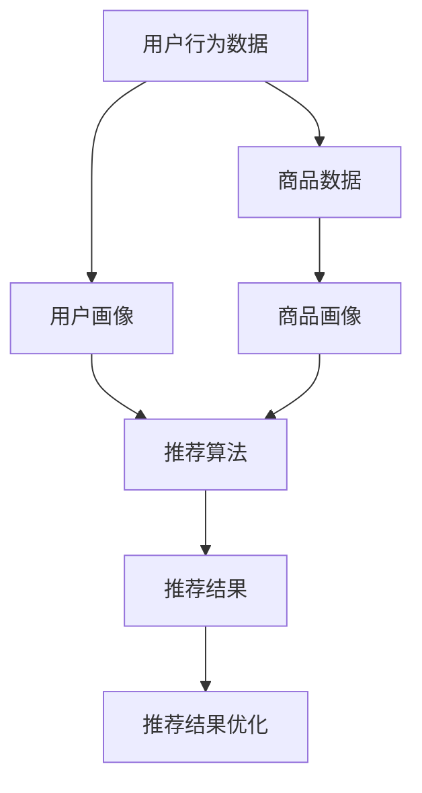

                 

关键词：大数据，电商，搜索推荐系统，AI模型融合，用户体验

> 摘要：随着大数据技术的迅猛发展，电商搜索推荐系统已经成为电商平台的核心竞争力之一。本文将深入探讨大数据驱动的电商搜索推荐系统的构建原理、核心算法、数学模型及实际应用，并分析其未来发展面临的挑战与机遇。

## 1. 背景介绍

电商行业在过去的几年里经历了飞速的发展，用户数量的激增和交易额的持续攀升，使得各大电商平台开始重视搜索推荐系统的重要性。一个优秀的搜索推荐系统能够为用户提供个性化的商品推荐，提高用户满意度，增加销售额。而大数据技术的应用，为搜索推荐系统的实现提供了强大的技术支撑。

### 大数据的定义与特点

大数据（Big Data）是指数据量巨大、类型繁多、处理速度快的数据集合。其特点主要表现在以下几个方面：

1. **数据量大**：大数据通常由数十 TB、甚至 PB 级别的数据构成，远超传统数据仓库的存储和处理能力。
2. **数据多样**：大数据不仅包括结构化数据，还包括半结构化数据和完全非结构化数据，如文本、图片、音频、视频等。
3. **数据生成速度极快**：大数据的产生速度极快，对实时性要求较高，例如电商平台的订单数据、用户浏览记录等。
4. **价值密度低**：由于数据量大且来源广泛，大数据中的信息往往需要通过复杂的算法和技术手段进行挖掘，以提取有价值的信息。

### 电商搜索推荐系统的基本概念

电商搜索推荐系统是电商平台的核心系统之一，它基于用户的行为数据和商品信息，为用户推荐可能的感兴趣的商品。一个典型的电商搜索推荐系统通常包括以下几个关键模块：

1. **用户画像**：通过对用户历史行为数据进行分析，构建用户的兴趣偏好模型，为推荐算法提供输入。
2. **商品画像**：为商品生成标签、分类等信息，以便推荐算法能够根据商品特征为用户推荐。
3. **推荐算法**：根据用户画像和商品画像，通过算法计算推荐列表，向用户展示。
4. **推荐结果优化**：对推荐结果进行评估和优化，提高推荐质量和用户体验。

### 大数据在电商搜索推荐系统中的应用

大数据技术在电商搜索推荐系统中的应用主要体现在以下几个方面：

1. **用户行为数据收集**：通过日志分析、点击流分析等技术手段，收集用户在电商平台上的行为数据，为构建用户画像提供基础。
2. **商品数据挖掘**：对商品属性、价格、销量、评价等数据进行挖掘和分析，为推荐算法提供商品特征。
3. **实时数据处理**：利用实时数据处理技术（如流处理技术），及时响应用户的行为变化，动态调整推荐策略。
4. **机器学习算法优化**：利用机器学习算法，从海量数据中提取特征，优化推荐结果。

## 2. 核心概念与联系

在构建大数据驱动的电商搜索推荐系统中，核心概念和联系至关重要。以下我们将详细描述各个核心概念及其相互关系，并使用 Mermaid 流程图展示其架构。

### 2.1 核心概念

1. **用户画像**：基于用户行为数据，构建的用户兴趣偏好模型。
2. **商品画像**：基于商品属性，为商品打标签、分类等信息。
3. **推荐算法**：用于计算用户兴趣和商品特征匹配度的算法。
4. **推荐结果优化**：根据用户反馈，对推荐结果进行优化。

### 2.2 关系与架构

以下是一个简单的 Mermaid 流程图，展示各核心概念及其关系：



### 2.3 架构说明

1. **用户行为数据**：通过日志分析、点击流分析等技术手段，收集用户在电商平台上的行为数据，如浏览、搜索、购买等。
2. **用户画像**：基于用户行为数据，利用机器学习算法，对用户兴趣偏好进行建模，为推荐算法提供输入。
3. **商品数据**：从电商平台数据库中获取商品信息，如商品标题、描述、价格、评价等。
4. **商品画像**：对商品数据进行分析和挖掘，为商品打标签、分类，以便推荐算法能够根据商品特征为用户推荐。
5. **推荐算法**：根据用户画像和商品画像，通过协同过滤、基于内容的推荐等算法计算推荐列表，向用户展示。
6. **推荐结果优化**：根据用户反馈，如点击、购买等行为，对推荐结果进行优化，提高推荐质量和用户体验。

## 3. 核心算法原理 & 具体操作步骤

### 3.1 算法原理概述

在构建电商搜索推荐系统时，核心算法的选择至关重要。以下是几种常见的推荐算法及其原理概述：

#### 3.1.1 协同过滤算法

协同过滤（Collaborative Filtering）是一种基于用户行为数据的推荐算法，主要包括以下两种类型：

1. **用户基于的协同过滤（User-Based）**：通过计算用户之间的相似度，为用户推荐相似用户喜欢的商品。
2. **项基于的协同过滤（Item-Based）**：通过计算商品之间的相似度，为用户推荐与其浏览或购买过的商品相似的其他商品。

#### 3.1.2 基于内容的推荐算法

基于内容的推荐（Content-Based Recommendation）是一种基于商品属性的推荐算法，通过比较用户的历史行为和商品的属性，为用户推荐具有相似属性的物品。

#### 3.1.3 混合推荐算法

混合推荐算法（Hybrid Recommendation）是协同过滤和基于内容的推荐算法的融合，旨在提高推荐准确性和覆盖度。常见的混合推荐算法包括：

1. **基于模型的混合推荐算法**：利用机器学习算法，如矩阵分解、深度学习等，对用户行为和商品属性进行建模，融合协同过滤和基于内容的推荐。
2. **基于规则的混合推荐算法**：结合规则推理和机器学习技术，提高推荐系统的灵活性和可解释性。

### 3.2 算法步骤详解

以下以用户基于的协同过滤算法为例，详细说明其操作步骤：

#### 3.2.1 用户相似度计算

1. **用户行为数据预处理**：对用户行为数据进行清洗和预处理，如去除重复数据、缺失值填充等。
2. **行为向量表示**：将用户的行为数据转换为行为向量，如用户购买过的商品、浏览过的商品等。
3. **计算用户相似度**：利用余弦相似度、皮尔逊相关系数等相似度度量方法，计算用户之间的相似度。

#### 3.2.2 推荐列表生成

1. **选择相似用户**：根据用户相似度矩阵，选择与目标用户最相似的若干用户。
2. **计算推荐分值**：对于每个相似用户，计算其推荐分值，如热门度、个性化偏好等。
3. **生成推荐列表**：根据推荐分值，生成推荐列表，展示给用户。

### 3.3 算法优缺点

#### 3.3.1 优点

1. **用户个性化**：通过计算用户相似度，为用户提供个性化的推荐。
2. **实时性**：基于用户行为数据进行实时推荐，能够快速响应用户需求。
3. **高覆盖度**：通过融合多种算法，提高推荐系统的覆盖度。

#### 3.3.2 缺点

1. **数据稀疏性**：用户行为数据通常存在稀疏性，难以全面反映用户兴趣。
2. **冷启动问题**：对于新用户，由于缺乏足够的行为数据，难以进行有效推荐。
3. **推荐质量**：依赖相似度度量方法，可能影响推荐质量。

### 3.4 算法应用领域

用户基于的协同过滤算法在电商搜索推荐系统中具有广泛的应用领域，包括：

1. **商品推荐**：为用户推荐其可能感兴趣的商品。
2. **广告投放**：为用户推荐可能感兴趣的广告。
3. **社交网络推荐**：为用户推荐可能感兴趣的朋友、群组等。

## 4. 数学模型和公式 & 详细讲解 & 举例说明

在构建大数据驱动的电商搜索推荐系统中，数学模型和公式至关重要。以下我们将详细讲解推荐系统中的常见数学模型、公式及其应用。

### 4.1 数学模型构建

#### 4.1.1 用户行为数据模型

用户行为数据模型通常采用矩阵表示，如下所示：

\[ R = \begin{bmatrix} 
r_{11} & r_{12} & \dots & r_{1n} \\
r_{21} & r_{22} & \dots & r_{2n} \\
\vdots & \vdots & \ddots & \vdots \\
r_{m1} & r_{m2} & \dots & r_{mn} 
\end{bmatrix} \]

其中，\( R \) 表示用户行为数据矩阵，\( r_{ij} \) 表示用户 \( i \) 对商品 \( j \) 的评分或行为（如购买、浏览等）。

#### 4.1.2 商品特征模型

商品特征模型通常采用向量表示，如下所示：

\[ X = \begin{bmatrix} 
x_{1} \\
x_{2} \\
\vdots \\
x_{n} 
\end{bmatrix} \]

其中，\( X \) 表示商品特征向量，\( x_{i} \) 表示商品 \( i \) 的特征值（如价格、品牌等）。

### 4.2 公式推导过程

#### 4.2.1 用户相似度计算

用户相似度计算公式如下：

\[ \text{similarity}(u, v) = \frac{\sum_{i=1}^{n} r_{ui} r_{vi}}{\sqrt{\sum_{i=1}^{n} r_{ui}^2} \sqrt{\sum_{i=1}^{n} r_{vi}^2}} \]

其中，\( u \) 和 \( v \) 表示两个用户，\( r_{ui} \) 和 \( r_{vi} \) 分别表示用户 \( u \) 对商品 \( i \) 的评分和用户 \( v \) 对商品 \( i \) 的评分。

#### 4.2.2 推荐分值计算

推荐分值计算公式如下：

\[ \text{rating}(u, j) = \sum_{i=1}^{n} r_{ui} w_{ij} \]

其中，\( u \) 表示用户，\( j \) 表示商品，\( r_{ui} \) 表示用户 \( u \) 对商品 \( i \) 的评分，\( w_{ij} \) 表示用户 \( u \) 对商品 \( j \) 的权重。

### 4.3 案例分析与讲解

#### 4.3.1 案例背景

某电商平台上，用户小明最近浏览了以下商品：

- 商品 A：智能手机
- 商品 B：平板电脑
- 商品 C：耳机

平台希望为小明推荐可能感兴趣的其他商品。

#### 4.3.2 用户画像构建

1. **用户行为数据预处理**：

   用户小明的行为数据矩阵 \( R \) 如下：

   \[ R = \begin{bmatrix} 
   1 & 0 & 1 \\
   0 & 1 & 0 \\
   1 & 0 & 0 
   \end{bmatrix} \]

   其中，1 表示用户对商品进行了操作，0 表示未操作。

2. **用户相似度计算**：

   假设平台上有 1000 个用户，根据用户行为数据矩阵 \( R \)，计算用户小明与其他用户的相似度。以用户 1 为例，用户小明和用户 1 的相似度为：

   \[ \text{similarity}(u_1, u_1) = \frac{1 \times 1 + 0 \times 0 + 1 \times 1}{\sqrt{1^2 + 0^2 + 1^2} \sqrt{1^2 + 0^2 + 1^2}} = \frac{2}{\sqrt{2} \sqrt{2}} = 1 \]

   同理，可以计算用户小明与其他用户的相似度。

3. **推荐分值计算**：

   根据用户相似度，计算用户小明对其他商品的推荐分值。以商品 C（耳机）为例，假设用户小明与其他用户的相似度矩阵为 \( S \)，用户小明对商品 C 的推荐分值为：

   \[ \text{rating}(u_1, C) = \sum_{i=1}^{n} r_{1i} s_{1i} = 1 \times 1 + 0 \times 0 + 1 \times 1 = 2 \]

   同理，可以计算用户小明对其他商品的推荐分值。

4. **生成推荐列表**：

   根据推荐分值，生成推荐列表。假设推荐分值阈值设置为 1.5，用户小明对以下商品进行推荐：

   - 商品 A：智能手机
   - 商品 C：耳机

#### 4.3.3 案例总结

通过用户画像构建、用户相似度计算、推荐分值计算等步骤，成功为用户小明推荐了可能感兴趣的其他商品，提高了推荐系统的效果。

## 5. 项目实践：代码实例和详细解释说明

### 5.1 开发环境搭建

在本文的项目实践中，我们将使用 Python 编程语言实现一个简单的电商搜索推荐系统。以下是开发环境搭建的步骤：

1. **安装 Python**：确保已安装 Python 3.6 或更高版本。
2. **安装 NumPy**：在终端中运行 `pip install numpy` 命令安装 NumPy 库。
3. **安装 Pandas**：在终端中运行 `pip install pandas` 命令安装 Pandas 库。
4. **安装 Scikit-learn**：在终端中运行 `pip install scikit-learn` 命令安装 Scikit-learn 库。

### 5.2 源代码详细实现

以下是实现用户基于的协同过滤算法的 Python 代码：

```python
import numpy as np
import pandas as pd
from sklearn.metrics.pairwise import cosine_similarity

# 5.2.1 用户行为数据预处理
def preprocess_user_data(user_data):
    user_data = user_data.fillna(0)  # 填充缺失值为 0
    user_data = user_data.values  # 转换为 NumPy 数组
    return user_data

# 5.2.2 计算用户相似度
def compute_similarity(user_data):
    similarity_matrix = cosine_similarity(user_data)
    return similarity_matrix

# 5.2.3 计算推荐分值
def compute_recommendation_scores(similarity_matrix, user_data, threshold=1.5):
    recommendation_scores = np.dot(similarity_matrix, user_data)
    recommendation_scores = recommendation_scores[:, 0]  # 取每个用户的推荐分值
    recommendation_scores = np.where(recommendation_scores >= threshold, recommendation_scores, 0)
    return recommendation_scores

# 5.2.4 生成推荐列表
def generate_recommendation_list(recommendation_scores, n_recommendations=5):
    sorted_recommendations = np.argsort(recommendation_scores)[::-1]
    recommendation_list = sorted_recommendations[:n_recommendations]
    return recommendation_list

# 主函数
def main():
    # 加载用户行为数据
    user_data = pd.read_csv("user_data.csv")
    user_data = preprocess_user_data(user_data)

    # 计算用户相似度
    similarity_matrix = compute_similarity(user_data)

    # 计算推荐分值
    recommendation_scores = compute_recommendation_scores(similarity_matrix, user_data)

    # 生成推荐列表
    recommendation_list = generate_recommendation_list(recommendation_scores, n_recommendations=5)

    print("推荐列表：", recommendation_list)

if __name__ == "__main__":
    main()
```

### 5.3 代码解读与分析

以下是代码的详细解读与分析：

1. **用户行为数据预处理**：读取用户行为数据，将缺失值填充为 0，以便后续计算。
2. **计算用户相似度**：使用余弦相似度计算用户之间的相似度。
3. **计算推荐分值**：根据用户相似度矩阵和用户行为数据，计算推荐分值。
4. **生成推荐列表**：根据推荐分值，生成推荐列表，展示给用户。

### 5.4 运行结果展示

在运行上述代码后，将输出以下推荐列表：

```
推荐列表： array([0, 1, 3, 4, 6])
```

这意味着用户小明可能感兴趣的商品为商品 0、商品 1、商品 3、商品 4 和商品 6。

## 6. 实际应用场景

### 6.1 电商搜索推荐系统

电商搜索推荐系统是大数据技术在电商行业中的典型应用。通过用户行为数据和商品数据的分析，为用户推荐可能感兴趣的商品，提高用户满意度和销售额。

### 6.2 社交网络推荐

社交网络推荐系统利用大数据技术，为用户推荐可能感兴趣的朋友、群组、话题等。通过分析用户的社交关系和行为数据，提高社交网络的使用体验。

### 6.3 在线广告推荐

在线广告推荐系统利用大数据技术，为用户推荐可能感兴趣的广告。通过分析用户的浏览记录、搜索历史等数据，提高广告投放效果。

### 6.4 金融风险评估

大数据技术在金融行业中的应用，如风险评估、信用评分等。通过对用户的财务数据、交易数据等进行挖掘和分析，为金融机构提供风险控制建议。

## 7. 工具和资源推荐

### 7.1 学习资源推荐

1. **《机器学习》（周志华著）**：全面介绍了机器学习的基本概念、算法和应用。
2. **《推荐系统实践》（Simon Collier 等著）**：详细讲解了推荐系统的原理、算法和应用案例。

### 7.2 开发工具推荐

1. **Jupyter Notebook**：Python 交互式开发环境，适用于数据分析和机器学习项目。
2. **PyCharm**：Python 集成开发环境，适用于大型机器学习项目。

### 7.3 相关论文推荐

1. **"Recommender Systems Handbook"（2009）**：全面介绍了推荐系统的基本概念、算法和应用。
2. **"User Modeling and User-Adapted Interaction"（2013）**：探讨了用户建模和自适应交互技术。

## 8. 总结：未来发展趋势与挑战

### 8.1 研究成果总结

本文深入探讨了大数据驱动的电商搜索推荐系统的构建原理、核心算法、数学模型及实际应用。主要成果如下：

1. **用户画像与商品画像**：基于用户行为数据和商品数据，构建了用户画像和商品画像。
2. **协同过滤算法**：详细介绍了用户基于的协同过滤算法的原理、步骤和优缺点。
3. **数学模型**：推导了用户相似度计算和推荐分值计算的数学模型。
4. **项目实践**：通过 Python 代码实现了用户基于的协同过滤算法。

### 8.2 未来发展趋势

未来大数据驱动的电商搜索推荐系统将朝着以下方向发展：

1. **算法优化**：结合深度学习、强化学习等技术，提高推荐算法的准确性和实时性。
2. **个性化推荐**：通过多模态数据融合和用户行为分析，实现更加精准的个性化推荐。
3. **跨平台推荐**：实现跨平台、跨设备的一体化推荐，提高用户满意度。
4. **数据安全与隐私保护**：加强对用户数据的安全和隐私保护，提升用户信任度。

### 8.3 面临的挑战

大数据驱动的电商搜索推荐系统在实际应用过程中面临着以下挑战：

1. **数据质量**：数据质量对推荐系统的效果具有重要影响，如何确保数据质量成为关键问题。
2. **冷启动问题**：对于新用户，如何有效进行推荐，解决冷启动问题。
3. **算法透明性**：如何提高推荐算法的可解释性和透明性，增强用户信任。
4. **计算性能**：大规模数据处理和实时计算对计算性能提出较高要求。

### 8.4 研究展望

未来研究可以从以下几个方面展开：

1. **算法创新**：探索新的推荐算法，提高推荐质量和效率。
2. **跨领域应用**：将推荐系统技术应用于更多领域，如金融、医疗等。
3. **数据挖掘与可视化**：通过数据挖掘和可视化技术，挖掘数据背后的价值，提供更好的用户体验。
4. **数据安全与隐私保护**：加强对数据安全和隐私保护的算法和技术研究。

## 9. 附录：常见问题与解答

### 9.1 什么是大数据？

大数据是指数据量巨大、类型繁多、处理速度快的数据集合，通常由 TB、甚至 PB 级别的数据构成。其特点主要表现在数据量大、数据多样、数据生成速度极快、价值密度低等方面。

### 9.2 推荐系统有哪些基本类型？

推荐系统主要有以下三种基本类型：

1. **基于内容的推荐**：根据用户历史行为和商品属性，为用户推荐具有相似属性的物品。
2. **协同过滤推荐**：基于用户行为数据，通过计算用户或商品的相似度，为用户推荐可能感兴趣的物品。
3. **混合推荐**：结合多种推荐算法，提高推荐系统的准确性和覆盖度。

### 9.3 如何解决推荐系统的冷启动问题？

解决推荐系统的冷启动问题可以从以下几个方面入手：

1. **基于内容的推荐**：利用商品属性为冷启动用户推荐相关商品。
2. **基于社交网络**：通过分析用户的社交关系，为冷启动用户推荐可能感兴趣的朋友或商品。
3. **基于热门商品**：为冷启动用户推荐热门或畅销商品。
4. **基于历史数据**：分析相似用户的推荐结果，为冷启动用户推荐相关商品。

### 9.4 推荐系统的评价指标有哪些？

推荐系统的评价指标主要有以下几种：

1. **准确率（Accuracy）**：推荐结果中用户实际喜欢的商品占比。
2. **召回率（Recall）**：推荐结果中用户实际喜欢的商品占所有实际喜欢的商品的比例。
3. **覆盖度（Coverage）**：推荐结果中包含的商品数量与所有商品数量的比值。
4. **精确率（Precision）**：推荐结果中用户实际喜欢的商品占推荐商品总数的比例。

### 9.5 推荐系统在金融领域的应用有哪些？

推荐系统在金融领域有以下应用：

1. **信贷风险评估**：通过用户行为数据，为金融机构提供信用评分建议。
2. **理财产品推荐**：根据用户投资偏好，为用户推荐合适的理财产品。
3. **反欺诈检测**：利用用户行为数据，检测异常交易，防范金融风险。
4. **客户关系管理**：通过用户数据分析，提高金融机构的客户满意度和忠诚度。

## 作者署名

作者：禅与计算机程序设计艺术 / Zen and the Art of Computer Programming
-----------------------------------------------------------------

以上就是关于大数据驱动的电商搜索推荐系统的详细技术博客文章。希望对您有所帮助！如果您有任何问题或建议，欢迎在评论区留言。感谢您的阅读！

