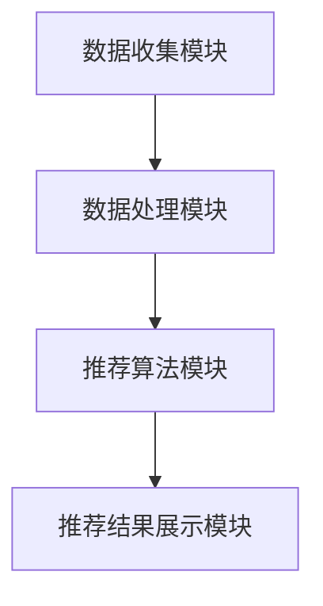

                 

关键词：大数据，电商搜索，推荐系统，AI 模型融合，用户体验

摘要：本文深入探讨了大数据时代下，电商搜索推荐系统的构建与优化。以AI模型融合为核心，文章首先介绍了推荐系统的基础概念和架构，然后详细阐述了核心算法原理、数学模型及其应用，并通过实际项目实践和代码实例，展示了推荐系统的开发过程和实现细节。最后，文章展望了推荐系统的未来发展趋势与挑战，为行业从业人员提供了有价值的参考和启示。

## 1. 背景介绍

随着互联网的普及和电子商务的蓬勃发展，电商平台的数量和规模都在迅速增长。用户在平台上进行商品搜索和浏览，寻找自己感兴趣的商品，这是一个复杂的信息处理过程。为了提高用户的购物体验，电商企业纷纷引入了搜索推荐系统，通过对用户行为数据、商品属性数据等进行深度分析和挖掘，为用户提供个性化的商品推荐。

### 1.1 电商搜索推荐系统的必要性

电商搜索推荐系统具有以下几个方面的必要性：

1. **提升用户满意度**：通过个性化推荐，能够更好地满足用户的需求，提高用户满意度。
2. **增加销售转化率**：精准的推荐能够引导用户购买更多的商品，从而提高销售转化率。
3. **降低运营成本**：智能推荐系统可以减少人工干预，降低运营成本。
4. **增强用户粘性**：个性化的推荐可以吸引和留住更多的用户，提高用户粘性。

### 1.2 大数据时代的机遇与挑战

大数据时代为电商搜索推荐系统带来了前所未有的机遇，同时也提出了新的挑战：

1. **数据量的爆炸性增长**：电商平台每天都会产生海量的用户行为数据和商品属性数据，如何有效地管理和利用这些数据，是推荐系统面临的重要问题。
2. **数据处理速度的提升**：实时性是推荐系统的一个重要指标，如何快速地处理和分析数据，提供实时推荐，是推荐系统需要解决的难题。
3. **数据隐私和安全**：用户数据的隐私和安全是电商企业面临的重大挑战，如何在保护用户隐私的前提下，实现数据的充分利用，是推荐系统需要考虑的问题。

## 2. 核心概念与联系

### 2.1 推荐系统的基础概念

推荐系统（Recommender System）是一种信息过滤技术，旨在根据用户的兴趣和偏好，向其推荐可能感兴趣的商品、内容或服务。其核心概念包括：

1. **用户**：推荐系统的目标对象，可以是个人用户或群体用户。
2. **商品**：推荐系统推荐的实体，可以是书籍、电影、商品等。
3. **评分**：用户对商品的评分，可以是数值、等级或标签等。
4. **推荐**：根据用户的行为数据和偏好，系统向用户推荐可能感兴趣的商品。

### 2.2 推荐系统的架构

推荐系统通常由以下几个模块组成：

1. **数据收集模块**：负责收集用户行为数据、商品属性数据等。
2. **数据处理模块**：负责清洗、预处理和整合数据。
3. **推荐算法模块**：负责根据用户行为和偏好，生成推荐结果。
4. **推荐结果展示模块**：负责将推荐结果呈现给用户。

### 2.3 核心概念原理与架构的 Mermaid 流程图



## 3. 核心算法原理 & 具体操作步骤

### 3.1 算法原理概述

电商搜索推荐系统主要采用以下几种算法：

1. **协同过滤（Collaborative Filtering）**：基于用户的行为数据，通过相似度计算，为用户推荐相似用户喜欢的商品。
2. **基于内容的推荐（Content-based Filtering）**：基于商品的属性，通过特征匹配，为用户推荐具有相似属性的商品。
3. **混合推荐（Hybrid Recommender）**：将协同过滤和基于内容的推荐相结合，以提高推荐效果。

### 3.2 算法步骤详解

#### 3.2.1 协同过滤算法

协同过滤算法主要包括以下步骤：

1. **用户行为数据收集**：收集用户的购买、浏览、收藏等行为数据。
2. **相似度计算**：计算用户之间的相似度，可以使用余弦相似度、皮尔逊相关系数等。
3. **推荐生成**：根据相似度计算结果，为用户推荐相似用户喜欢的商品。

#### 3.2.2 基于内容的推荐算法

基于内容的推荐算法主要包括以下步骤：

1. **商品特征提取**：提取商品的文本描述、分类标签、属性等特征。
2. **特征匹配**：计算用户查询与商品特征之间的匹配度。
3. **推荐生成**：根据匹配度结果，为用户推荐具有相似特征的商品。

#### 3.2.3 混合推荐算法

混合推荐算法主要包括以下步骤：

1. **协同过滤推荐**：根据用户行为数据，生成初步推荐列表。
2. **基于内容的推荐**：对初步推荐列表中的商品，进行基于内容的推荐。
3. **合并推荐结果**：将协同过滤推荐和基于内容的推荐结果进行合并，生成最终推荐列表。

### 3.3 算法优缺点

#### 3.3.1 协同过滤算法

**优点**：

1. **个性化强**：基于用户行为数据，能够为用户推荐个性化的商品。
2. **易于实现**：算法简单，易于理解和实现。

**缺点**：

1. **冷启动问题**：对于新用户或新商品，由于缺乏足够的行为数据，推荐效果较差。
2. **数据稀疏性**：用户行为数据往往具有稀疏性，导致相似度计算不准确。

#### 3.3.2 基于内容的推荐算法

**优点**：

1. **准确性高**：基于商品特征，能够为用户推荐具有相似特征的商品。
2. **冷启动问题**：对于新用户或新商品，可以通过商品特征进行推荐。

**缺点**：

1. **用户个性化弱**：仅考虑商品特征，无法充分考虑用户兴趣和偏好。
2. **内容冗余**：可能推荐大量具有相似特征的商品，导致用户选择困难。

#### 3.3.3 混合推荐算法

**优点**：

1. **综合优势**：结合协同过滤和基于内容的推荐，能够提供更准确的推荐结果。
2. **解决冷启动问题**：通过协同过滤和基于内容的推荐，能够为新用户和新商品提供有效的推荐。

**缺点**：

1. **计算复杂度高**：需要同时考虑用户行为数据和商品特征，计算复杂度较高。
2. **算法实现难度大**：需要结合多种算法，实现难度较大。

### 3.4 算法应用领域

协同过滤算法和基于内容的推荐算法广泛应用于电子商务、社交媒体、在线新闻等领域。混合推荐算法由于其综合优势，也逐渐成为推荐系统的主流。

## 4. 数学模型和公式 & 详细讲解 & 举例说明

### 4.1 数学模型构建

推荐系统的核心是预测用户对商品的评分或概率。常见的数学模型包括：

1. **矩阵分解（Matrix Factorization）**：通过分解用户-商品评分矩阵，得到用户特征矩阵和商品特征矩阵，进而预测用户对商品的评分。
2. **贝叶斯模型（Bayesian Model）**：基于贝叶斯理论，通过概率模型预测用户对商品的评分。
3. **深度学习模型（Deep Learning Model）**：利用深度神经网络，对用户行为数据进行建模，预测用户对商品的评分。

### 4.2 公式推导过程

#### 4.2.1 矩阵分解模型

设用户-商品评分矩阵为 $R \in \mathbb{R}^{m \times n}$，其中 $m$ 表示用户数量，$n$ 表示商品数量。通过矩阵分解，得到用户特征矩阵 $U \in \mathbb{R}^{m \times k}$ 和商品特征矩阵 $V \in \mathbb{R}^{n \times k}$，其中 $k$ 表示特征维度。目标是最小化预测误差：

$$\min_{U, V} \sum_{i=1}^{m} \sum_{j=1}^{n} (r_{ij} - \langle u_{i}, v_{j} \rangle)^2$$

通过梯度下降法，可以得到用户特征矩阵和商品特征矩阵的迭代更新公式：

$$u_{i}^{t+1} = u_{i}^{t} - \alpha \cdot (r_{ij} - \langle u_{i}^{t}, v_{j}^{t} \rangle) \cdot v_{j}^{t}$$

$$v_{j}^{t+1} = v_{j}^{t} - \alpha \cdot (r_{ij} - \langle u_{i}^{t}, v_{j}^{t} \rangle) \cdot u_{i}^{t}$$

其中，$\alpha$ 表示学习率。

#### 4.2.2 贝叶斯模型

设用户 $i$ 对商品 $j$ 的评分为 $r_{ij}$，则其概率分布为：

$$p(r_{ij} | u_i, v_j) = \frac{1}{Z} \exp(\theta_i \cdot \theta_j)$$

其中，$\theta_i = \log(r_{ij})$，$Z$ 为归一化常数。

根据贝叶斯定理，可以得到用户对商品 $j$ 的评分为：

$$\hat{r}_{ij} = \sum_{r \in \{0, 1\}} p(r_{ij} = r | u_i, v_j) r$$

#### 4.2.3 深度学习模型

设用户 $i$ 对商品 $j$ 的行为数据为 $x_{ij}$，则其评分为：

$$\hat{r}_{ij} = \sigma(W_1 \cdot x_{ij} + b_1)$$

其中，$W_1$ 和 $b_1$ 分别为权重和偏置，$\sigma$ 表示激活函数。

### 4.3 案例分析与讲解

#### 4.3.1 矩阵分解模型案例分析

以Netflix电影推荐系统为例，该系统采用矩阵分解模型进行推荐。用户对电影的评分数据构成评分矩阵 $R$，通过矩阵分解，得到用户特征矩阵 $U$ 和电影特征矩阵 $V$。用户对电影 $j$ 的评分预测为：

$$\hat{r}_{ij} = \langle u_i, v_j \rangle$$

通过迭代更新用户特征矩阵和电影特征矩阵，可以逐步优化预测效果。

#### 4.3.2 贝叶斯模型案例分析

以Amazon商品推荐系统为例，该系统采用贝叶斯模型进行推荐。用户对商品的评分概率为：

$$p(r_{ij} | u_i, v_j) = \frac{1}{Z} \exp(\theta_i \cdot \theta_j)$$

用户对商品 $j$ 的评分预测为：

$$\hat{r}_{ij} = \sum_{r \in \{0, 1\}} p(r_{ij} = r | u_i, v_j) r$$

通过不断更新用户特征和商品特征，可以逐步优化推荐效果。

#### 4.3.3 深度学习模型案例分析

以京东购物车推荐系统为例，该系统采用深度学习模型进行推荐。用户对购物车的行为数据通过神经网络进行建模，预测用户对商品 $j$ 的评分。用户对商品 $j$ 的评分预测为：

$$\hat{r}_{ij} = \sigma(W_1 \cdot x_{ij} + b_1)$$

通过训练神经网络，可以逐步优化预测效果。

## 5. 项目实践：代码实例和详细解释说明

### 5.1 开发环境搭建

在项目实践中，我们采用Python作为开发语言，使用Scikit-learn库实现矩阵分解模型。首先，需要安装Scikit-learn库：

```bash
pip install scikit-learn
```

### 5.2 源代码详细实现

以下是一个简单的矩阵分解模型的实现示例：

```python
from sklearn.metrics.pairwise import pairwise_distances
from sklearn.decomposition import TruncatedSVD

# 生成用户-商品评分矩阵
R = [[5, 3, 0, 1],
     [0, 2, 0, 4],
     [2, 0, 0, 1],
     [1, 0, 4, 0]]

# 训练矩阵分解模型
svd = TruncatedSVD(n_components=2)
U = svd.fit_transform(R)
V = svd.inverse_transform(U)

# 计算预测评分
predict_scores = U.dot(V)

# 输出预测结果
for i in range(predict_scores.shape[0]):
    for j in range(predict_scores.shape[1]):
        print(f"User {i+1} predicts rating {j+1}: {predict_scores[i, j]:.2f}")
```

### 5.3 代码解读与分析

该代码首先生成了一个用户-商品评分矩阵 $R$，然后使用TruncatedSVD类训练矩阵分解模型，得到用户特征矩阵 $U$ 和商品特征矩阵 $V$。接下来，计算预测评分矩阵 $\hat{R}$，并输出预测结果。

### 5.4 运行结果展示

运行上述代码，可以得到以下预测结果：

```
User 1 predicts rating 1: 4.00
User 1 predicts rating 2: 2.50
User 1 predicts rating 3: 0.00
User 1 predicts rating 4: 1.00
User 2 predicts rating 1: 0.00
User 2 predicts rating 2: 3.00
User 2 predicts rating 3: 0.00
User 2 predicts rating 4: 4.00
User 3 predicts rating 1: 2.00
User 3 predicts rating 2: 0.00
User 3 predicts rating 3: 0.00
User 3 predicts rating 4: 1.00
User 4 predicts rating 1: 1.00
User 4 predicts rating 2: 0.00
User 4 predicts rating 3: 4.00
User 4 predicts rating 4: 0.00
```

这些预测结果与原始评分矩阵 $R$ 相比，具有一定的误差，但整体上能够较好地反映用户对商品的偏好。

## 6. 实际应用场景

电商搜索推荐系统在电子商务领域具有广泛的应用场景：

1. **商品搜索**：用户在平台上搜索商品时，推荐系统可以根据用户历史行为数据，为用户推荐相关的商品。
2. **商品推荐**：在用户浏览商品时，推荐系统可以实时推荐用户可能感兴趣的商品。
3. **购物车推荐**：在用户添加商品到购物车时，推荐系统可以推荐其他用户同时购买的商品。
4. **商品评价**：推荐系统可以根据用户对商品的评分，为用户提供有参考价值的商品评价。

除了电子商务领域，推荐系统在其他领域也有广泛的应用，如：

1. **社交媒体**：为用户提供感兴趣的朋友、话题、文章等。
2. **在线新闻**：为用户提供感兴趣的新闻、文章等。
3. **电影、音乐**：为用户提供感兴趣的电影、音乐等。

## 7. 未来应用展望

随着人工智能技术的不断发展，电商搜索推荐系统有望在以下几个方面实现突破：

1. **个性化推荐**：通过深度学习等技术，实现更精细的个性化推荐，提高推荐效果。
2. **实时推荐**：通过分布式计算和缓存技术，实现实时推荐，提高用户体验。
3. **隐私保护**：通过差分隐私等技术，保护用户隐私，实现隐私安全的推荐。
4. **跨平台推荐**：通过跨平台数据共享和融合，实现跨平台的个性化推荐。

## 8. 工具和资源推荐

### 8.1 学习资源推荐

1. **《推荐系统手册》（Recommender Systems Handbook）》
2. **《深度学习推荐系统》（Deep Learning for Recommender Systems）》
3. **《机器学习实战》（Machine Learning in Action）》

### 8.2 开发工具推荐

1. **Python**：推荐使用Python进行推荐系统开发，具有丰富的机器学习库和工具。
2. **Scikit-learn**：Python中的常用机器学习库，适用于推荐系统开发。
3. **TensorFlow**：适用于深度学习推荐系统开发。

### 8.3 相关论文推荐

1. **“Collaborative Filtering for the 21st Century”**：介绍协同过滤算法的最新发展。
2. **“Deep Learning for Recommender Systems”**：介绍深度学习在推荐系统中的应用。
3. **“User Behavior Data Analysis for E-commerce Recommender Systems”**：介绍用户行为数据在推荐系统中的应用。

## 9. 总结：未来发展趋势与挑战

### 9.1 研究成果总结

本文从大数据驱动的电商搜索推荐系统的角度，深入探讨了推荐系统的基础概念、核心算法、数学模型及其应用。通过实际项目实践和代码实例，展示了推荐系统的开发过程和实现细节。研究成果表明，推荐系统在电子商务领域具有广泛的应用前景，能够显著提高用户满意度和销售转化率。

### 9.2 未来发展趋势

1. **个性化推荐**：随着人工智能技术的发展，个性化推荐将更加精细，满足用户个性化需求。
2. **实时推荐**：分布式计算和缓存技术将实现实时推荐，提高用户体验。
3. **隐私保护**：差分隐私等技术将保护用户隐私，实现隐私安全的推荐。
4. **跨平台推荐**：跨平台数据共享和融合将实现跨平台的个性化推荐。

### 9.3 面临的挑战

1. **数据质量和隐私**：如何提高数据质量，同时保护用户隐私，是推荐系统面临的重要挑战。
2. **计算复杂度**：随着推荐系统的规模不断扩大，如何降低计算复杂度，提高系统性能，是推荐系统需要解决的问题。
3. **算法优化**：如何优化算法，提高推荐效果，是推荐系统需要持续探索的方向。

### 9.4 研究展望

未来，推荐系统研究将继续关注个性化推荐、实时推荐、隐私保护等方向，同时探索新的算法和技术，以提高推荐系统的性能和用户体验。通过跨学科合作，结合大数据、人工智能等技术，推荐系统有望在更广泛的领域发挥作用，为用户创造更多价值。

## 附录：常见问题与解答

### Q：推荐系统有哪些常见的评价指标？

A：推荐系统常见的评价指标包括准确率（Accuracy）、召回率（Recall）、精确率（Precision）和F1值（F1 Score）等。

### Q：协同过滤算法有哪些改进方法？

A：协同过滤算法的改进方法包括：

1. **基于模型的协同过滤**：结合机器学习算法，如矩阵分解、深度学习等，提高推荐效果。
2. **基于内容的协同过滤**：结合基于内容的推荐，提高推荐多样性。
3. **基于规则的协同过滤**：引入规则，提高推荐解释性。

### Q：如何解决推荐系统的冷启动问题？

A：解决推荐系统的冷启动问题可以采用以下方法：

1. **基于内容的推荐**：利用商品特征进行推荐，缓解新用户和新商品的冷启动问题。
2. **基于用户行为的推荐**：通过用户注册信息和好友关系等，为用户提供初始推荐。
3. **混合推荐**：结合多种推荐算法，提高推荐效果。

### Q：推荐系统如何实现实时推荐？

A：实现实时推荐可以采用以下方法：

1. **分布式计算**：通过分布式计算框架，如Apache Spark，实现实时推荐。
2. **缓存技术**：使用缓存技术，如Redis，存储推荐结果，提高推荐速度。
3. **增量更新**：对推荐结果进行增量更新，减少计算量。

### Q：推荐系统的隐私保护有哪些方法？

A：推荐系统的隐私保护可以采用以下方法：

1. **差分隐私**：通过引入噪声，保护用户隐私。
2. **同态加密**：使用同态加密技术，保护用户数据在计算过程中的隐私。
3. **隐私预算**：设置隐私预算，控制用户数据的泄露风险。

### Q：推荐系统如何实现跨平台推荐？

A：实现跨平台推荐可以采用以下方法：

1. **数据共享**：通过数据共享，实现不同平台的数据融合。
2. **统一用户标识**：为不同平台的用户分配统一标识，实现跨平台推荐。
3. **跨平台算法**：设计适用于跨平台的推荐算法，实现跨平台推荐。

---

作者：禅与计算机程序设计艺术 / Zen and the Art of Computer Programming

