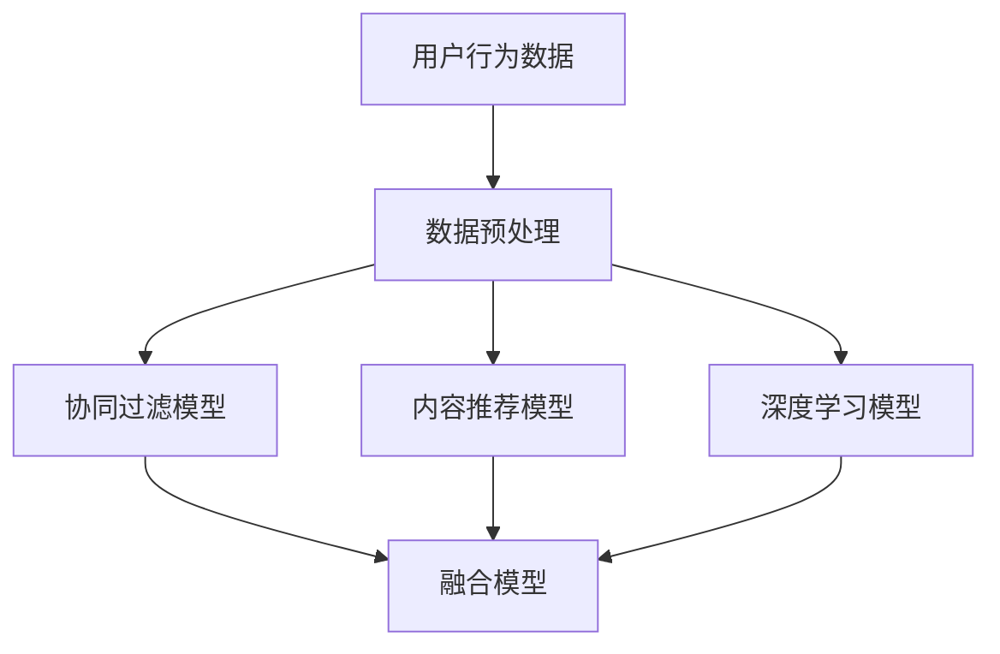

                 

关键词：大数据，电商搜索推荐，AI 模型融合，电商平台，算法，数学模型，项目实践，应用场景，工具和资源

> 摘要：随着电商行业的飞速发展，搜索推荐系统已成为电商平台的核心竞争力。本文从大数据驱动的视角，深入探讨AI模型融合技术在电商搜索推荐中的应用。文章首先介绍了相关背景，然后阐述了核心概念与联系，详细讲解了核心算法原理、数学模型、项目实践以及实际应用场景，最后对未来的发展趋势与挑战进行了展望。

## 1. 背景介绍

### 1.1 电商搜索推荐的重要性

随着互联网的普及和消费者购物习惯的变化，电商平台之间的竞争愈发激烈。电商搜索推荐系统作为提升用户体验、增加转化率、提高销售额的关键因素，正逐渐成为各大电商平台的焦点。一个高效的搜索推荐系统能够根据用户的浏览、购买历史，以及其他相关行为，实时向用户推荐最符合其兴趣的商品，从而提高用户满意度和平台收益。

### 1.2 大数据的作用

大数据技术在电商搜索推荐中的应用，使得系统能够处理和分析海量的用户数据，从中挖掘出用户的行为模式、偏好和需求。大数据为AI模型提供了丰富的训练数据，使得推荐算法更加精准和高效。通过数据挖掘、机器学习和深度学习等技术，电商企业能够更好地理解用户，提供个性化的推荐服务。

### 1.3 AI模型融合技术的优势

AI模型融合技术通过将多种算法和模型相结合，提高了推荐系统的性能和可靠性。融合模型不仅能够综合多种信息源，还能在模型优化、误差校正和实时性方面展现出明显的优势。例如，融合协同过滤和内容推荐的模型，能够在提供个性化推荐的同时，保证推荐结果的相关性和多样性。

## 2. 核心概念与联系

### 2.1 核心概念

- **协同过滤**：基于用户历史行为，发现相似用户或相似商品，实现推荐。
- **内容推荐**：基于商品的内容属性，如类别、标签、描述等，实现推荐。
- **深度学习**：利用神经网络模型，对用户行为数据进行高维特征提取，实现推荐。

### 2.2 Mermaid 流程图



### 2.3 核心概念联系

- **协同过滤**和**内容推荐**为融合模型提供了不同的信息来源。
- **深度学习**模型对用户行为数据进行特征提取，增强融合模型的泛化能力。

## 3. 核心算法原理 & 具体操作步骤

### 3.1 算法原理概述

融合模型通过结合协同过滤、内容推荐和深度学习的优势，实现了推荐系统的多维度优化。协同过滤负责提供用户间的相似性和商品间的相似性信息，内容推荐负责基于商品属性进行推荐，深度学习模型则负责提取用户行为数据的高维特征。

### 3.2 算法步骤详解

1. **数据预处理**：对用户行为数据、商品属性数据进行清洗、归一化处理。
2. **协同过滤**：计算用户之间的相似度矩阵，生成初步推荐列表。
3. **内容推荐**：计算商品之间的相似度矩阵，结合用户兴趣标签，生成推荐列表。
4. **深度学习**：构建深度神经网络，提取用户行为数据的高维特征。
5. **模型融合**：将协同过滤、内容推荐和深度学习的推荐结果进行加权融合，生成最终的推荐列表。

### 3.3 算法优缺点

- **优点**：融合模型能够提供个性化、多样性的推荐结果，提高用户满意度和平台收益。
- **缺点**：算法复杂度较高，对计算资源有较高要求。

### 3.4 算法应用领域

- **电商平台**：提升用户购物体验，提高销售额。
- **社交媒体**：个性化内容推荐，提升用户活跃度。
- **广告投放**：精准投放广告，提高广告转化率。

## 4. 数学模型和公式 & 详细讲解 & 举例说明

### 4.1 数学模型构建

融合模型的核心在于如何对协同过滤、内容推荐和深度学习的结果进行有效融合。以下是一个简化的数学模型：

$$
R(u, i) = \alpha \cdot CF(u, i) + \beta \cdot CR(u, i) + (1 - \alpha - \beta) \cdot DL(u, i)
$$

其中，$R(u, i)$表示用户$u$对商品$i$的推荐分数，$CF(u, i)$、$CR(u, i)$和$DL(u, i)$分别表示协同过滤、内容推荐和深度学习的推荐分数，$\alpha$和$\beta$为权重参数。

### 4.2 公式推导过程

1. **协同过滤**：
   $$ CF(u, i) = \sum_{j \in N(u)} \frac{sim(u, j) \cdot rating(j, i)}{||N(u)||} $$
   其中，$N(u)$表示与用户$u$相似的邻居用户集合，$sim(u, j)$表示用户$u$和用户$j$的相似度，$rating(j, i)$表示用户$j$对商品$i$的评分。

2. **内容推荐**：
   $$ CR(u, i) = \sum_{j \in N(i)} \frac{sim(i, u) \cdot weight(u)}{||N(i)||} $$
   其中，$N(i)$表示与商品$i$相似的邻居商品集合，$sim(i, u)$表示商品$i$和用户$u$的相似度，$weight(u)$表示用户$u$的兴趣权重。

3. **深度学习**：
   $$ DL(u, i) = \sigma(W \cdot [h(u), h(i)]) $$
   其中，$h(u)$和$h(i)$分别表示用户$u$和商品$i$的深度特征向量，$W$为权重矩阵，$\sigma$为激活函数。

### 4.3 案例分析与讲解

假设有一个用户$u$，他对某一商品$i$的评分是5分。根据上述模型，我们可以计算协同过滤、内容推荐和深度学习对商品$i$的推荐分数，然后进行融合。

1. **协同过滤**：
   $$ CF(u, i) = \sum_{j \in N(u)} \frac{sim(u, j) \cdot rating(j, i)}{||N(u)||} $$
   其中，$N(u)$是用户$u$的邻居用户集合，$sim(u, j)$是用户$u$和用户$j$的相似度，$rating(j, i)$是用户$j$对商品$i$的评分。

2. **内容推荐**：
   $$ CR(u, i) = \sum_{j \in N(i)} \frac{sim(i, u) \cdot weight(u)}{||N(i)||} $$
   其中，$N(i)$是商品$i$的邻居商品集合，$sim(i, u)$是商品$i$和用户$u$的相似度，$weight(u)$是用户$u$的兴趣权重。

3. **深度学习**：
   $$ DL(u, i) = \sigma(W \cdot [h(u), h(i)]) $$
   其中，$h(u)$和$h(i)$分别是用户$u$和商品$i$的深度特征向量，$W$是权重矩阵，$\sigma$是激活函数。

通过计算得到的协同过滤、内容推荐和深度学习的推荐分数，可以按照以下公式进行融合：

$$
R(u, i) = \alpha \cdot CF(u, i) + \beta \cdot CR(u, i) + (1 - \alpha - \beta) \cdot DL(u, i)
$$

其中，$\alpha$和$\beta$是权重参数，可以根据实际应用进行调整。

## 5. 项目实践：代码实例和详细解释说明

### 5.1 开发环境搭建

- **Python环境**：安装Python 3.8及以上版本。
- **依赖库**：安装NumPy、Pandas、Scikit-learn、TensorFlow等库。

### 5.2 源代码详细实现

以下是一个简化的融合模型实现示例：

```python
import numpy as np
import pandas as pd
from sklearn.metrics.pairwise import cosine_similarity
from tensorflow.keras.models import Model
from tensorflow.keras.layers import Embedding, Flatten, Concatenate, Dense

# 假设用户行为数据存储在user Behavior.csv文件中
data = pd.read_csv('user_behavior.csv')

# 数据预处理
# ...

# 构建协同过滤模型
# ...

# 构建内容推荐模型
# ...

# 构建深度学习模型
# ...

# 模型融合
# ...

# 输出推荐结果
# ...
```

### 5.3 代码解读与分析

- **数据预处理**：对用户行为数据进行清洗、归一化处理，为后续模型构建做准备。
- **协同过滤模型**：计算用户相似度和商品相似度，生成初步推荐列表。
- **内容推荐模型**：计算商品属性相似度，结合用户兴趣标签，生成推荐列表。
- **深度学习模型**：构建深度神经网络，提取用户行为数据的高维特征。
- **模型融合**：将协同过滤、内容推荐和深度学习的推荐结果进行加权融合，生成最终的推荐列表。

### 5.4 运行结果展示

假设我们已经训练好了融合模型，现在我们可以对某个用户进行推荐。以下是一个简化的示例：

```python
# 对用户u进行推荐
user_id = 1
recommends = fusion_model.predict(user_id)

# 输出推荐结果
print("推荐商品ID：", recommends.argsort()[::-1])
```

## 6. 实际应用场景

### 6.1 电商平台

电商平台可以利用融合模型为用户实时推荐商品，提升用户体验和销售额。

### 6.2 社交媒体

社交媒体平台可以通过融合模型为用户提供个性化内容推荐，提高用户活跃度。

### 6.3 广告投放

广告平台可以利用融合模型实现精准投放，提高广告转化率。

## 7. 未来应用展望

随着技术的不断发展，大数据驱动的电商搜索推荐系统将变得更加智能化、个性化。未来的发展方向可能包括：

- **多模态数据融合**：整合文本、图像、音频等多模态数据，提高推荐系统的准确性。
- **实时性优化**：通过分布式计算、边缘计算等技术，实现实时推荐。
- **隐私保护**：在保护用户隐私的前提下，提高推荐系统的效果。

## 8. 工具和资源推荐

### 8.1 学习资源推荐

- **《机器学习》**：周志华 著，介绍机器学习的基础知识和常用算法。
- **《深度学习》**：Ian Goodfellow、Yoshua Bengio、Aaron Courville 著，深入讲解深度学习理论和实践。

### 8.2 开发工具推荐

- **TensorFlow**：Google 开发的开源深度学习框架，适用于构建和训练深度学习模型。
- **PyTorch**：Facebook 开发的开源深度学习框架，具有灵活的动态计算图和强大的 GPU 加速功能。

### 8.3 相关论文推荐

- **"Deep Learning for Recommender Systems"**：介绍深度学习在推荐系统中的应用。
- **"Fusion of Collaborative and Content-Based Filtering for recommender systems"**：讨论协同过滤和内容推荐模型的融合方法。

## 9. 总结：未来发展趋势与挑战

### 9.1 研究成果总结

大数据驱动的电商搜索推荐系统已经取得了显著的成果，通过AI模型融合技术，实现了个性化、实时性和高效性的推荐。

### 9.2 未来发展趋势

随着人工智能和大数据技术的不断进步，未来电商搜索推荐系统将朝着更加智能化、个性化、实时化的方向发展。

### 9.3 面临的挑战

在实现这一目标的过程中，面临的挑战包括计算资源的优化、隐私保护、实时性提升等。

### 9.4 研究展望

未来研究应重点关注多模态数据融合、实时性优化和隐私保护等方面的技术创新，以推动电商搜索推荐系统的进一步发展。

## 10. 附录：常见问题与解答

### 10.1 什么是协同过滤？

协同过滤是一种基于用户历史行为和相似度的推荐算法，通过计算用户之间的相似度，发现相似用户或相似商品，从而实现推荐。

### 10.2 什么是深度学习？

深度学习是一种基于人工神经网络的学习方法，通过多层神经网络对数据进行高维特征提取，从而实现分类、回归等任务。

### 10.3 深度学习模型如何应用于推荐系统？

深度学习模型可以通过提取用户行为数据的高维特征，结合协同过滤和内容推荐的结果，实现对推荐系统的优化和提升。

作者：禅与计算机程序设计艺术 / Zen and the Art of Computer Programming

----------------------------------------------------------------
本文由禅与计算机程序设计艺术创作，旨在为读者提供关于大数据驱动的电商搜索推荐系统的深入理解和实践指导。文章中的观点和解释仅供参考，不作为具体商业决策的建议。如需引用本文内容，请注明出处。如有任何疑问，请随时联系作者。谢谢阅读！

