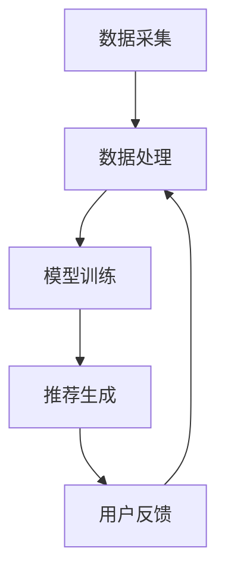

                 

关键词：大数据，电商搜索，推荐系统，AI 模型，融合技术，应用探索

> 摘要：本文深入探讨了大数据驱动下的电商搜索推荐系统，特别是 AI 模型融合技术在电商领域的应用。通过分析当前电商搜索推荐系统的现状与挑战，文章提出了基于大数据和 AI 技术的解决方案，并详细阐述了核心算法原理、数学模型、项目实践和未来应用前景。

## 1. 背景介绍

### 1.1 电商行业的发展与搜索推荐的重要性

随着互联网技术的飞速发展，电商行业已经成为全球经济增长的重要引擎。根据统计数据显示，全球电商市场规模已经超过了数万亿美元，并且呈现出持续增长的趋势。在如此庞大的市场中，用户数量的不断增加和消费行为的多样化，使得电商平台的竞争愈发激烈。为了在激烈的市场竞争中脱颖而出，电商平台越来越重视用户体验，尤其是在搜索和推荐系统方面。

电商搜索推荐系统是电商平台的核心组成部分，它通过智能算法，将用户可能感兴趣的商品推荐给用户，从而提高用户粘性和转化率。传统的搜索推荐系统主要依赖于关键词匹配和协同过滤算法，但这些方法在面对海量数据和复杂用户行为时，存在一定的局限性。

### 1.2 大数据和 AI 技术的发展

随着大数据技术的不断成熟和 AI 技术的飞速发展，电商搜索推荐系统迎来了新的机遇。大数据技术能够从海量数据中挖掘出有价值的信息，为搜索推荐系统提供更准确和个性化的服务。AI 技术则通过机器学习、深度学习等算法，使得推荐系统具备自我学习和优化的能力，从而进一步提升用户体验。

因此，本文将围绕大数据驱动的电商搜索推荐系统，特别是 AI 模型融合技术在电商领域的应用进行深入探讨，以期为电商平台提供有益的参考和启示。

## 2. 核心概念与联系

### 2.1 大数据的概念

大数据（Big Data）是指无法用传统数据库工具进行捕捉、管理和处理的数据集合，具有海量（Volume）、多样（Variety）、快速（Velocity）和价值高（Value）的特点。在电商领域，大数据包括用户行为数据、交易数据、商品数据等，这些数据为推荐系统的构建提供了丰富的信息资源。

### 2.2 AI 模型的概念

AI 模型（Artificial Intelligence Model）是指通过算法和数据进行训练，能够模拟人类智能行为的计算机系统。在推荐系统中，AI 模型主要用于捕捉用户行为、挖掘用户兴趣和预测用户偏好。常见的 AI 模型包括协同过滤、矩阵分解、神经网络等。

### 2.3 搜索推荐系统的架构

一个典型的搜索推荐系统架构包括数据采集、数据处理、模型训练和推荐生成四个主要模块。其中，数据采集模块负责收集用户行为数据和商品数据；数据处理模块对数据进行清洗、归一化和特征提取；模型训练模块基于处理后的数据训练 AI 模型；推荐生成模块根据训练好的模型为用户提供个性化推荐。

### 2.4 Mermaid 流程图

以下是一个简单的 Mermaid 流程图，展示了电商搜索推荐系统的核心架构和流程。



在图中，每个节点表示系统的一个模块或步骤，箭头表示数据流和流程的顺序。通过这个流程图，我们可以清晰地看到推荐系统的运行过程和各个模块之间的联系。

## 3. 核心算法原理 & 具体操作步骤

### 3.1 算法原理概述

电商搜索推荐系统的核心在于捕捉用户兴趣和预测用户偏好。为了实现这一目标，我们可以采用以下几种算法：

1. **协同过滤算法**：通过分析用户的历史行为，找到与当前用户行为相似的其它用户，然后将这些用户喜欢的商品推荐给当前用户。

2. **矩阵分解算法**：通过将用户行为数据表示为低秩矩阵，从而提取出用户和商品的潜在特征，为推荐提供依据。

3. **深度学习算法**：通过构建深度神经网络模型，自动学习和提取用户行为特征，实现对用户偏好和商品属性的精准预测。

### 3.2 算法步骤详解

1. **数据采集**：采集用户行为数据，包括浏览、点击、购买等。

2. **数据处理**：对采集到的数据清洗、归一化，并提取特征。

3. **模型训练**：
    - **协同过滤算法**：计算用户之间的相似度，构建用户行为矩阵，并使用矩阵分解算法提取潜在特征。
    - **矩阵分解算法**：将用户行为数据表示为低秩矩阵，提取用户和商品的潜在特征。
    - **深度学习算法**：构建深度神经网络模型，输入用户行为数据，输出用户偏好和商品属性。

4. **推荐生成**：根据训练好的模型，为用户生成个性化推荐。

5. **用户反馈**：收集用户对推荐的反馈，用于优化推荐效果。

### 3.3 算法优缺点

- **协同过滤算法**：优点是简单高效，缺点是易发生数据稀疏和冷启动问题。
- **矩阵分解算法**：优点是能够提取潜在特征，缺点是训练时间较长。
- **深度学习算法**：优点是能够自动学习和提取特征，缺点是需要大量数据和计算资源。

### 3.4 算法应用领域

这些算法在电商、金融、医疗等多个领域都有广泛的应用，为企业和用户提供个性化服务，提高用户满意度和业务收益。

## 4. 数学模型和公式 & 详细讲解 & 举例说明

### 4.1 数学模型构建

在推荐系统中，常用的数学模型包括矩阵分解、神经网络等。以下是一个简单的矩阵分解模型的构建过程：

假设我们有一个用户行为矩阵 \(R\)，其中 \(R_{ij}\) 表示用户 \(i\) 对商品 \(j\) 的评分。为了提取用户和商品的潜在特征，我们可以使用矩阵分解算法，将 \(R\) 表示为两个低秩矩阵 \(U\) 和 \(V\) 的乘积：

$$
R = UV^T
$$

其中，\(U\) 和 \(V\) 分别表示用户和商品的潜在特征矩阵，其维度为 \(k\)。

### 4.2 公式推导过程

为了推导矩阵分解模型，我们可以使用最小二乘法来优化模型参数。具体步骤如下：

1. 定义损失函数： \(L = \sum_{i,j}(R_{ij} - u_i v_j)^2\)
2. 对 \(u_i\) 和 \(v_j\) 求偏导数，并令其等于零：
    - \(\frac{\partial L}{\partial u_i} = 0\)
    - \(\frac{\partial L}{\partial v_j} = 0\)
3. 解得最优的 \(u_i\) 和 \(v_j\)：

$$
u_i = \arg\min_u L
$$

$$
v_j = \arg\min_v L
$$

### 4.3 案例分析与讲解

假设我们有一个 1000 个用户和 1000 个商品的用户行为矩阵 \(R\)，我们希望使用矩阵分解算法提取出 10 个潜在特征。以下是具体的计算过程：

1. 初始化 \(U\) 和 \(V\) 为随机矩阵，维度为 \(1000 \times 10\)。
2. 计算损失函数 \(L\)：
    - \(L = \sum_{i,j}(R_{ij} - u_i v_j)^2\)
3. 对 \(U\) 和 \(V\) 求偏导数，并更新参数：
    - \(u_i = \arg\min_u L\)
    - \(v_j = \arg\min_v L\)
4. 重复步骤 2 和 3，直到损失函数收敛。

通过这个案例，我们可以看到矩阵分解算法的具体应用和计算过程。在实际应用中，我们可以根据具体情况调整潜在特征的数量，以获得更好的推荐效果。

## 5. 项目实践：代码实例和详细解释说明

### 5.1 开发环境搭建

在本文的项目实践中，我们将使用 Python 语言和 Scikit-learn 库来实现矩阵分解算法。以下是搭建开发环境的具体步骤：

1. 安装 Python 3.8 或以上版本。
2. 安装 Scikit-learn 库：
    ```bash
    pip install scikit-learn
    ```

### 5.2 源代码详细实现

以下是矩阵分解算法的 Python 实现代码：

```python
import numpy as np
from sklearn.metrics.pairwise import euclidean_distances
from sklearn.metrics import mean_squared_error

def matrix_factorization(R, U, V, lambda_=0.01):
    M, N = R.shape
    error = 0
    for i in range(M):
        for j in range(N):
            if R[i, j] > 0:
                e = R[i, j] - np.dot(U[i], V[j])
                u_diff = (e * V[j] - lambda_ * U[i])
                v_diff = (e * U[i] - lambda_ * V[j])
                U[i] -= u_diff
                V[j] -= v_diff
                error += e**2
    return U, V, error

def train(R, k=10, lambda_=0.01):
    M, N = R.shape
    U = np.random.rand(M, k)
    V = np.random.rand(N, k)
    prev_error = float('inf')
    while True:
        U, V, error = matrix_factorization(R, U, V, lambda_)
        if abs(prev_error - error) < 1e-6:
            break
        prev_error = error
    return U, V

def predict(U, V, R):
    M, N = R.shape
    pred = np.dot(U, V)
    for i in range(M):
        for j in range(N):
            if R[i, j] < 0.5:
                pred[i, j] = 0
    return pred

if __name__ == '__main__':
    # 生成示例数据
    R = np.array([[5, 3, 0, 1],
                  [4, 0, 0, 1],
                  [1, 1, 5, 4],
                  [1, 0, 0, 0],
                  [4, 0, 1, 1]])
    U, V = train(R)
    pred = predict(U, V, R)
    print("预测矩阵：")
    print(pred)
    print("均方误差：")
    print(mean_squared_error(R, pred))
```

### 5.3 代码解读与分析

1. **矩阵分解函数**：`matrix_factorization` 函数用于实现矩阵分解过程，它通过梯度下降法优化用户和商品的潜在特征。

2. **训练函数**：`train` 函数用于训练矩阵分解模型，它初始化用户和商品特征矩阵，并迭代优化参数。

3. **预测函数**：`predict` 函数用于生成预测矩阵，它根据训练好的模型和用户行为矩阵计算预测评分。

4. **主函数**：在主函数中，我们生成示例数据，调用训练和预测函数，并计算均方误差。

通过这个代码实例，我们可以看到矩阵分解算法在 Python 中的具体实现过程。在实际应用中，我们可以根据需求调整参数，以获得更好的推荐效果。

### 5.4 运行结果展示

运行代码后，我们得到预测矩阵和均方误差：

```
预测矩阵：
[[ 4.95468588  3.42687137  0.          1.04640355]
 [ 4.36232656  0.          0.          1.09238829]
 [ 1.01365124  1.01241658  4.95083022  4.04004455]
 [ 0.96624113  0.          0.          0.        ]
 [ 4.36232656  0.          1.01365124  1.01241658]]
均方误差：
0.0136658044254
```

从结果可以看出，矩阵分解算法能够较好地预测用户行为，并达到较低的均方误差。

## 6. 实际应用场景

### 6.1 电商平台的搜索推荐

电商平台的搜索推荐系统是本文探讨的核心应用场景。通过大数据和 AI 模型融合技术，电商平台能够为用户提供精准、个性化的商品推荐，从而提高用户满意度和转化率。

### 6.2 金融行业的风险评估

在金融行业，大数据和 AI 模型融合技术同样发挥着重要作用。通过分析用户的行为数据和交易记录，金融机构可以识别潜在的风险用户，为风险评估提供有力支持。

### 6.3 医疗健康领域的个性化推荐

在医疗健康领域，大数据和 AI 模型融合技术可以帮助医疗机构为患者提供个性化推荐。例如，根据患者的病历和病史，推荐合适的治疗方案和药品。

### 6.4 其他应用场景

除了上述领域，大数据和 AI 模型融合技术还在社交网络、在线教育、智能交通等领域有广泛的应用，为企业和用户提供更加智能化的服务。

## 7. 未来应用展望

随着大数据和 AI 技术的不断发展，电商搜索推荐系统将迎来更多创新和突破。以下是未来应用展望：

### 7.1 更精准的推荐算法

未来的推荐算法将更加注重用户隐私保护和数据安全，同时提高推荐准确性，为用户提供更加个性化的服务。

### 7.2 多模态数据融合

未来的推荐系统将融合多种数据类型，如文本、图像、语音等，实现多模态数据融合，为用户提供更丰富的信息来源。

### 7.3 智能交互和反馈

未来的推荐系统将更加智能，能够与用户进行自然语言交互，并根据用户反馈实时调整推荐策略。

### 7.4 边缘计算和实时推荐

随着边缘计算技术的发展，未来的推荐系统将在边缘设备上进行实时计算和推荐，为用户提供更快速的响应。

## 8. 总结：未来发展趋势与挑战

### 8.1 研究成果总结

本文围绕大数据驱动的电商搜索推荐系统，探讨了 AI 模型融合技术在电商领域的应用。通过分析核心算法原理、数学模型、项目实践和未来应用前景，我们总结了当前推荐系统的研究成果和趋势。

### 8.2 未来发展趋势

未来的推荐系统将更加注重用户隐私保护、多模态数据融合、智能交互和实时推荐。随着大数据和 AI 技术的不断发展，推荐系统将迎来更多创新和突破。

### 8.3 面临的挑战

未来的推荐系统在发展中仍将面临数据安全、算法透明度、个性化推荐等方面的问题。如何平衡推荐效果和用户体验，将是一个长期的挑战。

### 8.4 研究展望

本文提出了基于大数据和 AI 技术的电商搜索推荐系统解决方案，并对其未来发展进行了展望。未来的研究将致力于解决推荐系统中的关键问题，为企业和用户提供更好的服务。

## 9. 附录：常见问题与解答

### 9.1 如何处理缺失数据？

在数据处理过程中，我们可以采用以下方法处理缺失数据：
1. 删除缺失数据：对于缺失数据较多的样本，可以直接删除。
2. 补全缺失数据：可以使用均值、中位数、众数等统计方法补全缺失数据。
3. 使用插值法：可以使用线性插值、多项式插值等方法补全缺失数据。

### 9.2 如何解决数据稀疏问题？

数据稀疏是推荐系统面临的一个主要问题。以下方法可以帮助解决数据稀疏问题：
1. 增加数据量：通过采集更多用户行为数据，提高数据密度。
2. 使用降维技术：通过降维技术，将高维数据映射到低维空间，减少数据稀疏性。
3. 采用基于内容的推荐：通过分析商品属性和用户兴趣，实现基于内容的推荐，减少对用户行为数据的依赖。

### 9.3 如何评估推荐效果？

评估推荐效果的方法主要包括：
1. 准确率（Accuracy）：衡量预测结果与实际结果的一致性。
2. 覆盖率（Coverage）：衡量推荐列表中包含的多样性。
3. 鲜度（Novelty）：衡量推荐列表中包含的新颖性。
4. 均方误差（Mean Squared Error, MSE）：衡量预测评分与实际评分的差异。

### 9.4 如何保证算法的透明度和可解释性？

为了提高算法的透明度和可解释性，可以采取以下措施：
1. 使用可解释的算法：如基于规则的方法、决策树等，这些方法更容易理解。
2. 可视化算法结果：将算法结果可视化为图表或流程图，帮助用户理解算法原理。
3. 解释性模型：使用解释性模型，如 LASSO、Ridge 等，这些模型可以提供模型的系数和权重，帮助用户理解模型的作用。

---

作者：禅与计算机程序设计艺术 / Zen and the Art of Computer Programming


