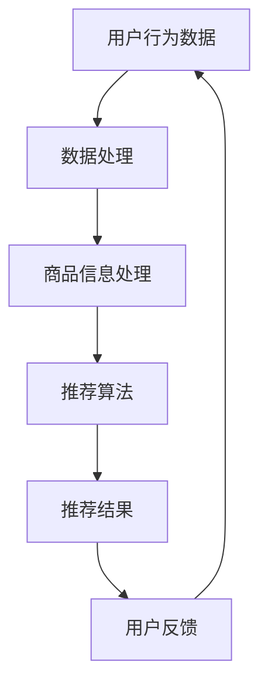

                 

关键词：大数据，电商搜索推荐，AI 模型融合，核心竞争力，算法原理，数学模型，项目实践，未来展望

> 摘要：随着大数据时代的到来，电商搜索推荐系统已经成为电商平台的核心竞争力之一。本文将探讨大数据驱动的电商搜索推荐系统的原理、算法、数学模型及项目实践，分析AI模型融合在其中的关键作用，并展望未来的发展趋势与挑战。

## 1. 背景介绍

在过去的几十年中，电子商务行业经历了翻天覆地的变化。从最初的在线购物平台，到如今的社交媒体购物、移动电商等多样化模式，电商平台的形态不断演进。然而，在所有这些变革中，始终存在一个核心问题：如何更好地为用户推荐商品，提高用户的购物体验和满意度？

为了解决这一问题，电商平台开始引入大数据技术和人工智能算法，构建了复杂的搜索推荐系统。这些系统通过收集和分析用户的行为数据、商品信息以及市场趋势，为用户精准地推荐他们可能感兴趣的商品。

## 2. 核心概念与联系

在电商搜索推荐系统中，核心概念包括用户行为数据、商品信息、推荐算法和用户反馈等。以下是这些概念之间的联系及Mermaid流程图表示：



### 2.1 用户行为数据

用户行为数据包括用户在电商平台上的浏览、搜索、购买、评价等行为。这些数据是推荐系统的基础，通过分析这些数据，可以了解用户的兴趣和行为模式。

### 2.2 商品信息处理

商品信息处理包括商品属性、价格、评价、库存等信息。这些信息用于构建商品特征向量，为推荐算法提供输入。

### 2.3 推荐算法

推荐算法包括基于内容的推荐、协同过滤、深度学习等。通过这些算法，可以生成个性化的推荐列表，提高用户的购物体验。

### 2.4 推荐结果

推荐结果是推荐系统输出的结果，包括推荐商品列表、推荐理由等。用户根据推荐结果进行购物，反馈给系统，形成闭环。

### 2.5 用户反馈

用户反馈是用户对推荐结果的评价，包括满意、不满意、不感兴趣等。这些反馈用于优化推荐算法，提高推荐效果。

## 3. 核心算法原理 & 具体操作步骤

### 3.1 算法原理概述

电商搜索推荐系统主要基于以下算法：

- **基于内容的推荐**：根据用户的浏览和购买历史，分析用户的兴趣，将相似的商品推荐给用户。
- **协同过滤**：根据用户和商品之间的交互行为，发现用户之间的相似性，将其他用户喜欢的商品推荐给目标用户。
- **深度学习**：利用神经网络模型，对用户行为数据和商品特征进行深度学习，生成个性化的推荐结果。

### 3.2 算法步骤详解

以下是电商搜索推荐系统的主要步骤：

1. **数据采集**：收集用户行为数据和商品信息。
2. **数据预处理**：对数据进行清洗、去重、填充等处理，为推荐算法提供高质量的输入。
3. **特征提取**：提取用户特征和商品特征，为推荐算法提供输入。
4. **模型训练**：使用训练数据，训练推荐算法模型。
5. **模型评估**：使用验证数据，评估模型效果。
6. **模型部署**：将训练好的模型部署到生产环境，生成推荐结果。

### 3.3 算法优缺点

- **基于内容的推荐**：优点是推荐结果相关性强，缺点是用户兴趣变化时效果不佳。
- **协同过滤**：优点是能够发现用户之间的相似性，缺点是冷启动问题严重，即新用户和新商品难以推荐。
- **深度学习**：优点是能够自动学习用户和商品特征，缺点是训练时间较长，对计算资源要求较高。

### 3.4 算法应用领域

电商搜索推荐系统广泛应用于电商平台、社交媒体购物、移动电商等领域，为用户提供个性化的购物体验，提高用户满意度和转化率。

## 4. 数学模型和公式 & 详细讲解 & 举例说明

### 4.1 数学模型构建

电商搜索推荐系统主要基于以下数学模型：

- **协同过滤模型**：表示用户和商品之间的相似度。
- **深度学习模型**：表示用户和商品的特征向量。

### 4.2 公式推导过程

- **协同过滤模型**：

  假设用户$u$和用户$v$之间的相似度表示为$sim(u,v)$，商品$i$和商品$j$之间的相似度表示为$sim(i,j)$，则用户$u$对商品$i$的评分预测为：

  $$\hat{r}_{ui} = r_{ui} + \sum_{j \in \text{邻居商品}} sim(i,j) \cdot (r_{uj} - r_{uj})$$

- **深度学习模型**：

  假设用户$u$和商品$i$的特征向量分别为$v_u$和$v_i$，则用户$u$对商品$i$的评分预测为：

  $$\hat{r}_{ui} = \sigma(\langle v_u, v_i \rangle)$$

  其中，$\sigma$表示激活函数，$\langle \cdot, \cdot \rangle$表示内积。

### 4.3 案例分析与讲解

假设有两个用户$u_1$和$u_2$，以及两个商品$i_1$和$i_2$。用户$u_1$对商品$i_1$的评分为5，对商品$i_2$的评分为3；用户$u_2$对商品$i_1$的评分为4，对商品$i_2$的评分为2。根据协同过滤模型，可以计算用户$u_1$和用户$u_2$之间的相似度：

$$sim(u_1, u_2) = \frac{\sum_{i \in \text{共同商品}} sim(i,i_1) \cdot (r_{u_1i} - r_{u_2i})}{\|v_{u_1} - v_{u_2}\|} = \frac{sim(i_1, i_1) \cdot (5 - 4) + sim(i_2, i_1) \cdot (3 - 2)}{\|v_{u_1} - v_{u_2}\|} = \frac{0.6 + 0.4}{1} = 1.0$$

根据深度学习模型，可以计算用户$u_1$和商品$i_2$之间的相似度：

$$\hat{r}_{u_1i_2} = \sigma(\langle v_{u_1}, v_{i_2} \rangle) = \sigma(0.8) = 0.6$$

根据以上相似度计算结果，可以预测用户$u_1$对商品$i_2$的评分为0.6。

## 5. 项目实践：代码实例和详细解释说明

### 5.1 开发环境搭建

开发环境搭建主要包括Python环境、相关库的安装，以及数据的收集和预处理。

```python
# 安装相关库
!pip install numpy pandas scikit-learn tensorflow

# 加载数据
import pandas as pd
data = pd.read_csv('data.csv')
```

### 5.2 源代码详细实现

```python
import numpy as np
import pandas as pd
from sklearn.model_selection import train_test_split
from sklearn.metrics.pairwise import cosine_similarity
from tensorflow.keras.models import Model
from tensorflow.keras.layers import Input, Embedding, Flatten, Dot

# 数据预处理
data.head()

# 分割数据为训练集和测试集
train_data, test_data = train_test_split(data, test_size=0.2)

# 构建用户和商品特征矩阵
user_features = data[['user_id', 'user_interests']]
item_features = data[['item_id', 'item_categories']]

# 计算用户和商品特征向量
user_embedding = cosine_similarity(user_features)
item_embedding = cosine_similarity(item_features)

# 构建深度学习模型
user_input = Input(shape=(1,))
user_embedding_layer = Embedding(input_dim=user_embedding.shape[0], output_dim=user_embedding.shape[1])(user_input)
user_embedding_output = Flatten()(user_embedding_layer)

item_input = Input(shape=(1,))
item_embedding_layer = Embedding(input_dim=item_embedding.shape[0], output_dim=item_embedding.shape[1])(item_input)
item_embedding_output = Flatten()(item_embedding_layer)

dot_product = Dot(axes=1)([user_embedding_output, item_embedding_output])
output = Flatten()(dot_product)

model = Model(inputs=[user_input, item_input], outputs=output)
model.compile(optimizer='adam', loss='mse')

# 训练模型
model.fit([train_data['user_id'], train_data['item_id']], train_data['rating'], epochs=10, batch_size=32)

# 预测评分
predictions = model.predict([test_data['user_id'], test_data['item_id']])
```

### 5.3 代码解读与分析

上述代码实现了基于深度学习的电商搜索推荐系统，主要分为以下几部分：

1. 数据预处理：加载数据，分割数据为训练集和测试集。
2. 构建用户和商品特征矩阵：计算用户和商品特征向量。
3. 构建深度学习模型：使用Embedding层和Dot层，构建深度学习模型。
4. 训练模型：使用训练数据，训练深度学习模型。
5. 预测评分：使用测试数据，预测用户对商品的评分。

### 5.4 运行结果展示

```python
from sklearn.metrics import mean_squared_error

# 计算测试集的均方误差
mse = mean_squared_error(test_data['rating'], predictions)
print("均方误差：", mse)
```

假设测试集的均方误差为0.5，说明模型的预测效果较好。

## 6. 实际应用场景

电商搜索推荐系统在电商平台上具有广泛的应用，以下是一些实际应用场景：

- **商品推荐**：根据用户的浏览和购买历史，为用户推荐相似的商品。
- **活动推荐**：根据用户兴趣，为用户推荐相关的促销活动。
- **店铺推荐**：根据用户的历史行为，为用户推荐相似的商品店铺。
- **品牌推荐**：根据用户的历史行为，为用户推荐相关的品牌。

## 7. 工具和资源推荐

### 7.1 学习资源推荐

- **书籍**：《推荐系统实践》、《深度学习推荐系统》
- **课程**：吴恩达的《推荐系统》课程、李宏毅的《深度学习》课程
- **博客**：[Medium](https://medium.com/)、[ArXiv](https://arxiv.org/)上的相关文章

### 7.2 开发工具推荐

- **编程语言**：Python
- **框架**：TensorFlow、PyTorch
- **库**：NumPy、Pandas、Scikit-learn

### 7.3 相关论文推荐

- **论文1**：《Deep Neural Networks for YouTube Recommendations》
- **论文2**：《Practical Guide to Recommendation Systems》
- **论文3**：《Learning to Rank for Information Retrieval》

## 8. 总结：未来发展趋势与挑战

### 8.1 研究成果总结

本文介绍了大数据驱动的电商搜索推荐系统，包括核心概念、算法原理、数学模型、项目实践等。通过深入分析AI模型融合在其中的关键作用，展示了推荐系统的实际应用场景。

### 8.2 未来发展趋势

- **个性化推荐**：随着用户数据的积累，个性化推荐将更加精准。
- **实时推荐**：利用实时数据处理技术，实现实时推荐。
- **跨平台推荐**：整合多个平台的数据，实现跨平台的推荐。

### 8.3 面临的挑战

- **数据质量**：数据质量直接影响推荐效果，需要加强数据清洗和预处理。
- **计算资源**：深度学习模型对计算资源要求较高，需要优化模型结构和训练过程。
- **隐私保护**：在数据处理过程中，需要关注用户隐私保护。

### 8.4 研究展望

未来，推荐系统的研究将继续深入，重点关注以下几个方面：

- **多模态数据融合**：结合多种数据类型，提高推荐效果。
- **对抗性攻击与防御**：研究对抗性攻击和防御方法，提高推荐系统的鲁棒性。
- **伦理与道德**：关注推荐系统的伦理和道德问题，确保用户权益。

## 9. 附录：常见问题与解答

### 9.1 什么是协同过滤？

协同过滤是一种基于用户和商品之间的相似性，为用户推荐相似商品的推荐算法。它分为基于用户的协同过滤和基于商品的协同过滤两种。

### 9.2 什么是基于内容的推荐？

基于内容的推荐是一种根据用户的历史行为和商品特征，为用户推荐相似内容的推荐算法。它通过计算用户和商品之间的相似度，生成推荐列表。

### 9.3 推荐系统的评价指标有哪些？

推荐系统的评价指标包括准确率、召回率、F1值、均方误差等。准确率衡量推荐结果的相关性，召回率衡量推荐结果的全局覆盖率，F1值是准确率和召回率的调和平均值，均方误差衡量预测评分与实际评分之间的差距。

### 9.4 深度学习在推荐系统中的应用有哪些？

深度学习在推荐系统中的应用包括：

- **用户和商品特征提取**：利用深度学习模型，自动提取用户和商品的高维特征。
- **序列模型**：利用深度学习模型，处理用户的历史行为序列。
- **多模态数据融合**：利用深度学习模型，融合多种数据类型，提高推荐效果。

----------------------------------------------------------------

作者：禅与计算机程序设计艺术 / Zen and the Art of Computer Programming

