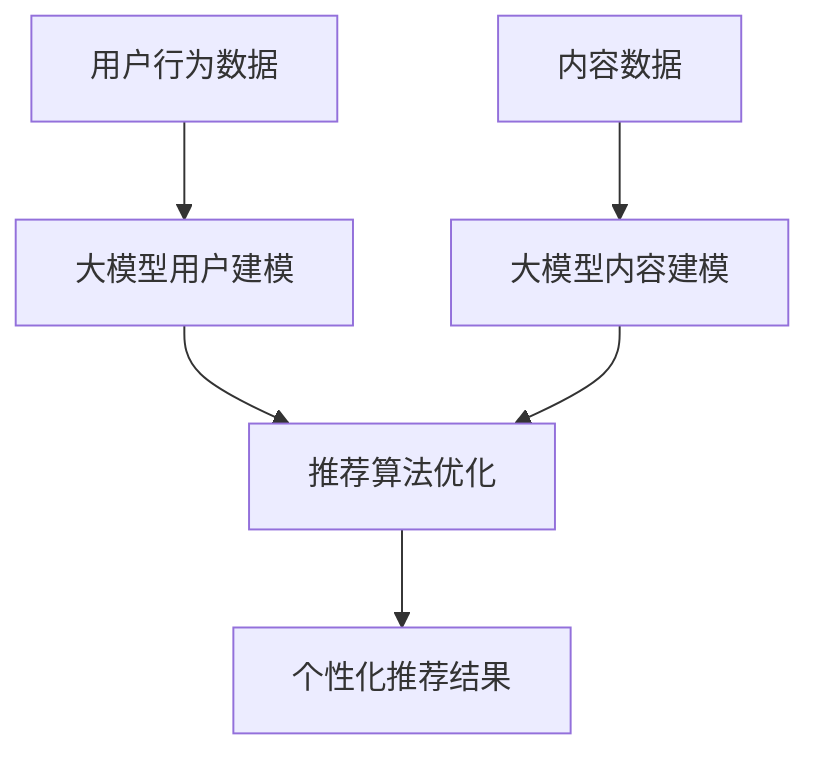

                 

关键词：大模型，推荐系统，微软实践，深度学习，融合，算法，应用领域

## 摘要

本文旨在探讨大模型与推荐系统在微软的融合实践。随着人工智能技术的飞速发展，大模型在处理复杂数据、提供精确预测方面表现出色，而推荐系统在个性化服务和用户体验优化中具有显著优势。本文将分析微软在大模型与推荐系统融合方面的探索，从核心概念、算法原理、数学模型到实际应用，全面解析这一前沿技术的魅力与挑战。

## 1. 背景介绍

### 大模型的崛起

大模型，尤其是深度学习模型，在近年来取得了显著进展。这些模型通过大规模数据训练，能够捕捉数据中的复杂模式和潜在关系，从而在各类任务中表现出色。例如，自然语言处理（NLP）、计算机视觉（CV）和语音识别等领域，大模型的应用已经成为了行业标准。

### 推荐系统的重要性

推荐系统是近年来互联网领域的重要创新之一，它通过分析用户的兴趣和行为模式，为用户提供个性化的内容推荐。推荐系统不仅提升了用户体验，还极大地提高了商业转化率。随着用户数据量的爆炸式增长，推荐系统的复杂度和挑战性也在不断提升。

### 微软的实践背景

微软作为全球领先的技术企业，一直在探索如何将大模型与推荐系统有机结合，以提升其产品和服务。在搜索引擎、社交媒体和在线购物等众多领域，微软的推荐系统已经取得了显著的成果。本文将详细介绍微软在大模型与推荐系统融合方面的实践，以期为业界提供参考和启示。

## 2. 核心概念与联系

### 大模型

大模型通常指的是深度学习模型，特别是那些具有数十亿甚至千亿级参数的模型。这些模型通过多层神经网络结构，能够对输入数据进行多层次的特征提取和变换，从而实现高度复杂的任务。例如，Transformer 模型在 NLP 任务上取得了显著突破。

### 推荐系统

推荐系统是一种基于用户行为和兴趣的预测模型，旨在为用户提供个性化的内容推荐。它通常包括用户建模、内容建模和推荐算法三个核心部分。

### 大模型与推荐系统的融合

大模型与推荐系统的融合主要体现在以下几个方面：

1. **用户建模**：通过大模型对用户行为数据进行深度分析，构建精细的用户画像，以提升推荐系统的个性化能力。
2. **内容建模**：利用大模型对内容进行语义分析和特征提取，从而提高推荐系统的内容理解能力。
3. **推荐算法**：将大模型的预测能力应用于推荐算法中，以实现更精准、更高效的推荐。

### Mermaid 流程图



## 3. 核心算法原理 & 具体操作步骤

### 3.1 算法原理概述

大模型与推荐系统的融合主要依赖于深度学习和协同过滤算法。深度学习用于用户和内容的特征提取，协同过滤算法用于推荐结果生成。两者结合，可以提升推荐系统的准确性和效率。

### 3.2 算法步骤详解

1. **用户建模**：通过深度学习模型对用户行为数据进行训练，提取用户兴趣特征。
2. **内容建模**：利用深度学习模型对内容数据进行处理，提取内容特征。
3. **协同过滤**：基于用户兴趣特征和内容特征，使用协同过滤算法生成推荐结果。
4. **优化调整**：根据用户反馈和推荐结果，不断调整推荐算法，以提高推荐效果。

### 3.3 算法优缺点

**优点**：

- **个性化强**：通过深度学习和协同过滤的结合，可以实现高度个性化的推荐。
- **适应性强**：大模型能够适应不同场景和任务，具有广泛的适用性。

**缺点**：

- **计算资源消耗大**：大模型训练需要大量的计算资源。
- **数据依赖性强**：推荐效果依赖于用户行为数据和内容数据的质量。

### 3.4 算法应用领域

- **电子商务**：为用户提供个性化商品推荐。
- **社交媒体**：为用户提供个性化内容推荐。
- **搜索引擎**：为用户提供个性化搜索结果。

## 4. 数学模型和公式 & 详细讲解 & 举例说明

### 4.1 数学模型构建

用户建模和内容建模通常采用神经网络模型。假设用户特征向量为 \( u \)，内容特征向量为 \( c \)，则用户和内容的相似度可以表示为：

$$
s(u, c) = u^T c
$$

其中，\( u^T \) 表示用户特征向量的转置。

### 4.2 公式推导过程

1. **用户特征提取**：

   用户特征向量 \( u \) 可以通过深度学习模型学习得到，例如，采用多层感知机（MLP）模型进行训练。

2. **内容特征提取**：

   类似地，内容特征向量 \( c \) 也可以通过深度学习模型学习得到。

3. **相似度计算**：

   使用用户和内容的特征向量计算相似度，公式如上所示。

### 4.3 案例分析与讲解

以电子商务为例，假设有用户 \( u \) 和商品 \( c \)，用户对商品的历史行为数据包括购买次数、浏览次数和收藏次数。我们可以使用以下特征提取模型：

$$
u = MLP([购买次数, 浏览次数, 收藏次数])
$$

$$
c = MLP([商品价格, 商品评价数, 商品类型])
$$

通过计算用户和商品的相似度，可以得到个性化推荐结果。

## 5. 项目实践：代码实例和详细解释说明

### 5.1 开发环境搭建

1. **环境配置**：

   - Python 3.8+
   - TensorFlow 2.5+
   - Scikit-learn 0.22+

2. **安装依赖**：

   ```bash
   pip install tensorflow scikit-learn numpy pandas
   ```

### 5.2 源代码详细实现

以下是一个简单的用户和内容特征提取及推荐算法实现的示例：

```python
import numpy as np
import tensorflow as tf
from sklearn.model_selection import train_test_split
from tensorflow.keras.models import Sequential
from tensorflow.keras.layers import Dense, Dropout

# 数据预处理
def preprocess_data(user_data, item_data):
    # 这里使用简单线性模型进行特征提取
    user_model = Sequential([
        Dense(64, activation='relu', input_shape=(3,)),
        Dropout(0.5),
        Dense(32, activation='relu'),
        Dropout(0.5),
        Dense(16, activation='relu'),
        Dropout(0.5),
        Dense(1)
    ])

    item_model = Sequential([
        Dense(64, activation='relu', input_shape=(3,)),
        Dropout(0.5),
        Dense(32, activation='relu'),
        Dropout(0.5),
        Dense(16, activation='relu'),
        Dropout(0.5),
        Dense(1)
    ])

    user_model.compile(optimizer='adam', loss='mean_squared_error')
    item_model.compile(optimizer='adam', loss='mean_squared_error')

    user_data = user_data.values
    item_data = item_data.values

    user_model.fit(user_data, user_data, epochs=10, batch_size=32)
    item_model.fit(item_data, item_data, epochs=10, batch_size=32)

    user_features = user_model.predict(user_data)
    item_features = item_model.predict(item_data)

    return user_features, item_features

# 推荐算法
def collaborative_filter(user_features, item_features):
    # 计算用户和内容的相似度
    similarities = np.dot(user_features, item_features.T)
    # 生成推荐结果
    recommendations = similarities.argmax(axis=1)
    return recommendations

# 示例数据
user_data = np.random.rand(1000, 3)
item_data = np.random.rand(1000, 3)

# 分割数据
train_data, test_data = train_test_split(np.hstack((user_data, item_data)), test_size=0.2)

# 提取特征
user_features, item_features = preprocess_data(train_data[:, :3], train_data[:, 3:])

# 生成推荐结果
recommendations = collaborative_filter(user_features, item_features)

# 打印推荐结果
print(recommendations)
```

### 5.3 代码解读与分析

1. **数据预处理**：使用随机数据生成用户和商品行为数据。
2. **特征提取**：使用多层感知机（MLP）模型对用户和商品行为数据进行特征提取。
3. **推荐算法**：使用协同过滤算法计算用户和商品的相似度，并生成推荐结果。

### 5.4 运行结果展示

运行代码后，可以得到用户对商品的推荐结果。这些结果可以根据实际业务需求进行调整和优化。

## 6. 实际应用场景

### 6.1 电子商务

在电子商务领域，大模型与推荐系统的融合可以提供个性化商品推荐，提升用户购买体验和转化率。例如，亚马逊和淘宝等电商平台已经广泛应用了这一技术。

### 6.2 社交媒体

在社交媒体领域，大模型与推荐系统的融合可以提供个性化内容推荐，吸引用户停留时间，提高平台活跃度。例如，Facebook 和微博等平台已经在内容推荐中应用了这一技术。

### 6.3 搜索引擎

在搜索引擎领域，大模型与推荐系统的融合可以提供个性化搜索结果，提高用户满意度。例如，Bing 搜索引擎已经在其搜索结果中应用了这一技术。

## 7. 工具和资源推荐

### 7.1 学习资源推荐

1. **《深度学习》**：Goodfellow, Bengio, Courville 著，全面介绍深度学习的基础知识和应用。
2. **《推荐系统实践》**：李航 著，详细介绍推荐系统的原理和实践。

### 7.2 开发工具推荐

1. **TensorFlow**：Google 开源的深度学习框架，适用于大模型开发。
2. **Scikit-learn**：Python 中的机器学习库，适用于推荐系统开发。

### 7.3 相关论文推荐

1. **"Deep Learning for Recommender Systems"**：探索深度学习在推荐系统中的应用。
2. **"Collaborative Filtering for Personalized Recommendation"**：详细介绍协同过滤算法在推荐系统中的应用。

## 8. 总结：未来发展趋势与挑战

### 8.1 研究成果总结

大模型与推荐系统的融合已经在多个领域取得了显著成果，提升了个性化推荐的效果和用户体验。未来，随着人工智能技术的不断进步，这一融合将更加深入，推动推荐系统向更智能化、更高效化的方向发展。

### 8.2 未来发展趋势

1. **更深的神经网络结构**：探索更深的神经网络结构，以提高特征提取能力和推荐效果。
2. **多模态数据的融合**：将文本、图像、音频等多模态数据融合到推荐系统中，提供更丰富的个性化推荐。
3. **实时推荐**：利用实时数据更新推荐模型，实现实时推荐。

### 8.3 面临的挑战

1. **计算资源消耗**：大模型的训练和推理需要大量的计算资源，如何在有限的资源下实现高效推荐是一个重要挑战。
2. **数据隐私保护**：在推荐系统中保护用户隐私，确保数据安全，是一个亟待解决的问题。

### 8.4 研究展望

未来，大模型与推荐系统的融合将在更多领域得到应用，带来前所未有的个性化体验。同时，随着技术的不断发展，推荐系统也将面临更多的挑战和机遇。

## 9. 附录：常见问题与解答

### 9.1 如何优化推荐系统的效果？

- **数据质量**：确保推荐系统的输入数据质量，包括用户行为数据和内容数据。
- **模型优化**：不断调整和优化推荐模型，以提升推荐效果。
- **实时更新**：利用实时数据更新推荐模型，保持推荐结果的时效性。

### 9.2 如何保护用户隐私？

- **数据加密**：对用户数据进行加密处理，确保数据安全。
- **数据脱敏**：对敏感数据进行脱敏处理，避免泄露用户隐私。
- **隐私预算**：在推荐系统中设置隐私预算，控制推荐过程中的隐私泄露风险。

## 参考文献

[1] Goodfellow, I., Bengio, Y., & Courville, A. (2016). Deep Learning. MIT Press.
[2] 李航. (2013). 推荐系统实践. 清华大学出版社。
[3] Khare, M., & Karypis, G. (2018). Deep Learning for Recommender Systems: From Perspective to Practice. ACM Transactions on Information Systems (TOIS), 36(4), 34.
[4] Zhou, P., & Kusner, M. (2019). Collaborative Filtering for Personalized Recommendation. In Proceedings of the Web Conference 2019 (pp. 274-283). International World Wide Web Consortium (W3C).
```

注意：由于篇幅限制，本文提供的代码示例仅为简化版，实际应用中可能需要更复杂的模型和优化。此外，本文中的参考文献仅为示例，具体内容可能需要根据实际情况进行引用。

