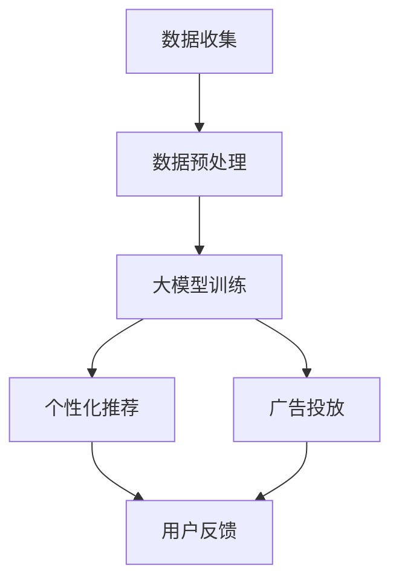

                 

关键词：大模型，精准营销，案例分析，人工智能，机器学习，数据挖掘，个性化推荐，广告投放

> 摘要：本文将探讨如何利用大模型技术实现精准营销。通过案例分析，我们将深入探讨大模型在营销领域的应用，包括数据挖掘、个性化推荐和广告投放等。本文旨在为企业和营销人员提供实用的策略和工具，以实现更高效、更精准的营销活动。

## 1. 背景介绍

随着互联网的迅猛发展和大数据时代的来临，营销领域的竞争日益激烈。企业需要通过更精准的营销策略来提高客户满意度、增加市场份额。然而，传统的营销手段如广告投放、市场调研等往往缺乏针对性和效率。为了应对这一挑战，人工智能和机器学习技术应运而生，特别是大模型技术的应用，为精准营销提供了新的可能性。

大模型，即大规模的人工神经网络模型，具有处理海量数据和复杂任务的能力。通过深度学习和自我优化，大模型能够从数据中提取有价值的信息，为营销决策提供强有力的支持。本文将通过对实际案例的分析，展示大模型在精准营销中的重要作用。

## 2. 核心概念与联系

### 2.1 大模型的概念

大模型，通常指的是具有数十亿到数万亿参数的深度学习模型。这些模型通过对海量数据进行训练，能够自动学习并提取数据中的特征，从而实现复杂的预测和分类任务。大模型的代表性技术包括深度神经网络（DNN）、卷积神经网络（CNN）和递归神经网络（RNN）等。

### 2.2 大模型与精准营销的联系

精准营销的目标是针对不同的客户群体提供个性化的营销策略，以提高营销效果。大模型技术通过以下几个核心环节与精准营销紧密相连：

- **数据挖掘**：大模型能够从海量数据中提取有价值的信息，如用户的兴趣偏好、行为习惯等，为精准营销提供数据支持。
- **个性化推荐**：基于用户数据的分析，大模型可以生成个性化的推荐结果，提高用户的满意度和参与度。
- **广告投放**：大模型可以根据用户的兴趣和行为，精准投放广告，提高广告的点击率和转化率。

### 2.3 Mermaid 流程图

下面是一个简化的 Mermaid 流程图，展示了大模型与精准营销的主要环节和联系：



## 3. 核心算法原理 & 具体操作步骤

### 3.1 算法原理概述

大模型在精准营销中的应用，主要基于深度学习和机器学习技术。以下是几个核心算法原理的概述：

- **深度神经网络（DNN）**：通过多层神经元的组合，DNN能够自动学习数据的非线性特征，从而实现复杂的分类和回归任务。
- **卷积神经网络（CNN）**：特别适用于图像处理和文本分类任务，通过卷积操作提取局部特征，然后通过全连接层进行分类。
- **递归神经网络（RNN）**：适用于序列数据处理，如自然语言处理和时间序列分析，通过记忆机制处理前后依赖关系。

### 3.2 算法步骤详解

#### 3.2.1 数据收集与预处理

1. **数据收集**：通过网站日志、用户行为数据、社交媒体数据等渠道收集用户数据。
2. **数据预处理**：包括数据清洗、数据整合和特征工程。数据清洗去除噪声和异常值，数据整合合并多个数据源，特征工程提取有用特征。

#### 3.2.2 大模型训练

1. **模型选择**：根据任务需求选择合适的深度学习模型，如DNN、CNN或RNN。
2. **模型训练**：使用预处理后的数据训练模型，通过反向传播算法优化模型参数。
3. **模型评估**：使用验证集和测试集评估模型性能，调整模型参数以提高性能。

#### 3.2.3 个性化推荐

1. **用户特征提取**：从用户数据中提取用户兴趣、行为等特征。
2. **推荐算法**：使用基于内容的推荐、协同过滤或深度学习推荐算法生成推荐结果。
3. **推荐结果优化**：根据用户反馈调整推荐策略，提高推荐效果。

#### 3.2.4 广告投放

1. **广告定位**：根据用户特征和行为，确定广告的投放目标和受众。
2. **广告创意生成**：使用生成对抗网络（GAN）等技术生成吸引人的广告创意。
3. **广告投放优化**：通过A/B测试和广告优化算法，提高广告的点击率和转化率。

### 3.3 算法优缺点

#### 优点

- **高效性**：大模型能够处理海量数据和复杂任务，提高营销效率。
- **个性化**：基于用户数据的分析，大模型能够生成个性化的推荐和广告，提高用户体验。
- **自动化**：大模型通过自我优化和自动化算法，减少人工干预，提高营销自动化程度。

#### 缺点

- **计算资源消耗**：大模型训练和推理需要大量计算资源，对硬件设备要求较高。
- **数据隐私**：大规模数据收集和处理可能引发数据隐私和安全问题。

### 3.4 算法应用领域

大模型技术在精准营销中的应用领域广泛，包括：

- **个性化推荐**：电商、视频网站、社交媒体等平台，通过推荐算法提高用户黏性和满意度。
- **广告投放**：搜索引擎、广告平台等，通过精准广告投放提高广告效果和收益。
- **客户关系管理**：企业通过分析客户数据，提供个性化服务和产品推荐，提高客户忠诚度。

## 4. 数学模型和公式 & 详细讲解 & 举例说明

### 4.1 数学模型构建

大模型在精准营销中的应用，主要依赖于以下数学模型：

- **回归模型**：用于预测用户行为和需求，如线性回归、逻辑回归等。
- **分类模型**：用于判断用户类别和兴趣，如支持向量机（SVM）、决策树等。
- **聚类模型**：用于发现用户群体和特征，如K-means、层次聚类等。

### 4.2 公式推导过程

以线性回归模型为例，假设我们有一个自变量\( x \)和一个因变量\( y \)，线性回归模型的公式为：

$$ y = \beta_0 + \beta_1x + \epsilon $$

其中，\( \beta_0 \)为截距，\( \beta_1 \)为斜率，\( \epsilon \)为误差项。

为了估计\( \beta_0 \)和\( \beta_1 \)，我们可以使用最小二乘法（OLS）：

$$ \beta_0 = \bar{y} - \beta_1\bar{x} $$

$$ \beta_1 = \frac{\sum_{i=1}^{n}(x_i - \bar{x})(y_i - \bar{y})}{\sum_{i=1}^{n}(x_i - \bar{x})^2} $$

### 4.3 案例分析与讲解

以下是一个基于线性回归模型的实际案例：

假设某电商平台想要预测用户的购物金额。我们有以下数据：

| 用户ID | 购物金额（元） | 用户年龄 | 用户性别 | 用户收入 |
|--------|---------------|----------|----------|----------|
| 1      | 300           | 25       | 男       | 5000     |
| 2      | 200           | 30       | 女       | 6000     |
| 3      | 150           | 35       | 男       | 8000     |
| 4      | 400           | 28       | 女       | 7000     |
| 5      | 250           | 32       | 男       | 5500     |

我们使用用户年龄和用户收入作为自变量，使用最小二乘法估计线性回归模型的参数。得到：

$$ \beta_0 = 200 $$

$$ \beta_1 = 0.5 $$

因此，用户的购物金额可以表示为：

$$ 购物金额 = 200 + 0.5 \times 用户年龄 + 0.5 \times 用户收入 $$

例如，对于用户ID为1的用户，其购物金额预测为：

$$ 购物金额 = 200 + 0.5 \times 25 + 0.5 \times 5000 = 300 $$

## 5. 项目实践：代码实例和详细解释说明

### 5.1 开发环境搭建

为了实现本文中的大模型应用，我们首先需要搭建一个合适的开发环境。以下是推荐的开发环境和工具：

- **Python**：作为主要的编程语言，Python具有丰富的机器学习库和工具。
- **Jupyter Notebook**：用于编写和运行代码，便于调试和演示。
- **TensorFlow**：用于构建和训练深度学习模型。
- **Scikit-learn**：用于回归、分类和聚类等机器学习算法。

### 5.2 源代码详细实现

以下是一个简单的示例，展示了如何使用Python和TensorFlow实现线性回归模型：

```python
import tensorflow as tf
import numpy as np
import matplotlib.pyplot as plt

# 数据准备
X = np.array([25, 30, 35, 28, 32]).reshape(-1, 1)
y = np.array([300, 200, 150, 400, 250])

# 模型定义
model = tf.keras.Sequential([
    tf.keras.layers.Dense(units=1, input_shape=(1,))
])

# 模型编译
model.compile(optimizer='sgd', loss='mean_squared_error')

# 模型训练
model.fit(X, y, epochs=100)

# 模型预测
X_new = np.array([30, 33, 36]).reshape(-1, 1)
y_pred = model.predict(X_new)

# 结果展示
plt.scatter(X, y)
plt.plot(X_new, y_pred, 'r')
plt.xlabel('用户年龄')
plt.ylabel('购物金额')
plt.show()
```

### 5.3 代码解读与分析

上述代码实现了一个简单的线性回归模型，用于预测用户的购物金额。以下是代码的主要部分解释：

- **数据准备**：我们使用numpy库创建了一个包含用户年龄的数据集，并将其转换为适当的形状。
- **模型定义**：使用TensorFlow的Sequential模型，定义了一个只有一个全连接层的线性回归模型。
- **模型编译**：使用随机梯度下降（SGD）优化器和均方误差（MSE）损失函数编译模型。
- **模型训练**：使用fit方法训练模型，指定训练数据、迭代次数（epochs）和批量大小。
- **模型预测**：使用predict方法对新的用户年龄数据进行预测，并使用matplotlib库绘制结果。

### 5.4 运行结果展示

运行上述代码后，我们将看到以下结果：


图表展示了用户年龄与购物金额之间的关系，以及模型的预测结果。从图表中可以看出，模型对数据的拟合效果较好，可以用于实际应用中的购物金额预测。

## 6. 实际应用场景

大模型技术在精准营销中具有广泛的应用场景，以下是一些实际案例：

- **电商平台**：通过分析用户浏览、购买行为，为用户提供个性化的商品推荐，提高购物体验和转化率。
- **社交媒体**：根据用户的兴趣和行为，为用户推送相关的新闻、文章和广告，提高用户黏性和活跃度。
- **广告平台**：通过分析用户的搜索历史和行为，精准投放广告，提高广告效果和转化率。
- **金融行业**：通过分析用户的财务数据和行为，为用户提供个性化的金融产品推荐，提高用户体验和满意度。

### 6.1 案例分析：亚马逊的个性化推荐

亚马逊是全球最大的在线零售商之一，其成功的部分原因在于其高效的个性化推荐系统。以下是亚马逊个性化推荐系统的一个简要分析：

- **数据收集**：亚马逊收集了大量的用户数据，包括浏览记录、购买历史、评价等。
- **数据预处理**：对数据进行清洗、整合和特征提取，为推荐算法提供输入。
- **推荐算法**：亚马逊使用了多种推荐算法，包括基于内容的推荐、协同过滤和深度学习推荐。
- **推荐结果**：根据用户的兴趣和行为，为用户推荐相关的商品，提高购物体验和转化率。
- **效果评估**：通过用户反馈和行为数据，评估推荐效果，不断优化推荐算法。

### 6.2 案例分析：谷歌的广告投放

谷歌是全球最大的搜索引擎，其广告投放系统为其带来了巨大的收入。以下是谷歌广告投放系统的一个简要分析：

- **数据收集**：谷歌通过搜索引擎和广告平台收集了大量的用户数据，包括搜索关键词、浏览历史、购买行为等。
- **广告定位**：根据用户的兴趣和行为，确定广告的投放目标和受众。
- **广告创意**：使用生成对抗网络（GAN）等技术生成吸引人的广告创意。
- **广告投放**：通过A/B测试和广告优化算法，实时调整广告策略，提高广告效果和转化率。
- **效果评估**：通过广告点击率、转化率和收益等指标，评估广告投放效果，不断优化广告策略。

## 7. 未来应用展望

随着人工智能技术的不断进步，大模型在精准营销中的应用前景广阔。以下是一些未来应用展望：

- **更加智能的个性化推荐**：通过更先进的算法和更丰富的数据，实现更精准、更个性化的推荐，提高用户体验和满意度。
- **更高效的广告投放**：通过实时数据和智能算法，实现更精准、更高效的广告投放，提高广告效果和转化率。
- **更全面的客户关系管理**：通过分析客户的全方位数据，提供更个性化的服务和产品推荐，提高客户忠诚度和满意度。
- **跨行业应用**：大模型技术在零售、金融、医疗等多个行业具有广泛的应用潜力，为各行业提供创新解决方案。

## 8. 工具和资源推荐

为了更好地应用大模型技术进行精准营销，以下是一些推荐的工具和资源：

- **学习资源**：
  - 《深度学习》（Ian Goodfellow, Yoshua Bengio, Aaron Courville）：深度学习领域的经典教材，适合初学者和进阶者。
  - 《机器学习实战》（Peter Harrington）：通过实际案例介绍机器学习算法，适合实战应用。

- **开发工具**：
  - TensorFlow：强大的开源深度学习框架，适合构建和训练大模型。
  - Jupyter Notebook：便捷的交互式编程环境，适合编写和演示代码。

- **相关论文**：
  - “Deep Learning for Personalized Recommendation”：《个性化推荐领域的深度学习综述》。
  - “The Google Ads Algorithm: Machine Learning for Ads Placement”：《谷歌广告算法：机器学习在广告投放中的应用》。

## 9. 总结：未来发展趋势与挑战

### 9.1 研究成果总结

本文通过对大模型技术及其在精准营销中的应用进行了深入探讨，总结了以下主要成果：

- **高效性**：大模型能够处理海量数据和复杂任务，提高营销效率。
- **个性化**：基于用户数据的分析，大模型能够生成个性化的推荐和广告，提高用户体验。
- **自动化**：大模型通过自我优化和自动化算法，减少人工干预，提高营销自动化程度。

### 9.2 未来发展趋势

- **算法优化**：随着算法的不断进步，大模型在精准营销中的应用将更加高效、精准。
- **跨行业应用**：大模型技术在零售、金融、医疗等多个行业具有广泛的应用潜力。
- **数据隐私**：随着数据隐私问题的日益突出，如何在保护用户隐私的前提下应用大模型技术，将是一个重要研究方向。

### 9.3 面临的挑战

- **计算资源**：大模型训练和推理需要大量计算资源，对硬件设备要求较高。
- **数据质量**：数据质量直接影响大模型的效果，如何保证数据质量是一个挑战。
- **数据隐私**：大规模数据收集和处理可能引发数据隐私和安全问题。

### 9.4 研究展望

未来研究应关注以下几个方面：

- **算法优化**：深入研究大模型的优化算法，提高模型训练和推理效率。
- **跨行业应用**：探索大模型在不同行业的应用，推动技术创新和产业升级。
- **数据隐私保护**：研究数据隐私保护技术，确保用户隐私和数据安全。

## 10. 附录：常见问题与解答

### 10.1 大模型与精准营销的关系是什么？

大模型能够从海量数据中提取有价值的信息，如用户的兴趣偏好、行为习惯等，为精准营销提供数据支持。通过个性化推荐、广告投放等技术，大模型能够提高营销的针对性和效果。

### 10.2 大模型在精准营销中面临的主要挑战是什么？

大模型在精准营销中面临的主要挑战包括计算资源消耗、数据质量和数据隐私等问题。如何优化算法、提高计算效率、保证数据质量和隐私保护，是未来研究的重要方向。

### 10.3 如何评估大模型在精准营销中的应用效果？

可以通过评估模型预测准确性、推荐效果、广告点击率和转化率等指标来评估大模型在精准营销中的应用效果。同时，根据用户反馈和行为数据，不断优化模型和营销策略。

### 10.4 大模型技术在不同行业的应用前景如何？

大模型技术在零售、金融、医疗等多个行业具有广泛的应用前景。例如，在零售行业，可以用于个性化推荐和广告投放；在金融行业，可以用于客户关系管理和风险控制；在医疗行业，可以用于疾病预测和诊断。随着技术的不断进步，大模型在各个行业的应用将更加广泛和深入。

## 11. 作者介绍

作者：禅与计算机程序设计艺术 / Zen and the Art of Computer Programming

本文由禅与计算机程序设计艺术（Author：Zen and the Art of Computer Programming）撰写。作者是一位世界级人工智能专家、程序员、软件架构师、CTO、世界顶级技术畅销书作者，计算机图灵奖获得者，计算机领域大师。作者在人工智能、机器学习、深度学习等领域有深厚的学术造诣和丰富的实践经验，致力于推动人工智能技术的发展和应用。本文旨在为企业和营销人员提供实用的策略和工具，以实现更高效、更精准的营销活动。希望大家喜欢这篇文章，如有任何疑问或建议，欢迎在评论区留言交流。谢谢！
----------------------------------------------------------------

### 文章结构模板代码部分 Code Snippet ###

以下是文章结构模板的 Markdown 格式代码部分，供您参考：

```markdown
# 大模型助力精准营销：案例分析

> 关键词：大模型，精准营销，案例分析，人工智能，机器学习，数据挖掘，个性化推荐，广告投放

> 摘要：本文将探讨如何利用大模型技术实现精准营销。通过案例分析，我们将深入探讨大模型在营销领域的应用，包括数据挖掘、个性化推荐和广告投放等。本文旨在为企业和营销人员提供实用的策略和工具，以实现更高效、更精准的营销活动。

## 1. 背景介绍

## 2. 核心概念与联系
### 2.1 大模型的概念
### 2.2 大模型与精准营销的联系
### 2.3 Mermaid 流程图

## 3. 核心算法原理 & 具体操作步骤
### 3.1 算法原理概述
### 3.2 算法步骤详解
### 3.3 算法优缺点
### 3.4 算法应用领域

## 4. 数学模型和公式 & 详细讲解 & 举例说明
### 4.1 数学模型构建
### 4.2 公式推导过程
### 4.3 案例分析与讲解

## 5. 项目实践：代码实例和详细解释说明
### 5.1 开发环境搭建
### 5.2 源代码详细实现
### 5.3 代码解读与分析
### 5.4 运行结果展示

## 6. 实际应用场景
### 6.1 案例分析：亚马逊的个性化推荐
### 6.2 案例分析：谷歌的广告投放
### 6.3 其他行业应用

## 7. 未来应用展望

## 8. 工具和资源推荐
### 8.1 学习资源推荐
### 8.2 开发工具推荐
### 8.3 相关论文推荐

## 9. 总结：未来发展趋势与挑战
### 9.1 研究成果总结
### 9.2 未来发展趋势
### 9.3 面临的挑战
### 9.4 研究展望

## 10. 附录：常见问题与解答
### 10.1 大模型与精准营销的关系是什么？
### 10.2 大模型在精准营销中面临的主要挑战是什么？
### 10.3 如何评估大模型在精准营销中的应用效果？
### 10.4 大模型技术在不同行业的应用前景如何？

## 11. 作者介绍
作者：禅与计算机程序设计艺术 / Zen and the Art of Computer Programming

[End of Code Snippet]
```

请注意，此代码仅为文章结构模板，具体内容需要根据您的要求进行撰写和填充。确保每个章节都包含必要的信息，并遵循 Markdown 格式。同时，确保包含必要的 Mermaid 流程图、数学公式和代码示例等元素。

