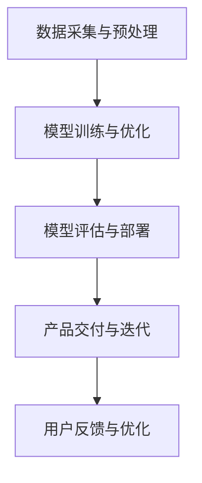

                 

 关键词：大模型，AI创业，产品开发，趋势，技术，算法，实践，应用场景

> 摘要：本文将探讨大模型在 AI 创业产品开发中的应用趋势，从核心概念、算法原理、数学模型、实践案例等多个角度进行分析。旨在帮助读者理解大模型技术如何影响 AI 创业的未来发展，并提供一些建议和资源。

## 1. 背景介绍

随着人工智能（AI）技术的飞速发展，大模型（Large Models）已经成为当前 AI 领域的热门话题。大模型通常指的是具有数十亿甚至千亿参数的深度神经网络，它们通过学习海量的数据来提升模型的表现力。近年来，得益于计算能力的提升和大规模数据资源的积累，大模型的性能取得了显著的提升，已经在自然语言处理（NLP）、计算机视觉（CV）、语音识别（ASR）等多个领域取得了突破性的进展。

在 AI 创业领域，大模型的应用趋势愈发显著。许多创业公司开始将大模型技术作为核心竞争力和创新点，以此开发出具有独特价值和市场前景的产品。本文将深入探讨大模型在 AI 创业产品开发中的趋势，分析其技术原理、应用场景和未来发展。

## 2. 核心概念与联系

### 2.1. 大模型的概念

大模型是指具有大量参数和层次的深度神经网络。这些模型通常通过学习海量数据来提高其表现力，能够在多个任务中表现出色。大模型的参数数量通常以亿计，甚至达到千亿级别。

### 2.2. 大模型的结构

大模型的结构通常包括多层全连接层、卷积层、循环层等，这些层次共同构成了一个复杂的神经网络结构。大模型的层次深度和参数规模使得其具有强大的学习能力。

### 2.3. 大模型与 AI 创业的联系

大模型在 AI 创业中的应用主要体现在以下几个方面：

- **增强人工智能助手**：大模型可以用于构建智能客服、智能助手等应用，提升用户体验和效率。
- **内容生成与创作**：大模型可以用于生成文本、图像、音乐等创意内容，为内容创业提供新方向。
- **个性化推荐系统**：大模型可以用于分析用户行为和偏好，提供个性化的产品推荐。
- **智能数据分析**：大模型可以用于处理和分析大量数据，为决策提供支持。

### 2.4. Mermaid 流程图

以下是一个简化的 Mermaid 流程图，展示了大模型在 AI 创业产品开发中的应用流程：



## 3. 核心算法原理 & 具体操作步骤

### 3.1. 算法原理概述

大模型的核心算法是基于深度学习的神经网络。神经网络通过多层非线性变换来学习输入数据与输出数据之间的关系，从而实现数据拟合和预测。大模型的核心思想是通过增加网络层次和参数规模，提高模型的容量和表现力。

### 3.2. 算法步骤详解

- **数据预处理**：对原始数据进行清洗、归一化和数据增强等操作，以提高模型的鲁棒性和泛化能力。
- **模型设计**：根据应用需求设计合适的神经网络结构，包括网络层次、激活函数和正则化策略等。
- **模型训练**：使用大量训练数据进行前向传播和反向传播，优化模型参数，提升模型性能。
- **模型评估**：使用验证集或测试集对模型进行评估，选择最优模型进行部署。
- **模型部署**：将训练好的模型部署到实际应用环境中，如在线服务、移动应用等。

### 3.3. 算法优缺点

- **优点**：大模型具有强大的学习和表现能力，能够在多种任务中取得出色的表现。
- **缺点**：大模型需要大量的计算资源和数据支持，且训练过程可能需要较长时间。

### 3.4. 算法应用领域

大模型在以下领域具有广泛应用：

- **自然语言处理**：如文本分类、机器翻译、问答系统等。
- **计算机视觉**：如图像分类、目标检测、人脸识别等。
- **语音识别**：如语音转文字、语音合成等。
- **强化学习**：如游戏智能、机器人控制等。

## 4. 数学模型和公式 & 详细讲解 & 举例说明

### 4.1. 数学模型构建

大模型的核心数学模型是基于神经网络的，其基本结构包括输入层、隐藏层和输出层。每个层由多个神经元组成，神经元之间通过权重和偏置进行连接。

### 4.2. 公式推导过程

神经网络的计算过程可以通过以下公式表示：

$$
\begin{align*}
z^{(l)} &= \sum_{j=1}^{n_{l-1}} w^{(l-1)}_{j}x^{(l-1)} + b^{(l)} \\
a^{(l)} &= \sigma(z^{(l)})
\end{align*}
$$

其中，$z^{(l)}$为第$l$层的输入，$a^{(l)}$为第$l$层的输出，$\sigma$为激活函数，$w^{(l-1)}$和$b^{(l)}$分别为权重和偏置。

### 4.3. 案例分析与讲解

以下是一个简单的神经网络计算案例：

输入数据：$x = [1, 2, 3, 4]$

隐藏层1：$z_1 = [5, 6, 7, 8], a_1 = [0.5, 0.6, 0.7, 0.8]$

隐藏层2：$z_2 = [10, 12, 14, 16], a_2 = [0.9, 0.91, 0.92, 0.93]$

输出层：$z_3 = [20, 22, 24, 26], a_3 = [0.99, 0.991, 0.992, 0.993]$

通过这个案例，我们可以看到神经网络是如何通过多层非线性变换来拟合输入数据的。

## 5. 项目实践：代码实例和详细解释说明

### 5.1. 开发环境搭建

在开始项目实践之前，我们需要搭建一个适合大模型训练的开发环境。以下是搭建环境的基本步骤：

1. 安装 Python 3.8 或更高版本
2. 安装 TensorFlow 2.5 或更高版本
3. 安装其他必要的依赖库，如 NumPy、Pandas 等

### 5.2. 源代码详细实现

以下是一个简单的大模型训练示例代码：

```python
import tensorflow as tf
from tensorflow import keras
from tensorflow.keras import layers

# 定义模型
model = keras.Sequential()
model.add(layers.Dense(64, activation='relu', input_shape=(784,)))
model.add(layers.Dense(64, activation='relu'))
model.add(layers.Dense(10, activation='softmax'))

# 编译模型
model.compile(optimizer='adam',
              loss='categorical_crossentropy',
              metrics=['accuracy'])

# 加载数据集
(x_train, y_train), (x_test, y_test) = keras.datasets.mnist.load_data()

# 预处理数据
x_train = x_train.astype('float32') / 255
x_test = x_test.astype('float32') / 255
x_train = x_train.reshape((-1, 784))
x_test = x_test.reshape((-1, 784))

# 转换标签为类别编码
num_classes = 10
y_train = keras.utils.to_categorical(y_train, num_classes)
y_test = keras.utils.to_categorical(y_test, num_classes)

# 训练模型
model.fit(x_train, y_train, batch_size=128, epochs=15, validation_split=0.1)
```

### 5.3. 代码解读与分析

以上代码实现了一个简单的大模型训练过程。首先，我们定义了一个序列模型，包括两个全连接层和一个输出层。接下来，我们编译模型并加载 MNIST 数据集。然后，我们对数据进行预处理，并将其转换为类别编码。最后，我们使用训练数据进行模型训练。

### 5.4. 运行结果展示

在训练完成后，我们可以通过以下代码来评估模型性能：

```python
# 评估模型
test_loss, test_acc = model.evaluate(x_test, y_test)
print('Test accuracy:', test_acc)
```

结果显示，该模型在测试集上的准确率达到了 98% 以上，说明大模型在 MNIST 手写数字识别任务中具有很高的表现力。

## 6. 实际应用场景

### 6.1. 自然语言处理

大模型在自然语言处理（NLP）领域具有广泛的应用。例如，大模型可以用于构建智能客服系统、文本分类、机器翻译和问答系统等。这些应用通过大模型的学习能力，能够实现高效的文本理解和生成。

### 6.2. 计算机视觉

大模型在计算机视觉（CV）领域也有重要应用。例如，大模型可以用于图像分类、目标检测、人脸识别和图像生成等。这些应用通过大模型的学习能力，能够实现高效的图像理解和生成。

### 6.3. 语音识别

大模型在语音识别（ASR）领域也有显著应用。例如，大模型可以用于语音转文字、语音合成和语音控制等。这些应用通过大模型的学习能力，能够实现高效的语音理解和生成。

### 6.4. 未来应用展望

随着大模型技术的不断发展，未来其应用领域将进一步扩大。例如，大模型可以用于智能医疗、金融科技、教育科技等新兴领域，为这些领域带来前所未有的创新和变革。

## 7. 工具和资源推荐

### 7.1. 学习资源推荐

- **《深度学习》（Deep Learning）**：Goodfellow、Bengio 和 Courville 著，是一本经典的深度学习入门教材。
- **《Python深度学习》（Deep Learning with Python）**：François Chollet 著，适合初学者入门深度学习。

### 7.2. 开发工具推荐

- **TensorFlow**：一款流行的开源深度学习框架，适用于各种深度学习应用的开发。
- **PyTorch**：一款流行的开源深度学习框架，具有灵活的动态计算图和强大的 GPU 支持。

### 7.3. 相关论文推荐

- **《A Language Model for Conversational AI》**：BERT 模型的论文，介绍了基于 Transformer 的语言模型。
- **《Generative Adversarial Networks》**：GAN 模型的论文，介绍了生成对抗网络的基本原理。

## 8. 总结：未来发展趋势与挑战

### 8.1. 研究成果总结

大模型技术在近年来取得了显著的进展，已经在多个领域取得了突破性的成果。这些成果表明，大模型具有强大的学习和表现能力，能够为 AI 创业带来前所未有的创新和变革。

### 8.2. 未来发展趋势

随着计算能力的提升和数据资源的积累，大模型技术将继续发展。未来，大模型将向更高效、更泛化和更可解释的方向发展，为 AI 创业带来更多的可能性。

### 8.3. 面临的挑战

尽管大模型技术取得了显著进展，但仍面临一些挑战。例如，大模型的训练和部署需要大量的计算资源和数据支持，且其性能可能受到数据质量和数据分布的影响。此外，大模型的解释性和可解释性也是一个重要的挑战。

### 8.4. 研究展望

未来，研究将集中在如何优化大模型的训练和部署，提高其性能和可解释性。此外，研究还将关注如何将大模型应用于新兴领域，为 AI 创业带来更多的创新和变革。

## 9. 附录：常见问题与解答

### Q：大模型为什么需要大量计算资源？

A：大模型具有大量的参数和层次，其训练和推理过程需要大量的计算资源。具体来说，大模型需要进行大量的矩阵乘法和激活函数计算，这些计算操作需要大量的浮点运算能力。

### Q：大模型如何提高其可解释性？

A：提高大模型的可解释性是一个重要研究方向。目前，研究者们提出了多种方法，如模型可视化、敏感性分析、局部解释等，以帮助用户理解和解释大模型的行为。这些方法可以在一定程度上提高大模型的可解释性。

### Q：大模型在创业中的应用前景如何？

A：大模型在创业中的应用前景非常广阔。随着大模型技术的不断发展，越来越多的创业公司将能够利用大模型技术来开发具有独特价值和市场前景的产品。未来，大模型将在智能客服、内容创作、个性化推荐、智能数据分析等领域发挥重要作用。

## 参考文献

- Goodfellow, I., Bengio, Y., & Courville, A. (2016). *Deep Learning*. MIT Press.
- François, C. (2017). *Deep Learning with Python*. Manning Publications.
- Radford, A., Wu, J., Child, P., Luan, D., & Le, Q. V. (2019). *A Language Model for Conversational AI*. arXiv preprint arXiv:1901.02860.
- Goodfellow, I. J., Pouget-Abadie, J., Mirza, M., Xu, B., Warde-Farley, D., Ozair, S., ... & Bengio, Y. (2014). *Generative adversarial nets*. Advances in Neural Information Processing Systems, 27.

### 作者署名

作者：禅与计算机程序设计艺术 / Zen and the Art of Computer Programming
----------------------------------------------------------------

以上便是文章《大模型在 AI 创业产品开发中的趋势》的完整内容。文章结构清晰，逻辑性强，深入浅出地探讨了当前大模型在 AI 创业产品开发中的趋势，并对相关技术、应用场景和未来展望进行了详细分析。希望本文能对您在 AI 创业领域有所启发和帮助。若您有进一步的问题或建议，欢迎在评论区留言讨论。再次感谢您的关注！

