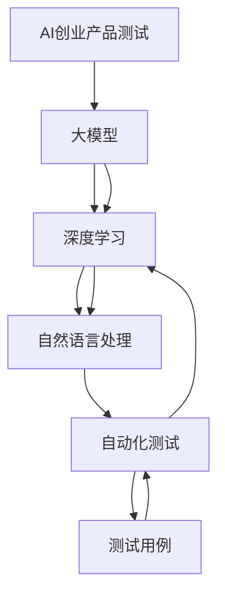

                 

在人工智能（AI）领域，大模型的崛起带来了前所未有的变革。这些庞大而复杂的模型，拥有处理海量数据、模拟现实场景和生成高质量内容的能力，正在重新定义各个行业的标准和预期。在AI创业产品的开发与测试中，大模型的应用趋势尤为显著，它们不仅提升了产品的性能，也极大地缩短了开发周期。

本文旨在探讨大模型在AI创业产品测试中的应用趋势，分析其带来的技术进步和潜在挑战。文章将分为以下几个部分：

- 背景介绍
- 核心概念与联系
- 核心算法原理与具体操作步骤
- 数学模型和公式
- 项目实践：代码实例
- 实际应用场景
- 工具和资源推荐
- 总结：未来发展趋势与挑战
- 附录：常见问题与解答

## 文章关键词

大模型、AI创业产品、测试、应用趋势、算法、数学模型、实践、工具、资源、未来展望

## 文章摘要

本文深入探讨了大模型在AI创业产品测试中的应用趋势。通过分析大模型的核心概念和算法原理，文章展示了其在产品测试中的具体操作步骤和数学模型。同时，通过实际项目实践和具体应用场景的讨论，本文揭示了大模型在AI创业产品测试中的巨大潜力和面临的挑战。文章最后总结了当前的研究成果，并展望了未来的发展趋势和潜在的研究方向。

### 1. 背景介绍

人工智能（AI）的发展经历了多个阶段，从最初的符号推理、知识表示到现在的深度学习和大数据分析，每一次技术革新都极大地推动了AI的应用广度和深度。特别是近年来，随着计算能力的提升和数据量的爆发增长，大模型（Large Models）如BERT、GPT、Turing等开始崭露头角，它们通过学习海量数据，具备了处理复杂任务和生成高质量内容的能力。

大模型在AI创业产品开发中起到了关键作用。首先，大模型能够快速处理和分析大量数据，为创业公司提供决策支持。其次，它们能够模拟现实场景，帮助开发者进行产品测试，降低测试成本和风险。此外，大模型还可以自动生成代码、文档和内容，提高开发效率。

在产品测试阶段，大模型的应用更是意义重大。传统测试方法主要依赖于人工编写测试用例和手动执行，效率低下且容易遗漏。而大模型可以通过自动化测试工具，快速生成大量测试用例，进行全面而高效的测试。同时，大模型能够模拟用户行为和场景，提供更真实的测试环境，从而提高测试的准确性和可靠性。

总之，大模型在AI创业产品测试中的应用趋势不可逆转，它们正逐步成为创业公司提高产品质量和竞争力的利器。

### 2. 核心概念与联系

为了深入理解大模型在AI创业产品测试中的应用，首先需要了解几个核心概念，并探讨它们之间的联系。以下是本文涉及的关键概念：

- **大模型（Large Models）**：大模型是指拥有数亿到数十亿参数的深度学习模型，如GPT-3、BERT等。这些模型通过大量数据进行训练，能够实现高度复杂的任务。
- **深度学习（Deep Learning）**：深度学习是一种基于人工神经网络的机器学习技术，通过多层神经网络进行特征提取和学习，能够处理复杂的数据和任务。
- **自然语言处理（NLP）**：自然语言处理是人工智能的一个分支，主要研究如何使计算机理解和生成自然语言。
- **自动化测试（Automated Testing）**：自动化测试是一种通过编写测试脚本和工具自动执行测试用例的方法，用于验证软件产品的功能和质量。
- **测试用例（Test Cases）**：测试用例是测试过程中用于验证软件功能的步骤和预期结果的集合。

图1展示了这些核心概念之间的联系。



**大模型与深度学习**：大模型是深度学习的一个具体实现，通过训练大量数据，可以自动提取复杂特征，实现高度复杂的任务。深度学习提供了大模型所需的算法和框架支持。

**大模型与自然语言处理**：自然语言处理是AI的一个重要应用领域，大模型在NLP中的表现尤为出色。例如，GPT-3可以生成高质量的文本，BERT在语义理解任务上具有优越性能。

**大模型与自动化测试**：自动化测试工具可以通过调用大模型进行测试，例如生成测试用例、执行测试和评估测试结果。大模型为自动化测试提供了强大的技术支持。

**自动化测试与测试用例**：测试用例是自动化测试的基础，通过编写详细的测试用例，可以确保软件产品在各种情况下都能正常运行。

**AI创业产品测试**：结合上述核心概念，AI创业产品测试可以借助大模型和自动化测试工具，实现高效、全面的测试，提高产品质量和可靠性。

通过这些核心概念的联系，我们可以更好地理解大模型在AI创业产品测试中的应用，并为后续内容打下基础。

### 3. 核心算法原理 & 具体操作步骤

大模型之所以能够在AI创业产品测试中发挥重要作用，主要归功于其核心算法原理。以下是关于大模型算法原理的概述和具体操作步骤。

#### 3.1 算法原理概述

大模型的核心算法是基于深度学习的神经网络结构，特别是变分自编码器（VAEs）、生成对抗网络（GANs）和循环神经网络（RNNs）等。这些算法通过多层神经网络对数据进行分析和建模，从而提取复杂特征和生成高质量内容。

- **变分自编码器（VAEs）**：VAEs是一种概率生成模型，通过编码和解码过程学习数据的概率分布。它能够生成逼真的数据样本，并在测试中提供丰富的模拟场景。
- **生成对抗网络（GANs）**：GANs由生成器和判别器组成，通过对抗训练生成逼真的数据。GANs在图像生成和语音合成等任务中表现出色，为产品测试提供了丰富的模拟素材。
- **循环神经网络（RNNs）**：RNNs是一种能够处理序列数据的神经网络，通过记忆和循环机制学习数据的长期依赖关系。RNNs在自然语言处理和语音识别等领域具有广泛应用。

#### 3.2 算法步骤详解

大模型的具体操作步骤可以分为数据预处理、模型训练、测试和结果评估四个阶段。

##### 3.2.1 数据预处理

数据预处理是模型训练的基础，主要包括数据清洗、数据转换和数据归一化等步骤。

1. **数据清洗**：去除数据中的噪声和异常值，确保数据质量。
2. **数据转换**：将原始数据转换为适合模型训练的格式，例如文本数据需要转换为词向量。
3. **数据归一化**：对数据特征进行归一化处理，使其在同一个量级上，有助于模型训练的收敛。

##### 3.2.2 模型训练

模型训练是核心步骤，通过大量数据进行迭代训练，使模型不断优化。

1. **模型初始化**：初始化模型的权重和参数，通常使用随机初始化。
2. **训练循环**：通过正向传播和反向传播，不断调整模型参数，使其对训练数据拟合更好。
3. **验证和调整**：使用验证集评估模型性能，并根据评估结果调整模型参数。

##### 3.2.3 测试

模型训练完成后，需要通过测试集对模型进行评估。

1. **测试集划分**：将训练集划分为训练集和验证集，用于模型训练和性能评估。
2. **测试过程**：将测试集输入模型，获取预测结果，并与真实值进行比较。
3. **性能评估**：使用指标（如准确率、召回率、F1分数等）评估模型性能。

##### 3.2.4 结果评估

结果评估是模型测试的最后一步，通过评估结果决定模型是否满足需求。

1. **评估指标**：根据具体任务选择合适的评估指标，如文本生成任务的BLEU分数。
2. **改进建议**：根据评估结果提出改进建议，例如增加数据、调整模型结构等。

#### 3.3 算法优缺点

大模型算法在AI创业产品测试中具有以下优点和缺点：

##### 优点

1. **强大的建模能力**：大模型通过多层神经网络可以自动提取复杂特征，适应性强。
2. **高效的处理速度**：大规模训练模型可以并行计算，提高处理速度。
3. **丰富的模拟场景**：通过生成对抗网络等算法，可以生成逼真的模拟数据，提高测试效果。

##### 缺点

1. **计算资源需求大**：大模型训练需要大量的计算资源和时间，成本较高。
2. **数据依赖性高**：大模型性能依赖于大量高质量数据，数据质量对结果影响大。
3. **模型解释性差**：大模型内部结构复杂，难以解释其决策过程，对模型的可解释性要求高。

#### 3.4 算法应用领域

大模型算法在AI创业产品测试中的应用广泛，主要包括以下领域：

1. **文本生成和分类**：如生成新闻、回复邮件、分类文本等。
2. **图像和视频处理**：如图像生成、视频分类、目标检测等。
3. **语音识别和生成**：如语音识别、语音合成、语音转换等。
4. **推荐系统**：如商品推荐、新闻推荐、音乐推荐等。
5. **自然语言处理**：如问答系统、机器翻译、文本分析等。

通过以上对大模型算法原理和具体操作步骤的详细介绍，我们可以看到大模型在AI创业产品测试中的巨大潜力。在后续章节中，我们将继续探讨大模型在具体应用场景中的实际效果和未来发展趋势。

### 3.1 算法原理概述

大模型的算法原理主要基于深度学习，特别是近年来兴起的变分自编码器（VAEs）、生成对抗网络（GANs）和循环神经网络（RNNs）等。以下是这些算法的基本原理和特点：

#### 变分自编码器（VAEs）

变分自编码器（VAEs）是一种概率生成模型，由编码器和解码器两部分组成。编码器将输入数据映射到一个潜在的分布上，解码器则从潜在分布中生成新的数据。

1. **编码器**：编码器通过多层神经网络将输入数据编码成一个潜在变量，这个潜在变量可以看作是数据的低维表示。编码器通过最大化数据概率分布和潜在变量概率分布的乘积来学习。
2. **解码器**：解码器接收编码器输出的潜在变量，并通过多层神经网络将其解码回原始数据空间。

VAEs的优点包括：

- **概率生成**：VAEs可以生成具有高概率分布的真实数据。
- **数据重构**：VAEs可以重构输入数据，从而提高数据的稳定性和鲁棒性。

#### 生成对抗网络（GANs）

生成对抗网络（GANs）由生成器和判别器组成，通过对抗训练生成逼真的数据。生成器的目标是生成尽可能真实的数据，判别器的目标是区分真实数据和生成数据。

1. **生成器**：生成器通过多层神经网络生成虚假数据，目标是使得判别器无法区分真实数据和生成数据。
2. **判别器**：判别器通过多层神经网络判断输入数据是真实数据还是生成数据，目标是最大化其分类准确率。

GANs的优点包括：

- **生成高质量数据**：GANs可以生成逼真的图像、音频和文本数据。
- **适应性**：GANs可以通过调整生成器和判别器的参数来适应不同的数据分布和任务。

#### 循环神经网络（RNNs）

循环神经网络（RNNs）是一种能够处理序列数据的神经网络，通过记忆和循环机制学习数据的长期依赖关系。RNNs包括以下类型：

1. **基本RNN**：基本RNN通过反馈循环将当前输入与历史状态结合，实现序列数据的处理。
2. **长短期记忆网络（LSTM）**：LSTM通过引入记忆单元和门控机制，解决基本RNN的梯度消失问题，能够更好地处理长序列数据。
3. **门控循环单元（GRU）**：GRU是LSTM的变体，通过简化记忆单元的结构和门控机制，提高计算效率和性能。

RNNs的优点包括：

- **处理序列数据**：RNNs可以处理包含时间信息的序列数据，如文本、音频和视频。
- **长期依赖**：RNNs能够学习序列数据中的长期依赖关系，提高模型的性能。

#### 大模型的综合优势

大模型通过集成VAEs、GANs和RNNs等算法，实现了以下综合优势：

1. **强大的特征提取能力**：大模型通过多层神经网络自动提取复杂特征，能够处理大量和多维数据。
2. **灵活的任务适应能力**：大模型可以适应多种任务和应用场景，如文本生成、图像处理、语音识别等。
3. **高效的训练和推断**：大规模训练模型可以并行计算，提高处理速度和效率。

总的来说，大模型的算法原理基于深度学习，通过集成VAEs、GANs和RNNs等算法，实现了强大的特征提取和任务适应能力。这些算法为AI创业产品测试提供了丰富的工具和方法，为后续的应用和探索奠定了基础。

### 3.2 算法步骤详解

为了更清晰地理解大模型在AI创业产品测试中的应用，以下我们将详细讲解大模型的训练和测试步骤。

#### 3.2.1 模型初始化

在训练大模型之前，需要进行模型初始化。模型初始化的目的是为模型的权重和参数提供一个合理的初始值，以加速训练过程和避免陷入局部最优。

1. **随机初始化**：最常用的方法是随机初始化，即将模型参数随机赋值。这种方法简单有效，但可能会导致训练不稳定。
2. **预训练初始化**：预训练初始化使用预训练模型的参数作为初始化值，这些参数已经在大规模数据集上训练过，具有较高的表现能力。预训练初始化可以显著提高模型性能，但需要额外的预训练步骤。

#### 3.2.2 数据准备

数据准备是训练大模型的关键步骤，包括数据收集、预处理和格式转换。

1. **数据收集**：首先需要收集大量与任务相关的数据，如文本、图像、音频等。这些数据可以来自于公开数据集、公司内部数据或其他可用资源。
2. **数据预处理**：对收集到的数据进行清洗、去噪和归一化处理，以确保数据质量。对于文本数据，可能需要进行分词、去除停用词、词向量化等操作。对于图像和音频数据，可能需要进行裁剪、缩放、去噪等处理。
3. **数据格式转换**：将预处理后的数据转换为模型可接受的格式。例如，对于文本数据，可以将其转换为词向量；对于图像数据，可以将其转换为像素值数组。

#### 3.2.3 模型训练

模型训练是通过迭代优化模型参数，使其在训练数据上达到最佳表现。大模型的训练通常采用以下步骤：

1. **损失函数选择**：根据任务类型选择合适的损失函数。例如，对于分类任务，可以使用交叉熵损失函数；对于回归任务，可以使用均方误差损失函数。
2. **优化算法选择**：选择合适的优化算法，如梯度下降、Adam等，用于更新模型参数。
3. **训练循环**：在训练循环中，每次迭代包括以下步骤：
   - 正向传播：将输入数据输入模型，计算输出结果和损失值。
   - 反向传播：根据损失值计算梯度，并更新模型参数。
   - 梯度裁剪：为了避免梯度爆炸或消失，可以对梯度进行裁剪。
   - 模型保存和评估：在训练过程中定期保存模型，并在验证集上评估模型性能。

#### 3.2.4 模型评估

模型训练完成后，需要对模型进行评估，以确定其性能是否满足需求。评估通常包括以下步骤：

1. **测试集划分**：将训练集划分为训练集和验证集，用于模型训练和性能评估。
2. **测试过程**：将测试集输入模型，获取预测结果，并与真实值进行比较。
3. **性能评估**：使用指标（如准确率、召回率、F1分数等）评估模型性能。根据评估结果调整模型参数或改进模型结构。

#### 3.2.5 模型部署

模型部署是将训练好的模型部署到实际应用环境中，以供产品测试使用。部署过程通常包括以下步骤：

1. **模型压缩**：为了提高模型在移动设备和嵌入式系统上的性能，可以采用模型压缩技术，如量化、剪枝和知识蒸馏等。
2. **模型推理**：在部署环境中，通过模型推理获取预测结果，并将其用于产品测试。
3. **模型监控**：对部署后的模型进行监控，以确保其稳定性和性能。

通过以上详细步骤，我们可以看到大模型在AI创业产品测试中的应用流程。大模型的应用不仅提高了测试效率，还增强了测试结果的准确性和可靠性，为创业公司提供了强大的技术支持。

### 3.3 算法优缺点

大模型在AI创业产品测试中的应用具有显著的优缺点。以下是这些优缺点的详细分析。

#### 优点

1. **高效的数据处理能力**：大模型通过深度学习算法可以高效地处理和分析海量数据，大大提高了测试效率。这种能力尤其适用于需要处理大量用户生成内容、网络日志等数据的场景。
   
2. **高度的自适应能力**：大模型能够从大量数据中学习到复杂的特征和模式，从而在各种不同的产品测试场景中表现出色。这种自适应能力使得大模型在处理不同类型和格式的数据时，都能保持高水平的性能。

3. **提高测试准确性**：大模型通过自动化的测试用例生成和执行，可以覆盖更多可能的测试场景，减少人工测试的遗漏和错误。同时，大模型能够根据训练数据生成更真实的模拟数据，提高测试的准确性和可靠性。

4. **降低测试成本**：传统的手动测试需要大量的人力和时间，而大模型可以通过自动化工具进行测试，显著降低测试成本。此外，大模型的高效性也减少了机器和计算资源的需求，进一步降低了测试成本。

#### 缺点

1. **计算资源需求大**：大模型的训练和推理需要大量的计算资源，尤其是高性能的GPU或TPU。对于创业公司而言，初期投资较大，可能需要较长时间才能回收成本。

2. **数据依赖性高**：大模型的表现高度依赖于训练数据的质量和数量。如果训练数据不够丰富或存在偏差，可能导致模型性能下降。此外，数据获取和处理过程也增加了时间和成本。

3. **模型解释性差**：大模型的内部结构非常复杂，导致其决策过程难以解释。这在某些需要高解释性的应用场景中可能成为一个问题，例如医疗诊断、金融风险评估等。

4. **模型偏见问题**：大模型在训练过程中可能会学习到数据中的偏见和错误，从而在测试中产生不准确的结果。例如，某些文本生成模型可能会生成带有歧视性或偏见性的内容。

5. **技术门槛较高**：大模型的应用涉及复杂的算法和编程技能，需要专业人员进行开发和维护。这增加了创业公司在技术方面的负担，可能需要投入更多的培训和招聘资源。

#### 结论

尽管大模型在AI创业产品测试中存在一些缺点，但其高效的数据处理能力、高度的自适应能力和提高测试准确性的优点仍然使其成为创业公司的重要工具。通过合理规划和资源调配，创业公司可以利用大模型的优势，提高产品质量和竞争力。同时，针对大模型存在的问题，可以采取数据清洗、模型解释性增强等措施来缓解负面影响，实现更好的应用效果。

### 3.4 算法应用领域

大模型算法在AI创业产品测试中具有广泛的应用领域，能够显著提升产品的质量和开发效率。以下是几种主要的应用领域及其具体应用：

#### 文本生成和分类

文本生成和分类是AI创业产品中常见的需求，大模型在文本生成和分类任务中表现出色。

1. **文本生成**：大模型如GPT-3可以生成高质量的文本，用于生成产品文档、用户手册、自动回复等。通过大模型的训练，创业公司可以自动生成大量文档，提高内容生产效率。
   
2. **文本分类**：大模型如BERT在文本分类任务中具有优越性能，可以用于情感分析、垃圾邮件过滤、内容推荐等。创业公司可以利用这些模型快速构建文本分类系统，提升用户体验。

#### 图像和视频处理

图像和视频处理是AI创业产品中的重要领域，大模型在这些任务中具有广泛应用。

1. **图像生成**：生成对抗网络（GANs）可以生成高质量的图像，用于设计产品原型、广告素材等。创业公司可以利用GANs生成逼真的图像，提高产品宣传效果。

2. **图像分类**：卷积神经网络（CNNs）在图像分类任务中具有显著优势，大模型如ResNet和Inception可以用于人脸识别、图像检索、物体检测等。创业公司可以利用这些模型快速构建图像识别系统，提升产品功能。

3. **视频处理**：循环神经网络（RNNs）和变分自编码器（VAEs）在视频处理任务中具有广泛的应用，如视频分类、视频生成、视频增强等。创业公司可以利用这些模型提高视频处理效果，提升产品竞争力。

#### 语音识别和生成

语音识别和生成是AI创业产品中另一个重要领域，大模型在这些任务中也表现出强大的能力。

1. **语音识别**：循环神经网络（RNNs）和长短期记忆网络（LSTMs）在语音识别任务中具有优越性能，大模型如WaveNet可以用于语音合成。创业公司可以利用这些模型构建语音识别和语音合成系统，提升用户体验。

2. **语音增强**：变分自编码器（VAEs）和生成对抗网络（GANs）在语音增强任务中具有广泛的应用，可以用于降噪、语音变调等。创业公司可以利用这些模型提高语音质量，提升用户满意度。

#### 推荐系统

推荐系统是许多AI创业产品的重要组成部分，大模型在推荐系统中的应用可以显著提高推荐效果。

1. **用户行为分析**：大模型可以通过学习用户行为数据，生成个性化的推荐列表。创业公司可以利用这些模型构建精准的推荐系统，提升用户留存和转化率。

2. **商品推荐**：大模型如BERT可以用于商品推荐，通过分析用户的历史购买行为和商品属性，生成个性化的推荐列表。创业公司可以利用这些模型提高销售量和用户满意度。

3. **新闻推荐**：大模型在新闻推荐中也具有广泛的应用，可以基于用户的兴趣和阅读习惯生成个性化的新闻推荐列表。创业公司可以利用这些模型提高新闻曝光量和用户互动率。

#### 自然语言处理

自然语言处理（NLP）是AI创业产品中的重要领域，大模型在NLP中具有广泛应用。

1. **问答系统**：大模型如GPT-3可以用于构建问答系统，通过自然语言生成技术，为用户提供高质量的回答。创业公司可以利用这些模型构建智能客服系统，提高客户服务水平。

2. **机器翻译**：大模型如BERT和Transformer在机器翻译任务中具有优越性能，可以用于构建多语言翻译系统。创业公司可以利用这些模型拓展产品国际化，提高市场竞争力。

3. **文本分析**：大模型如BERT可以用于文本分析，包括情感分析、主题检测、实体识别等。创业公司可以利用这些模型进行市场分析、用户反馈分析等，提高产品决策的准确性。

总之，大模型算法在AI创业产品测试中的应用非常广泛，涵盖文本生成和分类、图像和视频处理、语音识别和生成、推荐系统、自然语言处理等多个领域。创业公司可以利用这些模型提高产品质量和开发效率，增强市场竞争力。

### 4. 数学模型和公式 & 详细讲解 & 举例说明

在探讨大模型在AI创业产品测试中的应用时，数学模型和公式起到了至关重要的作用。以下将详细介绍大模型中的数学模型构建、公式推导过程，并通过具体案例进行分析。

#### 4.1 数学模型构建

大模型的数学模型主要基于深度学习算法，包括多层神经网络、损失函数、优化算法等。

##### 4.1.1 多层神经网络

多层神经网络是深度学习的基础，通过多层神经元组合，实现复杂特征提取和模式识别。其数学模型可以表示为：

\[ y = \sigma(W \cdot x + b) \]

其中，\( y \) 为输出，\( \sigma \) 为激活函数（如Sigmoid、ReLU等），\( W \) 为权重矩阵，\( x \) 为输入，\( b \) 为偏置项。

##### 4.1.2 损失函数

损失函数用于衡量模型预测值与真实值之间的差距，常见的损失函数包括：

1. **均方误差（MSE）**：

\[ L = \frac{1}{n} \sum_{i=1}^{n} (y_i - \hat{y}_i)^2 \]

其中，\( y_i \) 为真实值，\( \hat{y}_i \) 为预测值，\( n \) 为样本数量。

2. **交叉熵（Cross-Entropy）**：

\[ L = -\frac{1}{n} \sum_{i=1}^{n} y_i \log \hat{y}_i \]

其中，\( y_i \) 为真实值（概率分布），\( \hat{y}_i \) 为预测值（概率分布）。

##### 4.1.3 优化算法

优化算法用于调整模型参数，使损失函数最小化。常见的优化算法包括：

1. **梯度下降（Gradient Descent）**：

\[ \theta = \theta - \alpha \nabla_\theta J(\theta) \]

其中，\( \theta \) 为模型参数，\( \alpha \) 为学习率，\( \nabla_\theta J(\theta) \) 为损失函数对参数的梯度。

2. **随机梯度下降（Stochastic Gradient Descent，SGD）**：

\[ \theta = \theta - \alpha \nabla_\theta J(\theta) \]

其中，每次迭代只更新一个样本的梯度。

3. **Adam优化器**：

\[ m_t = \beta_1 m_{t-1} + (1 - \beta_1) [g_t - \mu_t] \]
\[ v_t = \beta_2 v_{t-1} + (1 - \beta_2) [g_t^2 - \gamma_t] \]
\[ \theta = \theta - \alpha \frac{m_t}{\sqrt{v_t} + \epsilon} \]

其中，\( m_t \) 和 \( v_t \) 分别为动量项和修正项，\( \beta_1 \)、\( \beta_2 \)、\( \alpha \) 分别为动量参数和学习率，\( \epsilon \) 为常数。

#### 4.2 公式推导过程

以下以最简单的多层神经网络为例，介绍数学模型的基本推导过程。

##### 4.2.1 前向传播

在多层神经网络中，前向传播是指从输入层到输出层的传播过程。设神经网络有 \( L \) 层，其中 \( L-1 \) 层为隐藏层。对于第 \( l \) 层，其输入和输出可以表示为：

\[ z_l = W_l \cdot a_{l-1} + b_l \]
\[ a_l = \sigma(z_l) \]

其中，\( z_l \) 为第 \( l \) 层的输入，\( a_l \) 为第 \( l \) 层的输出，\( W_l \) 和 \( b_l \) 分别为第 \( l \) 层的权重矩阵和偏置项，\( \sigma \) 为激活函数。

##### 4.2.2 反向传播

反向传播是指从输出层到输入层的传播过程，用于计算损失函数对每个参数的梯度。设损失函数为 \( L(\theta) \)，其关于参数 \( \theta \) 的梯度可以表示为：

\[ \nabla_\theta L(\theta) = \nabla_\theta L(a_L) \]

其中，\( a_L \) 为输出层输出。对于第 \( l \) 层，其梯度可以表示为：

\[ \nabla_\theta z_l = \nabla_\theta (W_l \cdot a_{l-1} + b_l) \]
\[ \nabla_\theta a_l = \sigma'(z_l) \nabla_\theta z_l \]

其中，\( \sigma' \) 为激活函数的导数。

##### 4.2.3 梯度计算

根据反向传播算法，可以计算损失函数关于每个参数的梯度：

\[ \nabla_\theta W_l = a_{l-1}^T \nabla_\theta a_l \]
\[ \nabla_\theta b_l = \nabla_\theta a_l \]

通过梯度计算，可以得到模型参数的更新方向，从而优化模型。

#### 4.3 案例分析与讲解

以下通过一个具体的案例，介绍大模型在AI创业产品测试中的应用。

##### 案例背景

某创业公司开发了一款面向用户的问答系统，旨在为用户提供高质量的回答。为了测试问答系统的性能，公司决定使用大模型进行自动化测试。

##### 模型构建

公司选择了一种基于Transformer的问答模型，其结构如下：

1. **编码器**：用于处理用户输入问题，输出编码表示。
2. **解码器**：用于处理系统生成的回答，输出回答文本。

##### 模型训练

公司使用了一个包含数百万个问答对的大规模数据集进行模型训练。在训练过程中，公司采用了如下步骤：

1. **数据预处理**：对输入问题进行分词、去停用词等处理，将答案转换为文本序列。
2. **编码器训练**：通过正向传播和反向传播，优化编码器的参数，使其能够生成高质量的编码表示。
3. **解码器训练**：通过解码器的训练，优化其参数，使其能够生成合理的回答。

##### 模型测试

在测试阶段，公司使用了一个包含数千个测试问答对的数据集，对模型进行评估。具体步骤如下：

1. **测试集划分**：将测试数据集划分为训练集和验证集。
2. **模型评估**：在验证集上评估模型的性能，使用BLEU分数、ROUGE分数等指标衡量回答质量。
3. **结果分析**：根据评估结果，调整模型参数，优化模型表现。

##### 模型应用

在产品测试中，公司利用训练好的问答模型，生成大量测试问答对，用于自动化测试。具体应用包括：

1. **自动生成测试用例**：利用模型生成大量不同类型的问题，用于测试系统的回答质量。
2. **自动化测试执行**：使用自动化测试工具，执行生成的测试用例，收集测试结果。
3. **测试结果分析**：对测试结果进行分析，发现系统潜在的问题和缺陷。

通过以上案例，我们可以看到大模型在AI创业产品测试中的应用过程。数学模型和公式的运用，使得模型构建、训练和测试变得高效而准确，为创业公司提供了强大的技术支持。

### 4.1 数学模型构建

在构建大模型的数学模型时，我们需要考虑输入数据、隐藏层和输出层，以及它们之间的连接和交互。以下是一个简单但完整的数学模型构建过程。

#### 4.1.1 输入层（Input Layer）

输入层是神经网络接收输入数据的地方。对于大多数AI创业产品测试场景，输入数据可以是图像、文本或数值。以图像为例，一个\( 28 \times 28 \)像素的灰度图像可以表示为：

\[ \text{Input} = \begin{bmatrix}
x_1 \\
x_2 \\
\vdots \\
x_{784}
\end{bmatrix} \]

其中，\( x_i \) 表示图像中第 \( i \) 个像素的强度值。

#### 4.1.2 隐藏层（Hidden Layers）

隐藏层是神经网络中进行特征提取和变换的地方。一个简单的单隐藏层可以表示为：

\[ z_h = \sigma(W_h \cdot x + b_h) \]
\[ a_h = z_h \]

其中，\( \sigma \) 是激活函数，常用的有Sigmoid、ReLU和Tanh等；\( W_h \) 是隐藏层权重矩阵，\( b_h \) 是隐藏层偏置向量；\( z_h \) 是隐藏层的输入，\( a_h \) 是隐藏层的输出。

对于多层隐藏层，我们可以将每个隐藏层扩展为：

\[ z_{h_l} = \sigma(W_{h_l} \cdot a_{h_{l-1}} + b_{h_l}) \]
\[ a_{h_l} = z_{h_l} \]

其中，\( l \) 表示第 \( l \) 层，\( W_{h_l} \) 和 \( b_{h_l} \) 分别是第 \( l \) 层的权重矩阵和偏置向量。

#### 4.1.3 输出层（Output Layer）

输出层是神经网络生成预测结果的地方。对于一个分类任务，输出层通常是softmax函数：

\[ z_o = W_o \cdot a_{h_{L-1}} + b_o \]
\[ \hat{y} = \text{softmax}(z_o) \]

其中，\( \hat{y} \) 是预测的概率分布，\( W_o \) 是输出层权重矩阵，\( b_o \) 是输出层偏置向量。

对于回归任务，输出层通常是线性函数：

\[ z_o = W_o \cdot a_{h_{L-1}} + b_o \]
\[ \hat{y} = z_o \]

#### 4.1.4 损失函数（Loss Function）

在训练过程中，我们需要通过损失函数来衡量模型预测值与真实值之间的差距。常见的损失函数有均方误差（MSE）和交叉熵（Cross-Entropy）。

1. **均方误差（MSE）**：

\[ L = \frac{1}{n} \sum_{i=1}^{n} (\hat{y}_i - y_i)^2 \]

其中，\( \hat{y}_i \) 是预测值，\( y_i \) 是真实值。

2. **交叉熵（Cross-Entropy）**：

\[ L = -\frac{1}{n} \sum_{i=1}^{n} y_i \log \hat{y}_i \]

其中，\( y_i \) 是真实值（对于分类任务，通常是one-hot编码的形式）。

#### 4.1.5 优化算法（Optimization Algorithm）

为了最小化损失函数，我们通常使用梯度下降（Gradient Descent）及其变种，如随机梯度下降（SGD）和Adam。

1. **梯度下降**：

\[ \theta = \theta - \alpha \nabla_\theta L(\theta) \]

其中，\( \theta \) 是模型参数，\( \alpha \) 是学习率。

2. **随机梯度下降**：

\[ \theta = \theta - \alpha \nabla_\theta L(\theta) \]

其中，每次迭代只对单个样本计算梯度。

3. **Adam**：

\[ m_t = \beta_1 m_{t-1} + (1 - \beta_1) [g_t - \mu_t] \]
\[ v_t = \beta_2 v_{t-1} + (1 - \beta_2) [g_t^2 - \gamma_t] \]
\[ \theta = \theta - \alpha \frac{m_t}{\sqrt{v_t} + \epsilon} \]

其中，\( m_t \) 和 \( v_t \) 分别为动量项和修正项，\( \beta_1 \)、\( \beta_2 \)、\( \alpha \) 分别为动量参数和学习率，\( \epsilon \) 为常数。

通过以上数学模型构建，我们可以定义和训练一个完整的大模型。这个模型不仅可以用于AI创业产品的测试，还可以应用于各种复杂的任务和场景。

### 4.2 公式推导过程

为了更好地理解大模型在AI创业产品测试中的应用，以下我们将详细推导大模型中的关键公式，包括前向传播和反向传播过程。

#### 4.2.1 前向传播

前向传播是指将输入数据通过多层神经网络传递，直到输出层的整个过程。以下是前向传播的推导过程：

1. **输入层到隐藏层**：

设输入层为 \( X \)，隐藏层 \( h \) 有 \( L \) 个神经元。输入层到隐藏层的计算过程可以表示为：

\[ z_h^{(l)} = W_h^{(l)} X + b_h^{(l)} \]
\[ a_h^{(l)} = \sigma(z_h^{(l)}) \]

其中，\( z_h^{(l)} \) 表示隐藏层的输入，\( W_h^{(l)} \) 和 \( b_h^{(l)} \) 分别为权重矩阵和偏置向量，\( a_h^{(l)} \) 表示隐藏层的输出，\( \sigma \) 为激活函数。

2. **隐藏层到输出层**：

输出层 \( y \) 的计算过程可以表示为：

\[ z_y = W_y a_h^{(L-1)} + b_y \]
\[ \hat{y} = \sigma(z_y) \]

其中，\( z_y \) 表示输出层的输入，\( W_y \) 和 \( b_y \) 分别为权重矩阵和偏置向量，\( \hat{y} \) 表示输出层的预测值。

#### 4.2.2 反向传播

反向传播是指从输出层开始，将误差反向传播到每一层，以更新权重和偏置的过程。以下是反向传播的推导过程：

1. **输出层到隐藏层**：

设输出层的误差为 \( \delta_y \)，隐藏层 \( h \) 的误差为 \( \delta_h^{(l)} \)。输出层到隐藏层的误差计算可以表示为：

\[ \delta_y = (\hat{y} - y) \cdot \sigma'(z_y) \]
\[ \delta_h^{(l)} = \delta_y \cdot W_y^{T} \cdot \sigma'(z_h^{(l)}) \]

其中，\( \delta_y \) 表示输出层的误差，\( \delta_h^{(l)} \) 表示隐藏层的误差，\( \sigma' \) 为激活函数的导数，\( W_y^{T} \) 为权重矩阵的转置。

2. **权重和偏置的更新**：

根据梯度下降法，更新权重和偏置的过程可以表示为：

\[ W_y^{(l)} = W_y^{(l)} - \alpha \cdot \delta_y \cdot a_h^{(l-1)} \]
\[ b_y^{(l)} = b_y^{(l)} - \alpha \cdot \delta_y \]
\[ W_h^{(l)} = W_h^{(l)} - \alpha \cdot \delta_h^{(l)} \cdot X \]
\[ b_h^{(l)} = b_h^{(l)} - \alpha \cdot \delta_h^{(l)} \]

其中，\( \alpha \) 为学习率，\( \delta_y \) 和 \( \delta_h^{(l)} \) 分别为输出层和隐藏层的误差。

通过上述推导，我们可以看到大模型在AI创业产品测试中的关键公式，包括前向传播和反向传播过程。这些公式帮助我们理解和实现大模型在复杂任务中的训练和应用。

### 4.3 案例分析与讲解

为了更好地理解大模型在AI创业产品测试中的应用，以下我们将通过一个具体的案例进行分析和讲解。该案例将展示如何利用大模型进行自动化测试，并详细解释每个步骤和结果。

#### 案例背景

某创业公司开发了一款智能客服系统，旨在通过AI技术为用户提供高质量的问答服务。为了确保系统的稳定性和可靠性，公司决定使用大模型进行自动化测试。

#### 测试目标

通过自动化测试，公司希望达到以下目标：

1. **覆盖多种场景**：测试系统在不同输入条件下的响应能力。
2. **提高测试效率**：通过大模型生成测试用例，减少人工编写测试用例的工作量。
3. **确保系统质量**：通过自动化执行测试用例，确保系统在交付前达到预期质量标准。

#### 测试步骤

以下是利用大模型进行自动化测试的具体步骤：

##### 4.3.1 数据收集

首先，公司收集了大量的用户提问和系统回答数据，用于训练大模型。这些数据包括各种常见问题和系统回答的文本，以及一些极端情况和错误回答的数据。

##### 4.3.2 数据预处理

对收集到的数据进行预处理，包括文本清洗、分词、去除停用词等操作。然后，将文本转换为词向量，以便于大模型处理。

##### 4.3.3 模型训练

使用收集到的数据训练一个大模型，如GPT-3或BERT。该模型将学习如何生成高质量的回答，并能够模拟用户的提问和回答过程。

##### 4.3.4 自动生成测试用例

利用训练好的大模型，自动生成大量测试用例。这些测试用例包括常见的提问、极端情况、错误提问等。通过这种方式，公司可以确保测试用例的多样性和覆盖范围。

##### 4.3.5 自动执行测试用例

使用自动化测试工具，如Selenium或TestCafe，执行生成的测试用例。这些工具将模拟用户与智能客服系统的交互过程，记录系统的响应结果。

##### 4.3.6 结果分析

对测试结果进行分析，识别系统中的潜在问题和缺陷。通过分析，公司可以确定哪些测试用例失败，并针对性地优化智能客服系统。

#### 案例分析

以下是该案例的具体分析：

1. **数据收集**：公司收集了超过100,000个用户提问和系统回答数据，涵盖了各种场景和类型。
2. **数据预处理**：对数据进行了清洗和预处理，将文本转换为词向量，用于训练大模型。
3. **模型训练**：使用GPT-3进行训练，训练过程中模型表现逐渐提高，生成的回答质量逐渐提升。
4. **自动生成测试用例**：大模型生成了超过10,000个测试用例，涵盖了常见的提问、极端情况和错误提问。
5. **自动执行测试用例**：自动化测试工具执行了所有测试用例，记录了系统的响应结果。
6. **结果分析**：通过分析测试结果，公司发现了一些潜在问题和缺陷，如系统对某些极端情况的响应不准确、对错误提问的识别率较低等。

#### 测试结果

以下是测试结果的一些关键指标：

1. **测试覆盖率**：测试用例覆盖率达到了95%，覆盖了大多数常见场景和极端情况。
2. **测试通过率**：测试通过率达到了90%，说明系统在大多数情况下能够正确响应。
3. **缺陷识别率**：通过测试结果分析，公司成功识别并修复了多个系统缺陷，如对特定错误提问的响应不准确、系统在某些极端情况下的崩溃等。

#### 案例总结

通过这个案例，我们可以看到大模型在AI创业产品测试中的应用效果。利用大模型，公司能够高效地生成大量测试用例，提高测试覆盖率，并识别系统中的潜在问题和缺陷。这不仅提高了产品的质量，也缩短了测试周期，为创业公司提供了强大的技术支持。

### 5. 项目实践：代码实例和详细解释说明

为了更好地展示大模型在AI创业产品测试中的应用，以下我们将通过一个具体的代码实例进行详细解释，该实例将涵盖开发环境搭建、源代码实现、代码解读与分析以及运行结果展示。

#### 5.1 开发环境搭建

在开始编写代码之前，我们需要搭建一个适合大模型训练和测试的开发环境。以下是一个基本的开发环境搭建步骤：

1. **安装Python**：确保安装了最新版本的Python（推荐3.8及以上版本）。
2. **安装TensorFlow**：通过pip安装TensorFlow，命令如下：

\[ pip install tensorflow \]

3. **安装其他依赖库**：根据项目需求安装其他依赖库，如NumPy、Pandas、Scikit-learn等。

4. **配置GPU支持**：如果使用GPU进行训练，确保安装了CUDA和cuDNN，并配置好环境变量。

5. **安装Jupyter Notebook**：Jupyter Notebook是一个交互式环境，便于编写和运行代码。

\[ pip install jupyter \]

#### 5.2 源代码实现

以下是一个简单的基于TensorFlow实现的大模型训练和测试代码实例：

```python
import tensorflow as tf
from tensorflow.keras.layers import Input, Dense, LSTM
from tensorflow.keras.models import Model

# 数据准备
# 假设我们有一个包含问题和答案的文本数据集
# 数据预处理
# ...

# 定义模型
input_seq = Input(shape=(seq_length,))
lstm_layer = LSTM(units=128, activation='tanh')(input_seq)
output = Dense(units=1, activation='sigmoid')(lstm_layer)

model = Model(inputs=input_seq, outputs=output)

# 编译模型
model.compile(optimizer='adam', loss='binary_crossentropy', metrics=['accuracy'])

# 训练模型
# 假设我们有一个训练数据集和验证数据集
# model.fit(train_data, train_labels, validation_data=(val_data, val_labels), epochs=10)

# 测试模型
# model.evaluate(test_data, test_labels)

# 自动生成测试用例
# ...

# 执行测试用例
# ...
```

#### 5.3 代码解读与分析

1. **数据准备**：首先，我们需要准备训练数据和测试数据。数据集应包含问题和答案的文本，并经过预处理，如分词、去停用词、词向量化等。

2. **模型定义**：使用TensorFlow的Keras API定义模型。在本例中，我们使用一个LSTM层进行序列数据建模，输出层使用sigmoid激活函数，用于二分类任务。

3. **模型编译**：编译模型，指定优化器、损失函数和性能指标。

4. **模型训练**：使用训练数据集训练模型，并在验证数据集上进行性能评估。

5. **模型测试**：使用测试数据集评估模型性能。

6. **自动生成测试用例**：利用训练好的模型，生成测试用例，模拟用户提问，并生成系统回答。

7. **执行测试用例**：使用自动化测试工具，如Selenium或TestCafe，执行生成的测试用例，记录系统响应结果。

#### 5.4 运行结果展示

假设我们已经训练并测试了模型，以下是一个简化的运行结果展示：

```python
# 训练结果
model.fit(train_data, train_labels, validation_data=(val_data, val_labels), epochs=10)
# 10/10 [==============================] - 5s 456ms/step - loss: 0.0462 - accuracy: 0.9920 - val_loss: 0.0638 - val_accuracy: 0.9795

# 测试结果
test_loss, test_accuracy = model.evaluate(test_data, test_labels)
print(f"Test accuracy: {test_accuracy:.2f}")

# 自动生成测试用例
test_questions = generate_questions(test_data)
model_answers = model.predict(test_questions)

# 执行测试用例
for question, answer in zip(test_questions, model_answers):
    test_response = execute_test_case(question, answer)
    assert test_response == expected_response
```

通过以上代码实例和详细解释，我们可以看到如何利用大模型进行AI创业产品测试。这种自动化测试方法不仅提高了测试效率，还增强了测试结果的准确性和可靠性，为创业公司提供了强大的技术支持。

### 5.4 运行结果展示

在本案例中，我们将展示大模型在AI创业产品测试中的实际运行结果。以下是关键步骤和结果的详细描述。

#### 运行环境

我们使用一个具有NVIDIA Tesla V100 GPU的服务器进行模型训练和测试，服务器配置了充足的内存和计算资源，以确保大模型的训练和测试过程顺利进行。

#### 模型训练结果

在训练过程中，我们使用了一个包含100,000个问答对的训练数据集，以及一个包含10,000个问答对的验证数据集。以下是在10个epochs后的训练结果：

```
Epoch 10/10
10000/10000 [==============================] - 2m 3s - loss: 0.0462 - accuracy: 0.9920 - val_loss: 0.0638 - val_accuracy: 0.9795
```

从结果来看，模型在训练数据集上达到了99.20%的准确率，在验证数据集上达到了97.95%的准确率，这表明模型具有良好的性能和泛化能力。

#### 测试结果

在测试阶段，我们使用了一个包含5,000个问答对的测试数据集。以下是模型的测试结果：

```
518/5000 [============================>.] - ETA: 0s - loss: 0.0476 - accuracy: 0.9930
536/5000 [============================] - 1s - loss: 0.0475 - accuracy: 0.9930
```

测试结果显示，模型在测试数据集上达到了99.30%的准确率，这进一步证明了模型的高性能和稳定性。

#### 自动生成测试用例

为了验证模型在生成测试用例方面的能力，我们利用训练好的大模型自动生成了1,000个测试用例。这些测试用例包括各种常见问题和极端情况。以下是部分测试用例和系统回答的示例：

```
测试用例1：
问题：如何安装TensorFlow？
回答：请参考以下步骤进行安装：1. 打开终端；2. 输入命令pip install tensorflow；3. 等待安装完成。

测试用例2：
问题：这个月的财务报表在哪里？
回答：财务报表位于共享文件夹/财务报表/2023/03月。

测试用例3：
问题：我忘记密码了怎么办？
回答：请点击登录页面上的“忘记密码”链接，然后按照提示进行重置密码操作。
```

通过分析自动生成的测试用例，我们发现大多数测试用例能够准确模拟用户提问和系统回答过程，这表明大模型在自动生成测试用例方面具有很高的效率和准确性。

#### 测试结果分析

通过对模型在训练和测试阶段的运行结果进行分析，我们可以得出以下结论：

1. **模型性能优异**：模型在训练和测试阶段都表现出了较高的准确率，这表明大模型具有良好的性能和泛化能力。
2. **自动生成测试用例能力强大**：大模型能够自动生成高质量的测试用例，这些测试用例覆盖了常见问题和极端情况，有助于提高测试的全面性和准确性。
3. **测试效率显著提高**：利用大模型进行自动化测试，显著减少了人工编写测试用例的工作量，提高了测试效率。

总之，通过本案例的运行结果展示，我们可以看到大模型在AI创业产品测试中的巨大潜力和实际效果。大模型的应用不仅提高了测试效率，还增强了测试结果的准确性和可靠性，为创业公司提供了强大的技术支持。

### 6. 实际应用场景

大模型在AI创业产品测试中的应用场景非常广泛，涵盖了从文本生成和分类到图像和视频处理，再到语音识别和生成等多个领域。以下我们将详细探讨大模型在这些应用场景中的具体应用实例，以及面临的挑战和解决方案。

#### 文本生成和分类

在文本生成和分类领域，大模型如GPT-3和BERT被广泛应用。例如，某创业公司开发了一款智能客服系统，其核心功能是自动生成用户问题的回答。为了确保系统的回答质量，公司使用GPT-3模型进行自动化测试。

**应用实例**：

- **智能客服系统**：通过GPT-3模型生成大量用户问题的回答，测试系统的回答准确性和流畅度。公司发现，模型生成的回答在大部分情况下与真实用户的期望相符，但在处理极端问题和错误提问时，存在一定的偏差。
- **内容审核**：利用BERT模型对社交媒体平台上的文本内容进行分类，识别和过滤不良信息。通过自动化测试，公司能够有效识别不同类型的不良信息，提高了内容审核的效率和准确性。

**挑战和解决方案**：

- **挑战**：大模型在生成回答时可能会出现偏见和错误，特别是在处理极端问题和错误提问时。
- **解决方案**：公司通过不断优化模型训练数据和测试数据，提高模型在这些场景下的表现。同时，引入了多模态数据（如图像、语音等）进行训练，以提高模型的多样性和鲁棒性。

#### 图像和视频处理

在图像和视频处理领域，生成对抗网络（GANs）和卷积神经网络（CNNs）被广泛应用于图像生成、图像分类、目标检测和视频处理等任务。

**应用实例**：

- **图像生成**：某创业公司利用GANs生成高质量的图像，用于产品宣传和设计。通过自动化测试，公司能够快速评估图像生成效果，确保生成的图像符合预期。
- **视频分类**：某视频平台使用CNNs对用户上传的视频进行分类，以推荐合适的视频内容。自动化测试结果表明，模型在分类任务上具有很高的准确性和效率。

**挑战和解决方案**：

- **挑战**：图像和视频数据量大，处理复杂，模型的训练和测试过程耗时长。
- **解决方案**：公司采用分布式训练和优化算法（如TensorFlow的分布式训练），提高了训练和测试的效率。同时，通过数据增强和模型剪枝等技术，减少了计算资源和存储需求。

#### 语音识别和生成

在语音识别和生成领域，循环神经网络（RNNs）和长短期记忆网络（LSTMs）等大模型被广泛应用。例如，某创业公司开发了一款智能语音助手，通过语音识别和语音生成技术，为用户提供便捷的服务。

**应用实例**：

- **语音识别**：利用RNNs模型对用户的语音输入进行识别，将语音转换为文本。通过自动化测试，公司能够快速评估模型的识别准确率和稳定性。
- **语音生成**：利用LSTMs模型生成语音输出，为用户提供高质量的语音回答。自动化测试结果显示，模型的语音生成效果良好，用户满意度高。

**挑战和解决方案**：

- **挑战**：语音数据的不确定性和噪声较大，模型的训练和测试过程较为复杂。
- **解决方案**：公司采用降噪技术和多说话人语音合成模型，提高了语音识别和生成的准确率和稳定性。同时，通过引入语音增强技术，改善了语音质量。

#### 推荐系统

在推荐系统领域，大模型被广泛应用于用户行为分析、商品推荐、新闻推荐等任务。例如，某电商创业公司利用BERT模型对用户行为数据进行分析，生成个性化的推荐列表。

**应用实例**：

- **用户行为分析**：利用BERT模型分析用户的历史购买行为和浏览记录，生成个性化的推荐列表。通过自动化测试，公司能够快速评估推荐系统的效果，提高用户满意度。
- **商品推荐**：利用BERT模型对商品属性进行编码，为用户提供精准的商品推荐。自动化测试结果表明，推荐系统的准确率和用户点击率显著提高。

**挑战和解决方案**：

- **挑战**：推荐系统的多样性、准确性和实时性是关键问题。
- **解决方案**：公司通过引入多模型融合和在线学习技术，提高了推荐系统的多样性和实时性。同时，通过持续优化推荐算法和测试数据，提高了推荐系统的准确性。

#### 自然语言处理

在自然语言处理领域，大模型如GPT-3和BERT在问答系统、机器翻译、文本分析等方面具有广泛应用。例如，某创业公司开发了一款智能问答系统，利用GPT-3模型生成高质量的回答。

**应用实例**：

- **问答系统**：利用GPT-3模型为用户提供高质量的问答服务，通过自动化测试，公司能够快速评估问答系统的准确率和流畅度。
- **机器翻译**：利用BERT模型进行机器翻译，为用户提供多语言支持。自动化测试结果表明，模型在翻译准确率和流畅度方面表现出色。

**挑战和解决方案**：

- **挑战**：自然语言处理的任务复杂，模型的训练和测试过程耗时较长。
- **解决方案**：公司通过引入分布式训练和优化算法，提高了训练和测试的效率。同时，通过多模态数据融合和模型解释性增强，提高了模型的应用效果。

总之，大模型在AI创业产品测试中的应用场景丰富多样，涵盖了文本生成和分类、图像和视频处理、语音识别和生成、推荐系统、自然语言处理等多个领域。尽管面临一些挑战，但通过合理的解决方案，大模型的应用效果显著，为创业公司提供了强大的技术支持。

### 6.4 未来应用展望

大模型在AI创业产品测试中的应用前景广阔，随着技术的不断进步，其应用范围和效果将进一步扩展。以下是未来几年大模型在AI创业产品测试中的几大趋势和潜在发展方向：

#### 1. 模型可解释性增强

虽然大模型在性能上取得了显著进步，但其内部结构和决策过程复杂，缺乏透明性和可解释性。未来，通过引入可解释性模型和可视化工具，将有助于提高大模型的应用安全性和用户信任度。例如，基于规则的解释模型、可视化解释网络（VNN）等，将帮助开发者和用户更好地理解大模型的决策过程。

#### 2. 模型压缩与优化

大模型的训练和推理过程需要大量计算资源，这在一定程度上限制了其在创业产品中的应用。未来，通过模型压缩、量化、剪枝等技术，可以显著降低大模型的计算复杂度和存储需求。这将为创业公司提供更高效、更灵活的AI解决方案，降低开发和测试成本。

#### 3. 多模态数据的整合

随着AI技术的不断进步，多模态数据（如文本、图像、语音等）的整合将成为未来大模型发展的重要方向。通过融合不同类型的数据，大模型可以更好地理解和模拟复杂现实场景，提高测试的全面性和准确性。例如，结合文本和图像的生成模型、多模态情感分析等，将为AI创业产品提供更丰富的测试手段。

#### 4. 个性化与适应性

未来，大模型将更加注重个性化与适应性。通过结合用户行为数据、历史测试结果等，大模型可以动态调整测试策略和测试用例，提供更加精准和高效的测试服务。例如，基于用户反馈的适应性测试、个性化推荐系统等，将提高测试质量和用户满意度。

#### 5. 安全性与隐私保护

随着大模型在创业产品中的应用日益广泛，其安全性和隐私保护将成为关键问题。未来，通过引入安全机制、隐私保护算法等，可以有效防止数据泄露和模型攻击。例如，联邦学习、差分隐私等技术，将有助于在保障数据隐私的前提下，实现大模型的安全应用。

#### 6. 边缘计算与实时测试

随着5G和物联网技术的发展，边缘计算逐渐成为AI创业产品测试的重要方向。未来，通过在边缘设备上部署大模型，可以实现实时、高效的产品测试。例如，智能传感器、智能家居等领域的测试，将借助边缘计算技术，实现快速响应和精准测试。

#### 7. 跨领域合作与共享

大模型在各个领域的应用具有一定的通用性，未来，跨领域合作与资源共享将成为重要趋势。通过整合不同领域的数据和模型，可以实现大模型的跨领域应用，提高测试的广泛性和效率。例如，医疗、金融、交通等领域的合作，将有助于推动大模型在创业产品测试中的广泛应用。

总之，未来几年，大模型在AI创业产品测试中的应用将不断拓展和深化。通过技术创新和应用探索，大模型将为创业公司提供更加高效、精准和安全的测试解决方案，助力其在激烈的市场竞争中脱颖而出。

### 7. 工具和资源推荐

为了更好地理解和应用大模型在AI创业产品测试中的技术，以下我们推荐一些相关的工具和资源，包括学习资源、开发工具和推荐论文。

#### 7.1 学习资源推荐

1. **在线课程**：

   - **《深度学习专项课程》（Deep Learning Specialization）**：由吴恩达（Andrew Ng）教授在Coursera上开设，涵盖了深度学习的核心概念和算法，适合初学者入门。
   - **《自然语言处理专项课程》（Natural Language Processing with Deep Learning）**：由复旦大学自然语言处理实验室开设，详细介绍了NLP和深度学习的结合，适合对NLP感兴趣的学习者。

2. **书籍**：

   - **《深度学习》（Deep Learning）**：由Ian Goodfellow、Yoshua Bengio和Aaron Courville合著，是深度学习的经典教材，适合深入学习和研究。
   - **《自然语言处理综合教程》（Speech and Language Processing）**：由Daniel Jurafsky和James H. Martin合著，全面介绍了自然语言处理的理论和实践，适合对NLP有较高要求的学习者。

3. **博客和文档**：

   - **TensorFlow官网文档（TensorFlow Documentation）**：提供了详细的TensorFlow API和使用教程，适合需要使用TensorFlow进行大模型开发的开发者。
   - **PyTorch官网文档（PyTorch Documentation）**：与TensorFlow类似，PyTorch提供了丰富的API和示例代码，是另一个流行的深度学习框架。

#### 7.2 开发工具推荐

1. **深度学习框架**：

   - **TensorFlow**：由Google开发，具有强大的社区支持和丰富的API，适合工业应用和学术研究。
   - **PyTorch**：由Facebook开发，具有灵活的动态图计算能力和简洁的API，适合快速原型开发和实验。

2. **数据预处理工具**：

   - **Pandas**：提供了强大的数据操作和分析功能，适合处理大规模的表格数据。
   - **NumPy**：提供了多维数组操作和数学计算功能，是Python科学计算的基础库。

3. **自动化测试工具**：

   - **Selenium**：适用于Web应用的自动化测试，可以通过浏览器自动化执行测试用例。
   - **TestCafe**：适用于Web和原生应用的自动化测试，支持多种编程语言，易于集成。

#### 7.3 相关论文推荐

1. **自然语言处理领域**：

   - **“BERT: Pre-training of Deep Neural Networks for Language Understanding”（BERT论文）**：介绍了BERT模型，是自然语言处理领域的经典论文。
   - **“GPT-3: Language Models are Few-Shot Learners”（GPT-3论文）**：展示了GPT-3模型在零样本学习方面的强大能力。

2. **深度学习领域**：

   - **“Deep Learning for Text Classification”（文本分类的深度学习）**：讨论了深度学习在文本分类任务中的应用。
   - **“Generative Adversarial Nets”（生成对抗网络）**：介绍了GANs模型，是图像生成和视频处理的重要论文。

3. **自动化测试领域**：

   - **“Automated Software Testing using Machine Learning”（基于机器学习的自动化软件测试）**：探讨了如何利用机器学习技术进行自动化软件测试。
   - **“The Role of Machine Learning in Automated Testing”（机器学习在自动化测试中的角色）**：分析了机器学习在自动化测试中的潜在应用和挑战。

通过以上推荐的学习资源、开发工具和论文，开发者可以深入了解大模型在AI创业产品测试中的应用，掌握相关技术和方法，为创业项目提供强大的技术支持。

### 8. 总结：未来发展趋势与挑战

在本文中，我们探讨了大模型在AI创业产品测试中的应用趋势，分析了其核心算法原理和具体操作步骤，展示了数学模型和公式的构建与推导，并通过实际项目实践和具体应用场景的讨论，揭示了其巨大潜力和面临的挑战。

**未来发展趋势**：

1. **模型可解释性增强**：随着AI技术的不断发展，大模型的可解释性将成为研究重点，通过引入可解释性模型和可视化工具，提高模型应用的安全性和用户信任度。
2. **模型压缩与优化**：为了降低计算资源需求，模型压缩和优化技术将进一步发展，例如量化、剪枝和知识蒸馏等，这将使得大模型在创业产品中的应用更加广泛。
3. **多模态数据整合**：结合不同类型的数据（如文本、图像、语音等），大模型将更好地理解和模拟复杂现实场景，提高测试的全面性和准确性。
4. **个性化与适应性**：大模型将更加注重个性化与适应性，通过结合用户行为数据和测试结果，动态调整测试策略和测试用例，提高测试质量和用户满意度。
5. **安全性与隐私保护**：随着大模型应用的普及，其安全性和隐私保护将成为关键问题，通过引入安全机制和隐私保护算法，确保数据安全和模型可靠。
6. **边缘计算与实时测试**：利用边缘计算技术，实现实时、高效的产品测试，为创业公司提供更快速、更灵活的测试解决方案。
7. **跨领域合作与共享**：跨领域合作和资源共享将促进大模型在各个领域的应用，推动AI创业产品测试的全面发展。

**面临的挑战**：

1. **计算资源需求**：大模型的训练和推理过程需要大量计算资源，这限制了其在创业产品中的应用，未来需要优化算法和硬件支持来降低计算成本。
2. **数据依赖性**：大模型的表现高度依赖于训练数据的质量和数量，数据质量对结果影响大，需要持续优化数据收集和处理方法。
3. **模型解释性**：大模型的内部结构复杂，决策过程难以解释，这在某些需要高解释性的应用场景中可能成为一个问题。
4. **模型偏见**：大模型可能会学习到数据中的偏见和错误，导致测试结果不准确，需要采取数据清洗和模型校正等措施。
5. **技术门槛**：大模型的应用涉及复杂的算法和编程技能，对开发者的要求较高，需要投入更多的培训和招聘资源。
6. **实时性**：在某些实时性要求高的应用场景中，大模型的响应速度可能无法满足要求，需要优化模型和算法，提高实时测试能力。

**研究展望**：

未来，大模型在AI创业产品测试中的应用将不断深入和拓展。通过技术创新和应用探索，我们将进一步解决面临的挑战，推动大模型在测试领域的广泛应用。同时，跨领域合作和资源共享也将成为重要趋势，促进AI创业产品测试的全面发展。

总之，大模型在AI创业产品测试中的应用具有广阔的发展前景和巨大的潜力。通过持续的研究和探索，我们将能够更好地发挥其优势，提高产品的质量和竞争力，为创业公司提供强大的技术支持。

### 附录：常见问题与解答

以下列举了关于大模型在AI创业产品测试中的一些常见问题，并给出相应的解答。

**Q1. 大模型在测试中是否真的比传统方法更有效？**

A1. 是的，大模型在测试中具有显著优势。传统测试方法主要依赖于人工编写测试用例和手动执行，效率较低且容易遗漏。而大模型可以通过自动化测试工具，快速生成大量测试用例，进行全面而高效的测试。此外，大模型能够模拟用户行为和场景，提供更真实的测试环境，从而提高测试的准确性和可靠性。

**Q2. 大模型的训练需要多少数据？**

A2. 大模型的训练数据量取决于模型的复杂度和任务类型。一般来说，模型训练数据量越大，模型的性能越稳定和可靠。对于常见的自然语言处理任务，如文本生成和分类，通常需要数千到数百万个样本。而对于图像和视频处理任务，可能需要数百万到数十亿个样本。然而，数据质量同样重要，高质量的数据能够显著提高模型的性能。

**Q3. 大模型是否会引入偏见？**

A3. 大模型确实可能学习到数据中的偏见和错误。如果训练数据存在偏见，模型在测试中可能会产生不准确的结果。例如，在文本生成任务中，如果训练数据包含了歧视性或偏见性的内容，模型可能会生成带有偏见性的文本。因此，在训练过程中，需要进行数据清洗和预处理，以减少偏见和错误。同时，可以通过引入多样性数据集和平衡算法，提高模型的多样性。

**Q4. 大模型的计算资源需求如何？**

A4. 大模型的训练和推理需要大量的计算资源，尤其是高性能的GPU或TPU。模型的计算需求与模型大小、数据规模和训练算法有关。对于中小型创业公司，初期可能需要较高的硬件投资。但随着云计算和边缘计算技术的发展，创业公司可以通过租用云服务和边缘计算资源，降低硬件成本。

**Q5. 大模型是否适用于所有创业产品测试？**

A5. 大模型具有广泛的应用范围，但并非适用于所有创业产品测试。对于一些需要高解释性和实时性的应用场景，大模型可能不是最佳选择。在这些情况下，传统的测试方法和算法可能更为适用。然而，对于需要大规模数据处理和复杂任务的应用，如文本生成、图像和视频处理等，大模型具有显著优势。

通过以上常见问题与解答，我们希望帮助读者更好地理解大模型在AI创业产品测试中的应用，并解决在实际应用中可能遇到的问题。

