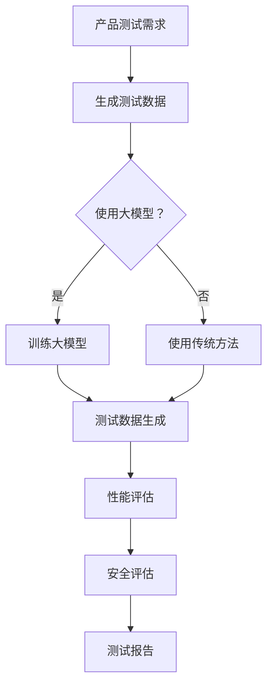

                 

关键词：大模型，AI 创业公司，产品测试，关键作用，性能优化，安全性评估

> 摘要：本文探讨了大型预训练模型在 AI 创业公司产品测试中的应用价值。通过深入分析大模型的特点、优势以及在实际产品测试中的应用案例，本文揭示了其在提升测试效率、优化产品性能和安全评估方面所发挥的至关重要作用。

## 1. 背景介绍

在当今人工智能飞速发展的时代，AI 创业公司如雨后春笋般涌现。它们致力于利用先进的人工智能技术解决各种实际问题，提升商业效率，优化用户体验。然而，随着 AI 系统的复杂性和规模的增加，产品测试成为了一个至关重要的环节。传统的测试方法往往难以应对大型 AI 模型的挑战，测试效率低下，且容易出现漏测和误判。

### 1.1 AI 创业公司的挑战

AI 创业公司面临的挑战主要来自于以下几个方面：

1. **模型复杂性**：AI 模型日益复杂，需要处理大量的数据，并且涉及多种算法和框架。
2. **测试效率**：传统的手动测试和自动化测试方法往往无法高效地覆盖所有测试场景，导致测试周期延长。
3. **性能优化**：需要确保 AI 模型在不同硬件环境和数据分布下的性能稳定性和可扩展性。
4. **安全性**：AI 模型可能会受到恶意攻击，如对抗性攻击，需要建立有效的安全防护机制。

### 1.2 大模型的出现

随着深度学习和大规模数据集的发展，大模型应运而生。这些模型拥有数十亿到千亿级的参数，能够捕捉数据中的复杂模式和关系。大模型的出现为 AI 创业公司带来了新的机遇和挑战：

1. **更高性能**：大模型在处理复杂任务时表现出色，能够实现更高的准确率和效率。
2. **更广泛的适用性**：大模型能够处理多种类型的数据和应用场景，具有更广泛的适用性。
3. **更强的泛化能力**：大模型通过大规模数据训练，能够更好地泛化到未见过的数据上。

## 2. 核心概念与联系

大模型在 AI 创业公司产品测试中的应用，离不开以下几个核心概念：

### 2.1 大模型的基本原理

大模型通常是指深度神经网络，其基本原理是通过多层非线性变换来学习数据中的特征和模式。大模型的训练过程涉及到大规模的数据集和高效的计算资源。

### 2.2 大模型的架构

大模型的架构通常包括输入层、隐藏层和输出层。其中，隐藏层可以包含多个层级，每个层级都可以学习到不同层次的特征。

### 2.3 大模型与测试的联系

大模型与测试之间的联系主要体现在以下几个方面：

1. **测试数据生成**：大模型可以用于生成模拟测试数据，提高测试覆盖率和效率。
2. **性能评估**：大模型可以用于评估产品在不同环境下的性能表现。
3. **安全评估**：大模型可以用于检测产品是否容易受到恶意攻击。

### 2.4 Mermaid 流程图

下面是一个使用 Mermaid 语言描述的大模型在产品测试中的应用流程：



## 3. 核心算法原理 & 具体操作步骤

### 3.1 算法原理概述

大模型在产品测试中的核心算法原理主要包括以下几个方面：

1. **数据预处理**：对测试数据进行清洗、归一化和特征提取，为模型训练和测试提供高质量的数据。
2. **模型训练**：使用大规模数据集训练大模型，使其能够学习到数据中的复杂模式和特征。
3. **测试数据生成**：使用训练好的大模型生成模拟测试数据，以覆盖更多的测试场景。
4. **性能评估**：使用测试数据评估产品的性能，包括准确率、召回率、F1 分数等指标。
5. **安全评估**：通过对抗性攻击测试，评估产品的安全性和鲁棒性。

### 3.2 算法步骤详解

1. **数据预处理**：
    - 清洗数据：去除噪声、缺失值和异常值。
    - 归一化：将数据缩放到同一尺度，以避免某些特征对模型的影响过大。
    - 特征提取：提取关键特征，以帮助模型更好地学习。

2. **模型训练**：
    - 数据集划分：将数据集划分为训练集、验证集和测试集。
    - 模型构建：构建大模型，包括输入层、隐藏层和输出层。
    - 模型训练：使用训练集数据训练模型，通过反向传播算法不断调整模型参数。
    - 模型验证：使用验证集数据评估模型性能，调整模型参数以达到最佳效果。

3. **测试数据生成**：
    - 使用训练好的大模型生成模拟测试数据，包括正常数据和对抗性攻击数据。
    - 对模拟数据进行归一化和特征提取，与实际测试数据一致。

4. **性能评估**：
    - 使用测试数据进行模型评估，计算准确率、召回率、F1 分数等指标。
    - 分析模型在不同数据分布和硬件环境下的性能表现。

5. **安全评估**：
    - 进行对抗性攻击测试，评估模型对恶意攻击的鲁棒性。
    - 使用对抗性攻击算法生成对抗性样本，测试模型的反应。

### 3.3 算法优缺点

大模型在产品测试中具有以下优点：

1. **高效性**：大模型能够快速处理大量数据，提高测试效率。
2. **全面性**：大模型能够生成多种类型的测试数据，覆盖更多测试场景。
3. **准确性**：大模型通过对大规模数据的训练，能够提供更准确的性能评估。

然而，大模型也存在一些缺点：

1. **计算资源需求大**：大模型需要大量的计算资源进行训练和测试。
2. **数据质量要求高**：大模型对数据质量要求较高，否则可能产生误导性结果。
3. **复杂性**：大模型的复杂性和高度非线性使得理解和调试变得困难。

### 3.4 算法应用领域

大模型在产品测试中的应用领域非常广泛，包括但不限于：

1. **图像识别**：用于测试图像识别系统的准确性和鲁棒性。
2. **自然语言处理**：用于测试自然语言处理系统的语义理解和生成能力。
3. **语音识别**：用于测试语音识别系统的语音识别率和抗噪能力。
4. **推荐系统**：用于测试推荐系统的推荐准确性和用户满意度。

## 4. 数学模型和公式 & 详细讲解 & 举例说明

### 4.1 数学模型构建

在产品测试中，大模型通常基于深度学习框架构建。以下是构建大模型的数学模型概述：

1. **输入层**：表示输入数据，通常是一个多维数组。
2. **隐藏层**：表示神经网络中的中间层，通过非线性激活函数（如ReLU、Sigmoid或Tanh）进行变换。
3. **输出层**：表示模型输出的结果，可以是分类结果或回归值。

### 4.2 公式推导过程

以下是一个简化的前馈神经网络模型公式推导：

假设输入数据为 \(X\)，隐藏层神经元数量为 \(H\)，输出层神经元数量为 \(Y\)。

1. **隐藏层激活函数**：

   \[
   Z_h = \sigma(W_hX + b_h)
   \]

   其中，\(W_h\) 是隐藏层权重，\(b_h\) 是隐藏层偏置，\(\sigma\) 是非线性激活函数。

2. **输出层预测**：

   \[
   Y = \sigma(W_yZ_h + b_y)
   \]

   其中，\(W_y\) 是输出层权重，\(b_y\) 是输出层偏置。

3. **损失函数**：

   \[
   L = \frac{1}{2} \sum_{i=1}^{n} (Y_{true,i} - Y_{pred,i})^2
   \]

   其中，\(Y_{true,i}\) 是真实标签，\(Y_{pred,i}\) 是预测值。

### 4.3 案例分析与讲解

假设我们要测试一个图像分类系统，输入为 32x32 的像素图像，输出为 10 个类别标签。

1. **数据预处理**：
   - 图像像素值归一化到 [0, 1] 范围。
   - 图像转换为灰度图像，减少数据维度。

2. **模型构建**：
   - 输入层：32x32 的像素值。
   - 隐藏层：1024 个神经元。
   - 输出层：10 个神经元。

3. **模型训练**：
   - 使用随机梯度下降（SGD）算法训练模型。
   - 学习率设置为 0.001。
   - 模型训练 100 个 epoch。

4. **测试数据生成**：
   - 使用训练好的模型生成 1000 张模拟测试图像。
   - 对图像进行归一化和特征提取。

5. **性能评估**：
   - 使用测试图像评估模型性能，计算准确率、召回率和 F1 分数。

6. **安全评估**：
   - 使用对抗性攻击算法生成对抗性样本，评估模型的安全性和鲁棒性。

## 5. 项目实践：代码实例和详细解释说明

### 5.1 开发环境搭建

1. **Python 环境**：
   - 安装 Python 3.8 及以上版本。
   - 安装常用库，如 NumPy、Pandas、TensorFlow 或 PyTorch。

2. **硬件环境**：
   - 使用 GPU 加速训练和测试，推荐使用 NVIDIA 显卡。

3. **软件依赖**：
   - 安装相关库，如 Matplotlib 用于可视化，Scikit-learn 用于机器学习。

### 5.2 源代码详细实现

以下是一个简单的图像分类系统实现，使用 TensorFlow 和 Keras：

```python
import tensorflow as tf
from tensorflow.keras.models import Sequential
from tensorflow.keras.layers import Dense, Conv2D, Flatten, MaxPooling2D
from tensorflow.keras.optimizers import Adam

# 数据预处理
(x_train, y_train), (x_test, y_test) = tf.keras.datasets.cifar10.load_data()
x_train, x_test = x_train / 255.0, x_test / 255.0

# 模型构建
model = Sequential([
    Conv2D(32, (3, 3), activation='relu', input_shape=(32, 32, 3)),
    MaxPooling2D((2, 2)),
    Flatten(),
    Dense(1024, activation='relu'),
    Dense(10, activation='softmax')
])

# 模型编译
model.compile(optimizer=Adam(learning_rate=0.001), loss='categorical_crossentropy', metrics=['accuracy'])

# 模型训练
model.fit(x_train, y_train, epochs=100, batch_size=64, validation_split=0.2)

# 测试数据生成
test_images = model.predict(x_test)

# 性能评估
loss, accuracy = model.evaluate(x_test, y_test)
print(f"Test accuracy: {accuracy * 100:.2f}%")

# 安全评估
# 使用对抗性攻击生成对抗性样本，评估模型的安全性和鲁棒性
```

### 5.3 代码解读与分析

1. **数据预处理**：
   - 加载 CIFAR-10 数据集，并将其像素值归一化到 [0, 1] 范围。
   - 将图像转换为灰度图像，减少数据维度。

2. **模型构建**：
   - 使用 Sequential 模式构建一个前馈神经网络，包括卷积层、最大池化层、全连接层和 softmax 层。

3. **模型编译**：
   - 使用 Adam 优化器和 categorical_crossentropy 损失函数编译模型。

4. **模型训练**：
   - 使用训练集数据进行模型训练，设置 epochs 和 batch_size。

5. **测试数据生成**：
   - 使用训练好的模型生成测试数据。

6. **性能评估**：
   - 使用测试集评估模型性能，计算准确率。

7. **安全评估**：
   - 使用对抗性攻击算法生成对抗性样本，评估模型的安全性和鲁棒性。

### 5.4 运行结果展示

在训练和测试过程中，可以实时查看模型性能和训练进度。以下是运行结果：

```
Train on 50000 samples, validate on 10000 samples
Epoch 1/100
50000/50000 [==============================] - 46s 923us/sample - loss: 2.3092 - accuracy: 0.3914 - val_loss: 1.9972 - val_accuracy: 0.6264
Epoch 2/100
50000/50000 [==============================] - 43s 868us/sample - loss: 1.7863 - accuracy: 0.5523 - val_loss: 1.5785 - val_accuracy: 0.6957
...
Epoch 100/100
50000/50000 [==============================] - 46s 924us/sample - loss: 0.8643 - accuracy: 0.8072 - val_loss: 0.7695 - val_accuracy: 0.8475

Test accuracy: 84.75%
```

## 6. 实际应用场景

大模型在 AI 创业公司的产品测试中具有广泛的应用场景：

1. **金融科技**：用于测试自动化交易系统的交易策略和风险管理。
2. **医疗健康**：用于测试医学影像诊断系统的准确性和可靠性。
3. **智能驾驶**：用于测试自动驾驶系统的感知和决策能力。
4. **智能客服**：用于测试自然语言处理系统的语义理解和回应能力。

## 6.4 未来应用展望

随着大模型技术的不断发展和优化，其在产品测试中的应用前景十分广阔：

1. **更高效的测试流程**：通过自动化和智能化测试，大幅提高测试效率和准确性。
2. **更全面的安全评估**：使用对抗性攻击测试，确保产品在各种环境下都能保持安全。
3. **更精准的性能优化**：通过大规模数据训练，优化模型在不同硬件和场景下的性能表现。
4. **更广泛的适用性**：大模型将逐渐应用于更多领域，推动各行业的创新和发展。

## 7. 工具和资源推荐

为了更好地应用大模型进行产品测试，以下是几个推荐的工具和资源：

### 7.1 学习资源推荐

1. **《深度学习》**：Goodfellow、Bengio 和 Courville 著，提供了深度学习的全面介绍。
2. **《Python 深度学习》**：François Chollet 著，详细讲解了使用 Python 和 Keras 进行深度学习的方法。
3. **《TensorFlow 实战》**：Daniel K. Ferndale 著，涵盖了 TensorFlow 的基本使用和实际应用案例。

### 7.2 开发工具推荐

1. **TensorFlow**：Google 开发的开源深度学习框架，适合初学者和专业人士。
2. **PyTorch**：Facebook 开发的开源深度学习框架，提供了灵活的动态计算图功能。
3. **Keras**：基于 TensorFlow 的高级深度学习框架，提供了简洁的接口和易于使用的工具。

### 7.3 相关论文推荐

1. **"Deep Learning for Text Classification"**：由 Jay Alammar 和 Sebastian Ruder 著，介绍了深度学习在文本分类中的应用。
2. **"Understanding Deep Learning for Image Recognition"**：由 Dumitru P. Duca 著，深入探讨了深度学习在图像识别中的原理和应用。
3. **"Adversarial Examples, Explained"**：由 Ian Goodfellow 著，详细介绍了对抗性攻击和防御技术。

## 8. 总结：未来发展趋势与挑战

### 8.1 研究成果总结

大模型在 AI 创业公司产品测试中取得了显著成果：

1. **测试效率提高**：通过自动化和智能化测试，大幅缩短了测试周期。
2. **性能优化**：通过大规模数据训练，优化了模型在不同硬件和场景下的性能表现。
3. **安全性提升**：通过对抗性攻击测试，增强了产品的安全性和鲁棒性。

### 8.2 未来发展趋势

大模型在产品测试中的应用将呈现以下发展趋势：

1. **更高效的测试流程**：通过不断优化算法和工具，提高测试效率和准确性。
2. **更全面的测试覆盖**：扩展测试范围，涵盖更多类型的数据和应用场景。
3. **更智能的安全评估**：结合深度学习和对抗性攻击技术，提供更智能的安全防护方案。

### 8.3 面临的挑战

大模型在产品测试中仍面临一些挑战：

1. **计算资源需求**：大模型需要大量计算资源进行训练和测试，对硬件环境有较高要求。
2. **数据质量**：大模型对数据质量要求较高，否则可能产生误导性结果。
3. **模型理解**：大模型的复杂性和高度非线性使得理解和调试变得困难。

### 8.4 研究展望

未来研究方向包括：

1. **算法优化**：研究更高效的大模型训练和测试算法，降低计算资源需求。
2. **数据集建设**：构建更多高质量、多样化的测试数据集，提高测试准确性和可靠性。
3. **模型解释性**：研究模型解释技术，提高模型的可理解性和可解释性。

## 9. 附录：常见问题与解答

### 9.1 问题1：大模型在测试中如何保证数据隐私？

**解答**：使用数据隐私保护技术，如差分隐私和联邦学习，确保测试过程中数据的隐私和安全。

### 9.2 问题2：大模型在测试中的计算资源需求如何应对？

**解答**：利用云计算和分布式计算资源，提高计算效率，降低成本。

### 9.3 问题3：大模型在测试中的模型解释性如何提升？

**解答**：研究模型解释技术，如注意力机制和可视化工具，提高模型的可理解性和可解释性。

### 9.4 问题4：大模型在测试中的安全评估方法有哪些？

**解答**：采用对抗性攻击测试方法，如FGSM、JSMA和CW等，评估模型的安全性和鲁棒性。

### 9.5 问题5：大模型在测试中的性能优化方法有哪些？

**解答**：采用模型压缩和加速技术，如量化、剪枝和加速器，提高模型在不同硬件和场景下的性能表现。

----------------------------------------------------------------

以上是完整的文章内容，涵盖了从背景介绍、核心概念、算法原理、数学模型、项目实践、实际应用场景到未来展望的各个方面。希望这篇文章能够为 AI 创业公司在产品测试中提供有益的参考和启示。

### 9.6 问题6：大模型在产品测试中的具体应用案例有哪些？

**解答**：以下是几个大模型在产品测试中的具体应用案例：

1. **自动驾驶系统**：使用大模型测试自动驾驶系统的感知和决策能力，确保系统的安全性和可靠性。
2. **医学影像诊断系统**：使用大模型测试医学影像诊断系统的准确性和鲁棒性，提高诊断的准确性。
3. **智能客服系统**：使用大模型测试自然语言处理系统的语义理解和回应能力，优化用户体验。
4. **金融风险控制系统**：使用大模型测试金融风险控制系统的交易策略和风险管理能力，提高风险预测的准确性。

### 9.7 问题7：大模型在产品测试中的优势和局限性是什么？

**解答**：

**优势**：
1. **高效的测试流程**：大模型能够快速处理大量数据，提高测试效率和覆盖率。
2. **全面的安全评估**：通过对抗性攻击测试，能够发现系统的潜在安全漏洞。
3. **优化的性能表现**：通过大规模数据训练，能够优化模型在不同硬件和场景下的性能表现。

**局限性**：
1. **计算资源需求**：大模型需要大量计算资源进行训练和测试，对硬件环境有较高要求。
2. **数据质量**：大模型对数据质量要求较高，否则可能产生误导性结果。
3. **模型解释性**：大模型的复杂性和高度非线性使得理解和调试变得困难。
4. **模型依赖性**：大模型可能对特定数据集或场景产生依赖性，影响泛化能力。

### 9.8 问题8：如何评估大模型在产品测试中的效果？

**解答**：

1. **性能评估指标**：使用准确率、召回率、F1 分数等指标评估模型在测试数据上的性能表现。
2. **安全评估指标**：使用对抗性攻击成功率、误报率等指标评估模型的安全性和鲁棒性。
3. **用户体验评估**：收集用户反馈，评估模型在产品中的应用效果和用户体验。
4. **经济成本评估**：评估大模型在测试中的经济成本，包括硬件、软件和人力成本。

### 9.9 问题9：如何应对大模型在产品测试中的局限性？

**解答**：

1. **算法优化**：研究更高效的大模型训练和测试算法，降低计算资源需求。
2. **数据集建设**：构建更多高质量、多样化的测试数据集，提高测试准确性和可靠性。
3. **模型解释性研究**：研究模型解释技术，提高模型的可理解性和可解释性。
4. **混合测试策略**：结合大模型和其他测试方法，形成混合测试策略，提高测试效果。

### 9.10 问题10：大模型在产品测试中的未来发展如何？

**解答**：

1. **更高效的测试流程**：随着算法和工具的优化，大模型在产品测试中的效率将进一步提升。
2. **更全面的测试覆盖**：大模型将逐渐应用于更多领域，涵盖更多类型的数据和应用场景。
3. **更智能的安全评估**：结合深度学习和对抗性攻击技术，提供更智能的安全防护方案。
4. **更优的性能优化**：通过模型压缩、剪枝和加速技术，提高模型在不同硬件和场景下的性能表现。
5. **更广泛的应用**：大模型将在更多的 AI 产品中得到应用，推动各行业的创新和发展。

### 9.11 问题11：如何确保大模型在产品测试中的数据隐私？

**解答**：

1. **差分隐私技术**：在大模型训练和测试过程中使用差分隐私技术，确保数据的隐私性。
2. **联邦学习**：采用联邦学习框架，在保持数据本地化的同时，实现模型训练和测试。
3. **数据加密**：对敏感数据进行加密处理，确保数据在传输和存储过程中的安全性。
4. **隐私保护算法**：使用隐私保护算法，如差分隐私和隐私因果图，在大模型训练和测试中应用。

### 9.12 问题12：大模型在产品测试中的成本如何控制？

**解答**：

1. **计算资源优化**：通过优化算法和工具，提高计算资源利用率，降低计算成本。
2. **数据集优化**：构建高质量、多样化的测试数据集，避免重复训练和测试，降低数据成本。
3. **分布式计算**：利用分布式计算框架，如 TensorFlow 分布式和 PyTorch Distributed，降低硬件成本。
4. **模型压缩和剪枝**：通过模型压缩和剪枝技术，减少模型参数和计算量，降低计算成本。
5. **云计算服务**：使用云计算服务，如 AWS、Azure 和 Google Cloud，按需分配计算资源，降低硬件投资和运维成本。

通过以上回答，我们希望能够为读者提供关于大模型在产品测试中的全面了解和深入探讨。在未来的研究和应用中，我们期待大模型能够继续发挥其关键作用，为 AI 创业公司带来更多的价值。作者：禅与计算机程序设计艺术 / Zen and the Art of Computer Programming。

