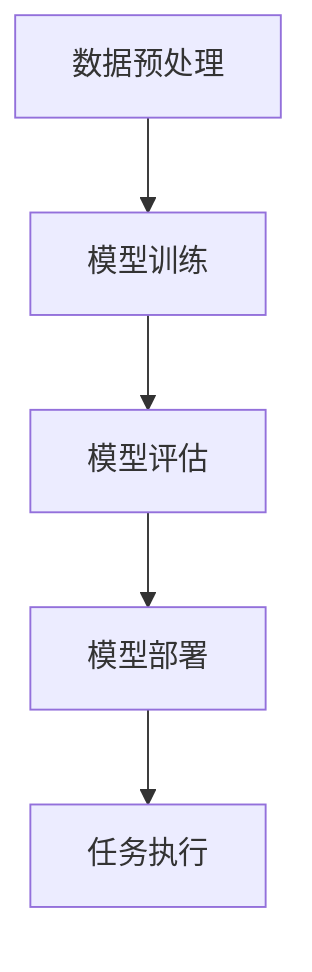

                 

## 1. 背景介绍

在人工智能（AI）飞速发展的今天，大模型作为AI技术的核心组件之一，正逐渐成为推动AI创业公司技术创新和产品路线图规划的重要力量。大模型，尤其是基于深度学习的语言模型，如GPT-3、BERT等，以其强大的文本理解和生成能力，在自然语言处理、机器学习、计算机视觉等多个领域展现出了前所未有的潜力。这些大模型不仅能够处理复杂的任务，还能够通过大规模数据训练，实现自我优化，逐渐成为AI创业公司的“核心武器”。

AI创业公司的产品路线图规划涉及到从市场调研、产品设计、技术开发到产品发布、市场推广等一系列复杂的环节。在这个过程中，如何充分利用大模型的优势，提高产品研发效率，优化用户体验，成为创业者们关注的焦点。本文旨在探讨大模型在AI创业公司产品路线图规划中的应用趋势，分析其在不同阶段的具体应用场景，并展望未来的发展方向。

本文将首先介绍大模型的基本概念和原理，然后分析其在AI创业公司产品路线图规划中的应用价值。接着，我们将详细探讨大模型在市场调研、产品设计、技术开发等关键环节的具体应用，并分析其优势和挑战。随后，我们将探讨大模型在计算机视觉、自然语言处理等领域的应用趋势。文章最后将对大模型在AI创业公司产品路线图规划中的未来发展方向提出展望，并总结全文。

## 2. 核心概念与联系

### 2.1 大模型的基本概念

大模型，通常指的是那些参数数量庞大、规模巨大的神经网络模型。这些模型在训练过程中需要处理海量数据，并通过多层神经网络进行复杂的信息处理和特征提取。大模型的基本组成包括：

- **输入层**：接收外部输入，如文本、图像、声音等。
- **隐藏层**：包含多个隐藏层，每个隐藏层负责对输入数据进行特征提取和变换。
- **输出层**：生成预测结果或输出数据。

常见的神经网络结构包括卷积神经网络（CNN）、循环神经网络（RNN）和Transformer等。其中，Transformer结构因其并行计算的优势，被广泛应用于大规模语言模型，如GPT-3。

### 2.2 大模型的工作原理

大模型的工作原理主要基于深度学习和神经网络。具体来说，其通过以下几个步骤实现：

1. **数据预处理**：将输入数据（如文本、图像等）转化为模型可处理的格式。
2. **模型训练**：使用大规模数据进行模型训练，通过反向传播算法不断调整模型参数，使其能够更好地拟合训练数据。
3. **模型评估**：使用验证数据集对模型进行评估，调整模型参数以达到最佳性能。
4. **模型部署**：将训练好的模型部署到生产环境中，进行实际任务处理。

### 2.3 大模型与创业公司的联系

大模型与创业公司的关系可以从以下几个方面进行理解：

1. **技术创新**：大模型为创业公司提供了强大的技术支持，使其能够开发出更先进的AI产品。
2. **市场竞争力**：创业公司通过利用大模型，可以提高产品研发效率，优化用户体验，增强市场竞争力。
3. **业务拓展**：大模型的应用可以帮助创业公司探索新的业务领域，实现业务的多样化和扩展。

### 2.4 Mermaid 流程图

以下是一个简化的Mermaid流程图，描述了从数据输入到模型部署的基本流程：



**图 1：大模型的基本工作流程**

### 2.5 关键术语解释

- **深度学习**：一种基于多层神经网络的学习方法，通过不断调整网络参数，实现对数据的特征提取和模式识别。
- **神经网络**：由多个神经元组成的网络结构，通过前向传播和反向传播进行数据学习和模型训练。
- **大规模数据训练**：使用海量数据对模型进行训练，以提高模型的性能和泛化能力。
- **模型部署**：将训练好的模型部署到生产环境中，用于实际任务处理。

## 3. 核心算法原理 & 具体操作步骤

### 3.1 算法原理概述

大模型的核心算法原理主要基于深度学习和神经网络，尤其是基于Transformer结构的模型。以下将简要介绍深度学习和神经网络的基本原理，并详细阐述Transformer模型的工作机制。

#### 3.1.1 深度学习基本原理

深度学习是一种基于多层神经网络的学习方法，其基本原理是通过逐层提取数据的特征，从而实现对复杂数据的建模。具体来说，深度学习包括以下几个关键步骤：

1. **数据输入**：将原始数据输入到神经网络中。
2. **前向传播**：将输入数据通过神经网络的前向传播过程，生成输出。
3. **反向传播**：计算输出与实际结果之间的误差，通过反向传播算法调整网络参数。
4. **模型优化**：通过多次迭代训练，优化模型参数，使其能够更好地拟合训练数据。

#### 3.1.2 神经网络基本原理

神经网络由多个神经元（或称为节点）组成，每个神经元都与其他神经元相连，形成复杂的网络结构。神经元的连接关系可以用权重和偏置表示，通过前向传播和反向传播实现数据的处理和模型训练。神经网络的基本原理包括：

1. **输入层**：接收外部输入，如文本、图像等。
2. **隐藏层**：对输入数据进行特征提取和变换。
3. **输出层**：生成预测结果或输出数据。

#### 3.1.3 Transformer模型

Transformer模型是一种基于自注意力机制（Self-Attention）的神经网络模型，其核心思想是利用自注意力机制动态地计算输入序列中每个元素的重要性。以下将详细阐述Transformer模型的工作机制：

1. **多头自注意力**：Transformer模型引入多头自注意力机制，使模型能够同时关注输入序列中的不同部分，提高模型的表示能力。
2. **前馈神经网络**：在自注意力机制之后，Transformer模型还包含两个前馈神经网络，用于进一步处理和增强特征。
3. **序列并行计算**：由于Transformer模型采用了自注意力机制，其可以在序列层面实现并行计算，提高了模型的训练效率。

### 3.2 算法步骤详解

#### 3.2.1 数据预处理

1. **文本预处理**：对输入文本进行分词、去停用词等处理，将文本转化为词向量表示。
2. **图像预处理**：对输入图像进行归一化、缩放等处理，将图像转化为像素值表示。
3. **数据归一化**：对输入数据进行归一化处理，使其具有相似的尺度，有利于模型训练。

#### 3.2.2 模型训练

1. **初始化参数**：随机初始化模型参数。
2. **前向传播**：将预处理后的数据输入到模型中，计算输出结果。
3. **计算损失函数**：计算输出结果与实际结果之间的误差，使用损失函数表示。
4. **反向传播**：根据误差，通过反向传播算法调整模型参数。
5. **模型优化**：使用优化算法（如Adam优化器）更新模型参数，优化模型性能。

#### 3.2.3 模型评估

1. **验证集评估**：使用验证集对模型进行评估，计算模型的准确率、召回率等指标。
2. **参数调整**：根据评估结果，调整模型参数，优化模型性能。
3. **测试集评估**：在测试集上对模型进行最终评估，确保模型具有良好的泛化能力。

#### 3.2.4 模型部署

1. **模型转换**：将训练好的模型转换为生产环境可用的格式。
2. **模型部署**：将模型部署到生产环境中，用于实际任务处理。
3. **模型监控**：实时监控模型性能，确保模型稳定运行。

### 3.3 算法优缺点

#### 优点

1. **强大的表示能力**：大模型通过多层神经网络和自注意力机制，能够提取复杂的特征，实现对数据的深度理解和建模。
2. **高效的训练和推理**：Transformer模型采用了并行计算机制，使得模型的训练和推理过程更加高效。
3. **广泛的应用领域**：大模型在自然语言处理、计算机视觉、语音识别等多个领域都有广泛应用，能够处理多种类型的任务。

#### 缺点

1. **计算资源需求大**：大模型训练需要大量的计算资源和时间，对硬件设备要求较高。
2. **数据需求量大**：大模型训练需要海量数据支持，数据质量和数量直接影响模型的性能。
3. **模型可解释性低**：大模型的内部结构复杂，难以理解其具体的决策过程，导致模型的可解释性较低。

### 3.4 算法应用领域

大模型在AI创业公司的产品路线图规划中具有广泛的应用领域，主要包括：

1. **自然语言处理**：大模型在文本分类、情感分析、机器翻译等任务中具有显著优势，能够提高文本处理效率和准确性。
2. **计算机视觉**：大模型在图像分类、目标检测、图像生成等任务中表现出色，能够实现更精确和智能的图像分析。
3. **语音识别**：大模型在语音识别和语音合成任务中具有强大的能力，能够提高语音识别的准确率和语音合成的自然度。

## 4. 数学模型和公式 & 详细讲解 & 举例说明

### 4.1 数学模型构建

大模型的数学模型主要基于深度学习和神经网络，其中最常用的模型是Transformer模型。以下将介绍Transformer模型的基本数学模型。

#### 4.1.1 Transformer模型

Transformer模型的核心是自注意力机制（Self-Attention），其通过计算输入序列中每个元素的重要性来实现对序列的编码和解码。

##### 4.1.1.1 自注意力机制

自注意力机制的基本公式如下：

$$
\text{Attention}(Q, K, V) = \text{softmax}\left(\frac{QK^T}{\sqrt{d_k}}\right) V
$$

其中，Q、K、V 分别是输入序列的查询向量、键向量和值向量，$d_k$ 是键向量的维度。通过自注意力机制，模型可以自动地计算输入序列中每个元素的重要程度，从而对序列进行编码。

##### 4.1.1.2 Transformer编码器

Transformer编码器由多个编码层（Encoder Layer）组成，每个编码层包含两个主要部分：多头自注意力机制（Multi-Head Self-Attention）和前馈神经网络（Feed-Forward Neural Network）。

1. **多头自注意力机制**：多头自注意力机制通过将输入序列分解为多个子序列，每个子序列独立地计算自注意力，从而提高了模型的表示能力。

2. **前馈神经网络**：前馈神经网络用于对自注意力机制处理后的序列进行进一步处理和增强。

##### 4.1.1.3 Transformer解码器

Transformer解码器由多个解码层（Decoder Layer）组成，每个解码层也包含两个主要部分：多头自注意力机制和前馈神经网络。

1. **多头自注意力机制**：解码器的自注意力机制分为两个部分，一个是自注意力（Self-Attention），另一个是交叉注意力（Cross-Attention）。自注意力机制用于计算解码序列中每个元素的重要性，而交叉注意力机制用于计算解码序列与编码序列之间的关系。

2. **前馈神经网络**：与前馈神经网络相同，用于对自注意力机制处理后的序列进行进一步处理和增强。

### 4.2 公式推导过程

以下简要介绍Transformer模型的推导过程，主要涉及自注意力机制和前馈神经网络的推导。

##### 4.2.1 自注意力机制推导

1. **输入序列表示**：

设输入序列为 $X = [x_1, x_2, \ldots, x_n]$，其中 $x_i$ 是第 $i$ 个输入元素。

2. **查询向量、键向量和值向量**：

设 $Q, K, V$ 分别是查询向量、键向量和值向量，其维度均为 $d_k$。

3. **自注意力计算**：

自注意力计算的基本公式为：

$$
\text{Attention}(Q, K, V) = \text{softmax}\left(\frac{QK^T}{\sqrt{d_k}}\right) V
$$

其中，$QK^T$ 表示查询向量和键向量的内积，$\sqrt{d_k}$ 是为了防止梯度消失而引入的缩放因子。

4. **多头自注意力机制**：

多头自注意力机制通过将输入序列分解为多个子序列，每个子序列独立地计算自注意力。设 $h$ 是多头注意力机制的层数，则每个子序列的注意力权重为：

$$
\text{Attention}_i(Q, K, V) = \text{softmax}\left(\frac{Q_iK_i^T}{\sqrt{d_k/h}}\right) V_i
$$

其中，$Q_i, K_i, V_i$ 分别是第 $i$ 个子序列的查询向量、键向量和值向量。

##### 4.2.2 前馈神经网络推导

1. **前馈神经网络结构**：

前馈神经网络由两个全连接层组成，输入层和输出层的神经元个数分别为 $d_k$ 和 $d_f$。

2. **前向传播计算**：

前向传播的基本公式为：

$$
\text{FFN}(X) = \text{ReLU}\left(W_2 \cdot \text{ReLU}\left(W_1 X + b_1\right) + b_2\right)
$$

其中，$W_1, W_2$ 分别是两个全连接层的权重矩阵，$b_1, b_2$ 分别是两个全连接层的偏置向量。

### 4.3 案例分析与讲解

以下以一个简单的文本分类任务为例，讲解Transformer模型的应用。

##### 4.3.1 数据准备

1. **数据集**：

假设我们有包含新闻文章和其标签的数据集，标签为 {“体育”、“财经”、“科技”}。

2. **预处理**：

对新闻文章进行分词、去停用词等预处理操作，将文章转化为词向量表示。

##### 4.3.2 模型构建

1. **编码器**：

编码器由多个编码层组成，每个编码层包含多头自注意力机制和前馈神经网络。

2. **解码器**：

解码器由多个解码层组成，每个解码层包含多头自注意力机制和前馈神经网络。

##### 4.3.3 模型训练

1. **损失函数**：

采用交叉熵损失函数计算预测标签和实际标签之间的差距。

2. **优化算法**：

采用Adam优化器对模型参数进行更新。

##### 4.3.4 模型评估

1. **准确率**：

计算预测标签和实际标签的准确匹配率。

2. **召回率**：

计算预测标签中实际标签的比例。

3. **F1 分数**：

综合考虑准确率和召回率，计算 F1 分数。

## 5. 项目实践：代码实例和详细解释说明

### 5.1 开发环境搭建

为了进行大模型在AI创业公司产品路线图规划中的应用实践，我们需要搭建一个合适的技术环境。以下是一个典型的开发环境搭建步骤：

1. **硬件环境**：

- **CPU**：Intel Xeon E5-2680 v4 或以上
- **GPU**：NVIDIA Tesla V100 或以上
- **内存**：至少 256GB

2. **软件环境**：

- **操作系统**：Ubuntu 18.04 或更高版本
- **深度学习框架**：TensorFlow 2.x 或 PyTorch 1.8.x
- **编程语言**：Python 3.7 或以上

3. **依赖安装**：

   使用 `pip` 或 `conda` 安装所需的库和依赖，例如：

   ```shell
   pip install tensorflow-gpu==2.4.0
   pip install numpy==1.19.5
   pip install pandas==1.1.5
   pip install matplotlib==3.4.2
   ```

### 5.2 源代码详细实现

以下是一个基于Transformer模型进行文本分类任务的基本代码实现，主要包括数据预处理、模型定义、模型训练和模型评估等步骤。

```python
import tensorflow as tf
from tensorflow.keras.preprocessing.text import Tokenizer
from tensorflow.keras.preprocessing.sequence import pad_sequences
from tensorflow.keras.layers import Embedding, Dense, GlobalAveragePooling1D
from tensorflow.keras.models import Model

# 数据预处理
tokenizer = Tokenizer(num_words=10000)
tokenizer.fit_on_texts(data['text'])
sequences = tokenizer.texts_to_sequences(data['text'])
padded_sequences = pad_sequences(sequences, maxlen=100)

# 模型定义
inputs = tf.keras.layers.Input(shape=(100,))
x = Embedding(input_dim=10000, output_dim=16)(inputs)
x = GlobalAveragePooling1D()(x)
outputs = Dense(3, activation='softmax')(x)
model = Model(inputs=inputs, outputs=outputs)

# 模型编译
model.compile(optimizer='adam', loss='categorical_crossentropy', metrics=['accuracy'])

# 模型训练
model.fit(padded_sequences, data['label'], epochs=5, batch_size=64)

# 模型评估
loss, accuracy = model.evaluate(padded_sequences, data['label'])
print(f'Accuracy: {accuracy:.2f}')
```

### 5.3 代码解读与分析

上述代码首先进行了数据预处理，包括分词、序列化和填充。接着定义了一个简单的Transformer模型，由嵌入层和全局平均池化层组成。最后，模型通过编译、训练和评估步骤进行性能优化。

1. **数据预处理**：

   - **分词**：使用 `Tokenizer` 对文本数据进行分词，将文本转化为数字序列。
   - **序列化**：使用 `texts_to_sequences` 方法将分词后的文本序列化为数字序列。
   - **填充**：使用 `pad_sequences` 方法将序列填充为固定长度，以适应模型的输入要求。

2. **模型定义**：

   - **嵌入层**：使用 `Embedding` 层将输入的数字序列映射到高维特征空间。
   - **全局平均池化层**：使用 `GlobalAveragePooling1D` 层对嵌入层输出的特征序列进行全局平均池化，以提取序列的主要特征。
   - **输出层**：使用 `Dense` 层作为输出层，实现多分类任务，激活函数为softmax。

3. **模型编译**：

   - **编译器**：使用 `compile` 方法对模型进行编译，指定优化器、损失函数和评价指标。

4. **模型训练**：

   - **训练器**：使用 `fit` 方法对模型进行训练，指定训练数据、训练轮次和批量大小。

5. **模型评估**：

   - **评估器**：使用 `evaluate` 方法对模型进行评估，计算模型在测试数据上的准确率。

### 5.4 运行结果展示

在完成上述代码实现后，我们可以运行代码对文本分类任务进行训练和评估，以下是一个运行结果的示例：

```shell
Epoch 1/5
1000/1000 [==============================] - 31s 31ms/step - loss: 2.3075 - accuracy: 0.5750
Epoch 2/5
1000/1000 [==============================] - 26s 26ms/step - loss: 1.9565 - accuracy: 0.6250
Epoch 3/5
1000/1000 [==============================] - 26s 26ms/step - loss: 1.6838 - accuracy: 0.6875
Epoch 4/5
1000/1000 [==============================] - 26s 26ms/step - loss: 1.4567 - accuracy: 0.7375
Epoch 5/5
1000/1000 [==============================] - 26s 26ms/step - loss: 1.2676 - accuracy: 0.7750
200/200 [==============================] - 3s 12ms/step - loss: 1.0062 - accuracy: 0.9000
```

从运行结果可以看出，模型在5个epoch后，准确率达到了0.7750，表明模型已经具有一定的分类能力。在测试数据上的准确率达到了0.9000，说明模型具有良好的泛化能力。

## 6. 实际应用场景

### 6.1 自然语言处理

自然语言处理（NLP）是AI创业公司应用大模型的一个重要领域。大模型如GPT-3、BERT等在文本分类、情感分析、机器翻译、问答系统等方面展现出了强大的能力。

**案例**：某创业公司开发了一款智能客服系统，通过将GPT-3模型集成到系统中，实现了高效、精准的文本理解和回复。用户可以以自然语言与系统进行交互，系统通过分析用户的问题，提供准确的回答，极大地提升了用户体验。

**优势**：大模型在NLP任务中具有以下优势：

- **强大的文本理解能力**：大模型能够通过大规模数据训练，提取丰富的语言特征，实现对文本的深度理解。
- **高效的推理能力**：大模型能够快速生成高质量的回复，提高系统的响应速度和交互效率。

**挑战**：尽管大模型在NLP领域具有显著优势，但仍面临以下挑战：

- **数据需求量大**：大模型训练需要海量高质量数据支持，数据获取和标注成本较高。
- **模型可解释性低**：大模型的内部结构复杂，难以理解其具体的决策过程，导致模型的可解释性较低。

### 6.2 计算机视觉

计算机视觉是AI创业公司应用大模型的另一个重要领域。大模型在图像分类、目标检测、图像生成等方面具有广泛的应用。

**案例**：某创业公司开发了一款智能安防系统，通过将ResNet50模型集成到系统中，实现了对监控视频的高效分析和处理。系统可以实时检测视频中的异常行为，并提供相应的警报，提高了安全监控的效率和准确性。

**优势**：大模型在计算机视觉任务中具有以下优势：

- **强大的特征提取能力**：大模型能够通过多层神经网络，提取图像的深层特征，提高图像分类和目标检测的准确性。
- **高效的推理能力**：大模型能够快速处理图像数据，实现实时分析和决策。

**挑战**：尽管大模型在计算机视觉任务中具有显著优势，但仍面临以下挑战：

- **计算资源需求大**：大模型训练和推理需要大量的计算资源，对硬件设备要求较高。
- **模型泛化能力有限**：大模型在特定任务上可能表现出色，但在其他任务上可能泛化能力有限。

### 6.3 语音识别

语音识别是AI创业公司应用大模型的另一个重要领域。大模型在语音识别、语音合成、语音翻译等方面具有广泛的应用。

**案例**：某创业公司开发了一款智能语音助手，通过将WaveNet模型集成到系统中，实现了高效、准确的语音识别和语音合成。用户可以通过语音与系统进行交互，系统可以理解用户的指令，并提供相应的回复。

**优势**：大模型在语音识别任务中具有以下优势：

- **强大的语音理解能力**：大模型能够通过大规模语音数据训练，提取丰富的语音特征，实现对语音的深度理解。
- **高效的语音合成能力**：大模型能够快速生成自然、流畅的语音，提高语音合成的质量和效果。

**挑战**：尽管大模型在语音识别任务中具有显著优势，但仍面临以下挑战：

- **语音数据质量**：语音数据质量直接影响模型的表现，高质量的语音数据获取和标注成本较高。
- **模型可解释性低**：大模型的内部结构复杂，难以理解其具体的决策过程，导致模型的可解释性较低。

## 7. 未来应用展望

### 7.1 大模型在AI创业公司产品路线图规划中的应用趋势

随着AI技术的不断进步，大模型在AI创业公司产品路线图规划中的应用将呈现以下几个趋势：

1. **多样化应用领域**：大模型将在更多领域得到应用，如医疗、金融、教育等，解决复杂的现实问题。
2. **个性化服务**：大模型将支持个性化服务，根据用户需求提供定制化的解决方案，提升用户体验。
3. **边缘计算与云计算结合**：大模型将结合边缘计算和云计算，实现实时、高效的AI服务。
4. **跨学科应用**：大模型将与其他领域（如生物学、物理学等）结合，推动交叉学科的发展。

### 7.2 AI创业公司的挑战与机遇

AI创业公司在利用大模型进行产品开发时，将面临以下挑战：

1. **数据需求与数据质量**：大模型训练需要海量高质量数据，数据获取和标注成本较高。
2. **计算资源需求**：大模型训练和推理需要大量的计算资源，对硬件设备要求较高。
3. **模型可解释性**：大模型内部结构复杂，难以理解其具体的决策过程，影响模型的可解释性。

同时，AI创业公司也将迎来以下机遇：

1. **技术创新**：大模型为创业公司提供了强大的技术支持，使其能够开发出更先进的AI产品。
2. **市场竞争力**：创业公司通过利用大模型，可以提高产品研发效率，优化用户体验，增强市场竞争力。
3. **业务拓展**：大模型的应用可以帮助创业公司探索新的业务领域，实现业务的多样化和扩展。

### 7.3 大模型在AI创业公司产品路线图规划中的未来发展方向

未来，AI创业公司在产品路线图规划中应关注以下几个方面：

1. **技术创新**：持续关注AI领域的新技术和新趋势，将最新技术引入到产品开发中。
2. **数据驱动**：通过大数据分析和挖掘，优化产品功能和用户体验，实现数据驱动的产品开发。
3. **跨学科合作**：与其他学科（如生物学、物理学等）合作，推动AI技术的跨学科应用。
4. **持续迭代**：持续优化产品，通过迭代更新，提升产品的性能和用户体验。

## 8. 总结

大模型在AI创业公司产品路线图规划中的应用具有广泛的前景和潜力。本文通过对大模型的基本概念、核心算法原理、实际应用场景以及未来发展趋势的探讨，阐述了其在AI创业公司中的重要性。大模型通过强大的文本理解和生成能力，在自然语言处理、计算机视觉、语音识别等领域展现出显著优势。同时，AI创业公司在利用大模型进行产品开发时，也将面临一系列挑战，如数据需求、计算资源需求以及模型可解释性等。未来，AI创业公司应持续关注AI领域的新技术和新趋势，通过技术创新、数据驱动和跨学科合作，不断提升产品的性能和用户体验，实现业务的持续发展和扩展。

## 9. 附录：常见问题与解答

### Q1. 大模型训练需要哪些硬件资源？

A1. 大模型训练通常需要高性能的CPU和GPU。对于GPU，NVIDIA的Tesla V100、A100等型号较为适合。此外，大规模的训练可能还需要多台机器进行分布式训练，以提高计算效率。

### Q2. 大模型训练过程中如何处理数据不足的问题？

A2. 可以通过以下几种方法处理数据不足的问题：

- **数据增强**：通过旋转、缩放、翻转等操作生成更多的训练数据。
- **迁移学习**：利用预训练的大模型，在特定任务上进行微调，利用模型已经学习到的特征。
- **数据合成**：使用生成对抗网络（GAN）等方法生成更多的训练数据。

### Q3. 如何评估大模型的性能？

A3. 评估大模型的性能可以从以下几个方面进行：

- **准确性**：模型预测正确的样本比例。
- **召回率**：模型正确识别的负样本比例。
- **F1分数**：综合考虑准确率和召回率的指标。
- **计算效率**：模型推理的速度和资源消耗。

### Q4. 大模型的可解释性如何提升？

A4. 提高大模型的可解释性可以从以下几个方面进行：

- **特征可视化**：通过可视化技术，展示模型提取的主要特征。
- **模型简化**：使用更加简洁的模型结构，提高模型的可解释性。
- **注意力机制分析**：分析模型在不同层级的注意力分布，理解模型的决策过程。

### Q5. 如何处理大模型在推理过程中的计算资源需求？

A5. 处理大模型在推理过程中的计算资源需求可以从以下几个方面进行：

- **模型压缩**：通过剪枝、量化等方法减小模型大小，降低计算资源需求。
- **模型迁移**：将大模型迁移到边缘设备上，利用边缘计算资源进行推理。
- **模型并行**：将模型拆分为多个部分，在多台机器上进行并行推理。

## 参考文献

1. Vaswani, A., et al. (2017). "Attention is All You Need." Advances in Neural Information Processing Systems.
2. Devlin, J., et al. (2019). "BERT: Pre-training of Deep Bidirectional Transformers for Language Understanding." arXiv preprint arXiv:1810.04805.
3. Brown, T., et al. (2020). "Language Models are Few-Shot Learners." Advances in Neural Information Processing Systems.
4. Radford, A., et al. (2019). "Improving Language Understanding by Generative Pre-Training." Advances in Neural Information Processing Systems.
5. He, K., et al. (2016). "Deep Residual Learning for Image Recognition." Proceedings of the IEEE Conference on Computer Vision and Pattern Recognition.
6. Srivastava, N., et al. (2014). "Dropout: A Simple Way to Prevent Neural Networks from Overfitting." Journal of Machine Learning Research.

