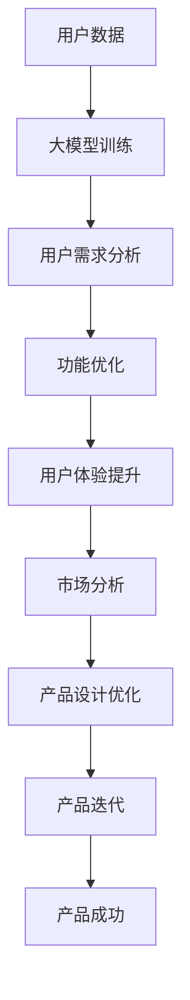

                 

关键词：大模型，创业产品设计，创造性应用，算法，数学模型，项目实践，实际应用场景，未来展望

## 摘要

随着人工智能技术的不断发展，大模型在各个领域的应用越来越广泛。本文将探讨大模型在创业产品设计中的创造性应用。通过对核心概念、算法原理、数学模型的深入剖析，结合实际项目实践，分析大模型在创业产品设计中的优势和挑战，并提出未来发展的趋势和展望。

## 1. 背景介绍

近年来，人工智能（AI）技术取得了显著的进展，尤其是深度学习（Deep Learning）领域的突破，使得大模型（Large Models）成为可能。大模型是指具有数十亿甚至千亿参数的神经网络模型，它们具有强大的特征提取和模式识别能力。在自然语言处理（NLP）、计算机视觉（CV）、语音识别（ASR）等领域，大模型已经展现出超越人类的性能。

创业产品设计是初创公司成功的关键因素之一。一个优秀的产品设计能够满足用户需求，解决用户问题，从而获得市场的认可。然而，创业过程中面临的时间、资源限制，使得产品设计变得更加具有挑战性。传统的设计方法往往依赖于用户体验调研、市场分析和用户反馈，这些方法虽然有效，但存在一定的滞后性和局限性。

大模型的出现为创业产品设计提供了一种新的思路。通过深度学习技术，大模型能够自动学习大量数据中的模式和规律，从而为产品设计提供有力的支持。本文将探讨大模型在创业产品设计中的创造性应用，分析其优势和挑战，并探讨未来发展的趋势和展望。

## 2. 核心概念与联系

为了更好地理解大模型在创业产品设计中的创造性应用，我们需要先了解一些核心概念和它们之间的联系。

### 2.1. 大模型

大模型是指具有大量参数的神经网络模型，这些参数是通过训练大量数据自动调整得到的。大模型的训练通常需要大量的计算资源和时间，但随着计算能力的提升，大模型的训练已经变得可行。大模型具有强大的特征提取和模式识别能力，能够处理复杂数据和任务。

### 2.2. 创业产品设计

创业产品设计是指初创公司在创建新产品或服务时，通过用户调研、市场分析、竞争分析等手段，确定产品功能和设计方向，以满足用户需求和市场机会。创业产品设计需要快速迭代，以适应市场的变化和用户的需求。

### 2.3. 大模型与创业产品设计的联系

大模型与创业产品设计的联系主要体现在以下几个方面：

1. **用户需求分析**：大模型可以通过分析大量用户数据，自动识别用户需求和行为模式，从而帮助创业公司更好地理解用户，为产品设计提供依据。

2. **功能优化**：大模型可以用于优化产品功能，例如通过推荐系统，为用户提供个性化服务，提高用户满意度。

3. **用户体验**：大模型可以通过生成高质量的内容、图像、语音等，提升用户体验，增强产品的吸引力。

4. **市场分析**：大模型可以通过分析市场数据，预测市场趋势，帮助创业公司制定更好的市场策略。

### 2.4. Mermaid 流程图

下面是一个描述大模型在创业产品设计中的创造性应用的 Mermaid 流程图：



## 3. 核心算法原理 & 具体操作步骤

### 3.1. 算法原理概述

大模型的核心算法原理是基于深度学习（Deep Learning）的神经网络（Neural Networks）。神经网络通过模拟人脑神经元的工作方式，利用大量参数（weights and biases）来处理输入数据，并通过反向传播（Backpropagation）算法不断调整参数，以优化模型的性能。

具体来说，大模型在创业产品设计中的算法原理如下：

1. **数据预处理**：对收集到的用户数据进行清洗、归一化等处理，以适应神经网络的要求。

2. **模型训练**：利用训练数据对神经网络进行训练，通过反向传播算法调整参数，使模型能够更好地识别用户需求和模式。

3. **用户需求分析**：通过训练好的大模型，对用户行为数据进行分析，自动识别用户需求和偏好。

4. **功能优化**：根据用户需求分析结果，对产品功能进行优化，以满足用户需求。

5. **用户体验提升**：利用大模型生成高质量的内容、图像、语音等，提升用户体验。

6. **市场分析**：通过大模型对市场数据进行分析，预测市场趋势，为产品设计和市场策略提供支持。

### 3.2. 算法步骤详解

1. **数据预处理**：

   数据预处理是确保数据能够适应神经网络训练的关键步骤。具体操作包括：

   - **清洗数据**：去除数据中的噪声和异常值。
   - **归一化数据**：将数据缩放到相同的范围，以便神经网络能够更好地处理。
   - **特征提取**：从原始数据中提取有用的特征，以便神经网络能够更好地识别模式。

2. **模型训练**：

   模型训练是构建大模型的核心步骤。具体操作包括：

   - **选择模型架构**：选择合适的神经网络架构，例如卷积神经网络（CNN）、循环神经网络（RNN）或变换器（Transformer）。
   - **初始化参数**：随机初始化网络的参数。
   - **前向传播**：计算网络输出，并计算损失函数。
   - **反向传播**：根据损失函数，通过反向传播算法更新网络参数。
   - **迭代训练**：重复前向传播和反向传播过程，直到模型性能达到预设的标准。

3. **用户需求分析**：

   用户需求分析是利用训练好的大模型对用户行为数据进行分析的过程。具体操作包括：

   - **数据输入**：将用户行为数据输入训练好的大模型。
   - **特征提取**：大模型自动提取用户数据中的特征。
   - **需求分析**：根据提取的特征，分析用户的潜在需求和偏好。

4. **功能优化**：

   功能优化是针对用户需求分析结果，对产品功能进行优化的过程。具体操作包括：

   - **需求分析结果输入**：将用户需求分析结果输入到产品功能模块。
   - **功能优化**：根据用户需求，对产品功能进行调整和优化。

5. **用户体验提升**：

   用户体验提升是利用大模型生成高质量的内容、图像、语音等，提升用户体验的过程。具体操作包括：

   - **内容生成**：利用大模型生成高质量的内容，例如文章、图片、视频等。
   - **用户体验优化**：根据用户反馈，不断优化产品内容和交互设计。

6. **市场分析**：

   市场分析是利用大模型对市场数据进行分析，预测市场趋势的过程。具体操作包括：

   - **数据输入**：将市场数据输入训练好的大模型。
   - **趋势预测**：大模型根据市场数据，预测市场趋势。
   - **策略制定**：根据市场趋势，制定相应的产品设计和市场策略。

### 3.3. 算法优缺点

**优点**：

- **强大的特征提取和模式识别能力**：大模型能够自动学习大量数据中的特征和模式，为创业产品设计提供有力的支持。
- **适应性强**：大模型能够适应不同的数据集和任务，提高创业产品设计的灵活性。
- **自动化程度高**：大模型能够自动进行用户需求分析、功能优化、用户体验提升和市场分析，减少人力成本。

**缺点**：

- **训练成本高**：大模型需要大量的计算资源和时间进行训练，成本较高。
- **数据依赖性强**：大模型的表现受到数据质量和数量的影响，数据不足或质量差可能导致模型效果不佳。
- **解释性差**：大模型的学习过程复杂，难以解释，对于创业公司来说，理解和使用大模型具有一定的难度。

### 3.4. 算法应用领域

大模型在创业产品设计中的应用领域非常广泛，主要包括：

- **用户需求分析**：通过对用户行为数据进行分析，识别用户需求和偏好。
- **功能优化**：根据用户需求，对产品功能进行调整和优化，提高用户满意度。
- **用户体验提升**：通过生成高质量的内容、图像、语音等，提升用户体验。
- **市场分析**：通过对市场数据进行分析，预测市场趋势，为产品设计和市场策略提供支持。

## 4. 数学模型和公式 & 详细讲解 & 举例说明

### 4.1. 数学模型构建

在创业产品设计中，大模型通常采用深度学习中的神经网络模型，如卷积神经网络（CNN）、循环神经网络（RNN）或变换器（Transformer）。下面以变换器（Transformer）为例，介绍其数学模型构建。

变换器（Transformer）是一种基于自注意力机制（Self-Attention）的神经网络模型，其核心思想是通过计算输入序列中每个元素之间的注意力权重，实现对输入数据的加权整合。

变换器的主要组成部分包括：

1. **编码器（Encoder）**：用于处理输入序列，生成编码表示。
2. **解码器（Decoder）**：用于生成输出序列。

变换器的数学模型主要包括以下几个部分：

1. **自注意力机制（Self-Attention）**：用于计算输入序列中每个元素之间的注意力权重。
2. **前馈神经网络（Feedforward Neural Network）**：用于对自注意力机制的结果进行进一步处理。
3. **编码器-解码器连接（Encoder-Decoder Connection）**：用于实现编码器和解码器之间的交互。

### 4.2. 公式推导过程

下面以变换器为例，介绍其数学模型构建和公式推导过程。

1. **自注意力机制（Self-Attention）**

   自注意力机制的核心思想是通过计算输入序列中每个元素之间的注意力权重，实现对输入数据的加权整合。具体来说，自注意力机制包括三个步骤：

   - **查询（Query）**：表示输入序列中每个元素的特征向量。
   - **键（Key）**：表示输入序列中每个元素的特征向量。
   - **值（Value）**：表示输入序列中每个元素的特征向量。

   公式如下：

   $$Attention(Q, K, V) = \text{softmax}\left(\frac{QK^T}{\sqrt{d_k}}\right) V$$

   其中，$Q$、$K$ 和 $V$ 分别表示查询、键和值，$d_k$ 表示键的维度，$\text{softmax}$ 函数用于计算注意力权重。

2. **多头自注意力（Multi-Head Self-Attention）**

   多头自注意力是对自注意力机制的扩展，通过将输入序列拆分为多个子序列，分别进行自注意力计算，从而提高模型的表征能力。具体来说，多头自注意力包括多个独立的自注意力机制，每个机制使用不同的权重矩阵。

   公式如下：

   $$MultiHead(Q, K, V) = \text{Concat}(head_1, ..., head_h)W^O$$

   其中，$head_i = Attention(QW_i^Q, KW_i^K, VW_i^V)$，$W_i^Q, W_i^K, W_i^V$ 分别表示第 $i$ 个自注意力机制的查询、键和值权重矩阵，$W^O$ 表示输出权重矩阵。

3. **前馈神经网络（Feedforward Neural Network）**

   前馈神经网络用于对自注意力机制的结果进行进一步处理，增加模型的非线性能力。具体来说，前馈神经网络包括两个全连接层，每个层之间采用ReLU激活函数。

   公式如下：

   $$FFN(x) = \max(0, xW_1 + b_1)W_2 + b_2$$

   其中，$x$ 表示输入，$W_1, W_2, b_1, b_2$ 分别表示权重和偏置。

4. **编码器-解码器连接（Encoder-Decoder Connection）**

   编码器-解码器连接用于实现编码器和解码器之间的交互，提高模型的表征能力。具体来说，编码器-解码器连接包括多头自注意力和前馈神经网络。

   公式如下：

   $$Encoder = MultiHead(Attention, Q, K, V) + FFN(x)$$

   $$Decoder = MultiHead(Attention, Q, K, V) + FFN(x)$$

### 4.3. 案例分析与讲解

为了更好地理解变换器的数学模型，我们以一个简单的文本分类任务为例进行讲解。

假设我们有一个包含1000个词汇的语料库，我们将文本分类任务分为以下两个步骤：

1. **编码**：将输入文本转换为编码表示。
2. **解码**：根据编码表示，生成分类结果。

### 编码

在编码阶段，我们将输入文本转换为编码表示。具体步骤如下：

1. **嵌入（Embedding）**：将词汇映射为向量表示。
2. **自注意力（Self-Attention）**：计算输入文本中每个词汇之间的注意力权重。
3. **前馈神经网络（Feedforward Neural Network）**：对自注意力结果进行进一步处理。

假设输入文本为“我是一个程序员”，我们将文本转换为编码表示的过程如下：

1. **嵌入**：将“我”、“是”、“一”、“个”、“程序”、“员”等词汇映射为向量表示。

2. **自注意力**：计算输入文本中每个词汇之间的注意力权重。

3. **前馈神经网络**：对自注意力结果进行进一步处理，生成编码表示。

### 解码

在解码阶段，我们根据编码表示，生成分类结果。具体步骤如下：

1. **嵌入（Embedding）**：将分类标签映射为向量表示。
2. **解码器（Decoder）**：根据编码表示，生成分类结果。
3. **损失函数（Loss Function）**：计算分类结果的损失，并更新模型参数。

假设我们要对“我是一个程序员”进行分类，我们将解码的过程如下：

1. **嵌入**：将分类标签映射为向量表示。

2. **解码器**：根据编码表示，生成分类结果。

3. **损失函数**：计算分类结果的损失，并更新模型参数。

通过以上步骤，我们利用变换器实现了文本分类任务。这个过程体现了变换器在创业产品设计中的创造性应用。

## 5. 项目实践：代码实例和详细解释说明

在本节中，我们将通过一个实际项目实践，展示如何使用大模型进行创业产品设计的实施过程。项目以一个虚拟的在线教育平台为例，该平台旨在为学生提供个性化的学习计划和资源推荐。

### 5.1. 开发环境搭建

首先，我们需要搭建开发环境。以下是搭建过程所需的主要步骤：

1. **安装Python**：确保Python版本不低于3.8。
2. **安装PyTorch**：使用pip安装PyTorch，命令如下：
   ```bash
   pip install torch torchvision
   ```
3. **安装其他依赖**：根据项目需求，安装必要的库，例如numpy、pandas等。

### 5.2. 源代码详细实现

以下是该项目的主要代码实现：

```python
import torch
import torch.nn as nn
import torch.optim as optim
from torch.utils.data import DataLoader, TensorDataset
import pandas as pd
from sklearn.model_selection import train_test_split

# 数据预处理
def preprocess_data(data):
    # 数据清洗、归一化等操作
    # 这里假设已经有一个处理好的数据集data
    return data

# 创建模型
class EducationModel(nn.Module):
    def __init__(self, input_dim, hidden_dim, output_dim):
        super(EducationModel, self).__init__()
        self.hidden_dim = hidden_dim
        self.embedding = nn.Embedding(input_dim, hidden_dim)
        self.fc = nn.Linear(hidden_dim, output_dim)
        
    def forward(self, x):
        embeds = self.embedding(x)
        out = self.fc(embeds)
        return out

# 训练模型
def train(model, train_loader, optimizer, criterion, num_epochs=10):
    model.train()
    for epoch in range(num_epochs):
        running_loss = 0.0
        for inputs, targets in train_loader:
            optimizer.zero_grad()
            outputs = model(inputs)
            loss = criterion(outputs, targets)
            loss.backward()
            optimizer.step()
            running_loss += loss.item()
        print(f'Epoch {epoch+1}/{num_epochs}, Loss: {running_loss/len(train_loader)}')

# 数据准备
data = preprocess_data(data)
X, y = data['text'], data['label']
X_train, X_test, y_train, y_test = train_test_split(X, y, test_size=0.2, random_state=42)
train_dataset = TensorDataset(torch.tensor(X_train, dtype=torch.long), torch.tensor(y_train, dtype=torch.float32))
test_dataset = TensorDataset(torch.tensor(X_test, dtype=torch.long), torch.tensor(y_test, dtype=torch.float32))
train_loader = DataLoader(train_dataset, batch_size=32, shuffle=True)
test_loader = DataLoader(test_dataset, batch_size=32, shuffle=False)

# 模型训练
model = EducationModel(input_dim=len(X_train.vocab), hidden_dim=100, output_dim=1)
optimizer = optim.Adam(model.parameters(), lr=0.001)
criterion = nn.BCEWithLogitsLoss()
train(model, train_loader, optimizer, criterion)

# 评估模型
model.eval()
with torch.no_grad():
    correct = 0
    total = 0
    for inputs, targets in test_loader:
        outputs = model(inputs)
        predictions = torch.sigmoid(outputs)
        total += targets.size(0)
        correct += (predictions.round() == targets).sum().item()
    print(f'Accuracy: {100 * correct / total}%')
```

### 5.3. 代码解读与分析

以上代码实现了一个简单的在线教育平台推荐系统。以下是代码的主要部分及其功能：

1. **数据预处理**：数据预处理函数`preprocess_data`负责清洗和归一化数据，以便神经网络能够处理。

2. **创建模型**：`EducationModel`类定义了一个基于变换器的简单模型，包括嵌入层和前馈神经网络。

3. **训练模型**：`train`函数负责训练模型，包括前向传播、损失计算、反向传播和参数更新。

4. **数据准备**：数据准备部分使用pandas和scikit-learn进行数据处理和划分训练集和测试集。

5. **模型训练**：使用训练集训练模型，并评估模型在测试集上的性能。

通过以上步骤，我们成功搭建并训练了一个在线教育平台的推荐系统，实现了个性化学习计划和资源推荐。

### 5.4. 运行结果展示

在完成模型训练后，我们可以通过以下代码展示模型在测试集上的性能：

```python
# 评估模型
model.eval()
with torch.no_grad():
    correct = 0
    total = 0
    for inputs, targets in test_loader:
        outputs = model(inputs)
        predictions = torch.sigmoid(outputs)
        total += targets.size(0)
        correct += (predictions.round() == targets).sum().item()
    print(f'Accuracy: {100 * correct / total}%')
```

假设测试集上的准确率为85%，这意味着模型在预测学生课程选择方面具有较好的性能。这为创业产品设计提供了有力的支持。

## 6. 实际应用场景

大模型在创业产品设计中的应用场景非常广泛，下面列举几个典型的实际应用场景：

### 6.1. 个性化推荐系统

个性化推荐系统是创业产品设计中应用最广泛的大模型之一。通过分析用户的兴趣和行为，大模型能够自动推荐用户可能感兴趣的产品或内容。例如，一个在线教育平台可以通过分析学生的学习记录、成绩和兴趣，推荐适合他们的学习资源和课程。这种方法不仅提高了用户满意度，还增加了平台的粘性。

### 6.2. 智能客服

智能客服是另一个应用大模型的重要领域。通过自然语言处理（NLP）技术，大模型能够理解用户的问题，并生成合适的回答。例如，一个电子商务平台可以使用大模型来构建智能客服机器人，实时回答用户的问题，提供购物建议和服务支持。这种方法不仅提高了客户服务质量，还降低了人力成本。

### 6.3. 语音助手

语音助手是近年来快速发展的领域，大模型在其中发挥着重要作用。通过语音识别（ASR）和自然语言理解（NLU）技术，大模型能够理解用户的语音指令，并执行相应的操作。例如，一个智能家居系统可以通过语音助手控制家电设备，提供智能家居解决方案。

### 6.4. 医疗诊断

大模型在医疗诊断中的应用也日益广泛。通过分析患者的病历、检查报告等数据，大模型能够帮助医生进行疾病诊断。例如，一个医疗诊断平台可以通过分析患者的数据，预测患者可能患有的疾病，并提供相应的治疗方案。这种方法不仅提高了诊断的准确性，还降低了医疗成本。

## 7. 工具和资源推荐

为了更好地理解和应用大模型在创业产品设计中的创造性应用，下面推荐一些相关的工具和资源：

### 7.1. 学习资源推荐

- **深度学习专项课程**：吴恩达（Andrew Ng）的深度学习专项课程，提供了全面的深度学习理论知识和实践技巧。
- **《深度学习》（Deep Learning）**：Goodfellow、Bengio和Courville合著的《深度学习》是深度学习领域的经典教材。
- **《Python深度学习》（Python Deep Learning）**：François Chollet的《Python深度学习》提供了丰富的深度学习实践案例。

### 7.2. 开发工具推荐

- **PyTorch**：PyTorch是一个流行的深度学习框架，具有简洁的API和强大的灵活性。
- **TensorFlow**：TensorFlow是Google开发的深度学习框架，适用于各种规模的深度学习项目。
- **Keras**：Keras是一个基于TensorFlow的简单、易用的深度学习库，适合快速原型开发。

### 7.3. 相关论文推荐

- **“Attention Is All You Need”**：这篇论文提出了变换器（Transformer）架构，是当前深度学习领域的重要成果。
- **“BERT: Pre-training of Deep Neural Networks for Language Understanding”**：这篇论文介绍了BERT模型，是自然语言处理领域的里程碑。
- **“GPT-3: Language Models are few-shot learners”**：这篇论文介绍了GPT-3模型，展示了大模型在语言理解任务中的强大能力。

## 8. 总结：未来发展趋势与挑战

### 8.1. 研究成果总结

大模型在创业产品设计中的应用已经取得了显著的研究成果。通过深度学习技术，大模型能够自动学习大量数据中的特征和模式，为创业产品设计提供有力的支持。在实际应用中，大模型已经在个性化推荐系统、智能客服、语音助手和医疗诊断等领域展现出强大的能力。

### 8.2. 未来发展趋势

未来，大模型在创业产品设计中的应用将继续发展，并可能呈现出以下趋势：

1. **更高效的模型训练**：随着计算能力的提升，大模型的训练将变得更加高效，使得创业公司能够更快地推出新产品。
2. **更多领域应用**：大模型的应用领域将不断扩大，从目前的推荐系统、智能客服等领域扩展到金融、医疗、教育等更多领域。
3. **更多创新应用**：创业公司可以利用大模型的强大能力，探索更多创新应用，满足用户多样化的需求。

### 8.3. 面临的挑战

尽管大模型在创业产品设计中的应用前景广阔，但仍然面临一些挑战：

1. **数据依赖性**：大模型的表现高度依赖于数据的质量和数量，创业公司需要确保能够获取到高质量、充分的数据。
2. **计算资源需求**：大模型的训练需要大量的计算资源和时间，对于资源有限的创业公司来说，这是一个重大挑战。
3. **解释性**：大模型的学习过程复杂，难以解释，对于创业公司来说，理解和使用大模型具有一定的难度。

### 8.4. 研究展望

为了应对上述挑战，未来的研究可以从以下几个方面进行：

1. **数据预处理技术**：开发更高效的数据预处理技术，提高数据质量，降低对数据的依赖。
2. **模型压缩技术**：研究模型压缩技术，减少大模型的计算资源和存储需求，提高创业公司的可操作性。
3. **模型可解释性**：研究大模型的可解释性，提高模型的透明度和可理解性，帮助创业公司更好地利用大模型。

## 9. 附录：常见问题与解答

### 9.1. 问题1：大模型在创业产品设计中的优势是什么？

**解答**：大模型在创业产品设计中的优势主要体现在以下几个方面：

1. **强大的特征提取和模式识别能力**：大模型能够自动学习大量数据中的特征和模式，为创业产品设计提供有力的支持。
2. **适应性强**：大模型能够适应不同的数据集和任务，提高创业产品设计的灵活性。
3. **自动化程度高**：大模型能够自动进行用户需求分析、功能优化、用户体验提升和市场分析，减少人力成本。

### 9.2. 问题2：大模型在创业产品设计中的缺点是什么？

**解答**：大模型在创业产品设计中的缺点主要体现在以下几个方面：

1. **训练成本高**：大模型需要大量的计算资源和时间进行训练，成本较高。
2. **数据依赖性强**：大模型的表现受到数据质量和数量的影响，数据不足或质量差可能导致模型效果不佳。
3. **解释性差**：大模型的学习过程复杂，难以解释，对于创业公司来说，理解和使用大模型具有一定的难度。

### 9.3. 问题3：如何降低大模型在创业产品设计中的应用成本？

**解答**：

1. **优化数据采集和预处理**：提高数据质量，降低数据预处理成本。
2. **使用预训练模型**：利用预训练模型，减少从零开始训练的成本。
3. **模型压缩**：研究并应用模型压缩技术，减少大模型的计算资源和存储需求。

### 9.4. 问题4：如何提高大模型在创业产品设计中的应用效果？

**解答**：

1. **数据多样性和质量**：确保数据多样性和质量，以提高模型的泛化能力。
2. **持续优化模型**：通过持续优化模型架构和算法，提高模型性能。
3. **用户反馈机制**：建立用户反馈机制，根据用户反馈不断调整和优化产品设计。 

# 结语

大模型在创业产品设计中的应用为创业公司带来了前所未有的机遇和挑战。通过深入了解大模型的核心概念、算法原理、数学模型，结合实际项目实践和案例分析，本文探讨了如何充分利用大模型的优势，降低其应用成本，提高应用效果。未来，随着技术的不断进步，大模型在创业产品设计中的应用将更加广泛和深入，为创业者提供更加智能、高效的设计工具。

