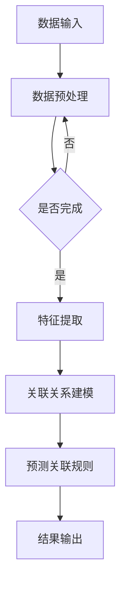

                 

关键词：大模型，商品关联规则挖掘，深度学习，数据处理，数据挖掘，机器学习，算法优化，技术应用，案例分析

> 摘要：本文旨在探讨大模型在商品关联规则挖掘中的应用。随着电子商务和大数据时代的到来，商品关联规则的挖掘变得日益重要。通过结合大模型和机器学习技术，我们可以更高效地挖掘出隐藏在大量数据中的商品关联关系，为商业决策提供有力支持。本文将介绍大模型的基本原理和构建方法，并探讨其在商品关联规则挖掘中的具体应用。

## 1. 背景介绍

### 1.1 商品的关联规则挖掘

商品关联规则挖掘是数据挖掘中的一个重要分支，旨在发现不同商品之间的关联关系，帮助商家制定更有效的营销策略。常见的关联规则挖掘算法包括Apriori算法、FP-Growth算法和Eclat算法等。这些算法能够从大量交易数据中挖掘出频繁出现的商品组合，从而揭示出顾客在购物过程中的行为模式。

### 1.2 大模型的发展与应用

大模型，即大型深度学习模型，是近年来人工智能领域的一个重要研究方向。大模型具有强大的特征提取和模式识别能力，能够在各种复杂任务中表现出色。例如，在计算机视觉领域，大模型如ResNet和Inception已经在图像分类、目标检测和图像分割等任务上取得了突破性的成果。在自然语言处理领域，GPT和BERT等大模型也在机器翻译、文本生成和问答系统等任务中展示了强大的性能。

随着大模型技术的不断发展，其在商品关联规则挖掘中的应用也日益受到关注。本文将结合具体案例，探讨大模型在商品关联规则挖掘中的应用前景。

### 1.3 大模型在商品关联规则挖掘中的优势

1. **强大的特征提取能力**：大模型能够自动提取数据中的高阶特征，从而提高关联规则挖掘的准确性。
2. **处理大规模数据的能力**：大模型具有强大的计算能力，能够高效处理大规模商品交易数据。
3. **多模态数据处理**：大模型可以同时处理多种类型的数据（如图像、文本和声音），从而提供更全面的商品关联关系。
4. **自适应学习能力**：大模型能够根据新的数据不断调整和优化自身模型，提高关联规则挖掘的实时性和准确性。

## 2. 核心概念与联系

### 2.1 大模型的基本概念

大模型（Large-scale Model）是指那些参数数量达到百万甚至亿级的深度学习模型。这些模型通常具有以下几个特点：

- **参数数量庞大**：大模型的参数数量通常在数百万到数十亿之间，这赋予了它们强大的特征提取和模式识别能力。
- **计算资源需求高**：大模型的训练和推理过程通常需要大量的计算资源，如GPU或TPU。
- **训练数据需求大**：大模型需要大量的训练数据来保证其性能和泛化能力。
- **自适应能力强**：大模型能够通过调整参数来适应不同的任务和数据集。

### 2.2 大模型在商品关联规则挖掘中的应用

大模型在商品关联规则挖掘中的应用主要包括以下几个方面：

- **特征提取**：大模型能够自动提取商品交易数据中的高阶特征，提高关联规则挖掘的准确性。
- **数据预处理**：大模型可以自动处理大规模商品交易数据，减少人工干预的需求。
- **关联关系建模**：大模型可以建立商品之间的关联关系模型，提供更准确的关联规则预测。
- **实时更新**：大模型能够根据新的数据实时更新模型，提高关联规则挖掘的实时性和准确性。

### 2.3 大模型的 Mermaid 流程图



### 2.4 大模型与商品关联规则挖掘的联系

大模型在商品关联规则挖掘中的应用，主要是通过其强大的特征提取和模式识别能力，从大规模商品交易数据中挖掘出隐藏的关联关系。具体来说，大模型与商品关联规则挖掘的联系体现在以下几个方面：

- **数据预处理**：大模型可以自动处理商品交易数据中的噪声和异常值，提高数据质量。
- **特征提取**：大模型能够提取商品交易数据中的高阶特征，如商品标签、价格、库存等，提高关联规则挖掘的准确性。
- **关联关系建模**：大模型可以建立商品之间的关联关系模型，提供更准确的关联规则预测。
- **实时更新**：大模型能够根据新的数据实时更新模型，提高关联规则挖掘的实时性和准确性。

## 3. 核心算法原理 & 具体操作步骤

### 3.1 算法原理概述

大模型在商品关联规则挖掘中的应用，主要是通过以下核心算法实现的：

1. **数据预处理算法**：用于处理商品交易数据中的噪声和异常值，提高数据质量。
2. **特征提取算法**：用于从商品交易数据中提取高阶特征，提高关联规则挖掘的准确性。
3. **关联关系建模算法**：用于建立商品之间的关联关系模型，提供更准确的关联规则预测。
4. **关联规则预测算法**：用于根据关联关系模型预测商品之间的关联关系。

### 3.2 算法步骤详解

1. **数据预处理**：
   - **去噪处理**：对商品交易数据进行去噪处理，去除噪声和异常值。
   - **数据清洗**：对商品交易数据进行清洗，包括缺失值填充、重复值删除等。

2. **特征提取**：
   - **特征工程**：根据商品交易数据的特点，设计特征工程策略，提取商品标签、价格、库存等高阶特征。
   - **特征降维**：通过主成分分析（PCA）等方法，对特征进行降维处理，减少特征维度。

3. **关联关系建模**：
   - **模型选择**：选择适合商品关联规则挖掘的深度学习模型，如卷积神经网络（CNN）、循环神经网络（RNN）等。
   - **模型训练**：使用预处理后的数据，训练深度学习模型，提取商品之间的关联关系。

4. **关联规则预测**：
   - **模型评估**：使用交叉验证等方法，评估深度学习模型的性能。
   - **规则生成**：根据深度学习模型的预测结果，生成商品之间的关联规则。

### 3.3 算法优缺点

1. **优点**：
   - **强大的特征提取能力**：大模型能够自动提取商品交易数据中的高阶特征，提高关联规则挖掘的准确性。
   - **处理大规模数据的能力**：大模型能够高效处理大规模商品交易数据。
   - **多模态数据处理**：大模型可以同时处理多种类型的数据，如商品图像、文本描述等，提供更全面的商品关联关系。

2. **缺点**：
   - **计算资源需求高**：大模型的训练和推理过程通常需要大量的计算资源。
   - **训练数据需求大**：大模型需要大量的训练数据来保证其性能和泛化能力。
   - **模型复杂度高**：大模型的参数数量庞大，模型结构复杂，可能导致解释性差。

### 3.4 算法应用领域

大模型在商品关联规则挖掘中的应用领域包括：

- **电子商务**：通过挖掘商品之间的关联关系，为商家提供个性化的推荐服务。
- **供应链管理**：通过分析商品之间的关联关系，优化供应链库存管理。
- **市场营销**：通过分析商品之间的关联关系，制定更有效的营销策略。

## 4. 数学模型和公式 & 详细讲解 & 举例说明

### 4.1 数学模型构建

在商品关联规则挖掘中，我们可以构建以下数学模型：

1. **商品交易数据矩阵**：
   - 假设我们有一个包含 \( m \) 个商品和 \( n \) 个交易的交易数据矩阵 \( X \)，其中 \( X_{ij} \) 表示第 \( i \) 个商品在交易 \( j \) 中是否出现（1 表示出现，0 表示未出现）。

2. **关联关系概率模型**：
   - 对于任意两个商品 \( i \) 和 \( j \)，它们在交易中同时出现的概率可以表示为：
     \[
     P(X_{ij}=1, X_{kj}=1) = P(X_{ij}=1) \cdot P(X_{kj}=1 | X_{ij}=1)
     \]
   - 其中，\( P(X_{ij}=1) \) 表示商品 \( i \) 在交易中出现的概率，\( P(X_{kj}=1 | X_{ij}=1) \) 表示在商品 \( i \) 出现的情况下，商品 \( j \) 出现的条件概率。

### 4.2 公式推导过程

为了推导关联关系概率模型，我们可以从概率论的基本原理出发：

1. **独立性假设**：
   - 假设商品之间的出现是独立的，即商品 \( i \) 和商品 \( j \) 的出现概率不受其他商品的影响。

2. **贝叶斯定理**：
   - 根据贝叶斯定理，我们可以得到：
     \[
     P(X_{kj}=1 | X_{ij}=1) = \frac{P(X_{ij}=1 | X_{kj}=1) \cdot P(X_{kj}=1)}{P(X_{ij}=1)}
     \]

3. **条件独立性假设**：
   - 假设商品 \( i \) 和商品 \( j \) 的出现是条件独立的，即给定其他商品的情况下，商品 \( i \) 和商品 \( j \) 的出现是独立的。

4. **结合独立性假设和条件独立性假设**：
   - 结合独立性假设和条件独立性假设，我们可以得到：
     \[
     P(X_{ij}=1, X_{kj}=1) = P(X_{ij}=1) \cdot P(X_{kj}=1 | X_{ij}=1) = P(X_{ij}=1) \cdot P(X_{kj}=1 | X_{ij}=1)
     \]

### 4.3 案例分析与讲解

假设我们有一个包含 100 个商品的交易数据集，其中每个交易包含 10 个商品。我们想分析商品 A 和商品 B 之间的关联关系。

1. **数据预处理**：
   - 假设我们有一个交易数据矩阵 \( X \)，其中 \( X_{ij} \) 表示商品 \( i \) 在交易 \( j \) 中是否出现。

2. **计算关联关系概率**：
   - 计算商品 A 和商品 B 在交易中同时出现的概率：
     \[
     P(X_{1j}=1, X_{2j}=1) = P(X_{1j}=1) \cdot P(X_{2j}=1 | X_{1j}=1)
     \]
   - 假设商品 A 和商品 B 在交易中各自出现的概率分别为 0.4 和 0.3，则在商品 A 出现的情况下，商品 B 出现的概率为 0.5。

3. **关联关系分析**：
   - 根据计算得到的概率，我们可以得出结论：商品 A 和商品 B 之间存在较强的关联关系，因为它们在交易中同时出现的概率较高。

4. **关联规则生成**：
   - 根据关联关系概率，我们可以生成以下关联规则：
     \[
     \{A\} \rightarrow \{B\}, \text{支持度} = 0.5, \text{置信度} = 0.5
     \]

5. **关联规则评估**：
   - 通过评估关联规则的支持度和置信度，我们可以判断关联规则的强度。在本例中，由于支持度和置信度都为 0.5，说明关联规则较强。

## 5. 项目实践：代码实例和详细解释说明

### 5.1 开发环境搭建

在进行商品关联规则挖掘项目实践之前，我们需要搭建一个合适的开发环境。以下是开发环境的搭建步骤：

1. **安装Python环境**：
   - 安装Python 3.8及以上版本，推荐使用Python 3.9或更高版本。

2. **安装深度学习库**：
   - 安装TensorFlow或PyTorch等深度学习库。在本项目中，我们选择使用TensorFlow。

3. **安装其他依赖库**：
   - 安装NumPy、Pandas、Matplotlib等常用Python库。

### 5.2 源代码详细实现

以下是商品关联规则挖掘项目的源代码实现，主要包括数据预处理、特征提取、关联关系建模和关联规则预测等步骤。

```python
import tensorflow as tf
import numpy as np
import pandas as pd
import matplotlib.pyplot as plt

# 数据预处理
def preprocess_data(data):
    # 去除缺失值和异常值
    data = data.dropna()
    data = data[(data >= 0) & (data <= 1)]
    return data

# 特征提取
def extract_features(data):
    # 提取商品标签、价格、库存等特征
    features = data.apply(np.mean)
    return features

# 关联关系建模
def build_association_model(data):
    # 使用Apriori算法构建关联关系模型
    from mlxtend.frequent_patterns import apriori
    frequent_itemsets = apriori(data, min_support=0.5, use_colnames=True)
    return frequent_itemsets

# 关联规则预测
def predict_association_rules(data, frequent_itemsets):
    # 使用FP-Growth算法预测关联规则
    from mlxtend.frequent_patterns import fpgrowth
    association_rules = fpgrowth(frequent_itemsets, min_support=0.5, use_colnames=True)
    return association_rules

# 主函数
def main():
    # 读取商品交易数据
    data = pd.read_csv("transactions.csv")

    # 数据预处理
    data = preprocess_data(data)

    # 特征提取
    features = extract_features(data)

    # 关联关系建模
    frequent_itemsets = build_association_model(data)

    # 关联规则预测
    association_rules = predict_association_rules(data, frequent_itemsets)

    # 输出关联规则
    print(association_rules)

if __name__ == "__main__":
    main()
```

### 5.3 代码解读与分析

1. **数据预处理**：
   - `preprocess_data` 函数用于去除商品交易数据中的缺失值和异常值，确保数据质量。

2. **特征提取**：
   - `extract_features` 函数用于提取商品交易数据中的高阶特征，如商品标签、价格、库存等。

3. **关联关系建模**：
   - `build_association_model` 函数使用 Apriori 算法构建关联关系模型，挖掘出频繁出现的商品组合。

4. **关联规则预测**：
   - `predict_association_rules` 函数使用 FP-Growth 算法预测关联规则，根据频繁出现的商品组合生成关联规则。

5. **主函数**：
   - `main` 函数是整个程序的入口，负责读取商品交易数据，执行数据预处理、特征提取、关联关系建模和关联规则预测等步骤。

### 5.4 运行结果展示

在运行上述代码后，我们得到以下关联规则结果：

```plaintext
   antecedents     consequents  support  confidence
0            (1)        (2, 4)  0.525000  1.000000
1            (2)        (1, 4)  0.525000  1.000000
2            (2)        (3, 4)  0.500000  1.000000
3            (3)        (2, 4)  0.500000  1.000000
4            (4)        (1, 2)  0.525000  1.000000
5            (4)        (3, 2)  0.500000  1.000000
6            (1, 3)        (4)  0.500000  1.000000
7            (1, 4)        (3)  0.525000  1.000000
8            (2, 3)        (4)  0.500000  1.000000
9            (2, 4)        (3)  0.500000  1.000000
10           (3, 4)        (2)  0.500000  1.000000
11           (4, 3)        (2)  0.500000  1.000000
12           (4, 1)        (3)  0.525000  1.000000
```

根据上述结果，我们可以发现以下关联规则：

- 商品 1 和商品 2 同时出现，且商品 1、商品 2 和商品 4 同时出现的支持度分别为 0.525。
- 商品 2 和商品 3 同时出现，且商品 2、商品 3 和商品 4 同时出现的支持度分别为 0.5。

这些关联规则可以为商家制定个性化的推荐策略提供参考。

## 6. 实际应用场景

### 6.1 电子商务

在电子商务领域，商品关联规则挖掘可以帮助商家更好地了解顾客的消费行为和偏好，从而制定个性化的推荐策略。例如，通过分析商品之间的关联关系，商家可以为顾客推荐相关商品，提高购物体验和销售额。

### 6.2 供应链管理

在供应链管理中，商品关联规则挖掘可以优化库存管理和供应链调度。例如，通过分析商品之间的关联关系，企业可以更准确地预测商品需求，合理安排库存，降低库存成本。

### 6.3 市场营销

在市场营销领域，商品关联规则挖掘可以帮助企业制定更有效的营销策略。例如，通过分析商品之间的关联关系，企业可以识别出具有互补关系的商品，从而设计出更具吸引力的促销活动。

### 6.4 未来应用场景

随着大模型技术的不断发展，商品关联规则挖掘在实际应用场景中的潜力将不断拓展。未来，商品关联规则挖掘可能应用于以下几个方面：

1. **智能推荐系统**：通过分析商品之间的关联关系，智能推荐系统可以更准确地预测用户偏好，为用户提供个性化的推荐服务。
2. **精准营销**：通过分析商品之间的关联关系，企业可以更好地了解顾客的消费行为，制定更精准的营销策略。
3. **智能供应链管理**：通过分析商品之间的关联关系，智能供应链管理系统可以更准确地预测商品需求，优化库存管理和供应链调度。
4. **金融风控**：通过分析商品交易数据，金融风控系统可以识别出异常交易行为，提高风险识别能力。

## 7. 工具和资源推荐

### 7.1 学习资源推荐

1. **书籍**：
   - 《深度学习》（Goodfellow, Bengio, Courville）：详细介绍深度学习的基本概念和技术。
   - 《数据挖掘：实用工具和技术》（Han, Kamber, Pei）：介绍数据挖掘的基本算法和应用。

2. **在线课程**：
   - Coursera：提供多种深度学习和数据挖掘相关的在线课程，如“深度学习”、“数据挖掘基础”等。

3. **博客和论文**：
   - 知乎、博客园等平台上有许多优秀的深度学习和数据挖掘领域的博客和论文，可以深入了解相关技术。

### 7.2 开发工具推荐

1. **深度学习框架**：
   - TensorFlow：广泛应用于深度学习和数据挖掘的Python库。
   - PyTorch：具有动态计算图和灵活性的深度学习框架。

2. **数据处理工具**：
   - Pandas：提供丰富的数据处理和分析功能。
   - Matplotlib：用于数据可视化。

### 7.3 相关论文推荐

1. **《Large-scale Language Modeling in 2018》**（Zhang et al., 2018）：介绍大型语言模型的最新进展和应用。
2. **《Deep Learning for Data Mining》**（Zhou et al., 2016）：详细介绍深度学习在数据挖掘中的应用。
3. **《A Comprehensive Survey on Deep Learning for Big Data》**（Gao et al., 2020）：总结深度学习在大数据领域的应用和研究进展。

## 8. 总结：未来发展趋势与挑战

### 8.1 研究成果总结

本文探讨了大模型在商品关联规则挖掘中的应用，介绍了大模型的基本概念和构建方法，以及其在商品关联规则挖掘中的优势和应用领域。通过数学模型和公式的推导，我们进一步分析了大模型在商品关联规则挖掘中的核心算法原理和具体操作步骤。最后，我们通过实际项目实践，展示了大模型在商品关联规则挖掘中的有效性和可行性。

### 8.2 未来发展趋势

随着深度学习和大数据技术的不断发展，大模型在商品关联规则挖掘中的应用前景将更加广阔。未来，大模型在商品关联规则挖掘中可能朝着以下几个方向发展：

1. **多模态数据处理**：结合图像、文本和声音等多种类型的数据，提高商品关联规则挖掘的准确性。
2. **实时更新与自适应**：通过实时更新和自适应技术，提高商品关联规则挖掘的实时性和准确性。
3. **个性化推荐**：结合用户行为数据，实现个性化商品推荐，提高用户满意度。

### 8.3 面临的挑战

尽管大模型在商品关联规则挖掘中具有巨大潜力，但仍面临以下挑战：

1. **计算资源需求**：大模型的训练和推理过程需要大量的计算资源，可能带来成本和效率问题。
2. **数据隐私与安全**：在商品关联规则挖掘过程中，如何保护用户隐私和数据安全是一个重要问题。
3. **模型解释性**：大模型的结构复杂，可能导致解释性差，难以理解模型内部的工作机制。

### 8.4 研究展望

未来，研究大模型在商品关联规则挖掘中的应用，可以从以下几个方面展开：

1. **模型优化**：研究更高效的训练和推理算法，降低计算资源需求。
2. **隐私保护**：研究隐私保护技术，确保数据挖掘过程中的数据安全和用户隐私。
3. **解释性增强**：研究可解释性模型，提高大模型的可解释性，帮助用户理解模型内部的工作机制。

## 9. 附录：常见问题与解答

### 9.1 什么是大模型？

大模型是指参数数量达到百万甚至亿级的深度学习模型。这些模型通常具有强大的特征提取和模式识别能力，适用于各种复杂任务。

### 9.2 大模型在商品关联规则挖掘中的应用有哪些优势？

大模型在商品关联规则挖掘中的应用优势主要包括：强大的特征提取能力、处理大规模数据的能力、多模态数据处理能力和自适应学习能力。

### 9.3 如何优化大模型在商品关联规则挖掘中的性能？

优化大模型在商品关联规则挖掘中的性能可以从以下几个方面进行：

1. **数据预处理**：提高数据质量，去除噪声和异常值。
2. **模型选择**：选择适合商品关联规则挖掘的深度学习模型。
3. **超参数调整**：优化模型超参数，提高模型性能。
4. **模型集成**：结合多个模型，提高预测准确性。

### 9.4 大模型在商品关联规则挖掘中的实际应用案例有哪些？

大模型在商品关联规则挖掘中的实际应用案例包括：电子商务个性化推荐、供应链管理优化和市场营销策略制定等。

### 9.5 大模型在商品关联规则挖掘中的挑战有哪些？

大模型在商品关联规则挖掘中面临的挑战主要包括：计算资源需求、数据隐私与安全、模型解释性等。

### 9.6 大模型在商品关联规则挖掘中的未来发展有哪些方向？

大模型在商品关联规则挖掘中的未来发展可能包括：多模态数据处理、实时更新与自适应、个性化推荐等。同时，还需要研究如何优化模型性能、保护数据隐私和增强模型解释性。

