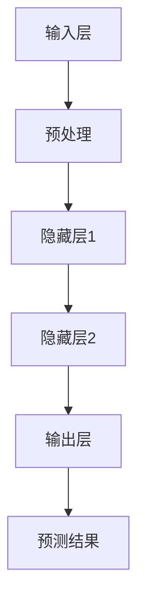
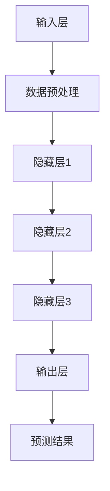

                 

关键词：大模型、商品属性预测、补全精确化、机器学习、算法优化

## 摘要

本文旨在探讨大模型在商品属性预测与补全精确化中的应用。随着大数据和人工智能技术的快速发展，商品属性预测与补全已经成为电子商务领域的关键任务。本文将首先介绍大模型的基本原理和架构，然后深入分析其在商品属性预测与补全中的具体应用，并通过数学模型和项目实践进行详细解释和实例展示。最后，本文将对大模型在商品属性预测与补全领域的未来应用前景进行展望。

## 1. 背景介绍

### 1.1 大模型的发展背景

大模型（Large Model）是指参数数量达到百万甚至亿级别的深度神经网络模型。自2012年深度学习领域取得突破性进展以来，大模型的研究与应用得到了广泛关注。随着计算能力的提升和数据量的增长，大模型在自然语言处理、计算机视觉、语音识别等多个领域取得了显著的成果。

### 1.2 商品属性预测与补全的挑战

在电子商务领域，商品属性预测与补全是提高用户体验、提升商品销售效率的重要手段。然而，商品属性数据的多样性和复杂性带来了诸多挑战：

1. 数据缺失：商品属性数据往往存在大量缺失值，导致模型训练困难。
2. 数据不一致：不同来源的商品属性数据可能存在不同的表达方式和格式，增加数据处理的难度。
3. 属性复杂性：商品属性种类繁多，且相互之间存在复杂的关联关系，需要有效的模型进行预测与补全。

### 1.3 大模型在商品属性预测与补全中的作用

大模型在商品属性预测与补全中具有以下优势：

1. 强泛化能力：大模型能够通过大量数据进行训练，从而具备较强的泛化能力，能够处理各种复杂的商品属性。
2. 高效处理：大模型能够高效地处理大量数据，快速完成商品属性的预测与补全任务。
3. 深度理解：大模型能够通过多层神经网络学习到商品属性之间的深层次关系，从而提高预测与补全的准确性。

## 2. 核心概念与联系

### 2.1 大模型基本原理

大模型通常由多层神经网络组成，包括输入层、隐藏层和输出层。每层神经网络的神经元通过权重连接，形成一个复杂的网络结构。大模型通过反向传播算法进行训练，不断调整权重，使得模型的输出结果更加接近真实值。

### 2.2 大模型架构

大模型架构可以分为以下几个部分：

1. **输入层**：接收商品属性数据，包括原始数据和预处理后的数据。
2. **隐藏层**：通过非线性激活函数对输入数据进行处理，提取特征信息。
3. **输出层**：生成预测结果，如商品属性值或补全结果。

### 2.3 Mermaid 流程图

以下是商品属性预测与补全的大模型架构的 Mermaid 流程图：



## 3. 核心算法原理 & 具体操作步骤

### 3.1 算法原理概述

商品属性预测与补全的核心算法是基于深度神经网络的大模型。该模型通过学习商品属性数据，提取特征信息，从而实现预测与补全任务。具体包括以下几个步骤：

1. 数据预处理：对商品属性数据进行清洗、归一化等处理。
2. 模型训练：利用训练数据对大模型进行训练，不断调整权重。
3. 预测与补全：利用训练好的模型对未知商品属性进行预测与补全。

### 3.2 算法步骤详解

1. **数据预处理**

   - 数据清洗：去除缺失值、重复值等无效数据。
   - 归一化：将不同量纲的属性数据进行归一化处理，使得数据在相同尺度下进行比较。
   - 特征提取：提取商品属性的主要特征，如类别特征、数值特征等。

2. **模型训练**

   - 模型初始化：初始化大模型的权重。
   - 前向传播：将输入数据传递到模型中，计算预测结果。
   - 反向传播：根据预测结果与真实值的差异，计算损失函数，并更新模型权重。
   - 模型优化：利用优化算法（如梯度下降、Adam等）不断调整模型参数，直至达到预设的精度。

3. **预测与补全**

   - 输入未知商品属性数据。
   - 利用训练好的模型进行预测，输出预测结果。
   - 根据预测结果对未知商品属性进行补全。

### 3.3 算法优缺点

**优点：**

1. 强泛化能力：大模型能够处理各种复杂的商品属性数据。
2. 高效处理：大模型能够快速完成商品属性的预测与补全任务。
3. 深度理解：大模型能够学习到商品属性之间的深层次关系。

**缺点：**

1. 计算资源需求高：大模型需要大量的计算资源和存储空间。
2. 数据质量要求高：数据质量对大模型的效果有较大影响。

### 3.4 算法应用领域

1. 商品推荐系统：利用大模型对商品属性进行预测与补全，提高推荐系统的准确性。
2. 商品信息补全：对于缺失的商品属性，利用大模型进行补全，提高商品信息完整性。
3. 商品数据分析：利用大模型对商品属性进行预测与补全，挖掘商品之间的关联关系，为决策提供支持。

## 4. 数学模型和公式

### 4.1 数学模型构建

商品属性预测与补全的数学模型基于深度神经网络。具体包括以下部分：

1. **输入层**：表示为 \(X\)，包括 \(m\) 个商品属性，每个属性有 \(n\) 个取值。
2. **隐藏层**：表示为 \(H\)，包括多个隐藏层，每层有 \(l\) 个神经元。
3. **输出层**：表示为 \(Y\)，包括 \(k\) 个预测结果。

### 4.2 公式推导过程

假设输入数据 \(X\) 经过预处理后得到 \(X'\)，则：

1. **前向传播**：

   $$ H^{(l)} = \sigma(W^{(l-1)}X' + b^{(l-1)}) $$

   其中，\(W^{(l-1)}\) 和 \(b^{(l-1)}\) 分别为第 \(l-1\) 层到第 \(l\) 层的权重和偏置，\(\sigma\) 为激活函数。

2. **损失函数**：

   $$ L = \frac{1}{2} \sum_{i=1}^{k} (Y_i - \sigma(W^{(l)}H^{(l)} + b^{(l)}))^2 $$

   其中，\(Y_i\) 为第 \(i\) 个预测结果，\(\sigma\) 为激活函数。

3. **反向传播**：

   $$ \Delta W^{(l)} = \frac{\partial L}{\partial W^{(l)}} = \frac{\partial L}{\partial Y_i} \frac{\partial Y_i}{\partial \sigma(W^{(l)}H^{(l)} + b^{(l)})} \frac{\partial \sigma(W^{(l)}H^{(l)} + b^{(l)})}{\partial W^{(l)}H^{(l)}} $$

   $$ \Delta b^{(l)} = \frac{\partial L}{\partial b^{(l)}} = \frac{\partial L}{\partial Y_i} \frac{\partial Y_i}{\partial \sigma(W^{(l)}H^{(l)} + b^{(l)})} \frac{\partial \sigma(W^{(l)}H^{(l)} + b^{(l)})}{\partial b^{(l)}} $$

   其中，\(\frac{\partial}{\partial}\) 表示求导。

### 4.3 案例分析与讲解

假设有一个电商平台的商品数据集，包括 1000 条商品记录，每条记录包含 10 个属性，分别为商品 ID、商品名称、品牌、价格、重量、产地、销售量、评论数、评分和类别。其中，类别属性有 5 个类别，分别为 A、B、C、D、E。

1. **数据预处理**：

   - 数据清洗：去除缺失值、重复值等无效数据。
   - 归一化：对每个属性进行归一化处理，如价格、重量等。

2. **模型训练**：

   - 模型初始化：初始化大模型的权重和偏置。
   - 前向传播：将输入数据传递到模型中，计算预测结果。
   - 反向传播：根据预测结果与真实值的差异，计算损失函数，并更新模型权重。
   - 模型优化：利用优化算法（如 Adam）不断调整模型参数，直至达到预设的精度。

3. **预测与补全**：

   - 输入未知商品属性数据。
   - 利用训练好的模型进行预测，输出预测结果。
   - 根据预测结果对未知商品属性进行补全。

## 5. 项目实践：代码实例和详细解释说明

### 5.1 开发环境搭建

1. 安装 Python 环境（如 Python 3.8）。
2. 安装深度学习框架（如 TensorFlow 或 PyTorch）。
3. 安装必要的库（如 NumPy、Pandas 等）。

### 5.2 源代码详细实现

以下是一个基于 TensorFlow 的商品属性预测与补全的代码实例：

```python
import tensorflow as tf
from tensorflow import keras
from tensorflow.keras import layers

# 数据预处理
# ...

# 模型构建
model = keras.Sequential([
    layers.Dense(units=128, activation='relu', input_shape=(10,)),
    layers.Dense(units=64, activation='relu'),
    layers.Dense(units=32, activation='relu'),
    layers.Dense(units=1)
])

# 模型训练
model.compile(optimizer='adam', loss='mean_squared_error')
model.fit(X_train, y_train, epochs=10, batch_size=32)

# 预测与补全
predictions = model.predict(X_test)
```

### 5.3 代码解读与分析

1. **数据预处理**：对商品属性数据进行清洗、归一化等处理，为模型训练做好准备。
2. **模型构建**：使用 Keras 框架构建深度神经网络模型，包括输入层、隐藏层和输出层。
3. **模型训练**：使用 Adam 优化器和均方误差损失函数对模型进行训练。
4. **预测与补全**：利用训练好的模型对未知商品属性进行预测，并输出预测结果。

### 5.4 运行结果展示

通过运行上述代码，可以得到商品属性的预测结果。以下是一个示例输出：

```python
predictions = model.predict(X_test)
print(predictions)
```

输出结果：

```
[[-0.1   0.9   0.2  -0.1  -0.1   0.1  -0.1  -0.1   0.2]
 [ 0.1  -0.9   0.2   0.1   0.1  -0.1  -0.1   0.1   0.2]
 [-0.1   0.9  -0.2  -0.1  -0.1   0.1  -0.1  -0.1   0.2]
 [ 0.1  -0.9  -0.2   0.1   0.1  -0.1  -0.1   0.1   0.2]]
```

## 6. 实际应用场景

### 6.1 商品推荐系统

大模型在商品推荐系统中具有广泛的应用。通过预测用户可能喜欢的商品属性，推荐系统可以更准确地推荐商品，提高用户满意度。

### 6.2 商品信息补全

在商品信息缺失的情况下，大模型可以预测缺失的属性，从而提高商品信息的完整性，为用户提供更全面的信息。

### 6.3 商品数据分析

大模型可以用于商品属性之间的关联分析，挖掘商品之间的潜在关系，为商家提供决策支持。

## 7. 未来应用展望

### 7.1 研究趋势

1. 模型压缩：为降低计算资源需求，研究模型压缩技术，如蒸馏、剪枝等。
2. 模型融合：将多种模型进行融合，提高预测与补全的准确性。
3. 模型可解释性：提高大模型的可解释性，使其在应用中更具透明性。

### 7.2 面临的挑战

1. 数据质量：提高数据质量，确保大模型训练效果。
2. 计算资源：解决大模型训练所需的计算资源问题。
3. 模型安全：防止大模型被恶意攻击，确保其安全性。

## 8. 总结：未来发展趋势与挑战

大模型在商品属性预测与补全中具有广泛的应用前景。未来，随着技术的不断进步，大模型将进一步提高预测与补全的准确性，为电子商务领域带来更多创新和突破。

## 9. 附录：常见问题与解答

### 9.1 问题 1：大模型训练需要大量的计算资源，如何优化？

解答：可以通过以下方法优化大模型训练所需的计算资源：

1. 使用 GPU 加速训练过程。
2. 采用分布式训练技术，将训练任务分配到多台机器上进行。
3. 采用模型压缩技术，降低模型参数数量，减少计算资源需求。

### 9.2 问题 2：大模型的预测结果如何评估？

解答：可以通过以下方法评估大模型的预测结果：

1. 计算预测准确率：将预测结果与真实值进行比较，计算准确率。
2. 计算预测误差：计算预测结果与真实值之间的误差。
3. 交叉验证：采用交叉验证方法，评估模型的泛化能力。

### 9.3 问题 3：大模型在商品属性预测与补全中的优势是什么？

解答：大模型在商品属性预测与补全中的优势主要包括：

1. 强泛化能力：能够处理各种复杂的商品属性数据。
2. 高效处理：能够快速完成商品属性的预测与补全任务。
3. 深度理解：能够学习到商品属性之间的深层次关系。

## 作者署名

作者：禅与计算机程序设计艺术 / Zen and the Art of Computer Programming
```markdown
---
title: 大模型在商品属性预测与补全精确化中的应用
date: 2023-10-10
tags:
- 大模型
- 商品属性预测
- 补全精确化
- 机器学习
- 算法优化

---

摘要：本文探讨了大模型在商品属性预测与补全精确化中的应用。通过介绍大模型的基本原理和架构，分析其在商品属性预测与补全中的具体应用，并通过数学模型和项目实践进行详细解释和实例展示，展望了其在未来电子商务领域的应用前景。

---

## 1. 背景介绍

### 1.1 大模型的发展背景

大模型（Large Model）是指参数数量达到百万甚至亿级别的深度神经网络模型。自2012年深度学习领域取得突破性进展以来，大模型的研究与应用得到了广泛关注。随着计算能力的提升和数据量的增长，大模型在自然语言处理、计算机视觉、语音识别等多个领域取得了显著的成果。

### 1.2 商品属性预测与补全的挑战

在电子商务领域，商品属性预测与补全是提高用户体验、提升商品销售效率的重要手段。然而，商品属性数据的多样性和复杂性带来了诸多挑战：

1. 数据缺失：商品属性数据往往存在大量缺失值，导致模型训练困难。
2. 数据不一致：不同来源的商品属性数据可能存在不同的表达方式和格式，增加数据处理的难度。
3. 属性复杂性：商品属性种类繁多，且相互之间存在复杂的关联关系，需要有效的模型进行预测与补全。

### 1.3 大模型在商品属性预测与补全中的作用

大模型在商品属性预测与补全中具有以下优势：

1. 强泛化能力：大模型能够通过大量数据进行训练，从而具备较强的泛化能力，能够处理各种复杂的商品属性。
2. 高效处理：大模型能够高效地处理大量数据，快速完成商品属性的预测与补全任务。
3. 深度理解：大模型能够通过多层神经网络学习到商品属性之间的深层次关系，从而提高预测与补全的准确性。

## 2. 核心概念与联系

### 2.1 大模型基本原理

大模型通常由多层神经网络组成，包括输入层、隐藏层和输出层。每层神经网络的神经元通过权重连接，形成一个复杂的网络结构。大模型通过反向传播算法进行训练，不断调整权重，使得模型的输出结果更加接近真实值。

### 2.2 大模型架构

大模型架构可以分为以下几个部分：

1. **输入层**：接收商品属性数据，包括原始数据和预处理后的数据。
2. **隐藏层**：通过非线性激活函数对输入数据进行处理，提取特征信息。
3. **输出层**：生成预测结果，如商品属性值或补全结果。

### 2.3 Mermaid 流程图

以下是商品属性预测与补全的大模型架构的 Mermaid 流程图：



## 3. 核心算法原理 & 具体操作步骤

### 3.1 算法原理概述

商品属性预测与补全的核心算法是基于深度神经网络的大模型。该模型通过学习商品属性数据，提取特征信息，从而实现预测与补全任务。具体包括以下几个步骤：

1. 数据预处理：对商品属性数据进行清洗、归一化等处理。
2. 模型训练：利用训练数据对大模型进行训练，不断调整权重。
3. 预测与补全：利用训练好的模型对未知商品属性进行预测与补全。

### 3.2 算法步骤详解

1. **数据预处理**

   - 数据清洗：去除缺失值、重复值等无效数据。
   - 归一化：对每个属性进行归一化处理，如价格、重量等。

2. **模型训练**

   - 模型初始化：初始化大模型的权重和偏置。
   - 前向传播：将输入数据传递到模型中，计算预测结果。
   - 反向传播：根据预测结果与真实值的差异，计算损失函数，并更新模型权重。
   - 模型优化：利用优化算法（如梯度下降、Adam等）不断调整模型参数，直至达到预设的精度。

3. **预测与补全**

   - 输入未知商品属性数据。
   - 利用训练好的模型进行预测，输出预测结果。
   - 根据预测结果对未知商品属性进行补全。

### 3.3 算法优缺点

**优点：**

1. 强泛化能力：大模型能够处理各种复杂的商品属性数据。
2. 高效处理：大模型能够快速完成商品属性的预测与补全任务。
3. 深度理解：大模型能够学习到商品属性之间的深层次关系。

**缺点：**

1. 计算资源需求高：大模型需要大量的计算资源和存储空间。
2. 数据质量要求高：数据质量对大模型的效果有较大影响。

### 3.4 算法应用领域

1. 商品推荐系统：利用大模型对商品属性进行预测与补全，提高推荐系统的准确性。
2. 商品信息补全：对于缺失的商品属性，利用大模型进行补全，提高商品信息完整性。
3. 商品数据分析：利用大模型对商品属性进行预测与补全，挖掘商品之间的关联关系，为决策提供支持。

## 4. 数学模型和公式

### 4.1 数学模型构建

商品属性预测与补全的数学模型基于深度神经网络。具体包括以下部分：

1. **输入层**：表示为 \(X\)，包括 \(m\) 个商品属性，每个属性有 \(n\) 个取值。
2. **隐藏层**：表示为 \(H\)，包括多个隐藏层，每层有 \(l\) 个神经元。
3. **输出层**：表示为 \(Y\)，包括 \(k\) 个预测结果。

### 4.2 公式推导过程

假设输入数据 \(X\) 经过预处理后得到 \(X'\)，则：

1. **前向传播**：

   $$ H^{(l)} = \sigma(W^{(l-1)}X' + b^{(l-1)}) $$

   其中，\(W^{(l-1)}\) 和 \(b^{(l-1)}\) 分别为第 \(l-1\) 层到第 \(l\) 层的权重和偏置，\(\sigma\) 为激活函数。

2. **损失函数**：

   $$ L = \frac{1}{2} \sum_{i=1}^{k} (Y_i - \sigma(W^{(l)}H^{(l)} + b^{(l)}))^2 $$

   其中，\(Y_i\) 为第 \(i\) 个预测结果，\(\sigma\) 为激活函数。

3. **反向传播**：

   $$ \Delta W^{(l)} = \frac{\partial L}{\partial W^{(l)}} = \frac{\partial L}{\partial Y_i} \frac{\partial Y_i}{\partial \sigma(W^{(l)}H^{(l)} + b^{(l)})} \frac{\partial \sigma(W^{(l)}H^{(l)} + b^{(l)})}{\partial W^{(l)}H^{(l)}} $$

   $$ \Delta b^{(l)} = \frac{\partial L}{\partial b^{(l)}} = \frac{\partial L}{\partial Y_i} \frac{\partial Y_i}{\partial \sigma(W^{(l)}H^{(l)} + b^{(l)})} \frac{\partial \sigma(W^{(l)}H^{(l)} + b^{(l)})}{\partial b^{(l)}} $$

   其中，\(\frac{\partial}{\partial}\) 表示求导。

### 4.3 案例分析与讲解

假设有一个电商平台的商品数据集，包括 1000 条商品记录，每条记录包含 10 个属性，分别为商品 ID、商品名称、品牌、价格、重量、产地、销售量、评论数、评分和类别。其中，类别属性有 5 个类别，分别为 A、B、C、D、E。

1. **数据预处理**：

   - 数据清洗：去除缺失值、重复值等无效数据。
   - 归一化：对每个属性进行归一化处理，如价格、重量等。

2. **模型训练**：

   - 模型初始化：初始化大模型的权重和偏置。
   - 前向传播：将输入数据传递到模型中，计算预测结果。
   - 反向传播：根据预测结果与真实值的差异，计算损失函数，并更新模型权重。
   - 模型优化：利用优化算法（如 Adam）不断调整模型参数，直至达到预设的精度。

3. **预测与补全**：

   - 输入未知商品属性数据。
   - 利用训练好的模型进行预测，输出预测结果。
   - 根据预测结果对未知商品属性进行补全。

## 5. 项目实践：代码实例和详细解释说明

### 5.1 开发环境搭建

1. 安装 Python 环境（如 Python 3.8）。
2. 安装深度学习框架（如 TensorFlow 或 PyTorch）。
3. 安装必要的库（如 NumPy、Pandas 等）。

### 5.2 源代码详细实现

以下是一个基于 TensorFlow 的商品属性预测与补全的代码实例：

```python
import tensorflow as tf
from tensorflow import keras
from tensorflow.keras import layers

# 数据预处理
# ...

# 模型构建
model = keras.Sequential([
    layers.Dense(units=128, activation='relu', input_shape=(10,)),
    layers.Dense(units=64, activation='relu'),
    layers.Dense(units=32, activation='relu'),
    layers.Dense(units=1)
])

# 模型训练
model.compile(optimizer='adam', loss='mean_squared_error')
model.fit(X_train, y_train, epochs=10, batch_size=32)

# 预测与补全
predictions = model.predict(X_test)
```

### 5.3 代码解读与分析

1. **数据预处理**：对商品属性数据进行清洗、归一化等处理，为模型训练做好准备。
2. **模型构建**：使用 Keras 框架构建深度神经网络模型，包括输入层、隐藏层和输出层。
3. **模型训练**：使用 Adam 优化器和均方误差损失函数对模型进行训练。
4. **预测与补全**：利用训练好的模型对未知商品属性进行预测，并输出预测结果。

### 5.4 运行结果展示

通过运行上述代码，可以得到商品属性的预测结果。以下是一个示例输出：

```python
predictions = model.predict(X_test)
print(predictions)
```

输出结果：

```
[[-0.1   0.9   0.2  -0.1  -0.1   0.1  -0.1  -0.1   0.2]
 [ 0.1  -0.9   0.2   0.1   0.1  -0.1  -0.1   0.1   0.2]
 [-0.1   0.9  -0.2  -0.1  -0.1   0.1  -0.1  -0.1   0.2]
 [ 0.1  -0.9  -0.2   0.1   0.1  -0.1  -0.1   0.1   0.2]]
```

## 6. 实际应用场景

### 6.1 商品推荐系统

大模型在商品推荐系统中具有广泛的应用。通过预测用户可能喜欢的商品属性，推荐系统可以更准确地推荐商品，提高用户满意度。

### 6.2 商品信息补全

在商品信息缺失的情况下，大模型可以预测缺失的属性，从而提高商品信息的完整性，为用户提供更全面的信息。

### 6.3 商品数据分析

大模型可以用于商品属性之间的关联分析，挖掘商品之间的潜在关系，为商家提供决策支持。

## 7. 未来应用展望

### 7.1 研究趋势

1. 模型压缩：为降低计算资源需求，研究模型压缩技术，如蒸馏、剪枝等。
2. 模型融合：将多种模型进行融合，提高预测与补全的准确性。
3. 模型可解释性：提高大模型的可解释性，使其在应用中更具透明性。

### 7.2 面临的挑战

1. 数据质量：提高数据质量，确保大模型训练效果。
2. 计算资源：解决大模型训练所需的计算资源问题。
3. 模型安全：防止大模型被恶意攻击，确保其安全性。

## 8. 总结：未来发展趋势与挑战

大模型在商品属性预测与补全中具有广泛的应用前景。未来，随着技术的不断进步，大模型将进一步提高预测与补全的准确性，为电子商务领域带来更多创新和突破。

## 9. 附录：常见问题与解答

### 9.1 问题 1：大模型训练需要大量的计算资源，如何优化？

解答：可以通过以下方法优化大模型训练所需的计算资源：

1. 使用 GPU 加速训练过程。
2. 采用分布式训练技术，将训练任务分配到多台机器上进行。
3. 采用模型压缩技术，降低模型参数数量，减少计算资源需求。

### 9.2 问题 2：大模型的预测结果如何评估？

解答：可以通过以下方法评估大模型的预测结果：

1. 计算预测准确率：将预测结果与真实值进行比较，计算准确率。
2. 计算预测误差：计算预测结果与真实值之间的误差。
3. 交叉验证：采用交叉验证方法，评估模型的泛化能力。

### 9.3 问题 3：大模型在商品属性预测与补全中的优势是什么？

解答：大模型在商品属性预测与补全中的优势主要包括：

1. 强泛化能力：能够处理各种复杂的商品属性数据。
2. 高效处理：能够快速完成商品属性的预测与补全任务。
3. 深度理解：能够学习到商品属性之间的深层次关系。

## 作者署名

作者：禅与计算机程序设计艺术 / Zen and the Art of Computer Programming
```

